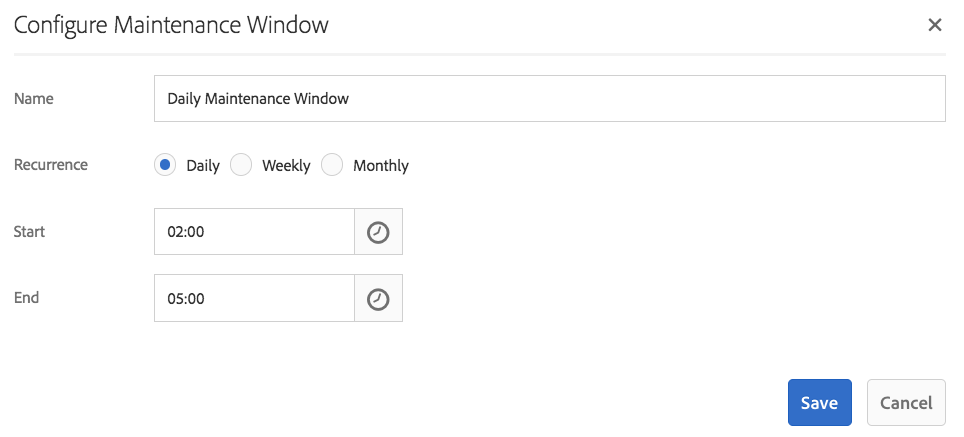

# Revisie opschonen{#revision-cleanup}

## Inleiding {#introduction}

Bij elke update van de opslagplaats wordt een inhoudsrevisie gemaakt. Als gevolg hiervan neemt bij elke update de grootte van de gegevensopslagruimte toe. Oude revisies moeten worden opgeruimd tot vrije schijfbronnen - dit is belangrijk om ongecontroleerde groei in de opslagplaats te voorkomen. Deze onderhoudsfunctionaliteit wordt Revision Cleanup genoemd. Het is als offline routine beschikbaar sinds Adobe Experience Manager (AEM) 6.0.

Met AEM 6.3 en hoger werd een onlineversie van deze functie genaamd Online Revision Cleanup geïntroduceerd. In vergelijking met de offlinerevisie Cleanup, waarbij de AEM instantie moet worden afgesloten, kan Online revisie Cleanup worden uitgevoerd terwijl de AEM online is. Onlinerevisie opschonen is standaard ingeschakeld en is de aanbevolen manier om een revisie op te schonen.

**Nota**: [ zie de Video ](https://experienceleague.adobe.com/docs/experience-manager-learn/foundation/administration/use-online-revision-clean-up.html) voor een inleiding en hoe te om Online Opruiming van de Revisie te gebruiken.

Het proces van de revisieschoonmaak bestaat uit drie fasen: **raming**, **samenperking**, en **schoonmaak**. Schatting bepaalt of de volgende fase (compensatie) al dan niet wordt uitgevoerd op basis van hoeveel huisvuil kan worden verzameld. Tijdens de samenstellingsfase worden de segmenten en de teerdossiers herschreven verlaten om het even welke ongebruikte inhoud. De opschoningsfase verwijdert vervolgens de oude segmenten, inclusief eventuele ongewenste details die deze bevatten. In de offlinemodus kan doorgaans meer ruimte worden vrijgemaakt, omdat in de onlinemodus AEM werkset moet worden opgenomen waarin extra segmenten van de verzameling behouden blijven.

Raadpleeg de volgende koppelingen voor meer informatie over Revision Cleanup:

* [Onlinerevisie-opschoning uitvoeren](/help/sites-deploying/revision-cleanup.md#how-to-run-online-revision-cleanup)
* [Online revisie opschonen Veelgestelde vragen](/help/sites-deploying/revision-cleanup.md#online-revision-cleanup-frequently-asked-questions)
* [Offline revisie opschonen uitvoeren](/help/sites-deploying/revision-cleanup.md#how-to-run-offline-revision-cleanup)

Ook, kunt u de [ officiële documentatie van Oak ](https://jackrabbit.apache.org/oak/docs/nodestore/segment/overview.html) lezen.

### Wanneer u de Online revisie-opruiming wilt gebruiken in tegenstelling tot de offlinerevisie-opruiming? {#when-to-use-online-revision-cleanup-as-opposed-to-offline-revision-cleanup}

**Online de Schoonmaakbeurt van de Revisie is de geadviseerde manier om revisie uit te voeren schoonmaak.** Offline revisie-opruiming mag alleen bij uitzondering worden gebruikt, bijvoorbeeld voordat u naar de nieuwe opslagindeling gaat of als de klantenservice u daarom verzoekt.

## Onlinerevisie-opschoning uitvoeren {#how-to-run-online-revision-cleanup}

Onlinerevisie-opschoning is standaard geconfigureerd om automatisch één keer per dag uit te voeren op zowel AEM auteur- als Publish-instanties. U hoeft alleen het onderhoudvenster te definiëren gedurende een periode met de minste gebruikersactiviteit. U kunt de Online taak van de Opruiming van de Revisie als volgt vormen:

1. In het belangrijkste AEM venster, ga naar **Hulpmiddelen - Verrichtingen - Dashboard - Onderhoud** of richt uw browser aan: `https://serveraddress:serverport/libs/granite/operations/content/maintenance.html`

   

1. Beweeg over **het Venster van het Dagelijkse Onderhoud** en klik het **pictogram van Montages**.

   

1. Ga de gewenste waarden (herhaling, begintijd, eindtijd) in en klik **sparen**.

   

Alternatief, als u de revisie schoonmaakbeurttaak manueel wilt in werking stellen, kunt u:

1. Ga naar **Hulpmiddelen - Verrichtingen - Dashboard - Onderhoud** of doorblader direct aan `https://serveraddress:serverport/libs/granite/operations/content/maintenance.html`
1. Klik het **Dagelijkse Venster van het Onderhoud**.
1. Beweeg over het **pictogram van de Opruiming van de Herziening 0&rbrace; &lbrace;.**
1. Klik **Looppas**.

   

### Online revisie opschonen na offlinerevisie opschonen uitvoeren {#running-online-revision-cleanup-after-offline-revision-cleanup}

Het opschoningsproces van de herziening herstelt oude herzieningen door generaties. Dit betekent dat telkens als u revisie in werking stelt een nieuwe generatie wordt gecreeerd en op de schijf gehouden. Er is echter een verschil tussen de twee soorten revisiereinigingen: opschoning van offline revisies houdt één generatie bij terwijl opschoning van online revisies twee generaties lang houdt. Zo, wanneer u online revisie schoonmaakbeurt **na** off-line revisie in werking stelt gebeurt het volgende:

1. Nadat de eerste opschoning van de online revisie is uitgevoerd, verdubbelt de grootte van de opslagplaats. Dit gebeurt omdat er nu twee generaties op schijf zitten.
1. Tijdens de volgende runtime zal de opslagplaats tijdelijk groeien terwijl de nieuwe generatie wordt gemaakt en zich vervolgens stabiliseren tot de grootte die het had na de eerste run, terwijl het proces voor online revisie-opruiming de vorige generatie opruimt.

Houd er ook rekening mee dat elke generatie afhankelijk van het type en het aantal bewerkingen een andere grootte kan hebben dan de vorige, zodat de uiteindelijke grootte van de afzonderlijke bewerkingen kan verschillen.

Daarom wordt aanbevolen de schijf minstens twee of drie keer groter te maken dan de aanvankelijk geschatte grootte van de opslagplaats.

## Compactiemodi voor volledig en op het spoor  {#full-and-tail-compaction-modes}

**AEM 6.5** introduceert **twee nieuwe wijzen** voor de **samenstellingsfase** van het Online proces van de Opruiming van de Revisie:

* De **volledige samenstellingswijze** herschrijft alle segmenten en teerdossiers in de volledige bewaarplaats. De volgende opschoningsfase kan zo de maximumhoeveelheid huisvuil over de bewaarplaats verwijderen. Omdat volledige compactie de volledige bewaarplaats beïnvloedt, vereist het een aanzienlijke hoeveelheid systeemmiddelen en tijd om te voltooien. De volledige compactie komt overeen met de verdichtingsfase in AEM 6.3.
* De **wijze van de staartcompressie** herschrijft slechts de meest recente segmenten en teerdossiers in de bewaarplaats. De meest recente segmenten en teerbestanden zijn de segmenten die zijn toegevoegd sinds de laatste keer dat de volledige of eindcompressie is uitgevoerd. De volgende opschoningsfase kan dus alleen het afval verwijderen dat zich in het recente deel van de opslagplaats bevindt. Omdat de staartcompensatie slechts een deel van de bewaarplaats beïnvloedt, vereist het aanzienlijk minder systeemmiddelen en tijd om te voltooien dan volledige compensatie.

Deze methoden van verrekening vormen een afweging tussen efficiëntie en hulpbronnengebruik: hoewel de verdichtingsmethode bij staarten minder effectief is, heeft deze ook minder invloed op de normale werking van het systeem. Daarentegen is volledige compressie effectiever, maar heeft deze een grotere invloed op de normale werking van het systeem.

AEM 6.5 introduceert ook een efficiënter mechanisme voor het dedupliceren van inhoud tijdens het comprimeren, waardoor de ruimte op de schijf van de opslagplaats verder wordt verkleind.

De twee onderstaande grafieken zijn de resultaten van interne laboratoriumtests die de vermindering van de gemiddelde uitvoeringstijden en de gemiddelde voetafdruk op de schijf in AEM 6.5 ten opzichte van AEM 6.3 aantonen:

 

### Hoe te om Volledige en Samenstelling van het Lusje te vormen {#how-to-configure-full-and-tail-compaction}

Bij de standaardconfiguratie wordt &#39;tail&#39;-compressie uitgevoerd op weekdagen en &#39;full compaction&#39; op zondag. De standaardconfiguratie kan worden veranderd door de nieuwe configuratiewaarde `full.gc.days` van de `RevisionCleanupTask` [ onderhoudstaak ](/help/sites-deploying/revision-cleanup.md#how-to-run-online-revision-cleanup) te gebruiken.

Wanneer u de waarde `full.gc.days` configureert, wordt de volledige compressie uitgevoerd tijdens de dagen die zijn gedefinieerd in de waarde en de eindcompressie tijdens de dagen die niet zijn gedefinieerd in de waarde. Als u bijvoorbeeld volledige compressie configureert om op zondag te worden uitgevoerd, wordt de compressie van de staart van maandag tot en met zaterdag uitgevoerd. Bijvoorbeeld, als u volledige compilatie vormt om elke dag van de week in werking te stellen dan de staarverbinding bij geen enkel loopt.

Houd er ook rekening mee dat:

* **de samenperking van het Lusje** is minder effectief en het heeft minder effect op normale systeemverrichtingen. Het is dus de bedoeling dat het gedurende werkdagen wordt uitgevoerd.
* **Volledige compensatie** is effectiever maar heeft ook een grotere invloed op normale systeemverrichtingen. Het is dus bedoeld om buiten werkdagen te worden gebruikt.
* Zowel de staartvervorming als de volledige vervorming zouden moeten worden gepland om tijdens buiten piekuren te lopen.

### Problemen oplossen {#troubleshooting}

Houd rekening met het volgende wanneer u de nieuwe compressiemodi gebruikt:

* U kunt de invoer-/uitvoeractiviteit (I/O) controleren, bijvoorbeeld: I/O-bewerkingen, CPU die wacht op IO, wachtrijgrootte vastleggen. Dit helpt bepalen of het systeem I/O verbindend wordt en vereist upsizing.
* De `RevisionCleanupTaskHealthCheck` geeft de algemene status van de Online revisie-opschoning aan. Het werkt op dezelfde manier als in AEM 6.3 en maakt geen onderscheid tussen volledige en eindverdichtingen.
* De logberichten bevatten relevante informatie over de compactiemodi. Bijvoorbeeld, wanneer de Online Opruiming van de Revisie begint, wijzen de overeenkomstige logboekberichten op de samenstellingswijze. Ook, in sommige hoekgevallen, keert het systeem aan volledige compressie terug wanneer het werd gepland om een staartcompensatie in werking te stellen en de logboekberichten wijzen op deze verandering. De hieronder logboeksteekproeven wijzen op de samenstellingswijze en de verandering van staart in volledige compressie:

```
TarMK GC: running tail compaction
TarMK GC: no base state available, running full compaction instead
```

### Bekende beperkingen {#known-limitations}

Soms vertraagt het opruimen door het afwisselen tussen de eindmodus en de volledige-compressiemodi. Meer in het bijzonder, zal de bewaarplaats na een volledige compensatie groeien (het verdubbelt in grootte). De extra ruimte wordt teruggewonnen in de verdere staartcompensatie, wanneer de bewaarplaats onder de pre-volledige compactiegrootte daalt. Parallelle uitvoering van onderhoudstaken moet ook worden vermeden.

**het wordt geadviseerd om de schijf minstens twee of drie keer groter te zijn dan de aanvankelijk geschatte bewaarplaatgrootte.**

## Online revisie opschonen Veelgestelde vragen {#online-revision-cleanup-frequently-asked-questions}

### Overwegingen bij AEM 6.5-upgrade {#aem-upgrade-considerations}

<table style="table-layout:auto">
 <tbody>
  <tr>
   <td>Vragen </td>
   <td>Antwoorden</td>
  </tr>
  <tr>
   <td>Wat zou ik van op de hoogte moeten zijn wanneer ik aan AEM 6.5 opwaardeer?</td>
   <td><p>De persistentieformaat van TarMK verandert met AEM 6.5. Deze wijzigingen vereisen geen proactieve migratiestap. Bestaande opslagruimten doorlopen een rolmigratie, die transparant is voor de gebruiker. Het migratieproces wordt voor het eerst gestart AEM 6.5 (of verwante tools) toegang tot de opslagplaats.</p> <p><strong>Nadat de migratie naar de AEM 6.5 persistentieformulier is gestart, kan de repository niet worden teruggezet naar de vorige AEM 6.3 persistentieformaat.</strong></p> </td>
  </tr>
 </tbody>
</table>

### Migreren naar Oak Segment Tar {#migrating-to-oak-segment-tar}

<table style="table-layout:auto">
 <tbody>
  <tr>
   <td><strong>Vragen</strong></td>
   <td><strong>Antwoorden</strong></td>
   <td> </td>
  </tr>
  <tr>
   <td><strong>Waarom moet ik de repository migreren?</strong></td>
   <td><p>In AEM 6.3 waren wijzigingen in de opslagindeling nodig, vooral om de prestaties en effectiviteit van Online Revision Cleanup te verbeteren. Deze wijzigingen zijn niet compatibel met oudere versies en opslagruimten die zijn gemaakt met het oude Oak-segment (AEM 6.2 en lager) moeten worden gemigreerd.</p> <p>Extra voordelen van het wijzigen van de opslagindeling:</p>
    <ul>
     <li>Betere schaalbaarheid (geoptimaliseerde segmentgrootte).</li>
     <li>Sneller <a href="/help/sites-administering/data-store-garbage-collection.md" target="_blank"> de Inzameling van de Opslag van Gegevens </a>.<br /> </li>
     <li>Grondwerkzaamheden voor toekomstige verbeteringen.</li>
    </ul> </td>
   <td> </td>
  </tr>
  <tr>
   <td><strong>Wordt de vorige opmaak van de Tar nog steeds ondersteund?</strong></td>
   <td>Alleen de nieuwe Oak Segment Tar wordt ondersteund met AEM 6.3 of hoger.</td>
   <td> </td>
  </tr>
  <tr>
   <td><strong>Is migratie van inhoud altijd verplicht?</strong></td>
   <td>Ja. Tenzij u met een nieuw exemplaar begint, zult u altijd de inhoud moeten migreren.</td>
   <td> </td>
  </tr>
  <tr>
   <td><strong>Kan ik upgraden naar 6.3 of hoger en de migratie later uitvoeren (bijvoorbeeld met een ander onderhoudsvenster)?</strong></td>
   <td>Nee, zoals hierboven is uiteengezet, is migratie van inhoud verplicht.</td>
   <td> </td>
  </tr>
  <tr>
   <td><strong>Kan downtime tijdens migreren worden voorkomen?</strong></td>
   <td>Nee. Dit is een eenmalige inspanning die niet op een lopende instantie kan worden gedaan.</td>
   <td> </td>
  </tr>
  <tr>
   <td><strong>Wat gebeurt er als ik per ongeluk tegen de verkeerde gegevensopslagindeling looppas?</strong></td>
   <td>Als u probeert om de eiken-segmentmodule tegen een eak-segment-teer bewaarplaats (of omgekeerd) in werking te stellen, ontbreekt het opstarten met een <em> IllegalStateException </em> met het bericht "Ongeldig segmentformaat". Er treedt geen gegevensbeschadiging op.</td>
   <td> </td>
  </tr>
  <tr>
   <td><strong>Zal een herindex van de zoekindexen noodzakelijk zijn?</strong></td>
   <td>Nee. Bij het migreren van een eikensegment naar een eikensegment worden wijzigingen aangebracht in de containerindeling. De ingesloten gegevens worden niet beïnvloed en worden niet gewijzigd.</td>
   <td> </td>
  </tr>
  <tr>
   <td><strong>Hoe kan de verwachte schijfruimte die tijdens en na de migratie nodig is het beste worden berekend?</strong></td>
   <td>De migratie is gelijk aan het opnieuw maken van de segmentstore in de nieuwe indeling. Dit kan worden gebruikt om de extra schijfruimte te schatten nodig tijdens migratie. Na de migratie kan de oude segmentwinkel worden verwijderd om ruimte vrij te maken.</td>
   <td> </td>
  </tr>
  <tr>
   <td><strong>Hoe kan de duur van de migratie het best worden ingeschat?</strong></td>
   <td>De prestaties van de migratie kunnen zeer worden verbeterd als <a href="/help/sites-deploying/revision-cleanup.md#how-to-run-offline-revision-cleanup"> off-line revisie schoonmaakbeurt </a> voorafgaand aan de migratie wordt uitgevoerd. Alle klanten wordt geadviseerd om het als eerste vereiste van het verbeteringsproces uit te voeren. In het algemeen, zou de duur van de migratie aan de duur van de off-line revisie schoonmaakbeurttaak gelijkaardig moeten zijn, veronderstellend dat de off-line revisie schoonmaakbeurttaak vóór de migratie is uitgevoerd.</td>
   <td> </td>
  </tr>
 </tbody>
</table>

### Onlinerevisie opschonen uitvoeren {#running-online-revision-cleanup}

<table style="table-layout:auto">
 <tbody>
  <tr>
   <td><strong>Vragen</strong></td>
   <td><strong>Antwoorden</strong></td>
   <td> </td>
  </tr>
  <tr>
   <td><strong>Hoe vaak moet Onlinerevisie opschonen worden uitgevoerd?</strong></td>
   <td>Eenmaal per dag. Dit is de standaardconfiguratie in het Dashboard van Verrichtingen.</td>
   <td> </td>
  </tr>
  <tr>
   <td><strong>Hoe kan ik de begintijd van de Online het onderhoudstaak van de Opruiming van de Revisie vormen?</strong></td>
   <td>Zie <a href="/help/sites-deploying/revision-cleanup.md#how-to-run-online-revision-cleanup"> hoe te om Online sectie van de Opruiming van de Revisie </a> in werking te stellen. </td>
   <td> </td>
  </tr>
  <tr>
   <td><strong>Is er een maximumfrequentie die niet mag worden overschreden voor Online revisie-opschoning?</strong></td>
   <td>Het wordt geadviseerd om Online Opruiming van de Revisie eenmaal per dag in werking te stellen, zoals die door gebrek wordt gevormd.<br /> </td>
   <td> </td>
  </tr>
  <tr>
   <td><strong>Wat zijn de belangrijkste indicatoren die de frequentie bepalen waarop Online de Opruiming van de Revisie zou moeten worden in werking gesteld?</strong></td>
   <td>Er is geen behoefte om de frequentie te bepalen aangezien de Online Opruiming van de Revisie als onderhoudstaak wordt gevormd en het automatisch elke dag loopt.</td>
   <td> </td>
  </tr>
  <tr>
   <td><strong>Waarom wordt bij Online revisie-opruiming geen ruimte vrijgemaakt wanneer deze voor het eerst wordt uitgevoerd?</strong></td>
   <td>Met Online revisie opschonen worden oude revisies door generaties teruggezet. Elke keer dat de revisie wordt opgeschoond, wordt een nieuwe generatie gegenereerd. Alleen de inhoud die minstens twee generaties oud is, zal worden teruggevorderd, wat betekent dat er voor het eerst niets terug te vorderen is.</td>
   <td> </td>
  </tr>
  <tr>
   <td><strong>Waarom wint de eerste Online Opruiming van de Revisie geen ruimte terug wanneer die na de Offline Opruiming van de Revisie in werking wordt gesteld?</strong></td>
   <td><p>Met Offline revisie Cleanup wordt alles geherclaimd, behalve de nieuwste generatie in vergelijking met de nieuwste twee generaties voor online revisie Cleanup. Als er een nieuwe opslagplaats is, zal Online Revision Cleanup geen ruimte terugwinnen wanneer deze voor de eerste keer na de Offline Revision Cleanup wordt uitgevoerd omdat er geen generatie oud genoeg is om te worden teruggewonnen.</p> <p>Ook, leest de "Lopende Online Opruiming van de Revisie na de Off-line sectie van de Opruiming van de Revisie van <a href="/help/sites-deploying/revision-cleanup.md#how-to-run-online-revision-cleanup"> dit hoofdstuk </a>.</p> </td>
   <td> </td>
  </tr>
  <tr>
   <td><strong>Zouden Auteur en Publish normaal gesproken verschillende vensters voor het opruimen van revisies hebben?</strong></td>
   <td>Dit hangt van kantooruren en de verkeerspatronen van de klant online aanwezigheid af. De onderhoudsvensters moeten buiten de hoofdproductietijden worden geconfigureerd om de beste schoonmaakefficiëntie te waarborgen. Voor meerdere AEM Publish-instanties (TarMK Farm) moeten onderhoudsvensters voor Online Revision Cleanup worden gefaseerd.</td>
   <td> </td>
  </tr>
  <tr>
   <td><strong>Zijn er om het even welke eerste vereisten alvorens Online de Opruiming van de Revisie in werking te stellen?</strong></td>
   <td><p>Online Revision Cleanup is alleen beschikbaar bij AEM 6.3 en hoger. Ook, als u een oudere versie van AEM gebruikt, moet u aan nieuwe <a href="/help/sites-deploying/revision-cleanup.md#migrating-to-oak-segment-tar"> Tar van het Segment van Oak migreren </a>.</p> </td>
   <td> </td>
  </tr>
  <tr>
   <td><strong>Wat zijn de factoren die de duur van de Online Opruiming van de Revisie bepalen?</strong></td>
   <td>De factoren zijn:<br />
    <ul>
     <li>Grootte opslagplaats</li>
     <li>Laden op het systeem (aanvragen per minuut, schrijven specifiek bewerkingen)</li>
     <li>Activiteitspatroon (lezen versus schrijven)</li>
     <li>Hardwarespecificaties (CPU-prestaties, geheugen, IOPS)</li>
    </ul> </td>
   <td> </td>
  </tr>
  <tr>
   <td><strong>Kunnen auteurs nog steeds werken terwijl Online revisie Cleanup wordt uitgevoerd?</strong></td>
   <td>Ja, Online Revision Cleanup kan gelijktijdige schrijvingen verwerken. Onlinerevisie opschonen werkt echter sneller en efficiënter zonder gelijktijdige schrijftransacties. De Adobe adviseert het plannen van de Online het onderhoudstaak van de Opruiming van de Revisie aan een vrij rustige tijd zonder veel verkeer.</td>
   <td> </td>
  </tr>
  <tr>
   <td><strong>Wat zijn de minimumvereisten voor schijfruimte en heapgeheugen wanneer het runnen van Online Herziening Opschoning?</strong></td>
   <td><p>De schijfruimte wordt voortdurend gecontroleerd tijdens het online opschonen van revisies. Als de beschikbare schijfruimte onder een kritieke waarde daalt, wordt het proces geannuleerd. De kritieke waarde is 25% van de huidige schijfvoetafdruk van de opslagplaats en kan niet worden geconfigureerd.</p> <p><strong>Adobe raadt u aan de schijf minstens twee of drie keer groter te maken dan de aanvankelijk geschatte grootte van de opslagplaats.</strong></p> <p>De vrije heapruimte wordt voortdurend gecontroleerd tijdens het schoonmaakproces. Als de vrije heapruimte onder een kritieke waarde daalt, wordt het proces geannuleerd. De kritieke waarde wordt gevormd door org.apache.jackrabbit.segment.SegmentNodeStoreService#MEMORY_THRESHOLD. De standaardwaarde is 15%.</p> <p>Recommendations for minimum compaction heap sizing are not separated from the AEM memory sizing recommendations. Algemeen: <strong> als een AEM instantie genoeg wordt gerangschikt om de gebruiksgevallen en verwachte nuttige lading daarop te behandelen, verkrijgt het schoonmaakbeurtproces genoeg geheugen.</strong></p> </td>
   <td> </td>
  </tr>
  <tr>
   <td><strong>Wat is het verwachte effect op de prestaties tijdens het uitvoeren van Online Revision Cleanup?</strong></td>
   <td>Online Revision Cleanup is een achtergrondproces dat tegelijkertijd leest van en schrijft naar de opslagplaats voor normale systeembewerkingen. Het kan met name nodig zijn om gedurende een korte periode exclusieve toegang tot de opslagplaats te verkrijgen, waardoor andere draden niet in de opslagplaats kunnen worden geschreven.</td>
   <td> </td>
  </tr>
  <tr>
   <td><strong>Hoe lang wordt de Online Correctie van de Revisie verwacht om te lopen?</strong></td>
   <td>Het duurt niet langer dan twee uur om te worden uitgevoerd volgens de meest recente Adobe van prestatietests die intern worden uitgevoerd.</td>
   <td> </td>
  </tr>
  <tr>
   <td><strong>Wat moet u doen als het opruimen van online revisies langer duurt?</strong></td>
   <td>
    <ul>
     <li>Zorg ervoor dat het dagelijks wordt uitgevoerd.<br /> </li>
     <li>Zorg ervoor dat het tijdens minimale opslagruimteactiviteiten wordt uitgevoerd door de onderhoudsvensters in het Dashboard van Verrichtingen dienovereenkomstig te configureren.</li>
     <li>Schaal de systeembronnen (CPU, geheugen, I/O) op.</li>
    </ul> </td>
   <td> </td>
  </tr>
  <tr>
   <td><strong>Wat gebeurt als de Online Opruiming van de Revisie gevormde Vensters van het Onderhoud overschrijdt?</strong></td>
   <td>Zorg ervoor dat andere onderhoudstaken de uitvoering ervan niet vertragen. Dit zou het geval kunnen zijn als meer onderhoudstaken dan Online Revision Cleanup binnen het zelfde onderhoudsvenster worden uitgevoerd. Onderhoudstaken worden opeenvolgend uitgevoerd zonder een configureerbare volgorde.</td>
   <td> </td>
  </tr>
  <tr>
   <td><strong>Waarom wordt afvalophaling overgeslagen?</strong></td>
   <td><p>Herzieningsopschoning is gebaseerd op een schattingsfase om te bepalen of er voldoende afval is om te worden schoongemaakt. De schatter vergelijkt de huidige grootte met de grootte van de bewaarplaats nadat het laatst werd vergeleken. Als de grootte de gevormde delta overschrijdt, schoonmaakbeurtlooppas. De delta van de grootte wordt geplaatst op 1 GB. Dit betekent in feite dat als de grootte van de opslagplaats sinds de laatste schoonmaakbeurt niet met 1 GB is toegenomen, de nieuwe herhaling van de revisie wordt overgeslagen. </p> <p>Hieronder staan de relevante logitems voor de ramingsfase:</p>
    <ul>
     <li>De looppas van GC van de revisie: <em> de delta van de Grootte is N% of N/N (N/N bytes), zo lopend compaction </em></li>
     <li>De controle GC stelt <strong> niet </strong> in werking: <em> de delta van de Grootte is N% of N/N (N/N bytes), zo overgevend compensatie voor nu </em></li>
    </ul> </td>
   <td> </td>
  </tr>
  <tr>
   <td><strong>Is het mogelijk om de automatische compressie veilig af te breken als de invloed op de prestaties te groot is?</strong></td>
   <td>Ja. Sinds AEM 6.3, kan het veilig door middel van het Venster van de Taak van het Onderhoud binnen het Dashboard van Verrichtingen of door middel van JMX worden tegengehouden.</td>
   <td> </td>
  </tr>
  <tr>
   <td><strong>Als de AEM instantie tijdens een geplande opschoontaak wordt gesloten, veilig afbreekt het proces, of wordt de sluiting geblokkeerd tot de compensatie heeft gebeëindigd?</strong></td>
   <td>Revision Cleanup wordt onderbroken en de repository wordt veilig afgesloten.</td>
   <td> </td>
  </tr>
  <tr>
   <td><strong>Wat gebeurt er als het systeem vastloopt tijdens het opschonen van de online revisie?</strong></td>
   <td>In dergelijke gevallen bestaat er geen risico op gegevensbeschadiging. Restrevers worden opgeschoond door een volgende run.</td>
   <td> </td>
  </tr>
  <tr>
   <td><strong>Wat is de impact van het niet uitvoeren van Online Revision Cleanup?</strong></td>
   <td>Verslechtering van prestaties in de loop der tijd.</td>
   <td> </td>
  </tr>
  <tr>
   <td><strong>Welke herzieningen worden verzameld?</strong></td>
   <td>Standaard verzamelt de Online revisie-opruiming alleen revisies die minstens 24 uur oud zijn.</td>
   <td> </td>
  </tr>
  <tr>
   <td><strong>Wat gebeurt er als er te veel interferentie is van gelijktijdige schrijfbewerkingen naar de opslagplaats?</strong></td>
   <td><p>Als er schrijfgelijktijdig op het systeem is, zou de online revisie schoonmaakbeurt exclusieve schrijftoegang kunnen vereisen om de veranderingen aan het eind van een samenstellingscyclus te kunnen begaan. Het systeem gaat in <strong> forceCompact wijze </strong>, zoals die in meer detail in de <a href="https://jackrabbit.apache.org/oak/docs/nodestore/segment/overview.html" target="_blank"> documentatie van Oak </a> wordt verklaard. Tijdens forceren compact, wordt een exclusieve schrijfslot verworven om de veranderingen definitief te begaan zonder enige gelijktijdige schrijft het storen. Om de impact op responstijden te beperken, kan een time-outwaarde worden gedefinieerd. Deze waarde wordt standaard ingesteld op één minuut. Dit betekent dat als het compacte effect niet binnen één minuut wordt voltooid, het verrekeningsproces wordt afgebroken ten gunste van gelijktijdige verbintenissen.</p> <p>De duur van het forceren is afhankelijk van de volgende factoren:</p>
    <ul>
     <li>hardware: specifiek IOPS. De duur neemt af met meer IOPS.</li>
     <li>de grootte van de segmentopslag: duurverhogingen met de grootte van de segmentopslag.</li>
    </ul> </td>
   <td> </td>
  </tr>
  <tr>
   <td><p><strong>Hoe wordt de Online Opruiming van de Revisie uitgevoerd op een reserve instantie?</strong></p> </td>
   <td><p>In een koude stand-by opstelling, slechts moet de primaire instantie worden gevormd om Online de Opruiming van de Revisie in werking te stellen. Voor de stand-by instantie hoeft de Online Revision Cleanup niet specifiek te worden gepland.</p> <p>De bijbehorende bewerking op een stand-byinstantie is de automatische opschoning. Dit komt overeen met de opschoningsfase van de Online revisie-opschoning. De automatische opschoning wordt uitgevoerd op de reservekopie na de uitvoering van de Online revisie-opschoning op de primaire instantie.</p> <p>Schatings- en samenstellingsfasen worden niet uitgevoerd op een stand-byinstantie.</p> </td>
   <td> </td>
  </tr>
  <tr>
   <td><strong>Kan offlinerevisie opschonen meer schijfruimte vrijmaken dan online revisie opschonen?</strong></td>
   <td><p>Met Offline revisie-opruiming kunnen oude revisies direct worden verwijderd, terwijl bij Online revisie-opruiming rekening moet worden gehouden met oude revisies waarnaar nog steeds wordt verwezen door de toepassingsstapel. Het eerste kan zo afval agressiever verwijderen dan het laatste waar het effect wordt geamortiseerd tijdens een paar afvalophalingscycli.</p> <p>Ook, leest de "Lopende Online Opruiming van de Revisie na de Off-line sectie van de Opruiming van de Revisie van <a href="/help/sites-deploying/revision-cleanup.md#how-to-run-online-revision-cleanup"> dit hoofdstuk </a>.</p> </td>
   <td> </td>
  </tr>
  <tr>
   <td>Eventuele overwegingen met betrekking tot bestandsbewerkingen die zijn toegewezen aan het geheugen?</td>
   <td>
    <ul>
     <li><strong> op de milieu's van Vensters </strong>, wordt de regelmatige dossiertoegang altijd afgedwongen zodat geheugen in kaart gebrachte toegang niet wordt gebruikt. Als algemeen advies, zou al beschikbaar RAM aan de heap moeten worden toegewezen en de segmentcachegrootte zou moeten worden verhoogd. U verhoogt segmentCache door de segmentCache.size optie aan org.apache.jackrabbit.segment.SegmentNodeStoreService.config (bijvoorbeeld, segmentCache.size=20480) toe te voegen. Vergeet niet wat RAM-geheugen over te houden voor het besturingssysteem en andere processen.</li>
     <li><strong> op milieu's niet-Vensters </strong>, vergroot de grootte van het fysieke geheugen om de geheugenafbeelding van de bewaarplaats te verbeteren.</li>
    </ul> </td>
   <td>
    <ul>
     <li> </li>
    </ul> </td>
  </tr>
 </tbody>
</table>

### Onlinerevisie controleren {#monitoring-online-revision-cleanup}

<table style="table-layout:auto">
 <tbody>
  <tr>
   <td><strong>Wat moet worden gecontroleerd tijdens Online revisie Cleanup?</strong></td>
   <td>
    <ul>
     <li>De schijfruimte moet worden bewaakt wanneer Online revisie-opschoning is ingeschakeld. De opschoonbewerking wordt niet uitgevoerd of wordt voortijdig beëindigd wanneer er onvoldoende schijfruimte is.</li>
     <li>Controleer de logboeken op de voltooiingstijd van Online Revision Cleanup. Het mag niet langer dan 2 uur duren.</li>
     <li>Aantal controlepunten. Als er meer dan 3 controlepunten zijn wanneer de samenstellingslooppas het wordt geadviseerd om de controlepunten schoon te maken.</li>
    </ul> </td>
   <td> </td>
  </tr>
  <tr>
   <td><strong>Hoe te om te controleren als Online Correctie van de Revisie met succes heeft voltooid?</strong></td>
   <td><p>U kunt controleren of de Online revisie-opruiming is voltooid door de logbestanden te controleren.</p> <p>Bijvoorbeeld, "<code>TarMK GC #{}: compaction completed in {} ({} ms), after {} cycles</code>"betekent de met succes voltooide samenstellingsstap tenzij voorafgegaan door het bericht "<code>TarMK GC #{}: compaction gave up compacting concurrent commits after {} cycles</code>", wat betekent er teveel gezamenlijke lading was.</p> <p>Het correspondentatieve is er een bericht "<code>TarMK GC #{}: cleanup completed in {} ({} ms</code>"voor de succesvolle voltooiing van de schoonmaakbeurt stap.</p> </td>
   <td><p> </p> </td>
  </tr>
  <tr>
   <td><strong>Waar vinden we de statistieken van de laatste online executies van de Herziening?</strong></td>
   <td><p>De status, de vooruitgang, en de statistieken worden blootgesteld via JMX (<code>SegmentRevisionGarbageCollection</code> MBean). Voor meer details over <code>SegmentRevisionGarbageCollection</code> MBean, lees <a href="https://jackrabbit.apache.org/oak/docs/nodestore/segment/overview.html#monitoring-via-jmx" target="_blank"> volgend paragraaf </a>.</p> <p>De voortgang kan worden bijgehouden via het kenmerk <code>EstimatedRevisionGCCompletion</code> van het <code>SegmentRevisionGarbageCollection MBean.</code></p> <p>U kunt een verwijzing van MBean verkrijgen gebruikend <code>ObjectName org.apache.jackrabbit.oak:name="Segment node store revision garbage collection",type="SegmentRevisionGarbageCollection"</code>.</p> <p>De statistieken zijn alleen beschikbaar sinds de laatste systeemstart. <a href="/help/sites-administering/operations-dashboard.md#monitoring-with-external-services" target="_blank"> Extern controlehulpmiddel kon worden gebruikt om de gegevens voorbij AEM uptime </a> te houden.</p> </td>
   <td> </td>
  </tr>
  <tr>
   <td><strong>Wat zijn relevante logbestandvermeldingen?</strong></td>
   <td>
    <ul>
     <li>Onlinerevisie-opschoning is gestart/gestopt
      <ul>
       <li>De online Opruiming van de Revisie bestaat uit drie fasen: raming, compensatie, en schoonmaakbeurt. Schatting kan compaction en schoonmaakbeurt dwingen om over te slaan als de bewaarplaats niet genoeg huisvuil bevat. In de recentste versie van AEM, merkt het bericht "<code>TarMK GC #{}: estimation started</code>"het begin van raming, "<code>TarMK GC #{}: compaction started, strategy={}</code>"het begin van compensatie en "T <code>arMK GC #{}: cleanup started. Current repository size is {} ({} bytes</code>"merkt het begin van schoonmaakbeurt.</li>
      </ul> </li>
     <li>Schijfruimte die wordt opgeschoond door de revisie
      <ul>
       <li>De ruimte wordt slechts teruggewonnen wanneer de schoonmaakfase voltooit. De voltooiing van de schoonmaakbeurt fase wordt duidelijk door het logboekbericht "T <code>arMK GC #{}: cleanup completed in {} ({} ms</code>". De opschoningsgrootte van Post is {} ({} bytes) en ruimte teruggewonnen {} ({} bytes). Het gewicht/de diepte van de compactiekaart is {}/ {} ({} bytes/{}).".</li>
      </ul> </li>
     <li>Er is een probleem opgetreden tijdens het opschonen van de revisie
      <ul>
       <li>Er zijn vele mislukkingsvoorwaarden, worden elk duidelijk door WARN of FOUT logboekberichten die met "TarMK GC"beginnen.</li>
      </ul> </li>
    </ul> <p>Ook, zie het <a href="/help/sites-deploying/revision-cleanup.md#troubleshooting-based-on-error-messages"> Oplossen van problemen die op de sectie van de Berichten van de Fout </a> hieronder worden gebaseerd.</p> </td>
   <td> </td>
  </tr>
  <tr>
   <td><strong>Hoe te om te controleren hoeveel ruimte werd teruggewonnen nadat de Online Opruiming van de Revisie heeft voltooid?</strong></td>
   <td>Er is een bericht in het logboek aan het eind van de opschooncyclus: "<code>TarMK GC #3: cleanup completed</code>"die de grootte van de bewaarplaats en de hoeveelheid geregenereerd huisvuil omvat.</td>
   <td> </td>
  </tr>
  <tr>
   <td><strong>Hoe kan de integriteit van de opslagplaats worden gecontroleerd nadat de Online Revision Cleanup is voltooid?</strong></td>
   <td><p>Er is geen integriteitscontrole voor de repository nodig nadat de Online Revision Cleanup is uitgevoerd. </p> <p>U kunt echter de volgende handelingen uitvoeren om de status van de opslagplaats te controleren na het opschonen:</p>
    <ul>
     <li>Een bewaarplaats <a href="/help/sites-deploying/consistency-check.md" target="_blank"> traversal controle </a></li>
     <li>Gebruik het gereedschap voor het uitvoeren van de eik nadat het opschoonproces is voltooid om te controleren op inconsistenties. Voor verdere informatie over hoe te om dit te doen, controleer de <a href="https://github.com/apache/jackrabbit-oak/blob/trunk/oak-doc/src/site/markdown/nodestore/segment/overview.md#check" target="_blank"> Documentatie Apache.</a> U hoeft AEM niet uit te schakelen om het gereedschap uit te voeren.</li>
    </ul> </td>
   <td> </td>
  </tr>
  <tr>
   <td><strong>Hoe te om te ontdekken als de Online Opruiming van de Revisie heeft ontbroken en welke stappen zijn om te herstellen?</strong></td>
   <td>De voorwaarden van de mislukking worden duidelijk door WARN of FOUTlogboekberichten die met "TarMK GC"beginnen. Ook, zie het <a href="/help/sites-deploying/revision-cleanup.md#troubleshooting-based-on-error-messages"> Oplossen van problemen die op de sectie van de Berichten van de Fout </a> hieronder worden gebaseerd.</td>
   <td> </td>
  </tr>
  <tr>
   <td><strong>Welke informatie wordt in de Controle van de Gezondheid van de Reinigingscontrole van de Revisie blootgesteld? Hoe en wanneer dragen ze bij aan de statusniveaus van de kleurcodering? </strong></td>
   <td><p>De Controle van de Gezondheid van de Reiniging van de Herziening maakt deel uit van het <a href="/help/sites-administering/operations-dashboard.md#health-reports" target="_blank"> Dashboard van Verrichtingen </a>.<br /> </p> <p>De status is <strong> GROEN </strong> als de laatste uitvoering van de Online het onderhoudstaak van de Opruiming van de Revisie met succes heeft voltooid.</p> <p>Het is <strong> GEEL </strong> als de Online het onderhoudstaak van de Opruiming van de Revisie eens werd geannuleerd.<br /> </p> <p>Het is <strong> ROOD </strong> als de Online het onderhoudstaak van de Opruiming van de Revisie drie keer in een rij werd geannuleerd. <strong> In dit geval wordt de handinteractie vereist </strong> of de Online Opruimen van de Revisie zal waarschijnlijk opnieuw ontbreken. Voor meer informatie, lees de </a> sectie van het Oplossen van problemen <a href="/help/sites-deploying/revision-cleanup.md#troubleshooting-online-revision-cleanup"> hieronder.<br /> </p> <p>Ook wordt de status van de Health Check opnieuw ingesteld nadat het systeem opnieuw is opgestart. Dus een nieuw opgestarte instantie toont een groene status op de Revision Cleanup Health Check.  <a href="/help/sites-administering/operations-dashboard.md#monitoring-with-external-services" target="_blank"> Extern controlehulpmiddel kon worden gebruikt om de gegevens voorbij AEM uptime </a> te houden.</p> </td>
   <td> </td>
  </tr>
  <tr>
   <td><p><strong>Hoe te om Automatische Opschoning op een reserve instantie te controleren?</strong></p> </td>
   <td><p>De status, de vooruitgang, en de statistieken worden blootgesteld via JMX door <code>SegmentRevisionGarbageCollection</code> MBean te gebruiken. Zie ook de volgende <a href="https://jackrabbit.apache.org/oak/docs/nodestore/segment/overview.html#monitoring-via-jmx" target="_blank"> documentatie van Oak </a>. </p> <p>U kunt een verwijzing van MBean verkrijgen door <code>ObjectName org.apache.jackrabbit.oak:name="Segment node store revision garbage collection",type="SegmentRevisionGarbageCollection"</code> te gebruiken.</p> <p>De statistieken zijn alleen beschikbaar sinds de laatste systeemstart.  <a href="/help/sites-administering/operations-dashboard.md#monitoring-with-external-services" target="_blank"> Extern controlehulpmiddel kon worden gebruikt om de gegevens voorbij AEM uptime </a> te houden.</p> <p>De logboekdossiers kunnen ook worden gebruikt om de status, de vooruitgang, en de statistieken van de Automatische Opruiming te controleren.</p> </td>
   <td> </td>
  </tr>
  <tr>
   <td><p><strong>Wat moet tijdens Automatische Opschoning op een reserve instantie worden gecontroleerd?</strong></p> </td>
   <td>
    <ul>
     <li>De schijfruimte moet worden bewaakt wanneer de automatische opschoning wordt uitgevoerd.</li>
     <li>Voltooiingstijd (via de logboeken) om ervoor te zorgen dat 2 uur niet wordt overschreden.</li>
     <li>De grootte van de segmentstore nadat de Automatische Opschoning in werking is gesteld. De grootte van de segmentstore op de standby-instantie moet ongeveer gelijk zijn aan die op de primaire instantie.</li>
    </ul> </td>
   <td> </td>
  </tr>
 </tbody>
</table>

### Oplossen van problemen met online revisie {#troubleshooting-online-revision-cleanup}

<table style="table-layout:auto">
 <tbody>
  <tr>
   <td><strong>Wat is het ergste dat kan gebeuren als u de Online Opruiming van de Revisie niet in werking stelt?</strong></td>
   <td>De AEM instantie loopt zonder schijfruimte, wat productieonderbrekingen veroorzaakt.</td>
   <td> </td>
  </tr>
  <tr>
   <td><strong>Is het hoge gebruikersverkeer problematisch voor het runnen van Online Opruiming van de Revisie op een publicatieinstantie?</strong></td>
   <td>Het hoge gebruikersverkeer beïnvloedt of de samenstellingsfase met succes kan voltooien of niet.<br /> </td>
   <td> </td>
  </tr>
  <tr>
   <td><strong>Volgens de Health Check en de logbestandvermeldingen is de Online Revision Cleanup niet driemaal achter elkaar voltooid. Wat is vereist om het opruimen van online revisie met succes te voltooien?</strong></td>
   <td>U kunt verscheidene stappen nemen om de kwestie te vinden en te bevestigen:<br />
    <ul>
     <li>Controleer eerst de logitems <br /> </li>
     <li>Afhankelijk van de informatie in de logboeken, neem aangewezen actie:
      <ul>
       <li>Als de logboeken vijf gemiste compacte cycli en een onderbreking op de <code>forceCompact</code> cyclus tonen, plant het onderhoudsvenster aan een stille tijd wanneer de hoeveelheid opbergingsbericht laag is. U kunt bewaarplaats controleren schrijft in het hulpmiddel van de gegevensverwerking van de bewaarplaats in <em> https://serveraddress:serverport/libs/granite/operations/content/monitoring/page.html </em></li>
       <li>Als de schoonmaakbeurt aan het eind van het onderhoudsvenster ophield, zorg ervoor de configuratie van het onderhoudsvenster in het gebruikersinterface van de Taken van het Onderhoud groot genoeg is</li>
       <li>Als er onvoldoende heapgeheugen beschikbaar is, controleert u of de instantie voldoende geheugen heeft.</li>
       <li>Als er een late reactie is, zou de segmentstore te veel voor Online de Opruiming van de Revisie kunnen groeien om zelfs binnen een langer onderhoudsvenster te voltooien. Bijvoorbeeld, als er geen succesvolle Online Correctie van de Revisie voltooide in de laatste week was dan wordt het geadviseerd om een off-line onderhoud te plannen en de Opruiming van de Revisie van de Off-line in werking te stellen om segmenstore terug naar een handelbare grootte te brengen.</li>
      </ul> </li>
    </ul> </td>
   <td> </td>
  </tr>
  <tr>
   <td><strong>Wat moet er gebeuren als de waarschuwing voor de health check is ingeschakeld?</strong></td>
   <td>Zie het vorige punt.</td>
   <td> </td>
  </tr>
  <tr>
   <td><strong>Wat gebeurt er als de Online Opruiming van de Revisie uit tijd tijdens het geplande onderhoudsvenster loopt?</strong></td>
   <td>Onlinerevisie-opschoning is geannuleerd en de resterende versies worden verwijderd. De volgende keer dat het onderhoudsvenster is gepland, wordt het programma opnieuw gestart.</td>
   <td> </td>
  </tr>
  <tr>
   <td><strong>Wat zorgt ervoor dat <code>SegmentNotFoundException</code> -instanties zijn aangemeld bij <code>error.log</code> en hoe kan ik herstellen?</strong></td>
   <td><p>Een <code>SegmentNotFoundException</code> wordt geregistreerd door TarMK wanneer het probeert om tot een opslageenheid (een segment) toegang te hebben die het niet kan vinden. Er zijn drie scenario's die deze kwestie kunnen veroorzaken:</p>
    <ol>
     <li>Een toepassing die de aanbevolen toegangsmechanismen omzeilt (zoals Sling en de JCR API) en een API/SPI op een lager niveau gebruikt om toegang te krijgen tot de opslagplaats en vervolgens de retentietijd van een segment overschrijdt. Dat wil zeggen dat een verwijzing naar een entiteit langer wordt bewaard dan de retentietijd die is toegestaan door de Online Revision Cleanup (standaard 24 uur). Dit geval is van voorbijgaande aard en leidt niet tot gegevenscorruptie. Om te herstellen, zou het eiken-loophulpmiddel moeten worden gebruikt om de voorbijgaande aard van de uitzondering te bevestigen (de eiken-loopcontrole zou geen fouten moeten melden). Hiervoor moet de instantie offline worden gezet en daarna opnieuw worden gestart.</li>
     <li>Een externe gebeurtenis veroorzaakte de corruptie van de gegevens op de schijf. Dit kan een schijffout, een gebrek aan schijfruimte of een toevallige wijziging van de vereiste gegevensdossiers zijn. In dit geval moet de instantie offline worden genomen en worden gerepareerd met behulp van de eikenrun-controle. Voor meer details op hoe te om de eiken-looppas controle uit te voeren, lees de volgende <a href="https://github.com/apache/jackrabbit-oak/blob/trunk/oak-doc/src/site/markdown/nodestore/segment/overview.md#check" target="_blank"> documentatie van Apache </a>.</li>
     <li>Adres alle andere voorkomen door de <a href="https://experienceleague.adobe.com/?support-solution=General&amp;support-tab=home#support" target="_blank"> Zorg van de Klant van de Adobe </a>.</li>
    </ol> </td>
   <td> </td>
  </tr>
 </tbody>
</table>

### Problemen oplossen op basis van foutberichten {#troubleshooting-based-on-error-messages}

Error.log is breed als er incidenten tijdens het online proces van de revisie schoonmaken zijn. De volgende matrix is bedoeld om de meest voorkomende boodschappen uit te leggen en mogelijke oplossingen te bieden:

<!---| **Phase** |**Log Messages** |**Explanation** |**Next Steps** |
|---|---|---|---|
|   |  |  |  |
| Estimation |TarMK GC #2: estimation skipped because compaction is paused |The estimation phase is skipped when compaction is disabled on the system by configuration. |Enable Online Revision Cleanup. |
|   |TarMK GC #2: estimation interrupted: ${REASON}. Skipping compaction. |The estimation phase terminated prematurely. Some examples of events that could interrupt the estimation phase: not enough memory or disk space on the host system. |Depends on the given reason. |
| Compaction |TarMK GC #2: compaction paused |As long as the compaction phase is paused by configuration, neither the estimation phase nor the compaction phase will be executed. |Enable online revision cleanup. |
|   |TarMK GC #2: compaction cancelled: ${REASON}. |The compaction phase terminated prematurely. Some examples of events that could interrupt the compaction phase: not enough memory or disk space on the host system. Moreover, compaction can also be cancelled by shutting down the system or by explicitly cancelling it via administrative interfaces such as the Maintenance Window within the Operations Dashobard. |Depends on the given reason. |
|   |TarMK GC #2: compaction failed in 32.902 min (1974140 ms), after 5 cycles |This message does not mean that there was an unrecoverable error, but only that compaction was terminated after a certain amount of attempts. Also, read the [following paragraph](https://jackrabbit.apache.org/oak/docs/nodestore/segment/overview.html#how-does-compaction-works-with-concurrent-writes). |Read the following [Oak documentation](https://jackrabbit.apache.org/oak/docs/nodestore/segment/overview.html#how-does-compaction-works-with-concurrent-writes), and the last question of the [Running Online Revision Cleanup](/help/sites-deploying/revision-cleanup.md#running-online-revision-cleanup) section. |
| Cleanup |TarMK GC #2: cleanup interrupted |Cleanup has been cancelled by shutting down the repository. No impact on consistency is expected. Also, disk space is most likely not reclaimed to full extent. It will be reclaimed during next revision cleanup cycle. |Investigate why repository has been shut down and going forward try to avoid shutting down the repository during maintenance windows. |-->

<table style="table-layout:auto">
 <tbody>
  <tr>
    <th>Fase</th>
    <th>Logberichten</th>
    <th>Toelichting</th>
    <th>Volgende stappen</th>
  </tr>  
  <tr>
    <td>Schatting</td>
    <td>TarMK GC #2: schatting overgeslagen omdat de compensatie wordt gepauzeerd.</td>
    <td>De schattingsfase wordt overgeslagen wanneer de compressie op het systeem door configuratie wordt onbruikbaar gemaakt.</td>
    <td>Onlinerevisie opschonen inschakelen.</td>
  </td>
  </tr>
  <tr>
    <td>NVT</td>
    <td>TarMK GC #2: Schatting onderbroken: $ {REASON}. Compressie wordt overgeslagen.</td>
    <td>De schattingsfase liep voortijdig af. Enkele voorbeelden van gebeurtenissen die de schattingsfase kunnen onderbreken: onvoldoende geheugen of schijfruimte op het hostsysteem.</td>
    <td>Afhankelijk van de gegeven reden.</td>
  </td>
  </tr>
  <tr>
    <td>Compactie</td>
    <td>TarMK GC #2: de compensatie gepauzeerd.</td>
    <td>Zolang de samenstellingsfase door configuratie wordt gepauzeerd, noch wordt de schattingsfase noch de samenstellingsfase in werking gesteld.</td>
    <td>Opschonen van online revisie inschakelen.</td>
  </td>
  </tr>
   <tr>
    <td>NVT</td>
    <td>TarMK GC #2: compensatie geannuleerd: $ {REASON}.</td>
    <td>De samenstellingsfase eindigde voortijdig. Enkele voorbeelden van gebeurtenissen die de compactiefase kunnen onderbreken: onvoldoende geheugen of schijfruimte op het hostsysteem. Bovendien kan het samenvoegen ook worden geannuleerd door het systeem te sluiten of door het expliciet te annuleren via administratieve interfaces zoals het onderhoudvenster binnen het vluchthandboek.</td>
    <td>Afhankelijk van de gegeven reden.</td>
  </td>
  </tr>
  <tr>
    <td>NVT</td>
    <td>TarMK GC #2: De verbinding is mislukt na 5 cycli in 32,902 min (1974140 ms).</td>
    <td>Dit bericht betekent niet dat er een onherstelbare fout is opgetreden, maar alleen dat de compensatie na een aantal pogingen is beëindigd. Ook, lees <a href="https://jackrabbit.apache.org/oak/docs/nodestore/segment/overview.html#how-does-compaction-works-with-concurrent-writes"> volgend paragraaf.</a></td>
    <td>Lees de volgende <a href="https://jackrabbit.apache.org/oak/docs/nodestore/segment/overview.html#how-does-compaction-works-with-concurrent-writes"> documentatie van Oak </a>, en de laatste vraag van de Lopende Online sectie van de Opruiming van de Revisie.</a></td>
  </td>
  </tr>
  <tr>
    <td>Overbodig verwijderen</td>
    <td>TarMK GC #2: opschoonbewerking onderbroken.</td>
    <td>Opruiming is geannuleerd door de opslagplaats te sluiten. Er wordt geen invloed op de consistentie verwacht. Bovendien wordt de schijfruimte hoogstwaarschijnlijk niet volledig vrijgemaakt. Deze wordt teruggewonnen tijdens de volgende opschoningscyclus van de revisie.</td>
    <td>Onderzoek waarom de opslagplaats is afgesloten en probeer in de toekomst te voorkomen dat de opslagplaats tijdens onderhoudsvensters wordt afgesloten.</td>
  </td>
  </tr>
  </tbody>
</table>

## Offline revisie opschonen uitvoeren {#how-to-run-offline-revision-cleanup}

>[!CAUTION]
>
>Gebruik een Oak-run tool-release met een versienummer (zowel primair als secundair) dat overeenkomt met de Oak core-versie van uw AEM-installatie. Als uw AEM bijvoorbeeld Oak core versie 1.22.x heeft, moet u de nieuwste versie van Oak-run tool 1.22.x gebruiken.

De Adobe verstrekt een hulpmiddel genoemd **Oak-looppas** om revisie schoonmaakbeurt uit te voeren. U kunt het downloaden op de volgende locatie:

[ https://repo1.maven.org/maven2/org/apache/jackrabbit/oak-run/](https://repo1.maven.org/maven2/org/apache/jackrabbit/oak-run/)

Het hulpmiddel is een runnable pot die manueel kan worden in werking gesteld om de bewaarplaats te comprimeren. Het proces wordt genoemd off-line revisie schoonmaakbeurt omdat de bewaarplaats moet worden gesloten om het hulpmiddel behoorlijk in werking te stellen. Zorg ervoor dat u de opschoonbewerking plant in overeenstemming met uw onderhoudspad.

Voor uiteinden op hoe te om de prestaties van het schoonmaakbeurtproces te verhogen, zie [ Verhoogend de Prestaties van de Opruiming van de Off-line Revisie ](/help/sites-deploying/revision-cleanup.md#increasing-the-performance-of-offline-revision-cleanup).

>[!NOTE]
>
>U kunt ook oude controlepunten wissen voordat het onderhoud plaatsvindt (stappen 2 en 3 in de onderstaande procedure). Dit wordt alleen aanbevolen voor instanties met meer dan 100 controlepunten.

1. Zorg altijd dat u een recente back-up van de AEM hebt.

   Sluit AEM af.

1. (Optioneel) Gebruik het gereedschap om oude controlepunten te zoeken:

   ```xml
   java -jar oak-run.jar checkpoints install-folder/crx-quickstart/repository/segmentstore
   ```

1. (Optioneel) Verwijder vervolgens de controlepunten waarnaar niet wordt verwezen:

   ```xml
   java -jar oak-run.jar checkpoints install-folder/crx-quickstart/repository/segmentstore rm-unreferenced
   ```

1. Voer de compressie uit en wacht tot deze is voltooid:

   ```xml
   java -jar -Dsun.arch.data.model=32 oak-run.jar compact install-folder/crx-quickstart/repository/segmentstore
   ```

### De prestaties van opschonen van offlinerevisie verhogen {#increasing-the-performance-of-offline-revision-cleanup}

Het gereedschap voor het uitvoeren van een eikenhout bevat verschillende functies die tot doel hebben de prestaties van het opschonen van de revisie te verbeteren en het onderhoudsvenster zoveel mogelijk te minimaliseren.

De lijst bevat verschillende opdrachtregelparameters, zoals hieronder wordt beschreven:

* **-mmap.** U kunt dit instellen als waar of onwaar. Indien ingesteld op true, wordt toegewezen toegang tot het geheugen gebruikt. Indien ingesteld op false, wordt bestandstoegang gebruikt. Indien niet gespecificeerd, wordt de geheugen in kaart gebrachte toegang gebruikt op systemen met 64 bits en de dossiertoegang wordt gebruikt op systemen met 32 bits. In Windows wordt de reguliere bestandstoegang altijd afgedwongen en wordt deze optie genegeerd. **Deze parameter heeft vervangen - parameter Dtar.memoryMapping.**

* **- Dupdate.limit**. Bepaalt de drempel voor het spoelen van een tijdelijke transactie aan schijf. De standaardwaarde is 1000.

* **- dcompress-interval**. Het aantal items in de compactiekaart dat behouden moet blijven totdat de huidige kaart wordt gecomprimeerd. De standaardwaarde is 1000000. U zou deze waarde aan een nog hoger aantal voor snellere productie moeten verhogen, als genoeg heapgeheugen beschikbaar is. **Deze parameter is verwijderd in versie 1.6 van Oak en heeft geen effect.**

* **- Dcompaction-progress-log**. Het aantal gecomprimeerde knooppunten dat is geregistreerd. De standaardwaarde is 150000, wat betekent dat de eerste 150000 samengeperste knopen tijdens de verrichting worden geregistreerd. Gebruik dit met de volgende parameter die hieronder wordt beschreven.

* **- Dtar.PersistCompactionMap.** Stel deze parameter in op true als u schijfruimte wilt gebruiken in plaats van heapgeheugen voor persistentie van compressiemap. Vereist het werktuig **versies 1.4** en hoger. Voor verdere details, zie vraag 3 in de [ Offline Opruiming van de Revisie vaak Gestelde Vraag ](/help/sites-deploying/revision-cleanup.md#offline-revision-cleanup-frequently-asked-questions) sectie. **Deze parameter is verwijderd in versie 1.6 van Oak en heeft geen effect.**

* **-force.** Drijf de compressie en negeer een niet-passende versie van de segmentopslag.

>[!CAUTION]
>
>Wanneer u de parameter `--force` gebruikt, wordt de segmentopslag bijgewerkt naar de meest recente versie, die niet compatibel is met oudere Oak-versies. Houd er ook rekening mee dat er geen downgrade mogelijk is. Over het algemeen moet u deze parameters voorzichtig gebruiken en alleen als u bekend bent met het gebruik ervan.

Een voorbeeld van de gebruikte parameters:

```xml
java -Dupdate.limit=10000 -Dcompaction-progress-log=150000 -Dlogback.configurationFile=logback.xml -Xmx8g -jar oak-run-*.jar checkpoints <repository>
```

### Aanvullende methoden voor het opschonen van revisies {#additional-methods-of-triggering-revision-cleanup}

Naast de hierboven vermelde methodes, kunt u het mechanisme van de revisieschoonmaakbeurt ook teweegbrengen door de console te gebruiken JMX als volgt:

1. Open de Console JMX door naar [ http://localhost:4502/system/console/jmx ](http://localhost:4502/system/console/jmx) te gaan
1. Klik **RevisionGarbageCollection** MBean.
1. In het volgende venster, klik **startRevisionGC ()** en dan **voke** aan om de baan van de Inzameling van de Afvalsing van de Revisie te beginnen.

### Offline revisie opschonen Veelgestelde vragen {#offline-revision-cleanup-frequently-asked-questions}

<table style="table-layout:auto">
 <tbody>
  <tr>
   <td><strong>Wat zijn de factoren die de duur van de Offline Opruiming van de Revisie bepalen?</strong></td>
   <td><p>De grootte van de opslagplaats en het aantal revisies dat moet worden opgeschoond, bepalen de duur van de opruiming.</p> </td>
  </tr>
  <tr>
   <td><strong>Wat is het verschil tussen een revisie en een paginaversie?</strong></td>
   <td>
    <ul>
     <li><strong> de revisie van Oak:</strong> Oak organiseert alle inhoud in een grote boomhiërarchie die uit knopen en eigenschappen bestaat. Elke momentopname of revisie van deze inhoudsstructuur is onveranderlijk, en de veranderingen in de boom worden uitgedrukt als opeenvolging van nieuwe revisies. Doorgaans leidt elke inhoudwijziging tot een nieuwe revisie. Zie ook <a href="https://jackrabbit.apache.org/dev/ngp.html" target="_blank"> Koppeling volgen </a> .</li>
     <li><strong> Versie van de Pagina:</strong> Versioning leidt tot een "momentopname"van een pagina op een specifiek punt in tijd. Gewoonlijk wordt een nieuwe versie gemaakt wanneer een pagina wordt geactiveerd. Voor meer informatie, zie <a href="/help/sites-authoring/working-with-page-versions.md" target="_blank"> Werkend met de Versies van de Pagina </a>.</li>
    </ul> </td>
  </tr>
  <tr>
   <td><strong>Hoe te om de Offline taak van de Opruiming van de Revisie te versnellen als het niet binnen 8 uur voltooit?</strong></td>
   <td>Als de revisietaak niet binnen 8 uren voltooit en <a href="/help/sites-administering/operations-dashboard.md#diagnosis-tools" target="_blank"> draaddumps </a> openbaren dat belangrijkste hotspot <code>InMemoryCompactionMap.findEntry</code> is, gebruik de volgende parameter met het eiken-in werking gestelde hulpmiddel <strong> versies 1.4 </strong> of hoger: <code>-Dtar.PersistCompactionMap=true</code>. De parameter <code>-Dtar.PersistCompactionMap</code> is verwijderd uit Oak versie 1.6.</td>
  </tr>
 </tbody>
</table>
