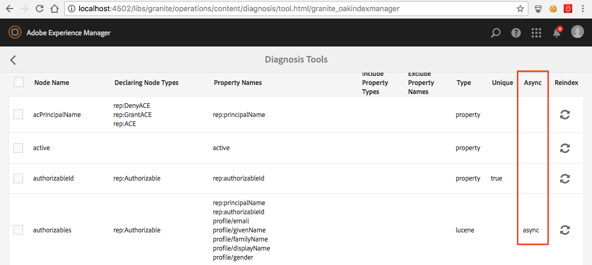

# Problemen met Oak-indexen oplossen{#troubleshooting-oak-indexes}

## Langzaam opnieuw indexeren  {#slow-re-indexing}

AEM intern herindexeringsproces verzamelt gegevens in de opslagplaats en slaat deze op in Oak-indexen ter ondersteuning van het opvragen van inhoud door uitvoerders. In uitzonderlijke omstandigheden kan het proces langzaam of zelfs vastlopen. Deze pagina fungeert als gids voor het oplossen van problemen, zodat u kunt zien of de indexering langzaam verloopt, de oorzaak vindt en het probleem verhelpt.

Het is belangrijk om onderscheid te maken tussen opnieuw indexeren die een onredelijk lange hoeveelheid tijd vergt, en opnieuw indexeren die een lange hoeveelheid tijd vergt omdat het enorme hoeveelheden inhoud indexeert. De tijd die nodig is om de inhoud te indexeren, wordt bijvoorbeeld geschaald met de hoeveelheid inhoud. Het duurt dus langer om grote productieopslagplaatsen opnieuw te indexeren dan kleine opslagplaatsen.

Zie [&#x200B; Beste praktijken op Vragen en het Indexeren &#x200B;](/help/sites-deploying/best-practices-for-queries-and-indexing.md) voor extra informatie over wanneer en hoe te om inhoud opnieuw te indexeren.

## Aanvankelijke detectie {#initial-detection}

Voor een trage indexering van de eerste detectie moet de `IndexStats` JMX MBans worden gecontroleerd. Ga als volgt te werk voor de betreffende AEM instantie:

1. Open de Console van het Web en klik het lusje JMX of ga naar https://&lt;host>:&lt;port>/system/console/jmx (bijvoorbeeld, [&#x200B; http://localhost:4502/system/console/jmx &#x200B;](http://localhost:4502/system/console/jmx)).
1. Navigeer naar de `IndexStats` mbeans.
1. Open de `IndexStats` MBans voor &quot; `async`&quot; en &quot; `fulltext-async`&quot;.

1. Voor beide MBeans, controleer als **Gedaan** timestamp en **LastIndexTime** timestamp minder dan 45 min van de huidige tijd zijn.

1. Voor één van beide MBean, als de tijdwaarde (**Gedaan** of **LastIndexedTime**) groter is dan 45 min van de huidige tijd, dan ontbreekt de indexbaan of neemt te lang. Dit probleem veroorzaakt de asynchrone indexen om stabiel te zijn.

## De indexering wordt gepauzeerd na een gedwongen sluiting {#indexing-is-paused-after-a-forced-shutdown}

Een gedwongen sluiting resulteert in AEM het opschorten van asynchrone indexering tot 30 minuten na het opnieuw beginnen. En, vereist het typisch een andere 15 minuten om de eerste het opnieuw indexeren pas te voltooien, voor een totaal van ongeveer 45 minuten (het binden terug naar [&#x200B; Begeleidende Chronologie van de Opsporing &#x200B;](/help/sites-deploying/troubleshooting-oak-indexes.md#initial-detection) van 45 minuten). Als indexeren wordt gepauzeerd na een gedwongen sluiting:

1. Bepaal eerst of de AEM instantie geforceerd is afgesloten (het AEM proces is met kracht gedood of er is een stroomstoring opgetreden) en begin later opnieuw.

   * [&#x200B; AEM het registreren &#x200B;](/help/sites-deploying/configure-logging.md) kan voor dit doel worden herzien.

1. Als de gedwongen sluiting optrad, na het opnieuw opstarten, AEM automatisch het opnieuw indexeren gedurende maximaal 30 minuten op.
1. Wacht ongeveer 45 minuten op AEM om normale asynchrone indexeringsverrichtingen te hervatten.

## Thread pool overloaded {#thread-pool-overloaded}

>[!NOTE]
>
>Voor AEM 6.1, zorg ervoor dat [&#x200B; AEM 6.1 GFP 11 &#x200B;](https://experienceleague.adobe.com/docs/experience-manager-release-information/aem-release-updates/previous-updates/aem-previous-versions.html?lang=nl-NL) geïnstalleerd is.

In uitzonderlijke omstandigheden, kan de draadpool die wordt gebruikt om asynchrone indexering te beheren overbelast worden. Om het het indexeren proces te isoleren, kan een draadpool worden gevormd om ander AEM werk te verhinderen zich in het vermogen van Oak te mengen om inhoud op geschikte wijze te indexeren. Voer in dergelijke gevallen de volgende handelingen uit:

1. Definieer een nieuwe, geïsoleerde draadpool voor de Apache Sling Scheduler voor asynchrone indexering:

   * Voor de beïnvloede AEM instantie, navigeer aan AEM OSGi Console>OSGi>Configuration>Apache Sling Scheduler of ga naar https://&lt;host>:&lt;port>/system/console/configMgr (bijvoorbeeld, [&#x200B; http://localhost:4502/system/console/configMgr &#x200B;](http://localhost:4502/system/console/configMgr))
   * Voeg een item aan het veld &quot;Toegestane threads&quot; toe met de waarde &quot;eikel&quot;.
   * Om de veranderingen te bewaren, klik **sparen** in het bodem-recht.

   

1. Controleer of de nieuwe Apache Sling Scheduler-thread-pool is geregistreerd en wordt weergegeven in de webconsole van Apache Sling Scheduler-status.

   * Navigeer aan de AEM OSGi Webconsole>Status>Sling Planner of ga naar https://&lt;host>:&lt;port>/system/console/status-slingplanner (bijvoorbeeld, [&#x200B; http://localhost:4502/system/console/status-slingscheduler &#x200B;](http://localhost:4502/system/console/status-slingscheduler))
   * Controleer of de volgende poolitems aanwezig zijn:

      * ApacheSlingoak
      * ApacheSlingdefault

   

## De waarnemingswachtrij is vol {#observation-queue-is-full}

Als er te veel veranderingen en verplichtingen in korte tijd aan de gegevensopslagplaats worden aangebracht, kan de indexering worden vertraagd vanwege een volledige waarnemingswachtrij. Bepaal eerst of de waarnemingswachtrij vol is:

1. Ga naar de Console van het Web en klik het JMX lusje of ga naar https://&lt;host>:&lt;port>/system/console/jmx (bijvoorbeeld, [&#x200B; http://localhost:4502/system/console/jmx &#x200B;](http://localhost:4502/system/console/jmx))
1. Open Oak Repository Statistics MBean en bepaal of een `ObservationQueueMaxLength` -waarde groter is dan 10.000.

   * Bij normale bewerkingen moet deze maximumwaarde uiteindelijk altijd tot nul worden gereduceerd (vooral in de sectie `per second` ), zodat wordt gecontroleerd of de waarden voor seconden van `ObservationQueueMaxLength` 0 zijn.
   * Als de waarden 10.000 of meer zijn en gestaag toenemen, geeft dit aan dat ten minste één (mogelijk meer) wachtrij niet kan worden verwerkt zodra nieuwe wijzigingen (vastleggingen) optreden.
   * Elke waarnemingswachtrij heeft een limiet (standaard ingesteld op 10.000) en als de wachtrij deze limiet bereikt, neemt de verwerking af.
   * Als u MongoMK gebruikt, neemt de snelheid van de interne Oak-cache af naarmate de lengte van de wachtrij groter wordt. Deze correlatie is zichtbaar in een toename `missRate` voor de `DocChildren` cache in de `Consolidated Cache` statistics MBean.

1. Om te voorkomen dat de limieten van de waarnemingswachtrij worden overschreden, wordt aanbevolen:

   * Verlaag de constante snelheid van komma&#39;s. Korte pieken in vastleggingen zijn aanvaardbaar, maar de constante snelheid moet worden verlaagd.
   * Verhoog de grootte van `DiffCache` zoals die in [&#x200B; Prestaties het stemmen uiteinden > Mongo Opslag het Tunnen > de geheim voorgeheugengrootte van het Document &#x200B;](/help/sites-deploying/configuring-performance.md) wordt beschreven.

## Een vast herindexeringsproces identificeren en corrigeren {#identifying-and-remediating-a-stuck-re-indexing-process}

Herindexering kan onder twee omstandigheden als &quot;volledig vastzitten&quot; worden beschouwd:

* Het opnieuw indexeren is langzaam, tot het punt waar geen significante vooruitgang in logboekdossiers betreffende het aantal getransformeerde knopen wordt gemeld.

   * Bijvoorbeeld, als er geen berichten in de loop van een uur zijn, of als de vooruitgang zo langzaam is dat het een week of meer duurt om te beëindigen.

* Het opnieuw indexeren blijft in een eindeloze lijn hangen als de herhaalde uitzonderingen in de logboekdossiers (bijvoorbeeld, `OutOfMemoryException`) in de het indexeren draad verschijnen. De herhaling van een of meer uitzonderingen in het logbestand geeft aan dat Oak probeert hetzelfde item herhaaldelijk te indexeren, maar dat dit probleem niet wordt opgelost.

Ga als volgt te werk om een vast opnieuw indexeringsproces te identificeren en te repareren:

1. Om de oorzaak van het vastlopen van indexering te identificeren, moet de volgende informatie worden verzameld:

   * Verzamel 5 notulen van draadstortplaats, één draadstortplaats om de 2 seconden.
   * [&#x200B; plaats FOUTOPSPORINGSniveau en logboeken voor de toevoegers &#x200B;](/help/sites-deploying/configure-logging.md).

      * *org.apache.jackrabbit.oak.plugins.index.AsyncIndexUpdate*
      * *org.apache.jackrabbit.oak.plugins.index.IndexUpdate*

   * Gegevens verzamelen van de async `IndexStats` MBean:

      * Navigeer naar AEM OSGi Webconsole>Main>JMX>IndexState>async

        of ga naar [&#x200B; http://localhost:4502/system/console/jmx/org.apache.jackrabbit.oak%3Aname%3Dasync%2Ctype%3DIndexStats &#x200B;](http://localhost:4502/system/console/jmx/org.apache.jackrabbit.oak%3Aname%3Dasync%2Ctype%3DIndexStats)

   * De consolemodus van het gebruik [&#x200B; eak-run.jar &#x200B;](https://github.com/apache/jackrabbit-oak/tree/trunk/oak-run) om de details van te verzamelen wat onder de * `/:async`* knoop bestaat.
   * Verzamel een lijst met controlepunten in de opslagplaats met behulp van `CheckpointManager` MBean:

      * AEM OSGi Webconsole>Main>JMX>CheckpointManager>listCheckpoints()

        of ga naar [&#x200B; http://localhost:4502/system/console/jmx/org.apache.jackrabbit.oak%3Aname%3DSegment+node+store+checkpoint+management%2Ctype%3DCheckpointManager &#x200B;](http://localhost:4502/system/console/jmx/org.apache.jackrabbit.oak%3Aname%3DSegment+node+store+checkpoint+management%2Ctype%3DCheckpointManager)

1. Na het verzamelen van alle informatie die in Stap 1 wordt geschetst, begin AEM opnieuw.

   * Het opnieuw opstarten van AEM kan het probleem oplossen als er een hoge gelijktijdige belasting is (overloop van de waarnemingswachtrij of iets dergelijks).
   * Als een nieuw begin niet het probleem oplost, open een kwestie met [&#x200B; de Zorg van de Klant van de Adobe &#x200B;](https://experienceleague.adobe.com/nl?support-solution=General&support-tab=home#support) en verstrekt alle informatie die in Stap 1 wordt verzameld.

## Asynchrone herindexering veilig afbreken {#safely-aborting-asynchronous-re-indexing}

Opnieuw indexeren kan veilig worden afgebroken (gestopt voordat het wordt voltooid) via de `async, async-reindex` - en f `ulltext-async` -indexbanen ( `IndexStats` -boon). Voor meer informatie, zie ook de documentatie van Apache Oak op [&#x200B; hoe te Reindexing &#x200B;](https://jackrabbit.apache.org/oak/docs/query/indexing.html#abort-reindex) afbreken. Overweeg ook het volgende:

* Het opnieuw indexeren van de indexen van het Bezit van Lucene en van Lucene kan worden geaborteerd aangezien zij van nature asynchroon zijn.
* Het opnieuw indexeren van Oak-eigenschappenindexen kan alleen worden afgebroken als opnieuw indexeren is gestart via de `PropertyIndexAsyncReindexMBean` .

Voer de volgende stappen uit om opnieuw indexeren veilig af te breken:

1. Identificeer de IndexStats MBean die de het opnieuw indexeren weg controleert die moet worden tegengehouden.

   * Navigeer aan aangewezen IndexStats MBean via de console JMX door of AEM Console OSGi Web>Main>JMX of https://&lt;host> te gaan:&lt;port>/system/console/jmx (bijvoorbeeld, [&#x200B; http://localhost:4502/system/console/jmx &#x200B;](http://localhost:4502/system/console/jmx))
   * Open de IndexStats MBean op basis van de opnieuw indexerende weg die u wilt tegenhouden ( `async`, `async-reindex`, of `fulltext-async`)

      * Om de aangewezen weg en zo de IndexStats MBean instantie te identificeren, bekijk het &quot;async&quot;bezit van de Indexen van Oak. De eigenschap &quot;async&quot; bevat de naam van het pad: `async`, `async-reindex` of `fulltext-async` .
      * De strook is ook beschikbaar door tot de Manager van de Index van AEM toegang te hebben in de kolom &quot;Async&quot;. Navigeer naar Operations>Diagnosis>Indexbeheer om Indexbeheer te openen.

   

1. Roep de opdracht `abortAndPause()` aan op de juiste `IndexStats` MBean.
1. Markeer de Oak-indexdefinitie op de juiste wijze om te voorkomen dat het indexeren van de rijstrook wordt hervat.

   * Wanneer het opnieuw indexeren van een **bestaande** index, plaats het herindexbezit aan vals

      * `/oak:index/someExistingIndex@reindex=false`

   * Of anders, voor a **nieuwe** index, of:

      * De eigenschap type instellen op uitgeschakeld

         * `/oak:index/someNewIndex@type=disabled`

      * of verwijder de indexdefinitie volledig

   Leg de wijzigingen vast in de opslagplaats wanneer deze zijn voltooid.

1. Tot slot hervat asynchrone indexering op de geaborteerde indexerende weg.

   * In `IndexStats` MBean die het `abortAndPause()` bevel in Stap 2 uitgeeft, haal het `resume()` bevel aan.

## Langzaam opnieuw indexeren voorkomen {#preventing-slow-re-indexing}

Het is het beste om opnieuw te indexeren tijdens rustige perioden (bijvoorbeeld niet tijdens een grote inname van inhoud), en idealiter tijdens onderhoudsvensters wanneer AEM lading bekend en gecontroleerd is. Zorg er ook voor dat de herkoppeling niet plaatsvindt tijdens andere onderhoudsactiviteiten.
