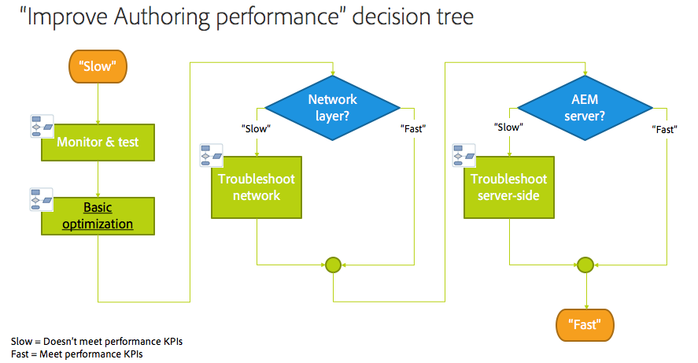

# Installatieproblemen met AEM oplossen{#troubleshooting}

Deze sectie omvat gedetailleerde informatie over logboeken beschikbaar om u te helpen problemen oplossen en omvat ook informatie over enkele problemen u met AEM zou kunnen ontmoeten.

## De prestaties van auteurs oplossen {#troubleshoot-author-performance}

Het analyseren van langzame prestaties op Authoring instantie kan complex worden. Als eerste stap is het vereist om te achterhalen op welk niveau van de technologiestapel de prestaties verminderen.

De volgende beslisboom verstrekt begeleiding om het knelpunt te versmallen.

## Basisoptimalisatie {#basic-optimization}

## Logbestanden en auditlogbestanden configureren {#configuring-log-files-and-audit-logs}

AEM registreert gedetailleerde logboeken die u zou kunnen willen vormen om installatiekwesties problemen op te lossen. Voor informatie, zie het [ Werken met de Verslagen van de Controle en de sectie van de Dossiers van het Logboek ](/help/sites-deploying/monitoring-and-maintaining.md#working-with-audit-records-and-log-files).

## De optie Uitvouwen gebruiken {#using-the-verbose-option}

Wanneer u AEM WCM begint, kunt u - v (verbose) optie aan de bevellijn toevoegen zoals in: java -jar cq-wcm-quickstart-&lt;version>.jar -v.

De verbose optie toont sommige van de het logboekoutput van Quickstart op de console, zodat kan het voor het oplossen van problemen worden gebruikt.

## Veelvoorkomende installatieproblemen {#common-installation-issues}

In de volgende sectie worden enkele installatieproblemen en de bijbehorende oplossingen beschreven.

### Dubbelklikken op de QuickStart-jar heeft geen effect of opent het jar-bestand met een ander programma (bijvoorbeeld archiefbeheer) {#double-clicking-the-quickstart-jar-does-not-have-any-effect-or-opens-the-jar-file-with-another-program-for-example-archive-manager}

Dit probleem geeft meestal een probleem aan met de manier waarop de bureaubladomgeving van uw besturingssysteem is geconfigureerd voor het openen van bestanden met de extensie .jar. Het kan ook aangeven dat u Java™ niet hebt geïnstalleerd of dat u een niet-ondersteunde versie van Java™ gebruikt.

Aangezien de jar dossiers het overal formaat van het ZIP gebruiken, kunnen sommige archiveringsprogramma&#39;s automatisch de Desktop vormen om jar dossiers als archiefdossiers te openen.

Ga als volgt te werk om problemen op te lossen:

* Controleer nogmaals of u ten minste Java™ versie 1.6 hebt geïnstalleerd.
* Probeer een contextmenu (gewoonlijk klik met de rechtermuisknop) op AEM WCM QuickStart, en selecteer &quot;Open met...&quot;
* Controleer of Java™ of Sun Java™ wordt vermeld en probeer er AEM WCM mee uit te voeren. Als u meerdere Java™-versies hebt geïnstalleerd, selecteert u de ondersteunde versie.

  Als deze stap is geslaagd en uw besturingssysteem de optie heeft om altijd het geselecteerde programma te gebruiken om de .jar-bestanden uit te voeren, selecteert u deze optie. Dubbelklikken moet vanaf nu werken.

* Soms kunt u de juiste koppeling herstellen door de ondersteunde Java™-versie opnieuw te installeren.
* U kunt CRX altijd uitvoeren met behulp van de opdrachtregel of start/stop-scripts zoals eerder in dit document is beschreven.

### Mijn toepassing die op CRX wordt uitgevoerd, genereert fouten vanwege onvoldoende geheugen {#my-application-running-on-crx-throws-out-of-memory-errors}

>[!NOTE]
>
>Zie ook [ Geheugenproblemen ](https://experienceleague.adobe.com/docs/experience-cloud-kcs/kbarticles/KA-17482.html?lang=nl-NL) analyseren.

CRX zelf heeft een laag geheugenverbruik. Als de toepassing die in CRX wordt uitgevoerd grotere geheugenvereisten heeft of geheugenintensieve bewerkingen aanvraagt (bijvoorbeeld grote transacties), moet de JVM-instantie waarin CRX wordt uitgevoerd, worden gestart met de juiste geheugeninstellingen.

Gebruik de Java™-opdrachtopties om geheugeninstellingen van de JVM te definiëren (bijvoorbeeld java -Xmx512m -jar crx&ast;.jar om de heapsize in te stellen op 512 MB).

Geef de optie voor het instellen van het geheugen op terwijl u AEM WCM start vanaf de opdrachtregel. De AEM WCM start/stop manuscripten of de douanescripten voor het beheren van AEM opstarten WCM kunnen ook worden gewijzigd om de vereiste geheugenmontages te bepalen.

Als u reeds uw heapsize aan 512 MB hebt bepaald, kunt u de geheugenkwestie verder willen analyseren door een heapstortplaats te creëren.

Als u automatisch een heapdump wilt maken wanneer er onvoldoende geheugen beschikbaar is, gebruikt u de volgende opdracht:

java -Xmx256m -XX:+HeapDumpOnOutOfMemoryError -jar&ast;.jar

Deze methode produceert een dossier van de heapstortplaats (**java_...hprof**) wanneer het proces uit geheugen loopt. Het proces kan blijven lopen nadat de heapstortplaats werd geproduceerd.

Vaak zijn drie heap dump-bestanden, verzameld over een bepaalde periode, nodig om het probleem te analyseren:

* Voordat een fout optreedt
* Tijdens storing 1
* Tijdens mislukking 2
* *Ideaal, zou het ook goed zijn om informatie te verzamelen nadat de gebeurtenis wordt opgelost*

Deze kunnen worden vergeleken om de wijzigingen te zien en hoe objecten geheugen gebruiken.

>[!NOTE]
>
>Als u dergelijke informatie regelmatig verzamelt, of ervaring hebt met het lezen van heap-dumps, kan één heap-dump-bestand voldoende zijn om het probleem te analyseren.

### Het welkomstscherm AEM wordt niet weergegeven in de browser nadat u hebt dubbelgeklikt op AEM QuickStart {#the-aem-welcome-screen-does-not-display-in-the-browser-after-double-clicking-aem-quickstart}

In bepaalde situaties worden de AEM WCM-welkomstschermen niet automatisch weergegeven, ook al is de gegevensopslagruimte zelf in orde. Dit probleem kan afhankelijk zijn van de installatie van het besturingssysteem, de configuratie van de browser of vergelijkbare factoren.

Het gebruikelijke symptoom is dat het AEM WCM QuickStart venster &quot;AEM WCM die op serveropstarten wachten...&quot; toont. Als dat bericht relatief lang wordt weergegeven, voert u de AEM WCM-URL handmatig in in het browservenster met de standaard 4502-poort of de poort waarop de instantie wordt uitgevoerd: http://localhost:4502/.

Bovendien kunnen logboeken de reden onthullen waarom de browser niet is gestart.

Soms heeft het AEM WCM QuickStart-venster het bericht &quot;AEM WCM wordt uitgevoerd op http://localhost:port/&quot; en wordt de browser niet automatisch gestart. Klik in dit geval op de URL in het venster AEM WCM QuickStart (het is een hyperlink) of voer de URL handmatig in de browser in.

Als alles anders ontbreekt, controleer de logboeken om te weten te komen wat is gebeurd.

### De website laadt niet of mislukt soms met Java™ 11 {#the-website-does-not-load-or-fails-intermittently-with-java11}

Er is een bekend probleem met AEM 6.5 dat wordt uitgevoerd op Java™ 11 waarbij de website mogelijk niet met tussenpozen wordt geladen of gezakt.

Ga als volgt te werk als dit probleem zich voordoet:

1. Open het bestand `sling.properties` onder de map `crx-quickstart/conf/`
1. Zoek de volgende regel:

   `org.osgi.framework.bootdelegation=sun.,com.sun.`

1. Vervang het door het volgende:

   `org.osgi.framework.bootdelegation=sun.,com.sun.,jdk.internal.reflect,jdk.internal.reflect.*`

1. Start de instantie opnieuw.

## Installaties met een toepassingsserver oplossen {#troubleshooting-installations-with-an-application-server}

### Pagina niet gevonden bij aanvragen van een geometrixx-buitenpagina {#page-not-found-returned-when-requesting-a-geometrixx-outdoor-page}

**is op WebLogic 10.3.5 en JBoss® 5.1 van toepassing**

Wanneer een verzoek aan geometrixx-outdoor/en pagina 404 (Pagina niet Gevonden) terugkeert, kunt u opnieuw controleren dat u het extra bezit van de helling in het sling.properties- dossier nodig voor deze specifieke Servers van de Toepassing hebt geplaatst.

Zie in *opstellen AEM Webtoepassing* stappen voor de details.

### De grootte van de reactiekop kan groter zijn dan 4 KB {#response-header-size-can-be-greater-than-kb}

502 fouten kunnen erop wijzen dat de Webserver niet de grootte van de AEM HTTP- reactiekop kan behandelen. AEM kunnen HTTP-antwoordheaders genereren die cookies van meer dan 4 kB bevatten. Zorg ervoor dat uw servletcontainer wordt gevormd zodat de maximumgrootte van de reactiekop 4 KB kan overschrijden.

Bijvoorbeeld, voor Tomcat 7.0, de attributen maxHttpHeaderSize van de [&#128279;](https://tomcat.apache.org/tomcat-7.0-doc/config/http.html) controles van de Schakelaar van 0&rbrace; HTTP &lbrace;op kopbalgrootte.

## Adobe Experience Manager verwijderen {#uninstalling-adobe-experience-manager}

Aangezien AEM in één map installeert, is een hulpprogramma voor verwijderen niet nodig. Het verwijderen van de installatiemap kan eenvoudig zijn, maar hoe u de installatiemap verwijdert, hangt AEM af van wat u wilt bereiken en van welke permanente opslag u gebruikt.

Als permanente opslag is ingesloten in de installatiemap, bijvoorbeeld in de standaard-TarPM-installatie, worden bij het verwijderen van mappen ook gegevens verwijderd.

>[!NOTE]
>
>Adobe raadt u aan een back-up van de opslagplaats te maken voordat u AEM verwijdert. Als u de gehele &lt;cq-installation-directory> verwijdert, verwijdert u ook de repository. Als u de gegevens in de opslagplaats wilt bewaren voordat u de map &lt;cq-installation-directory>/crx-quickstart/repository verwijdert, verplaatst of kopieert u deze naar een andere locatie voordat u de andere mappen verwijdert.

Als bij de installatie van AEM externe opslag wordt gebruikt, bijvoorbeeld een databaseserver, worden de gegevens niet automatisch verwijderd wanneer u een map verwijdert. De opslagconfiguratie wordt echter wel verwijderd, waardoor het herstellen van de JCR-inhoud moeilijk wordt.

### JSP-bestanden worden niet gecompileerd op JBoss® {#jsp-files-are-not-compiled-on-jboss}

Als u JSP-bestanden installeert of bijwerkt naar Experience Manager op JBoss® en de bijbehorende servlets niet worden gecompileerd, moet u ervoor zorgen dat de JBoss® JSP-compiler correct is geconfigureerd. Zie voor meer informatie de
[ JSP de Kwesties van de Compilatie in JBoss® ](https://helpx.adobe.com/experience-manager/kb/jsps-dont-compile-jboss.html) artikel.
