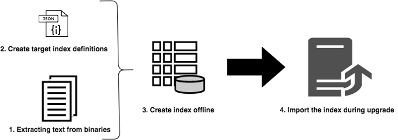

# Offlineindexering gebruiken om de downtime tijdens een upgrade te verminderen {#offline-reindexing-to-reduce-downtime-during-upgrades}

## Inleiding {#introduction}

Een van de belangrijkste uitdagingen bij het upgraden van Adobe Experience Manager is de downtime die aan de auteursomgeving is gekoppeld wanneer een upgrade op locatie wordt uitgevoerd. Inhoudsauteurs hebben tijdens een upgrade geen toegang tot de omgeving. Daarom is het wenselijk om de hoeveelheid tijd te minimaliseren het neemt om de verbetering uit te voeren. Voor grote opslagplaatsen, met name AEM Assets-projecten, die doorgaans grote gegevensopslagruimten en een hoog niveau van uploads per uur hebben, neemt het opnieuw indexeren van eiken een significant percentage van de upgradetijd in beslag.

In deze sectie wordt beschreven hoe u het Oak-runtime-programma kunt gebruiken om de opslagplaats opnieuw te indexeren **voordat** de upgrade wordt uitgevoerd, waardoor de hoeveelheid downtime tijdens de daadwerkelijke upgrade wordt verminderd. De voorgestelde stappen kunnen op de indexen van [Lucene](https://jackrabbit.apache.org/oak/docs/query/lucene.html) voor versies AEM 6.4 en hoger worden toegepast.

## Overzicht {#overview}

Nieuwe versies van de AEM brengen wijzigingen aan de indexdefinities van eikel aan aangezien de eigenschapreeks wordt uitgebreid. Door wijzigingen in de eiken-indexen wordt de functie opnieuw gecomprimeerd wanneer de AEM wordt bijgewerkt. Het opnieuw indexeren is duur voor middelenimplementaties omdat tekst in elementen (bijvoorbeeld tekst in een PDF-bestand) wordt geëxtraheerd en geïndexeerd. Bij MongoMK-opslagruimten blijven gegevens via het netwerk behouden, waardoor er meer tijd nodig is voor opnieuw indexeren.

Het probleem waarmee de meeste klanten tijdens een upgrade worden geconfronteerd, beperkt het downtime-venster. De oplossing moet de het opnieuw indexeren activiteit tijdens de verbetering **overslaan** . Dit kan worden bereikt door de nieuwe indeces te creëren **alvorens** de verbetering uit te voeren, dan eenvoudig hen tijdens de verbetering invoeren.

## Benadering {#approach}



Het idee moet de index vóór de verbetering, tegen de indexdefinities van de doel AEM versie tot stand brengen gebruikend het [Oak-looppas](/help/sites-deploying/indexing-via-the-oak-run-jar.md) hulpmiddel. In het bovenstaande diagram wordt de methode voor het offline opnieuw indexeren weergegeven.

Bovendien is dit de orde van de stappen zoals die in de benadering worden beschreven:

1. Tekst van binaire tekens wordt als eerste geëxtraheerd
2. Doelindexdefinities worden gemaakt
3. Offline indexen worden gemaakt
4. De indexen worden vervolgens geïmporteerd tijdens het upgradeproces

### Tekst uitnemen {#text-extraction}

Om volledige indexering in AEM mogelijk te maken, wordt tekst uit binaire kaders zoals PDF geëxtraheerd en aan de index toegevoegd. Dit is meestal een kostbare stap in het indexeringsproces. Tekstomloop is een optimaliseringsstap die vooral wordt aanbevolen voor het opnieuw indexeren van opslagplaatsen voor elementen, omdat er een groot aantal binaire bestanden wordt opgeslagen.


Tekst van binaire bestanden die in het systeem zijn opgeslagen, kan met het gereedschap eikenuitvoering worden uitgepakt met de tikabibliotheek. Een kloon van de productiesystemen kan vóór verbetering worden genomen en voor dit tekstextractieproces worden gebruikt. Dit proces leidt dan tot de tekstopslag, door de volgende stappen te gaan:

**1. De gegevensopslagruimte doorlopen en de details van binaire bestanden verzamelen**

Met deze stap maakt u een CSV-bestand met een paar binaire getallen, die een pad en een blob-id bevatten.

Voer de onderstaande opdracht uit vanuit de map waar u de index wilt maken. In het onderstaande voorbeeld wordt uitgegaan van de thuismap van de repository.

```
java java -jar oak-run.jar tika <nodestore path> --fds-path <datastore path> --data-file text-extraction/oak-binary-stats.csv --generate
```

Waar `nodestore path` is de `mongo_ur` of `crx-quickstart/repository/segmentstore/`

Gebruik de `--fake-ds-path=temp` parameter in plaats van `–fds-path` om het proces te versnellen.

**2. De binaire tekstwinkel die beschikbaar is in de bestaande index opnieuw gebruiken**

Pak de indexgegevens uit het bestaande systeem en extraheer de tekstwinkel.

U kunt de bestaande indexgegevens dumpen met de volgende opdracht:

```
java -jar oak-run.jar index <nodestore path> --fds-path=<datastore path> --index-dump
```

Waar `nodestore path` is de `mongo_ur` of `crx-quickstart/repository/segmentstore/`

Dan, gebruik de bovengenoemde indexstortplaats om de opslag te bevolken:

```
java -jar oak-run.jar tika --data-file text-extraction/oak-binary-stats.csv --store-path text-extraction/store --index-dir ./indexing-result/index-dumps/<oak-index-name>/data populate
```

Waar `oak-index-name` is de naam van de volledige tekstindex, bijvoorbeeld &#39;lucene&#39;.

**3. Voer het tekstextractieproces uit met behulp van de tika-bibliotheek voor de binaire getallen die in de bovenstaande stap zijn overgeslagen**

```
java -cp oak-run.jar:tika-app-1.21.jar org.apache.jackrabbit.oak.run.Main tika --data-file text-extraction/oak-binary-stats.csv --store-path text-extraction/store --fds-path <datastore path> extract
```

Waar `datastore path` is de weg aan de binaire gegevensopslag.

De gemaakte tekstopslag kan in de toekomst worden bijgewerkt en opnieuw worden gebruikt voor herindexeringsscenario&#39;s.

Raadpleeg de documentatie bij [](https://jackrabbit.apache.org/oak/docs/query/pre-extract-text.html)Oak-run voor meer informatie over het extractieproces van tekst.

### Offline opnieuw indexeren {#offline-reindexing}


Creeer offline de index van Lucene vóór de verbetering. Als het gebruiken van MongoMK, wordt het geadviseerd om het op één van de knopen te leiden MongoMk, aangezien dit netwerkoverheadkosten vermijdt.

Voer de volgende stappen uit om de index offline te maken:

**1. Eak-Lucene-indexdefinities genereren voor de AEM versie**

Zet de bestaande indexdefinities neer. Indexdefinities die zijn gewijzigd, zijn gegenereerd met de bundel van de Adobe Granite-opslagruimte van de AEM versie en de eak-run van het doel.

Om de indexdefinitie van de **bron** AEM instantie te dumpen, stel dit bevel in werking:

>[!NOTE]
>
>Raadpleeg de [documentatie](https://jackrabbit.apache.org/oak/docs/query/oak-run-indexing.html#async-index-data)van Oak voor meer informatie over definities van dumping-indexen.

```
java -jar oak-run.jar index --fds-path <datastore path> <nodestore path> --index-definitions
```

Waar `datastore path` en `nodestore path` zijn van de **bron** AEM instantie.

Vervolgens genereert u indexdefinities van de **doelversie** AEM de graniet-opslagbundel van de doelversie.

```
java -cp oak-run.jar:bundle-com.adobe.granite.repository.jar org.apache.jackrabbit.oak.index.IndexDefinitionUpdater --in indexing-definitions_source.json --out merge-index-definitions_target.json --initializer com.adobe.granite.repository.impl.GraniteContent
```

>[!NOTE]
>
> Het maken van de bovenstaande indexdefinitie wordt alleen vanaf de `oak-run-1.12.0` versie ondersteund. Het richten wordt gedaan gebruikend de bundel van de granietbewaarplaats `com.adobe.granite.repository-x.x.xx.jar`.

Met de bovenstaande stappen maakt u een JSON-bestand dat de indexdefinitie `merge-index-definitions_target.json` is.

**2. Een controlepunt maken in de repository**

Creeer een controlepunt in de **bron** van de productie AEM instantie met een lange levensduur. Dit moet gebeuren voordat de opslagplaats wordt gekloond.

Via JMX-console op `http://serveraddress:serverport/system/console/jmx`, ga naar `CheckpointMBean` en maak een controlepunt met een lang genoeg leven (bijvoorbeeld 200 dagen). Voor dit, haal `CheckpointMBean#createCheckpoint` met `17280000000` als argument voor de levenduur in milliseconden aan.

Als dit is gebeurd, kopieert u de zojuist gemaakte checkpoint-id en valideert u de levensduur met JMX `CheckpointMBean#listCheckpoints`.

>[!NOTE]
>
> Dit controlepunt wordt verwijderd wanneer de index later wordt geïmporteerd.

Raadpleeg het aanmaken [van](https://jackrabbit.apache.org/oak/docs/query/oak-run-indexing.html#out-of-band-create-checkpoint) controlepunten in de documentatie bij Eak voor meer informatie.

**Offline indexeren uitvoeren voor de gegenereerde indexdefinities**

Lucene-herindexering kan offline worden uitgevoerd met behulp van een eik-run. Dit proces leidt tot indexgegevens in de schijf onder `indexing-result/indices`. Het schrijft **niet** naar de gegevensopslagplaats en vereist dus niet dat de lopende AEM wordt gestopt. Het gemaakte tekstarchief wordt in dit proces gebruikt:

```
java -Doak.indexer.memLimitInMB=500 -jar oak-run.jar index <nodestore path> --reindex --doc-traversal-mode --checkpoint <checkpoint> --fds-path <datastore path> --index-definitions-file merge-index-definitions_target.json --pre-extracted-text-dir text-extraction/store

Sample <checkpoint> looks like r16c85700008-0-8
—fds-path: path to data store.
--pre-extracted-text-dir: Directory of pre-extracted text.
merge-index-definitions_target: JSON file having merged definitions for the target AEM instance. indices in this file will be re-indexed.
```

Het gebruik van de `--doc-traversal-mode` parameter is handig bij MongoMK-installaties, omdat dit de herindextijd aanzienlijk verbetert door opslagruimteinhoud in een lokaal, plat bestand te spoolen. Er is echter meer schijfruimte nodig van tweemaal de grootte van de opslagplaats.

In het geval van MongoMK kan dit proces worden versneld als deze stap wordt uitgevoerd in een instantie dichter bij de instantie MongoDB. Als de looppas op de zelfde machine, netwerkoverheadkosten kan worden vermeden.

Aanvullende technische details zijn te vinden in de [documentatie bij het uitvoeren van de eik voor indexering](https://jackrabbit.apache.org/oak/docs/query/oak-run-indexing.html).

### Indices importeren {#importing-indices}

Met AEM 6.4 en nieuwere versies, heeft AEM de ingebouwde capaciteit om indexen van schijf op startopeenvolging in te voeren. De map `<repository>/indexing-result/indices` wordt gecontroleerd op de aanwezigheid van indexgegevens tijdens het opstarten. U kunt de vooraf gemaakte index tijdens het [upgradeproces](in-place-upgrade.md#performing-the-upgrade) naar de bovenstaande locatie kopiëren voordat u begint met de nieuwe versie van de **doel** AEM jar. AEM importeert het in de opslagplaats en verwijdert het overeenkomstige controlepunt uit het systeem. Een herindex wordt dus volledig vermeden.

## Aanvullende tips en probleemoplossing {#troubleshooting}

Hieronder vindt u enkele nuttige tips en aanwijzingen voor het oplossen van problemen.

### Het effect op het systeem van de live productie verminderen {#reduce-the-impact-on-the-live-production-system}

U wordt aangeraden het productiesysteem te klonen en de offline index te maken met de kloon. Hierdoor worden mogelijke gevolgen voor het productiesysteem weggenomen. Het voor het importeren van indexen vereiste controlepunt moet echter aanwezig zijn in het productiesysteem. Daarom is het van essentieel belang dat u een controlepunt maakt voordat u de kloon gebruikt.

### Een runbook en proefversie voorbereiden {#prepare-a-runbook-and-trial-run}

Het wordt aanbevolen een [runbook](https://docs.adobe.com/content/help/en/experience-manager-65/deploying/upgrading/upgrade-planning.html#building-the-upgrade-and-rollback-runbook) op te stellen en enkele tests uit te voeren voordat de upgrade in productie wordt uitgevoerd.

### Doc Traversal Mode with Offline Indexing {#doc-traversal-mode-with-offline-indexing}

Offlineindexering vereist meerdere traversals van de gehele repository. Met installaties MongoMK, wordt de bewaarplaats betreden over het netwerk die de prestaties van het indexeren proces beïnvloeden. Één optie moet het off-line indexeren proces op de replica in werking stellen MongoDB zelf die de netwerkoverheadkosten zal elimineren. Een andere optie is het gebruik van de modus doc traversal.

De het traversal wijze van Doc kan worden toegepast door de parameter van de bevellijn aan het bevel-looppas voor off-line indexeren toe te voegen. `—doc-traversal` In deze modus wordt een kopie van de gehele opslagplaats op de lokale schijf als een plat bestand gespaard en wordt het gebruikt om de indexering uit te voeren.
