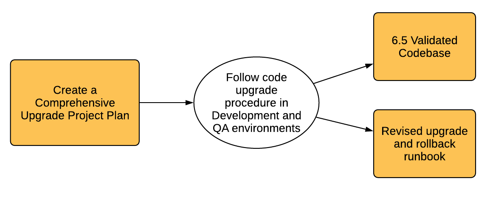

# Uw upgrade plannen{#planning-your-upgrade}

## Overzicht van AEM project {#aem-project-overview}

AEM wordt vaak gebruikt in implementaties met een hoog effect die miljoenen gebruikers ten goede kunnen komen. Gewoonlijk zijn er aangepaste toepassingen die op de instanties worden geïmplementeerd en die de complexiteit vergroten. Om het even welke inspanning om zulk een plaatsing te bevorderen moet methodisch worden behandeld.

Deze gids helpt met het vestigen van duidelijke doelstellingen, fasen, en te leveren punten wanneer het plannen van uw verbetering. Het is gericht op de algemene uitvoering van het project en de richtsnoeren. Hoewel het een overzicht van de daadwerkelijke verbeteringsstappen verstrekt, verwijst het naar beschikbare technische middelen waar geschikt. Het moet worden gebruikt met de in het document vermelde beschikbare technische middelen.

Het proces van de Verbetering van de AEM vereist zorgvuldig behandelde planning, analyse, en uitvoeringsfasen met zeer belangrijke te leveren producten die voor elke fase worden bepaald.

Het is mogelijk om rechtstreeks van AEM versies 6.0 en tot 6.5 te bevorderen. Klanten met 5.6.x en lager moeten eerst een upgrade uitvoeren naar versie 6.0 of hoger, waarbij 6.0(SP3) wordt aanbevolen. Bovendien wordt de nieuwe indeling voor Oak Segment Tar nu gebruikt voor de Segment Node Store sinds 6.3 en is de migratie naar deze nieuwe indeling verplicht, zelfs voor 6.0, 6.1 en 6.2.

>[!CAUTION]
>
>Als u van AEM 6.2 aan 6.3 bevordert, zou u of van versies moeten bevorderen (**6.2-SP1-GVB1 - -6.2SP1-GVB12.1**) of **6.2SP1-GVB15** en. Als u een upgrade uitvoert van **6.2SP1-GVB13/6.2SP1GVB14** tot AEM 6.3, moet u ook aan minstens versie bevorderen **6.3.2.**. Anders zou AEM Sites na de upgrade mislukken.

## Upgrade van bereik en vereisten {#upgrade-scope-requirements}

Hieronder vindt u een lijst met gebieden die van invloed zijn op een standaard AEM upgradeproject:

<table>
 <tbody>
  <tr>
   <td><strong>Component</strong></td>
   <td><strong>Gevolgen</strong></td>
   <td><strong>Beschrijving</strong></td>
  </tr>
  <tr>
   <td>Besturingssysteem</td>
   <td>Onduidelijke, maar subtiele effecten</td>
   <td>Op het moment van de AEM upgrade kan het tijd zijn om ook het besturingssysteem te upgraden en dit kan enige invloed hebben.</td>
  </tr>
  <tr>
   <td>Java™ Runtime</td>
   <td>Matige impact</td>
   <td>AEM 6.3 vereist JRE 1.7.x (64 bits) of later. JRE 1.8 is de enige versie die momenteel door Oracle wordt ondersteund.</td>
  </tr>
  <tr>
   <td>Hardware</td>
   <td>Matige impact</td>
   <td>Online revisie-opschoning is gratis  schijfruimte gelijk aan 25% van de grootte van de opslagplaats en 15% vrije heapruimte  om succesvol te voltooien. Mogelijk moet u uw hardware upgraden naar  ervoor zorgen dat er voldoende bronnen zijn voor het opschonen van online revisies  uitvoeren. Als u een upgrade uitvoert vanaf een versie die ouder is dan AEM 6, kunt u ook  kunnen aanvullende opslagvereisten zijn.</td>
  </tr>
  <tr>
   <td>Inhoudsopslagplaats (CRX of eikel)</td>
   <td>Hoge impact</td>
   <td>Vanaf versie 6.1 biedt AEM geen ondersteuning voor CRX2, dus een migratie naar  Oak (CRX3) is vereist als u een upgrade uitvoert vanaf een oudere versie. AEM 6,3  heeft een nieuwe Opslag van de Knoop van het Segment uitgevoerd die ook een migratie vereist. De  hiervoor wordt het gereedschap crx2oak gebruikt .</td>
  </tr>
  <tr>
   <td>Componenten/inhoud AEM</td>
   <td>Matige impact</td>
   <td><code>/libs</code> en <code>/apps</code> zijn gemakkelijk behandeld door de verbetering, maar <code>/etc</code> Meestal is het nodig aanpassingen handmatig opnieuw toe te passen.</td>
  </tr>
  <tr>
   <td>AEM</td>
   <td>Lage impact</td>
   <td>De meeste AEM kerndiensten worden getest voor verbetering. Dit is een gebied met een lage impact.</td>
  </tr>
  <tr>
   <td>Aangepaste toepassingsservices</td>
   <td>Laag tot hoog effect</td>
   <td>Afhankelijk van de toepassing en de aanpassing kan er  afhankelijkheden van JVM, versies van besturingssystemen en sommige indexeringen  wijzigingen, omdat indexen niet automatisch worden gegenereerd in Eak.</td>
  </tr>
  <tr>
   <td>Aangepaste toepassingsinhoud</td>
   <td>Laag tot hoog effect</td>
   <td>Er kan een back-up worden gemaakt van inhoud die niet via de upgrade wordt afgehandeld  voordat de upgrade plaatsvindt en vervolgens weer naar de opslagplaats wordt verplaatst.  De meeste inhoud kan worden verwerkt met het migratiehulpprogramma.</td>
  </tr>
 </tbody>
</table>

Het is belangrijk dat u een ondersteund besturingssysteem, Java™-runtime, httpd en Dispatcher-versie gebruikt. Zie de klasse [AEM 6.5 pagina Technische vereisten](/help/sites-deploying/technical-requirements.md). De bevordering van deze componenten moet rekenschap geven in uw projectplan en zou moeten plaatsvinden alvorens AEM te bevorderen.

## Projectfasen {#project-phases}

Veel werk gaat in planning en het runnen van een AEM verbetering. Om de verschillende inspanningen die in dit proces worden geleverd te verduidelijken, heeft de Adobe de plannings- en uitvoeringsoefeningen in verschillende fasen opgesplitst. In de onderstaande secties resulteert elke fase in een te leveren item dat vaak wordt gebruikt in een toekomstige fase van het project.

### Planning voor training van auteurs {#planning-for-author-training}

Met om het even welke nieuwe versie, zijn er potentiële veranderingen in UI en gebruikerswerkschema&#39;s die kunnen worden geïntroduceerd. Ook, introduceren de nieuwe versies nieuwe eigenschappen die voor de zaken aan gebruik gunstig kunnen zijn. De Adobe beveelt aan de ingevoerde functionele wijzigingen te evalueren en een plan te organiseren om uw gebruikers te trainen op het effectieve gebruik ervan.

De nieuwe functies in AEM 6.5 zijn te vinden in [de AEM van adobe.com](/help/release-notes/release-notes.md). Zorg ervoor om op om het even welke veranderingen in UIs of producteigenschappen nota te nemen die algemeen in uw organisatie worden gebruikt. Wanneer u de nieuwe functies doorloopt, moet u ook rekening houden met alle functies die van belang kunnen zijn voor uw organisatie. Na het bekijken van wat in AEM 6.5 is veranderd, ontwikkelt een opleidingsplan voor uw auteurs. Dit kan het gebruiken van vrij beschikbare middelen zoals hulpeigenschapvideo&#39;s of formele die opleiding door [Adobe digitale leerservices](https://learning.adobe.com/).

### Een testplan maken {#creating-a-test-plan}

De implementatie van AEM door elke klant is uniek en is aangepast om aan hun bedrijfsvereisten te voldoen. Daarom is het belangrijk om alle aanpassingen te bepalen die aan het systeem zijn aangebracht zodat zij in een testplan kunnen worden omvat. Dit testplan zal het proces van QA aandrijven dat de Adobe op de promotieinstantie uitvoert.

De exacte productieomgeving moet worden gedupliceerd en na de upgrade moeten er tests op worden uitgevoerd om te controleren of alle toepassingen en aangepaste code nog steeds naar wens worden uitgevoerd. Regenereer al uw aanpassingen en de prestaties, belasting en beveiligingstests. Wanneer het organiseren van uw testplan, zorg ervoor om alle aanpassingen te behandelen die aan het systeem naast uit de doos UIs en werkschema&#39;s zijn aangebracht die in uw dagelijkse verrichtingen worden gebruikt. Deze kunnen de diensten en de diensten van douaneOSGI, integraties aan de Adobe Experience Cloud, integraties met derde partijen door AEM schakelaars, de integratie van de douanederde, douanecomponenten en malplaatjes, de overlays van de douane UI in AEM, en douanewerkschema&#39;s omvatten. Voor klanten die van een versie voorafgaand aan AEM 6 migreren, zouden om het even welke douanevragen moeten worden geanalyseerd aangezien deze kunnen moeten worden geïndexeerd. Voor klanten die reeds op een versie van AEM 6.x zijn, zouden deze vragen nog moeten worden getest om ervoor te zorgen dat hun indexen effectief na bevordering blijven werken.

### Vaststellen welke wijzigingen in architectuur en infrastructuur nodig zijn {#determining-architectural-and-infrastructure-changes-needed}

Wanneer u een upgrade uitvoert, is het mogelijk dat u ook andere onderdelen in uw technische stapel moet bijwerken, zoals het besturingssysteem of JVM. Het is ook mogelijk dat als gevolg van wijzigingen in de samenstelling van de opslagplaats extra hardware nodig kan zijn. Dit komt slechts voor klanten die van pre 6.x instanties migreren maar is belangrijk om te overwegen. Tot slot kunnen er wijzigingen nodig zijn in uw operationele praktijken met inbegrip van controle, onderhoud, en steun en rampenterugwinningsprocessen.

Controleer de technische vereisten voor AEM 6.5 en zorg ervoor dat uw huidige hardware en software voldoende zijn. Raadpleeg de volgende documenten voor mogelijke wijzigingen in uw operationele processen:

**Controle en onderhoud:**

[Operations-dashboard](/help/sites-administering/operations-dashboard.md)

[Aanbevolen werkwijzen voor middelenbewaking](/help/assets/assets-monitoring-best-practices.md)

[Serverbronnen controleren met de JMX-console](/help/sites-administering/jmx-console.md)

[Revisie opschonen](/help/sites-deploying/revision-cleanup.md)

**Back-up/herstel en noodherstel:**

[Back-up en herstel](/help/sites-administering/backup-and-restore.md)

[Prestaties en schaalbaarheid](/help/sites-deploying/performance.md)

[Hoe te om AEM met TarMK Koude Reserve in werking te stellen](/help/sites-deploying/tarmk-cold-standby.md)

#### Overwegingen bij de herstructurering van inhoud {#content-restructuring-considerations}

AEM heeft wijzigingen aangebracht in de structuur van de opslagplaats die zullen helpen om upgrades naadloos te maken. De veranderingen impliceren het bewegen van inhoud uit de /etc omslag naar omslagen met inbegrip van /libs, /apps, en /content, die op worden gebaseerd of de Adobe of een klant de inhoud bezit, zo het beperken van de kansen om inhoud tijdens versies te beschrijven. De reorganisatie van de repository is zo uitgevoerd dat er geen codesamenstelling nodig is op het moment van de upgrade van 6.5, hoewel het aanbevolen wordt de details te herzien op [Herstructurering van AEM](/help/sites-deploying/repository-restructuring.md) tijdens het plannen van een upgrade.

### Complexiteit van upgrade beoordelen {#assessing-upgrade-complexity}

Gezien de grote verscheidenheid in de hoeveelheid en de aard van aanpassingen die de klanten van de Adobe op hun AEM milieu&#39;s toepassen, is het belangrijk om wat tijd vooruit door te brengen om het algemene niveau van inspanning te bepalen dat in uw verbetering zou moeten worden verwacht.

Er zijn twee benaderingen die u kunt volgen om de complexiteit van de upgrade te beoordelen. Een voorlopige fase kan de nieuw geïntroduceerde Patroondetector gebruiken. Deze is beschikbaar voor uitvoering op AEM 6.1-, 6.2- en 6.3-instanties. De patroondetector is de eenvoudigste manier om de algemene complexiteit van de upgrade te beoordelen die met behulp van gerapporteerde patronen kan worden verwacht. Het patroondetectorrapport bevat patronen voor het identificeren van niet-beschikbare API&#39;s die worden gebruikt door de aangepaste codebase (dit is gebeurd met de compatibiliteitscontroles vóór de upgrade in 6.3).

Na de eerste beoordeling zou een uitgebreidere volgende stap kunnen bestaan uit het uitvoeren van een upgrade op een testinstantie en het uitvoeren van een aantal basistests voor rook. Adobe biedt ook enkele . De lijst met [Verouderde en verwijderde functies](/help/release-notes/deprecated-removed-features.md) moet niet alleen worden gecontroleerd op de versie waarnaar u een upgrade uitvoert, maar ook op versies tussen uw bron- en doelversie. Als u bijvoorbeeld een upgrade uitvoert van AEM 6.2 naar 6.5, is het belangrijk om naast de functies voor AEM 6.5 ook de vervangen en verwijderde AEM 6.3 te bekijken.

De Patroondetector die onlangs is geïntroduceerd, geeft u een vrij nauwkeurige schatting van wat u tijdens een upgrade in de meeste gevallen kunt verwachten. Nochtans, voor complexere aanpassingen en plaatsingen waar u onverenigbare veranderingen hebt kunt u een ontwikkelingsinstantie aan AEM 6.5 volgens de instructies in [Een op locatie uitgevoerde upgrade uitvoeren](/help/sites-deploying/in-place-upgrade.md). Na voltooiing, voer wat hoge rooktests op dit milieu uit. Het doel van deze exercitie is niet om de inventarisatie van de testgevallen volledig te voltooien en een formele inventarisatie van de defecten op te stellen, maar om ons een ruwe schatting te geven van de hoeveelheid werk die nodig zal zijn om de code te upgraden voor compatibiliteit met punt 6.5. Indien gecombineerd met de [Patroondetectie](/help/sites-deploying/pattern-detector.md) en de architecturale veranderingen die in de vorige sectie werden bepaald, kan een ruwe schatting aan het team van het projectbeheer voor de planning van de verbetering worden verstrekt.

### Het opbouwen van Runbook van de Verbetering en van de Terugdraaiing {#building-the-upgrade-and-rollback-runbook}

Terwijl de Adobe het proces voor de bevordering van een AEM instantie heeft gedocumenteerd, vereisen de het netwerklay-out van elke klant, plaatsingsarchitectuur, en aanpassingen het verfijnen en het maken van deze benadering. Om deze reden, moedigt de Adobe u aan om alle verstrekte documentatie te herzien en het te gebruiken om een project-specifieke runbook te informeren die de specifieke verbetering en terugdraaiprocedures beschrijft die u in uw milieu zult volgen. Als u een upgrade uitvoert van CRX2, dient u te evalueren hoe lang de migratie van inhoud duurt wanneer u van CRX2 naar eiken gaat. Voor grote gegevensbanken kan het aanzienlijk zijn.

Adobe heeft upgrade- en terugdraaiprocedures voorzien voor [Upgradeprocedure](/help/sites-deploying/upgrade-procedure.md) en stapsgewijze instructies voor het toepassen van de upgrade bij het uitvoeren van een [Upgrade op locatie](/help/sites-deploying/in-place-upgrade.md). Deze instructies zouden met uw systeemarchitectuur, aanpassingen, en downtime tolerantie moeten worden herzien en overwogen om de aangewezen schakelaar-over en terugschroeven van prijzenprocedures te bepalen die u tijdens de verbetering zult uitvoeren. Wijzigingen in architectuur of serverformaten moeten worden opgenomen wanneer u uw aangepaste runbook gaat maken. Het is belangrijk om op te merken dat dit als een eerste ontwerp moet worden behandeld. Aangezien uw team hun QA en ontwikkelingscycli voltooit en de verbetering aan het opvoeren milieu opstelt, is het waarschijnlijk dat de behoefte aan sommige extra stappen kan worden vereist. In het ideale geval moet dit document voldoende informatie bevatten, zodat de upgrade volledig kan worden uitgevoerd op basis van de informatie die erin is opgenomen als het document aan een medewerker van uw bedrijf is overhandigd.

### Een projectplan ontwikkelen {#developing-a-project-plan}

De output van de vorige oefeningen kan worden gebruikt om een projectplan te bouwen dat de verwachte chronologie voor uw test of ontwikkelingsinspanningen, opleiding, en daadwerkelijke verbeteringsuitvoering behandelt.

Een alomvattend projectplan moet het volgende omvatten:

* Afronding van ontwikkelings- en testplannen
* Ontwikkeling en QA-omgevingen verbeteren
* De aangepaste codebasis voor AEM 6.5 bijwerken
* Een test en reparatiecyclus van kwaliteitscontrole
* De testomgeving upgraden
* Integratie, prestaties en het testen van de belasting
* Milieu-certificering
* Live gaan

### Ontwikkeling en kwaliteitscontrole {#performing-development-and-qa}

Adobe heeft voorzien in procedures voor [Code en aanpassingen bijwerken](/help/sites-deploying/upgrading-code-and-customizations.md) verenigbaar zijn met AEM 6.5. Wanneer dit iteratieve proces wordt uitgevoerd, moeten wijzigingen worden aangebracht in de runbook. Zie ook [Achterwaartse compatibiliteit in AEM 6.5](/help/sites-deploying/backward-compatibility.md) voor informatie over hoe uw aanpassingen achteruit compatibel kunnen blijven gewoonlijk zonder ontwikkeling onmiddellijk na verbetering te vereisen.

Het ontwikkelings- en testproces is doorgaans een herhalend proces. Als gevolg van aanpassingen kunnen wijzigingen die tijdens de upgrade zijn aangebracht, ertoe leiden dat een volledige sectie van het product onbruikbaar wordt. Als ontwikkelaars de hoofdoorzaak van het probleem hebben aangepakt en het testteam toegang heeft om deze functies te testen, kunnen er mogelijk extra problemen worden opgespoord. Aangezien de kwesties worden ontdekt die aanpassingen aan het verbeteringsproces vereisen, zorg ervoor om hen aan uw runtime van de douaneverbetering toe te voegen. Na verscheidene herhalingen van het testen en het bevestigen, zou de codebasis volledig moeten worden bevestigd en voor plaatsing aan het opvoeren milieu klaar zijn.

### Eindtest {#final-testing}

Adobe beveelt een laatste testronde aan nadat de codebase is gecertificeerd door het QA-team van uw organisatie. Deze testronde omvat het valideren van uw runbook in een testomgeving, gevolgd door gebruikersacceptatie, prestaties en beveiligingstests.

Deze stap is essentieel aangezien het de enige tijd is dat u de stappen in runbook tegen een productie-als milieu kunt bevestigen. Zodra het milieu is bevorderd, is het belangrijk om eind - gebruikers wat tijd toe te staan om zich aan te melden en door de activiteiten te gaan zij doen wanneer het gebruiken van het systeem in hun dagelijkse activiteiten. Het is niet ongebruikelijk dat gebruikers een deel van het systeem gebruiken dat niet eerder in overweging werd genomen. Het vinden en corrigeren van problemen in deze gebieden vóór go-live kan kostbare productieonderbrekingen helpen voorkomen. Aangezien een nieuwe versie van AEM significante veranderingen in het onderliggende platform bevat, is het ook belangrijk om prestaties, lading, en veiligheidstests op het systeem uit te voeren alsof u het voor het eerst lanceerde.

### De upgrade uitvoeren {#performing-the-upgrade}

Zodra de definitieve aftekening van alle belanghebbenden is ontvangen, is het tijd om de gedefinieerde runbook-procedures uit te voeren. Adobe heeft stappen voor upgrade en terugdraaiversies beschikbaar gesteld [Upgradeprocedure](/help/sites-deploying/upgrade-procedure.md) en installatiestappen uitvoeren in [Upgrade op locatie](/help/sites-deploying/in-place-upgrade.md) als referentiepunt.

Adobe heeft enkele stappen in de upgradeinstructies voor omgevingsvalidatie opgegeven. Deze omvatten basiscontroles zoals het aftasten van de verbeteringslogboeken en het verifiëren dat alle bundels OSGi behoorlijk zijn begonnen, maar de Adobe adviseert ook het bevestigen met uw eigen testgevallen die op uw bedrijfsprocessen worden gebaseerd. De Adobe beveelt ook het controleren van het programma van AEM Online Correctie van de Revisie en verwante routines aan om ervoor te zorgen dat zij tijdens een rustige tijd voor uw bedrijf zullen voorkomen. Deze routines zijn essentieel voor de prestaties op lange termijn van AEM.
