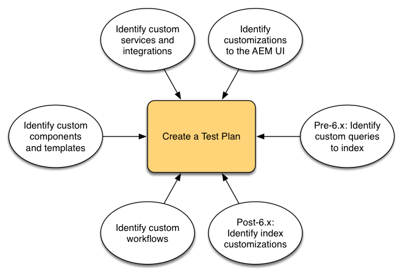
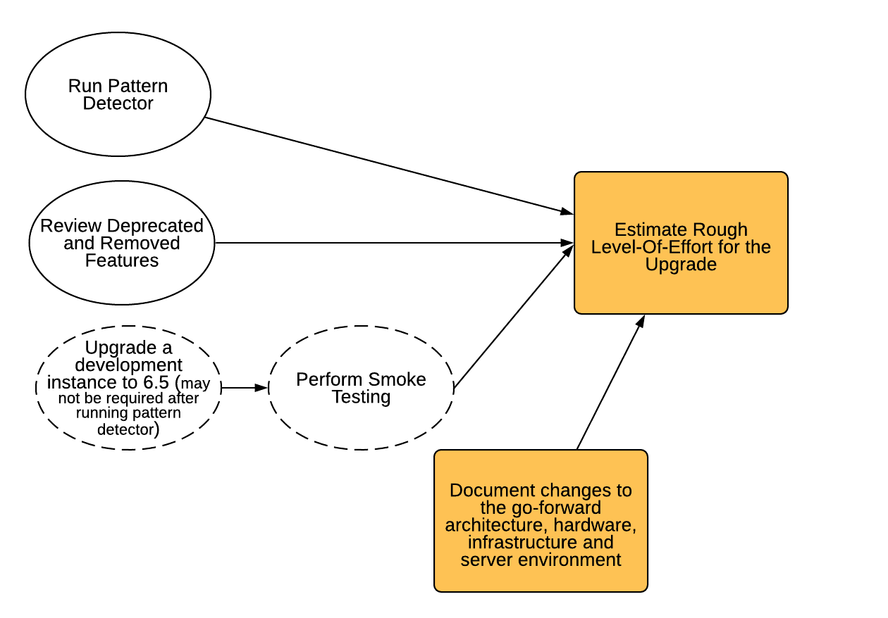
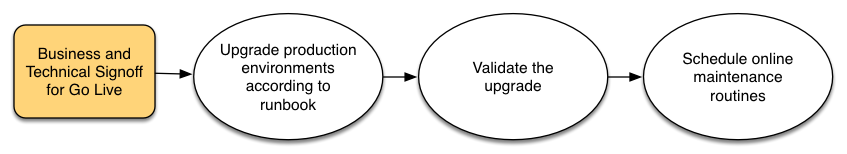

# Uw upgrade plannen{#planning-your-upgrade}

## Overzicht van AEM-projecten {#aem-project-overview}

AEM wordt vaak gebruikt in hoge impact plaatsingen die miljoenen gebruikers zouden kunnen dienen. In de meeste gevallen, zijn er douanetoepassingen die op de instanties worden opgesteld, die aan de ingewikkeldheid toevoegen. Om het even welke inspanning om zulk een plaatsing te bevorderen moet methodisch worden behandeld.

Deze gids helpt met het vestigen van duidelijke doelstellingen, fasen en deliverables wanneer het planning van uw verbetering. De nadruk ligt op de uitvoering van het project in zijn geheel en op de richtsnoeren. Terwijl het een overzicht van de daadwerkelijke verbeteringsstappen verstrekt, verwijst het naar beschikbare technische middelen waar geschikt. Het moet worden gebruikt in combinatie met de beschikbare technische middelen waarnaar in het document wordt verwezen.

In het AEM-upgradeproces worden de plannings-, analyse- en uitvoeringsfasen zorgvuldig behandeld, waarbij de belangrijkste te leveren items voor elke fase worden gedefinieerd.

Merk op dat het mogelijk is om direct van versies 6.0 en tot 6.5 van AEM te bevorderen. Klanten met 5.6.x en lager moeten eerst upgraden naar versie 6.0 of hoger, waarbij 6.0(SP3) wordt aanbevolen. Ook, wordt het nieuwe formaat van de Tar van het Segment OAK nu gebruikt voor de Opslag van de Knoop van het Segment sinds 6.3, en de opbergplaatsmigratie aan dit nieuwe formaat is verplicht zelfs voor 6.0, 6.1 en 6.2.

>[!CAUTION]
>
>Als u van AEM 6.2 aan 6.3 bevordert, zou u of van versies (**6.2-SP1-GVB1 - -6.2SP1-GVB12.1**) of **6.2SP1-GVB15** vanaf moeten bevorderen. Anders, als u van **6.2SP1-GVB13/6.2SP1GVB14** aan AEM 6.3 bevordert, moet u ook aan minstens versie **6.3.2.2** bevorderen. Anders, zouden de Plaatsen AEM na verbetering ontbreken.

## Toepassingsgebied en vereisten upgraden {#upgrade-scope-requirements}

Hieronder vindt u een lijst van gebieden die worden beïnvloed in een typisch AEM-upgradeproject:

<table>
 <tbody>
  <tr>
   <td><strong>Onderdeel</strong></td>
   <td><strong>Gevolgen</strong></td>
   <td><strong>Beschrijving</strong></td>
  </tr>
  <tr>
   <td>Besturingssysteem</td>
   <td>Onzekere, maar subtiele effecten</td>
   <td>Op het moment van de AEM-upgrade kan het tijd zijn om het besturingssysteem te upgraden en dit kan enige invloed hebben.</td>
  </tr>
  <tr>
   <td>Java Runtime</td>
   <td>Matig effect</td>
   <td>Voor AEM 6.3 is JRE 1,7.x (64-bits) of hoger vereist. JRE 1.8 is de enige versie die momenteel door Oracle wordt ondersteund.</td>
  </tr>
  <tr>
   <td>Hardware</td>
   <td>Matig effect</td>
   <td>Voor het online opschonen van wijzigingen is vrije  schijfruimte vereist die gelijk is aan 25% van de grootte van de repository en 15% vrije heapruimte  om deze met succes te voltooien. Mogelijk moet u uw hardware upgraden om te zorgen  voor voldoende resources voor het opschonen van online revisie om deze volledig  uit te voeren. Bovendien, als bevordering van een versie voorafgaand aan AEM 6, kan er  extra opslagvereisten zijn.</td>
  </tr>
  <tr>
   <td>Bewaarplaats voor inhoud (CRX of eiken)</td>
   <td>Hoge impact</td>
   <td>Beginnend van versie 6.1, steunt AEM CRX2 niet, zodat wordt een migratie aan  Oak (CRX3) vereist als bevordering van een oudere versie. AEM 6.3 heeft  een nieuwe Opslag van de Knoop van het Segment uitgevoerd die ook een migratie vereist. Voor dit doel wordt het  crx2oak-programma gebruikt.</td>
  </tr>
  <tr>
   <td>AEM-onderdelen/inhoud</td>
   <td>Matig effect</td>
   <td><code>/libs</code> en gemakkelijk door de verbetering <code>/apps</code> worden behandeld, maar <code>/etc</code> vereist gewoonlijk één of andere handre-toepassing van aanpassingen.</td>
  </tr>
  <tr>
   <td>AEM Services</td>
   <td>Laag effect</td>
   <td>De meeste AEM kerndiensten worden getest voor verbetering. Dit is een gebied met een geringe impact.</td>
  </tr>
  <tr>
   <td>Aangepaste toepassingsservices</td>
   <td>Laag tot hoog effect</td>
   <td>Afhankelijk van de toepassing en de aanpassing, kunnen er gebiedsdelen op JVM, werkend systeemversies en sommige het indexeren verwante   veranderingen zijn, aangezien de indexen niet automatisch in Oak worden geproduceerd.</td>
  </tr>
  <tr>
   <td>Aangepaste toepassingsinhoud</td>
   <td>Laag tot hoog effect</td>
   <td>De inhoud die niet door de verbetering zal worden behandeld kan worden gesteund  alvorens de verbetering plaatsvindt en dan terug naar de bewaarplaats wordt verplaatst.  De meeste inhoud kan door het migratiehulpmiddel worden behandeld.</td>
  </tr>
 </tbody>
</table>

Het is belangrijk om ervoor te zorgen dat u een gesteund werkend systeem, runtime van Java, httpd en de versie van de Verzender in werking stelt. Voor meer informatie, zie [AEM 6.5 de pagina](/help/sites-deploying/technical-requirements.md)van Technische Vereisten. De bevordering van deze componenten zal rekenschap moeten geven van in uw projectplan en zou moeten plaatsvinden alvorens AEM te bevorderen.

## Projectfasen {#project-phases}

Veel werk gaat in planning en het uitvoeren van een verbetering AEM. Om de verschillende inspanningen die in dit proces worden geleverd te verduidelijken, hebben we de plannings- en uitvoeringsoefeningen in afzonderlijke fasen onderverdeeld. In de secties hieronder, resulteert elke fase in een leverbaar dat vaak hefboomwerkend door een toekomstige fase van het project is.

### Planning voor de Opleiding van de Auteur {#planning-for-author-training}

Met om het even welke nieuwe versie, zijn er potentiële veranderingen in UI en gebruikerswerkschema&#39;s die kunnen worden geïntroduceerd. Bovendien, introduceren de nieuwe versies nieuwe eigenschappen die voor de zaken aan hefboomwerking gunstig kunnen zijn. Wij adviseren het herzien van de functionele veranderingen die zijn geïntroduceerd en het organiseren van een plan om uw gebruikers op het effectief leveraging van hen op te leiden.

Nieuwe functies in AEM 6.5 zijn te vinden in [het AEM-gedeelte van adobe.com](/help/release-notes/release-notes.md). Zorg ervoor om van om het even welke veranderingen in UIs of producteigenschappen nota te nemen die algemeen in uw organisatie worden gebruikt. Aangezien u door de nieuwe eigenschappen kijkt, neem ook nota van om het even welk die van waarde aan uw organisatie kan zijn. Na het bekijken van wat in AEM 6.5 is veranderd, stel een opleidingsplan voor uw auteurs op. Dit zou het hefboomwerkend vrij beschikbare middelen zoals de helpxeigenschapvideo&#39;s of formele opleiding kunnen impliceren die door de Digitale het Leren van [Adobe Diensten](https://www.adobe.com/training.html)wordt aangeboden.

### Een testplan maken {#creating-a-test-plan}

De implementatie van AEM door elke klant is uniek en is aangepast om aan hun bedrijfsvereisten te voldoen. Dientengevolge, is het belangrijk om alle aanpassingen te bepalen die aan het systeem zijn gemaakt zodat zij in een testplan kunnen worden omvat. Dit testplan zal het proces van QA aandrijven dat wij op de promotieinstantie uitvoeren.

De nauwkeurige productiemilieu moet worden gedupliceerd en het testen zou op het na de verbetering moeten worden uitgevoerd om ervoor te zorgen alle toepassingen en douanecode nog lopen zoals gewenst. U moet al uw aanpassingen terugdringen en prestaties, belasting en beveiligingstests uitvoeren. Wanneer het organiseren van uw testplan, zorg ervoor om alle aanpassingen te behandelen die aan het systeem naast uit de doos UIs en werkschema&#39;s zijn gemaakt die in uw dagelijkse verrichtingen leveraged zijn. Deze kunnen de diensten en de servers van douaneOSGI, integraties aan de Wolk van de Marketing van Adobe, integraties met derden door AEM schakelaars, de integratie van de douane derde, douanecomponenten en malplaatjes, douaneUI bekledingen in AEM, en douanestroom omvatten. Voor klanten die van een versie voorafgaand aan AEM 6 migreren, zouden om het even welke douanevragen moeten worden geanalyseerd aangezien deze kunnen moeten worden geïndexeerd. Voor klanten die reeds op een versie AEM 6.x zijn, zouden deze vragen nog moeten worden getest om ervoor te zorgen dat hun indexen effectief na bevordering blijven werken.

### Het bepalen van de Benodigde Veranderingen van de Architectuur en van de Infrastructuur {#determining-architectural-and-infrastructure-changes-needed}

Wanneer u een upgrade uitvoert, is het mogelijk dat u ook andere onderdelen in uw technische stack moet upgraden, zoals het besturingssysteem of JVM. Bovendien is het mogelijk dat als gevolg van wijzigingen in de samenstelling van de repository extra hardware nodig kan zijn. Dit komt gewoonlijk slechts voor klanten omhoog die van pre 6.x instanties migreren maar is belangrijk om te overwegen. Tot slot kunnen er veranderingen nodig zijn in uw operationele praktijken met inbegrip van controle, onderhoud, en steun en rampenterugwinningsprocessen.

Controleer de technische vereisten voor AEM 6.5 en zorg ervoor dat uw huidige hardware en software voldoende zijn. Voor potentiële veranderingen in uw operationele processen, zie de volgende documenten:

**Monitoring en onderhoud:**

[Operations Dashboard](/help/sites-administering/operations-dashboard.md)

[Best practices voor het monitoren van bedrijfsmiddelen](/help/assets/assets-monitoring-best-practices.md)

[De Middelen van de Server van de controle die de Console gebruiken JMX](/help/sites-administering/jmx-console.md)

[Herziening opschonen](/help/sites-deploying/revision-cleanup.md)

**Back-up/herstel en noodherstel:**

[Back-up en herstel](/help/sites-administering/backup-and-restore.md)

[Prestaties en schaalbaarheid](/help/sites-deploying/performance.md)

[Hoe u AEM kunt uitvoeren met TarMK-koude stand-by](/help/sites-deploying/tarmk-cold-standby.md)

#### Overwegingen voor contentherstructurering {#content-restructuring-considerations}

AEM heeft wijzigingen aangebracht in de structuur van de repository die zullen helpen om upgrades naadloos te maken. De veranderingen impliceren het bewegen van inhoud uit de /etc omslag naar omslagen met inbegrip van /libs, /apps, en /content, die op wordt gebaseerd of Adobe of een klant de inhoud bezit, waarbij de kansen worden beperkt om inhoud tijdens versies te beschrijven. De herstructurering van de opslagplaats is zodanig uitgevoerd dat er geen veranderingen in de code nodig zijn op het moment van de upgrade van 6,5, hoewel het aanbevolen wordt de details bij de herstructurering van de [opslagplaats in AEM](/help/sites-deploying/repository-restructuring.md) te herzien bij de planning van een upgrade.

### Het beoordelen van de Complexiteit van de Verbetering {#assessing-upgrade-complexity}

Gezien de grote verscheidenheid in de hoeveelheid en de aard van aanpassingen die onze klanten op hun milieu&#39;s AEM toepassen, is het belangrijk om wat tijd vooraf door te brengen om het algemene niveau van inspanning te bepalen dat in uw verbetering zou moeten worden verwacht.

Er zijn twee benaderingen u kunt nemen om de ingewikkeldheid van de verbetering te beoordelen, kan een inleidende fase enkel de onlangs geïntroduceerde Detector van het Patroon gebruiken die beschikbaar is om op uw AEM 6.1, 6.2 en 6.3 instanties te lopen. De patroondetector is de gemakkelijkste manier om de algehele complexiteit van de upgrade te beoordelen met behulp van gerapporteerde patronen. Het rapport van de patroondetector bevat patronen voor het identificeren van niet-beschikbare API&#39;s die in gebruik zijn door de aangepaste codebase (dit is gedaan met de compatibiliteitscontroles vóór de upgrade in 6.3).

Na de eerste beoordeling, zou een uitvoerigere volgende stap kunnen zijn een verbetering op een testinstantie uit te voeren en wat basisrooktests uit te voeren. Adobe verstrekt ook wat. Bovendien, zou de lijst van [Afgekeurde en Verwijderde Eigenschappen](/help/release-notes/deprecated-removed-features.md) niet alleen voor de versie moeten worden herzien die u aan, maar ook voor om het even welke versies tussen uw bron en doelversies bevordert. Bijvoorbeeld, als bevordering van AEM 6.2 aan 6.5, is het belangrijk om AEM 6.3 te herzien afgekeurde en verwijderde eigenschappen naast die voor AEM 6.5.

De detector Patroon die onlangs is geïntroduceerd, zou u een redelijk nauwkeurige schatting moeten geven van wat u tijdens een upgrade voor de meeste gevallen kunt verwachten. Nochtans, voor complexere aanpassingen en plaatsingen waar u onverenigbare veranderingen hebt kunt u een ontwikkelingsinstantie aan AEM 6.5 volgens de instructies in het [Uitvoeren van een Verbetering](/help/sites-deploying/in-place-upgrade.md)op zijn plaats bevorderen. Voer na voltooiing een of andere rooktest op hoog niveau uit op deze omgeving. Het doel van deze oefening is niet om de testcase-inventaris volledig te voltooien en een formele inventaris van defecten op te stellen, maar om ons een ruwe schatting te geven van de hoeveelheid werk die nodig zal zijn om de code voor 6.5 verenigbaarheid te verbeteren. Wanneer gecombineerd met de Opsporing [van het](/help/sites-deploying/pattern-detector.md) Patroon en de architecturale veranderingen die in de vorige sectie werden bepaald, kan een ruwe schatting aan het team van het projectbeheer voor de planning van de verbetering worden verstrekt.

### Het bouwen van de Verbetering en Runbook van het Terugschroeven van prijzen {#building-the-upgrade-and-rollback-runbook}

Terwijl Adobe het proces om een instantie te bevorderen AEM heeft gedocumenteerd, zullen de het netwerklay-out van elke klant, plaatsingsarchitectuur en aanpassingen verfijning en het maken van deze benadering vereisen. Om deze reden, moedigen wij u aan om alle documentatie te herzien die wij hebben verstrekt en het te gebruiken om een project-specifiek runbook te informeren dat de specifieke verbetering en het terugschroeven van prijzenprocedures schetst die u in uw milieu zult volgen. Als u een upgrade uitvoert van CRX2, moet u evalueren hoe lang de migratie van content duurt wanneer u van CRX2 naar Oak gaat. Voor grote opslagplaatsen zou het substantieel kunnen zijn.

Wij hebben verbetering en terugschroeven van prijzenprocedures in de Procedure [van de](/help/sites-deploying/upgrade-procedure.md) Verbetering evenals geleidelijke instructies verstrekt voor het toepassen van de verbetering in het Uitvoeren van een [In-place Verbetering](/help/sites-deploying/in-place-upgrade.md). Deze instructies zouden moeten worden herzien en in overweging genomen met uw systeemarchitectuur, aanpassingen, en downtime tolerantie om de aangewezen schakelaar-over en het terugschroeven van prijzenprocedures te bepalen die u tijdens de verbetering zult uitvoeren. Om het even welke veranderingen in architectuur of servergrootte zouden moeten worden omvat wanneer het opstellen van uw aangepast runbook. Het is belangrijk op te merken dat dit als een eerste ontwerp moet worden behandeld. Aangezien uw team hun QA en ontwikkelingscycli voltooit en de verbetering aan het opvoeren milieu opstelt, is het waarschijnlijk dat de behoefte aan sommige extra stappen kan worden vereist. Ideaal gezien, zou dit document genoeg informatie moeten bevatten zodat als het aan een lid van uw verrichtingenpersoneel werd overhandigd, zij de verbetering volledig van de informatie binnen kunnen voltooien.

### Ontwikkelen van een projectplan {#developing-a-project-plan}

Wij kunnen de output van de vorige oefeningen gebruiken om een projectplan te bouwen dat de verwachte chronologie voor onze test of ontwikkelingsinspanningen, opleiding, en daadwerkelijke verbeteringsuitvoering behandelt.

Een uitgebreid projectplan moet het volgende omvatten:

* Afronding van ontwikkelings- en testplannen
* Ontwikkelings- en kwaliteitscontroleomgevingen verbeteren
* Het bijwerken van de basis van de douanecode voor AEM 6.5
* Een QA-test en reparatiecyclus
* Verbetering van de opvoeromgeving
* Integratie, prestaties en belasting testen
* Milieu-certificering
* Ga live

### Uitvoerende Ontwikkeling en QA {#performing-development-and-qa}

Wij hebben procedures verstrekt voor de [Verbetering van Code en Aanpassingen](/help/sites-deploying/upgrading-code-and-customizations.md) om met AEM 6.5 compatibel te zijn. Aangezien dit iteratieve proces wordt uitgevoerd, zouden de veranderingen in runbook moeten worden aangebracht zoals nodig. Zie ook [Achterwaartse Verenigbaarheid in AEM 6.5](/help/sites-deploying/backward-compatibility.md) op informatie over hoe uw aanpassingen achteruit compatibel kunnen blijven in de meeste gevallen zonder ontwikkeling onmiddellijk na verbetering te vereisen.

Het ontwikkelings- en testproces is gewoonlijk een iteratief proces. Door aanpassingen, konden de veranderingen tijdens de verbetering worden aangebracht een volledige sectie van het product onbruikbaar maken. Zodra de ontwikkelaars de worteloorzaak van de kwestie hebben aangepakt en het testende team toegang heeft om deze eigenschappen te testen, is er potentieel om extra problemen te ontdekken. Aangezien de kwesties worden ontdekt die aanpassingen aan het verbeteringsproces vereisen, zorg ervoor om hen aan uw runbook van de douaneverbetering toe te voegen. Na verscheidene herhalingen van het testen en het bevestigen, zou de codebasis volledig moeten worden bevestigd en voor plaatsing aan het opvoerende milieu klaar zijn.

### Eindtest {#final-testing}

Wij adviseren een definitieve ronde van het testen nadat de codebase door het team van QA van uw organisatie is verklaard. Deze ronde van het testen zal impliceren het bevestigen van uw runbook op een het opvoeren milieu dat door ronden van gebruikersaanvaarding, prestaties, en veiligheidstests wordt gevolgd.

Deze stap is essentieel aangezien het de enige tijd is dat u de stappen in runbook tegen een productie-gelijkend milieu kunt bevestigen. Zodra het milieu is bevorderd, is het belangrijk om eindgebruikers wat tijd toe te staan aan login en door de activiteiten te gaan die zij wanneer het gebruiken van het systeem in hun dagelijkse activiteiten doen. Het is niet ongebruikelijk voor gebruikers om een deel van het systeem leveraging dat niet eerder werd overwogen. Het vinden van en het verbeteren van kwesties in deze gebieden vóór go-live kunnen helpen om dure productiestortingen te verhinderen. Aangezien een nieuwe versie van AEM significante veranderingen in het onderliggende platform bevat, is het ook belangrijk om prestaties, lading en veiligheidstests op het systeem uit te voeren alsof wij het voor het eerst lanceerden.

### De upgrade uitvoeren {#performing-the-upgrade}

Zodra van alle belanghebbenden een definitief aftekening is ontvangen, is het tijd om de vastgelegde runbook-procedures uit te voeren. Wij hebben stappen voor verbetering en terugschroeven van prijzen in de [Procedure](/help/sites-deploying/upgrade-procedure.md) van de Verbetering en installatiestappen verstrekt in het Uitvoeren van een [op-plaats Verbetering](/help/sites-deploying/in-place-upgrade.md) als verwijzingspunt.

Wij hebben enkele stappen in de verbeteringsinstructies voor milieubevestiging verstrekt. Deze omvatten basiscontroles zoals het aftasten van de verbeteringslogboeken en het verifiëren dat alle bundels OSGi behoorlijk zijn begonnen, maar wij adviseren ook het bevestigen met uw eigen testgevallen die op uw bedrijfsprocessen worden gebaseerd. Wij adviseren ook controlerend het programma van de Online Opruiming van de Revisie van AEM en verwante routines om ervoor te zorgen dat zij tijdens een stil tijd voor uw bedrijf zullen voorkomen. Deze routines zijn essentieel voor de langetermijnprestaties van AEM.
