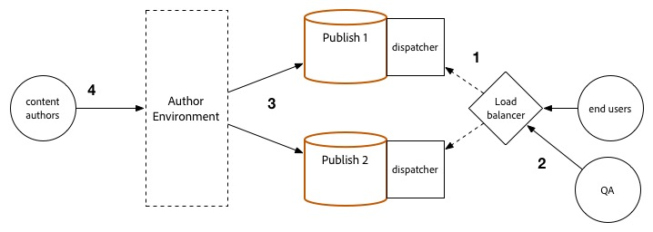

# Upgradeprocedure {#upgrade-procedure}

>[!NOTE]
>
>De upgrade vereist downtime voor de Auteur-laag, aangezien de meeste Adobe Experience Manager-upgrades (AEM) op hun plaats worden uitgevoerd. Met deze tips en trucs kunt u downtime in Publish-lagen minimaliseren of elimineren.

Wanneer u uw AEM-omgevingen upgradet, moet u rekening houden met de verschillen in aanpak tussen het upgraden van de auteursomgevingen of het publiceren van omgevingen om downtime voor zowel uw auteurs als eindgebruikers te minimaliseren. Deze pagina schetst de procedure op hoog niveau voor de bevordering van een AEM topologie die momenteel op een versie van AEM 6.x loopt. Omdat het proces tussen auteur en publicatielagen en op Mongo en TarMK gebaseerde plaatsingen verschilt, is elke rij en microkernel vermeld in een afzonderlijke sectie. Wanneer het uitvoeren van uw plaatsing, adviseert de Adobe eerst uw auteursmilieu te bevorderen, bepalend succes, en dan aan de publicatiemilieu&#39;s te werk te gaan.

<!--
>[!IMPORTANT]
>
>The downtime during the upgrade can be significally reduced by indexing the repository before performing the upgrade. For more information, see [Using Offline Reindexing To Reduce Downtime During an Upgrade](/help/sites-deploying/upgrade-offline-reindexing.md)
-->

## TarMK-auteurreeks {#tarmk-author-tier}

### Begintopologie {#starting-topology}

De veronderstelde topologie voor deze sectie bestaat uit een server van de Auteur die op TarMK met een Koude Reserve loopt. De replicatie komt van de server van de Auteur aan TarMK voor publiceert landbouwbedrijf. Hoewel hier niet geïllustreerd, kan deze benadering ook voor plaatsingen worden gebruikt die het ontladen gebruiken. Zorg ervoor om de het ontladen instantie op de nieuwe versie te bevorderen of te herbouwen na het onbruikbaar maken van replicatieagenten op de instantie van de Auteur en alvorens hen opnieuw toe te laten.

### Voorbereiding upgrade {#upgrade-preparation}

1. Inhoud niet schrijven.

1. Stop de stand-by instantie.

1. Schakel replicatieagents op de auteur uit.

1. Stel de [&#x200B; preupgrade onderhoudstaken &#x200B;](/help/sites-deploying/pre-upgrade-maintenance-tasks.md) in werking.

### Uitvoering upgrade {#upgrade-execution}

1. Voer de [&#x200B; verbetering op zijn plaats &#x200B;](/help/sites-deploying/in-place-upgrade.md) in werking.
1. Werk de module van Dispatcher *indien nodig* bij.

1. QA valideert de verbetering.

1. Sluit de instantie van de auteur af.

### Indien gelukt {#if-successful}

1. Kopieer de geüpgrade instantie om een koude stand-by te maken.

1. Start de instantie Auteur.

1. Start de Standby-instantie.

### Indien mislukt (Terugdraaien) {#if-unsuccessful-rollback}

1. Start de Cold Standby-instantie als de nieuwe primaire instantie.

1. Maak de Auteur-omgeving opnieuw vanuit de koude stand-by.

## Auteurscluster MongoMK {#mongomk-author-cluster}

### Begintopologie {#starting-topology-1}

De veronderstelde topologie voor deze sectie bestaat uit een cluster van de Auteur MongoMK met minstens twee AEM instanties van de Auteur, gesteund door minstens twee gegevensbestanden MongoMK. Alle instanties van Auteurs delen een datastore. Deze stappen zouden op zowel S3 als de datastores van het Dossier moeten van toepassing zijn. De replicatie komt van de servers van de Auteur aan het landbouwbedrijf TarMK Publish voor.

### Voorbereiding upgrade {#upgrade-preparation-1}

1. Inhoud niet schrijven.
1. Kloont de gegevensopslag voor back-up.
1. Stop op één na alle AEM instantie Auteur, uw primaire auteur.
1. Verwijder op één na alle MongoDB-knooppunten uit de replicaset, uw primaire Mongo-instantie.
1. Werk het `DocumentNodeStoreService.cfg` -bestand op de primaire auteur bij om de één lidreplicaset te weerspiegelen.
1. Start de primaire auteur opnieuw om ervoor te zorgen dat deze opnieuw op de juiste wijze wordt opgestart.
1. Schakel replicatieagents op de primaire auteur uit.
1. Voer [&#x200B; preupgrade onderhoudstaken &#x200B;](/help/sites-deploying/pre-upgrade-maintenance-tasks.md) op de primaire instantie van de Auteur in werking.
1. Indien nodig, bevorder MongoDB op de primaire instantie Mongo aan versie 3.2 met WiredTiger.

### Uitvoering upgrade {#Upgrade-execution-1}

1. Stel een [&#x200B; verbetering &#x200B;](/help/sites-deploying/in-place-upgrade.md) op plaats op de primaire Auteur in werking.
1. Werk Dispatcher of Module van het Web *indien nodig* bij.
1. QA valideert de verbetering.

### Indien gelukt {#if-successful-1}

1. Maak nieuwe 6.5 Auteur-instanties die zijn verbonden met de geüpgrade Mongo-instantie.

1. Maak de MongoDB-knooppunten die uit de cluster zijn verwijderd, opnieuw.

1. Werk de `DocumentNodeStoreService.cfg` bestanden bij met de volledige replicaset.

1. Start de instanties Auteur opnieuw, één voor één.

1. Verwijder de gekloonde gegevensopslag.

### Indien mislukt (Terugdraaien)  {#if-unsuccessful-rollback-2}

1. Wijzig de secundaire instanties van de Auteur om met de gekloonde gegevensopslag te verbinden.

1. Sluit de bijgewerkte primaire instantie van Auteur.

1. Sluit de bijgewerkte primaire instantie van Mongo af.

1. Start de secundaire Mongo-instanties op met een van hen als de nieuwe primaire instantie.

1. Configureer de `DocumentNodeStoreService.cfg` -bestanden op de secundaire Author-instanties om te wijzen naar de replicaset van nog niet bijgewerkte Mongo-instanties.

1. Start de secundaire Auteur-instanties op.

1. Maak de bijgewerkte auteur-instanties, het Mongo-knooppunt en de gegevensopslag leeg.

## TarMK Publish Farm {#tarmk-publish-farm}

### TarMK Publish Farm {#tarmk-publish-farm-1}

De veronderstelde topologie voor deze sectie bestaat uit twee te publiceren TarMK instanties, die door Dispatchers worden geleid die beurtelings door een taakverdelingsmechanisme worden voorafgegaan. De replicatie komt van de server van de Auteur aan het landbouwbedrijf van TarMK Publish voor.

### Uitvoering upgrade {#upgrade-execution-2}

1. Stop het verkeer naar de Publish 2-instantie bij het taakverdelingsmechanisme.
1. Looppas [&#x200B; pre-verbeteringsonderhoud &#x200B;](/help/sites-deploying/pre-upgrade-maintenance-tasks.md) op Publish 2.
1. Voer een [&#x200B; op zijn plaats verbetering &#x200B;](/help/sites-deploying/in-place-upgrade.md) op Publish 2 in werking.
1. Werk Dispatcher of Module van het Web *indien nodig* bij.
1. Maak de Dispatcher cache leeg.
1. QA valideert Publish 2 door de Dispatcher, achter de firewall.
1. Publish afsluiten 2.
1. Kopieer het Publish 2-exemplaar.
1. Start Publish 2.

### Indien gelukt {#if-successful-2}

1. Verkeer naar Publish 2 inschakelen.
1. Stop het verkeer naar Publish 1.
1. Stop de Publish 1-instantie.
1. Vervang Publish 1 door een kopie van Publish 2.
1. Werk Dispatcher of Module van het Web *indien nodig* bij.
1. Maak de Dispatcher cache leeg voor Publish 1.
1. Start Publish 1.
1. QA valideert Publish 1 door de Dispatcher, achter de firewall.

### Indien mislukt (Terugdraaien) {#if-unsuccessful-rollback-1}

1. Maak een kopie van Publish 1.
1. Vervang Publish 2 door een kopie van Publish 1.
1. Maak de Dispatcher cache leeg voor Publish 2.
1. Start Publish 2.
1. QA valideert Publish 2 door de Dispatcher, achter de firewall.
1. Verkeer naar Publish 2 inschakelen.

## Eindstappen voor upgrade {#final-upgrade-steps}

1. Verkeer naar Publish 1 inschakelen.
1. QA voert definitieve bevestiging van een openbare URL uit.
1. Schakel replicatieagents in de auteuromgeving.
1. Inhoud opnieuw ontwerpen.
1. Voer [&#x200B; post-verbeteringscontroles &#x200B;](/help/sites-deploying/post-upgrade-checks-and-troubleshooting.md) uit.

