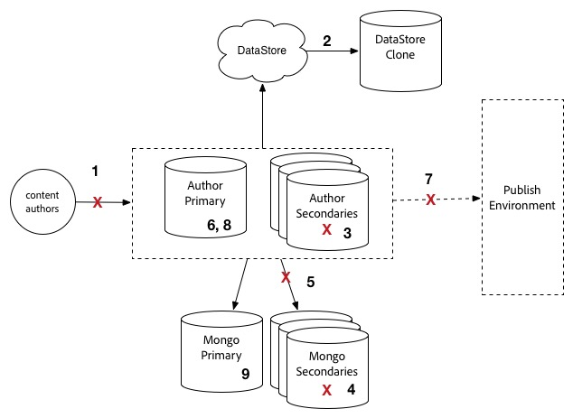
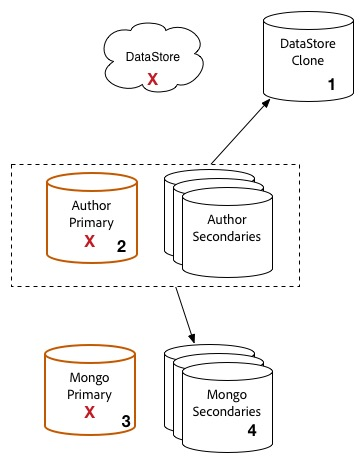

# Upgradeprocedure {#upgrade-procedure}

>[!NOTE]
>
>De upgrade vereist downtime voor de Auteur-laag omdat de meeste AEM upgrades op hun plaats worden uitgevoerd. Door deze beste praktijken te volgen, kan de Publish laagonderbreking worden geminimaliseerd of worden geëlimineerd.

Wanneer u uw AEM-omgevingen upgradet, moet u rekening houden met de verschillen in aanpak tussen het upgraden van auteursomgevingen of het publiceren van omgevingen om downtime voor zowel uw auteurs als eindgebruikers tot een minimum te beperken. Deze pagina schetst de procedure op hoog niveau voor de bevordering van een AEM topologie die momenteel op een versie van AEM 6.x loopt. Aangezien het proces tussen auteur en publicatieniveaus evenals op Mongo en TarMK gebaseerde plaatsingen verschilt, is elke rij en microkernel vermeld in een afzonderlijke sectie. Wanneer het uitvoeren van uw plaatsing, adviseren wij eerst uw auteursmilieu te bevorderen, bepalend succes, en dan aan de publicatiemilieu&#39;s te werk te gaan.

>[!IMPORTANT]
>
>De downtime tijdens de upgrade kan aanzienlijk worden verminderd door de repository te indexeren voordat de upgrade wordt uitgevoerd. Zie Offlineindexering [gebruiken om tijdens een upgrade de downtime te verminderen voor meer informatie](/help/sites-deploying/upgrade-offline-reindexing.md)

## TarMK-auteurreeks {#tarmk-author-tier}

### Begintopologie {#starting-topology}

De veronderstelde topologie voor deze sectie bestaat uit een server van de Auteur die op TarMK met een Koude Reserve loopt. De replicatie komt van de server van de Auteur aan TarMK voor publiceert landbouwbedrijf. Hoewel deze aanpak hier niet wordt geïllustreerd, kan deze ook worden gebruikt voor implementaties die offloading gebruiken. Zorg ervoor om de het ontladen instantie op de nieuwe versie te bevorderen of te herbouwen na het onbruikbaar maken van replicatieagenten op de instantie van de Auteur en alvorens hen opnieuw toe te laten.

### Voorbereiding upgrade {#upgrade-preparation}

1. Scripting van inhoud stoppen

1. De stand-byinstantie stoppen

1. Maak replicatieagenten op de auteur onbruikbaar

1. Voer de [onderhoudstaken](/help/sites-deploying/pre-upgrade-maintenance-tasks.md)van vóór de upgrade uit.

### Uitvoering upgrade {#upgrade-execution}

1. Voer de [upgrade ter plekke uit](/help/sites-deploying/in-place-upgrade.md)
1. Werk de verzendingsmodule *indien nodig bij*

1. QA bevestigt de verbetering

1. Sluit de instantie van de auteur af.

### Indien gelukt {#if-successful}

1. Kopieer de geüpgrade instantie om een nieuwe Cold Standby te maken

1. De instantie Auteur starten

1. Start de Standby-instantie.

### Indien mislukt (Terugdraaien) {#if-unsuccessful-rollback}

1. De Cold Standby-instantie starten als de nieuwe primaire

1. Maak de Auteur-omgeving opnieuw vanuit de koude stand-by.

## Auteurscluster MongoMK {#mongomk-author-cluster}

### Begintopologie {#starting-topology-1}

De veronderstelde topologie voor deze sectie bestaat uit een cluster van de Auteur MongoMK met minstens twee instanties van de Auteur AEM, gesteund door minstens twee gegevensbestanden MongoMK. Alle instanties van Auteurs delen een datastore. Deze stappen zouden op zowel S3 als de datastores van het Dossier moeten van toepassing zijn. De replicatie komt van de servers van de Auteur aan het TarMK voor publiceert landbouwbedrijf.

### Voorbereiding upgrade {#upgrade-preparation-1}

1. Scripting van inhoud stoppen
1. De gegevensopslag klonen voor back-up
1. Alles stoppen, behalve één instantie van AEM-auteur, uw primaire auteur
1. Op één na alle MongoDB-knooppunten verwijderen uit de replicaset, uw primaire Mongo-instantie
1. Het `DocumentNodeStoreService.cfg` bestand op de primaire auteur bijwerken om de herhaalde set met één lid weer te geven
1. Start de primaire auteur opnieuw om ervoor te zorgen dat deze opnieuw op de juiste wijze wordt opgestart
1. Maak replicatieagenten op de primaire Auteur onbruikbaar
1. Onderhoudstaken  vóór de upgrade uitvoeren op de primaire instantie van de auteur
1. Indien nodig, upgrade MongoDB op de primaire Mongo-instantie naar versie 3.2 met WiredTiger

### Uitvoering upgrade {#Upgrade-execution-1}

1. Voer een [upgrade](/help/sites-deploying/in-place-upgrade.md) ter plekke uit op de primaire auteur
1. Werk de Dispatcher of de Module van het Web *indien nodig bij*
1. QA bevestigt de verbetering

### Indien gelukt {#if-successful-1}

1. Nieuwe 6.5-auteur-instanties maken die zijn verbonden met de geüpgrade Mongo-instantie

1. De MongoDB-knooppunten die uit de cluster zijn verwijderd, opnieuw samenstellen

1. De `DocumentNodeStoreService.cfg` bestanden bijwerken met de volledige replicaset

1. De instanties van de Auteur opnieuw, één voor één

1. Verwijder de gekloonde gegevensopslag.

### Indien mislukt (Terugdraaien)  {#if-unsuccessful-rollback-2}

1. De secundaire Auteur opnieuw configureren om verbinding te maken met de gekloonde gegevensopslag

1. De bijgewerkte primaire instantie van de auteur uitschakelen

1. Sluit de bijgewerkte primaire instantie van Mongo af.

1. Start de secundaire Mongo-instanties op met een van deze als nieuwe primaire

1. Vorm de `DocumentNodeStoreService.cfg` dossiers op de secundaire instanties van de Auteur om aan de replicaset te richten die nog niet instanties van Mongo bevordert

1. De secundaire instanties van de auteur opstarten

1. Maak de bijgewerkte auteur-instanties, het Mongo-knooppunt en de gegevensopslag schoon.

## TarMK Publish Farm {#tarmk-publish-farm}

### TarMK Publish Farm {#tarmk-publish-farm-1}

De veronderstelde topologie voor deze sectie bestaat uit twee te publiceren TarMK instanties, die door Dispatchers worden geleid die beurtelings door een taakverdelingsmechanisme worden voorafgegaan. De replicatie komt van de server van de Auteur aan het TarMK voor publiceert landbouwbedrijf.

### Uitvoering upgrade {#upgrade-execution-2}

1. Verkeer naar de instantie Publish 2 stoppen bij het taakverdelingsmechanisme
1. Onderhoud [voorafgaand aan de upgrade](/help/sites-deploying/pre-upgrade-maintenance-tasks.md) uitvoeren op Publiceren 2
1. Een [upgrade](/help/sites-deploying/in-place-upgrade.md) op locatie uitvoeren bij Publiceren 2
1. Werk de Dispatcher of de Module van het Web *indien nodig bij*
1. De Dispatcher-cache leegmaken
1. QA valideert Publish 2 door Dispatcher, achter de firewall
1. Publicatie 2 afsluiten
1. De instantie Publish 2 kopiëren
1. Publicatie 2 starten

### Indien gelukt {#if-successful-2}

1. Verkeer inschakelen voor publicatie 2
1. Verkeer stoppen om 1 te publiceren
1. De instantie Publish 1 stoppen
1. De instantie Publish 1 vervangen door een kopie van Publish 2
1. Werk de Dispatcher of de Module van het Web *indien nodig bij*
1. De Dispatcher-cache leegmaken voor Publiceren 1
1. Publicatie 1 starten
1. QA valideert Publish 1 door Dispatcher, achter de firewall

### Indien mislukt (Terugdraaien) {#if-unsuccessful-rollback-1}

1. Een kopie van Publiceren 1 maken
1. De instantie Publish 2 vervangen door een kopie van Publish 1
1. De Dispatcher-cache leegmaken voor Publiceren 2
1. Publicatie 2 starten
1. QA valideert Publish 2 door Dispatcher, achter de firewall
1. Verkeer inschakelen voor publicatie 2

## Eindstappen voor upgrade {#final-upgrade-steps}

1. Verkeer inschakelen voor publicatie 1
1. QA voert definitieve bevestiging van een openbare URL uit
1. Replicatieagents inschakelen vanuit de ontwerpomgeving
1. Inhoud opnieuw ontwerpen
1. Controles [na de upgrade uitvoeren](/help/sites-deploying/post-upgrade-checks-and-troubleshooting.md).

