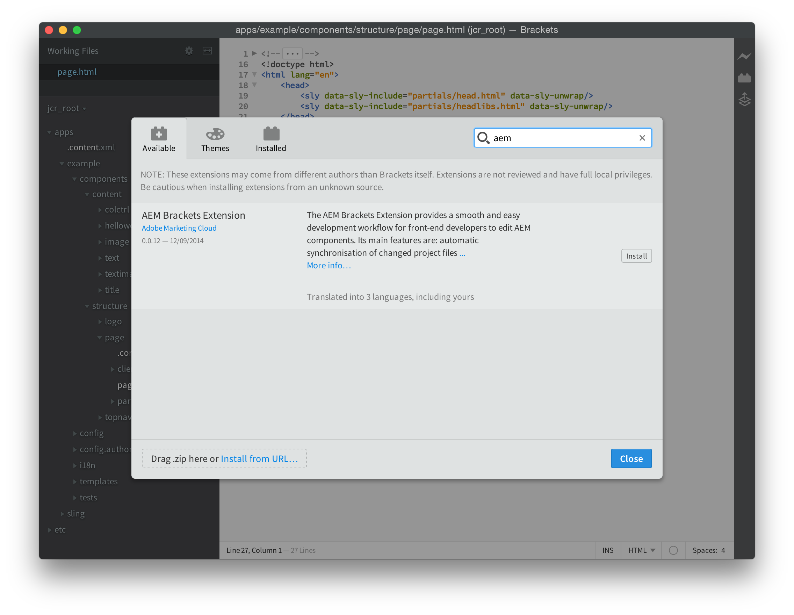

# Extensie AEM{#aem-brackets-extension}

## Overzicht {#overview}

De extensie AEM Brackets biedt een vloeiende workflow voor het bewerken van AEM componenten en clientbibliotheken en gebruikt de kracht van de [Haakjes](https://brackets.io/) code-editor, die vanuit de code-editor toegang biedt tot Photoshop-bestanden en -lagen. De eenvoudige synchronisatie die wordt geboden door de extensie (geen Maven of File Vault vereist) verhoogt de efficiëntie van de ontwikkelaar en helpt ontwikkelaars met beperkte AEM kennis ook om aan projecten deel te nemen. Deze extensie biedt ook enige ondersteuning voor de [HTML Sjabloontaal (HTL)](https://experienceleague.adobe.com/docs/experience-manager-htl/content/overview.html), waardoor de complexiteit van JSP wordt weggenomen om de ontwikkeling van componenten eenvoudiger en veiliger te maken.

### Functies {#features}

De hoofdkenmerken van de extensie AEM Brackets zijn:

* Geautomatiseerde synchronisatie van gewijzigde bestanden naar de AEM-ontwikkelingsinstantie.
* Handmatige tweerichtingssynchronisatie van bestanden en mappen.
* Volledige tevreden-pakket synchronisatie van het project.
* HTML-code-voltooiing voor expressies en `data-sly-*` blokinstructies.

Bovendien zijn er veel handige functies voor AEM ontwikkelaars van lettertypen:

* Photoshop-bestandsondersteuning voor het ophalen van gegevens uit een PSD-bestand, zoals lagen, metingen, kleuren, lettertypen, tekst, enzovoort.
* Coderingstips van de PSD om deze geëxtraheerde informatie in de code eenvoudig te hergebruiken.
* Ondersteuning voor CSS-preprocessor, zoals LESS en SCSS.
* En honderden extra extensies die meer specifieke behoeften dekken.

## Installatie {#installation}

### Haakjes {#brackets}

De extensie AEM Brackets ondersteunt versie 1.0 of hoger.

Download de nieuwste versie Brackets van [brackets.io](https://brackets.io/).

### De extensie {#the-extension}

Ga als volgt te werk om de extensie te installeren:

1. Open haakjes. In menu **Bestand**, selecteert u **Extension Manager...**
1. Enter **AEM** in de zoekbalk en zoek naar **Extensie AEM**.

   

1. Klikken **Installeren**.
1. Sluit het dialoogvenster en de Extension Manager nadat de installatie is voltooid.

## Aan de slag {#getting-started}

### Het content-package project {#the-content-package-project}

Nadat de extensie is geïnstalleerd, kunt u beginnen met het ontwikkelen van AEM componenten door een inhoudspakketmap te openen vanuit uw bestandssysteem met haakjes.

Het project moet ten minste het volgende bevatten:

1. a `jcr_root` map (bijvoorbeeld `myproject/jcr_root`)

1. a `filter.xml` bestand (bijvoorbeeld `myproject/META-INF/vault/filter.xml`); voor meer informatie over de structuur van de `filter.xml` bestand de [Definitie van werkruimtefilter](https://jackrabbit.apache.org/filevault/filter.html).

In haakjes&#39;&#39; **Bestand** menu, kiest u **Map openen...** en kies `jcr_root` of de bovenliggende projectmap.

>[!NOTE]
>
>Als u geen eigen project hebt met een content-package, kunt u het volgende proberen [HTL TodoMVC-voorbeeld](https://github.com/Adobe-Marketing-Cloud/aem-sightly-sample-todomvc). Klik op GitHub **ZIP downloaden**, pakt u de bestanden lokaal uit en opent u de `jcr_root` map in Brackets. Voer vervolgens de onderstaande stappen uit om het **Projectinstellingen** en uploadt u ten slotte het hele pakket naar uw AEM ontwikkelingsinstantie door een **Inhoudspakket exporteren** zoals verder onderaan in de Volledige tevreden-Pakket sectie van de Synchronisatie wordt geïnstrueerd.
>
>Na deze stappen, zou u tot `/content/todo.html` URL op uw AEM ontwikkelingsinstantie en u kunt wijzigingen in de code in Brackets beginnen te doen en zien hoe, na het verfrissen in Webbrowser, de veranderingen onmiddellijk aan de AEM server werden gesynchroniseerd.

### Projectinstellingen {#project-settings}

Als u de inhoud wilt synchroniseren van en naar een AEM-ontwikkelingsinstantie, moet u de projectinstellingen definiëren. Dit kan door naar **AEM** menu en kiezen **Projectinstellingen...**

Met de projectinstellingen kunt u het volgende definiëren:

1. De server-URL (bijvoorbeeld `http://localhost:4502`)
1. Of servers worden getolereerd die geen geldig HTTPS-certificaat hebben (niet ingeschakeld houden, tenzij vereist)
1. De gebruikersnaam die wordt gebruikt voor het synchroniseren van inhoud (bijvoorbeeld `admin`)
1. Het wachtwoord van de gebruiker (bijvoorbeeld `admin`)

## Inhoud synchroniseren {#synchronizing-content}

De extensie AEM Brackets biedt de volgende typen inhoudssynchronisatie voor bestanden en mappen die worden toegestaan door de filterregels die zijn gedefinieerd in `filter.xml`:

### Geautomatiseerde synchronisatie van gewijzigde bestanden {#automated-synchronization-of-changed-files}

Hiermee worden wijzigingen alleen gesynchroniseerd van haakjes naar de AEM-instantie, maar nooit andersom.

### Handmatige tweerichtingssynchronisatie {#manual-bidirectional-synchronization}

Open in de Projectverkenner het contextafhankelijke menu door met de rechtermuisknop op een bestand of map te klikken, en klik op de knop **Exporteren naar server** of **Importeren vanaf server** U hebt toegang tot deze opties.

>[!NOTE]
>
>Als het geselecteerde item zich buiten het `jcr_root` map, de **Exporteren naar server** en **Importeren vanaf server** contextafhankelijke menu-items zijn uitgeschakeld.

### Volledige synchronisatie van inhoudspakketten {#full-content-package-synchronization}

In de **AEM** in het menu **Inhoudspakket exporteren** of **Inhoudspakket importeren** Met opties kunt u het hele project synchroniseren met de server.

### Synchronisatiestatus {#synchronization-status}

De extensie AEM Brackets heeft een waarschuwingspictogram op de werkbalk rechts van het venster Brackets, waarmee de status van de laatste synchronisatie wordt aangegeven:

* groen - alle bestanden zijn gesynchroniseerd
* blauw - een synchronisatiebewerking wordt uitgevoerd
* geel - sommige bestanden zijn niet gesynchroniseerd
* rood - geen van de bestanden is gesynchroniseerd

Wanneer u op het meldingspictogram klikt, wordt het dialoogvenster Synchronisatie-statusrapport geopend met een lijst van alle status voor elk gesynchroniseerd bestand.

>[!NOTE]
>
>Alleen inhoud die is gemarkeerd als opgenomen in de filterregels van `filter.xml` wordt gesynchroniseerd, ongeacht de gebruikte synchronisatiemethode.
>
>Daarnaast `.vltignore` bestanden worden ondersteund om inhoud uit te sluiten van synchronisatie naar en vanuit de opslagplaats.

## HTML-code bewerken {#editing-htl-code}

De extensie AEM Brackets beschikt ook over enkele automatische aantekeningen waarmee het schrijven van HTML-kenmerken en -expressies wordt vergemakkelijkt.

### Kenmerk automatisch voltooid {#attribute-auto-completion}

1. Typ in een HTML-kenmerk `sly`. Het kenmerk wordt automatisch ingevuld bij `data-sly-`.
1. Selecteer het HTML-kenmerk in de vervolgkeuzelijst.

### Uitdrukking automatisch voltooid {#expression-auto-completion}

Binnen een expressie `${}`, worden algemene variabelenamen automatisch ingevuld.

## Meer informatie {#more-information}

De AEM Uitbreiding van de Brackets is een open-bronproject, dat op GitHub door [Adobe Marketing Cloud](https://github.com/Adobe-Marketing-Cloud) organisatie, onder de Apache-licentie, versie 2.0:

* Codeopslagplaats: [https://github.com/Adobe-Marketing-Cloud/aem-sightly-brackets-extension](https://github.com/Adobe-Marketing-Cloud/aem-sightly-brackets-extension)
* Apache-licentie, versie 2.0: [https://www.apache.org/licenses/LICENSE-2.0.html](https://www.apache.org/licenses/LICENSE-2.0.html)

De de coderedacteur van Brackets is ook een open-bronproject, dat op GitHub door [Adobe Systems Incorporated](https://github.com/adobe) organisatie:

* Codeopslagplaats: [https://github.com/adobe/brackets](https://github.com/adobe/brackets)

Voel je vrij om bij te dragen!
