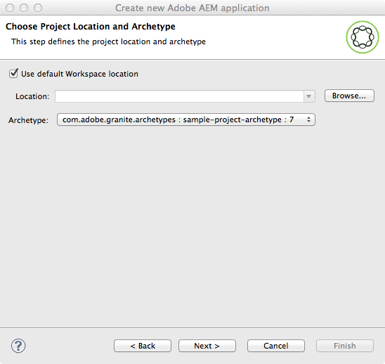

# AEM Developer Tools for Eclipse{#aem-developer-tools-for-eclipse}


## Overzicht {#overview}

&quot;AEM Developer Tools&quot; is een Eclipse-plug-in op basis van de [Eclipse-insteekmodule voor Apache Sling](https://sling.apache.org/documentation/development/ide-tooling.html) vrijgegeven onder de Apache-licentie 2.

Het biedt verschillende functies die AEM ontwikkeling vergemakkelijken:

* Naadloze integratie met AEM instanties door de Schakelaar van de Server van Eclipse.
* Synchronisatie voor inhoud en OSGI-bundels.
* Ondersteuning voor foutopsporing met de functie voor hot-swapping van code.
* Eenvoudige Bootstrap van AEM Projecten door middel van een specifieke Tovenaar van de Aanmaak van het Project.
* Het gemakkelijk uitgeven van eigenschappen JCR.

## Vereisten {#requirements}

Ga als volgt te werk voordat u de AEM Developer Tools gebruikt:

* Downloaden en installeren [Eclipse-IDE voor Java™ EE-ontwikkelaars](https://www.eclipse.org/downloads/packages/release/luna/r/eclipse-ide-java-ee-developers). AEM Developer Tools ondersteunt momenteel Eclipse Kepler of nieuwer

* Kan worden gebruikt met AEM versie 5.6.1 of hoger
* Configureer de lipse-installatie om ervoor te zorgen dat u ten minste 1 GB heapgeheugen hebt door uw `eclipse.ini` configuratiebestand als beschreven in [Veelgestelde vragen over Eclipse](https://wiki.eclipse.org/FAQ_How_do_I_increase_the_heap_size_available_to_Eclipse%3F).

>[!NOTE]
>
>Klik in macOS met de rechtermuisknop **Eclipse.app** en selecteer vervolgens **Toon de Inhoud van het Pakket** om uw `eclipse.ini`.

## Hoe te om de Hulpmiddelen van de Ontwikkelaar van de AEM voor Eclipse te installeren {#how-to-install-the-aem-developer-tools-for-eclipse}

Als u eenmaal aan de [vereisten](#requirements) hierboven kunt u de plug-in als volgt installeren:

1. Bladeren in het dialoogvenster **AEM Developer Tools** website op `https://eclipse.adobe.com/aem/dev-tools/`.

1. De **Installatiekoppeling**.

   U kunt ook een archief downloaden in plaats van de installatiekoppeling te gebruiken. Zo kunt u offline installeren, maar u kunt automatische updatemeldingen niet uitvoeren.

1. Open in Eclipse de **Help** -menu.
1. Klikken **Nieuwe software installeren**.
1. Klikken **Toevoegen...**.
1. In **Naam** type AEM Developer Tools.
1. In **Locatie** kopieer de installatie-URL.
1. Klikken **OK**.
1. Beide controleren **AEM** en **Sling** plug-ins.
1. Klik op **Next**.
1. Klik op **Next**.
1. Accepteer de lokale overeenkomsten en klik op **Voltooien**.
1. Klikken **Ja** om Eclipse opnieuw te starten.

## Bestaande projecten importeren {#how-to-import-existing-projects}

>[!NOTE]
>
>Zie [Hoe te met een bundel in Eclipse te werken toen het van AEM werd gedownload](https://stackoverflow.com/questions/29699726/how-to-work-with-a-bundle-in-eclipse-when-it-was-downloaded-from-aem/29705407#29705407).

## Het AEM perspectief {#the-aem-perspective}

De hulpmiddelen van de Ontwikkeling van de AEM voor Eclipse schepen met een Perspectief dat u volledige controle over uw AEM Projecten en instanties biedt.


## Monster nemen van meermoduleproject {#sample-multi-module-project}

De &quot;AEM Hulpmiddelen van de Ontwikkelaar&quot;omvatten een steekproef, multi-moduleproject dat u snel met een projectopstelling in Verduistering helpt krijgen. Het dient ook als gids voor beste praktijken aan verscheidene AEM eigenschappen. [Meer informatie over de projectarchetype](https://github.com/adobe/aem-project-archetype).

Voer de volgende stappen uit om het voorbeeldproject te maken:

1. In de **Bestand** > **Nieuw** > **Project** , bladert u naar de **AEM** en selecteert u **AEM Monster nemen van meermoduleproject**.

   

1. Klik op **Next**.

   >[!NOTE]
   >
   >Deze stap kan even duren omdat m2eclipse de archetype catalogi moet aftasten.

   

1. Kies **com.adobe.granite.archetypes : sample-project-archetype : (hoogste getal)** in het menu en klik vervolgens op **Volgende**.

   

1. Een **Naam**, **Groep-id** en **Artefact** voor het voorbeeldproject. U kunt ook bepaalde geavanceerde eigenschappen instellen.

   

1. Configureer nu een AEM server waarmee Eclipse verbinding kan maken.

   Om de debugger eigenschap te gebruiken, ben zeker u AEM op zuivert wijze begonnen, die kan worden bereikt door het volgende aan de bevellijn toe te voegen:

   ```
       -nofork -agentlib:jdwp=transport=dt_socket,server=y,suspend=n,address=10123
   ```

   

1. Klikken **Voltooien**. De projectstructuur wordt gemaakt.

   >[!NOTE]
   >
   >Op een nieuwe installatie (meer specifiek: wanneer bepaalde gebiedsdelen nooit zijn gedownload) zou u het project kunnen krijgen dat met fouten wordt gecreeerd. In dit geval volgt u de in [Ongeldige projectdefinitie oplossen](#resolving-invalid-project-definition).

## Problemen oplossen {#troubleshooting}

### Ongeldige projectdefinitie oplossen {#resolving-invalid-project-definition}

Om ongeldige gebiedsdelen en projectdefinitie op te lossen ga als volgt te werk:

1. Selecteer alle gemaakte projecten.
1. Klik met de rechtermuisknop. In menu **Maven**, selecteert u **Projecten bijwerken**.
1. Controleren **Updates van momentopname/releases forceren**.
1. Klikken **OK**. Eclipse probeert de vereiste afhankelijkheden te downloaden.

### Automatisch aanvullen van tagbibliotheek inschakelen in JSP-bestanden {#enabling-tag-library-autocompletion-in-jsp-files}

Automatisch aanvullen van de tagbibliotheek werkt buiten het vak, aangezien de juiste afhankelijkheden aan het project worden toegevoegd. Er is één bekend probleem wanneer u de AEM Uber Jar gebruikt, dat niet de benodigde tld- en TagExtraInfo-bestanden bevat.

Als u dit wilt omzeilen, zorgt u ervoor dat het artefact org.apache.sling.scripting.jsp.taglib zich in het klassepad vóór de AEM Uber Jar bevindt. Voor Geweven projecten, plaats het volgende gebiedsdeel in pom.xml vóór Uber Jar.

```xml
<dependency>
  <groupId>org.apache.sling</groupId>
  <artifactId>org.apache.sling.scripting.jsp.taglib</artifactId>
  <scope>provided</scope>
</dependency>
```

Zorg ervoor om de juiste versie voor uw plaatsing van AEM toe te voegen.

## Meer informatie {#more-information}

Op de officiële Apache Sling IDE-website voor Eclipse vindt u nuttige informatie:

* De [**Apache Sling IDE-gereedschap voor Eclipse** Handboek](https://sling.apache.org/documentation/development/ide-tooling.html), begeleidt deze documentatie u door de algemene concepten, serverintegratie, en plaatsingsmogelijkheden die door de Hulpmiddelen van de Ontwikkeling van de AEM worden gesteund.
* De [Sectie Problemen oplossen](https://sling.apache.org/documentation/development/ide-tooling.html#troubleshooting).
* De [Lijst met bekende problemen](https://sling.apache.org/documentation/development/ide-tooling.html#known-issues).

De volgende ambtenaar [Eclipse](https://www.eclipse.org/) documentatie kan u helpen uw omgeving in te stellen:

* [Aan de slag met Eclipse](https://eclipseide.org/getting-started/)
* [Help-systeem Eclipse Luna](https://help.eclipse.org/latest/index.jsp)
* [Maven Integration (m2eclipse)](https://www.eclipse.org/m2e/)
