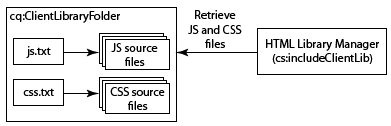

# Client-Side bibliotheken gebruiken{#using-client-side-libraries}

Moderne websites zijn sterk afhankelijk van verwerking op de client door complexe JavaScript- en CSS-code. Het organiseren en optimaliseren van het gebruik van deze code kan een ingewikkeld probleem zijn.

Om dit probleem te verhelpen, biedt AEM **Client-side bibliotheekmappen**, waarmee u uw code aan de clientzijde in de opslagplaats kunt opslaan, deze in categorieën kunt ordenen en kunt definiëren wanneer en hoe elke categorie code aan de client moet worden verzonden. Het bibliotheeksysteem aan de clientzijde zorgt ervoor dat de juiste koppelingen in de uiteindelijke webpagina worden gemaakt om de juiste code te laden.

## Hoe clientbibliotheken werken in AEM {#how-client-side-libraries-work-in-aem}

De standaardmanier om een bibliotheek aan de clientzijde (dat wil zeggen een JS- of CSS-bestand) op te nemen in de HTML van een pagina, is eenvoudig om een `<script>` of `<link>` tag op te nemen in het JSP voor die pagina, die het pad naar het desbetreffende bestand bevat. Bijvoorbeeld,

```xml
...
<head>
   ...
   <script type="text/javascript" src="/etc/clientlibs/granite/jquery/source/1.8.1/jquery-1.8.1.js"></script>
   ...
</head>
...
```

Deze aanpak werkt AEM, maar kan problemen veroorzaken wanneer pagina&#39;s en de bestanddelen ervan complex worden. In dergelijke gevallen bestaat het gevaar dat meerdere exemplaren van dezelfde JS-bibliotheek in de uiteindelijke HTML-uitvoer worden opgenomen. Om dit te vermijden en logische organisatie van cliënt-zijbibliotheken toe te staan AEM **cliënt-zijbibliotheekomslagen** gebruikt.

Een bibliotheekmap op de client is een opslagknooppunt van het type `cq:ClientLibraryFolder`. De definitie in [CND-notatie](https://jackrabbit.apache.org/node-type-notation.html) is

```shell
[cq:ClientLibraryFolder] > sling:Folder
  - dependencies (string) multiple
  - categories (string) multiple
  - embed (string) multiple
  - channels (string) multiple
```

Door gebrek, kunnen de `cq:ClientLibraryFolder` knopen overal binnen `/apps`, `/libs` en `/etc` substructuren van de bewaarplaats worden geplaatst (deze gebreken, en andere montages kunnen door het paneel van de Manager **van de Bibliotheek van** Adobe Granite van HTML van de Console [van het](https://localhost:4502/system/console/configMgr)Systeem worden gecontroleerd).

Elke `cq:ClientLibraryFolder` is gevuld met een set JS- en/of CSS-bestanden, samen met enkele ondersteunende bestanden (zie hieronder). De eigenschappen van de `cq:ClientLibraryFolder` worden gevormd als volgt:

* `categories`: Hiermee geeft u de categorieën aan waarin de set JS- en/of CSS-bestanden binnen deze `cq:ClientLibraryFolder` reeks vallen. Met de `categories` eigenschap, die meerdere waarden heeft, kan een bibliotheekmap deel uitmaken van meerdere categorieën (zie hieronder voor meer informatie over de bruikbaarheid).

* `dependencies`: Dit is een lijst van andere categorieën van de cliëntbibliotheek waarvan deze bibliotheekomslag afhangt. Als u bijvoorbeeld twee `cq:ClientLibraryFolder` knooppunten `F` en `G`een bestand in een bestand een ander bestand `F` nodig hebt om `G` het bestand correct te laten functioneren, moet ten minste een van de `categories` knooppunten tot de `G` `dependencies` `F`van behoren.

* `embed`: Wordt gebruikt om code uit andere bibliotheken in te sluiten. Als knooppunt F knooppunten G en H insluit, is de resulterende HTML een concentratie van inhoud van knooppunten G en H.
* `allowProxy`: Als een clientbibliotheek zich onder `/apps`bevindt, staat deze eigenschap toegang tot de bibliotheek toe via proxyservlet. Zie [Een clientbibliotheekmap zoeken en de onderstaande Servlet](/help/sites-developing/clientlibs.md#locating-a-client-library-folder-and-using-the-proxy-client-libraries-servlet) Proxyclientbibliotheken gebruiken.

## Verwijzen naar clientbibliotheken {#referencing-client-side-libraries}

Omdat HTML de aangewezen technologie voor het ontwikkelen van AEM plaatsen is, zou HTML moeten worden gebruikt om cliënt-zijbibliotheken in AEM te omvatten. Het is echter ook mogelijk dit te doen met behulp van JSP.

### HTML gebruiken {#using-htl}

In HTML, worden de cliëntbibliotheken geladen door een helpermalplaatje dat door AEM wordt verstrekt, dat door [ `data-sly-use`](https://helpx.adobe.com/experience-manager/htl/using/block-statements.html#use)kan worden betreden. Er zijn drie sjablonen beschikbaar in dit bestand, dat u kunt aanroepen via [`data-sly-call`](https://helpx.adobe.com/experience-manager/htl/using/block-statements.html#template-call):

* **css** - Hiermee worden alleen de CSS-bestanden geladen van de clientbibliotheken waarnaar wordt verwezen.
* **js** - Hiermee worden alleen de JavaScript-bestanden geladen van de clientbibliotheken waarnaar wordt verwezen.
* **all** - Hiermee worden alle bestanden geladen van de clientbibliotheken waarnaar wordt verwezen (zowel CSS als JavaScript).

Elke helpermalplaatje verwacht een `categories` optie om van de gewenste cliëntbibliotheken van verwijzingen te voorzien. Deze optie kan ofwel een array van tekenreekswaarden zijn, ofwel een tekenreeks met een lijst met door komma&#39;s gescheiden waarden.

Zie het document [Getting Started with the HTML Template Language](https://helpx.adobe.com/experience-manager/htl/using/getting-started.html#loading-client-libraries)voor meer informatie en voorbeelden van gebruik.

### JSP gebruiken {#using-jsp}

Voeg een `ui:includeClientLib` tag toe aan uw JSP-code om een koppeling naar clientbibliotheken in de gegenereerde HTML-pagina toe te voegen. Als u naar de bibliotheken wilt verwijzen, gebruikt u de waarde van de `categories` eigenschap van het `ui:includeClientLib` knooppunt.

```
<%@taglib prefix="ui" uri="https://www.adobe.com/taglibs/granite/ui/1.0" %>
<ui:includeClientLib categories="<%= categories %>" />
```

Het `/etc/clientlibs/foundation/jquery` knooppunt is bijvoorbeeld van het type `cq:ClientLibraryFolder` met een categorie-eigenschap van de waarde `cq.jquery`. De volgende code in een JSP-bestand verwijst naar de bibliotheken:

```xml
<ui:includeClientLib categories="cq.jquery"/>
```

De gegenereerde HTML-pagina bevat de volgende code:

```xml
<script type="text/javascript" src="/etc/clientlibs/foundation/jquery.js"></script>
```

Zie [ui:includeClientLib](/help/sites-developing/taglib.md#lt-ui-includeclientlib)voor volledige informatie, zoals kenmerken voor het filteren van JS-, CSS- of themabibliotheken.

>[!CAUTION]
>
>`<cq:includeClientLib>`, die in het verleden vaak werd gebruikt om clientbibliotheken op te nemen, is sinds AEM 5.6 afgekeurd. [ `<ui:includeClientLib>`](/help/sites-developing/taglib.md#lt-ui-includeclientlib) moet worden gebruikt zoals hierboven beschreven.

## Clientbibliotheekmappen maken {#creating-client-library-folders}

Maak een `cq:ClientLibraryFolder` knooppunt om JavaScript- en Cascading Style Sheet-bibliotheken te definiëren en deze beschikbaar te maken voor HTML-pagina&#39;s. Gebruik het `categories` bezit van de knoop om de bibliotheekcategorieën te identificeren waartot het behoort.

Het knooppunt bevat een of meer bronbestanden die tijdens runtime worden samengevoegd tot één JS- en/of CSS-bestand. De naam van het gegenereerde bestand is de knooppuntnaam met de extensie `.js` of de `.css` bestandsnaam. Het bibliotheekknooppunt met de naam `cq.jquery` resulteert bijvoorbeeld in het gegenereerde bestand met de naam `cq.jquery.js` of `cq.jquery.css`.

Clientbibliotheekmappen bevatten de volgende items:

* De JS- en/of CSS-bronbestanden die moeten worden samengevoegd.
* Bronnen die CSS-stijlen ondersteunen, zoals afbeeldingsbestanden.

   **Opmerking:** U kunt submappen gebruiken om bronbestanden te ordenen.
* Eén `js.txt` bestand en/of één `css.txt` bestand dat de bronbestanden identificeert die in de gegenereerde JS- en/of CSS-bestanden moeten worden samengevoegd.



Zie Widgets [gebruiken en uitbreiden voor informatie over vereisten die specifiek gelden voor clientbibliotheken voor widgets](/help/sites-developing/widgets.md).

De webclient moet over toegangsrechten voor het `cq:ClientLibraryFolder` knooppunt beschikken. U kunt ook bibliotheken vanuit beveiligde gebieden van de opslagplaats toegankelijk maken (zie Code insluiten vanuit andere bibliotheken, verderop).

### Bibliotheken in /lib overschrijven {#overriding-libraries-in-lib}

Clientbibliotheekmappen die zich onder `/apps` bevinden hebben voorrang op mappen met dezelfde naam die zich op dezelfde manier in `/libs`de map bevinden. Bijvoorbeeld, neemt `/apps/cq/ui/widgets` belangrijkheid over `/libs/cq/ui/widgets`. Wanneer deze bibliotheken tot dezelfde categorie behoren, wordt de onderstaande bibliotheek `/apps` gebruikt.

### Een clientbibliotheekmap zoeken en de server Proxy Client Libraries gebruiken {#locating-a-client-library-folder-and-using-the-proxy-client-libraries-servlet}

In eerdere versies stonden de mappen met de clientbibliotheek hieronder `/etc/clientlibs` in de opslagplaats. Dit wordt nog steeds ondersteund, maar het wordt aangeraden de clientbibliotheken nu onder te plaatsen `/apps`. Hiermee zoekt u de clientbibliotheken in de buurt van de andere scripts, die u doorgaans hieronder `/apps` en `/libs`ziet.

>[!NOTE]
>
>Statische bronnen onder de clientbibliotheekmap moeten zich in een map met de naam *resources* bevinden. Als u niet over de statische bronnen beschikt, zoals afbeeldingen, onder de *mapbronnen*, kan er niet naar worden verwezen op een publicatie-instantie. Hier volgt een voorbeeld: https://localhost:4503/etc.clientlibs/geometrixx/components/clientlibs/resources/example.gif

>[!NOTE]
>
>Om code van inhoud en configuratie beter te isoleren, wordt het geadviseerd om van cliëntbibliotheken onder de plaats te bepalen `/apps` en hen via `/etc.clientlibs` het leveraging van het `allowProxy` bezit bloot te stellen.

Er wordt een proxyserver gebruikt om de clientbibliotheken onder `/apps` te kunnen openen. ACLs wordt nog afgedwongen op de omslag van de cliëntbibliotheek, maar servlet staat voor de inhoud toe om via worden gelezen `/etc.clientlibs/` als het `allowProxy` bezit aan `true`. wordt geplaatst.

Een statische bron is alleen toegankelijk via de proxy als deze zich onder een bron onder de map met de clientbibliotheek bevindt.

Als voorbeeld:

* U hebt een clientlib in `/apps/myproject/clientlibs/foo`
* U hebt een statische afbeelding in `/apps/myprojects/clientlibs/foo/resources/icon.png`

Vervolgens stelt u de `allowProxy` eigenschap in op `foo` true.

* U kunt vervolgens `/etc.clientlibs/myprojects/clientlibs/foo.js`
* U kunt dan naar de afbeelding verwijzen via `/etc.clientlibs/myprojects/clientlibs/foo/resources/icon.png`

>[!CAUTION]
>
>Wanneer het gebruiken van pro-xied cliëntbibliotheken, kan de AEM configuratie van de Ontvanger een update vereisen om ervoor te zorgen URIs met de uitbreidingsclientlibs wordt toegestaan.

>[!CAUTION]
>
>Adobe raadt aan om clientbibliotheken onder te zoeken `/apps` en beschikbaar te maken via de proxyserver. Houd er echter rekening mee dat de beste praktijken nog steeds vereisen dat openbare sites nooit iets bevatten dat rechtstreeks via een `/apps` of `/libs` pad wordt bediend.

### Een clientbibliotheekmap maken {#create-a-client-library-folder}

1. Open CRXDE Lite in een webbrowser ([https://localhost:4502/crx/de](https://localhost:4502/crx/de)).
1. Selecteer de map waarin u de clientbibliotheekmap wilt zoeken en klik op **Maken > Knooppunt** maken.
1. Voer een naam in voor het bibliotheekbestand en selecteer Type in de lijst `cq:ClientLibraryFolder`. Klik op **OK** en vervolgens op Alles **** opslaan.
1. Als u de categorie of categorieën wilt opgeven waartoe de bibliotheek behoort, selecteert u het `cq:ClientLibraryFolder` knooppunt, voegt u de volgende eigenschap toe en klikt u op Alles **** opslaan:

   * Naam: categorieën
   * Type: String
   * Waarde: De categorienaam
   * Meerdere: Selecteren

1. U kunt op alle manieren bronbestanden aan de bibliotheekmap toevoegen. U kunt bijvoorbeeld een WebDav-client gebruiken om bestanden te kopiëren of een bestand te maken en de inhoud handmatig te ontwerpen.

   **Opmerking:** U kunt bronbestanden desgewenst in submappen ordenen.

1. Selecteer de clientbibliotheekmap en klik op **Maken > Bestand** maken.
1. Typ in het vak Bestandsnaam een van de volgende bestandsnamen en klik op OK:

   * **`js.txt`:** Gebruik deze bestandsnaam om een JavaScript-bestand te genereren.
   * **`css.txt`:** Gebruik deze bestandsnaam om een trapsgewijs opmaakmodel te genereren.

1. Open het bestand en typ de volgende tekst om de hoofdmap van het pad van de bronbestanden te identificeren:

   `#base=*[root]*`

   Vervang * `[root]`* door het pad naar de map met de bronbestanden ten opzichte van het TXT-bestand. Gebruik bijvoorbeeld de volgende tekst wanneer de bronbestanden zich in dezelfde map bevinden als het TXT-bestand:

   `#base=.`

   Met de volgende code wordt de hoofdmap ingesteld als de map met de naam mobile onder het `cq:ClientLibraryFolder` knooppunt:

   `#base=mobile`

1. Typ in de onderstaande regels de paden van de bronbestanden ten opzichte van de hoofdmap. `#base=[root]` Plaats elke bestandsnaam op een aparte regel.
1. Klik op Alles **opslaan**.

### Koppeling naar afhankelijke instellingen {#linking-to-dependencies}

Wanneer de code in de map met clientbibliotheken verwijst naar andere bibliotheken, identificeert u de andere bibliotheken als afhankelijkheden. In JSP, veroorzaakt de `ui:includeClientLib` markering die uw omslag van de cliëntbibliotheek van verwijzingen voorziet de code van HTML om een verbinding aan uw geproduceerd bibliotheekdossier evenals gebiedsdelen te omvatten.

De afhankelijkheden moeten een andere zijn `cq:ClientLibraryFolder`. Om gebiedsdelen te identificeren, voeg een bezit aan uw `cq:ClientLibraryFolder` knoop met de volgende attributen toe:

* **Naam:** afhankelijkheden
* **Type:** String[]
* **Waarden:** De waarde van het eigenschap category van het knooppunt cq:ClientLibraryFolder waarvan de huidige bibliotheekmap afhankelijk is.

De / is bijvoorbeeld afhankelijk van de `etc/clientlibs/myclientlibs/publicmain` `cq.jquery` bibliotheek. JSP die verwijzingen de belangrijkste cliëntbibliotheek produceert HTML die de volgende code omvat:

```xml
<script src="/etc/clientlibs/foundation/cq.jquery.js" type="text/javascript">
<script src="/etc/clientlibs/mylibs/publicmain.js" type="text/javascript">
```

### Code van andere bibliotheken insluiten {#embedding-code-from-other-libraries}

U kunt code van een clientbibliotheek insluiten in een andere clientbibliotheek. Tijdens de runtime bevatten de gegenereerde JS- en CSS-bestanden van de insluitingsbibliotheek de code van de ingesloten bibliotheek.

Het insluiten van code is handig voor het verschaffen van toegang tot bibliotheken die zijn opgeslagen in beveiligde gebieden van de opslagplaats.

#### Toepassingsspecifieke clientbibliotheekmappen {#app-specific-client-library-folders}

U kunt het beste alle toepassingsgerelateerde bestanden in de onderstaande toepassingsmap bewaren `/app`. Het wordt ook aanbevolen bezoekers van websites toegang tot de `/app` map te weigeren. Om aan beide beste praktijken te voldoen, creeer een omslag van de cliëntbibliotheek onder de `/etc` omslag die de cliëntbibliotheek inbedt die hieronder is `/app`.

Gebruik de eigenschap Categorieën om de clientbibliotheekmap te identificeren die u wilt insluiten. Als u de bibliotheek wilt insluiten, voegt u een eigenschap toe aan het insluitende `cq:ClientLibraryFolder` knooppunt en gebruikt u de volgende eigenschapkenmerken:

* **Naam:** insluiten
* **Type:** String[]
* **Waarde:** De waarde van de eigenschap category van het `cq:ClientLibraryFolder` knooppunt dat moet worden ingesloten.

#### Insluiten gebruiken om verzoeken te minimaliseren {#using-embedding-to-minimize-requests}

In sommige gevallen zult u zien dat de uiteindelijke HTML die door uw publicatieexemplaar wordt gegenereerd voor een typische pagina, een relatief groot aantal `<script>` elementen bevat, met name als uw site contextgegevens van de klant gebruikt voor analytische doeleinden of als doel. In een niet-geoptimaliseerd project vindt u bijvoorbeeld de volgende reeks `<script>` elementen in de HTML voor een pagina:

```xml
<script type="text/javascript" src="/etc/clientlibs/granite/jquery.js"></script>
<script type="text/javascript" src="/etc/clientlibs/granite/utils.js"></script>
<script type="text/javascript" src="/etc/clientlibs/granite/jquery/granite.js"></script>
<script type="text/javascript" src="/etc/clientlibs/foundation/jquery.js"></script>
<script type="text/javascript" src="/etc/clientlibs/foundation/shared.js"></script>
<script type="text/javascript" src="/etc/clientlibs/foundation/personalization/kernel.js"></script>
```

In dergelijke gevallen kan het handig zijn om alle vereiste code van de clientbibliotheek te combineren in één bestand, zodat het aantal heen en weer aanvragen bij het laden van de pagina wordt verminderd. Hiervoor kunt u `embed` de vereiste bibliotheken in uw toepassingsspecifieke clientbibliotheek gebruiken met de eigenschap embed van het `cq:ClientLibraryFolder` knooppunt.

De volgende categorieën van de cliëntbibliotheek zijn inbegrepen met AEM. U moet alleen die insluiten die vereist zijn voor het functioneren van uw specifieke site. Nochtans, zou **u de orde moeten handhaven die hier** wordt vermeld:

1. `browsermap.standard`
1. `browsermap`
1. `jquery-ui`
1. `cq.jquery.ui`
1. `personalization`
1. `personalization.core`
1. `personalization.core.kernel`
1. `personalization.clientcontext.kernel`
1. `personalization.stores.kernel`
1. `personalization.kernel`
1. `personalization.clientcontext`
1. `personalization.stores`
1. `cq.collab.comments`
1. `cq.collab.feedlink`
1. `cq.collab.ratings`
1. `cq.collab.toggle`
1. `cq.collab.forum`
1. `cq.cleditor`

#### Paden in CSS-bestanden {#paths-in-css-files}

Wanneer u CSS-bestanden insluit, gebruikt de gegenereerde CSS-code paden naar bronnen die relatief zijn ten opzichte van de insluitingsbibliotheek. De openbaar toegankelijke bibliotheek `/etc/client/libraries/myclientlibs/publicmain` sluit bijvoorbeeld de `/apps/myapp/clientlib` clientbibliotheek in:


Het `main.css` bestand bevat de volgende stijl:

```xml
body {
  padding: 0;
  margin: 0;
  background: url(images/bg-full.jpg) no-repeat center top;
  width: 100%;
}
```

Het CSS-bestand dat door het `publicmain` knooppunt wordt gegenereerd, bevat de volgende stijl met behulp van de URL van de oorspronkelijke afbeelding:

```xml
body {
  padding: 0;
  margin: 0;
  background: url(../../../apps/myapp/clientlib/styles/images/bg-full.jpg) no-repeat center top;
  width: 100%;
}
```

### Een bibliotheek gebruiken voor specifieke mobiele groepen {#using-a-library-for-specific-mobile-groups}

Gebruik de `channels` eigenschap van een clientbibliotheekmap om de mobiele groep te identificeren die de bibliotheek gebruikt. De `channels` eigenschap is nuttig wanneer bibliotheken van dezelfde categorie zijn ontworpen voor verschillende apparaatmogelijkheden.

Als u een clientbibliotheekmap wilt koppelen aan een apparaatgroep, voegt u een eigenschap toe aan uw `cq:ClientLibraryFolder` knooppunt met de volgende kenmerken:

* **Naam:** kanalen
* **Type:** String[]
* **Waarden:** De naam van de mobiele groep. Als u de bibliotheekmap wilt uitsluiten van een groep, plaatst u een uitroepteken (&quot;!&quot;) vóór de naam.

De volgende tabel bevat bijvoorbeeld de waarde van de `channels` eigenschap voor elke clientbibliotheekmap van de `cq.widgets` categorie:

| Map voor clientbibliotheek | Waarde van kanaaleigenschap |
|---|---|
| `/libs/cq/analytics/widgets` | `!touch` |
| `/libs/cq/analytics/widgets/themes/default` | `!touch` |
| `/libs/cq/cloudserviceconfigs/widgets` | `!touch` |
| `/libs/cq/searchpromote/widgets` | `!touch` |
| `/libs/cq/searchpromote/widgets/themes/default` | *[geen waarde]* |
| `/libs/cq/touch/widgets` | `touch` |
| `/libs/cq/touch/widgets/themes/default` | `touch` |
| `/libs/cq/ui/widgets` | `!touch` |
| `/libs/cq/ui/widgets/themes/default` | `!touch` |

## Voorprocessors gebruiken {#using-preprocessors}

AEM maakt het mogelijk om af te spelen voorprocessoren en meegeleverde pakketten te maken met ondersteuning voor [YUI-compressor](https://github.com/yui/yuicompressor#yui-compressor---the-yahoo-javascript-and-css-compressor) voor CSS en JavaScript en [Google Closure Compiler (GCC)](https://developers.google.com/closure/compiler/) voor JavaScript, waarbij YUI is ingesteld als AEM standaardvoorprocessor.

Met de aanpasbare voorprocessoren kunt u flexibel gebruik maken, waaronder:

* ScriptProcessors definiëren die scriptbronnen kunnen verwerken
* Processors kunnen worden geconfigureerd met opties
* Processors kunnen worden gebruikt voor minificatie, maar ook voor niet-minieme gevallen
* Clientlib kan bepalen welke processor moet worden gebruikt

>[!NOTE]
>
>AEM gebruikt standaard de YUI-compressor. Zie de documentatie [van GitHub van de Compressor](https://github.com/yui/yuicompressor/issues) YUI voor een lijst van bekende kwesties. Het schakelen naar GCC-compressor voor bepaalde clientlibs kan een aantal problemen oplossen die tijdens het gebruik van YUI zijn waargenomen.

>[!CAUTION]
>
>Plaats geen geminiateerde bibliotheek in een clientbibliotheek. Geef in plaats daarvan de onbewerkte bibliotheek op en gebruik de opties van de voorprocessoren als miniaturen vereist zijn.

### Gebruik {#usage}

U kunt kiezen om de configuratie preprocessoren per clientbibliotheek of systeembreed te configureren.

* De eigenschappen multivalue `cssProcessor` en `jsProcessor` op de clientbibliotheeknode toevoegen

* Of definieer de standaardsysteemconfiguratie via de OSGi-configuratie van **HTML Library Manager** .

Een preprocessorconfiguratie op de clientlib knoop neemt belangrijkheid over de configuratie OSGI.

### Indeling en voorbeelden {#format-and-examples}

#### Format {#format}

```xml
config:= mode ":" processorName options*;
mode:= "default" | "min";
processorName := "none" | <name>;
options := ";" option;
option := name "=" value;
```

#### YUI-compressor voor CSS-miniatuur en GCC voor JS {#yui-compressor-for-css-minification-and-gcc-for-js}

```xml
cssProcessor: ["default:none", "min:yui"]
jsProcessor: ["default:none", "min:gcc;compilationLevel=advanced"]
```

#### Typescript aan preprocess en dan GCC om te kleven en te verduisteren {#typescript-to-preprocess-and-then-gcc-to-minify-and-obfuscate}

```xml
jsProcessor: [
   "default:typescript",
   "min:typescript",
   "min:gcc;obfuscate=true"
]
```

#### Aanvullende GCC-opties {#additional-gcc-options}

```xml
failOnWarning (defaults to "false")
languageIn (defaults to "ECMASCRIPT5")
languageOut (defaults to "ECMASCRIPT5")
compilationLevel (defaults to "simple") (can be "whitespace", "simple", "advanced")
```

Raadpleeg de [GCC-documentatie](https://developers.google.com/closure/compiler/docs/compilation_levels)voor meer informatie over GCC-opties.

### Systeemstandaardminiatuur instellen {#set-system-default-minifier}

YUI wordt geplaatst als standaardminifier in AEM. Voer de volgende stappen uit om dit te wijzigen in GCC.

1. Ga naar Apache Felix Config Manager op [https://localhost:4502/system/console/configMgr](https://localhost:4502/system/console/configMgr)
1. Zoek en bewerk de **Adobe Granite HTML Library Manager**.
1. Schakel de optie **Verkleinen** in (als deze optie nog niet is ingeschakeld).
1. Stel de waarde **JS Processor Default Configs** in op `min:gcc`.

   Opties kunnen worden doorgegeven als deze met een puntkomma worden gescheiden, bijvoorbeeld `min:gcc;obfuscate=true`.

1. Click **Save** to save the changes.

## Foutopsporingsgereedschappen {#debugging-tools}

AEM beschikt over verschillende gereedschappen voor foutopsporing en het testen van clientbibliotheekmappen.

### Zie ingesloten bestanden {#see-embedded-files}

Als u de oorsprong van ingesloten code wilt traceren of wilt controleren of ingesloten clientbibliotheken de verwachte resultaten opleveren, kunt u de namen zien van de bestanden die bij uitvoering worden ingesloten. Als u de bestandsnamen wilt zien, voegt u de `debugClientLibs=true` parameter toe aan de URL van de webpagina. De bibliotheek die wordt gegenereerd, bevat `@import` instructies in plaats van de ingesloten code.

In het voorbeeld in de vorige sectie Code [insluiten van andere bibliotheken](/help/sites-developing/clientlibs.md#embedding-code-from-other-libraries) , sluit de `/etc/client/libraries/myclientlibs/publicmain` clientbibliotheekmap de `/apps/myapp/clientlib` clientbibliotheekmap in. Als u de parameter aan de webpagina toevoegt, wordt de volgende koppeling in de broncode van de webpagina gemaakt:

```xml
<link rel="stylesheet" href="/etc/clientlibs/mycientlibs/publicmain.css">
```

Wanneer u het `publicmain.css` bestand opent, wordt de volgende code weergegeven:

```xml
@import url("/apps/myapp/clientlib/styles/main.css");
```

1. Voeg in het adresvak van uw webbrowser de volgende tekst toe aan de URL van uw HTML:

   `?debugClientLibs=true`
1. Bekijk de paginabron wanneer de pagina wordt geladen.
1. Klik op de koppeling die wordt opgegeven als de href voor het koppelingselement om het bestand te openen en de broncode weer te geven.

### Clientbibliotheken detecteren {#discover-client-libraries}

De `/libs/cq/granite/components/dumplibs/dumplibs` component genereert een pagina met informatie over alle clientbibliotheekmappen op het systeem. De `/libs/granite/ui/content/dumplibs` knoop heeft de component als middeltype. Als u de pagina wilt openen, gebruikt u de volgende URL (waarbij u de host en poort naar wens wijzigt):

`https://<host>:<port>/libs/granite/ui/content/dumplibs.test.html`

Tot de gegevens behoren het bibliotheekpad en -type (CSS of JS) en de waarden van de bibliotheekkenmerken, zoals categorieën en afhankelijkheden. In de volgende tabellen op de pagina worden de bibliotheken in elke categorie en elk kanaal weergegeven.

### Zie Gegenereerde uitvoer {#see-generated-output}

De `dumplibs` component bevat een testkiezer die de broncode weergeeft die voor `ui:includeClientLib` tags wordt gegenereerd. De pagina bevat code voor verschillende combinaties van js-, css- en themakenmerken.

1. Gebruik een van de volgende methoden om de pagina Uitvoer testen te openen:

   * Klik op de `dumplibs.html` pagina op de koppeling in **Klik hier voor tekst die u wilt testen** .

   * Open de volgende URL in uw webbrowser (gebruik indien nodig een andere host en poort):

      * `http://<host>:<port>/libs/granite/ui/content/dumplibs.html`

   Op de standaardpagina wordt uitvoer weergegeven voor tags zonder waarde voor het categoriekenmerk.

1. Als u de uitvoer voor een categorie wilt zien, typt u de waarde van de `categories` eigenschap van de clientbibliotheek en klikt u op **Query** verzenden.

## Bibliotheekverwerking configureren voor ontwikkeling en productie {#configuring-library-handling-for-development-and-production}

De service HTML Library Manager verwerkt tags en genereert de bibliotheken tijdens runtime. `cq:ClientLibraryFolder` Het type van milieu, ontwikkeling of productie, bepaalt hoe u de dienst zou moeten vormen:

* Meer beveiliging: Foutopsporing uitschakelen
* Prestaties verbeteren: Witruimte verwijderen en bibliotheken comprimeren.
* De leesbaarheid verbeteren: Witruimte opnemen en niet comprimeren.

Zie [AEM HTML Library Manager](/help/sites-deploying/osgi-configuration-settings.md#aemhtmllibrarymanager)voor informatie over het configureren van de service.
