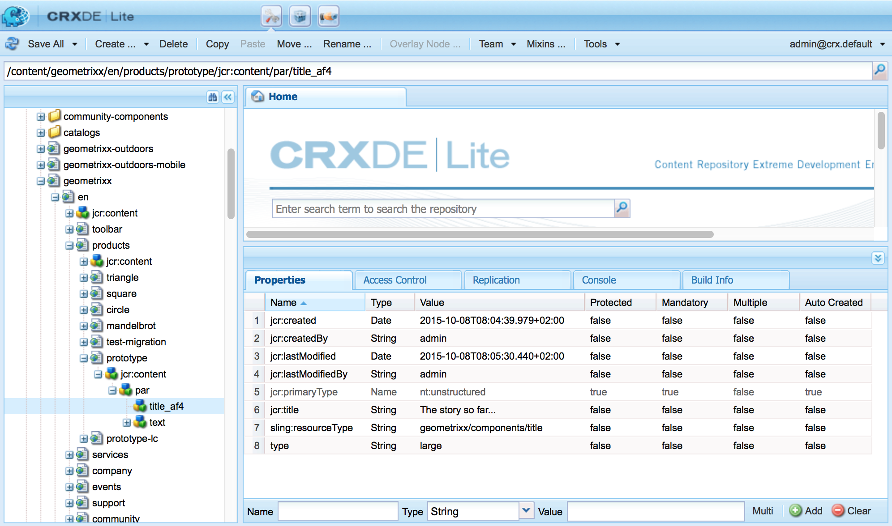

# AEM-componenten - De basisbeginselen{#aem-components-the-basics}

Wanneer u begint om nieuwe componenten te ontwikkelen moet u de grondbeginselen van hun structuur en configuratie begrijpen.

Dit proces omvat het lezen van de theorie en het bekijken van de brede waaier van componentenimplementaties in een standaardAEM instantie. Deze laatste benadering wordt enigszins gecompliceerd door het feit dat, hoewel AEM is verschoven naar een nieuwe standaard, moderne interface met aanraakbediening, deze de klassieke interface blijft ondersteunen.

## Overzicht {#overview}

In deze sectie worden de belangrijkste concepten en kwesties behandeld als een inleiding op de benodigde details bij het ontwikkelen van uw eigen componenten.

### Planning {#planning}

Voordat u begint met het configureren of coderen van uw component, moet u het volgende vragen:

* Wat hebt u precies nodig om de nieuwe component te doen?
   * Een duidelijke specificatie helpt in alle stadia van ontwikkeling, testen en overdracht. De details kunnen in tijd veranderen, maar de specificatie kan worden bijgewerkt (hoewel de veranderingen ook zouden moeten worden gedocumenteerd).
* Moet u een geheel nieuwe component maken of kunt u de basisbeginselen overnemen van een bestaande component?
   * Het is niet nodig het wiel opnieuw uit te vinden.
   * Er zijn verscheidene mechanismen die door AEM worden verstrekt om u toe te staan om details van een andere componentendefinitie met inbegrip van opheffing, bedekking, en de [Verschuivende Fusie](/help/sites-developing/sling-resource-merger.md)van het Middel te erven en uit te breiden.
* Heeft uw component logica nodig voor het selecteren/manipuleren van de inhoud?
   * De logica moet gescheiden worden gehouden van de gebruikersinterfacelaag. HTL is ontworpen om ervoor te zorgen dat dit gebeurt.
* Heeft uw component CSS-opmaak nodig?
   * CSS-opmaak moet gescheiden blijven van de componentdefinities. Definieer conventies voor de naamgeving van uw HTML-elementen, zodat u deze kunt wijzigen via externe CSS-bestanden.
* Welke veiligheidsaspecten moet ik in overweging nemen?
   * Zie [Beveiligingschecklist - Aanbevolen werkwijzen](/help/sites-administering/security-checklist.md#development-best-practices) voor ontwikkeling voor meer informatie.

### Aanraakbare versus klassieke gebruikersinterface {#touch-enabled-vs-classic-ui}

Voordat een serieuze discussie begint met het ontwikkelen van componenten, moet u weten welke interface uw auteurs zullen gebruiken:

* **Interface met aanraakbediening**
   [De standaardgebruikersinterface](/help/sites-developing/touch-ui-concepts.md) is gebaseerd op de verenigde gebruikerservaring voor de Adobe Marketing Cloud, gebruikend de onderliggende technologieën van [Koral UI](/help/sites-developing/touch-ui-concepts.md#coral-ui) en [Granite UI](/help/sites-developing/touch-ui-concepts.md#granite-ui).
* **Klassieke UI** Gebruikersinterface die op technologie ExtJS wordt gebaseerd die met AEM 6.4 werd verouderd.

Zie de Aanbevelingen van de Interface [UI voor Klanten](/help/sites-deploying/ui-recommendations.md) voor meer details.

Componenten kunnen worden geïmplementeerd ter ondersteuning van de interface met aanraakbediening, de klassieke interface of beide. Wanneer het bekijken van een standaardinstantie zult u ook uit-van-de-dooscomponenten zien die oorspronkelijk voor klassieke UI, of aanraking-toegelaten UI, of allebei werden ontworpen.

Daarom zullen we op deze pagina de basisbeginselen van beide, en hoe ze te herkennen, aan de orde stellen.

>[!NOTE]
>
>Adobe raadt u aan de interface met aanraakbediening te gebruiken om te profiteren van de nieuwste technologie. [AEM Modernination Tools&amp; (moderniatzion-tools.md) kan migratie gemakkelijker maken.

### Opmaak voor Content Logic en rendering  {#content-logic-and-rendering-markup}

Het wordt aanbevolen de code die verantwoordelijk is voor opmaak en rendering, gescheiden te houden van de code die de logica regelt die wordt gebruikt om de inhoud van de component te selecteren.

Deze filosofie wordt gesteund door [HTL](https://docs.adobe.com/content/help/en/experience-manager-htl/using/overview.html), een sjabloontaal die doelbewust beperkt is om ervoor te zorgen dat een echte programmeertaal wordt gebruikt om de onderliggende bedrijfslogica te bepalen. Deze (facultatieve) logica wordt aangehaald van HTML met een specifiek bevel. Dit mechanisme markeert de code die voor een bepaalde mening wordt geroepen en, indien vereist, staat specifieke logica voor verschillende meningen van de zelfde component toe.

### HTL vs JSP {#htl-vs-jsp}

HTML is een HTML-sjabloontaal die is geïntroduceerd met AEM 6.0.

De discussie over het al dan niet gebruiken van [HTML](https://docs.adobe.com/content/help/en/experience-manager-htl/using/overview.html) of JSP (de Pagina&#39;s van de Server van Java) wanneer het ontwikkelen van uw eigen componenten zou ongecompliceerd moeten zijn aangezien HTML nu de geadviseerde scripting taal voor AEM is.

Zowel HTML als JSP kunnen worden gebruikt voor de ontwikkeling van componenten voor zowel de klassieke als de interface met aanraakbediening. Hoewel er een tendens kan zijn om aan te nemen dat HTML slechts voor aanraking-toegelaten UI en JSP voor klassieke UI is, is dit een misvatting en meer toe te schrijven aan timing. De interface met aanraakbediening en HTML zijn gedurende ongeveer dezelfde periode in AEM opgenomen. Aangezien HTML nu de aanbevolen taal is, wordt het gebruikt voor nieuwe componenten, die meestal voor de interface met aanraakbediening zijn.

>[!NOTE]
>
>De uitzonderingen zijn de Gebieden van de Vorm van de Stichting van de Stichting van Granite UI (zoals die in dialogen worden gebruikt). Deze vereisen nog steeds het gebruik van JSP.

### Uw eigen componenten ontwikkelen {#developing-your-own-components}

Zie (na het lezen van deze pagina) voor het maken van uw eigen componenten voor de juiste interface:

* [AEM-componenten voor de interface met aanraakfuncties](/help/sites-developing/developing-components.md)
* [AEM-componenten voor de klassieke gebruikersinterface](/help/sites-developing/developing-components-classic.md)

U kunt snel aan de slag door een bestaande component te kopiëren en vervolgens de gewenste wijzigingen aan te brengen. Zie voor meer informatie over het maken van uw eigen componenten en het toevoegen van deze componenten aan het alineasysteem:

* [Componenten](/help/sites-developing/developing-components-samples.md) ontwikkelen (gericht op de interface met aanraakbediening)

### Componenten verplaatsen naar de instantie Publiceren {#moving-components-to-the-publish-instance}

De componenten die inhoud renderen moeten op dezelfde AEM-instantie als de inhoud worden geïmplementeerd. Daarom moeten alle componenten die voor creatie en het teruggeven van pagina&#39;s op de auteursinstantie worden gebruikt op worden opgesteld publiceert instantie. Bij implementatie zijn de componenten beschikbaar voor het renderen van geactiveerde pagina&#39;s.

Gebruik de volgende gereedschappen om uw componenten naar de publicatie-instantie te verplaatsen:

* [Gebruik Pakketbeheer](/help/sites-administering/package-manager.md) om uw componenten aan een pakket toe te voegen en deze naar een andere AEM-instantie te verplaatsen.
* [Gebruik het gereedschap](/help/sites-authoring/publishing-pages.md#manage-publication) Boomreplicatie activeren om de componenten te repliceren.

>[!NOTE]
>
>Deze mechanismen kunnen ook worden gebruikt om uw component tussen andere instanties, bijvoorbeeld van uw ontwikkeling naar uw testinstantie over te brengen.

### Componenten waarvan u op de hoogte moet zijn vanaf het begin {#components-to-be-aware-of-from-the-start}

* Pagina:

   * AEM heeft de *paginacomponent* ( `cq:Page`).
   * Dit is een specifiek type bron dat belangrijk is voor inhoudsbeheer.
      * Een pagina komt overeen met een webpagina die inhoud voor uw website bevat.

* Alineasystemen:

   * Het alineasysteem is een belangrijk onderdeel van een website omdat het een lijst met alinea&#39;s beheert. Het wordt gebruikt om de individuele componenten te houden en te structureren die de daadwerkelijke inhoud houden.
   * U kunt alinea&#39;s in het alineasysteem maken, verplaatsen, kopiëren en verwijderen.
   * U kunt ook de componenten selecteren die beschikbaar moeten zijn voor gebruik binnen een specifiek alineasysteem.
   * Er zijn verschillende alineasystemen beschikbaar binnen een standaardeditor (bijvoorbeeld `parsys`, ` [responsivegrid](/help/sites-authoring/responsive-layout.md)`).

## Structuur {#structure}

De structuur van een AEM-component is krachtig en flexibel en de belangrijkste overwegingen zijn:

* Type bron
* Componentdefinitie
* Eigenschappen en onderliggende knooppunten van een component
* Dialoogvensters
* Ontwerpdialoogvensters
* Beschikbaarheid van componenten
* Componenten en de inhoud die ze maken

### Type bron {#resource-type}

Een zeer belangrijk element van de structuur is het middeltype.

* In de inhoudsstructuur worden intenties gedeclareerd.
* Het type van middel voert hen uit.

Dit is een abstractie die helpt ervoor te zorgen dat zelfs wanneer de blik en het gevoel in tijd verandert, de intentie de tijd blijft.

### Componentdefinitie {#component-definition}

#### Basisbeginselen van componenten {#component-basics}

De definitie van een component kan als volgt worden uitgesplitst:

* AEM-componenten zijn gebaseerd op [Sling](https://sling.apache.org/documentation.html).
* AEM-componenten bevinden zich (gewoonlijk) onder:

   * HTML: `/libs/wcm/foundation/components`
   * JSP: `/libs/foundation/components`

* Projectspecifieke/locatiespecifieke componenten bevinden zich (gewoonlijk) onder:

   * `/apps/<myApp>/components`

* AEM-standaardcomponenten worden gedefinieerd als `cq:Component` en hebben de belangrijkste elementen:

   * jcr-eigenschappen:

      Een lijst met jcr-eigenschappen; Deze zijn veranderlijk en sommige kunnen facultatief zijn hoewel de basisstructuur van een componentenknoop, zijn eigenschappen en subnodes door de `cq:Component` definitie worden bepaald

   * Bronnen:

      Deze definiëren de statische elementen die door de component worden gebruikt.

   * Scripts:
   Wordt gebruikt om het gedrag van de resulterende instantie van de component te implementeren.

* **Basisknooppunt**:

   * `<mycomponent> (cq:Component)` - Hiërarchieknooppunt van component.

* **Vitale eigenschappen**:

   * `jcr:title` - titel van de component; wordt bijvoorbeeld gebruikt als label wanneer de component in de componentenbrowser of sidekick wordt vermeld.
   * `jcr:description` - Beschrijving van het onderdeel; kan als muis-over wenk in componentenbrowser of sidekick worden gebruikt.
   * Klassieke gebruikersinterface:

      * `icon.png` - Pictogram voor deze component.
      * `thumbnail.png` - Afbeelding die wordt weergegeven als dit onderdeel wordt vermeld in het alineasysteem.
   * Aanraakinterface

      * Zie het pictogram van de sectie [Component in Touch UI](/help/sites-developing/components-basics.md#component-icon-in-touch-ui) voor meer informatie.


* **Vitale onderliggende knooppunten**:

   * `cq:editConfig (cq:EditConfig)` - Definieert de bewerkingseigenschappen van de component en zorgt ervoor dat de component wordt weergegeven in de browser Components of Sidetrap.

      Opmerking: als de component een dialoogvenster heeft, wordt dit automatisch weergegeven in de browser Components of Sidetrap, zelfs als cq:editConfig niet bestaat.

   * `cq:childEditConfig (cq:EditConfig)` - Bepaalt de UI-aspecten van de auteur voor onderliggende componenten die hun eigen componenten niet definiëren `cq:editConfig`.
   * Interface voor aanraakbediening:

      * `cq:dialog` ( `nt:unstructured`) - Dialoogvenster voor deze component. Definieert de interface waarmee de gebruiker de component kan configureren en/of inhoud kan bewerken.
      * `cq:design_dialog` ( `nt:unstructured`) - Ontwerpbewerking voor deze component
   * Klassieke gebruikersinterface:

      * `dialog` ( `cq:Dialog`) - Dialoogvenster voor deze component. Definieert de interface waarmee de gebruiker de component kan configureren en/of inhoud kan bewerken.
      * `design_dialog` ( `cq:Dialog`) - Ontwerpbewerking voor deze component.


#### Componentpictogram in aanraakinterface {#component-icon-in-touch-ui}

Het pictogram of de afkorting voor de component wordt gedefinieerd via JCR-eigenschappen van de component wanneer de component door de ontwikkelaar wordt gemaakt. Deze eigenschappen worden in de volgende volgorde geëvalueerd en de eerste geldige gevonden eigenschap wordt gebruikt.

1. `cq:icon` - Tekenreekseigenschap die verwijst naar een standaardpictogram in de [Coral UI-bibliotheek](https://helpx.adobe.com/experience-manager/6-5/sites/developing/using/reference-materials/coral-ui/coralui3/Coral.Icon.html) dat moet worden weergegeven in de componentbrowser
   * Gebruik de waarde van het HTML-kenmerk van het pictogram Coral.
1. `abbreviation` - Tekenreekseigenschap om de afkorting van de componentnaam in de componentbrowser aan te passen
   * De afkorting moet worden beperkt tot twee tekens.
   * Als u een lege tekenreeks opgeeft, wordt de afkorting van de eerste twee tekens van de `jcr:title` eigenschap opgebouwd.
      * Bijvoorbeeld &quot;Im&quot; voor &quot;Image&quot;
      * De gelokaliseerde titel wordt gebruikt om de afkorting samen te stellen.
   * De afkorting wordt alleen omgezet als de component een `abbreviation_commentI18n` eigenschap heeft, die vervolgens als vertaaltip wordt gebruikt.
1. `cq:icon.png` of `cq:icon.svg` - Pictogram voor deze component, die in componentenbrowser wordt getoond
   * 20 x 20 pixels is de grootte van pictogrammen van standaardcomponenten.
      * Grotere pictogrammen worden verkleind (op de client).
   * De aanbevolen kleur is rgb(112, 112, 112) > #707070
   * De achtergrond van standaardcomponentpictogrammen is transparant.
   * Alleen `.png` en `.svg` bestanden worden ondersteund.
   * Als u bestanden importeert vanuit het bestandssysteem via de Eclipse-insteekmodule, moeten de bestandsnamen bijvoorbeeld als `_cq_icon.png` of `_cq_icon.svg` als zodanig worden genegeerd.
   * `.png` heeft voorrang op `.svg` als beide aanwezig zijn

Als geen van de bovenstaande eigenschappen ( `cq:icon`, `abbreviation`, `cq:icon.png` of `cq:icon.svg`) op de component worden gevonden:

* Het systeem zoekt naar dezelfde eigenschappen op de supercomponenten na de `sling:resourceSuperType` eigenschap.
* Als er op het niveau van de supercomponent niets of een lege afkorting wordt gevonden, maakt het systeem de afkorting van de eerste letters van de `jcr:title` eigenschap van de huidige component.

Als u de overerving van pictogrammen van supercomponenten wilt annuleren, wordt het standaardgedrag hersteld wanneer u een lege `abbreviation` eigenschap voor de component instelt.

In de [componentconsole](/help/sites-authoring/default-components-console.md#component-details) wordt weergegeven hoe het pictogram voor een bepaalde component is gedefinieerd.

#### Voorbeeld van SVG-pictogram {#svg-icon-example}

```xml
<?xml version="1.0" encoding="utf-8"?>
<!DOCTYPE svg PUBLIC "-//W3C//DTD SVG 1.1//EN" "https://www.w3.org/Graphics/SVG/1.1/DTD/svg11.dtd">
<svg version="1.1" id="Layer_1" xmlns="https://www.w3.org/2000/svg" xmlns:xlink="https://www.w3.org/1999/xlink" x="0px" y="0px"
     width="20px" height="20px" viewBox="0 0 20 20" enable-background="new 0 0 20 20" xml:space="preserve">
    <ellipse cx="5" cy="5" rx="3" ry="3" fill="#707070"/>
    <ellipse cx="15" cy="5" rx="4" ry="4" fill="#707070"/>
    <ellipse cx="5" cy="15" rx="5" ry="5" fill="#707070"/>
    <ellipse cx="15" cy="15" rx="4" ry="4" fill="#707070"/>
</svg>
```

### Eigenschappen en onderliggende knooppunten van een component {#properties-and-child-nodes-of-a-component}

Veel van de knopen/eigenschappen nodig om een component te bepalen zijn gemeenschappelijk voor beide UIs, met verschillen die onafhankelijk blijven zodat uw component in beide milieu&#39;s kan werken.

Een component is een knooppunt van het type `cq:Component` en heeft de volgende eigenschappen en onderliggende knooppunten:

<table>
 <tbody>
  <tr>
   <td><strong>Naam <br /> </strong></td>
   <td><strong>Type <br /> </strong></td>
   <td><strong>Beschrijving <br /> </strong></td>
  </tr>
  <tr>
   <td>.<br /> </td>
   <td><code>cq:Component</code></td>
   <td>Huidige component. Een component is van het knooppunttype <code>cq:Component</code>.<br /> </td>
  </tr>
  <tr>
   <td><code>componentGroup</code></td>
   <td><code>String</code></td>
   <td>Groep waaronder de component in browser van Componenten (aanraking-toegelaten UI) of Sidetrap (klassieke UI) kan worden geselecteerd.<br /> Een waarde van <code>.hidden</code> wordt gebruikt voor componenten die niet beschikbaar voor selectie van UI zoals de daadwerkelijke paragraafsystemen zijn.</td>
  </tr>
  <tr>
   <td><code>cq:isContainer</code></td>
   <td><code>Boolean</code></td>
   <td>Geeft aan of de component een containercomponent is en daarom andere componenten kan bevatten, zoals een alineasysteem.</td>
  </tr>
  <tr>
   <td> </td>
   <td> </td>
   <td> </td>
  </tr>
  <tr>
   <td><code>cq:dialog</code></td>
   <td><code>nt:unstructured</code> </td>
   <td>Definitie van het dialoogvenster Bewerken voor de interface met aanraakbediening.</td>
  </tr>
  <tr>
   <td><code>dialog</code></td>
   <td><code>cq:Dialog</code></td>
   <td>Definitie van het dialoogvenster Bewerken voor de klassieke gebruikersinterface.</td>
  </tr>
  <tr>
   <td><code>cq:design_dialog</code></td>
   <td><code>nt:unstructured</code></td>
   <td>Definitie van het ontwerpdialoogvenster voor de interface met aanraakbediening.</td>
  </tr>
  <tr>
   <td><code>design_dialog</code></td>
   <td><code>cq:Dialog </code></td>
   <td>Definitie van het ontwerpdialoogvenster voor de klassieke gebruikersinterface.<br /> </td>
  </tr>
  <tr>
   <td><code>dialogPath</code></td>
   <td><code>String</code></td>
   <td>Pad naar een dialoogvenster om het geval te behandelen wanneer de component geen dialoogknooppunt heeft.<br /> </td>
  </tr>
  <tr>
   <td> </td>
   <td> </td>
   <td> </td>
  </tr>
  <tr>
   <td><code>cq:cellName</code></td>
   <td><code>String</code></td>
   <td>Indien ingesteld, wordt deze eigenschap gebruikt als cel-id. Raadpleeg voor meer informatie het artikel in de Knowledge Base <a href="https://helpx.adobe.com/experience-manager/kb/DesigneCellId.html">How are Design Cell IDs built</a>.<br /> </td>
  </tr>
  <tr>
   <td><code>cq:childEditConfig</code></td>
   <td><code>cq:EditConfig</code></td>
   <td>Wanneer de component een container is, zoals bijvoorbeeld een alineasysteem, wordt hiermee de bewerkingsconfiguratie van de onderliggende knooppunten geactiveerd.<br /> </td>
  </tr>
  <tr>
   <td><code>cq:editConfig</code></td>
   <td><code>cq:EditConfig</code></td>
   <td><a href="#edit-behavior">Configuratie van de component</a>bewerken.<br /> </td>
  </tr>
  <tr>
   <td><code>cq:htmlTag</code></td>
   <td><code>nt:unstructured </code></td>
   <td>Retourneert aanvullende tagkenmerken die aan de omringende HTML-tag worden toegevoegd. Hiermee schakelt u het toevoegen van kenmerken aan de automatisch gegenereerde div-elementen in.</td>
  </tr>
  <tr>
   <td><code>cq:noDecoration</code></td>
   <td><code>Boolean</code></td>
   <td>Indien waar (true), wordt de component niet gerenderd met automatisch gegenereerde div- en css-klassen.<br /> </td>
  </tr>
  <tr>
   <td><code>cq:template</code></td>
   <td><code>nt:unstructured</code></td>
   <td>Indien gevonden, wordt dit knooppunt gebruikt als een inhoudssjabloon wanneer de component wordt toegevoegd vanuit de Componentbrowser of Sidetrap.</td>
  </tr>
  <tr>
   <td><code>cq:templatePath</code></td>
   <td><code>String</code></td>
   <td>Pad naar een knooppunt dat als inhoudssjabloon moet worden gebruikt wanneer de component vanuit de browser Components of Sidetrap wordt toegevoegd. Dit moet een absoluut pad zijn, niet ten opzichte van het componentknooppunt.<br /> Dit is niet verplicht en volstaat <code>cq:template</code> alleen als u inhoud die al elders beschikbaar is, opnieuw wilt gebruiken.</td>
  </tr>
  <tr>
   <td><code>jcr:created</code></td>
   <td><code>Date</code></td>
   <td>Datum waarop de component is gemaakt.<br /> </td>
  </tr>
  <tr>
   <td><code>jcr:description</code></td>
   <td><code>String</code></td>
   <td>Beschrijving van de component.<br /> </td>
  </tr>
  <tr>
   <td><code>jcr:title</code></td>
   <td><code>String</code></td>
   <td>Titel van de component.<br /> </td>
  </tr>
  <tr>
   <td><code>sling:resourceSuperType</code></td>
   <td><code>String</code></td>
   <td>Wanneer deze is ingesteld, overerft de component deze component.<br /> </td>
  </tr>
  <tr>
   <td><code>virtual</code></td>
   <td><code>sling:Folder</code></td>
   <td>Maakt het maken van virtuele componenten mogelijk. Als u een voorbeeld wilt zien, raadpleegt u de component contact op de volgende locatie:<br /> <code>/libs/foundation/components/profile/form/contact</code></td>
  </tr>
  <tr>
   <td><code>&lt;breadcrumb.jsp&gt;</code></td>
   <td><code>nt:file</code> </td>
   <td>Scriptbestand.<br /> </td>
  </tr>
  <tr>
   <td><code>icon.png</code></td>
   <td><code>nt:file</code></td>
   <td>Pictogram van de component, verschijnt naast de Titel in Sidetrap.<br /> </td>
  </tr>
  <tr>
   <td><code>thumbnail.png</code></td>
   <td><code>nt:file</code></td>
   <td>Optionele miniatuur die wordt weergegeven terwijl de component van Sidetrap naar de juiste plaats wordt gesleept.<br /> </td>
  </tr>
 </tbody>
</table>

Als we naar de **component Text** (een van de versies) kijken, zien we de volgende elementen:

* HTL ( `/libs/wcm/foundation/components/text`)

   

* JSP ( `/libs/foundation/components/text`)

   

Tot de eigenschappen van bijzonder belang behoren:

* `jcr:title` - titel van het bestanddeel; dit kan worden gebruikt om de component te identificeren, bijvoorbeeld, verschijnt het in de componentenlijst binnen componentenbrowser of sidekick
* `jcr:description` - beschrijving van het onderdeel; kan als muis-over wenk in de componentenlijst binnen sidekick worden gebruikt
* `sling:resourceSuperType`: dit geeft het pad van de overerving aan wanneer een component wordt uitgebreid (door een definitie te overschrijven)

Onderliggende knooppunten die van bijzonder belang zijn, zijn onder meer:

* `cq:editConfig` ( `cq:EditConfig`) - deze controle heeft betrekking op visuele aspecten; Zo kunt u bijvoorbeeld de vormgeving van een balk of widget definiëren of aangepaste besturingselementen toevoegen
* `cq:childEditConfig` ( `cq:EditConfig`) - hiermee worden de visuele aspecten geregeld van onderliggende componenten die geen eigen definities hebben
* Interface voor aanraakbediening:
   * `cq:dialog` ( `nt:unstructured`) - definieert het dialoogvenster voor het bewerken van de inhoud van deze component
   * `cq:design_dialog` ( `nt:unstructured`) - geeft de ontwerpbewerkingsopties voor deze component op
* Klassieke gebruikersinterface:
   * `dialog` ( `cq:Dialog`) - definieert het dialoogvenster voor het bewerken van de inhoud van deze component (specifiek voor de klassieke UI)
   * `design_dialog` ( `cq:Dialog`) - geeft de ontwerpbewerkingsopties voor deze component op
   * `icon.png` - afbeeldingsbestand dat moet worden gebruikt als pictogram voor de component in de Sidetrap
   * `thumbnail.png` - afbeeldingsbestand dat moet worden gebruikt als miniatuur voor de component terwijl het van de Sidetrap wordt gesleept

### Dialoogvensters {#dialogs}

Dialogen zijn een zeer belangrijk element van uw component aangezien zij een interface voor auteurs verstrekken om input aan die component te vormen en te verstrekken.

Afhankelijk van de complexiteit van de component heeft uw dialoogvenster mogelijk een of meer tabbladen nodig om het dialoogvenster kort te houden en de invoervelden te sorteren.

Dialoogvensterdefinities zijn specifiek voor de gebruikersinterface:

>[!NOTE]
>
>* Voor compatibiliteitsdoeleinden kan de interface met aanraakbediening gebruikmaken van de definitie van een klassiek dialoogvenster UI, wanneer er geen dialoogvenster is gedefinieerd voor de interface met aanraakbediening.
>* Het gereedschap [](/help/sites-developing/dialog-conversion.md) Dialoogomzetting is ook beschikbaar als hulpmiddel bij het uitbreiden/omzetten van componenten waarvoor alleen dialoogvensters zijn gedefinieerd voor de klassieke interface.
>


* Interface met aanraakbediening
   * `cq:dialog` ( `nt:unstructured`) knooppunten:
      * het dialoogvenster definiëren voor het bewerken van de inhoud van deze component
      * specifiek voor de interface met aanraakbediening
      * worden gedefinieerd met de componenten van Granite UI
      * hebben een eigenschap `sling:resourceType`, zoals de standaardstructuur voor het verkopen van inhoud
      * kan een bezit hebben `helpPath` om de van de context afhankelijke hulpbron (absolute of relatieve weg) te bepalen die wordt betreden wanneer het pictogram van de Hulp (te bepalen? pictogram) is geselecteerd.
         * Voor componenten buiten het vak verwijst dit vaak naar een pagina in de documentatie.
         * Als er geen waarde `helpPath` is opgegeven, wordt de standaard-URL (documentatieoverzichtspagina) weergegeven.
   

   In het dialoogvenster worden afzonderlijke velden gedefinieerd:

   

* Klassieke interface
   * `dialog` ( `cq:Dialog`) knooppunten
      * het dialoogvenster definiëren voor het bewerken van de inhoud van deze component
      * specifiek voor de klassieke gebruikersinterface
      * zijn gedefinieerd met ExtJS-widgets
      * hebben een eigenschap `xtype`die naar ExtJS verwijst
      * kan een bezit hebben `helpPath` om de van de context afhankelijke hulpbron (absolute of relatieve weg) te bepalen die wordt betreden wanneer de knoop van de **Hulp** wordt geselecteerd.
         * Voor componenten buiten het vak verwijst dit vaak naar een pagina in de documentatie.
         * Als er geen waarde `helpPath` is opgegeven, wordt de standaard-URL (documentatieoverzichtspagina) weergegeven.
   

   In het dialoogvenster worden afzonderlijke velden gedefinieerd:

   

   In een klassiek dialoogvenster:

   * U kunt het dialoogvenster maken als `cq:Dialog`, dat één tab biedt, zoals in de tekstcomponent, of als u meerdere tabbladen nodig hebt, zoals bij de component textielafbeelding, kan het dialoogvenster worden gedefinieerd als `cq:TabPanel`.
   * a `cq:WidgetCollection` ( `items`) wordt gebruikt om een basis te verschaffen voor invoervelden ( `cq:Widget`) of andere tabbladen ( `cq:Widget`). Deze hiërarchie kan worden uitgebreid.


### Ontwerpdialoogvensters {#design-dialogs}

De dialoogvensters van het ontwerp zijn zeer gelijkaardig aan de dialogen die worden gebruikt om inhoud uit te geven en te vormen, maar zij verstrekken de interface voor auteurs om ontwerpdetails voor die component te vormen en te verstrekken.

[De dialoogvensters Ontwerpen zijn beschikbaar in de Ontwerpmodus](/help/sites-authoring/default-components-designmode.md), hoewel ze niet nodig zijn voor alle componenten, zoals **Titel** en **Afbeelding** , beide beschikken over ontwerpdialoogvensters, terwijl **Tekst** dat niet doet.

Het ontwerpdialoogvenster voor het alineasysteem (bijvoorbeeld parsys) is een speciaal geval omdat de gebruiker daarmee specifieke andere componenten kan selecteren (vanuit de componentenbrowser of sidekick) op de pagina.

### De component toevoegen aan het alineasysteem {#adding-your-component-to-the-paragraph-system}

Wanneer een component is gedefinieerd, moet deze beschikbaar worden gesteld voor gebruik. Als u een component beschikbaar wilt maken voor gebruik in een alineasysteem, kunt u:

1. Open de [ontwerpmodus](/help/sites-authoring/default-components-designmode.md) voor een pagina en schakel de vereiste component in.
1. Voeg de vereiste component(en) onder aan de `components` eigenschap van de sjabloondefinitie toe:

   `/etc/designs/<*yourProject*>/jcr:content/<*yourTemplate*>/par`

   Zie bijvoorbeeld:

   `/etc/designs/geometrixx/jcr:content/contentpage/par`

   

### Componenten en de inhoud die ze maken {#components-and-the-content-they-create}

Als wij tot een geval van de component van de **Titel** op de pagina leiden en vormen: `<content-path>/Prototype.html`

* Interface met aanraakbediening

   

* Klassieke interface

   

Dan kunnen wij de structuur zien van de inhoud die binnen de bewaarplaats wordt gecreeerd:



Als u met name de werkelijke tekst voor een **titel** bekijkt:

* de definitie (voor beide UIs) heeft het bezit `name`= `./jcr:title`

   * `/libs/foundation/components/title/cq:dialog/content/items/column/items/title`
   * `/libs/foundation/components/title/dialog/items/title`

* binnen de inhoud, produceert dit het bezit `jcr:title` van de inhoud van de auteur.

De gedefinieerde eigenschappen zijn afhankelijk van de afzonderlijke definities. Hoewel ze complexer kunnen zijn dan boven ze liggen, volgen ze nog steeds dezelfde basisbeginselen.

## Componenthiërarchie en Overerving {#component-hierarchy-and-inheritance}

Componenten binnen AEM zijn onderhevig aan drie verschillende hiërarchieën:

* **Hiërarchie van brontype**

   Dit wordt gebruikt om componenten uit te breiden gebruikend het bezit `sling:resourceSuperType`. Hierdoor kan de component overerven. Een tekstcomponent neemt bijvoorbeeld verschillende kenmerken over van de standaardcomponent.

   * scripts (opgelost door Sling)
   * dialoogvensters
   * beschrijvingen (inclusief miniatuurafbeeldingen, pictogrammen, enz.)

* **Containerhiërarchie**

   Dit wordt gebruikt om configuratiemontages aan de kindcomponent te bevolken en het meest meestal gebruikt in een parsys scenario.

   Zo kunt u bijvoorbeeld configuratie-instellingen voor de bewerkingsbalkknoppen, besturingselementlay-out (bewerkbalken, rollover), dialooglay-out (inline, zwevend) definiëren voor de bovenliggende component en doorgeven aan de onderliggende componenten.

   De montages van de configuratie (verwant met uitgeven functionaliteit) binnen `cq:editConfig` en `cq:childEditConfig` worden verspreid.

* **Inclusief hiërarchie**

   Dit wordt tijdens runtime opgelegd door de volgorde van include-bestanden.

   Deze hiërarchie wordt gebruikt door de ontwerper, die op zijn beurt fungeert als basis voor verschillende ontwerpaspecten van de rendering; met inbegrip van lay-outinformatie, css- informatie, de beschikbare componenten in parsys onder andere.

## Gedrag bewerken {#edit-behavior}

In deze sectie wordt uitgelegd hoe u het bewerkingsgedrag van een component kunt configureren. Dit omvat kenmerken zoals handelingen die beschikbaar zijn voor de component, kenmerken van de plaatsingseditor en listeners die betrekking hebben op gebeurtenissen in de component.

De configuratie wordt gebruikt voor zowel de aanraakinterface als de klassieke gebruikersinterface, maar met bepaalde specifieke verschillen.

Het bewerkingsgedrag van een component wordt geconfigureerd door een `cq:editConfig` knooppunt van het type toe te voegen `cq:EditConfig` onder het componentknooppunt (van het type `cq:Component`) en door specifieke eigenschappen en onderliggende knooppunten toe te voegen. De volgende eigenschappen en onderliggende knooppunten zijn beschikbaar:

* [ `cq:editConfig` knoopeigenschappen](#configuring-with-cq-editconfig-properties):

   * `cq:actions` ( `String array`): definieert de handelingen die op de component kunnen worden uitgevoerd.
   * `cq:layout` ( `String`): : definieert hoe de component wordt bewerkt in de klassieke UI.
   * `cq:dialogMode` ( `String`): bepaalt hoe de componentendialoog in klassieke UI wordt geopend

      * In de interface met aanraakbediening zweven dialoogvensters altijd in de bureaubladmodus en worden ze automatisch geopend als volledig scherm in mobiele apparaten.
   * `cq:emptyText` ( `String`): Hiermee definieert u tekst die wordt weergegeven wanneer er geen visuele inhoud aanwezig is.
   * `cq:inherit` ( `Boolean`): definieert of ontbrekende waarden worden overgeërfd van de component waarvan deze waarden overerven.
   * `dialogLayout` (String): Hiermee bepaalt u hoe het dialoogvenster moet worden geopend.


* [ `cq:editConfig` onderliggende knooppunten](#configuring-with-cq-editconfig-child-nodes):

   * `cq:dropTargets` (knooppunttype `nt:unstructured`): definieert een lijst met neerzetdoelen die een neerzetbewerking kunnen accepteren vanuit een element van de zoeker naar inhoud

      * De veelvoudige dalingsdoelstellingen zijn slechts beschikbaar in klassieke UI.
      * In de interface met aanraakbediening is één doel voor neerzetten toegestaan.
   * `cq:actionConfigs` (knooppunttype `nt:unstructured`): definieert een lijst met nieuwe acties die worden toegevoegd aan de lijst cq:actions.
   * `cq:formParameters` (knooppunttype `nt:unstructured`): Hiermee definieert u aanvullende parameters die aan het dialoogvenster worden toegevoegd.
   * `cq:inplaceEditing` (knooppunttype `cq:InplaceEditingConfig`): definieert een configuratie voor lokale bewerking voor de component.
   * `cq:listeners` (knooppunttype `cq:EditListenersConfig`): Hiermee definieert u wat er gebeurt voordat of nadat een handeling op de component plaatsvindt.


>[!NOTE]
>
>Op deze pagina wordt een knooppunt (eigenschappen en onderliggende knooppunten) weergegeven als XML, zoals in het volgende voorbeeld wordt getoond.

```
<jcr:root xmlns:cq="https://www.day.com/jcr/cq/1.0" xmlns:jcr="https://www.jcp.org/jcr/1.0"
    cq:actions="[edit]"
    cq:dialogMode="floating"
    cq:layout="editbar"
    jcr:primaryType="cq:EditConfig">
    <cq:listeners
        jcr:primaryType="cq:EditListenersConfig"
        afteredit="REFRESH_PAGE"/>
</jcr:root>
```

Er zijn vele bestaande configuraties in de bewaarplaats. U kunt gemakkelijk naar specifieke eigenschappen of kindknopen zoeken:

* Een eigenschap van het `cq:editConfig` knooppunt zoeken, bijvoorbeeld `cq:actions`, kunt u het hulpmiddel van de Vraag in **CRXDE Lite** en onderzoek met het volgende de vraagkoord van XPath gebruiken:

   `//element(cq:editConfig, cq:EditConfig)[@cq:actions]`

* U kunt zoeken naar een onderliggende node van `cq:editConfig`bijvoorbeeld `cq:dropTargets`het type `cq:DropTargetConfig`; u kunt het hulpmiddel van de Vraag in** CRXDE Lite* gebruiken en met het volgende de vraagkoord van XPath zoeken:

   `//element(cq:dropTargets, cq:DropTargetConfig)`

### Configureren met cq:Eigenschappen EditConfig {#configuring-with-cq-editconfig-properties}

### cq:handelingen {#cq-actions}

De `cq:actions` eigenschap ( `String array`) definieert een of meer handelingen die op de component kunnen worden uitgevoerd. De volgende waarden zijn beschikbaar voor configuratie:

<table>
 <tbody>
  <tr>
   <td><strong>Waarde van eigenschap</strong></td>
   <td><strong>Beschrijving</strong></td>
  </tr>
  <tr>
   <td><code>text:&lt;some text&gt;</code></td>
   <td>Geeft de statische tekstwaarde &lt;some text&gt;<br /> Alleen zichtbaar in klassieke UI. De interface met aanraakbediening geeft geen handelingen weer in een contextueel menu, dus dit is niet van toepassing.</td>
  </tr>
  <tr>
   <td>-</td>
   <td>Voegt een spacer toe.<br /> Alleen zichtbaar in klassieke UI. De interface met aanraakbediening geeft geen handelingen weer in een contextueel menu, dus dit is niet van toepassing.</td>
  </tr>
  <tr>
   <td><code>edit</code></td>
   <td>Hiermee voegt u een knop toe om de component te bewerken.</td>
  </tr>
      <tr>
    <td><code>editannotate</code></td>
    <td>Hiermee voegt u een knop toe om de component te bewerken en <a href="/help/sites-authoring/annotations.md">annotaties</a>toe te staan.</td>
   </tr>
  <tr>
   <td><code>delete</code></td>
   <td>Hiermee wordt een knop toegevoegd om de component te verwijderen</td>
  </tr>
  <tr>
   <td><code>insert</code></td>
   <td>Hiermee wordt een knop toegevoegd om een nieuwe component in te voegen vóór de huidige component</td>
  </tr>
  <tr>
   <td><code>copymove</code></td>
   <td>Hiermee voegt u een knop toe om de component te kopiëren en te knippen.</td>
  </tr>
 </tbody>
</table>

Met de volgende configuratie voegt u een bewerkknop, een spacer, een delete en een invoegknop toe aan de bewerkbalk van de component:

```
<jcr:root xmlns:cq="https://www.day.com/jcr/cq/1.0" xmlns:jcr="https://www.jcp.org/jcr/1.0"
    cq:actions="[edit,-,delete,insert]"
    cq:layout="editbar"
    jcr:primaryType="cq:EditConfig"/>
```

De volgende configuratie voegt de tekst &quot;Geërfte Configuraties van het Kader van de Basis&quot;aan de component toe geeft bar uit:

```
<jcr:root xmlns:cq="https://www.day.com/jcr/cq/1.0" xmlns:jcr="https://www.jcp.org/jcr/1.0"
    cq:actions="[text:Inherited Configurations from Base Framework]"
    cq:layout="editbar"
    jcr:primaryType="cq:EditConfig"/>
```

### cq:layout (alleen klassieke gebruikersinterface) {#cq-layout-classic-ui-only}

De `cq:layout` eigenschap ( `String`) definieert hoe de component kan worden bewerkt in de klassieke UI. De volgende waarden zijn beschikbaar:

<table>
 <tbody>
  <tr>
   <td><strong>Waarde van eigenschap</strong></td>
   <td><strong>Beschrijving</strong></td>
  </tr>
  <tr>
   <td><code>rollover</code></td>
   <td>Standaardwaarde. De componenteditie is via klikken en/of contextmenu toegankelijk "bij muisbeweging over".<br /> Houd er rekening mee dat het bijbehorende clientobject voor geavanceerd gebruik: <code>CQ.wcm.EditRollover</code>.</td>
  </tr>
  <tr>
   <td><code>editbar</code></td>
   <td>De componenteditie is toegankelijk via een werkbalk.<br /> Houd er rekening mee dat het bijbehorende clientobject voor geavanceerd gebruik: <code>CQ.wcm.EditBar</code>.</td>
  </tr>
  <tr>
   <td><code>auto</code></td>
   <td>De keuze wordt overgelaten aan de code aan de clientzijde.</td>
  </tr>
 </tbody>
</table>

>[!NOTE]
>
>De concepten rollover en editbar zijn niet van toepassing in de interface met aanraakbediening.

In de volgende configuratie wordt een bewerkknop toegevoegd aan de bewerkbalk van de component:

```
<jcr:root xmlns:cq="https://www.day.com/jcr/cq/1.0" xmlns:jcr="https://www.jcp.org/jcr/1.0"
    cq:actions="[edit]"
    cq:layout="editbar"
    jcr:primaryType="cq:EditConfig">
</jcr:root>
```

### cq:dialogMode (alleen klassieke gebruikersinterface) {#cq-dialogmode-classic-ui-only}

De component kan worden gekoppeld aan een bewerkingsdialoogvenster. De `cq:dialogMode` eigenschap ( `String`) definieert hoe het componentdialoogvenster wordt geopend in de klassieke UI. De volgende waarden zijn beschikbaar:

<table>
 <tbody>
  <tr>
   <td><strong>Waarde van eigenschap</strong></td>
   <td><strong>Beschrijving</strong></td>
  </tr>
  <tr>
   <td><code>floating</code></td>
   <td>Het dialoogvenster zweeft.<br /> </td>
  </tr>
  <tr>
   <td><code>inline</code></td>
   <td>(standaardwaarde). Het dialoogvenster is verankerd op de component.<br /> </td>
  </tr>
  <tr>
   <td><code>auto</code></td>
   <td>Als de breedte van de component kleiner is dan de <code>CQ.themes.wcm.EditBase.INLINE_MINIMUM_WIDTH</code> waarde aan de clientzijde, zweeft het dialoogvenster, anders wordt het inline weergegeven.</td>
  </tr>
 </tbody>
</table>

>[!NOTE]
>
>In de interface met aanraakbediening zweven dialoogvensters altijd in de bureaubladmodus en worden ze automatisch geopend als volledig scherm in mobiele apparaten.

In de volgende configuratie wordt een bewerkbalk gedefinieerd met een bewerkknop en een zwevend dialoogvenster:

```
<jcr:root xmlns:cq="https://www.day.com/jcr/cq/1.0" xmlns:jcr="https://www.jcp.org/jcr/1.0"
    cq:actions="[edit]"
    cq:dialogMode="floating"
    cq:layout="editbar"
    jcr:primaryType="cq:EditConfig">
</jcr:root>
```

### cq:emptyText {#cq-emptytext}

De `cq:emptyText` eigenschap ( `String`) definieert tekst die wordt weergegeven wanneer er geen visuele inhoud aanwezig is. De standaardwaarde is: `Drag components or assets here`.

### cq:overnemen {#cq-inherit}

De `cq:inherit` eigenschap ( `boolean`) definieert of ontbrekende waarden worden overgeërfd van de component waarvan deze overerft. De standaardwaarde is `false`.

### dialogLayout {#dialoglayout}

De `dialogLayout` eigenschap definieert hoe een dialoogvenster standaard moet worden geopend.

* Met de waarde &#39;waarde van&#39; wordt het dialoogvenster op volledig scherm geopend. `fullscreen`
* Een lege waarde of afwezigheid van de eigenschap wordt standaard gebruikt om het dialoogvenster te openen.
* Merk op dat de gebruiker de volledig-schermwijze binnen de dialoog altijd kan van een knevel voorzien.
* Is niet van toepassing op de klassieke UI.

### Configureren met cq:Onderliggende knooppunten EditConfig {#configuring-with-cq-editconfig-child-nodes}

### cq:dropTargets {#cq-droptargets}

Het `cq:dropTargets` knooppunt (knooppunttype `nt:unstructured`) definieert een lijst met neerzetdoelen die een neerzetbewerking kunnen accepteren vanuit een element dat vanuit de zoekfunctie voor inhoud wordt gesleept. Het dient als inzameling van knopen van type `cq:DropTargetConfig`.

>[!NOTE]
>
>De veelvoudige dalingsdoelstellingen zijn slechts beschikbaar in klassieke UI.
>
>In de interface met aanraakbediening wordt alleen het eerste doel gebruikt.

Elk onderliggend knooppunt van het type `cq:DropTargetConfig` definieert een neerzetdoel in de component. De knooppuntnaam is belangrijk omdat deze als volgt in JSP moet worden gebruikt om de CSS-klassenaam te genereren die is toegewezen aan het DOM-element dat het effectieve doel voor neerzetten is:

```
<drop target css class> = <drag and drop prefix> +
 <node name of the drop target in the edit configuration>
```

De eigenschap `<drag and drop prefix>` wordt gedefinieerd door de Java-eigenschap:

`com.day.cq.wcm.api.components.DropTarget.CSS_CLASS_PREFIX`.

De klassenaam wordt bijvoorbeeld als volgt gedefinieerd in de JSP van de Download-component( `/libs/foundation/components/download/download.jsp`), waarbij `file` de knooppuntnaam van het neerzetdoel in de bewerkingsconfiguratie van de Download-component is:

`String ddClassName = DropTarget.CSS_CLASS_PREFIX + "file";`

Het knooppunt van het type `cq:DropTargetConfig` moet de volgende eigenschappen hebben:

<table>
 <tbody>
  <tr>
   <td><strong>Eigenschapnaam</strong></td>
   <td><strong>Waarde van eigenschap<br /> </strong></td>
  </tr>
  <tr>
   <td><code>accept</code></td>
   <td>Regex is toegepast op het MIME-type van het element om te valideren of neerzetten is toegestaan.</td>
  </tr>
  <tr>
   <td><code>groups</code></td>
   <td>Array van doelgroepen voor neerzetten. Elke groep moet overeenkomen met het groepstype dat is gedefinieerd in de uitbreiding van de zoekfunctie voor inhoud en dat is gekoppeld aan de elementen.</td>
  </tr>
  <tr>
   <td><code>propertyName</code></td>
   <td>Naam van het bezit dat na een geldige daling zal worden bijgewerkt.</td>
  </tr>
 </tbody>
</table>

De volgende configuratie wordt genomen van de component van de Download. Het laat om het even welk element (mime-type kan om het even welk koord zijn) van de `media` groep om van de inhoudszoeker in de component worden gelaten vallen. Na het neerzetten `fileReference` wordt de componenteigenschap bijgewerkt:

```
    <cq:dropTargets jcr:primaryType="nt:unstructured">
        <file
            jcr:primaryType="cq:DropTargetConfig"
            accept="[.*]"
            groups="[media]"
            propertyName="./fileReference"/>
    </cq:dropTargets>
```

### cq:actionConfigs (alleen klassieke gebruikersinterface) {#cq-actionconfigs-classic-ui-only}

Het `cq:actionConfigs` knooppunt (knooppunttype `nt:unstructured`) definieert een lijst met nieuwe handelingen die worden toegevoegd aan de lijst die door de `cq:actions` eigenschap wordt gedefinieerd. Elke onderliggende node van `cq:actionConfigs` definieert een nieuwe actie door een widget te definiëren.

In de volgende voorbeeldconfiguratie wordt een nieuwe knop gedefinieerd (met een scheidingsteken voor de klassieke UI):

* een scheidingsteken, gedefinieerd door het xtype `tbseparator`;

   * Dit wordt slechts gebruikt door klassieke UI.
   * Deze definitie wordt genegeerd door de interface met aanraakbediening omdat xtypes worden genegeerd (en scheidingstekens zijn niet nodig omdat de werkbalk voor handelingen anders wordt samengesteld in de interface met aanraakbediening).

* een knop met de naam Opmerkingen **** beheren waarmee de handlerfunctie wordt uitgevoerd `CQ_collab_forum_openCollabAdmin()`.

```
<jcr:root xmlns:cq="https://www.day.com/jcr/cq/1.0" xmlns:jcr="https://www.jcp.org/jcr/1.0" xmlns:nt="https://www.jcp.org/jcr/nt/1.0"
    cq:actions="[EDIT,COPYMOVE,DELETE,INSERT]"
    jcr:primaryType="cq:EditConfig">
    <cq:actionConfigs jcr:primaryType="nt:unstructured">
        <separator0
            jcr:primaryType="nt:unstructured"
            xtype="tbseparator"/>
        <manage
            jcr:primaryType="nt:unstructured"
            handler="function(){CQ_collab_forum_openCollabAdmin();}"
            text="Manage comments"/>
    </cq:actionConfigs>
</jcr:root>
```

>[!NOTE]
>
>Zie Nieuwe handeling [toevoegen aan een componentwerkbalk](/help/sites-developing/customizing-page-authoring-touch.md#add-new-action-to-a-component-toolbar) als voorbeeld voor de interface met aanraakbediening.

### cq:formParameters {#cq-formparameters}

Het `cq:formParameters` knooppunt (knooppunttype `nt:unstructured`) definieert aanvullende parameters die aan het dialoogvenster worden toegevoegd. Elke eigenschap wordt toegewezen aan een formulierparameter.

In de volgende configuratie wordt een parameter met de naam `name`en de waarde `photos/primary` aan het dialoogvenster toegevoegd:

```
    <cq:formParameters
        jcr:primaryType="nt:unstructured"
        name="photos/primary"/>
```

### cq:inplaceEditing {#cq-inplaceediting}

Het `cq:inplaceEditing` knooppunt (knooppunttype `cq:InplaceEditingConfig`) definieert een configuratie voor lokale bewerking voor de component. Deze kan de volgende eigenschappen hebben:

<table>
 <tbody>
  <tr>
   <td><strong>Eigenschapnaam</strong></td>
   <td><strong>Waarde van eigenschap<br /> </strong></td>
  </tr>
  <tr>
   <td><code>active</code></td>
   <td>(<code>boolean</code>) True to enable the place editing of the component.</td>
  </tr>
  <tr>
   <td><code>configPath</code></td>
   <td>(<code>String</code>) Pad van de editorconfiguratie. De configuratie kan door een configuratieknooppunt worden gespecificeerd.</td>
  </tr>
  <tr>
   <td><code>editorType</code></td>
   <td><p>(<code>String</code>) Type editor. De beschikbare typen zijn:</p>
    <ul>
     <li>platte tekst: te gebruiken voor niet-HTML-inhoud.<br /> </li>
     <li>titel: is een verbeterde plaintext editor die grafische titels omzet in een gewone tekst voordat het bewerken begint. Wordt gebruikt door de component Geometrixx title.<br /> </li>
     <li>tekst: te gebruiken voor HTML-inhoud (gebruikt de Rich Text Editor).<br /> </li>
    </ul> </td>
  </tr>
 </tbody>
</table>

In de volgende configuratie wordt het op plaats bewerken van de component ingeschakeld en wordt het editortype gedefinieerd `plaintext` :

```
    <cq:inplaceEditing
        jcr:primaryType="cq:InplaceEditingConfig"
        active="{Boolean}true"
        editorType="plaintext"/>
```

### cq:listeners {#cq-listeners}

Het `cq:listeners` knooppunt (knooppunttype `cq:EditListenersConfig`) definieert wat er voor of na een handeling op de component gebeurt. In de volgende tabel worden de mogelijke eigenschappen gedefinieerd.

<table>
 <tbody>
  <tr>
   <td><strong>Eigenschapnaam</strong></td>
   <td><strong>Waarde van eigenschap<br /> </strong></td>
   <td><p><strong>Standaardwaarde</strong></p> <p>(Alleen klassieke gebruikersinterface)</p> </td>
  </tr>
  <tr>
   <td><code>beforedelete</code></td>
   <td>De handler wordt geactiveerd voordat de component wordt verwijderd.<br /> </td>
   <td> </td>
  </tr>
  <tr>
   <td><code>beforeedit</code></td>
   <td>De handler wordt geactiveerd voordat de component wordt bewerkt.</td>
   <td> </td>
  </tr>
  <tr>
   <td><code>beforecopy</code></td>
   <td>De handler wordt geactiveerd voordat de component wordt gekopieerd.</td>
   <td> </td>
  </tr>
  <tr>
   <td><code>beforemove</code></td>
   <td>De handler wordt geactiveerd voordat de component wordt verplaatst.</td>
   <td> </td>
  </tr>
  <tr>
   <td><code>beforeinsert</code></td>
   <td>De handler wordt geactiveerd voordat de component wordt ingevoegd.<br /> Alleen operationeel voor de interface met aanraakbediening.</td>
   <td> </td>
  </tr>
  <tr>
   <td><code>beforechildinsert</code></td>
   <td>De handler wordt geactiveerd voordat de component in een andere component wordt ingevoegd (alleen containers).</td>
   <td> </td>
  </tr>
  <tr>
   <td><code>afterdelete</code></td>
   <td>De handler wordt geactiveerd nadat de component is verwijderd.</td>
   <td><code>REFRESH_SELF</code></td>
  </tr>
  <tr>
   <td><code>afteredit</code></td>
   <td>De handler wordt geactiveerd nadat de component is bewerkt.</td>
   <td><code>REFRESH_SELF</code></td>
  </tr>
  <tr>
   <td><code>aftercopy</code></td>
   <td>De handler wordt geactiveerd nadat de component is gekopieerd.</td>
   <td><code>REFRESH_SELF</code></td>
  </tr>
  <tr>
   <td><code>afterinsert</code></td>
   <td>De handler wordt geactiveerd nadat de component is ingevoegd.</td>
   <td><code>REFRESH_INSERTED</code></td>
  </tr>
  <tr>
   <td><code>aftermove</code></td>
   <td>De handler wordt geactiveerd nadat de component is verplaatst.</td>
   <td><code>REFRESH_SELFMOVED</code></td>
  </tr>
  <tr>
   <td><code>afterchildinsert</code></td>
   <td>De handler wordt geactiveerd nadat de component in een andere component is ingevoegd (alleen containers).</td>
   <td> </td>
  </tr>
 </tbody>
</table>

>[!NOTE]
>
>De `REFRESH_INSERTED` en de `REFRESH_SELFMOVED` managers zijn slechts beschikbaar in klassieke UI.

>[!NOTE]
>
>Standaardwaarden voor de listeners worden alleen ingesteld in de klassieke UI.

>[!NOTE]
>
>In het geval van geneste componenten gelden er bepaalde beperkingen voor handelingen die zijn gedefinieerd als eigenschappen op het `cq:listeners` knooppunt:
>
>* Voor geneste componenten *moeten* de waarden van de volgende eigenschappen `REFRESH_PAGE`: >
>  * `aftermove`
>  * `aftercopy`


De gebeurtenishandler kan worden geïmplementeerd met een aangepaste implementatie. Bijvoorbeeld (waarbij `project.customerAction` een statische methode is):

`afteredit = "project.customerAction"`

Het volgende voorbeeld is gelijk aan de `REFRESH_INSERTED` configuratie:

`afterinsert="function(path, definition) { this.refreshCreated(path, definition); }"`

>[!NOTE]
>
>Voor klassieke UI, om te zien welke parameters in de managers kunnen worden gebruikt, verwijs naar de `before<action>` en `after<action>` gebeurtenissectie van de [ `CQ.wcm.EditBar`](https://helpx.adobe.com/experience-manager/6-5/sites/developing/using/reference-materials/widgets-api/index.html?class=CQ.wcm.EditBar) en [ `CQ.wcm.EditRollover`](https://helpx.adobe.com/experience-manager/6-5/sites/developing/using/reference-materials/widgets-api/index.html?class=CQ.wcm.EditRollover) widgetdocumentatie.

Met de volgende configuratie wordt de pagina vernieuwd nadat de component is verwijderd, bewerkt, ingevoegd of verplaatst:

```
    <cq:listeners
        jcr:primaryType="cq:EditListenersConfig"
        afterdelete="REFRESH_PAGE"
        afteredit="REFRESH_PAGE"
        afterinsert="REFRESH_PAGE"
        afterMove="REFRESH_PAGE"/>
```
