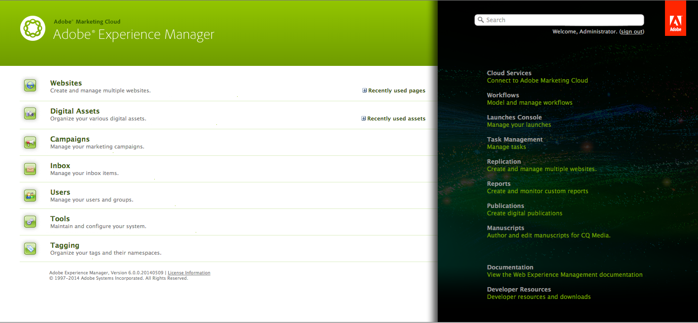

# De welkomstconsole aanpassen (klassieke UI){#customizing-the-welcome-console-classic-ui}

>[!CAUTION]
>
>Deze pagina gaat over de klassieke gebruikersinterface.
>
>Zie [De consoles aanpassen](/help/sites-developing/customizing-consoles-touch.md) voor meer informatie over de standaardinterface met aanraakbediening.

De welkomstconsole biedt een lijst met koppelingen naar de verschillende consoles en functies in AEM.

Het is mogelijk om de verbindingen te vormen die zichtbaar zijn. Dit kan voor specifieke gebruikers en/of groepen worden bepaald. De te nemen acties zijn afhankelijk van het doeltype (dat met de sectie van de console correleert zij binnen zijn):

* [Hoofdconsoles](#links-in-main-console-left-pane)  - Koppelingen in de hoofdconsole (linkerdeelvenster)
* [Bronnen, Documentatie en Referentie, Functies](#links-in-sidebar-right-pane)  - Koppelingen in de zijbalk (rechterdeelvenster)

## Koppelingen in hoofdconsole (linkerdeelvenster) {#links-in-main-console-left-pane}

Hier worden de belangrijkste consoles van AEM weergegeven.

### Bepalen of hoofdconsolekoppelingen zichtbaar zijn {#configuring-whether-main-console-links-are-visible}

Machtigingen op knooppuntniveau bepalen of de koppeling zichtbaar is of niet. De betrokken knooppunten zijn:

* **Websites:** `/libs/wcm/core/content/siteadmin`

* **Digitale middelen:** `/libs/wcm/core/content/damadmin`

* **Gemeenschap:** `/libs/collab/core/content/admin`

* **Campagnes:** `/libs/mcm/content/admin`

* **Postvak IN:** `/libs/cq/workflow/content/inbox`

* **Gebruikers:** `/libs/cq/security/content/admin`

* **Gereedschappen:** `/libs/wcm/core/content/misc`

* **Tags:** `/libs/cq/tagging/content/tagadmin`

Bijvoorbeeld:

* Als u de toegang tot **Gereedschappen** wilt beperken, verwijdert u leestoegang uit

   `/libs/wcm/core/content/misc`

Zie [Sectie van de Veiligheid](/help/sites-administering/security.md) voor meer informatie over hoe te om de gewenste toestemmingen te plaatsen.

### Koppelingen in zijbalk (rechterdeelvenster) {#links-in-sidebar-right-pane}

Deze verbindingen zijn gebaseerd op het bestaan van *en* leestoegang tot knopen onder de volgende weg:

`/libs/cq/core/content/welcome`

Er zijn drie secties (die iets uit elkaar liggen) die standaard worden opgegeven:

<table>
 <tbody>
  <tr>
   <td><strong>Bronnen</strong></td>
   <td> </td>
  </tr>
  <tr>
   <td> Cloud Services</td>
   <td><code>/libs/cq/core/content/welcome/resources/cloudservices</code></td>
  </tr>
  <tr>
   <td> Workflows</td>
   <td><code>/libs/cq/core/content/welcome/resources/workflows</code></td>
  </tr>
  <tr>
   <td> Taakbeheer</td>
   <td><code>/libs/cq/core/content/welcome/resources/taskmanager</code></td>
  </tr>
  <tr>
   <td> Replicatie</td>
   <td><code>/libs/cq/core/content/welcome/resources/replication</code></td>
  </tr>
  <tr>
   <td> Rapporten</td>
   <td><code>/libs/cq/core/content/welcome/resources/reports</code></td>
  </tr>
  <tr>
   <td> Publicaties</td>
   <td><code>/libs/cq/core/content/welcome/resources/publishingadmin</code></td>
  </tr>
  <tr>
   <td> Manuscripts</td>
   <td><code>/libs/cq/core/content/welcome/resources/manuscriptsadmin</code></td>
  </tr>
  <tr>
   <td><strong>Documentatie en referentie</strong></td>
   <td> </td>
  </tr>
  <tr>
   <td> Documentatie</td>
   <td><code>/libs/cq/core/content/welcome/docs/docs</code></td>
  </tr>
  <tr>
   <td> Bronnen voor ontwikkelaars</td>
   <td><code>/libs/cq/core/content/welcome/docs/dev</code></td>
  </tr>
  <tr>
   <td><strong>Functies</strong></td>
   <td> </td>
  </tr>
  <tr>
   <td> CRXDE Lite</td>
   <td><code>/libs/cq/core/content/welcome/features/crxde</code></td>
  </tr>
  <tr>
   <td> Pakketten</td>
   <td><code>/libs/cq/core/content/welcome/features/packages</code></td>
  </tr>
  <tr>
   <td> Package Share</td>
   <td><code>/libs/cq/core/content/welcome/features/share</code></td>
  </tr>
  <tr>
   <td> Clustering</td>
   <td><code>/libs/cq/core/content/welcome/features/cluster</code></td>
  </tr>
  <tr>
   <td> Back-up</td>
   <td><code>/libs/cq/core/content/welcome/features/backup</code></td>
  </tr>
  <tr>
   <td> Webconsole  </td>
   <td><code>/libs/cq/core/content/welcome/features/config</code></td>
  </tr>
  <tr>
   <td> Status van webconsole-dump  </td>
   <td><code>/libs/cq/core/content/welcome/features/statusdump</code></td>
  </tr>
 </tbody>
</table>

#### Configureren of Zijbalkkoppelingen zichtbaar zijn {#configuring-whether-sidebar-links-are-visible}

Het is mogelijk om een koppeling te verbergen voor specifieke gebruikers of groepen door leestoegang te verwijderen voor de knooppunten die de koppeling vertegenwoordigen.

* Bronnen - toegang verwijderen tot:

   `/libs/cq/core/content/welcome/resources/<link-target>`

* Docs - toegang verwijderen tot:

   `/libs/cq/core/content/welcome/docs/<link-target>`

* Functies - toegang verwijderen tot:

   `/libs/cq/core/content/welcome/features/<link-target>`

Bijvoorbeeld:

* Als u de koppeling naar **Rapporten** wilt verwijderen, verwijdert u leestoegang uit

   `/libs/cq/core/content/welcome/resources/reports`

* Als u de koppeling naar **Pakketten** wilt verwijderen, verwijdert u leestoegang uit

   `/libs/cq/core/content/welcome/features/packages`

Zie [Sectie van de Veiligheid](/help/sites-administering/security.md) voor meer informatie over hoe te om de gewenste toestemmingen te plaatsen.

### Selectiemechanisme {#link-selection-mechanism} koppelen

In `/libs/cq/core/components/welcome/welcome.jsp` wordt het gebruik gemaakt van [ConsoleUtil](https://helpx.adobe.com/experience-manager/6-5/sites/developing/using/reference-materials/javadoc/com/day/cq/commons/ConsoleUtil.html), die een vraag op knopen uitvoert die het bezit hebben:

* `jcr:mixinTypes` met de waarde:  `cq:Console`

>[!NOTE]
>
>Voer de volgende vraag uit om de bestaande lijst te zien:
>
>* `select * from cq:Console`

>

Wanneer een gebruiker of een groep geen lees toestemming op een knoop met de mixin `cq:Console` heeft, wordt die knoop niet teruggewonnen door `ConsoleUtil` onderzoek, vandaar is het niet vermeld op de console.

### Aangepast item {#adding-a-custom-item} toevoegen

Het [mechanisme van de verbindingsselectie](#link-selection-mechanism) kan worden gebruikt om uw eigen douanepunt aan de lijst van verbindingen toe te voegen.

Voeg uw douanepunt aan de lijst toe door `cq:Console` toe te voegen meng aan uw widget of middel. Hiervoor definieert u de eigenschap:

* `jcr:mixinTypes` met de waarde:  `cq:Console`

