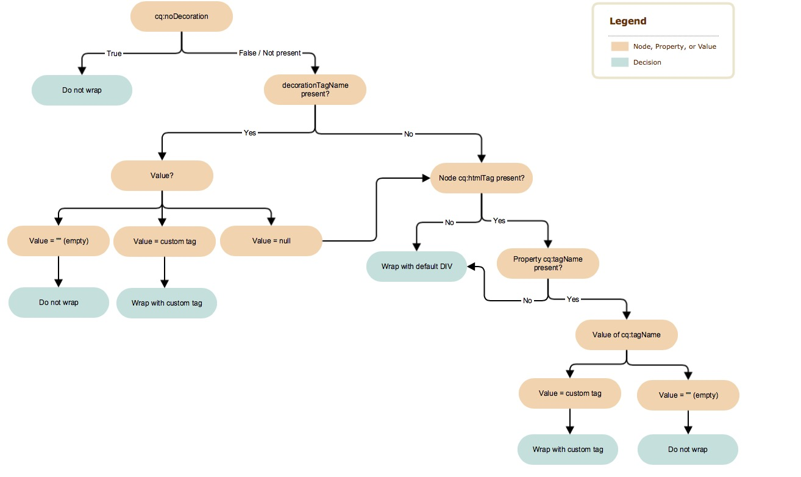

# Decoratietag{#decoration-tag}

Wanneer een component in een webpagina wordt gerenderd, kan een HTML-element worden gegenereerd, waarbij de gerenderde component in zichzelf wordt verpakt. Dit heeft hoofdzakelijk twee doelen:

* Een component kan alleen worden bewerkt wanneer deze is verpakt met een HTML-element.
* Het element wrapping wordt gebruikt om HTML-klassen toe te passen die het volgende bieden:

   * indelingsgegevens
   * opmaakgegevens

Voor ontwikkelaars, biedt AEM duidelijke en eenvoudige logica die de decoratietags controleert die inbegrepen componenten verpakken. Of en hoe de versietag wordt teruggegeven wordt bepaald door de combinatie twee factoren, die deze pagina in duiken:

* De component zelf kan zijn versietag met een reeks eigenschappen vormen.
* De scripts die componenten bevatten (HTL, JSP, dispatcher, enz.) kunnen de aspecten van de decoratietag definiëren met daarin parameters.

## Aanbevelingen {#recommendations}

Hier zijn sommige algemene aanbevelingen van wanneer om het omslagelement te omvatten dat in het vermijden zou moeten helpen lopen in onverwachte kwesties:

* De aanwezigheid van het omvattende element mag niet verschillen tussen WCMModes (bewerkings- of voorvertoningsmodus), instanties (auteur of publicatie) of omgevingen (opmaken of productie), zodat de CSS en JavaScripts van de pagina in alle gevallen op dezelfde manier werken.
* Het omvattende element zou aan alle componenten moeten worden toegevoegd die editable zijn, zodat de paginaredacteur hen kan initialiseren en behoorlijk bijwerken.
* Voor niet-bewerkbare componenten kan het omvattende element worden vermeden als het geen bepaalde functie dient, zodat de resulterende markering niet onnodig wordt opgeblazen.

## Componentbesturingselementen {#component-controls}

De volgende eigenschappen en knopen kunnen op de componenten worden toegepast om het gedrag van hun versieringsmarkering te controleren:

* **`cq:noDecoration {boolean}`:**Deze eigenschap kan aan een component worden toegevoegd en een werkelijke waarde dwingt AEM geen omvattende elementen over de component te genereren.

* **`cq:htmlTag`node:**Dit knooppunt kan onder een component worden toegevoegd en kan de volgende eigenschappen hebben:

   * **`cq:tagName {String}`:**Dit kan worden gebruikt om een aangepaste HTML-tag op te geven die moet worden gebruikt voor het verpakken van de componenten in plaats van het standaard DIV-element.
   * **`class {String}`:**Dit kan worden gebruikt om CSS klassennamen te specificeren die aan de omslag moeten worden toegevoegd.
   * Andere eigenschapnamen worden toegevoegd als HTML-kenmerken met dezelfde tekenreekswaarde als opgegeven.

## Scriptbesturingselementen {#script-controls}

Het gedrag van de omslag verschilt echter, afhankelijk van het feit of [HTL](/help/sites-developing/decoration-tag.md#htl) of [JSP](/help/sites-developing/decoration-tag.md#jsp) wordt gebruikt om het element op te nemen.

### HTL {#htl}

In het algemeen kan het gedrag van de omslag in HTML als volgt worden samengevat:

* Geen omslag DIV wordt teruggegeven door gebrek (wanneer enkel het doen `data-sly-resource="foo"`).
* Alle wcm-modi (uitgeschakeld, voorvertoning, bewerking op auteur en publiceren) worden op identieke wijze weergegeven.

Het gedrag van de omslag kan ook volledig worden geregeld.

* Het HTML-script heeft volledige controle over het resulterende gedrag van de omvattende tag.
* Componenteigenschappen (zoals `cq:noDecoration` en `cq:tagName`) kunnen ook de omvattende tag definiëren.

Het is mogelijk het gedrag van de omvattende tags van HTML-scripts en de bijbehorende logica volledig te bepalen.

Zie de [HTML-documentatie](https://docs.adobe.com/content/help/en/experience-manager-htl/using/overview.html)voor meer informatie over het ontwikkelen in HTML.

#### Beslissingsboom {#decision-tree}

Deze beslissingsstructuur geeft een overzicht van de logica die het gedrag van de omsluitende tags bepaalt.


#### Gevallen gebruiken {#use-cases}

In de volgende drie gebruiksgevallen ziet u voorbeelden van de manier waarop de labels van de omloop worden verwerkt. Ook ziet u hoe eenvoudig het is om het gewenste gedrag van de labels van de omloop te bepalen.

Alle volgende voorbeelden nemen de volgende inhoudsstructuur, en componenten aan:

```
/content/test/
  @resourceType = "test/components/one"
  child/
    @resourceType = "test/components/two"
```

```
/apps/test/components/
  one/
    one.html
  two/
    two.html
    cq:htmlTag/
      @cq:tagName = "article"
      @class = "component-two"
```

#### Hoofdlettergebruik 1: Component opnemen voor hergebruik van code {#use-case-include-a-component-for-code-reuse}

Het meest gangbare geval is wanneer een component een andere component bevat om redenen van hergebruik. In dat geval is het niet de bedoeling dat de opgenomen component bewerkbaar is met een eigen werkbalk en een eigen dialoogvenster, zodat er geen omloop nodig is en de component `cq:htmlTag` wordt genegeerd. Dit kan als standaardgedrag worden beschouwd.

`one.html: <sly data-sly-resource="child"></sly>`

`two.html: Hello World!`

Resulterende uitvoer op `/content/test.html`:

**`Hello World!`**

Een voorbeeld zou een component zijn die een component van het kernbeeld omvat om een beeld te tonen, typisch in dat geval door een synthetisch middel te gebruiken, dat in het omvatten van een virtuele kindcomponent bestaat door tot gegeven-slim-middel een voorwerp van de Kaart over te gaan dat alle eigenschappen vertegenwoordigt die de component zou hebben.

#### Hoofdlettergebruik 2: Een bewerkbare component opnemen {#use-case-include-an-editable-component}

Een ander veelvoorkomend geval van gebruik is wanneer de containercomponenten editable kindcomponenten, zoals een Container van de Lay-out omvatten. In dit geval heeft elk inbegrepen kind impliciet een omslag voor de redacteur nodig om te werken (tenzij uitdrukkelijk gehandicapt met het `cq:noDecoration` bezit).

Aangezien de inbegrepen component in dit geval een onafhankelijke component is, heeft het een omslagelement voor de redacteur nodig om te werken, en zijn lay-out en stijl te bepalen om toe te passen. Om dit gedrag te activeren, is er de `decoration=true` optie.

`one.html: <sly data-sly-resource="${'child' @ decoration=true}"></sly>`

`two.html: Hello World!`

Resulterende uitvoer op `/content/test.html`:

**`<article class="component-two">Hello World!</article>`**

#### Hoofdlettergebruik 3: Aangepast gedrag {#use-case-custom-behavior}

Er kan een aantal complexe gevallen zijn, die gemakkelijk kunnen worden verwezenlijkt door HTL de mogelijkheid te bieden om expliciet het volgende te verstrekken:

* **`decorationTagName='ELEMENT_NAME'`** De elementnaam van de omloop definiëren.
* **`cssClassName='CLASS_NAME'`** Hiermee definieert u de CSS-klassenamen die u wilt instellen.

`one.html: <sly data-sly-resource="${'child' @ decorationTagName='aside', cssClassName='child'}"></sly>`

`two.html: Hello World!`

Resulterende uitvoer `/content/test.html`:

**`<aside class="child">Hello World!</aside>`**

## JSP {#jsp}

Wanneer u een component opneemt die `cq:includ`e of `sling:include`e gebruikt, is het standaardgedrag in AEM DIV te gebruiken om het element te verpakken. Nochtans, kan dit verpakken op twee manieren worden aangepast:

* Geef AEM expliciet op om de component niet te laten omlopen met `cq:noDecoration`.
* Gebruik een aangepaste HTML-tag om de component te laten omlopen met `cq:htmlTag`/ `cq:tagName` of `decorationTagName`.

### Beslissingsboom {#decision-tree-1}

De volgende beslisboom illustreert hoe `cq:noDecoration`, `cq:htmlTag`, `cq:tagName`, en `decorationTagName` beïnvloedt het omslaggedrag.



