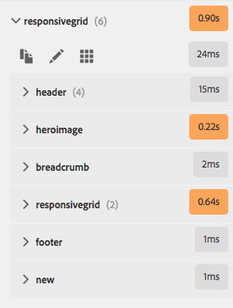

# Ontwerpmodus{#developer-mode}

Bij het bewerken van pagina&#39;s in AEM zijn verschillende [modi](/help/sites-authoring/author-environment-tools.md#modestouchoptimizedui) beschikbaar, waaronder de modus Ontwikkelaar. Hiermee wordt een zijpaneel geopend met verschillende tabbladen die een ontwikkelaar informatie geven over de huidige pagina. De drie tabbladen zijn:

* **[Componenten](#components)**voor het weergeven van structuur- en prestatiegegevens.
* **[Tests](#tests)**voor het uitvoeren van tests en het analyseren van de resultaten.
* **[Fouten](#errors)**om problemen te zien die zich voordoen.

Deze hulp een ontwikkelaar om:

* Detecteren: waaruit bestaan de pagina&#39;s?
* Foutopsporing: waar en wanneer gebeurt dat , wat op zijn beurt helpt om problemen op te lossen .
* Testen: gedraagt de toepassing zich zoals verwacht.

>[!CAUTION]
>
>Modus Ontwikkelaar:
>
>* Deze optie is alleen beschikbaar in de interface met aanraakbediening (wanneer u pagina&#39;s bewerkt).
>* Is niet beschikbaar op mobiele apparaten of kleine vensters op het bureaublad (vanwege ruimtebeperkingen).
   >   * Dit gebeurt wanneer de breedte minder dan 1024 px is.
>* Deze optie is alleen beschikbaar voor gebruikers die lid zijn van de `administrators` groep.

>[!CAUTION]
>
>De wijze van de ontwikkelaar is slechts beschikbaar op een standaardauteursinstantie die niet de runtime-wijze van de nosamplcontent gebruikt.
>
>Indien vereist kan het voor gebruik worden gevormd:
>
>* op een instantie van de auteur die geen runtime van de Inhoud gebruikt
>* een publicatie-instantie
>
>
Het moet na gebruik opnieuw worden uitgeschakeld.

>[!NOTE]
>
>Zie het volgende:
>
>* Het artikel van de Kennisbank, [het Oplossen van problemen](https://helpx.adobe.com/experience-manager/kb/troubleshooting-aem-touchui-issues.html)AEM TouchUI, voor verdere uiteinden en hulpmiddelen.
>* AEM Gems-sessie over [AEM 6.0 Developer Mode](https://docs.adobe.com/content/ddc/en/gems/aem-6-0-developer-mode.html).
>

## Ontwerpmodus openen {#opening-developer-mode}

De modus Ontwikkelaar wordt als een zijpaneel geïmplementeerd in de pagina-editor. Als u het deelvenster wilt openen, selecteert u **Ontwikkelaar** in de moduskiezer op de werkbalk van de pagina-editor:

Het deelvenster bestaat uit twee tabbladen:

* **[Componenten](/help/sites-developing/developer-mode.md#components)**- Dit toont een componentstructuur, vergelijkbaar met de[inhoudsstructuur](/help/sites-authoring/author-environment-tools.md#content-tree)voor auteurs

* **[Fouten](/help/sites-developing/developer-mode.md#errors)**- Wanneer er problemen optreden, worden details voor elke component weergegeven.

### Onderdelen {#components}

Dit toont een componentenboom die:

* Hiermee wordt de keten van componenten en sjablonen die op de pagina worden weergegeven (SLY, JSP, enz.) weergegeven. De structuur kan worden uitgebreid om de context binnen de hiërarchie te tonen.
* Geeft de computertijd aan de serverzijde weer die nodig is om de component te renderen.
* Hiermee kunt u de structuur uitvouwen en specifieke componenten in de structuur selecteren. De selectie biedt toegang tot componentdetails; zoals:

   * Pad naar opslagplaats
   * Koppelingen naar scripts (geopend in CRXDE Lite)

* Geselecteerde componenten (in de inhoudsstroom, aangegeven door een blauwe rand) worden gemarkeerd in de inhoudsstructuur (en andersom).

Dit kan helpen bij:

* Bepaal en vergelijk de rendertijd per component.
* Zie en begrijp de hiërarchie.
* Begrijp en verbeter vervolgens de laadtijd van de pagina door langzame componenten te zoeken.

Elk componentitem kan worden weergegeven (bijvoorbeeld:

* **Details** weergeven: een koppeling naar een lijst met:

   * alle componentscripts die worden gebruikt om de component te renderen.
   * het inhoudspad van de gegevensopslagruimte voor deze specifieke component.
   

* **Script** bewerken: een koppeling die:

   * Hiermee opent u het componentscript in CRXDE Lite.

* Door een componentitem uit te vouwen (pijlkop) kunt u ook het volgende weergeven:

   * De hiërarchie binnen de geselecteerde component.
   * Renderingtijden voor de geselecteerde component afzonderlijk, eventuele afzonderlijke componenten die erin zijn genest en het gecombineerde totaal.
   

>[!CAUTION]
>
>Sommige koppelingen verwijzen naar scripts onder `/libs`. Deze opties zijn echter alleen ter referentie, u **mag niets** bewerken onder `/libs`de lijst, omdat wijzigingen die u aanbrengt mogelijk verloren gaan. Dit is toe te schrijven aan het feit dat deze tak aan veranderingen kan zijn wanneer u bevordert of een hotfix/eigenschappak toepast. Eventuele wijzigingen die u nodig hebt, moeten worden aangebracht onder `/apps`, zie [Bedekkingen en Overschrijvingen](/help/sites-developing/overlays.md).

### Fouten {#errors}

Hopelijk is het tabblad **Fouten** altijd leeg (zoals hierboven), maar worden bij problemen de volgende details voor elke component weergegeven:

* Een waarschuwing als de component een ingang aan het foutenlogboek, samen met details van de fout en directe verbindingen aan de aangewezen code binnen CRXDE Lite schrijft.
* Een waarschuwing als de component een beheersessie opent.

Wanneer bijvoorbeeld een ongedefinieerde methode wordt aangeroepen, wordt de resulterende fout weergegeven op het tabblad **Fouten** :

Het componentitem in de structuur van het tabblad Componenten wordt ook gemarkeerd met een indicator wanneer een fout optreedt.

### Tests {#tests}

>[!CAUTION]
>
>In AEM 6.2 werden de testfuncties van de modus Ontwikkelaar opnieuw geïmplementeerd als een zelfstandige toepassing Tools.
>
>Zie [Uw gebruikersinterface](/help/sites-developing/hobbes.md)testen voor meer informatie.

