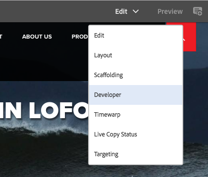

# Modus voor ontwikkelaars{#developer-mode}

Wanneer het uitgeven van pagina&#39;s in Adobe Experience Manager (AEM), verscheidene [ wijzen ](/help/sites-authoring/author-environment-tools.md#modestouchoptimizedui) beschikbaar, met inbegrip van de wijze van de Ontwikkelaar. Hiermee wordt een zijpaneel geopend met verschillende tabbladen die een ontwikkelaar informatie geven over de huidige pagina. De drie tabbladen zijn:

* **[Componenten](#components)** voor het bekijken van structuur en prestatiesinformatie.
* **[Tests](#tests)** voor het runnen van tests en het analyseren van de resultaten.
* **[Fouten](#errors)** om het even welke problemen te zien die voorkomen.

Deze hulp een ontwikkelaar om:

* Detecteren: waaruit de pagina&#39;s bestaan.
* Foutopsporing: waar en wanneer gebeurt, wat op zijn beurt helpt om problemen op te lossen.
* Test: gedraagt de toepassing zich zoals verwacht.

>[!CAUTION]
>
>Modus Ontwikkelaar:
>
>* Deze optie is alleen beschikbaar in de interface met aanraakbediening (wanneer u pagina&#39;s bewerkt).
>* Is niet beschikbaar op mobiele apparaten of kleine vensters op het bureaublad (vanwege ruimtebeperkingen).
>
>   * Dit gebeurt wanneer de breedte minder dan 1024 px is.
>* Is alleen beschikbaar voor gebruikers die lid zijn van de `administrators` -groep.

>[!CAUTION]
>
>De wijze van de ontwikkelaar is slechts beschikbaar op een standaardauteursinstantie die niet de runtime-wijze van de nosamplcontent gebruikt.
>
>Indien nodig, kan het voor gebruik worden gevormd:
>
>* op een instantie van de auteur die geen runtime van de Inhoud gebruikt
>* een publicatie-instantie
>
>Het moet na gebruik opnieuw worden uitgeschakeld.

>[!NOTE]
>
>Zie het volgende:
>
>* Het artikel van de Kennisbank, [ de kwesties van AEM TouchUI van het Oplossen van problemen ](https://experienceleague.adobe.com/nl/docs/experience-cloud-kcs/kbarticles/ka-16935), voor verdere uiteinden en hulpmiddelen.
>* De zitting van AEM Gems over [ AEM 6.0 de Wijze van de Ontwikkelaar ](https://experienceleague.adobe.com/docs/events/experience-manager-gems-recordings/gems2014/aem-developer-mode.html?lang=nl-NL).
>

## Ontwerpmodus openen {#opening-developer-mode}

De modus Ontwikkelaar wordt als een zijpaneel geïmplementeerd in de pagina-editor. Om het paneel te openen, selecteer **Ontwikkelaar** van de wijzesselecteur in de toolbar van de paginaredacteur:

Het deelvenster bestaat uit twee tabbladen:

* **[Componenten](/help/sites-developing/developer-mode.md#components)** - dit toont een componentenboom, gelijkend op de [ inhoudsboom ](/help/sites-authoring/author-environment-tools.md#content-tree) voor auteurs

* **[Fouten](/help/sites-developing/developer-mode.md#errors)** - wanneer de problemen voorkomen, worden de details getoond voor elke component.

### Onderdelen {#components}

Dit toont een componentenboom die:

* Hiermee wordt de keten van componenten en sjablonen die op de pagina worden weergegeven (SLY, JSP enzovoort) omlijnd. De structuur kan worden uitgebreid om de context binnen de hiërarchie te tonen.
* Geeft de computertijd aan de serverzijde weer om de component te renderen.
* Hiermee kunt u de structuur uitvouwen en specifieke componenten in de structuur selecteren. De selectie biedt toegang tot componentdetails, zoals:

   * Pad naar opslagplaats
   * Koppelingen naar scripts (toegankelijk in CRXDE Lite)

* Geselecteerde componenten (in de inhoudsstroom, aangegeven door een blauwe rand) worden gemarkeerd in de inhoudsstructuur (en omgekeerd).

Dit kan helpen bij:

* Bepaal en vergelijk de rendertijd per component.
* Zie en begrijp de hiërarchie.
* Begrijp en verbeter vervolgens de laadtijd van de pagina door langzame componenten te zoeken.

Elk componentitem kan worden weergegeven (bijvoorbeeld:

* **Details van de Mening**: een verbinding aan een lijst die toont:

   * alle componentscripts die worden gebruikt om de component te renderen.
   * het inhoudspad van de gegevensopslagruimte voor deze specifieke component.

  

* **geef Manuscript** uit: een verbinding die:

   * Hiermee opent u het componentscript in CRXDE Lite.

* Door een componentitem uit te vouwen (pijlkop) kunt u ook het volgende weergeven:

   * De hiërarchie binnen de geselecteerde component.
   * Renderingtijden voor de geselecteerde component afzonderlijk, eventuele afzonderlijke componenten die erin zijn genest en het gecombineerde totaal.

  

>[!CAUTION]
>
>Sommige koppelingen verwijzen naar scripts onder `/libs` . Nochtans, zijn deze slechts voor verwijzing, moet u **niets** uitgeven onder `/libs`, aangezien om het even welke veranderingen u aanbrengt kunnen worden verloren. Dit komt doordat deze vertakking mogelijk verandert wanneer u een hotfix of functiepakket bijwerkt of toepast. Breng de gewenste wijzigingen aan onder `/apps` . Zie [ Bekledingen en treedt met voeten ](/help/sites-developing/overlays.md).

### Fouten {#errors}

Hopelijk zal het **lusje van Fouten** altijd leeg zijn (zoals hierboven), maar wanneer de problemen voorkomen worden de volgende details getoond voor elke component:

* Een waarschuwing als de component een vermelding naar het foutenlogboek schrijft, samen met details van de fout en directe verbindingen aan de aangewezen code binnen CRXDE Lite.
* Een waarschuwing als de component een beheersessie opent.

Bijvoorbeeld, in een situatie waar een ongedefinieerde methode wordt geroepen, wordt de resulterende fout getoond in het **lusje van Fouten**:

Het componentitem in de structuur van het tabblad Componenten wordt ook gemarkeerd met een indicator wanneer een fout optreedt.

### Tests {#tests}

>[!CAUTION]
>
>In AEM 6.2 werden de testfuncties van de modus Ontwikkelaar opnieuw geïmplementeerd als een zelfstandige toepassing Tools.
>
>Voor volledige details, zie [ het Testen van Uw UI ](/help/sites-developing/hobbes.md).
