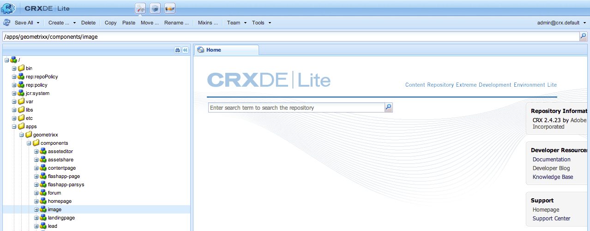

# Adobe Experience Manager-componenten (AEM) ontwikkelen (klassieke gebruikersinterface){#developing-aem-components-classic-ui}

De klassieke UI gebruikt ExtJS om widgets tot stand te brengen die het blik-en-gevoel van de componenten verstrekken. Wegens de aard van deze widgets, zijn er sommige verschillen tussen hoe de componenten met klassieke UI en [ aanraking-toegelaten UI ](/help/sites-developing/developing-components.md) in wisselwerking staan.

>[!NOTE]
>
>Vele aspecten van componentenontwikkeling zijn gemeenschappelijk voor zowel klassieke UI als aanraking-toegelaten UI, zodat **u [ AEM Componenten moet lezen - de Basisbeginselen ](/help/sites-developing/components-basics.md) vóór** het gebruiken van deze pagina, die de details van klassieke UI behandelt.

>[!NOTE]
>
>Hoewel zowel de Taal van het Malplaatje van de HTML (HTML) als JSP voor het ontwikkelen van componenten voor klassieke UI kan worden gebruikt, illustreert deze pagina ontwikkeling met JSP. Dit is uitsluitend het gevolg van de geschiedenis van het gebruik van JSP in de klassieke UI.
>
>HTML is nu de aanbevolen scripttaal voor AEM. Zie [ HTML ](https://experienceleague.adobe.com/docs/experience-manager-htl/content/overview.html) en [ het Ontwikkelen AEM Componenten ](/help/sites-developing/developing-components.md) om methodes te vergelijken.

## Structuur {#structure}

De basisstructuur van een component is behandeld op de pagina [ Componenten AEM - de Basislijnen ](/help/sites-developing/components-basics.md#structure), die zowel aanraking-geëanbeld als klassieke UIs toepast. Zelfs als u de instellingen voor de interface met aanraakbediening in uw nieuwe component niet hoeft te gebruiken, is het handig om deze instellingen te kennen wanneer u overerft van bestaande componenten.

## JSP-scripts {#jsp-scripts}

JSP de Manuscripten of de Server kunnen worden gebruikt om componenten terug te geven. Volgens de regels van de verzoekverwerking van Sling, is de naam voor het standaardmanuscript:

`<*componentname*>.jsp`

## global.jsp {#global-jsp}

Het JSP manuscriptdossier `global.jsp` wordt gebruikt om snelle toegang tot specifieke voorwerpen (namelijk tot inhoud) aan om het even welk JSP manuscriptdossier te verlenen dat wordt gebruikt om een component terug te geven.

Daarom moet `global.jsp` worden opgenomen in elk JSP-componentrendering waarin een of meer van de objecten in `global.jsp` worden gebruikt.

De standaardlocatie `global.jsp` is:

`/libs/foundation/global.jsp`

>[!NOTE]
>
>Het pad `/libs/wcm/global.jsp`, dat werd gebruikt door versies CQ 5.3 en eerder, is nu verouderd.

### Functie van global.jsp, gebruikte API&#39;s en Taglibs {#function-of-global-jsp-used-apis-and-taglibs}

In het volgende voorbeeld worden de belangrijkste objecten weergegeven die vanuit de standaardinstelling `global.jsp` worden aangeboden:

Samenvatting:

* `<cq:defineObjects />`

   * `slingRequest` - Het omvattende Request-object ( `SlingHttpServletRequest` ).
   * `slingResponse` - Het omvattende object Response ( `SlingHttpServletResponse` ).
   * `resource` - Het object Sling Resource ( `slingRequest.getResource();` ).
   * `resourceResolver` - Het object Sling Resource Resolver ( `slingRequest.getResoucreResolver();` ).
   * `currentNode` - Het opgeloste JCR-knooppunt voor de aanvraag.
   * `log` - Het standaardlogger ().
   * `sling` - De Sling-scripthulper.
   * `properties` - De eigenschappen van de geadresseerde bron ( `resource.adaptTo(ValueMap.class);` ).
   * `pageProperties` - De eigenschappen van de pagina van de geadresseerde bron.
   * `pageManager` - Het paginabeheer voor toegang tot AEM inhoudspagina&#39;s ( `resourceResolver.adaptTo(PageManager.class);`).
   * `component` - Het componentobject van de huidige AEM.
   * `designer` - Het Designer-object voor het ophalen van ontwerpinformatie ( `resourceResolver.adaptTo(Designer.class);` ).
   * `currentDesign` - Het ontwerp van de geadresseerde bron.
   * `currentStyle` - De stijl van de geadresseerde bron.

### Inhoud openen {#accessing-content}

Er zijn drie methodes om tot inhoud in AEM WCM toegang te hebben:

* Via het object properties dat wordt geïntroduceerd in `global.jsp` :

  Het eigenschappen voorwerp is een geval van een ValueMap (zie [ het Schipen API ](https://sling.apache.org/apidocs/sling5/org/apache/sling/api/resource/ValueMap.html)) en bevat alle eigenschappen van het huidige middel.

  Voorbeeld: `String pageTitle = properties.get("jcr:title", "no title");` wordt gebruikt in het renderscript van een pagina-component.

  Voorbeeld: `String paragraphTitle = properties.get("jcr:title", "no title");` wordt gebruikt in het renderscript van een standaard alinea-component.

* Via het `currentPage` -object dat is geïntroduceerd in `global.jsp` :

  Het `currentPage` voorwerp is een geval van een pagina (zie [ AEM API ](https://helpx.adobe.com/experience-manager/6-5/sites/developing/using/reference-materials/javadoc/com/day/cq/wcm/api/Page.html)). De paginaklasse biedt enkele methoden om toegang te krijgen tot inhoud.

  Voorbeeld: `String pageTitle = currentPage.getTitle();`

* Via `currentNode` -object geïntroduceerd in `global.jsp` :

  Het `currentNode` voorwerp is een geval van een knoop (zie [ JCR API ](https://jackrabbit.apache.org/api/2.16/org/apache/jackrabbit/standalone/cli/core/CurrentNode.html)). De eigenschappen van een knooppunt kunnen worden benaderd met de methode `getProperty()` .

  Voorbeeld: `String pageTitle = currentNode.getProperty("jcr:title");`

## JSP-tagbibliotheken {#jsp-tag-libraries}

De CQ- en Sling-tagbibliotheken geven u toegang tot specifieke functies voor gebruik in het JSP-script van uw sjablonen en componenten.

Voor meer informatie, zie de Bibliotheken van de Markering van het document [&#128279;](/help/sites-developing/taglib.md).

## Client-Side HTML-bibliotheken gebruiken {#using-client-side-html-libraries}

Moderne websites zijn sterk afhankelijk van verwerking op de client door complexe JavaScript- en CSS-code. Het organiseren en optimaliseren van het gebruik van deze code kan een ingewikkeld probleem zijn.

Om met deze kwestie te helpen behandelen, AEM verstrekt **Cliënt-zijOmslagen van de Bibliotheek**, die u uw cliënt-zijcode in de bewaarplaats laat opslaan, het in categorieën organiseren en bepalen wanneer en hoe elke categorie van code aan de cliënt moet worden gediend. Het client-side bibliotheeksysteem zorgt vervolgens voor het maken van de juiste koppelingen in de uiteindelijke webpagina om de juiste code te laden.

Zie het document [ Gebruikend de Bibliotheken van de HTML van client-zij ](/help/sites-developing/clientlibs.md) voor meer informatie.

## Dialoog {#dialog}

Uw component heeft een dialoogvenster nodig waarin auteurs de inhoud kunnen toevoegen en configureren.

Zie [ AEM Componenten - de Grondbeginselen ](/help/sites-developing/components-basics.md#dialogs) voor verdere details.

## Werking bewerken configureren {#configuring-the-edit-behavior}

U kunt het bewerkingsgedrag van een component configureren. Dit omvat kenmerken zoals acties beschikbaar voor de component, kenmerken van de plaatsredacteur, en luisteraars met betrekking tot gebeurtenissen op de component. De configuratie geldt voor zowel de aanraakinterface als de klassieke gebruikersinterface, maar met bepaalde specifieke verschillen.

Het [ geeft gedrag van een component uit wordt gevormd ](/help/sites-developing/components-basics.md#edit-behavior) door a `cq:editConfig` knoop van type `cq:EditConfig` onder de componentenknoop (van type `cq:Component`) toe te voegen en door specifieke eigenschappen en kindknopen toe te voegen.

## ExtJS-widgets gebruiken en uitbreiden {#using-and-extending-extjs-widgets}

Zie [ Gebruikend en Uitbreidend Widgets ExtJS ](/help/sites-developing/widgets.md) voor meer details.

## Xtypes gebruiken voor ExtJS-widgets {#using-xtypes-for-extjs-widgets}

Zie [ Gebruikend xtypes ](/help/sites-developing/xtypes.md) voor meer details.

## Nieuwe componenten ontwikkelen {#developing-new-components}

In deze sectie wordt beschreven hoe u uw eigen componenten kunt maken en deze aan het alineasysteem kunt toevoegen.

U kunt snel aan de slag door een bestaande component te kopiëren en vervolgens de gewenste wijzigingen aan te brengen.

Een voorbeeld van hoe te om een component te ontwikkelen wordt beschreven in detail in [ Uitbreidend de Component van de Tekst en van het Beeld - een Voorbeeld.](#extending-the-text-and-image-component-an-example)

### Een nieuwe component ontwikkelen (bestaande component aanpassen) {#develop-a-new-component-adapt-existing-component}

Om nieuwe componenten voor AEM te ontwikkelen die op bestaande component worden gebaseerd, kunt u de component kopiëren, een dossier van JavaScript voor de nieuwe component tot stand brengen, en het opslaan in een plaats toegankelijk aan AEM (zie ook [ Aanpassende Componenten en Andere Elementen ](/help/sites-developing/dev-guidelines-bestpractices.md#customizing-components-and-other-elements)):

1. Maak met CRXDE Lite een componentmap in:

   / `apps/<myProject>/components/<myComponent>`

   Maak de knoopstructuur opnieuw zoals in bibliotheken, kopieer dan de definitie van een bestaande component, zoals de component van de Tekst. Bijvoorbeeld om het de componentenexemplaar van de Tekst aan te passen:

   * Van `/libs/foundation/components/text`
   * tot `/apps/myProject/components/text`

1. Wijzig `jcr:title` om op zijn nieuwe naam te wijzen.
1. Open de nieuwe componentenomslag en breng de veranderingen aan u vereist. Verwijder ook alle andere gegevens in de map.

   U kunt wijzigingen aanbrengen zoals:

   * een veld toevoegen in het dialoogvenster

      * `cq:dialog` - dialoogvenster voor de interface met aanraakbediening
      * `dialog` - dialoogvenster voor de klassieke gebruikersinterface

   * het vervangen van het `.jsp` dossier (noem het na uw nieuwe component)
   * of de volledige component volledig opnieuw te bewerken als u wilt

   Als u bijvoorbeeld een kopie van de standaardtekstcomponent neemt, kunt u een extra veld aan het dialoogvenster toevoegen en vervolgens de `.jsp` bijwerken om de invoer die daar is gemaakt te verwerken.

   >[!NOTE]
   >
   >Een component voor de:
   >
   >* Touch-Toegelaten UI gebruikt [ graniet ](https://developer.adobe.com/experience-manager/reference-materials/6-5/granite-ui/api/jcr_root/libs/granite/ui/index.html) componenten
   >* Klassieke UI gebruikt [ ExtJS widgets ](https://developer.adobe.com/experience-manager/reference-materials/6-5/widgets-api/index.html)

   >[!NOTE]
   >
   >Een dialoogvenster dat is gedefinieerd voor de klassieke gebruikersinterface werkt binnen de interface met aanraakbediening.
   >
   >Een dialoogvenster dat is gedefinieerd voor de interface met aanraakbediening werkt niet binnen de klassieke interface.
   >
   >Afhankelijk van uw instantie en auteursomgeving, zou u beide soorten dialoog voor uw component kunnen willen bepalen.

1. Een van de volgende knooppunten moet aanwezig zijn en moet correct zijn geïnitialiseerd om de nieuwe component weer te geven:

   * `cq:dialog` - dialoogvenster voor de interface met aanraakbediening
   * `dialog` - dialoogvenster voor de klassieke gebruikersinterface
   * `cq:editConfig` - hoe componenten zich gedragen in de bewerkingsomgeving (bijvoorbeeld slepen en neerzetten)
   * `design_dialog` - dialoogvenster voor ontwerpmodus (alleen klassieke gebruikersinterface)

1. Activeer de nieuwe component in uw alineasysteem door:

   * CRXDE Lite gebruiken om de waarde `<path-to-component>` (bijvoorbeeld `/apps/geometrixx/components/myComponent` ) toe te voegen aan de eigenschapcomponenten van het knooppunt `/etc/designs/geometrixx/jcr:content/contentpage/par`
   * na de instructies in [ Toevoegend nieuwe componenten aan paragraafsystemen ](#adding-a-new-component-to-the-paragraph-system-design-mode)

1. Open in AEM WCM een pagina op uw website en voeg een alinea in van het type dat u hebt gemaakt om ervoor te zorgen dat de component goed werkt.

>[!NOTE]
>
>Als u timingstatistieken voor het laden van pagina&#39;s wilt zien, kunt u Ctrl-Shift-U gebruiken, waarbij `?debugClientLibs=true` is ingesteld in de URL.

### Een nieuwe component toevoegen aan het alineasysteem (ontwerpmodus) {#adding-a-new-component-to-the-paragraph-system-design-mode}

Nadat de component is ontwikkeld, voegt u deze toe aan het alineasysteem, waarmee auteurs de component kunnen selecteren en gebruiken tijdens het bewerken van een pagina.

1. Open bijvoorbeeld een pagina in de ontwerpomgeving waarin het alineasysteem wordt gebruikt `<contentPath>/Test.html` .
1. Schakel over naar de ontwerpmodus door:

   * `?wcmmode=design` toevoegen aan het einde van de URL en opnieuw openen, bijvoorbeeld:

     `<contextPath>/ Test.html?wcmmode=design`

   * klikken op Ontwerpen in Sidekick

   U bevindt zich nu in de ontwerpmodus en kunt het alineasysteem bewerken.

1. Klik op Bewerken.

   Een lijst met onderdelen die tot het alineasysteem behoren, wordt weergegeven. Uw nieuwe component wordt ook vermeld.

   De componenten kunnen worden geactiveerd (of gedeactiveerd) om te bepalen welke componenten aan de auteur worden aangeboden wanneer het uitgeven van een pagina.

1. Activeer de component en ga terug naar de normale bewerkingsmodus om te bevestigen dat deze beschikbaar is voor gebruik.

### De component Tekst en Afbeelding uitbreiden - Een voorbeeld {#extending-the-text-and-image-component-an-example}

In deze sectie ziet u hoe u de veelgebruikte standaardcomponent voor tekst en afbeeldingen kunt uitbreiden met een configureerbare functie voor het plaatsen van afbeeldingen.

Met de extensie voor tekst en afbeeldingscomponenten kunnen editors alle bestaande functionaliteit van de component gebruiken en beschikken ze over een extra optie om de plaatsing van de afbeelding op te geven:

* Aan de linkerkant van de tekst (huidig gedrag en de nieuwe standaard)
* En aan de rechterkant

Nadat u deze component hebt uitgebreid, kunt u de plaatsing van de afbeelding configureren via het dialoogvenster van de component.

In deze exercitie worden de volgende technieken beschreven:

* Bestaande componentnode kopiëren en de metagegevens wijzigen
* Het dialoogvenster van de component aanpassen, inclusief de overerving van widgets uit bovenliggende dialoogvensters
* Het wijzigen van het manuscript van de component om de nieuwe functionaliteit uit te voeren

>[!NOTE]
>
>Dit voorbeeld is gericht op klassieke UI.

>[!NOTE]
>
>Dit voorbeeld is gebaseerd op de inhoud van het monster van de Geometrixx, die niet meer met AEM wordt verscheept, die door Wij.Retail is vervangen. Zie het document [ Wij.Retail Implementatie van de Verwijzing ](/help/sites-developing/we-retail.md#we-retail-geometrixx) voor hoe te om Geometrixx te downloaden en te installeren.

#### De bestaande textielcomponent uitbreiden {#extending-the-existing-textimage-component}

Om de component tot stand te brengen, gebruikt u de standaardcomponent van de textielafbeelding als basis en wijzigt het. U slaat de nieuwe component in de Geometrixx AEM WCM voorbeeldtoepassing op.

1. Kopieer de standaard textielcomponent van `/libs/foundation/components/textimage` in de de componentenomslag van de Geometrixx, `/apps/geometrixx/components`, gebruikend texbeeld als naam van de doelknoop. (Kopieer de component door naar de component te navigeren, met de rechtermuisknop te klikken en Kopiëren te selecteren en naar de doelmap te bladeren.)

   

1. Als u dit voorbeeld eenvoudig wilt houden, navigeert u naar de component die u hebt gekopieerd en verwijdert u alle subknooppunten van het nieuwe knooppunt naast de volgende:

   * dialoogdefinitie: `textimage/dialog`
   * componentscript: `textimage/textimage.jsp`
   * configuratieknooppunt bewerken (slepen en neerzetten van elementen toestaan): `textimage/cq:editConfig`

   >[!NOTE]
   >
   >De definitie van het dialoogvenster is afhankelijk van de gebruikersinterface:
   >
   >* Interface voor aanraakbediening: `textimage/cq:dialog`
   >* Klassieke gebruikersinterface: `textimage/dialog`

1. Bewerk de metagegevens van de component:

   * Componentnaam

      * `jcr:description` instellen op `Text Image Component (Extended)`
      * `jcr:title` instellen op `Text Image (Extended)`

   * Groep, waar de component in sidekick (verlaat zoals is) wordt vermeld

      * `componentGroup` blijft ingesteld op `General`

   * Bovenliggende component voor de nieuwe component (de standaard textielcomponent)

      * `sling:resourceSuperType` instellen op `foundation/components/textimage`

   Na deze stap ziet het componentknooppunt er als volgt uit:

   

1. Wijzig de eigenschap `sling:resourceType` van het bewerkingsconfiguratieknooppunt van de afbeelding (eigenschap: `textimage/cq:editConfig/cq:dropTargets/image/parameters/sling:resourceType` ) in `geometrixx/components/textimage.`

   Op deze manier wordt, wanneer een afbeelding naar de component op de pagina wordt neergezet, de eigenschap `sling:resourceType` van de uitgebreide component textielafbeelding ingesteld op: `geometrixx/components/textimage.`

1. Wijzig de de dialoogdoos van de component om de nieuwe optie te omvatten. De nieuwe component neemt de delen van het dialoogvenster over die hetzelfde zijn als in het origineel. De enige toevoeging die u maakt is het **Geavanceerde** lusje uit te breiden, toevoegend een **drop-down lijst van de Positie van het Beeld**, met opties **links** en **juist**:

   * Laat de `textimage/dialog` eigenschappen onveranderd.

   Let op: `textimage/dialog/items` heeft vier subknooppunten, tab1 tot tab4, die de vier tabbladen van het dialoogvenster textiel vertegenwoordigen.

   * Voor de eerste twee tabbladen (tab1 en tab2):

      * Xtype wijzigen in cqinclude (om over te nemen van de standaardcomponent).
      * Voeg een padeigenschap toe met respectievelijk waarden `/libs/foundation/components/textimage/dialog/items/tab1.infinity.json` en `/libs/foundation/components/textimage/dialog/items/tab2.infinity.json` .
      * Alle andere eigenschappen of subknooppunten verwijderen.

   * Voor tab3:

      * Eigenschappen en subknooppunten ongewijzigd laten
      * Een velddefinitie toevoegen aan `tab3/items` , knooppositie van type `cq:Widget`
      * Plaats de volgende eigenschappen (van typeKoord) voor de nieuwe `tab3/items/position` knoop:

         * `name`: `./imagePosition`
         * `xtype`: `selection`
         * `fieldLabel`: `Image Position`
         * `type`: `select`

      * Voeg een subknooppunt `position/options` van het type `cq:WidgetCollection` toe dat de twee opties voor plaatsing van de afbeelding vertegenwoordigt. Onder dit knooppunt worden twee knooppunten gemaakt, o1 en o2 van het type `nt:unstructured` .
      * Voor node `position/options/o1` stelt u de eigenschappen in: `text` to `Left` en `value` to `left.`
      * Voor node `position/options/o2` stelt u de eigenschappen `text` to `Right` en `value` to `right` in.

   * Tabblad4 verwijderen.

   De beeldpositie wordt voortgeduurd in inhoud als `imagePosition` bezit van de knoop die `textimage` paragraaf vertegenwoordigt. Na deze stappen ziet het dialoogvenster van de component er als volgt uit:

   

1. Breid het componentenmanuscript, `textimage.jsp`, met extra behandeling van de nieuwe parameter uit:

   ```xml
   Image image = new Image(resource, "image");
   
   if (image.hasContent() || WCMMode.fromRequest(request) == WCMMode.EDIT) {
        image.loadStyleData(currentStyle);
   ```

   U gaat het benadrukte codefragment *%>&lt;div class=&quot;image&quot;>&lt;%* met nieuwe code vervangen die een douanestijl voor deze markering produceert.

   ```xml
   // todo: add new CSS class for the 'right image' instead of using
   // the style attribute
   String style="";
        if (properties.get("imagePosition", "left").equals("right")) {
             style = "style=\"float:right\"";
        }
        %><div <%= style %> class="image"><%
   ```

1. Sla de component op in de opslagplaats. De component kan worden getest.

#### De nieuwe component controleren {#checking-the-new-component}

Nadat de component is ontwikkeld, kunt u deze aan het alineasysteem toevoegen. Hiermee kunnen auteurs de component selecteren en gebruiken tijdens het bewerken van een pagina. Met deze stappen kunt u de component testen.

1. Open een pagina in Geometrixx zoals Engels / Bedrijf.
1. Schakel over naar de ontwerpmodus door in de Sidekick op Ontwerpen te klikken.
1. Bewerk het ontwerp van het alineasysteem door op Bewerken te klikken op het alineasysteem in het midden van de pagina. Er wordt een lijst weergegeven met componenten die in het alineasysteem kunnen worden geplaatst. De nieuwe component, Text Image (Extended), moet hierin worden opgenomen. Activeer het voor het alineasysteem door het te selecteren en op OK te klikken.
1. Ga terug naar de bewerkingsmodus.
1. Voeg de alinea Tekstafbeelding (Extended) toe aan het alineasysteem en initialiseer tekst en afbeelding met voorbeeldinhoud. Sla de wijzigingen op.
1. Open het dialoogvenster van de tekst- en afbeeldingsalinea en wijzig de afbeeldingspositie op het tabblad Geavanceerd in Rechts. Klik vervolgens op OK om de wijzigingen op te slaan.
1. De alinea wordt weergegeven met de afbeelding aan de rechterkant.
1. De component is nu gebruiksklaar.

De component slaat zijn inhoud in een paragraaf op de pagina van het Bedrijf op.

### Uploadmogelijkheden van de afbeeldingscomponent uitschakelen {#disable-upload-capability-of-the-image-component}

Als u deze mogelijkheid wilt uitschakelen, gebruikt u de standaardafbeeldingscomponent als basis en wijzigt u deze. U slaat de nieuwe component op in de voorbeeldtoepassing Geometrixx.

1. Kopieer de standaardafbeeldingscomponent van `/libs/foundation/components/image` naar de map met Geometrixx-componenten, `/apps/geometrixx/components` , waarbij de afbeelding als de naam van het doelknooppunt wordt gebruikt.

   

1. Bewerk de metagegevens van de component:

   * Plaats **jcr:titel** aan `Image (Extended)`

1. Navigeer naar `/apps/geometrixx/components/image/dialog/items/image` .
1. Een eigenschap toevoegen:

   * **Naam**: `allowUpload`
   * **Type**: `String`
   * **Waarde**: `false`

   

1. Klik **sparen allen**. De component kan worden getest.
1. Open een pagina in Geometrixx zoals Engels / Bedrijf.
1. Schakel over naar de ontwerpmodus en activeer Afbeelding (Extended).
1. Ga terug naar de bewerkingsmodus en voeg deze toe aan het alineasysteem. Op de volgende afbeeldingen ziet u de verschillen tussen de originele afbeeldingscomponent en de afbeelding die u hebt gemaakt.

   Originele afbeeldingscomponent:

   

   Uw nieuwe afbeeldingscomponent:

   

1. De component is nu gebruiksklaar.
