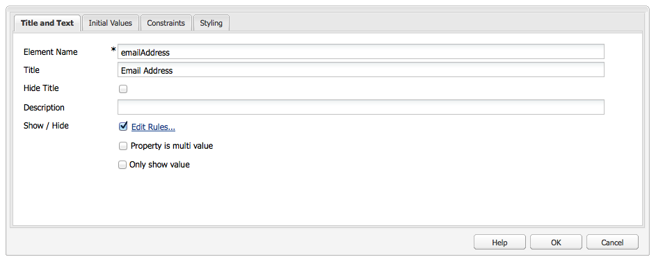

# Forms ontwikkelen (klassieke gebruikersinterface){#developing-forms-classic-ui}

De basisstructuur van een formulier is:

* Begin formulier
* Formulierelementen
* Einde van formulier

Al deze worden gerealiseerd met een reeks gebrek [Formuliercomponenten](/help/sites-authoring/default-components.md#form), beschikbaar in een standaard AEM installatie.

Naast [ontwikkeling van nieuwe onderdelen](/help/sites-developing/developing-components-samples.md) voor gebruik op uw formulieren kunt u ook:

* [Uw formulier vooraf laden met waarden](#preloading-form-values)
* [(bepaalde) velden met meerdere waarden vooraf laden](#preloading-form-fields-with-multiple-values)
* [Nieuwe acties ontwikkelen](#developing-your-own-form-actions)
* [Nieuwe beperkingen ontwikkelen](#developing-your-own-form-constraints)
* [Specifieke formuliervelden weergeven of verbergen](#showing-and-hiding-form-components)

[Scripts gebruiken](#developing-scripts-for-use-with-forms) om de functionaliteit waar nodig uit te breiden.

>[!NOTE]
>
>Dit document is gericht op het ontwikkelen van formulieren met behulp van de [Elementaire componenten](/help/sites-authoring/default-components-foundation.md) in de klassieke UI. Adobe raadt u aan de nieuwe [Kernonderdelen](https://experienceleague.adobe.com/docs/experience-manager-core-components/using/introduction.html) en [Voorwaarden verbergen](/help/sites-developing/hide-conditions.md) voor formulierontwikkeling in de interface met aanraakbediening.

## Formulierwaarden vooraf laden {#preloading-form-values}

De component Start van het formulier bevat een veld voor de **Pad laden**, een optioneel pad dat naar een knooppunt in de repository wijst.

Het pad laden is het pad naar knoopeigenschappen dat wordt gebruikt om vooraf gedefinieerde waarden te laden in meerdere velden op het formulier.

Dit is een optioneel veld dat het pad naar een knooppunt in de repository aangeeft. Als dit knooppunt eigenschappen heeft die overeenkomen met de veldnamen, worden de desbetreffende velden op het formulier vooraf geladen met de waarde van die eigenschappen. Als er geen overeenkomst bestaat, bevat het veld de standaardwaarde.

>[!NOTE]
>
>A [formulieractie](#developing-your-own-form-actions) U kunt ook de bron instellen waaruit de oorspronkelijke waarden moeten worden geladen. Dit gebeurt met `FormsHelper#setFormLoadResource` binnenkant `init.jsp`.
>
>Alleen als dit niet is ingesteld, wordt het formulier door de auteur ingevuld in de padset die in het beginformulieronderdeel is ingesteld.

### Formuliervelden met meerdere waarden vooraf laden {#preloading-form-fields-with-multiple-values}

Diverse formuliervelden bevatten ook de **Pad items laden**, opnieuw een optioneel pad dat wijst naar een knooppunt in de repository.

De **Pad items laden** is het pad naar knoopeigenschappen dat wordt gebruikt om vooraf gedefinieerde waarden in dat specifieke veld op het formulier te laden, bijvoorbeeld een [vervolgkeuzelijst](/help/sites-authoring/default-components-foundation.md#dropdown-list), [groep selectievakjes](/help/sites-authoring/default-components-foundation.md#checkbox-group) of [keuzerondje](/help/sites-authoring/default-components-foundation.md#radio-group).

#### Voorbeeld - Een vervolgkeuzelijst met meerdere waarden vooraf laden {#example-preloading-a-dropdown-list-with-multiple-values}

Een vervolgkeuzelijst kan worden geconfigureerd met uw reeks waarden voor selectie.

De **Pad items laden** kan worden gebruikt om toegang te krijgen tot een lijst vanuit een map in de repository en deze vooraf in het veld te laden:

1. Een deelmap maken ( `sling:Folder`) bijvoorbeeld `/etc/designs/<myDesign>/formlistvalues`

1. Een nieuwe eigenschap toevoegen (bijvoorbeeld `myList`) van het type multi-value string ( `String[]`) om de lijst met vervolgkeuzelijsten te bevatten. Inhoud kan ook worden geïmporteerd met een script, zoals met een JSP-script of cURL in een shell-script.

1. Gebruik het volledige pad in het dialoogvenster **Pad items laden** veld: bijvoorbeeld `/etc/designs/geometrixx/formlistvalues/myList`

Let erop dat als de waarden in de `String[]` hebben de volgende notatie:

* `AL=Alabama`
* `AK=Alaska`

en zo verder, dan AEM produceert de lijst als:

* `<option value="AL">Alabama</option>`
* `<option value="AK">Alaska</option>`

Deze functie kan bijvoorbeeld goed worden gebruikt in een meertalige instelling.

### Uw eigen formulierhandelingen ontwikkelen {#developing-your-own-form-actions}

Een formulier heeft een handeling nodig. Met een handeling wordt de bewerking gedefinieerd die wordt uitgevoerd wanneer het formulier wordt verzonden met de gebruikersgegevens.

Een reeks acties wordt voorzien van een standaard AEM installatie, deze kunnen onder worden gezien:

`/libs/foundation/components/form/actions`

en in de **Type handeling** lijst van de **Formulier** component:

In deze sectie wordt beschreven hoe u uw eigen formulieractie voor opname in deze lijst kunt ontwikkelen.

Je kunt je eigen actie toevoegen onder `/apps` als volgt:

1. Een knooppunt van het type maken `sling:Folder`. Geef een naam op die de uit te voeren handeling weerspiegelt.

   Bijvoorbeeld:

   `/apps/myProject/components/customFormAction`

1. Definieer in dit knooppunt de volgende eigenschappen en klik vervolgens op **Alles opslaan** om uw wijzigingen aan te houden:

   * `sling:resourceType` - ingesteld als `foundation/components/form/action`

   * `componentGroup` - definiëren als `.hidden`

   * Optioneel:

      * `jcr:title` - Geef een gewenste titel op. Deze wordt weergegeven in de vervolgkeuzelijst. Indien niet ingesteld, wordt de knooppuntnaam weergegeven

      * `jcr:description` - voer een beschrijving van uw keuze in

1. Maak in de map een dialoogvenster:

   1. Voeg velden toe, zodat de auteur het dialoogvenster Formulieren kan bewerken zodra de handeling is gekozen.

1. Maak in de map een van de volgende handelingen:

   1. Een postscript.
De naam van het script is `post.POST.<extension>`, bijvoorbeeld `post.POST.jsp`
Het postscript wordt geactiveerd wanneer een formulier wordt verzonden om het formulier te verwerken, bevat het de code waarmee de gegevens uit het formulier worden verwerkt `POST`.

   1. Voeg een voorwaarts script toe dat wordt aangeroepen wanneer het formulier wordt verzonden.
De naam van het script is `forward.<extension`>, bijvoorbeeld `forward.jsp`
Dit script kan een pad definiëren. Het huidige verzoek wordt dan door:sturen aan de gespecificeerde weg.

   De noodzakelijke vraag is `FormsHelper#setForwardPath` (2 varianten). Doorgaans wordt een validatie, oftewel logica, uitgevoerd om het doelpad te vinden en vervolgens door te sturen naar dat pad, zodat de standaard Sling POST-servlet de werkelijke opslag in JCR kan uitvoeren.

   Er kan ook een ander servlet zijn dat de daadwerkelijke verwerking uitvoert, in een dergelijk geval de formulieractie en de `forward.jsp` zou alleen als &quot;lijm&quot;-code fungeren. Een voorbeeld hiervan is de postactie bij `/libs/foundation/components/form/actions/mail`, die de gegevens doorgeeft aan `<currentpath>.mail.html`waar een mailserver zich bevindt.

   Dus:

   * a `post.POST.jsp` is nuttig voor kleine verrichtingen die volledig door de actie zelf worden gedaan
   * terwijl de `forward.jsp` is nuttig wanneer slechts delegatie wordt vereist.

   De uitvoeringsvolgorde voor de scripts is:

   * Bij het weergeven van het formulier ( `GET`):

      1. `init.jsp`
      1. voor alle beperkingen van het veld: `clientvalidation.jsp`
      1. validatieRT van formulier: `clientvalidation.jsp`
      1. formulier wordt geladen via bron laden indien ingesteld
      1. `addfields.jsp` tijdens renderen `<form></form>`

   * bij het verwerken van een formulier `POST`:

      1. `init.jsp`
      1. voor alle beperkingen van het veld: `servervalidation.jsp`
      1. validatieRT van formulier: `servervalidation.jsp`
      1. `forward.jsp`
      1. als een voorwaarts pad is ingesteld ( `FormsHelper.setForwardPath`), het verzoek doorsturen en vervolgens `cleanup.jsp`

      1. Als er geen voorwaarts pad is ingesteld, roept u `post.POST.jsp` (eindigt hier, nee `cleanup.jsp` opgeroepen)

1. Voeg desgewenst opnieuw toe aan de map:

   1. Een script voor het toevoegen van velden.
De naam van het script is `addfields.<extension>`, bijvoorbeeld `addfields.jsp`
An `addfields` wordt onmiddellijk aangeroepen nadat de HTML voor het begin van het formulier is geschreven. Op deze manier kan de actie aangepaste invoervelden of andere HTML toevoegen in het formulier.

   1. Een initialisatiescript.
De naam van het script is `init.<extension>`, bijvoorbeeld `init.jsp`
Dit script wordt aangeroepen wanneer het formulier wordt gegenereerd. Deze kan worden gebruikt om actiespecificaties te initialiseren.

   1. Een opschoonscript.
De naam van het script is `cleanup.<extension>`, bijvoorbeeld `cleanup.jsp`
Dit script kan worden gebruikt om opschoning uit te voeren.

1. Gebruik de **Forms** in een parsys. De **Type handeling** de vervolgkeuzelijst bevat nu uw nieuwe handeling.

   >[!NOTE]
   >
   >Standaardhandelingen weergeven die deel uitmaken van het product:
   >
   >
   >`/libs/foundation/components/form/actions`

### Uw eigen formulierbeperkingen ontwikkelen {#developing-your-own-form-constraints}

Beperkingen kunnen op twee niveaus worden opgelegd:

* Voor [afzonderlijke velden (zie de volgende procedure)](#constraints-for-individual-fields)
* Als [globale validatie van formulieren](#form-global-constraints)

#### Restricties voor afzonderlijke velden {#constraints-for-individual-fields}

U kunt uw eigen beperkingen voor een afzonderlijk veld toevoegen (onder `/apps`) als volgt:

1. Een knooppunt van het type maken `sling:Folder`. Geef een naam op die de restrictie weerspiegelt die moet worden geïmplementeerd.

   Bijvoorbeeld:

   `/apps/myProject/components/customFormConstraint`

1. Definieer in dit knooppunt de volgende eigenschappen en klik vervolgens op **Alles opslaan** om uw wijzigingen aan te houden:

   * `sling:resourceType` - ingesteld op `foundation/components/form/constraint`

   * `constraintMessage` - een aangepast bericht dat wordt weergegeven als het veld volgens de beperking niet geldig is op het moment dat het formulier wordt verzonden

   * Optioneel:

      * `jcr:title` - Geef een gewenste titel op. Deze wordt weergegeven in de selectielijst. Indien niet ingesteld, wordt de knooppuntnaam weergegeven
      * `hint` - aanvullende informatie voor de gebruiker over het gebruik van het veld

1. In deze map hebt u de volgende scripts nodig:

   * Een clientvalidatiescript: de naam van het script is `clientvalidation.<extension>`, bijvoorbeeld `clientvalidation.jsp`
Dit wordt aangeroepen wanneer het formulierveld wordt gegenereerd. U kunt hiermee JavaScript voor de client maken om het veld op de client te valideren.

   * Een servervalidatiescript: de naam van het script is `servervalidation.<extension>`, bijvoorbeeld `servervalidation.jsp`
Dit wordt aangeroepen wanneer het formulier wordt verzonden. Het kan worden gebruikt om het gebied op de server te bevestigen nadat het wordt voorgelegd.

>[!NOTE]
>
>Voorbeelden van beperkingen zijn:
>
>`/libs/foundation/components/form/constraints`

#### Formulierglobale beperkingen {#form-global-constraints}

De algemene validatie van het formulier wordt opgegeven door een brontype in de beginformuliercomponent te configureren ( `validationRT`). Bijvoorbeeld:

`apps/myProject/components/form/validation`

Vervolgens kunt u het volgende definiëren:

* a `clientvalidation.jsp` - geïnjecteerd na de clientvalidatiescripts van het veld
* en `servervalidation.jsp` - ook opgeroepen na de afzonderlijke validaties van de veldserver op een `POST`.

### Formuliercomponenten weergeven en verbergen {#showing-and-hiding-form-components}

U kunt het formulier zo configureren dat formuliercomponenten worden weergegeven of verborgen op basis van de waarde van andere velden in het formulier.

Het is handig de zichtbaarheid van een formulierveld te wijzigen als het veld alleen onder bepaalde omstandigheden nodig is. Op een feedbackformulier wordt bijvoorbeeld aan klanten gevraagd of ze productinformatie per e-mail naar hen willen sturen. Als u Ja selecteert, wordt een tekstveld weergegeven waarmee de klant zijn e-mailadres kan typen.

Gebruik de **Regels tonen/verbergen bewerken** om de voorwaarden op te geven waaronder een formuliercomponent wordt weergegeven of verborgen.

Gebruik de velden boven in het dialoogvenster om de volgende informatie op te geven:

* Of u voorwaarden voor het verbergen of weergeven van de component opgeeft.
* Of om het even welke of alle voorwaarden waar moeten zijn om de component te tonen of te verbergen.

Onder deze velden worden een of meer voorwaarden weergegeven. Een voorwaarde vergelijkt de waarde van een andere formuliercomponent (op hetzelfde formulier) met een waarde. Als de werkelijke waarde in het veld aan de voorwaarde voldoet, wordt de waarde true geëvalueerd. De voorwaarden omvatten de volgende informatie:

* De titel van het formulierveld dat wordt getest.
* Een operator.
* Er wordt een waarde vergeleken met de veldwaarde.

Bijvoorbeeld een component Groep keuzerondjes met de titel `Receive email notifications?`* * bevat `Yes` en `No` keuzerondjes. Een component Tekstveld met de titel `Email Address` gebruikt de volgende voorwaarde zodat deze zichtbaar is als `Yes` is geselecteerd:

In JavaScript gebruiken voorwaarden de waarde van de eigenschap Elementnaam om naar velden te verwijzen. In het vorige voorbeeld is de eigenschap Element Name van de component Radio Group `contact`. De volgende code is de equivalente JavaScript-code voor dat voorbeeld:

`((contact == "Yes"))`

**Een formuliercomponent weergeven of verbergen:**

1. Bewerk de specifieke formuliercomponent.

1. Selecteren **Tonen/verbergen** om de **Regels tonen/verbergen bewerken** dialoogvenster:

   * Selecteer in de eerste vervolgkeuzelijst of **Tonen** of **Verbergen** om op te geven of uw voorwaarden bepalen of de component moet worden weergegeven of verborgen.

   * Selecteer in de vervolgkeuzelijst aan het einde van de bovenste regel:

      * **alles** - als alle voorwaarden waar moeten zijn om de component weer te geven of te verbergen
      * **alle** - als slechts één of meerdere voorwaarden waar moeten zijn om de component te tonen of te verbergen

   * Selecteer in de voorwaardelijn (een wordt standaard weergegeven) een component, operator en geef een waarde op.
   * Voeg desgewenst meer voorwaarden toe door op **Voorwaarde toevoegen**.

   Bijvoorbeeld:

   

1. Klikken **OK** om de definitie op te slaan.

1. Nadat u uw definitie hebt opgeslagen, **Regels bewerken** de koppeling wordt weergegeven naast de **Tonen/verbergen** in de eigenschappen van de formuliercomponent. Klik op deze koppeling om het dialoogvenster **Regels tonen/verbergen bewerken** om wijzigingen aan te brengen.

   Klikken **OK** om alle wijzigingen op te slaan.

   

   >[!CAUTION]
   >
   >De effecten van definities tonen/verbergen kunnen worden bekeken en getest:
   >
   >* in **Voorvertoning** modus op de auteursomgeving (moet de pagina opnieuw worden geladen wanneer eerst naar de voorvertoning wordt overgeschakeld)
   >
   >* over de publicatieomgeving

#### Verwijzingen naar verbroken componenten afhandelen {#handling-broken-component-references}

Voorwaarden weergeven/verbergen gebruiken de waarde van de eigenschap Elementnaam om te verwijzen naar andere componenten in het formulier. De configuratie Tonen/Verbergen is ongeldig wanneer een van de voorwaarden verwijst naar een component die is verwijderd of waarvan de eigenschap Elementnaam is gewijzigd. Als dit gebeurt, moet u de voorwaarden handmatig bijwerken, anders treedt er een fout op wanneer het formulier wordt geladen.

Wanneer de configuratie Tonen/verbergen ongeldig is, wordt de configuratie alleen als JavaScript-code opgegeven. Bewerk de code om de problemen te verhelpen. De code gebruikt de eigenschap Element Name die oorspronkelijk is gebruikt om naar de componenten te verwijzen.

### Scripts ontwikkelen voor gebruik met Forms {#developing-scripts-for-use-with-forms}

Zie voor meer informatie over de API-elementen die kunnen worden gebruikt bij het schrijven van scripts de [javadocs in verband met formulieren](https://helpx.adobe.com/experience-manager/6-5/sites/developing/using/reference-materials/javadoc/com/day/cq/wcm/foundation/forms/package-summary.html).

U kunt dit gebruiken voor handelingen zoals het aanroepen van een service voordat het formulier wordt verzonden en het annuleren van de service als dit mislukt:

* Het type van de validatiebron definiëren
* Een script opnemen voor validatie:

   * In uw JSP, roep uw Webdienst en creeer `com.day.cq.wcm.foundation.forms.ValidationInfo` -object met uw foutberichten. Als er fouten optreden, worden de formuliergegevens niet gepost.
