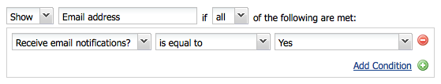

# Forms ontwikkelen (klassieke gebruikersinterface){#developing-forms-classic-ui}

De basisstructuur van een formulier is:

* Begin formulier
* Formulierelementen
* Einde formulier

Al deze worden gerealiseerd met een reeks standaardcomponenten [van het](/help/sites-authoring/default-components.md#form)Vorm, beschikbaar in een standaard AEM installatie.

Naast het [ontwikkelen van nieuwe componenten](/help/sites-developing/developing-components-samples.md) voor gebruik op uw formulieren kunt u ook:

* [Uw formulier vooraf laden met waarden](#preloading-form-values)
* [(bepaalde) velden met meerdere waarden vooraf laden](#preloading-form-fields-with-multiple-values)
* [Nieuwe acties ontwikkelen](#developing-your-own-form-actions)
* [Nieuwe beperkingen ontwikkelen](#developing-your-own-form-constraints)
* [Specifieke formuliervelden weergeven of verbergen](#showing-and-hiding-form-components)

[Scripts](#developing-scripts-for-use-with-forms) gebruiken om de functionaliteit waar nodig uit te breiden.

>[!NOTE]
>
>Dit document concentreert zich op het ontwikkelen van vormen gebruikend de Componenten [van de](/help/sites-authoring/default-components-foundation.md) Stichting in klassieke UI. Adobe raadt u aan de nieuwe [Core Components](https://docs.adobe.com/content/help/en/experience-manager-core-components/using/introduction.html) en Voorwaarden  verbergen te gebruiken voor formulierontwikkeling in de interface met aanraakbediening.

## Formulierwaarden vooraf laden {#preloading-form-values}

De component form start bevat een veld voor het **laadpad**, een optioneel pad dat naar een knooppunt in de gegevensopslagruimte wijst.

Het pad laden is het pad naar knoopeigenschappen dat wordt gebruikt om vooraf gedefinieerde waarden te laden in meerdere velden op het formulier.

Dit is een optioneel veld dat het pad naar een knooppunt in de repository aangeeft. Als dit knooppunt eigenschappen heeft die overeenkomen met de veldnamen, worden de desbetreffende velden op het formulier vooraf geladen met de waarde van die eigenschappen. Als er geen overeenkomst bestaat, bevat het veld de standaardwaarde.

>[!NOTE]
>
>Een [formulieractie](#developing-your-own-form-actions) kan ook de bron instellen waaruit de oorspronkelijke waarden moeten worden geladen. Dit gebeurt met `FormsHelper#setFormLoadResource` binnenuit `init.jsp`.
>
>Alleen als dit niet is ingesteld, wordt het formulier door de auteur ingevuld in de padset die in het beginformulieronderdeel is ingesteld.

### Formuliervelden met meerdere waarden vooraf laden {#preloading-form-fields-with-multiple-values}

Verschillende formuliervelden hebben ook het pad **** Items laden, wederom een optioneel pad dat naar een knooppunt in de gegevensopslagruimte wijst.

Het pad **Items laden** is het pad naar knoopeigenschappen dat wordt gebruikt om vooraf gedefinieerde waarden te laden in dat specifieke veld op het formulier, bijvoorbeeld een [vervolgkeuzelijst](/help/sites-authoring/default-components-foundation.md#dropdown-list), een [selectievakje](/help/sites-authoring/default-components-foundation.md#checkbox-group) of een [groep](/help/sites-authoring/default-components-foundation.md#radio-group)keuzerondjes.

#### Voorbeeld - Een vervolgkeuzelijst met meerdere waarden vooraf laden {#example-preloading-a-dropdown-list-with-multiple-values}

Een vervolgkeuzelijst kan worden geconfigureerd met uw reeks waarden voor selectie.

Met het **pad** voor het laden van items kunt u een lijst openen vanuit een map in de opslagplaats en deze vooraf in het veld laden:

1. Maak bijvoorbeeld een nieuwe slingermap ( `sling:Folder`) `/etc/designs/<myDesign>/formlistvalues`

1. Voeg een nieuwe eigenschap (bijvoorbeeld `myList`) van het type tekenreeks met meerdere waarden ( `String[]`) toe voor de lijst met vervolgkeuzelijsten. Inhoud kan ook worden geïmporteerd met een script, zoals met een JSP-script of cURL in een shell-script.

1. Gebruik het volledige pad in het veld Pad **laden** items:
bijvoorbeeld: `/etc/designs/geometrixx/formlistvalues/myList`

Let op: als de waarden in de afbeelding `String[]` als volgt zijn opgemaakt:

* `AL=Alabama`
* `AK=Alaska`
* *enz.*

aem genereert de lijst vervolgens als:

* `<option value="AL">Alabama</option>`
* `<option value="AK">Alaska</option>`

Deze functie kan bijvoorbeeld goed worden gebruikt in een meertalige instelling.

### Uw eigen formulierhandelingen ontwikkelen {#developing-your-own-form-actions}

Een formulier heeft een handeling nodig. Met een handeling wordt de bewerking gedefinieerd die wordt uitgevoerd wanneer het formulier wordt verzonden met de gebruikersgegevens.

Een reeks acties wordt voorzien van een standaard AEM installatie, deze kunnen onder worden gezien:

`/libs/foundation/components/form/actions`

en in de lijst **Type** handeling van de **component Form** :

In deze sectie wordt beschreven hoe u uw eigen formulieractie voor opname in deze lijst kunt ontwikkelen.

U kunt uw eigen actie toevoegen onder `/apps` als volgt:

1. Maak een knooppunt van het type `sling:Folder`. Geef een naam op die de uit te voeren handeling weerspiegelt.

   Bijvoorbeeld:

   `/apps/myProject/components/customFormAction`

1. In dit knooppunt worden de volgende eigenschappen gedefinieerd en vervolgens klikt u op Alles **** opslaan om uw wijzigingen aan te houden:

   * `sling:resourceType` - ingesteld als `foundation/components/form/action`

   * `componentGroup` - definiëren als `.hidden`

   * Optioneel:

      * `jcr:title` - Geef een gewenste titel op. Deze wordt weergegeven in de vervolgkeuzelijst. Indien niet ingesteld, wordt de knooppuntnaam weergegeven

      * `jcr:description` - voer een beschrijving van uw keuze in

1. Maak in de map een dialoogvenster:

   1. Voeg velden toe, zodat de auteur het dialoogvenster Formulieren kan bewerken zodra de handeling is gekozen.

1. Maak in de map een van de volgende handelingen:

   1. Een postscript.
De naam van het script is `post.POST.<extension>`bijvoorbeeld dat `post.POST.jsp`het postscript wordt aangeroepen wanneer een formulier wordt verzonden om het formulier te verwerken, het de code bevat die de gegevens uit het formulier afhandelt 
`POST`.

   1. Voeg een voorwaarts script toe dat wordt aangeroepen wanneer het formulier wordt verzonden.
De naam van het script is `forward.<extension`>, `forward.jsp`dit script kan bijvoorbeeld een pad definiëren. Het huidige verzoek wordt dan door:sturen aan de gespecificeerde weg.
   De noodzakelijke vraag is `FormsHelper#setForwardPath` (2 varianten). Doorgaans wordt een validatie, oftewel logica, uitgevoerd om het doelpad te vinden en vervolgens door te sturen naar dat pad, zodat de standaard Sling POST-servlet de werkelijke opslag in JCR kan uitvoeren.

   Er zou ook een ander servlet kunnen zijn die de daadwerkelijke verwerking doet, in een dergelijk geval de formulieractie en de actie `forward.jsp` zou slechts als &quot;lijm&quot;code dienst doen. Een voorbeeld van dit is de postactie bij `/libs/foundation/components/form/actions/mail`, die details aan door:sturen `<currentpath>.mail.html`waar een postservlet heeft.

   Dus:

   * a `post.POST.jsp` is nuttig voor kleine verrichtingen die volledig door de actie zelf worden gedaan
   * terwijl het nuttig `forward.jsp` is wanneer slechts delegatie wordt vereist.

   De uitvoeringsvolgorde voor de scripts is:

   * Tijdens het weergeven van het formulier ( `GET`):

      1. `init.jsp`
      1. voor alle beperkingen van het veld: `clientvalidation.jsp`
      1. validatieRT van formulier: `clientvalidation.jsp`
      1. formulier wordt geladen via bron laden als dit is ingesteld
      1. `addfields.jsp` tijdens renderen `<form></form>`
   * bij het verwerken van een formulier `POST`:

      1. `init.jsp`
      1. voor alle beperkingen van het veld: `servervalidation.jsp`
      1. validatieRT van formulier: `servervalidation.jsp`
      1. `forward.jsp`
      1. als een voorwaartse weg ( `FormsHelper.setForwardPath`) werd geplaatst, door:sturen het verzoek, dan vraag `cleanup.jsp`

      1. Als geen voorwaartse weg werd geplaatst, vraag `post.POST.jsp` (beëindigt hier, geen `cleanup.jsp` geroepen)

1. Voeg desgewenst opnieuw toe aan de map:

   1. Een script voor het toevoegen van velden.
De naam van het script is `addfields.<extension>`, bijvoorbeeld `addfields.jsp`een addfield-script wordt direct na het schrijven van de HTML voor het starten van het formulier geactiveerd. Hierdoor kan de handeling aangepaste invoervelden of andere dergelijke HTML in het formulier toevoegen.

   1. Een initialisatiescript.
De naam van het script wordt `init.<extension>`weergegeven, bijvoorbeeld `init.jsp`Dit script wordt aangeroepen wanneer het formulier wordt gegenereerd. Deze kan worden gebruikt om actiespecificaties te initialiseren. &quot;

   1. Een opschoonscript.
De naam van het script is `cleanup.<extension>`, bijvoorbeeld `cleanup.jsp`Dit script kan worden gebruikt om opschoning uit te voeren.

1. Gebruik de component **Forms** in een parsys. De **keuzelijst Type** handeling bevat nu uw nieuwe handeling.

   >[!NOTE]
   >
   >Standaardhandelingen weergeven die deel uitmaken van het product:
   >
   >
   >`/libs/foundation/components/form/actions`

### Uw eigen formulierbeperkingen ontwikkelen {#developing-your-own-form-constraints}

Beperkingen kunnen op twee niveaus worden opgelegd:

* Voor [afzonderlijke velden (zie de volgende procedure)](#constraints-for-individual-fields)
* Als [globale validatie van formulieren](#form-global-constraints)

#### Restricties voor afzonderlijke velden {#constraints-for-individual-fields}

U kunt als volgt uw eigen beperkingen voor een afzonderlijk veld (onder `/apps`) toevoegen:

1. Maak een knooppunt van het type `sling:Folder`. Geef een naam op die de restrictie weerspiegelt die moet worden geïmplementeerd.

   Bijvoorbeeld:

   `/apps/myProject/components/customFormConstraint`

1. In dit knooppunt worden de volgende eigenschappen gedefinieerd en vervolgens klikt u op Alles **** opslaan om uw wijzigingen aan te houden:

   * `sling:resourceType` - ingesteld op `foundation/components/form/constraint`

   * `constraintMessage` - een aangepast bericht dat wordt weergegeven als het veld volgens de beperking niet geldig is op het moment dat het formulier wordt ingediend.

   * Optioneel:

      * `jcr:title` - Geef een gewenste titel op. Deze wordt weergegeven in de selectielijst. Indien niet ingesteld, wordt de knooppuntnaam weergegeven
      * `hint` - aanvullende informatie voor de gebruiker over het gebruik van het veld

1. In deze map hebt u de volgende scripts nodig:

   * Een clientvalidatiescript:
De naam van het script wordt `clientvalidation.<extension>`aangeroepen, bijvoorbeeld `clientvalidation.jsp`wanneer het formulierveld wordt gegenereerd. U kunt hiermee JavaScript voor de client maken om het veld op de client te valideren.

   * Een servervalidatiescript:
De naam van het script wordt `servervalidation.<extension>`bijvoorbeeld `servervalidation.jsp`aangeroepen wanneer het formulier wordt verzonden. Het kan worden gebruikt om het gebied op de server te bevestigen nadat het wordt voorgelegd.

>[!NOTE]
>
>Voorbeelden van beperkingen zijn:
>
>`/libs/foundation/components/form/constraints`

#### Formulierglobale beperkingen {#form-global-constraints}

De vorm-globale bevestiging wordt gespecificeerd door een middeltype in de beginvormcomponent ( `validationRT`) te vormen. Bijvoorbeeld:

`apps/myProject/components/form/validation`

Vervolgens kunt u het volgende definiëren:

* een `clientvalidation.jsp` - geïnjecteerd na de clientvalidatiescripts van het veld
* en een `servervalidation.jsp` - ook aangeroepen na de afzonderlijke validaties van de veldserver op een `POST`.

### Formuliercomponenten weergeven en verbergen {#showing-and-hiding-form-components}

U kunt het formulier zo configureren dat formuliercomponenten worden weergegeven of verborgen op basis van de waarde van andere velden in het formulier.

Het is handig de zichtbaarheid van een formulierveld te wijzigen als het veld alleen onder bepaalde omstandigheden nodig is. Op een feedbackformulier wordt bijvoorbeeld aan klanten gevraagd of ze productinformatie per e-mail naar hen willen sturen. Als u Ja selecteert, wordt een tekstveld weergegeven waarmee de klant zijn e-mailadres kan typen.

In het dialoogvenster Regels **tonen/verbergen** bewerken kunt u opgeven onder welke voorwaarden een formuliercomponent wordt weergegeven of verborgen.

Gebruik de velden boven in het dialoogvenster om de volgende informatie op te geven:

* Hiermee wordt aangegeven of u voorwaarden opgeeft voor het verbergen of weergeven van de component.
* Of om het even welke of alle voorwaarden waar moeten zijn om de component te tonen of te verbergen.

Onder deze velden worden een of meer voorwaarden weergegeven. Een voorwaarde vergelijkt de waarde van een andere formuliercomponent (op hetzelfde formulier) met een waarde. Als de werkelijke waarde in het veld aan de voorwaarde voldoet, wordt de waarde true geëvalueerd. De voorwaarden omvatten de volgende informatie:

* De titel van het formulierveld dat wordt getest.
* Een operator.
* Er wordt een waarde vergeleken met de veldwaarde.

Een component Groep keuzerondjes met de titel `Receive email notifications?`* * bevat bijvoorbeeld keuzerondjes `Yes` `No` en keuzerondjes. Een component van het Gebied van de Tekst met de titel van `Email Address` gebruikt de volgende voorwaarde zodat het zichtbaar is als `Yes` wordt geselecteerd:

In JavaScript gebruiken voorwaarden de waarde van de eigenschap Elementnaam om naar velden te verwijzen. In het vorige voorbeeld is de eigenschap Element Name van de component Radio Group `contact`. De volgende code is de equivalente Javascript-code voor dat voorbeeld:

`((contact == "Yes"))`

**Een formuliercomponent weergeven of verbergen:**

1. Bewerk de specifieke formuliercomponent.

1. Selecteer **Tonen/Verbergen** om het dialoogvenster **Weergeven/Regels** verbergen te openen:

   * Selecteer in de eerste vervolgkeuzelijst de optie **Tonen** of **Verbergen** om op te geven of uw voorwaarden bepalen of de component moet worden weergegeven of verborgen.

   * Selecteer in de vervolgkeuzelijst aan het einde van de bovenste regel:

      * **all** - als alle voorwaarden waar moeten zijn om de component weer te geven of te verbergen
      * **om het even welk** - als slechts één of meerdere voorwaarden waar moeten zijn om de component te tonen of te verbergen
   * Selecteer in de voorwaardelijn (een wordt standaard weergegeven) een component, operator en geef een waarde op.
   * Voeg desgewenst meer voorwaarden toe door op Voorwaarde **** toevoegen te klikken.

   Bijvoorbeeld:

   

1. Klik op **OK** om de definitie op te slaan.

1. Nadat u de definitie hebt opgeslagen, wordt de koppeling Regels **** bewerken weergegeven naast de optie **Tonen/verbergen** in de eigenschappen van de formuliercomponent. Klik op deze koppeling om het dialoogvenster Regels **tonen/verbergen** bewerken te openen en wijzigingen aan te brengen.

   Klik op **OK** om alle wijzigingen op te slaan.

   

   >[!CAUTION]
   >
   >De effecten van definities tonen/verbergen kunnen worden bekeken en getest:
   >
   >
   >
   >    * in de modus **Voorvertoning** in de auteursomgeving (pagina moet opnieuw worden geladen wanneer voor het eerst wordt overgeschakeld op de voorvertoning)
      >
      >    
   * over de publicatieomgeving

#### Verwijzingen naar verbroken componenten afhandelen {#handling-broken-component-references}

Voorwaarden weergeven/verbergen gebruiken de waarde van de eigenschap Elementnaam om te verwijzen naar andere componenten in het formulier. De configuratie Tonen/Verbergen is ongeldig wanneer een van de voorwaarden verwijst naar een component die is verwijderd of waarvan de eigenschap Elementnaam is gewijzigd. Als dit gebeurt, moet u de voorwaarden handmatig bijwerken, anders treedt er een fout op wanneer het formulier wordt geladen.

Wanneer de configuratie Tonen/verbergen ongeldig is, wordt de configuratie alleen als JavaScript-code opgegeven. Bewerk de code om de problemen te verhelpen. De code gebruikt de eigenschap Element Name die oorspronkelijk is gebruikt om naar de componenten te verwijzen.

### Scripts ontwikkelen voor gebruik met Forms {#developing-scripts-for-use-with-forms}

Zie de [javadocs voor formulieren](https://helpx.adobe.com/experience-manager/6-5/sites/developing/using/reference-materials/javadoc/com/day/cq/wcm/foundation/forms/package-summary.html)voor meer informatie over de API-elementen die kunnen worden gebruikt bij het schrijven van scripts.

U kunt dit gebruiken voor handelingen zoals het aanroepen van een service voordat het formulier wordt verzonden en het annuleren van de service als dit mislukt:

* Het type van de validatiebron definiëren
* Een script opnemen voor validatie:

   * In uw JSP, roep uw Webdienst en creeer een `com.day.cq.wcm.foundation.forms.ValidationInfo` voorwerp dat uw foutenmeldingen bevat. Als er fouten optreden, worden de formuliergegevens niet gepost.
