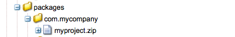

# Ontwikkelen met CRXDE Lite{#developing-with-crxde-lite}

In deze sectie wordt beschreven hoe u uw AEM-toepassing kunt ontwikkelen met behulp van CRXDE Lite.

Raadpleeg de overzichtsdocumentatie voor meer informatie over de verschillende ontwikkelomgevingen die beschikbaar zijn.

CRXDE Lite is ingebed in AEM en laat u toe om standaardontwikkelingstaken in browser uit te voeren. Met CRXDE Lite, kunt u een project tot stand brengen, dossiers (zoals .jsp en .java), omslagen, malplaatjes, componenten, dialogen, knopen, eigenschappen en bundels creëren en uitgeven terwijl het registreren en het integreren met SVN.
CRXDE Lite wordt geadviseerd wanneer u geen directe toegang tot de server van AEM hebt, wanneer u een toepassing door de uit-van-de-doos componenten en de bundels van Java uit te breiden of te wijzigen of wanneer u geen specifieke debugger, codevoltooiing en syntaxismarkering nodig hebt.

>[!NOTE]
>
>Standaard hebben alle AEM-gebruikers toegang tot CRXDE Lite. Indien gewenst, [vorm ACLs](/help/sites-administering/security.md#permissions-and-acls) voor de volgende knoop zodat slechts de ontwikkelaars tot CRX DE Lite kunnen toegang hebben:
>
>`/libs/granite/crxde`

>[!NOTE]
>
>Het wordt aanbevolen de [AEM Developer Tools voor Eclipse](/help/sites-developing/aem-eclipse.md) en de [AEM HTML Brackets Extension](/help/sites-developing/aem-brackets.md) tijdens de projectontwikkeling te gebruiken.

## Aan de slag met CRXDE Lite {#getting-started-with-crxde-lite}

Ga als volgt te werk om aan de slag te gaan met CRXDE Lite:

1. Installeer AEM.
1. Voer in uw browser `https://<host>:<port>/crx/de`. Standaard is dit `https://localhost:4502/crx/de`.
1. Voer uw **gebruikersnaam** en **wachtwoord** in. Standaard is dit `admin` en `admin`.

1. Click **OK**.

De gebruikersinterface van CRXDE Lite ziet er als volgt uit in uw browser:


U kunt nu CRXDE Lite gebruiken om uw toepassing te ontwikkelen.

## Overzicht van de gebruikersinterface {#overview-of-the-user-interface}

CRXDE Lite biedt de volgende functionaliteit aan:

<table>
 <tbody>
  <tr>
   <td>Bovenste schakelbalk</td>
   <td>Staat u toe om tussen CRXDE Lite, de Manager van het Pakket, en het Aandeel van het Pakket snel te schakelen.</td>
  </tr>
  <tr>
   <td>Knooppuntwidget</td>
   <td><p>Geeft het pad naar het momenteel geselecteerde knooppunt weer.</p> <p>U kunt het ook gebruiken om aan een knoop te springen, door de weg door hand in te gaan, of het te kleven van ergens anders, en het drukken gaat binnen.</p> <p>Het biedt ook ondersteuning voor het zoeken naar knooppunten met een specifieke knooppuntnaam. Voer de naam in van het knooppunt dat u wilt zoeken en wacht (of druk op het zoeksymbool aan de rechterkant). U kunt proberen de widget in te voeren, bijvoorbeeld de tekenreeks <em>eik</em> om te zien hoe deze werkt. Als een bepaald knooppunt of bepaalde knooppunten in het verkennervenster wordt geladen, wordt de lijst weergegeven en kunt u het pad selecteren en op Enter drukken om naar het knooppunt te navigeren. Het werkt alleen voor de knooppunten die momenteel in de CRXDE-clienttoepassing in de browser zijn geladen. Als u de hele repository wilt doorzoeken, gebruikt u Extra en vervolgens Query.</p> </td>
  </tr>
  <tr>
   <td>Explorer-venster</td>
   <td><p>Toont een boom van alle knopen in de bewaarplaats.</p> <p>Klik op een knooppunt om de eigenschappen ervan weer te geven op het tabblad <strong>Eigenschappen</strong> . Nadat u op een knooppunt hebt geklikt, kunt u een handeling op de werkbalk selecteren. Klik nogmaals op het knooppunt om de naam ervan te wijzigen.</p> <p>Navigatiefilter (binoculair pictogram): Hiermee kunt u de knooppunten in de opslagplaats filteren waarvoor de naam de invoertekst bevat. Het is alleen van toepassing op knooppunten die lokaal zijn geladen.<br /> </p> </td>
  </tr>
  <tr>
   <td>Venster Bewerken</td>
   <td><p><strong>Tabblad Start</strong> : Hiermee kunt u zoeken in inhoud en/of documentatie en toegang krijgen tot bronnen voor ontwikkelaars (documentatie, ontwikkelaarsblog, kennisbasis) en ondersteuning (Adobe-startpagina en ondersteuningscentrum).<br /> </p> <p>Dubbelklik op een bestand in het deelvenster <strong>Verkenner</strong> om de inhoud weer te geven; zoals bijvoorbeeld een .jsp- of een .java-bestand. U kunt het dan wijzigen en de veranderingen bewaren.</p> <p>Nadat een bestand is bewerkt in het deelvenster <strong>Bewerken</strong> , zijn de volgende gereedschappen beschikbaar op de werkbalk:<br /> </p> - <strong>Tonen in boom: Het bestand </strong>wordt weergegeven in de boomstructuur van de opslagplaats.<br /> - <strong>Zoeken/vervangen ...</strong>: zoeken of vervangen.<br /> Als u dubbelklikt op de statusregel van het deelvenster <br /> Bewerken <strong>, wordt het dialoogvenster</strong> Ga naar regel <strong></strong> geopend, zodat u een specifiek regelnummer kunt invoeren waarnaar u wilt gaan.<br /> </td>
  </tr>
  <tr>
   <td>Eigenschappen, tabblad<br /> </td>
   <td>Geeft de eigenschappen weer van het knooppunt dat u hebt geselecteerd. U kunt nieuwe eigenschappen toevoegen of bestaande eigenschappen verwijderen.<br /> </td>
  </tr>
  <tr>
   <td>Het tabblad Toegangsbeheer</td>
   <td><p>Toon toestemmingen die op huidige weg, bewaarplaats-niveau of hoofd worden gebaseerd.</p> <p>De rechten worden opgesplitst in</p> <p>- <strong>Toepasselijk beleid inzake</strong>toegangscontrole: Het beleid dat op de huidige selectie kan worden toegepast.</p> <p>- Beleid voor <strong>lokale toegangscontrole</strong>: Het huidige beleid dat lokaal op de huidige selectie wordt toegepast.</p> <p>- <strong>Effectief beleid</strong>inzake toegangscontrole: Het huidige beleid dat voor de huidige selectie wordt toegepast, kan lokaal worden ingesteld of van bovenliggende knooppunten worden overgeërfd.</p> <p>Opmerking. Om de informatie van het Toegangsbeheer bij allen te kunnen zien, moet de gebruiker die aan CRXDE Lite wordt aangemeld rechten hebben om ACL ingangen te lezen. De anonieme gebruiker kan deze informatie standaard niet zien. Meld u aan als bijvoorbeeld beheerder om de informatie te bekijken.</p> </td>
  </tr>
  <tr>
   <td>Tabblad Replicatie</td>
   <td><p>Toon de replicatiestatus van huidige knoop. U kunt het huidige knooppunt repliceren en herhalen.</p> </td>
  </tr>
  <tr>
   <td>Het tabblad Console<br /> </td>
   <td><p><strong>Serverlogbestanden</strong>:</p> <p>Hier worden logboekberichten weergegeven. U kunt het logboekniveau vormen, de console ontruimen, bij de geselecteerde rolpositie vastzetten en het tonen van berichten toelaten/onbruikbaar maken.<br /> </p> <p><strong>Versiebeheer</strong>:</p> <p>Geeft versiebeheerberichten weer.<br /> </p> </td>
  </tr>
  <tr>
   <td>Tabblad Informatie samenstellen<br /> </td>
   <td>Hiermee geeft u informatie weer wanneer een bundel wordt gemaakt.<br /> </td>
  </tr>
  <tr>
   <td>Vernieuwen<br /> </td>
   <td>Hiermee vernieuwt u de huidige selectie. Wijzigingen van andere gebruikers worden bijgewerkt in uw weergave van de opslagplaats. Wijzigingen die u hebt aangebracht, blijven ongewijzigd.<br /> </td>
  </tr>
  <tr>
   <td>Alles opslaan</td>
   <td><p><strong>Alles</strong>opslaan:<br /> </p> <p>Hiermee slaat u alle aangebrachte wijzigingen op. Totdat u op Opslaan klikt, zijn de wijzigingen tijdelijk en gaan deze verloren wanneer u de console afsluit.</p> <p><strong>Vorige versie</strong>:</p> <p>Hiermee worden alle wijzigingen genegeerd die u hebt aangebracht in het geselecteerde knooppunt sinds de laatste opslaghandeling en wordt vervolgens de huidige status van de opslagruimte voor het geselecteerde knooppunt opnieuw geladen.</p> <p><strong>Alles</strong>terugdraaien:</p> <p>Hiermee worden alle wijzigingen genegeerd die u hebt aangebracht in de gehele opslagplaats sinds de laatste opslaghandeling, en wordt vervolgens de huidige status van de opslagplaats opnieuw geladen.</p> </td>
  </tr>
  <tr>
   <td>Maken ...<br /> </td>
   <td><p>Vervolgkeuzemenu voor het maken van het volgende onder het geselecteerde knooppunt:<br /> </p> <p>- <strong>Knooppunt</strong>: een knooppunt met een willekeurig knooppunttype<br /> </p> <p>- <strong>Bestand</strong>: nt:bestandnode en het bijbehorende nt:resource subnode</p> <p>- <strong>Map</strong>: nt:mapknooppunt</p> <p>- <strong>Sjabloon</strong>: AEM-sjabloon</p> <p>- <strong>Component</strong>: AEM-component</p> <p>- <strong>Dialoog</strong>: AEM-dialoogvenster</p> </td>
  </tr>
  <tr>
   <td>Verwijderen<br /> </td>
   <td>Hiermee verwijdert u het geselecteerde knooppunt.<br /> </td>
  </tr>
  <tr>
   <td>Kopiëren</td>
   <td>Kopieert het geselecteerde knooppunt.<br /> </td>
  </tr>
  <tr>
   <td>Plakken<br /> </td>
   <td>Hiermee wordt het gekopieerde knooppunt onder het geselecteerde knooppunt geplakt.<br /> </td>
  </tr>
  <tr>
   <td>Verplaatsen...<br /> </td>
   <td>Hiermee verplaatst u het geselecteerde knooppunt naar het knooppunt dat via het dialoogvenster is ingesteld.</td>
  </tr>
  <tr>
   <td>Naam wijzigen ...<br /> </td>
   <td>Wijzigt de naam van het geselecteerde knooppunt.<br /> </td>
  </tr>
  <tr>
   <td>Mengsels ...<br /> </td>
   <td>Hiermee kunt u mixingtypen toevoegen aan het knooppunttype. De mixintypes worden meestal gebruikt om geavanceerde eigenschappen zoals versioning, toegangsbeheer toe te voegen, van verwijzingen voorzien, en het sluiten aan de knoop.</td>
  </tr>
  <tr>
   <td>Team<br /> </td>
   <td><p>Vervolgkeuzemenu voor het uitvoeren van standaardversiebeheertaken:</p> <p>- <strong>Opslagplaats bijwerken</strong> vanaf SVN-server</p> <p>- Lokale wijzigingen <strong>vastleggen</strong> op de SVN-server</p> <p>- <strong>Status</strong> van huidige knooppunt weergeven</p> <p>- <strong>Recursieve status</strong> van de substructuur van het huidige knooppunt weergeven</p> <p>- <strong>Een werkende kopie van de SVN-server uitchecken</strong></p> <p>- Een project <strong>exporteren</strong> vanaf de SVN-server (zonder een werkkopie te maken)</p> <p>- Een project <strong>importeren</strong> uit de opslagplaats naar de SVN-server<br /> </p> <p>Merk op dat u als gebruiker met voldoende toestemmingen moet worden aangemeld om sommige taken (vooral die kunnen uitvoeren die aan de lokale bewaarplaats schrijven) te kunnen uitvoeren.<br /> </p> </td>
  </tr>
  <tr>
   <td>Opties<br /> </td>
   <td><p>Vervolgkeuzemenu met de volgende gereedschappen:</p> <p>- <strong>Serverconfiguratie ...</strong>: om toegang te krijgen tot de Felix-console.</p> <p>- <strong>Query ...</strong>: om een query uit te voeren op de repository.</p> <p>- <strong>Bevoegdheden ...</strong>: om het beheer van bevoegdheden te openen, waar u bevoegdheden kunt weergeven en toevoegen.</p> <p>- Toegangscontrole <strong>testen ...</strong>: een plaats waar u de toestemming voor bepaalde weg en/of hoofd kunt testen.</p> <p>- Type <strong>knooppunt</strong>exporteren: om knooppunttypes in het systeem als knoopaantekening uit te voeren.</p> <p>- Type <strong>knooppunt importeren ...</strong>: om knooppunttypen te importeren met gebruik van codenotatie.</p> <p>- Foutopsporing SiteCatalyst <strong>installeren...</strong>: instructies voor het installeren van Analytics Debugger.</p> </td>
  </tr>
  <tr>
   <td>Aanmeldingswidget<br /> </td>
   <td><p>Geeft de momenteel aangemelde gebruikers weer en de werkruimte waarin zij zijn aangemeld, bijvoorbeeld admin@crx.default.</p> <p>Klik op deze knop om u aan te melden of opnieuw aan te melden als specifieke gebruiker. Als u geen werkruimte specificeert om aan login aan te melden, zult u in de standaardwerkruimte, crx.default worden geregistreerd.</p> <p>Als u de gegevensopslagruimte wilt doorbladeren als anonieme gebruiker, gebruikt u <strong>anoniem</strong> als aanmeldnaam en wachtwoord (bijvoorbeeld een spatie of een punt).<br /> </p> <p>Als uw autorisatie niet meer geldig is (de autorisatie is bijvoorbeeld verlopen), wordt voor de aanmeldingswidget "<strong>Niet-geautoriseerd - Aanmelden...</strong>" weergegeven. Klik hierop om u opnieuw aan te melden.</p> </td>
  </tr>
 </tbody>
</table>

## Een project maken {#creating-a-project}

Met CRXDE Lite kunt u een werkend project in drie klikken tot stand brengen. De projecttovenaar leidt tot een nieuw project onder `/apps`, wat inhoud onder `/conten`t en een pakket dat al project verpakt de inhoud onder `/etc/packages`. Het project kan onmiddellijk worden gebruikt om een steekproefpagina terug te geven die **Hello World** toont, die op een jsp manuscript wordt gebaseerd dat een bezit van de bewaarplaats teruggeeft en een klasse van Java roept om wat tekst terug te geven.

Een project maken met CRXDE Lite:

1. Open CRXDE Lite in uw browser.
1. Klik in het navigatievenster met de rechtermuisknop op een knooppunt, selecteer **Maken ...** en **maak vervolgens Project..**.
Opmerking: u kunt om het even welke knoop in de boomnavigatie met de rechtermuisknop aanklikken, aangezien de nieuwe projectknopen, door ontwerp, hieronder worden gecreeerd `/apps,` en `/content` `/etc/packages`.

1. Definiëren:

   * **Projectnaam** - de projectnaam wordt gebruikt om de nieuwe knooppunten en de bundel te maken, bijvoorbeeld `myproject`.

   * **Java Package** - het voorvoegsel van de Java-pakketnaam, bijvoorbeeld `com.mycompany`.

1. Klik op **Maken**.
1. Klik op Alles **** opslaan om de wijzigingen op de server op te slaan.

Als u de voorbeeldpagina wilt openen waarop **Hello World** wordt weergegeven, verwijst u naar de browser:

`https://localhost:4502/content/<project-name>.html`

De pagina van de Wereld **van** Hello is gebaseerd op een inhoudsknoop, die een jsp manuscript door het `sling:resourceType` bezit roept. Het manuscript leest het `jcr:title` bezit van de bewaarplaats en krijgt de lichaamsinhoud door een methode van de klasse te roepen SampleUtil, die in de projectbundel beschikbaar is.

De volgende knooppunten worden gemaakt:

* `/apps/<project-name>`: de toepassingscontainer.
* `/apps/<project-name>/components`: de componentencontainer, die het voorbeeld html.jsp- dossier bevat, die wordt gebruikt om een pagina terug te geven.

* `/apps/<project-name>/src`: de bundelcontainer, die een bundel van het steekproefproject bevat.

* `/apps/<project-name>/install`: de gecompileerde bundelcontainer, die de gecompileerde bundel van het steekproefproject bevat.
* `/content/<project-name>`: de inhoudscontainer.
* /etc/packages/&lt;java-suffix>/&lt;project-name>.zip, een pakket dat alle project-app en -inhoud omvat. U kunt het gebruiken om het project voor verdere plaatsing (b.v. aan andere milieu&#39;s) of voor het delen door het Aandeel van het Pakket te herbouwen.

De structuur ziet er als volgt uit in CRXDE Lite met een project genoemd **mijnproject** en een Java-pakketachtervoegsel genoemd **mijnbedrijf**:




## Een map maken {#creating-a-folder}

Een map maken met CRXDE Lite:

1. Open CRXDE Lite in uw browser.
1. Klik in het navigatievenster met de rechtermuisknop op de map waaronder u de nieuwe map wilt maken, selecteer **Maken ...** en **Map maken..**.

1. Voer de **mapnaam** in en klik op **OK**.

1. Klik op Alles **** opslaan om de wijzigingen op de server op te slaan.

## Creating a Template {#creating-a-template}

Een sjabloon maken met CRXDE Lite:

1. Open CRXDE Lite in uw browser.
1. Klik in het navigatievenster met de rechtermuisknop op de map waarin u de sjabloon wilt maken, selecteer **Maken ...** en **vervolgens Sjabloon maken..**.

1. Voer het **label**, de **titel**, de **beschrijving**, het type **** bron en de **volgorde** van de sjabloon in. Click **Next**.

1. Deze stap is optioneel: Stel de **toegestane paden** in. Click **Next**

1. Deze stap is optioneel: Stel de **Toegestane bovenliggende elementen** in. Click **Next**.

1. Deze stap is optioneel: Stel de **toegestane onderliggende items** in. Click **OK**.

1. Klik op Alles **** opslaan om de wijzigingen op de server op te slaan.

Het leidt tot:

* Een knooppunt van het type `cq:Template` met sjablooneigenschappen

* Een onderliggend knooppunt van het type `cq:PageContent` met eigenschappen voor pagina-inhoud

U kunt eigenschappen aan uw sjabloon toevoegen: Raadpleeg de sectie [Een eigenschap](#creating-a-property) maken.

## Een component maken {#creating-a-component}

De hier beschreven functie is alleen beschikbaar als CQ5 is geïnstalleerd, dat wil zeggen als het knooppunttype beschikbaar `cq:Component` is in de repository.

Een component maken met CRXDE Lite:

1. Open CRXDE Lite in uw browser.
1. Klik in het navigatievenster met de rechtermuisknop op de map waarin u de component wilt maken, selecteer **Maken ...** en **vervolgens Component maken..**.

1. Ga het **Etiket**, de **Titel**, de **Beschrijving**, het Type **van** Hulpmiddel en de **Groep** van de component in. Click **Next**.

1. Deze stap is optioneel: Stel de componenteigenschappen **Is Container,** **Geen Decoratie**, **Celnaam** en **Dialoogpad** in. Click **Next**.

1. Deze stap is optioneel: Stel de componenteigenschap **Allowed Parents** in. Click **Next**.

1. Deze stap is optioneel: Stel de componenteigenschap **Allowed Children** in. Click **OK**.

1. Klik op Alles **** opslaan om de wijzigingen op de server op te slaan.

Het leidt tot:

* Een knooppunt van het type `cq:Component`
* Componenteigenschappen
* Een .jsp-componentscript

## Een dialoogvenster maken {#creating-a-dialog}

Een dialoogvenster maken met CRXDE Lite:

1. Open CRXDE Lite in uw browser.
1. Klik in het navigatievenster met de rechtermuisknop op de component waar u het dialoogvenster wilt maken, selecteer **Maken ...** en **Dialoogvenster maken..**.

1. Voer het **label** en de **titel** in. Click **OK**.

1. Klik op **Alles** opslaan om de wijzigingen op de server op te slaan.

Er wordt een dialoogvenster gemaakt met de volgende structuur:

`dialog[cq:Dialog]/items[cq:Widget]/items[cq:WidgetCollection]/tab1[cq:Panel]`

U kunt het dialoogvenster nu aan uw wensen aanpassen door eigenschappen te wijzigen of nieuwe knooppunten te maken.

U kunt een dialoogvenster ook bewerken met de Dialoogeditor. Als u dubbelklikt op het dialoogvenster in CRXDE Lite, wordt de editor weergegeven. Meer informatie over de Dialoogeditor vindt u [hier](/help/sites-developing/dialog-editor.md).

## Een knooppunt maken {#creating-a-node}

Een knooppunt maken met CRXDE Lite:

1. Open CRXDE Lite in uw browser.
1. Klik in het navigatievenster met de rechtermuisknop op het knooppunt waar u het nieuwe knooppunt wilt maken, selecteer **Maken ...** en **vervolgens Node maken..**.
1. Voer de **naam** en het **type** in. Click **OK**.
1. Klik op Alles **** opslaan om de wijzigingen op de server op te slaan.

U kunt het knooppunt nu aan uw behoeften aanpassen door eigenschappen te wijzigen of nieuwe knooppunten te maken.

>[!NOTE]
>
>De meeste bewerkingen, waaronder Node maken, houden alle wijzigingen in het geheugen bij en slaan deze alleen op in de opslagplaats wanneer ze worden opgeslagen (via de knop Alles opslaan). Sommige bewerkingen, zoals verplaatsen, worden echter automatisch voortgezet.
>
>De validatie met betrekking tot het al dan niet toestaan van het nieuwe knooppunt door het knooppunttype van het bovenliggende knooppunt wordt ook eerst uitgevoerd door de JCR-opslagruimte bij het opslaan van wijzigingen. Als u een foutbericht ontvangt tijdens het opslaan van een knooppunt, moet u controleren of de inhoudsstructuur geldig is (u kunt bijvoorbeeld geen `nt:unstructured` knooppunt maken als onderliggend knooppunt van een `nt:folder` knooppunt).

## Een eigenschap maken {#creating-a-property}

Een eigenschap maken met CRXDE Lite:

1. Open CRXDE Lite in uw browser.
1. Selecteer in het navigatievenster het knooppunt waaraan u de nieuwe eigenschap wilt toevoegen.
1. Voer op het tabblad **Eigenschappen** in het onderste venster de **naam**, het **type** en de **waarde** in. Click **Add**.

1. Klik op Alles **** opslaan om de wijzigingen op de server op te slaan.

## Een script maken {#creating-a-script}

Een nieuw script maken:

1. Open CRXDE Lite in uw browser.
1. Klik in het navigatievenster met de rechtermuisknop op de component waar u het script wilt maken, selecteer **Maken ...** en **vervolgens Bestand maken..**.

1. Voer de **bestandsnaam** en de extensie in. Click **OK**.

1. Het nieuwe bestand wordt geopend als een tabblad in het deelvenster Bewerken.
1. Bewerk het bestand.
1. Klik op Alles **** opslaan om de wijzigingen op te slaan.

## Een bundel beheren {#managing-a-bundle}

Met CRXDE Lite, is het ongecompliceerd om een bundel te creëren OSGI, Java klassen aan het toe te voegen, en het te bouwen. De bundel wordt dan automatisch geïnstalleerd en begonnen in de container OSGI.

In deze sectie wordt beschreven hoe u een `Test` bundel maakt met een `HelloWorld` Java-klasse die **Hello World weergeeft!** in uw browser wanneer de bron wordt aangevraagd.

### Een bundel maken {#creating-a-bundle}

U kunt als volgt de testbundel maken met CRXDE Lite:

1. In CRXDE Lite creeer `myapp` project met de [projecttovenaar](#creating-a-project). De volgende knooppunten worden onder andere gemaakt:

   * `/apps/myapp/src`
   * `/apps/myapp/install`

1. Klik met de rechtermuisknop op de map `/apps/myapp/src` die de `Test` bundel zal bevatten, selecteer **Maken ...** en **vervolgens Bundel maken..**.

1. Stel de eigenschappen van de bundel als volgt in:

   * Naam symbolisch bundel: `com.mycompany.test.TestBundle`

   * Bundelnaam: `Test Bundle`
   * Bundelbeschrijving:

      ```
      This is my Test Bundle
      ```

   * Pakket:

      ```
      com.mycompany.test
      ```
   Click **OK**.

1. Klik op Alles **** opslaan om de wijzigingen op de server op te slaan.

De wizard maakt de volgende elementen:

* Het knooppunt `com.mycompany.test.TestBundle` van het type `nt:folder.` It is the bundle container node.

* Het bestand `com.mycompany.test.TestBundle.bnd`. Het fungeert als implementatiebeschrijving voor uw bundel en bestaat uit een set koppen.

* De mapstructuren:

   * `src/main/java/com/mycompany/test`. Het bevat de pakketten en de Java-klassen.

   * `src/main/resources`. Het zal de middelen bevatten die binnen de bundel worden gebruikt.

* Het `Activator.java` bestand. Het is de optionele listenerklasse die op de hoogte moet worden gebracht van bundle start en stop-gebeurtenissen.

De volgende tabel bevat een lijst met alle eigenschappen van het .bnd-bestand, de bijbehorende waarden en beschrijvingen:

<table>
 <tbody>
  <tr>
   <td><strong>Eigenschap</strong></td>
   <td><strong>Waarde (bij maken van bundel)<br /> </strong></td>
   <td><strong>Beschrijving</strong></td>
  </tr>
  <tr>
   <td>Exportpakket:</td>
   <td><p>*</p> <p>Opmerking: deze waarde moet worden aangepast aan de specificiteit van de bundel .</p> </td>
   <td>De header Export-Package definieert geëxporteerde pakketten uit de bundel (door komma's gescheiden lijst met pakketten). De geëxporteerde pakketten vormen de openbare<br /> weergave van de bundel.<br /> </td>
  </tr>
  <tr>
   <td>Importpakket:</td>
   <td><p>*</p> <p>Opmerking: deze waarde moet worden aangepast aan de specificiteit van de bundel .</p> </td>
   <td>De header Import-Package definieert geïmporteerde pakketten voor de bundel (door komma's gescheiden lijst met pakketten)</td>
  </tr>
  <tr>
   <td>Private-Package:</td>
   <td><p>*</p> <p>Opmerking: deze waarde moet worden aangepast aan de specificiteit van de bundel .</p> </td>
   <td>De header Private-Package definieert persoonlijke pakketten voor de bundel (door komma's gescheiden lijst met pakketten). De particuliere pakketten vormen de interne uitvoering.<br /> </td>
  </tr>
  <tr>
   <td>Bundelnaam:</td>
   <td>Testbundel</td>
   <td>Definieert een korte, leesbare naam voor de bundel</td>
  </tr>
  <tr>
   <td>Bundle-description:</td>
   <td>Dit is mijn testbundel</td>
   <td>Definieert een korte, leesbare beschrijving voor de bundel</td>
  </tr>
  <tr>
   <td>Bundle-SymbolicName:</td>
   <td>com.mycompany.test.TestBundle</td>
   <td>Hiermee wordt een unieke, niet-lokaliseerbare naam voor de bundel opgegeven</td>
  </tr>
  <tr>
   <td>Bundleversie:</td>
   <td>1.0.0-MOMENTOPNAME</td>
   <td>Hiermee wordt de versie van de bundel opgegeven</td>
  </tr>
  <tr>
   <td>Bundelactivering:</td>
   <td>com.mycompany.test.Activator</td>
   <td>Hiermee wordt de naam opgegeven van de optionele listenerklasse die moet worden gewaarschuwd voor bundle start- en stop-gebeurtenissen</td>
  </tr>
 </tbody>
</table>

Raadpleeg voor meer informatie over de bindindeling het [bindnut](https://bndtools.org/) dat door CRXDE wordt gebruikt om OSGI-bundels te maken.

### Een Java-klasse maken {#creating-a-java-class}

U kunt als volgt de `HelloWorld` Java-klasse maken in het testpakket:

1. Open CRXDE Lite in uw browser.
1. Klik in het navigatievenster met de rechtermuisknop op het knooppunt met het `Activator.java` bestand ( `/apps/myapp/src/com.mycompany.test.TestBundle/src/main/java`), selecteer **Maken ...** en **maak vervolgens Bestand..**.

1. Geef het bestand een naam `HelloWorld.java`. Click **OK**.

1. Het `HelloWorld.java` bestand wordt geopend in het deelvenster Bewerken.
1. Voeg de volgende regels in `HelloWorld.java`:

   ```
     package com.mycompany.test;
   
     public class HelloWorld {
     public String getString(){
     return "Hello World!";
     }
     }
   ```

1. Klik op Alles **** opslaan om de wijzigingen op de server op te slaan.

### Een bundel maken {#building-a-bundle}

Het testpakket maken:

1. Open CRXDE Lite in uw browser.
1. Klik in het navigatievenster met de rechtermuisknop op het .bnd-bestand, selecteer **Gereedschappen** en kies **vervolgens Bundelen**.

De wizard Build Bundle:

* Hiermee worden de Java-klassen gecompileerd.
* Maakt het .jar-bestand met de gecompileerde Java-klassen en de bronnen en plaatst het in de `myapp/install` map.
* Hiermee wordt de bundel geïnstalleerd en gestart in de OSGI-container.

Als u het effect van de testbundel wilt zien, maakt u een component die de Java-methode HelloWorld.getString() gebruikt en een resource die door deze component wordt gerenderd:

1. Maak de component `mycomp` onder `myapp/components`.

1. Bewerk `mycomp.jsp` en vervang de code door de volgende regels:

   ```
     <%@ page import="com.mycompany.test.HelloWorld"%><%
     %><%@ include file="/libs/foundation/global.jsp"%><%
     %><% HelloWorld hello = new HelloWorld();%><%
     %>
     <html>
     <body>
     <b><%= hello.getString() %></b><br>
     </body>
     </html>
   ```

1. Maak de bron `test_node` van het type `nt:unstructured` onder `/content`.

1. Maak bijvoorbeeld de volgende eigenschap `test_node`: Naam = `sling:resourceType`, Type = `String`, Waarde = `myapp/components/mycomp`.

1. Klik op Alles **** opslaan om de wijzigingen op de server op te slaan.

1. In uw browser, verzoek `test_node`: `https://<hostname>:<port>/content/test_node.html`.

1. Er wordt een pagina weergegeven met de **Hello World!** message.

## Nodetypen exporteren en importeren {#exporting-and-importing-node-types}

Met CRXDE Lite kunt u knooptypedefinities in [CND (Compacte Namespace en de Definitie van het Type van Knoop) invoeren en/of uitvoeren notatie](https://jackrabbit.apache.org/jcr/node-type-notation.html).

Een definitie van het knooppunttype exporteren:

1. Open CRXDE Lite in uw browser.
1. Selecteer het vereiste knooppunt.
1. Selecteer **Gereedschappen** en **Exporteer knooppunttype**.

1. De definitie in cnd-notatie wordt in uw browser weergegeven. Sla de gegevens indien nodig op.

Een definitie van het knooppunttype importeren:

1. Open CRXDE Lite in uw browser.
1. Selecteer **Gereedschappen** en **Importeer knooppunttype...**.

1. Voer in het tekstvak de CND-notatie voor de definitie in.
1. Schakel Update **** toestaan in als u een bestaande definitie bijwerkt.
1. Klik op **Importeren**.

## Logboekregistratie {#logging}

Met CRXDE Lite kunt u het dossier tonen `error.log` dat op het dossiersysteem bij `<crx-install-dir>/crx-quickstart/server/logs` en het filtreren met het aangewezen logboekniveau wordt gevestigd. Ga als volgt te werk:

1. Open CRXDE Lite in uw browser.
1. Selecteer op het tabblad **Console** onder aan het venster in het keuzemenu rechts de optie **Serverlogbestanden**.

1. Klik op het pictogram **Stoppen** om de berichten weer te geven.

U kunt:

* Pas de logparameters in de Felix-console aan door op het pictogram **Logging Configurations** te klikken.
* U kunt de berichten wissen door op het pictogram **Penseel** te klikken.
* Plaats het bericht op de huidige selectie door op het pictogram **Vastzetten** te klikken.
* Schakel de weergave van berichten in of uit door op het pictogram **Stoppen** te klikken.

## Toegangsbeheer {#access-control}

>[!NOTE]
>
>Zie [Gebruikers, Groepen en het Beleid](/help/sites-administering/user-group-ac-admin.md) van de Rechten van de Toegang voor meer informatie.
