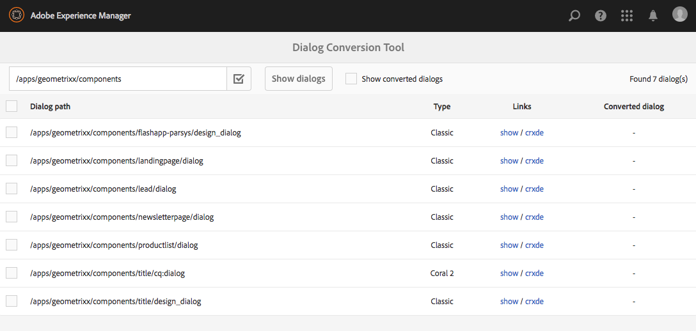

# Dialoogvenster omzetten{#dialog-conversion-tool}

Het hulpmiddel van de dialoogomzetting wordt verstrekt helpen bestaande componenten uitbreiden die slechts een dialoog hebben die voor klassieke UI (op ExtJS wordt gebaseerd) wordt bepaald of op Granite UI en Koraal 2 wordt gebaseerd. Het gereedschap gebruikt het oorspronkelijke dialoogvenster om een dubbel dialoogvenster te maken dat is ontworpen voor de standaardinterface op basis van de gebruikersinterface van graniet en koraal 3.

Het doel van dit hulpmiddel is de verbetering te automatiseren voor zover mogelijk, efficiency te verhogen, en fouten te verminderen. Omdat het gereedschap echter niet voor elk scenario geldt, kan het proces niet volledig worden geautomatiseerd en moet de gebruiker de omgezette dialoogvensters bekijken en mogelijk aanvullende aanpassingen aanbrengen. Het hulpmiddel is bedoeld als hulp om u te helpen het omzettingsproces beginnen, maar niet bedoeld om volledige controle van de omzetting te nemen.

Het hulpmiddel zal de nieuwe dialoog tot stand brengen gebruikend de norm, granite UI en Coral 3-Gebaseerde UI, maar het zal overslaan wat het niet kan omzetten. Daarom kan het resulterende dialoogvenster knooppunten van het oorspronkelijke dialoogvenster bevatten die zijn gekopieerd als er geen regel is die overeenkomt met die specifieke component. Bovendien kan een omgezette component enkele niet-omgezette eigenschappen hebben, omdat er geen geschikte regel was om deze om te zetten.

>[!CAUTION]
>
>Het instrument kan niet elk scenario bestrijken, aangezien de omzettingsregels niet-uitputtend zijn en op een best-inspanningsbasis werken. Het zet de het vaakst gebruikte elementen en eigenschappen om, maar de omzetting zal onvolledig zijn wanneer het behandelen van aanpassingen of hoogst-gespecialiseerde dialogen. **Voor geconverteerde dialoogvensters zijn mogelijk aanvullende aanpassingen nodig en alle conversies moeten worden gecontroleerd.**

>[!NOTE]
>
>Omdat de klassieke interface niet meer wordt ontwikkeld of verbeterd, raadt Adobe klanten aan een upgrade uit te voeren naar de standaardgebruikersinterface van Granite om te profiteren van de nieuwste technologie.
>
>Hoewel het over het algemeen een goede praktijk is om naar het meest recente platform te migreren, is migratie van Coral 2 naar Coral 3 niet van cruciaal belang. Een nieuw project moet echter worden gestart op basis van Coral 3.

## Het gereedschap Dialoogomzetting downloaden en installeren {#download-and-install-the-dialog-conversion-tool}

Het hulpmiddel van de dialoogomzetting is open bron gemaakt en kan toegang via GitHub zijn.

CODE VOOR GITHUB

U kunt de code van deze pagina op GitHub vinden

* [Open aem-dialoog-omzettingsproject op GitHub](https://github.com/Adobe-Marketing-Cloud/aem-dialog-conversion)
* Het project downloaden als [ZIP-bestand](https://github.com/Adobe-Marketing-Cloud/aem-dialog-conversion/archive/master.zip)

>[!NOTE]
>
>AEM wordt niet verzonden met het hulpprogramma voor het omzetten van dialoogvensters. U moet het downloaden en installeren om het te gebruiken.

Voer de volgende stappen uit om het gereedschap voor het converteren van dialoogvensters te installeren.

1. Download het pakket van het project [GitHub van het Hulpmiddel van de Omzetting van de](https://github.com/Adobe-Marketing-Cloud/aem-dialog-conversion/releases)Dialoog.
1. Installeer het pakket op uw exemplaar. Voor details op pakketbeheer zie [hoe te met Pakketten](/help/sites-administering/package-manager.md)werken.

## Een dialoogvenster converteren {#converting-a-dialog}

Het gereedschap converteert dialoogvensters door een overeenkomend dialoogvenster voor graniet-gebruikersinterface / koraal 3 te maken op dezelfde locatie als het oorspronkelijke dialoogvenster in de inhoudsstructuur. In het geval van de dialogen van Granite UI/Coral 2, worden deze gekopieerd aan een reserveplaats (een `.coral2` achtervoegsel wordt toegevoegd aan de naam van de dialoogdoos) zodat niet om worden met voeten getreden. Het gereedschap kan ontwerpdialoogvensters converteren en dialoogvensters bewerken.

Gebruik de volgende stappen om een of meer dialoogvensters om te zetten:

1. Open de **Dialog Conversion** -console, toegankelijk via **Global Navigation** -> **Tools** -> **Operations**:

   `https://<hostname>:<port>/libs/cq/dialogconversion/content/console.html`

   

1. Voer het vereiste pad in, bijvoorbeeld `/apps/geometrixx/components`. U kunt ook een rechtstreeks pad naar één dialoogvenster invoeren, zoals `/apps/geometrixx/components/lead`.

   

1. Selecteer Dialoogvensters **** tonen om alle dialoogvensters onder die locatie weer te geven.

   

   De tabel bevat een lijst met alle bestaande oudere dialoogvensters onder het ingevoerde pad. In elk dialoogvenster wordt het type weergegeven. De volgende typen zijn beschikbaar:

   * **** Klassiek: Knooppunten van het type `cq:Dialog` met knooppuntnaam `dialog` of `design_dialog`
   * **** Koraal 2: Nodes genoemd `cq:dialog` of `cq:design_dialog` die een graniet UI/Koral 2 middeltype bij hun knoop van de kindinhoud hebben
   Elke rij bevat een koppeling om het dialoogvenster weer te geven en een koppeling naar CRXDE Lite om de bijbehorende knooppuntstructuur weer te geven.

   >[!NOTE]
   >
   >Componenten die geen dialoogvenster hebben voor de klassieke interface of koraal 2 (dat wil zeggen ze die zijn ontworpen met de gebruikersinterface van graniet / koraal 3) worden niet vermeld.

1. Selecteer een of meer dialoogvensters voor conversie en klik op X-dialoogvenster **converteren of tik op X-dialoogvenster** converteren om het conversieproces te starten.

   

1. De geselecteerde dialogen worden weergegeven met de resultaten van hun conversies. Als de conversie succesvol was, bevat de rij koppelingen naar het omgezette dialoogvenster of naar het openen van het dialoogvenster in CRXDE Lite.

   Klik of tik op **Terug** om terug te keren naar het gereedschap Dialoogomzetting.

   

1. In het gereedschap Dialoogomzetting worden de omgezette dialoogvensters niet meer weergegeven in de lijst. Het totale aantal aangetroffen dialoogvensters wordt echter nog vermeld, inclusief de dialoogvensters die al zijn geconverteerd, d.w.z. het aantal rijen in de tabel komt niet altijd overeen met dat van het gevonden aantal.

   

1. Schakel de optie Omgezette dialoogvensters **** tonen in om de dialoogvensters weer te geven die zich op het opgegeven pad bevinden en die al zijn omgezet.

   

   Als het dialoogvenster al is geconverteerd, worden er ook koppelingen naar het geconverteerde dialoogvenster weergegeven. Een dialoogvenster wordt geconverteerd als er al een dialoogvenster voor een verwant graniet-interface/koraal 3 beschikbaar is.

## Regels voor herschrijven van dialoogvensters {#dialog-rewrite-rules}

Het gereedschap voor het omzetten van dialoogvensters is gebaseerd op het concept van herschrijven van **grafieken**, dat bestaat uit het transformeren van een onderwerpreeks door het toepassen van herschrijfregels. Een herschrijfregel is de koppeling van een patroon met een vervangende grafiek. De regel komt overeen met het aantal exemplaren van een bepaalde alinea in de onderwerpreeks en vervangt deze vervolgens. Zie ook [https://en.wikipedia.org/wiki/Graph_rewriting](https://en.wikipedia.org/wiki/Graph_rewriting) voor meer informatie over het herschrijven van grafieken.

Het hulpmiddel van de dialoogomzetting gebruikt deze benadering om een bepaalde erfenis dialoogboom (Klassiek of Granite UI/Koral 2) aan zijn Granite UI/Koral 3 tegenhanger te herschrijven. Dit heeft het voordeel dat de omzetting hoogst flexibel is en zelfs complexe componenten in aanmerking kan nemen, aangezien de aanpassing op daadwerkelijke subbomen en niet alleen enige knopen of eigenschappen wordt gedaan.

### Algorithm {#algorithm}

Het herschrijfalgoritme neemt als parameter de boom die moet worden herschreven en een reeks herschrijfregels. Het doorloopt de boom in pre-orde en voor elke knoop controleert als een regel voor de subboom van toepassing is die bij die knoop wordt geworteld. De eerste regel die overeenkomt, wordt toegepast op die substructuur om deze te herschrijven. De traversal begint vervolgens opnieuw bij de basis. Het algoritme stopt zodra de gehele boom is doorlopen en geen enkele regel een subboomstructuur heeft gevonden. Als optimaliseringsmaatregel, houdt het algoritme spoor van een reeks knopen die definitief zijn en daarom moet niet voor gelijken in verdere traversals opnieuw worden gecontroleerd. Het is aan rewrite regels om te bepalen welke knopen van de herschreven boom definitief zijn, en die door toekomstige overgangen van het algoritme zouden moeten worden herzien.

Het ingangspunt voor de omzetting is het `DialogConversionServlet`, dat op POST-verzoeken aan `/libs/cq/dialogconversion/content/convert.json`wordt geregistreerd. Deze accepteert een padaanvraagparameter. Dit is een array die de paden naar de dialoogvensters bevat die moeten worden omgezet. Voor elk dialoogvenster herschrijft de servlet vervolgens de corresponderende dialoogstructuur door alle gedefinieerde regels voor het herschrijven van dialoogvensters toe te passen.

### Regeltypen herschrijven {#rewrite-rule-types}

De herschrijfregels kunnen op twee verschillende manieren worden gedefinieerd:

* JCR-knooppuntstructuren - Op [knooppunt gebaseerde herschrijfregels](/help/sites-developing/dialog-conversion.md#node-based-rewrite-rules)

* Java-klassen die een specifieke interface implementeren - Op [Java gebaseerde herschrijfregels](/help/sites-developing/dialog-conversion.md#java-based-rewrite-rules)

Sommige worden [verstrekt uit-van-de-doos](#provided-rewrite-rules), maar u kunt uw eigen aangepaste regels ook bepalen. [Er zijn ook voorbeelden van herschrijfregels](/help/sites-developing/dialog-conversion.md#sample-rewrite-rules) beschikbaar.

Doorgaans is één regel voor het herschrijven van dialoogvensters verantwoordelijk voor het herschrijven van één dialoogelement, bijvoorbeeld het invoerveld van de padbrowser.

>[!CAUTION]
>
>Herschrijven de lijnen worden niet ontdekt door het algoritme, daarom moeten de **herschrijvingsregels bomen niet op een cirkelwijze** herschrijven.

### Herschrijfregels op basis van knooppunten {#node-based-rewrite-rules}

Een dialoogvenster voor het herschrijven van regels kan worden gedefinieerd in termen van knooppunten en eigenschappen.

```xml
rule
  - jcr:primaryType = nt:unstructured
  - cq:rewriteRanking = 4
  + patterns
    - jcr:primaryType = nt:unstructured
    + foo
      - ...
      + ...
    + foo1
      - ...
      + ...
  + replacement
    + bar
      - ...
      + ...
```

In dit voorbeeld wordt een regel gedefinieerd die twee **patronen** bevat (de bomen die zijn geworteld op `foo` en `foo1`) en een **vervanger** (de boom die is geworteld op `bar`). De patroon- en vervangingsbomen zijn willekeurige bomen die knooppunten en eigenschappen bevatten. De regel komt overeen met een substructuur als een van de gedefinieerde patronen overeenkomt. Een patroon komt alleen overeen als de onderwerpstructuur dezelfde knooppunten bevat als het patroon (overeenkomende namen) en alle eigenschappen die in het patroon zijn gedefinieerd, overeenkomen met de eigenschappen van de structuur.

In het geval van een overeenkomst wordt de overeenkomende substructuur (de oorspronkelijke structuur genoemd) vervangen door de vervangende substructuur. De vervangingsboom kan in kaart gebrachte eigenschappen bepalen die de waarde van een bezit in de originele boom zullen erven. Zij moeten van type zijn `String` en het volgende formaat hebben:

`${<path>}`

Als het referenced bezit niet in de originele boom bestaat, dan wordt het bezit weggelaten. U kunt ook een standaardwaarde voor dat geval opgeven (alleen mogelijk voor tekenreekseigenschappen):

`${<path>:<default>}`

Eigenschappen die &#39; `:`&#39; tekens bevatten, kunnen één aanhalingsteken zijn om conflicten met het verschaffen van een standaardwaarde te voorkomen. Booleaanse eigenschappen worden genegeerd als de expressie wordt voorafgegaan door &#39; `!`&#39;. Toegewezen eigenschappen kunnen worden vermenigvuldigd, in welk geval zij de waarde van het eerste bezit zullen worden toegewezen dat in de aangepaste boom bestaat.

De volgende eigenschap `one` wordt bijvoorbeeld toegewezen aan de waarde van de eigenschap `./two/three` van de overeenkomende oorspronkelijke structuur.

```xml
...
  + replacement
    + bar
      - one = ${./two/three}
      - negated = !${./some/boolean/prop}
      - default = ${./some/prop:default}
      - multi = [${./prop1}, ${./prop2}]
```

Regels ondersteunen ook de volgende optionele eigenschappen.

* `cq:rewriteOptional` (boolean)

   Stel deze eigenschap in op een patroonknooppunt om aan te geven dat het patroon niet aanwezig hoeft te zijn

* `cq:rewriteRanking` (integer)

   Plaats dit bezit op de regelknoop om de orde te beïnvloeden waardoor de regels worden toegepast. Dit kan nuttig zijn om ervoor te zorgen dat de regels die meer specifieke structuren behandelen niet door meer algemene worden beschreven. Regels met een lagere rangorde hebben voorrang op regels met een hogere rangorde. Alle regels worden standaard `Integer.MAX_VALUE` als rangschikking toegepast.

De vervangingsboom steunt ook de volgende speciale eigenschappen (genoemd begin met `cq:rewrite`):

* `cq:rewriteMapChildren` (tekenreeks)

   De knoop die dit bezit bevat zal een exemplaar van de kinderen van de knoop in de originele boom ontvangen die door de bezitswaarde van verwijzingen wordt voorzien (b.v. `cq:rewriteMapChildren=./items`).

* `cq:rewriteFinal` (boolean)

   Dit is een optimaliseringsmaatregel die het algoritme vertelt dat de knoop die dit bezit bevat definitief is en niet moet opnieuw worden gecontroleerd voor de aanpassing herschrijft regels. Wanneer geplaatst op de vervangingsknoop zelf, wordt de volledige vervangingsboom beschouwd als definitief.
* `cq:rewriteCommonAttrs` (boolean)

   Plaats dit bezit op de vervangingsknoop ( `rule`/ `replacement`) om relevante eigenschappen van de originele wortelknoop aan Granite gemeenschappelijke attributenequivalenten in de exemplaarwortel in kaart te brengen. Deze behandelt gegevenskenmerken door het `granite:data` subknooppunt op het doel te kopiëren of te maken en er `data-*` eigenschappen te schrijven.
* `cq:rewriteRenderCondition` (boolean)

   Plaats dit bezit op de vervangingsknoop ( `rule`/ `replacement`) om het even welke graniet terug te geven voorwaarde ( `rendercondition` of `granite:rendercondition`) kindknoop van de originele wortelknoop aan een `granite:rendercondition` kind van de exemplaarwortel te kopiëren.

Daarnaast kan een `cq:rewriteProperties` knooppunt aan een vervangingsknooppunt worden toegevoegd om tekenreeksherschrijvingen voor toegewezen eigenschappen in het resultaat te definiëren. Het knooppunt wordt verwijderd uit de vervanging. De eigenschappen van het `cq:rewriteProperties` knooppunt moeten dezelfde naam hebben als de eigenschappen die ze herschrijven en die een tekenreeksarray met twee parameters accepteren:

* `pattern`: Regex moet overeenkomen met, bijvoorbeeld `"(?:coral-Icon-)(.+)"`

* `replacement`: Aan de `replaceAll` functie matcher, bv. `"$1"`

Hieronder ziet u een voorbeeld van het herschrijven van de eigenschappen van het pictogram Coral 2 naar de equivalenten van Coral 3:

```xml
...
  + replacement
    + bar
      - icon = ${./icon}
      + cq:rewriteProperties
       - icon = [(?:coral-Icon--)(.+), $1]
```

#### Uw eigen op knooppunten gebaseerde herschrijfregels definiëren {#defining-your-own-node-based-rewrite-rules}

De regels voor herschrijven worden gedefinieerd op:

`/libs/cq/dialogconversion/rules`

De regels worden verder verdeeld op deze plaats in omslagen voor klassieke herschrijfregels en Coral 2 herschrijft regels:

`/libs/cq/dialogconversion/rules/classic`

`/libs/cq/dialogconversion/rules/coral2`

Deze regels kunnen worden overschreven door een aantal regels op te geven op:

`/apps/cq/dialogconversion/rules`

U kunt kopiëren `/libs/cq/dialogconversion/rules` om `/apps` dan bestaande te wijzigen en/of nieuwe regels aan dit nieuwe geval toe te voegen &quot;.

### Op Java gebaseerde herschrijfregels {#java-based-rewrite-rules}

Complexere herschrijfregels kunnen worden gedefinieerd als Java-klassen die een OSGi-service van de interface toegankelijk maken `com.adobe.cq.dialogconversion.DialogRewriteRule`.

Een dergelijke klasse moet de volgende methoden implementeren:

```java
boolean matches(Node root) throws RepositoryException;
Node applyTo(Node root, Set<Node> finalNodes) throws DialogRewriteException, RepositoryException;
int getRanking();
```

De `matches` methode moet terugkeren `true` als de regel de subboomstructuur aanpast die bij de geleverde wortelknoop wordt geworteld. Als de regel aanpast, zal de boom die algoritme herschrijft later de `applyTo` methode roepen, die de subboom moet herschrijven die op de gespecificeerde wortelknoop wordt geworteld. Gewoonlijk, zal deze methode tijdelijk anders noemen de originele boom, bouwt de nieuwe boom als nieuw kind van de originele knoop van de boom (gebruikend zijn knopen en eigenschappen), en verwijdert tenslotte de originele boom. Meer gedetailleerde informatie vindt u in de Javadoc van de `com.adobe.cq.dialogconversion.DialogRewriteRule` interface.

#### Meer informatie - JavaDocs {#further-information-javadocs}

Raadpleeg de JavaDocs voor meer informatie [`com.adobe.cq.dialogconversion`](https://adobe-marketing-cloud.github.io/aem-touchui-dialogconversion-samples/javadoc/).

#### Uw eigen op Java gebaseerde herschrijfregels definiëren {#defining-your-own-java-based-rewrite-rules}

De volgende klasse toont een voorbeeld van een aangepaste herschrijfregel die de `com.adobe.cq.dialogconversion.DialogRewriteRule` interface implementeert.

```java
@Component
@Service
public class CustomDialogRewriteRule implements DialogRewriteRule {

    public boolean matches(Node root) throws RepositoryException {
        // ...
    }

    public Node applyTo(Node root, Set<Node> finalNodes) throws DialogRewriteException, RepositoryException {
        // ...
    }

    int getRanking() {
        // ...
    }

}
```

U kunt ook `com.adobe.cq.dialogconversion.AbstractDialogRewriteRule` als volgt uitbreiden. De abstracte klasse voert de `getRanking` methode uit en gebruikt het bezit `service.ranking` OSGi van de dienst om het rangschikken van de regel te bepalen.

```java
@Component
@Service
@Properties({
        @Property(name="service.ranking", intValue = 10)
})
public class CustomDialogRewriteRule extends AbstractDialogRewriteRule {

    public boolean matches(Node root) throws RepositoryException {
        // ...
    }

    public Node applyTo(Node root, Set<Node> finalNodes) throws RewriteException, RepositoryException {
        // ...
    }

}
```

### Opgegeven herschrijfregels {#provided-rewrite-rules}

Het `cq-dialog-conversion-content` pakket bevat verschillende vooraf gedefinieerde herschrijfregels. Zie Extypes [gebruiken voor meer informatie voor klassieke UI-widgets](/help/sites-developing/xtypes.md) .

<table>
 <tbody>
  <tr>
   <td><strong>Regel</strong></td>
   <td><strong>Oudere component</strong></td>
   <td><strong>Graniet UI/Coral 3-vervanging</strong></td>
  </tr>
  <tr>
   <td><code>com.adobe.cq.dialogconversion.rules.CqDialogRewriteRule</code></td>
   <td>Knooppunt van het type <code>cq:Dialog</code>, verwerkt verschillende substructuren</td>
   <td><p>Een <code>granite/ui/components/foundation/container</code> lay-out of een <code>fixedcolumns</code> lay-out <code>tabs</code> gebruiken</p> <p>De daadwerkelijke componenten van het dialoogvenster worden gekopieerd en in de volgende stappen van het algoritme herschreven.</p> </td>
  </tr>
  <tr>
   <td><code>com.adobe.cq.dialogconversion.rules.IncludeRule</code></td>
   <td>xtype = <code>cqinclude</code></td>
   <td>Het knooppunt waarnaar wordt verwezen, wordt gekopieerd naar het dialoogvenster Granite UI/Coral 3 en (mogelijk) vervolgens herschreven door het algoritme.</td>
  </tr>
  <tr>
   <td><code>com.adobe.cq.dialogconversion.rules.MultifieldRewriteRule</code></td>
   <td>xtype = <code>multifield</code></td>
   <td><p>A <code>granite/ui/components/coral/foundation/form/multifield</code></p> <p>Het <code>fieldConfig</code> onderliggende knooppunt (indien aanwezig) wordt afzonderlijk herschreven, zodat de ondersteunde componenten niet worden beperkt.</p> </td>
  </tr>
  <tr>
   <td><code>/libs/cq/dialogconversion/rules/classic</code></td>
   <td><code class="code">button
      checkbox
      colorfield
      combobox
      componentselector
      datetime
      fieldset
      fileupload
      hidden
      numberfield
      panel
      password
      pathfield
      radio
      radiogroup
      select
      sizefield
      tabpanel
      tags
      textarea
      textfield</code></td>
   <td> </td>
  </tr>
  <tr>
   <td><code>/libs/cq/dialogconversion/rules/coral2</code></td>
   <td><code class="code">actionfield
      autocomplete
      button
      checkbox
      collapsible
      colorpicker
      container
      datepicker
      fieldset
      fileupload
      fixedcolumns
      heading
      hidden
      hyperlink
      include
      multifield
      nestedcheckboxlist
      nestedcheckboxlist-checkbox
      numberfield
      password
      pathbrowser
      radio
      radiogroup
      reset
      select
      submit
      switch
      tabs
      tags
      text
      textarea
      textfield
      userpicker
      well</code></td>
   <td> </td>
  </tr>
 </tbody>
</table>

### Voorbeeld van herschrijfregels {#sample-rewrite-rules}

CODE VOOR GITHUB

U kunt de code van deze pagina op GitHub vinden

* [Open aem-touchui-dialogconversion-samples project op GitHub](https://github.com/Adobe-Marketing-Cloud/aem-touchui-dialogconversion-samples)
* Het project downloaden als [ZIP-bestand](https://github.com/Adobe-Marketing-Cloud/aem-touchui-dialogconversion-samples/archive/master.zip)

