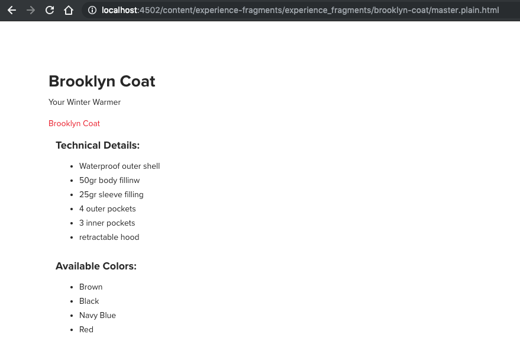

# Ervaar fragmenten {#experience-fragments}

## De basisbeginselen {#the-basics}

Een [ Fragment van de Ervaring ](/help/sites-authoring/experience-fragments.md) is een groep van één of meerdere componenten met inbegrip van inhoud en lay-out die binnen pagina&#39;s van verwijzingen kunnen worden voorzien.

Een Master- en/of varianttoepassing van het fragment van de ervaring:

* `sling:resourceType` : `/libs/cq/experience-fragments/components/xfpage`

Als er geen `/libs/cq/experience-fragments/components/xfpage/xfpage.html` is, wordt het toegepast op

* `sling:resourceSuperType` : `wcm/foundation/components/page`

## De onbewerkte HTML-vertoning {#the-plain-html-rendition}

Met de kiezer `.plain.` in de URL hebt u toegang tot de onbewerkte HTML-uitvoering.

Dit is beschikbaar in de browser, maar het primaire doel is om andere toepassingen (bijvoorbeeld webapps van derden, aangepaste mobiele implementaties) rechtstreeks toegang te geven tot de inhoud van het Experience Fragment door alleen de URL te gebruiken.

Met de normale HTML-uitvoering voegt u het protocol-, host- en contextpad toe aan paden die:

* van het type: `src`, `href` of `action`

* of eindigen met: `-src`, of `-href`

Bijvoorbeeld:

`.../brooklyn-coat/master.plain.html`

>[!NOTE]
>
>Koppelingen verwijzen altijd naar de publicatie-instantie. Ze worden door derden gebruikt, dus de koppeling wordt altijd aangeroepen vanuit de instantie Publiceren, niet vanuit de instantie Auteur.
>
>Voor verdere informatie zie [ het externaliseren URLs ](/help/sites-developing/externalizer.md).



De gewone vertoningsselecteur gebruikt een transformator in tegenstelling tot extra manuscripten; [ Verschuivende Rewriter ](https://sling.apache.org/documentation/bundles/output-rewriting-pipelines-org-apache-sling-rewriter.html) wordt gebruikt als transformator. Dit wordt gevormd bij

* `/libs/experience-fragments/config/rewriter/experiencefragments`

### De generatie van HTML-uitvoeringen configureren {#configuring-html-rendition-generation}

De HTML-uitvoering wordt gegenereerd met behulp van de Sling Rewriter Pipelines. De pijpleiding wordt bepaald bij `/libs/experience-fragments/config/rewriter/experiencefragments`. De HTML Transformer ondersteunt de volgende opties:

* `allowedCssClasses`
   * Een RegEx-expressie die overeenkomt met de CSS-klassen die in de uiteindelijke uitvoering moeten blijven staan.
   * Dit is handig als de klant bepaalde CSS-klassen wil verwijderen
* `allowedTags`
   * Een lijst met HTML-tags die zijn toegestaan in de uiteindelijke uitvoering.
   * Standaard zijn de volgende tags toegestaan (geen configuratie vereist): html, head, title, body, img, p, span, ul, li, a, b, i, em, strong, h1, h2, h3, h4, h5, h6, br, noscript, div, link en script

Het wordt geadviseerd om rewriter te vormen gebruikend een bekleding. Zie [ Bedekkingen ](/help/sites-developing/overlays.md)

## Sociale variaties {#social-variations}

Sociale varianten kunnen op sociale media (tekst en afbeelding) worden geplaatst. In Adobe Experience Manager (AEM) kunnen deze sociale varianten componenten bevatten, bijvoorbeeld tekstcomponenten en afbeeldingscomponenten.

De afbeelding en de tekst voor de sociale post kunnen van elk type afbeeldingsbron of tekstresource op elk diepteniveau (in de bouwsteen of de lay-outcontainer) worden genomen.

Sociale variaties maken bouwstenen ook mogelijk en houden er rekening mee bij het nemen van sociale maatregelen (op het gebied van de publicatieomgeving).

Om de correcte tekst en het beeld aan het sociale media netwerk te posten, moeten sommige overeenkomsten worden geëerbiedigd als u uw eigen aangepaste componenten ontwikkelt.

Hiervoor moeten de volgende eigenschappen worden gebruikt:

* Voor het extraheren van de afbeelding

   * `fileReference`
   * `fileName`

* Voor het uitnemen van de tekst

   * `text`

Componenten die geen gebruik maken van deze conventie worden niet in aanmerking genomen.

## Sjablonen voor ervaringsfragmenten {#templates-for-experience-fragments}

>[!CAUTION]
>
>***slechts*** [ editable malplaatjes ](/help/sites-developing/page-templates-editable.md) wordt gesteund voor de Fragmenten van de Ervaring.
>
>De Fragmenten van de ervaring kunnen slechts op pagina&#39;s worden gebruikt die op editable malplaatjes gebaseerd zijn.

Wanneer het ontwikkelen van een nieuw malplaatje voor de Fragmenten van de Ervaring, kunt u de standaardpraktijken voor een [ editable malplaatje ](/help/sites-developing/page-templates-editable.md) volgen.

Om een malplaatje van het ervaringsfragment tot stand te brengen dat door **wordt ontdekt creeer de tovenaar van het Fragment van de Ervaring**, moet u één van deze regelreeksen volgen:

1. Beide:

   1. Het middeltype van het malplaatje (de aanvankelijke knoop) moet erven van:
      `cq/experience-fragments/components/xfpage`

   1. De naam van de sjabloon moet beginnen met:
      `experience-fragments`
Hierdoor kunnen gebruikers ervaringsfragmenten maken in /content/experience-fragments, aangezien de eigenschap `cq:allowedTemplates` van deze map alle sjablonen bevat die een naam hebben die begint met `experience-fragment` . Klanten kunnen deze eigenschap bijwerken en hun eigen naamgevingsschema of sjabloonlocaties opnemen.

1. [ Toegestane malplaatjes ](/help/sites-authoring/experience-fragments.md#configure-allowed-templates-folder) kunnen in de console van de Fragmenten van de Ervaring worden gevormd.
<!--
1. Add the template details manually in `cq:allowedTemplates` on the `/content/experience-fragment` node.
-->

<!--
>[!NOTE]
>
>[Allowed templates](/help/sites-authoring/experience-fragments.md#configuring-allowed-templates) can be configured in the Experience Fragments console.
-->

## Componenten voor ervaringsfragmenten {#components-for-experience-fragments}

[ ontwikkelend componenten ](/help/sites-developing/components.md) voor gebruik met/in de Fragmenten van de Ervaring volgen standaardpraktijken.

De enige extra configuratie moet ervoor zorgen dat de componenten [ op het malplaatje worden toegestaan, wordt dit bereikt met het Beleid van de Inhoud ](/help/sites-developing/page-templates-editable.md#content-policies).

## De Experience Fragment Link Rewriter Provider - HTML {#the-experience-fragment-link-rewriter-provider-html}

In AEM hebt u de mogelijkheid om Experience Fragments te maken. Een ervaringsfragment:

* bestaat uit een groep componenten samen met een lay-out;
* kan bestaan onafhankelijk van een AEM-pagina.

Een van de gebruiksgevallen voor dergelijke groepen is het insluiten van inhoud in aanraakpunten van derden, zoals Adobe Target.

### Standaardkoppeling herschrijven {#default-link-rewriting}

Gebruikend de [ Uitvoer aan de eigenschap van het Doel ](/help/sites-administering/experience-fragments-target.md), kunt u:

* een fragment van de Ervaring tot stand brengen,
* er componenten aan toevoegen,
* en exporteer het als een Adobe Target-aanbieding in HTML-indeling of in JSON-indeling.

Deze eigenschap kan [ op een auteursinstantie van AEM ](/help/sites-administering/experience-fragments-target.md#Prerequisites) worden toegelaten. Het vereist een geldige Configuratie van Adobe Target, en configuraties voor de Verbinding Externalzer.

De functie Extern koppelen wordt gebruikt om te bepalen welke URL&#39;s correct zijn wanneer de HTML-versie van het doelaanbod wordt gemaakt. Deze versie wordt vervolgens naar Adobe Target verzonden. Dit is nodig omdat Adobe Target vereist dat alle koppelingen binnen de Target HTML-aanbieding openbaar toegankelijk zijn. Dit betekent dat alle bronnen waarnaar de koppelingen verwijzen, en het Experience Fragment zelf, moeten worden gepubliceerd voordat ze kunnen worden gebruikt.

Wanneer u een HTML-doelaanbieding samenstelt, wordt standaard een aanvraag verzonden naar een aangepaste Sling-kiezer in AEM. Deze kiezer wordt `.nocloudconfigs.html` genoemd. Zoals de naam al aangeeft, wordt een eenvoudige HTML-rendering van een Experience-fragment gemaakt, maar worden cloudconfiguraties niet opgenomen (wat overbodige informatie zou zijn).

Nadat u de HTML-pagina hebt gegenereerd, wijzigt de Sling Rewriter-pijplijn de uitvoer:

1. De elementen `html` , `head` en `body` worden vervangen door `div` -elementen. De elementen `meta` , `noscript` en `title` worden verwijderd (het zijn onderliggende elementen van het oorspronkelijke `head` -element en er wordt geen rekening mee gehouden wanneer dit wordt vervangen door het `div` -element).

   Dit wordt gedaan om ervoor te zorgen dat de HTML Target Offer kan worden opgenomen in Doelactiviteiten.

1. AEM wijzigt alle interne koppelingen in de HTML, zodat deze verwijzen naar een gepubliceerde bron.

   AEM volgt dit patroon voor kenmerken van HTML-elementen om te bepalen welke koppelingen moeten worden gewijzigd:

   1. `src` kenmerken
   1. `href` kenmerken
   1. `*-src` -kenmerken (zoals data-src, custom-src, enzovoort)
   1. `*-href` -kenmerken (zoals `data-href` , `custom-href` , `img-href` , enzovoort)

   >[!NOTE]
   >
   >De interne koppelingen in de HTML zijn meestal relatieve koppelingen, maar er kunnen zich gevallen voordoen waarin aangepaste componenten volledige URL&#39;s verschaffen in de HTML. AEM negeert deze volledig ontwikkelde URL&#39;s standaard en brengt geen wijzigingen aan.

   De koppelingen in deze kenmerken worden uitgevoerd via de AEM Link Externalzer `publishLink()` om de URL opnieuw te maken alsof deze zich op een gepubliceerde instantie bevindt en als zodanig openbaar te maken.

Als u een implementatie buiten de doos gebruikt, moet het hierboven beschreven proces voldoende zijn om het doelaanbod te genereren op basis van het ervaringsfragment en het vervolgens te exporteren naar Adobe Target. Er zijn echter enkele gebruiksgevallen die in dit proces niet in aanmerking worden genomen, zoals:

* Sling Mapping beschikbaar op alleen de publicatie-instantie
* Dispatcher omleiding

Voor deze gebruiksgevallen biedt AEM de Link Rewriter Provider Interface.

### Interface Rewriter-provider koppelen {#link-rewriter-provider-interface}

>[!NOTE]
>
>Deze interface werd geïntroduceerd in [ AEM 6.5 SP1 (6.5.1.0) ](/help/release-notes/previous/6-5-1.md).

Voor meer gecompliceerde gevallen, die niet door het [ gebrek ](#default-link-rewriting) worden behandeld, biedt AEM de Interface van de Leverancier van de Verbinding Rewriter aan. Dit is een `ConsumerType` -interface die u als service in uw bundels kunt implementeren. Het omzeilt de wijzigingen die AEM uitvoert op interne koppelingen van een HTML-aanbieding, zoals deze worden weergegeven op basis van een Experience Fragment. Met deze interface kunt u het herschrijven van interne HTML-koppelingen aanpassen aan uw bedrijfsbehoeften.

Voorbeelden van gebruiksgevallen om deze interface als dienst uit te voeren omvatten:

* Sling Mappings worden ingeschakeld op de publicatie-instanties, maar niet op de auteurinstantie
* Een verzender of vergelijkbare technologie wordt gebruikt om URL&#39;s intern om te leiden
* Er zijn `sling:alias mechanisms` aanwezig voor bronnen

>[!NOTE]
>
>Deze interface verwerkt alleen de interne HTML-koppelingen van het gegenereerde doelaanbod.

De Link Rewriter Provider Interface ( `ExperienceFragmentLinkRewriterProvider`) ziet er als volgt uit:

```java
public interface ExperienceFragmentLinkRewriterProvider {

    String rewriteLink(String link, String tag, String attribute);

    boolean shouldRewrite(ExperienceFragmentVariation experienceFragment);

    int getPriority();

}
```

### Hoe te om de Interface van de Leverancier van de Verbinding te gebruiken Rewriter {#how-to-use-the-link-rewriter-provider-interface}

Om de interface te gebruiken, moet u eerst een bundel tot stand brengen die een nieuwe de dienstcomponent bevat die de interface van de Leverancier van Rewriter van de Verbinding uitvoert.

Deze service wordt gebruikt om in het dialoogvenster Exporteren van fragment uit ervaring naar doel te plaatsen voor toegang tot de verschillende koppelingen.

Bijvoorbeeld `ComponentService` :

```java
import com.adobe.cq.xf.ExperienceFragmentLinkRewriterProvider;
import com.adobe.cq.xf.ExperienceFragmentVariation;
import org.osgi.service.component.annotations.Service;
import org.osgi.service.component.annotations.Component;

@Component
@Service
public class GeneralLinkRewriter implements ExperienceFragmentLinkRewriterProvider {

    @Override
    public String rewriteLink(String link, String tag, String attribute) {
        return null;
    }

    @Override
    public boolean shouldRewrite(ExperienceFragmentVariation experienceFragment) {
        return false;
    }

    @Override
    public int getPriority() {
        return 0;
    }

}
```

Voor de dienst aan het werk, zijn er nu drie methodes die binnen de dienst moeten worden uitgevoerd:

* ` [shouldRewrite](#shouldrewrite)`
* ` [rewriteLink](#rewritelink)`

   * `rewriteLinkExample2`

* ` [getPriority](#priorities-getpriority)`

#### shouldRewrite {#shouldrewrite}

U moet aan het systeem erop wijzen of het de verbindingen moet herschrijven wanneer een vraag voor de Uitvoer aan Doel op een bepaalde wijziging van het Fragment van de Ervaring wordt gemaakt. U doet dit door de methode uit te voeren:

`shouldRewrite(ExperienceFragmentVariation experienceFragment);`

Bijvoorbeeld:

```java
@Override
public boolean shouldRewrite(ExperienceFragmentVariation experienceFragment) {
    return experienceFragment.getPath().equals("/content/experience-fragment/master");
}
```

Deze methode ontvangt, als parameter, de Variatie van het Fragment van de Ervaring die de Uitvoer naar systeem van het Doel momenteel herschrijft.

In het bovenstaande voorbeeld willen we het volgende herschrijven:

* koppelingen aanwezig in `src`

* `href` alleen kenmerken

* voor een specifiek ervaringsfragment:
  `/content/experience-fragment/master`

Eventuele andere Erviteitsfragmenten die door het systeem Exporteren naar doel worden doorgegeven, worden genegeerd en niet beïnvloed door wijzigingen die in deze service worden geïmplementeerd.

#### rewriteLink {#rewritelink}

Voor de wijziging van het Fragment van de Ervaring die door het herschrijven proces wordt beïnvloed, zal het dan te werk gaan om de de diensthandvat de verbinding te laten herschrijven. Telkens wanneer een koppeling wordt aangetroffen in de interne HTML, wordt de volgende methode aangeroepen:

`rewriteLink(String link, String tag, String attribute)`

De methode ontvangt de parameters als invoer:

* `link`
De `String` -representatie van de koppeling die wordt verwerkt. Dit is meestal een relatieve URL die naar de bron op de auteurinstantie verwijst.

* `tag`
De naam van het HTML-element dat wordt verwerkt.

* `attribute`
De exacte kenmerknaam.

Als het systeem Exporteren naar doel dit element bijvoorbeeld verwerkt, kunt u `CSSInclude` als volgt definiëren:

```java
<link rel="stylesheet" href="/etc.clientlibs/foundation/clientlibs/main.css" type="text/css">
```

De aanroep van de methode `rewriteLink()` wordt uitgevoerd met de volgende parameters:

```java
rewriteLink(link="/etc.clientlibs/foundation/clientlibs/main.css", tag="link", attribute="href" )
```

Wanneer u de dienst creeert, kunt u besluiten nemen die op de bepaalde input worden gebaseerd, en dan de verbinding dienovereenkomstig herschrijven.

Wij willen bijvoorbeeld het `/etc.clientlibs` -gedeelte van de URL verwijderen en het juiste externe domein toevoegen. Om de zaken eenvoudig te houden, zullen wij van mening zijn dat wij toegang tot een Resolver van het Middel voor uw dienst, zoals in `rewriteLinkExample2` hebben:

>[!NOTE]
>
>Voor meer informatie over hoe te om een middeloplosser door een de dienstgebruiker te krijgen zie [ Gebruikers van de Dienst in AEM ](/help/sites-administering/security-service-users.md).

```java
private ResourceResolver resolver;

private Externalizer externalizer;

@Override
public String rewriteLink(String link, String tag, String attribute) {

    // get the externalizer service
    externalizer = resolver.adaptTo(Externalizer.class);
    if(externalizer == null) {
        // if there was an error, then we do not modify the link
        return null;
    }

    // remove leading /etc.clientlibs from resource link before externalizing
    link = link.replaceAll("/etc.clientlibs", "");

    // considering that we configured our publish domain, we directly apply the publishLink() method
    link = externalizer.publishLink(resolver, link);

    return link;
}
```

>[!NOTE]
>
>Als de bovenstaande methode `null` retourneert, laat het systeem Exporteren naar doel de koppeling zoals deze is, een relatieve koppeling naar een bron.

#### Prioriteiten - getPriority {#priorities-getpriority}

Het is niet ongebruikelijk om verscheidene diensten te nodig om voor verschillende soorten Fragments van de Ervaring te behandelen, of zelfs om een Generische Dienst te hebben die het externaliseren en in kaart brengen voor alle Fragments van de Ervaring behandelt. In deze gevallen, conflicten over welke de dienst aan gebruik zou kunnen zich voordoen, zodat verstrekt AEM de mogelijkheid om **Prioriteiten** voor de verschillende diensten te bepalen. De prioriteiten worden bepaald volgens de methode:

* `getPriority()`

Met deze methode kunt u verschillende services gebruiken waarbij de methode `shouldRewrite()` true retourneert voor hetzelfde ervaringsfragment. De dienst die het hoogste aantal van zijn `getPriority()` methode terugkeert is de dienst die de Variatie van het Fragment van de Ervaring behandelt.

Als voorbeeld kunt u een `GenericLinkRewriterProvider` hebben die de basistoewijzing voor alle fragmenten van de Ervaring behandelt en wanneer de `shouldRewrite()` methode `true` voor alle Variaties van het Fragment van de Ervaring terugkeert. Voor verschillende specifieke ervaringsfragmenten wilt u wellicht speciale afhandeling. In dit geval kunt u dus een `SpecificLinkRewriterProvider` opgeven waarvoor de methode `shouldRewrite()` alleen waar retourneert voor bepaalde Ervings-fragmentvariaties. Om ervoor te zorgen dat `SpecificLinkRewriterProvider` wordt gekozen voor het verwerken van deze Experience Fragment-variaties, moet het in de `getPriority()` -methode een hoger getal retourneren dan `GenericLinkRewriterProvider.`
