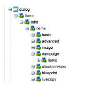

# Aangepaste AEM paginasjabloon maken met Adobe Campaign-formuliercomponenten{#creating-custom-aem-page-template-with-adobe-campaign-form-components}

Deze pagina legt uit hoe u een aangepaste paginasjabloon kunt maken dat [Adobe Campaign-formulier](/help/sites-authoring/adobe-campaign-components.md) componenten door te onderzoeken hoe de Geometrixx-outdoortemplate ( `/apps/geometrixx-outdoors/components/page_campaign_profile`) is geïmplementeerd en verwijst naar belangrijke informatie die u nodig hebt bij het maken van uw eigen aangepaste sjabloon.

>[!NOTE]
>
>[E-mail- en formuliervoorbeelden zijn alleen beschikbaar in Geometrixx](/help/sites-developing/we-retail.md). Download voorbeeldinhoud van het Geometrixx van het Pakket Delen.

Als u een aangepaste AEM paginasjabloon wilt maken met Adobe Campaign-formuliercomponenten, moet u het volgende doen:

1. **Correcte resourceSuperType**

   Zorg ervoor dat de pagina-component overerft van `mcm/campaign/components/profile`.

   Dit is vereist voor de servlets om informatie te verkrijgen en op te slaan

   * `com.day.cq.mcm.campaign.servlets.TemplateListServlet`
   * `com.day.cq.mcm.campaign.servlets.SaveProfileServlet`

   

1. **Instellingen ClientContext**

   Wanneer u de montages van de clientcontext ( `/etc/designs/geometrixx-outdoors/jcr:content/page_campaign_profile`) u ziet de volgende instellingen:

   * ClientContext wijst naar `/etc/clientcontext/campaign`
   * Er is ook een extra *config* knooppunt.

   

1. **head.jsp (/apps/geometrixx-outdoors/components/page_campaign_profile/head.jsp)**

   In **head.jsp** worden de volgende regels weergegeven die de **clientcontext-config** en de **cloudservice-haak**:

   ```
   <cq:include path="config" resourceType="cq/personalization/components/clientcontext_optimized/config"/>
   <sling:include path="contexthub" resourceType="granite/contexthub/components/contexthub"/>
   <cq:include script="/libs/cq/cloudserviceconfigs/components/servicelibs/servicelibs.jsp"/>
   ```

1. **body.jsp (/apps/geometrixx-outdoors/components/page_campaign_profile/body.jsp)**

   In **body.jsp** De cloudservices worden onder aan de pagina geladen:

   ```
   <cq:include path="cloudservices" resourceType="cq/cloudserviceconfigs/components/servicecomponents"/>
   ```

1. **Campagnepagina-eigenschappen**

   Als u een Adobe Campaign-sjabloon wilt selecteren, worden de pagina-eigenschappen uitgebreid met de **Campagne** tab:

   `/apps/geometrixx-outdoors/components/page_campaign_profile/dialog/items/tabs/items/campaign`

   

1. **Sjablooninstellingen**.

   In de template ( `/apps/geometrixx-outdoors/templates/campaign_profile/jcr:content`) u ziet de volgende standaardwaarden:

   | **acMapping** | mapRecipient (voor Adobe Campaign 6.1), profiel (voor Adobe Campaign Standard) |
   |---|---|
   | **acTemplateId** | post |

   
