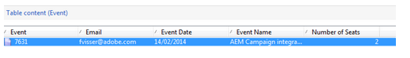

# Aangepaste formuliertoewijzingen maken{#creating-custom-form-mappings}

Wanneer u een aangepaste tabel maakt in Adobe Campaign, kunt u beter een formulier maken in AEM dat aan die aangepaste tabel wordt toegewezen.

In dit document wordt beschreven hoe u aangepaste formuliertoewijzingen kunt maken. Wanneer u de stappen in dit document voltooit, biedt u uw gebruikers een gebeurtenispagina waarop zij zich kunnen aanmelden voor een aanstaande gebeurtenis. Vervolgens volgt u deze gebruikers via Adobe Campaign.

## Vereisten {#prerequisites}

U moet het volgende installeren:

* Adobe Experience Manager
* Adobe Campaign Classic

Zie [ Integrerend AEM met Adobe Campaign Classic ](/help/sites-administering/campaignonpremise.md) voor meer informatie.

## Aangepaste formuliertoewijzingen maken {#creating-custom-form-mappings-2}

Als u aangepaste formuliertoewijzingen wilt maken, moet u de volgende stappen op hoog niveau uitvoeren. Deze worden in de volgende secties uitgebreid beschreven:

1. Een aangepaste tabel maken.
1. Breid de **zaadlijst** uit.
1. Een aangepaste toewijzing maken.
1. Maak een levering op basis van de aangepaste toewijzing.
1. Het formulier samenstellen in AEM, waarbij de gemaakte levering wordt gebruikt.
1. Verzend het formulier om het te testen.

### Aangepaste tabel maken in Adobe Campaign {#creating-the-custom-table-in-adobe-campaign}

Begin door een douanetabel in Adobe Campaign te creëren. In dit voorbeeld gebruiken we de volgende definitie om een gebeurtenistabel te maken:

```xml
<element autopk="true" label="Event" labelSingular="Event" name="event">
 <attribute label="Event Date" name="eventdate" type="date"/>
 <attribute label="Event Name" name="eventname" type="string"/>
 <attribute label="Email" name="email" type="string"/>
 <attribute label="Number of Seats" name="seats" type="long"/>
</element>
```

Nadat u de gebeurtenislijst creeert, stel de **tovenaar van de het gegevensbestandstructuur van de Update** in werking om de lijst tot stand te brengen.

### De zaadtabel uitbreiden {#extending-the-seed-table}

In Adobe Campaign, voegt de uitgezochte **&#x200B;**&#x200B;toe om een uitbreiding van **te creëren zaadadressen (nms)** lijst.


Nu, gebruik de gebieden van de **gebeurtenis** lijst om de **zaadlijst** uit te breiden:

```xml
<element label="Event" name="custom_cus_event">
 <attribute name="eventname" template="cus:event:event/@eventname"/>
 <attribute name="eventdate" template="cus:event:event/@eventdate"/>
 <attribute name="email" template="cus:event:event/@email"/>
 <attribute name="seats" template="cus:event:event/@seats"/>
 </element>
```

Na dit, stel **de gegevensbestandtovenaar van de Update** in werking om de veranderingen toe te passen.

### Aangepaste doeltoewijzing maken {#creating-custom-target-mapping}

In **Beheer van het Beleid/van de Campagne** niet, ga **Toewijzingen van het Doel** en voeg een nieuwe t **doelafbeelding toe.**

>[!NOTE]
>
>Zorg ervoor u een betekenisvolle naam voor **Interne naam** gebruikt.


### Een aangepaste leveringssjabloon maken {#creating-a-custom-delivery-template}

In deze stap, voegt u een leveringsmalplaatje toe dat de gecreeerde **afbeelding van het Doel** gebruikt.

In **Middelen/Malplaatjes**, navigeer aan het Malplaatje van de Levering en dupliceer de bestaande AEM levering. Wanneer u **aan** klikt, selecteer creeer gebeurtenis **afbeelding van het Doel**.


### Het formulier samenstellen in AEM {#building-the-form-in-aem}

In AEM, zorg ervoor u een Cloud Service in **Eigenschappen van de Pagina** hebt gevormd.

Dan, in het **Adobe Campaign** lusje, selecteer de levering die in [ werd gecreeerd Creërend een Malplaatje van de Levering van de Douane ](#creating-a-custom-delivery-template).


Wanneer u de velden configureert, moet u unieke elementnamen opgeven voor de formuliervelden.

Nadat de gebieden worden gevormd, moet u de afbeelding manueel veranderen.

In CRXDE-lijst, ga **jcr:content** (van de pagina) knoop en verander de **acMapping** waarde aan de interne naam van de **afbeelding van het Doel**.


Controleer in de configuratie van het formulier of u het selectievakje inschakelt om te maken dat het formulier niet bestaat


### Het formulier verzenden {#submitting-the-form}

U kunt nu het formulier verzenden en op de Adobe Campaign valideren of de waarden zijn opgeslagen.



## Problemen oplossen {#troubleshooting}

**&quot;Ongeldig type voor waarde &quot;02/02/2015&quot;van element &quot;@eventdate&quot;(document van type &quot;Gebeurtenis ([ adb:event ])&quot;)**

Wanneer het voorleggen van de vorm, wordt deze fout het programma geopend **error.log** in AEM.

Dit wordt veroorzaakt door een ongeldige indeling voor het datumveld. De oplossing moet **jjjj-mm-dd** als waarde leveren.
