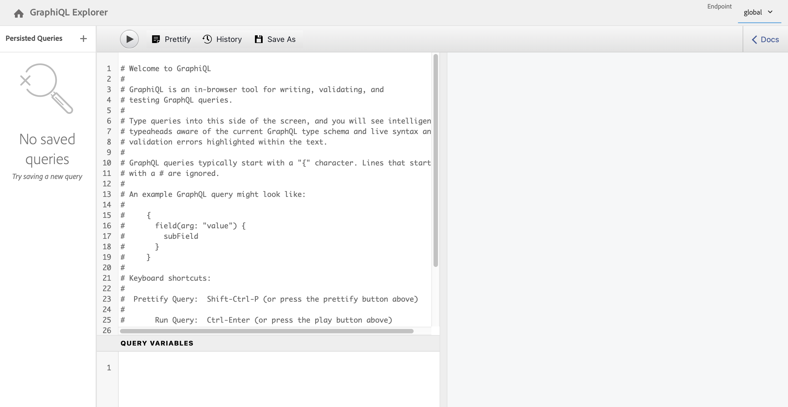

# Toegang tot en levering van contentfragmenten zonder kop Handleiding voor snel starten {#accessing-delivering-content-fragments}

Leer hoe u AEM Assets REST API kunt gebruiken voor het beheer van inhoudsfragmenten en de GraphQL API voor de levering van inhoud zonder kop.

## Wat zijn GraphQL en Assets REST API&#39;s? {#what-are-the-apis}

[Nu u enkele inhoudsfragmenten hebt gemaakt,](create-content-fragment.md) u kunt AEM API&#39;s gebruiken om ze zonder koppen te leveren.

* [De GraphQL API](/help/sites-developing/headless/graphql-api/graphql-api-content-fragments.md) Hiermee kunt u aanvragen maken voor toegang tot en levering van inhoudsfragmenten.
   * Om dit te gebruiken, [eindpunten moeten worden gedefinieerd en ingeschakeld in AEM](/help/sites-developing/headless/graphql-api/graphql-endpoint.md#enabling-graphql-endpoint)en, indien nodig, de [GraphiQL-interface geïnstalleerd](/help/sites-developing/headless/graphql-api/graphql-api-content-fragments.md#installing-graphiql-interface).
* [De REST-API voor middelen](/help/assets/assets-api-content-fragments.md) Hiermee kunt u inhoudsfragmenten (en andere elementen) maken en wijzigen.

De rest van deze handleiding is gericht op GraphQL-toegang en levering van inhoudsfragmenten.

## Een inhoudsfragment afleveren met GraphQL {#how-to-deliver-a-content-fragment}

De architecten van de informatie moeten vragen voor hun kanaaleindpunten ontwerpen om inhoud te leveren. Denk slechts eens na deze vragen per eindpunt, per model. Voor deze gids Aan de slag kunt u slechts één gids maken.

1. Meld u aan bij AEM en open de [GraphiQL-interface](/help/sites-developing/headless/graphql-api/graphiql-ide.md):
   * Bijvoorbeeld: `http://<host>:<port>/aem/graphiql.html`.

1. GraphiQL is een in-browser vraagredacteur voor GraphQL. U kunt het gebruiken om vragen te bouwen om de Fragmenten van de Inhoud terug te winnen om hen onophoudelijk als JSON te leveren.
   * In het linkerdeelvenster kunt u een query maken.
   * De resultaten worden weergegeven in het rechterdeelvenster.
   * De vraagredacteur kenmerkt codevoltooiing en hotkeys om de vraag gemakkelijk uit te voeren.
     

1. Ervan uitgaande dat het model dat u hebt gemaakt, werd aangeroepen `person` met velden `firstName`, `lastName`, en `position`kunt u een eenvoudige query maken om de inhoud van het inhoudsfragment op te halen.

   ```text
   query 
   {
     personList {
       items {
         _path
         firstName
         lastName
         position
       }
     }
   }
   ```

1. Voer de query in het linkerdeelvenster in.
<!--
   
-->

1. Klik op de knop **Query uitvoeren** (pijl-rechts) of gebruik de `Ctrl-Enter` en de resultaten worden als JSON weergegeven in het rechterdeelvenster.
   

1. Klik:
   * **Docs** rechtsboven op de pagina om in-context documentatie te tonen om u te helpen uw vragen bouwen die aan uw eigen modellen aanpassen.
   * **Historie** in de bovenste werkbalk om vorige query&#39;s weer te geven.
   * **Opslaan als** en **Opslaan** om uw vragen te bewaren, waarna u hen van kunt een lijst maken en terugwinnen **Blijvende query&#39;s** en **Publiceren**.
     

GraphQL laat gestructureerde vragen toe die niet alleen specifieke gegevensreeksen of individuele gegevensvoorwerpen kunnen richten, maar ook specifieke elementen van de voorwerpen, genestelde resultaten, biedt steun voor vraagvariabelen, en veel meer kunnen leveren.

GraphQL kan herhalende API-aanvragen en overlevering voorkomen. In plaats daarvan is het mogelijk om in grote hoeveelheden te leveren wat precies nodig is voor rendering als reactie op één API-query. De resulterende JSON kan worden gebruikt om gegevens te leveren aan andere sites of apps.

## Volgende stappen {#next-steps}

Dat is het! U hebt nu een basiskennis van beheer van inhoud zonder kop in AEM. Er zijn veel meer bronnen waar u dieper kunt duiken voor een volledig begrip van de beschikbare functies.

* **[Configuratiebrowser](create-configuration.md)** - Voor meer informatie over de AEM Configuration Browser
* **[Inhoudsfragmenten](/help/assets/content-fragments/content-fragments.md)** - Voor meer informatie over het maken en beheren van inhoudsfragmenten
* **[GraphiQL IDE](/help/sites-developing/headless/graphql-api/graphiql-ide.md)** voor meer details over het gebruik van de GraphiQL IDE
* **[Blijvende query&#39;s](/help/sites-developing/headless/graphql-api/persisted-queries.md)** voor meer details over Persisted Queries
* **[Ondersteuning voor inhoudsfragmenten in AEM Assets HTTP API](/help/assets/assets-api-content-fragments.md)** - Voor meer informatie over het rechtstreeks benaderen van AEM inhoud via de HTTP-API, via CRUD-bewerkingen (Maken, Lezen, Bijwerken, Verwijderen)
* **[GRAPHQL API](/help/sites-developing/headless/graphql-api/graphql-api-content-fragments.md)** - Voor meer informatie over hoe u inhoudsfragmenten zonder problemen kunt leveren
