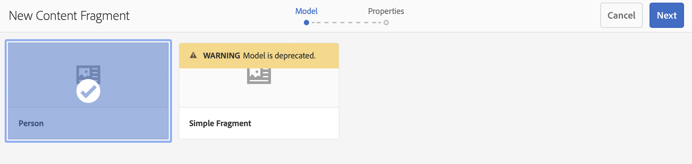

# Inhoudsfragmenten zonder kop Handleiding voor snel starten maken {#creating-content-fragments}

Leer hoe u AEM inhoudsfragmenten kunt gebruiken voor het ontwerpen, maken, beheren en gebruiken van pagina-onafhankelijke inhoud voor levering zonder kop.

## Wat zijn inhoudsfragmenten? {#what-are-content-fragments}

[Nu hebt u een map met middelen gemaakt](create-assets-folder.md) waar u de inhoudsfragmenten kunt opslaan, kunt u nu de fragmenten maken!

Met inhoudsfragmenten kunt u pagina-onafhankelijke inhoud ontwerpen, maken, beheren en publiceren. Hiermee kunt u inhoud voorbereiden en deze op meerdere locaties en via meerdere kanalen gebruiken.

Inhoudsfragmenten bevatten gestructureerde inhoud en kunnen in JSON-indeling worden geleverd.

## Een inhoudsfragment maken {#how-to-create-a-content-fragment}

Inhoudsauteurs maken een willekeurig aantal Inhoudsfragmenten om de inhoud weer te geven die zij maken. Dit zal hun belangrijkste taak in AEM zijn. Met het oog op deze gids voor het op gang brengen van de werkzaamheden zullen we slechts één gids hoeven te maken.

1. Meld u aan bij AEM en selecteer in het hoofdmenu **Navigation > Middelen**.
1. Ga naar de [eerder gemaakte map.](create-assets-folder.md)
1. Klikken **Maken > Inhoudsfragment**.
1. Het maken van een inhoudsfragment wordt in twee stappen weergegeven als een wizard. Selecteer eerst het model dat u wilt gebruiken om het inhoudsfragment te maken en klik op **Volgende**.
   * Welke modellen beschikbaar zijn, is afhankelijk van [**Cloud Configuration** u hebt gedefinieerd voor de map assets](create-assets-folder.md) waarin u het inhoudsfragment maakt.
   * Als u het bericht ontvangt `We could not find any models`, controleert u de configuratie van de map met elementen.

   
1. Geef een **Titel**, **Beschrijving**, en **Tags** indien nodig en klik op **Maken**.

   
1. Klikken **Openen** in het bevestigingsvenster.

   
1. Geef de details van het inhoudsfragment op in de Inhoudsfragmenteditor.

   
1. Klikken **Opslaan** of  **Opslaan en sluiten**.

Inhoudsfragmenten kunnen verwijzen naar andere inhoudsfragmenten, waarbij zo nodig een geneste inhoudsstructuur mogelijk is.

Inhoudsfragmenten kunnen ook verwijzen naar andere elementen in AEM. [Deze elementen moeten in AEM worden opgeslagen](/help/assets/manage-assets.md) voordat u een verwijzing naar een inhoudsfragment maakt.

## Volgende stappen {#next-steps}

Nu u een inhoudsfragment hebt gemaakt, kunt u verdergaan naar het laatste gedeelte van de gids Aan de slag en [Maak API-aanvragen voor toegang tot en levering van inhoudsfragmenten.](create-api-request.md)

>[!TIP]
>
>Voor volledige details over het beheren van Inhoudsfragmenten raadpleegt u de [Documentatie over inhoudsfragmenten](/help/assets/content-fragments/content-fragments.md)
