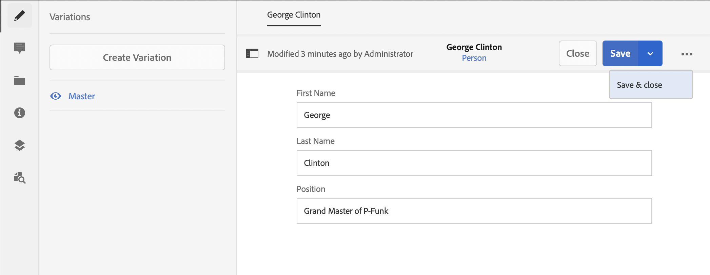

# Inhoudsfragmenten zonder kop Handleiding voor snel starten maken {#creating-content-fragments}

Leer hoe u AEM inhoudsfragmenten kunt gebruiken voor het ontwerpen, maken, beheren en gebruiken van pagina-onafhankelijke inhoud voor levering zonder kop.

## Wat zijn inhoudsfragmenten? {#what-are-content-fragments}

[&#x200B; nu dat u een activa omslag &#x200B;](create-assets-folder.md) hebt gecreeerd waar u uw Fragmenten van de Inhoud kunt opslaan, kunt u de fragmenten nu tot stand brengen!

Met inhoudsfragmenten kunt u pagina-onafhankelijke inhoud ontwerpen, maken, beheren en publiceren. Hiermee kunt u inhoud voorbereiden en deze op meerdere locaties en via meerdere kanalen gebruiken.

Inhoudsfragmenten bevatten gestructureerde inhoud en kunnen in JSON-indeling worden geleverd.

## Een inhoudsfragment maken {#how-to-create-a-content-fragment}

Inhoudsauteurs maken een willekeurig aantal Inhoudsfragmenten om de inhoud weer te geven die zij maken. Dit zal hun belangrijkste taak in AEM zijn. Met het oog op deze gids voor het op gang brengen van de werkzaamheden zullen we slechts één gids hoeven te maken.

1. Logboek in AEM en van het belangrijkste menu selecteert **Navigatie > Assets**.
1. Navigeer aan de [&#x200B; omslag u eerder creeerde.](create-assets-folder.md)
1. Klik **creëren > het Fragment van de Inhoud**.
1. Het maken van een inhoudsfragment wordt in twee stappen weergegeven als een wizard. Selecteer eerst welk model u wenst om uw inhoudsfragment tot stand te brengen en **daarna** te klikken.
   * De beschikbare modellen hangen van de [**Configuratie van de Wolk** af u voor de activa omslag &#x200B;](create-assets-folder.md) bepaalde waarin u het Fragment van de Inhoud creeert.
   * Als u het bericht `We could not find any models` ontvangt, controleert u de configuratie van de map Assets.

   
1. Verstrek a **Titel**, **Beschrijving**, en **Markeringen** zonodig en klik **creeer**.

   
1. Klik **Open** in het bevestigingsvenster.

   
1. Geef de details van het inhoudsfragment op in de Inhoudsfragmenteditor.

   
1. Klik **sparen** of **sparen en sluit**.

Inhoudsfragmenten kunnen verwijzen naar andere inhoudsfragmenten, waarbij zo nodig een geneste inhoudsstructuur mogelijk is.

Inhoudsfragmenten kunnen ook verwijzen naar andere elementen in AEM. [&#x200B; Deze activa moeten in AEM &#x200B;](/help/assets/manage-assets.md) worden opgeslagen alvorens een het van verwijzingen voorzien Fragment van de Inhoud te creëren.

## Volgende stappen {#next-steps}

Nu u een Fragment van de Inhoud hebt gecreeerd, kunt u zich op het definitieve deel van het begonnen worden gids bewegen en [&#x200B; creeer API verzoeken om tot inhoudsfragmenten toegang te hebben en te leveren.](create-api-request.md)

>[!TIP]
>
>Voor volledige details over het beheren van de Fragmenten van de Inhoud, zie de [&#x200B; documentatie van de Fragmenten van de Inhoud &#x200B;](/help/assets/content-fragments/content-fragments.md)
