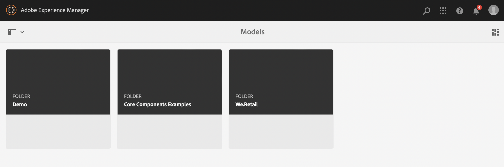

# Modellen voor inhoudsfragmenten maken, headless Quick Start Guide {#creating-content-fragment-models}

Definieer de structuur van de inhoud die u maakt en gebruikt met behulp van de mogelijkheden zonder kop in Adobe Experience Manager (AEM), met behulp van Content Fragment Models.

## Wat zijn modellen van inhoudsfragmenten? {#what-are-content-fragment-models}

[&#x200B; nu dat u een configuratie hebt gecreeerd, &#x200B;](create-configuration.md) kunt u het gebruiken om de Modellen van het Fragment van de Inhoud tot stand te brengen.

Met Content Fragment Models wordt de structuur gedefinieerd van de gegevens en inhoud die u maakt en beheert in AEM. Ze dienen als een soort basisstructuur voor je inhoud. Wanneer u ervoor kiest inhoud te maken, selecteren de auteurs een van de door u gedefinieerde modellen van inhoudsfragmenten die u als hulplijnen bij het maken van inhoud gebruikt.

## Een model voor een inhoudsfragment maken {#how-to-create-a-content-fragment-model}

Een informatiearchitect zou deze taken slechts sporadisch uitvoeren aangezien de nieuwe modellen worden vereist. Voor deze gids Aan de slag, creeert u slechts één model.

1. Logboek in AEM en van het belangrijkste menu selecteert **Hulpmiddelen > Assets > de Modellen van het Fragment van de Inhoud**.
1. Klik op de map die u hebt gemaakt door uw configuratie te maken.

   
1. Klik **creëren**.
1. Verstrek a **ModelTitel**, **Markeringen**, en **Beschrijving**. U kunt ook selecteren/deselecteren **laat model** toe om te controleren of het model onmiddellijk op verwezenlijking wordt toegelaten.

   
1. In het bevestigingsvenster, klik **Open** om uw model te vormen.

   
1. Gebruikend de **ModelRedacteur van het Fragment van de Inhoud**, bouwt uw Model van het Fragment van de Inhoud door gebieden van de **3&rbrace; kolom van de Types van Gegevens te slepen en te laten vallen.**

   

1. Nadat u een veld hebt geplaatst, moet u de eigenschappen ervan configureren. De redacteur schakelt automatisch aan het **lusje van Eigenschappen** voor het toegevoegde gebied waar u de verplichte gebieden kunt verstrekken.

   
1. Wanneer u wordt gebeëindigd bouwend uw model, klik **sparen**.

1. De wijze van het pas gecreëerde model hangt van af of u **Model** selecteerde toen het creëren van het model:
   * geselecteerd - het nieuwe model is reeds **Toegelaten**
   * niet geselecteerd - het nieuwe model wordt gecreeerd op **1&rbrace; wijze van het Ontwerp &lbrace;**

1. Als niet reeds toegelaten, moet het model **&#x200B;**&#x200B;worden toegelaten om het te gebruiken.
   1. Selecteer het model dat u creeerde, en klik dan **toelaten**.

      
   1. Bevestig toelatend het model door te tikken of **te klikken laat** in de bevestigingsdialoog toe.

      
1. Het model is nu ingeschakeld en klaar voor gebruik.

   

De **ModelRedacteur van het Fragment van de Inhoud** steunt vele verschillende gegevenstypes zoals eenvoudige tekstgebieden, activaverwijzingen, verwijzingen naar andere modellen, en gegevens JSON.

U kunt meerdere modellen maken. Modellen kunnen verwijzen naar andere inhoudsfragmenten. Gebruik [&#x200B; configuraties &#x200B;](create-configuration.md) om uw modellen te organiseren.

## Volgende stappen {#next-steps}

Nu u de structuren van uw Fragmenten van de Inhoud door modellen te creëren hebt bepaald, kunt u zich op het derde deel van begonnen gids bewegen en [&#x200B; creeert omslagen waar u de fragmenten opslaat.](create-assets-folder.md)

>[!TIP]
>
>Voor volledige details over de Modellen van het Fragment van de Inhoud, zie [&#x200B; documentatie van de Modellen van het Fragment van de Inhoud &#x200B;](/help/assets/content-fragments/content-fragments-models.md)
