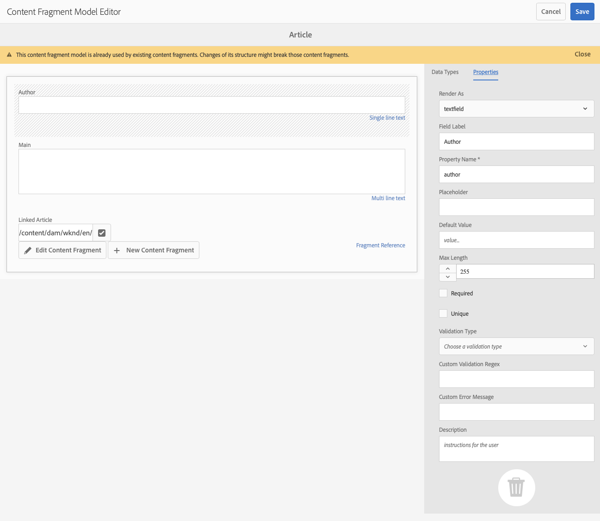

# GraphQL API AEM voor gebruik met inhoudsfragmenten {#graphql-api-for-use-with-content-fragments}

Leer hoe u inhoudsfragmenten in Adobe Experience Manager (AEM) kunt gebruiken met de AEM GraphQL API voor het leveren van inhoud zonder kop.

AEM GraphQL API die wordt gebruikt met Content Fragments is sterk gebaseerd op de standaard, open-source GraphQL API.

Door de GraphQL API in AEM te gebruiken, kunt u inhoudsfragmenten efficiënt aan JavaScript-clients leveren in CMS-implementaties zonder kop:

* Herhalende API-aanvragen voorkomen, zoals REST,
* ervoor zorgen dat de levering beperkt blijft tot de specifieke eisen;
* Het toestaan voor bulklevering van precies wat voor het teruggeven als antwoord op één enkele API vraag nodig is.

>[!NOTE]
>
>GraphQL wordt gebruikt in twee (afzonderlijke) scenario&#39;s in Adobe Experience Manager (AEM):
>
>* [AEM Commerce gebruikt gegevens van een Commerce-platform via GraphQL](/help/commerce/cif/integrating/magento.md).
>* AEM Content Fragments werken samen met de AEM GraphQL API (een aangepaste implementatie op basis van standaard GraphQL) voor gestructureerde inhoud voor gebruik in uw toepassingen.

## Vereisten {#prerequisites}

Klanten die GraphQL gebruiken, moeten het AEM Content Fragment installeren met GraphQL Index Package 1.0.5. Zie de [Opmerkingen bij de release](/help/release-notes/release-notes.md#install-aem-graphql-index-add-on-package) voor nadere bijzonderheden.

## De GraphQL API {#graphql-api}

GraphQL is:

* &quot;*...een querytaal voor API&#39;s en een runtime voor het uitvoeren van deze query&#39;s met uw bestaande gegevens. GraphQL geeft een volledige en begrijpelijke beschrijving van de gegevens in uw API. Het geeft cliënten de macht om precies te vragen wat zij en niets meer nodig hebben, maakt het gemakkelijker om APIs in tijd te evolueren, en laat krachtige ontwikkelaarshulpmiddelen toe.*&quot;.

  Zie [GraphQL.org](https://graphql.org)

* &quot;*...een open specificatie voor een flexibele API-laag. Plaats GraphQL over uw bestaande achtergronden zodat u producten sneller dan ooit kunt bouwen...*&quot;.

  Zie [GraphQL verkennen](https://graphql.com/).

* *&quot;...een taal en specificatie voor gegevensquery die in 2012 intern door Facebook zijn ontwikkeld, voordat deze in 2015 openbaar is uitbesteed. Het biedt een alternatief voor op REST gebaseerde architecturen met als doel de productiviteit van ontwikkelaars te verhogen en de hoeveelheden overgedragen gegevens te minimaliseren. GraphQL wordt gebruikt in productie door honderden organisaties van elke omvang...&quot;*

  Zie [GraphQL Foundation](https://graphql.org/foundation).

<!--
"*Explore GraphQL is maintained by the Apollo team. Our goal is to give developers and technical leaders around the world all the tools they need to understand and adopt GraphQL.*". 
-->

Raadpleeg de volgende secties (onder andere over veel andere bronnen) voor meer informatie over de GraphQL API:

* At [graphql.org](https://graphql.org):

   * [Inleiding tot GraphQL](https://graphql.org/learn)

   * [De GraphQL-specificatie](https://spec.graphql.org/)

* At [graphql.com](https://graphql.com):

   * [Tutorials](https://graphql.com/tutorials/)


De GraphQL for AEM-implementatie is gebaseerd op de standaard GraphQL Java™-bibliotheek. Zie:

* [graphQL.org - Java](https://graphql.org/code/#java)

* [GraphQL Java™ bij GitHub](https://github.com/graphql-java)

### GraphQL Terminologie {#graphql-terminology}

GraphQL gebruikt het volgende:

* **[Zoekopdrachten](https://graphql.org/learn/queries/)**

* **[Schema&#39;s en typen](https://graphql.org/learn/schema/)**:

   * Schema&#39;s worden gegenereerd door AEM op basis van de modellen van inhoudsfragmenten.
   * Met behulp van uw schema&#39;s geeft GraphQL de typen en bewerkingen weer die zijn toegestaan voor de GraphQL voor AEM implementatie.

* **[Velden](https://graphql.org/learn/queries/#fields)**

* **[GraphQL Endpoint](/help/sites-developing/headless/graphql-api/graphql-endpoint.md#graphql-aem-endpoint)**
   * Het pad in AEM dat reageert op GraphQL-query&#39;s en toegang biedt tot de GraphQL-schema&#39;s.

   * Zie [GraphQL Endpoint inschakelen](/help/sites-developing/headless/graphql-api/graphql-endpoint.md#enabling-graphql-endpoint) voor nadere bijzonderheden.

Zie de [(GraphQL.org) Inleiding tot GraphQL](https://graphql.org/learn/) voor uitvoerige informatie, waaronder de [Aanbevolen procedures](https://graphql.org/learn/best-practices/).

### GraphQL-querytypen {#graphql-query-types}

Met GraphQL kunt u query&#39;s uitvoeren die worden geretourneerd:

* A **enkel item**

* A **[lijst van vermeldingen](https://graphql.org/learn/schema/#lists-and-non-null)**

AEM biedt mogelijkheden om query&#39;s (beide typen) om te zetten in [Blijvende query&#39;s](/help/sites-developing/headless/graphql-api/persisted-queries.md) die door Dispatcher en CDN in het cachegeheugen worden opgeslagen.

### Best practices voor GraphQL-query (Dispatcher en CDN) {#graphql-query-best-practices}

[Blijvende query&#39;s](/help/sites-developing/headless/graphql-api/persisted-queries.md) zijn de aanbevolen methode voor het publiceren van exemplaren als:

* ze zijn in cache geplaatst
* zij worden centraal beheerd door AEM

<!-- is this fully accurate? -->
>[!NOTE]
>
>Gewoonlijk is er geen verzender/CDN op auteur, zodat is er geen prestatieswinst in het gebruiken van persisted vragen daar; behalve het testen van hen.

GraphQL-query&#39;s die gebruikmaken van POST-aanvragen worden niet aanbevolen omdat ze niet in de cache zijn opgeslagen, zodat in een standaardinstantie de Dispatcher is geconfigureerd om dergelijke query&#39;s te blokkeren.

Hoewel GraphQL ook GET-aanvragen ondersteunt, kunnen deze aanvragen limieten bereiken (bijvoorbeeld de lengte van de URL) die kunnen worden vermeden door middel van doorlopende query&#39;s.

Zie [Het in cache plaatsen van doorlopende query&#39;s inschakelen](#enable-caching-persisted-queries) voor nadere bijzonderheden.

>[!NOTE]
>
>De capaciteit om directe vragen uit te voeren kan op een bepaald punt in de toekomst worden verouderd.

## GraphiQL Interface {#graphiql-interface}

Tenuitvoerlegging van de norm [GraphiQL](https://graphql.org/learn/serving-over-http/#graphiql) kan worden gebruikt met AEM GraphQL.

>[!NOTE]
>
>GraphiQL is inbegrepen in alle milieu&#39;s van AEM (maar is slechts toegankelijk/zichtbaar wanneer u uw eindpunten vormt).
>
>In vorige versies had u een pakket nodig om GraphiQL IDE te installeren. Als u dit pakket hebt geïnstalleerd, kan het nu worden verwijderd.

Met deze interface kunt u query&#39;s rechtstreeks invoeren en testen.

Bijvoorbeeld:

* `http://localhost:4502/content/graphiql.html`

De klasse biedt functies zoals syntaxismarkering, automatisch aanvullen en automatisch voorstellen, samen met een geschiedenis en online documentatie:


>[!NOTE]
>
>Zie [GraphiQL IDE gebruiken](/help/sites-developing/headless/graphql-api/graphiql-ide.md).

## Kwesties gebruiken voor auteur- en publicatie-omgevingen {#use-cases-author-publish-environments}

De gebruiksgevallen kunnen afhankelijk zijn van het type AEM omgeving:

* Publicatie-omgeving; wordt gebruikt voor:
   * Query-gegevens voor JS-toepassing (standaardgebruikscenario)

* Auteursomgeving; gebruikt voor:
   * Query-gegevens voor &quot;inhoudsbeheerdoeleinden&quot;:
      * GraphQL in AEM is een alleen-lezen API.
      * De REST-API kan worden gebruikt voor CR(u)D-bewerkingen.

## Machtigingen {#permission}

De machtigingen zijn vereist voor toegang tot middelen.

GraphQL query&#39;s worden uitgevoerd met toestemming van de AEM gebruiker van het onderliggende verzoek. Als de gebruiker geen leestoegang heeft tot bepaalde fragmenten (opgeslagen als elementen), maken deze geen deel uit van de resultatenset.

Ook, moet de gebruiker toegang tot een eindpunt van GraphQL hebben om de vragen van GraphQL in werking te kunnen stellen.

## Schema genereren {#schema-generation}

GraphQL is een getypeerde API, wat betekent dat de gegevens duidelijk gestructureerd en ingedeeld moeten zijn op basis van het type.

De GraphQL-specificatie biedt een aantal richtlijnen voor het maken van een robuuste API voor het ondervragen van gegevens over een bepaalde instantie. Om deze richtlijnen te voltooien, moet een cliënt halen [Schema](#schema-generation), die alle typen bevat die nodig zijn voor een query.

Voor inhoudsfragmenten zijn de GraphQL-schema&#39;s (structuur en typen) gebaseerd op **Ingeschakeld** [Modellen van inhoudsfragmenten](/help/assets/content-fragments/content-fragments-models.md) en hun gegevenstypen.

>[!CAUTION]
>
>Alle GraphQL-schema&#39;s (afgeleid van Content Fragment Models) die zijn **Ingeschakeld**) zijn leesbaar via het GraphQL-eindpunt.
>
>Dit betekent dat u ervoor moet zorgen dat er geen gevoelige gegevens beschikbaar zijn, omdat deze op deze manier kunnen worden gelekt. Het bevat bijvoorbeeld informatie die als veldnamen aanwezig kan zijn in de modeldefinitie.

Als een gebruiker bijvoorbeeld een Content Fragment Model heeft gemaakt, genaamd `Article`AEM vervolgens een GraphQL-type genereert `ArticleModel`. De velden in dit type komen overeen met de velden en gegevenstypen die in het model zijn gedefinieerd. Bovendien leidt het tot sommige ingangspunten voor de vragen die op dit type werken, zoals `articleByPath` of `articleList`.

1. A Content Fragment Model:

   

1. Het corresponderende GraphQL-schema (uitvoer van de automatische documentatie GraphiQL):
   

   Deze afbeelding laat zien dat het gegenereerde type `ArticleModel` bevat diverse [velden](#fields).

   * Drie van hen zijn gecontroleerd door de gebruiker: `author`, `main`, en `referencearticle`.

   * De andere velden zijn automatisch AEM toegevoegd en zijn nuttige methoden voor het verschaffen van informatie over een bepaald inhoudsfragment. In dit voorbeeld, [helpervelden](#helper-fields)) `_path`, `_metadata`, `_variations`.

1. Nadat een gebruiker een inhoudsfragment heeft gemaakt op basis van het artikelmodel, kan het vervolgens worden ondervraagd via GraphQL. Zie voor voorbeelden de [Voorbeeldquery&#39;s](/help/sites-developing/headless/graphql-api/content-fragments-graphql-samples.md#graphql-sample-queries) (op basis van een [voorbeeldstructuur van inhoudsfragment voor gebruik met GraphQL](/help/sites-developing/headless/graphql-api/content-fragments-graphql-samples.md#content-fragment-structure-graphql)).

In GraphQL for AEM is het schema flexibel. Deze flexibiliteit betekent dat deze automatisch wordt gegenereerd wanneer een inhoudsfragmentmodel wordt gemaakt, bijgewerkt of verwijderd. De caches voor het gegevensschema worden ook vernieuwd wanneer u een model van het inhoudsfragment bijwerkt.

De service Sites GraphQL luistert (op de achtergrond) naar eventuele wijzigingen die zijn aangebracht in een inhoudsfragmentmodel. Wanneer updates worden ontdekt, slechts wordt dat deel van het schema opnieuw geproduceerd. Deze optimalisatie bespaart tijd en zorgt voor stabiliteit.

Als u bijvoorbeeld:

1. Een pakket installeren met `Content-Fragment-Model-1` en `Content-Fragment-Model-2`:

   1. GraphQL-typen voor `Model-1` en `Model-2` worden gegenereerd.

1. Vervolgens wijzigen `Content-Fragment-Model-2`:

   1. Alleen de `Model-2` GraphQL-type wordt bijgewerkt.

   1. Overwegende dat `Model-1` blijft hetzelfde.

>[!NOTE]
>
>Dit detail is belangrijk om nota te nemen enkel voor het geval u bulkupdates op de Modellen van het Fragment van de Inhoud door REST api, of anders wilt doen.

Het schema wordt gediend door het zelfde eindpunt zoals de vragen van GraphQL, met de cliënt die het feit behandelt dat het schema met de uitbreiding wordt geroepen `GQLschema`. U kunt bijvoorbeeld een eenvoudige `GET` verzoek op `/content/cq:graphql/global/endpoint.GQLschema` resulteert in de uitvoer van het schema met het inhoudstype: `text/x-graphql-schema;charset=iso-8859-1`.

### Schema genereren - Niet-gepubliceerde modellen {#schema-generation-unpublished-models}

Wanneer Inhoudsfragmenten zijn genest, kan een bovenliggend inhoudsfragmentmodel worden gepubliceerd, maar een model waarnaar wordt verwezen, niet.

>[!NOTE]
>
>De AEM gebruikersinterface verhindert dit te gebeuren, maar als het publiceren programmatically, of met inhoudspakketten wordt gemaakt, kan het voorkomen.

Wanneer dit gebeurt, genereert AEM een *onvolledig* Schema voor het bovenliggende inhoudsfragmentmodel. Dit betekent dat de fragmentverwijzing, die afhankelijk is van het niet-gepubliceerde model, uit het schema wordt verwijderd.

## Velden {#fields}

Binnen het schema zijn er afzonderlijke velden, van twee basiscategorieën:

* Velden die u genereert.

  Een selectie van [Gegevenstypen](#data-types) worden gebruikt om velden te maken die zijn gebaseerd op de manier waarop u het inhoudsfragmentmodel configureert. De veldnamen zijn afkomstig uit het **Eigenschapnaam** van het **Gegevenstype**.

   * Er is ook **Renderen als** het plaatsen om te overwegen, aangezien de gebruikers bepaalde gegevenstypes kunnen vormen. Een tekstveld met één regel kan bijvoorbeeld zo worden geconfigureerd dat het meerdere tekst met één regel bevat `multifield` in de vervolgkeuzelijst.

* GraphQL for AEM genereert ook een aantal [helpervelden](#helper-fields).

  Deze velden worden gebruikt om een inhoudsfragment te identificeren of om meer informatie over een inhoudsfragment op te halen.

### Gegevenstypen {#data-types}

GraphQL for AEM ondersteunt een lijst met typen. Alle ondersteunde gegevenstypen van het inhoudsfragmentmodel en de bijbehorende GraphQL-typen worden weergegeven:

| Inhoudsfragmentmodel - Gegevenstype | GraphQL-type | Beschrijving |
|--- |--- |--- |
| Tekst met één regel | `String`, `[String]` |  Wordt gebruikt voor eenvoudige tekenreeksen, zoals namen van auteurs en locaties. |
| Meerdere regels tekst | `String` |  Wordt gebruikt voor het uitvoeren van tekst, zoals de hoofdtekst van een artikel |
| Getal |  `Float`, `[Float]` | Wordt gebruikt om het zwevende-kommanummer en de reguliere getallen weer te geven |
| Boolean |  `Boolean` |  Gebruikt om selectievakjes weer te geven → eenvoudige true/false-instructies |
| Datum en tijd | `Calendar` |  Wordt gebruikt om datum en tijd weer te geven in de ISO 8086-indeling. Afhankelijk van het geselecteerde type zijn er drie kleuren beschikbaar voor gebruik in AEM GraphQL: `onlyDate`, `onlyTime`, `dateTime` |
| Opsomming |  `String` |  Wordt gebruikt om een optie weer te geven uit een lijst met opties die bij het maken van het model zijn gedefinieerd |
|  Tags |  `[String]` |  Wordt gebruikt om een lijst weer te geven met tekenreeksen die tags vertegenwoordigen die in AEM worden gebruikt |
| Content Reference |  `String` |  Wordt gebruikt om het pad naar een ander element in AEM weer te geven |
| Fragmentverwijzing |  *Een modeltype* <br><br>Enkel veld: `Model` - Modeltype, rechtstreeks verwezen <br><br>Meerdere velden, met één type waarnaar wordt verwezen: `[Model]` - Array van type `Model`, rechtstreeks vanaf een array <br><br>Meerdere velden, met meerdere typen waarnaar wordt verwezen: `[AllFragmentModels]` - Array van alle modeltypen, met verwijzing van array met type union |  Gebruikt om één, of meer, de Fragmenten van de Inhoud van bepaalde ModelTypes van Verwijzing te voorzien, die toen het model werd gecreeerd |

{style="table-layout:auto"}

### Helpervelden {#helper-fields}

Naast de gegevenstypen voor door de gebruiker gegenereerde velden, genereert GraphQL for AEM ook verschillende *helper* velden voor het herkennen van een inhoudsfragment of voor aanvullende informatie over een inhoudsfragment.

Deze [helpervelden](#helper-fields) zijn gemarkeerd met een voorgaande `_` om onderscheid te maken tussen wat door de gebruiker is gedefinieerd en wat automatisch is gegenereerd.

#### Pad {#path}

Het padveld wordt gebruikt als een identifier in AEM GraphQL. Het vertegenwoordigt het pad van het Content Fragment-element in de AEM opslagplaats. Dit pad wordt gekozen als de id van een inhoudsfragment, omdat het:

* uniek is binnen AEM,
* kan gemakkelijk worden opgehaald.

Met de volgende code worden de paden weergegeven van alle inhoudsfragmenten die zijn gemaakt op basis van het model van het inhoudsfragment `Person`.

```graphql
{
  personList {
    items {
      _path
    }
  }
}
```

Als u één inhoudsfragment van een bepaald type wilt ophalen, moet u ook eerst het pad ervan bepalen. Bijvoorbeeld:

```graphql
{
  authorByPath(_path: "/content/dam/path/to/fragment/john-doe") {
    item {
      _path
      firstName
      name
    }
  }
}
```

Zie [Voorbeeldquery - één specifiek stedenfragment](/help/sites-developing/headless/graphql-api/content-fragments-graphql-samples.md#sample-single-specific-city-fragment).

#### Metagegevens {#metadata}

Via GraphQL worden AEM ook de metagegevens van een inhoudsfragment beschikbaar gemaakt. Metagegevens zijn de informatie die een inhoudsfragment beschrijft, zoals het volgende:

* de titel van een inhoudsfragment
* het pad naar de miniatuur
* de beschrijving van een inhoudsfragment
* en de datum waarop het is gemaakt, onder andere.

Omdat metagegevens worden gegenereerd via de Schema-editor en als zodanig geen specifieke structuur hebben, `TypedMetaData` Het GraphQL-type is geïmplementeerd om de metagegevens van een inhoudsfragment beschikbaar te maken. De `TypedMetaData` stelt de informatie bloot die door de volgende scalaire types wordt gegroepeerd:

| Veld |
|--- |
| `stringMetadata:[StringMetadata]!` |
| `stringArrayMetadata:[StringArrayMetadata]!` |
| `intMetadata:[IntMetadata]!` |
| `intArrayMetadata:[IntArrayMetadata]!` |
| `floatMetadata:[FloatMetadata]!` |
| `floatArrayMetadata:[FloatArrayMetadata]!` |
| `booleanMetadata:[BooleanMetadata]!` |
| `booleanArrayMetadata:[booleanArrayMetadata]!`  |
| `calendarMetadata:[CalendarMetadata]!` |
| `calendarArrayMetadata:[CalendarArrayMetadata]!` |

Elk scalair type vertegenwoordigt of één enkel naam-waarde paar of een serie van naam-waarde paren, waar de waarde van dat paar van het type is het werd gegroepeerd.

Als u bijvoorbeeld de titel van een inhoudsfragment wilt ophalen, is deze eigenschap een eigenschap String, zodat u een query voor alle metagegevens van tekenreeks kunt uitvoeren:

Ga als volgt te werk om te zoeken naar metagegevens:

```graphql
{
  personByPath(_path: "/content/dam/path/to/fragment/john-doe") {
    item {
      _path
      _metadata {
        stringMetadata {
          name
          value
        }
      }
    }
  }
}
```

U kunt alle GraphQL-typen voor metagegevens weergeven als u het schema Gegenereerde GraphQL weergeeft. Alle modeltypen hebben dezelfde `TypedMetaData`.

>[!NOTE]
>
>**Verschil tussen normale en arraymetagegevens**
>Houd er rekening mee dat `StringMetadata` en `StringArrayMetadata` beide verwijzen naar wat in de bewaarplaats wordt opgeslagen, niet hoe u hen terugwint.
>
>Bijvoorbeeld door de `stringMetadata` veld, ontvangt u een array van alle metagegevens die in de repository zijn opgeslagen als een `String`. En als je belt `stringArrayMetadata`ontvangt u een array van alle metagegevens die in de opslagplaats zijn opgeslagen als `String[]`.

Zie [Voorbeeldquery voor metagegevens - Lijst met metagegevens voor onderscheidingen: GB](/help/sites-developing/headless/graphql-api/content-fragments-graphql-samples.md#sample-metadata-awards-gb).

#### Variaties {#variations}

De `_variations` is geïmplementeerd om het opvragen van variaties in een inhoudsfragment te vereenvoudigen. Bijvoorbeeld:

```graphql
{
  personByPath(_path: "/content/dam/path/to/fragment/john-doe") {
    item {
      _variations
    }
  }
}
```

>[!NOTE]
>
>De `_variations` veld bevat geen `master` variatie, als technisch gezien de oorspronkelijke gegevens (als *Master* in de gebruikersinterface) wordt niet als een expliciete wijziging beschouwd.

Zie [Voorbeeldquery - Alle steden met een benoemde variatie](/help/sites-developing/headless/graphql-api/content-fragments-graphql-samples.md#sample-cities-named-variation).

>[!NOTE]
>
>Als de opgegeven variatie niet bestaat voor een inhoudsfragment, worden de oorspronkelijke gegevens (ook wel de hoofdvariatie genoemd) geretourneerd als een standaardinstelling (fallback).

<!--
## Security Considerations {#security-considerations}
-->

## GraphQL-variabelen {#graphql-variables}

GraphQL staat toe dat variabelen in de query worden geplaatst. Zie voor meer informatie [GraphQL-documentatie voor variabelen](https://graphql.org/learn/queries/#variables).

Als u bijvoorbeeld alle inhoudsfragmenten van het type wilt ophalen `Article` die een specifieke variatie hebben, kunt u de variabele opgeven `variation` in GraphiQL.


```graphql
### query
query GetArticlesByVariation($variation: String!) {
    articleList(variation: $variation) {
        items {
            _path
            author
            _variations
        }
    }
}
 
### in query variables
{
    "variation": "uk"
}
```

## GraphQL-richtlijnen {#graphql-directives}

In GraphQL is er een mogelijkheid om de query te wijzigen op basis van variabelen, de zogenaamde GraphQL-richtlijnen.

Hier kunt u bijvoorbeeld de opdracht `adventurePrice` veld in een query voor alle `AdventureModels`, gebaseerd op een variabele `includePrice`.


```graphql
### query
query GetAdventureByType($includePrice: Boolean!) {
  adventureList {
    items {
      adventureTitle
      adventurePrice @include(if: $includePrice)
    }
  }
}
 
### in query variables
{
    "includePrice": true
}
```

## Filteren {#filtering}

U kunt filteren ook gebruiken in uw GraphQL-query&#39;s om specifieke gegevens te retourneren.

Bij het filteren wordt een syntaxis gebruikt die is gebaseerd op logische operatoren en expressies.

Het meest atomische deel bestaat uit één expressie die kan worden toegepast op de inhoud van een bepaald veld. De inhoud van het veld wordt vergeleken met een bepaalde constante waarde.

De volgende expressie zou bijvoorbeeld de inhoud van het veld vergelijken met de waarde `some text`en slagen als de inhoud gelijk is aan de waarde. Anders mislukt de expressie:

```graphql
{
  value: "some text"
  _op: EQUALS
}
```

De volgende operatoren kunnen worden gebruikt om velden met een bepaalde waarde te vergelijken:

| Operator | Typen | De expressie slaagt als ... |
|--- |--- |--- |
| `EQUALS` | `String`, `ID`, `Boolean` | ... de waarde is gelijk aan de inhoud van het veld |
| `EQUALS_NOT` | `String`, `ID` | ... de waarde is *niet* gelijk aan de inhoud van het veld |
| `CONTAINS` | `String` | ... de inhoud van het veld bevat de waarde (`{ value: "mas", _op: CONTAINS }` overeenkomsten `Christmas`, `Xmas`, `master`, ...) |
| `CONTAINS_NOT` | `String` | ... de inhoud van het veld *niet* bevatten de waarde |
| `STARTS_WITH` | `ID` | ... de id begint met een bepaalde waarde (`{ value: "/content/dam/", _op: STARTS_WITH` overeenkomsten `/content/dam/path/to/fragment`, maar niet `/namespace/content/dam/something` |
| `EQUAL` | `Int`, `Float` | ... de waarde is gelijk aan de inhoud van het veld |
| `UNEQUAL` | `Int`, `Float` | ... de waarde is *niet* gelijk aan de inhoud van het veld |
| `GREATER` | `Int`, `Float` | ... de inhoud van het veld is groter dan de waarde |
| `GREATER_EQUAL` | `Int`, `Float` | ... de inhoud van het veld is groter dan of gelijk aan de waarde |
| `LOWER` | `Int`, `Float` | ... de inhoud van het veld is lager dan de waarde |
| `LOWER_EQUAL` | `Int`, `Float` | ... de inhoud van het veld is lager dan of gelijk aan de waarde |
| `AT` | `Calendar`, `Date`, `Time` | ... de inhoud van het veld is gelijk aan de waarde (inclusief tijdzone-instelling) |
| `NOT_AT` | `Calendar`, `Date`, `Time` | ... de inhoud van het veld is *niet* gelijk aan de waarde |
| `BEFORE` | `Calendar`, `Date`, `Time` | ... het tijdpunt dat door de waarde wordt aangegeven, ligt vóór het tijdpunt dat door de inhoud van het veld wordt aangegeven |
| `AT_OR_BEFORE` | `Calendar`, `Date`, `Time` | ... het tijdpunt dat door de waarde wordt aangegeven, zich vóór of op hetzelfde tijdpunt bevindt dat door de inhoud van het veld wordt aangegeven |
| `AFTER` | `Calendar`, `Date`, `Time` | ... het punt in de tijd dat door de waarde wordt aangegeven, is na het punt in de tijd dat door de inhoud van het veld wordt aangegeven |
| `AT_OR_AFTER` | `Calendar`, `Date`, `Time` | ... het tijdpunt dat door de waarde wordt aangegeven, is na of op hetzelfde tijdpunt dat door de inhoud van het veld wordt aangegeven |

Bij sommige typen kunt u ook aanvullende opties opgeven die wijzigen hoe een expressie wordt geëvalueerd:

| Optie | Typen | Beschrijving |
|--- |--- |--- |
| `_ignoreCase` | `String` | Negeert het geval van een tekenreeks, bijvoorbeeld een waarde van `time` overeenkomsten `TIME`, `time`, `tImE`, ... |
| `_sensitiveness` | `Float` | Hiermee wordt een bepaalde marge toegestaan voor `float` als hetzelfde te beschouwen waarden (om technische beperkingen te omzeilen als gevolg van de interne representatie van `float` waarden; moet worden vermeden, aangezien deze optie een negatief effect kan hebben op de prestaties |

Expressies kunnen met behulp van een logische operator worden gecombineerd tot een set (`_logOp`):

* `OR` - de reeks expressies slaagt als ten minste één expressie slaagt
* `AND` - de reeks expressies slaagt als alle expressies slagen (standaardwaarde)

Elk veld kan met een eigen set expressies worden gefilterd. De expressiesets van alle velden die in het filterargument worden vermeld, worden uiteindelijk gecombineerd door de eigen logische operator.

Een filterdefinitie (doorgegeven als de `filter` argument voor een query) bevat:

* Een subdefinitie voor elk gebied (het gebied kan door zijn naam worden betreden, bijvoorbeeld, is er een `lastName` veld in het filter voor de `lastName` veld in het gegevenstype (veld)
* Elke subdefinitie bevat de `_expressions` array, die de expressieset en de `_logOp` veld waarin de logische operator wordt gedefinieerd, moeten de expressies worden gecombineerd met
* Elke expressie wordt gedefinieerd door de waarde (`value` veld) en de operator (`_operator` veld) de inhoud van een veld moet worden vergeleken met

U kunt weglaten `_logOp` als je objecten wilt combineren met `AND` en `_operator` als u op gelijkheid wilt controleren, omdat deze waarden standaardwaarden zijn.

Het volgende voorbeeld toont een volledige vraag aan die alle personen filtert die een `lastName` van `Provo` of die `sjö`onafhankelijk van de zaak:

```graphql
{
  authorList(filter: {
    lastname: {
      _logOp: OR
      _expressions: [
        {
          value: "sjö",
          _operator: CONTAINS,
          _ignoreCase: true
        },
        {
          value: "Provo"
        }
      ]
    }
  }) {
    items {
      lastName
      firstName
    }
  }
}
```

Wanneer u een GraphQL-query uitvoert met behulp van optionele variabelen, als een specifieke waarde **niet** gegeven voor de facultatieve variabele, dan zal de variabele in de filterevaluatie worden genegeerd. Dit betekent dat zoekresultaten alle waarden bevatten, beide `null` en niet `null`, voor de eigenschap met betrekking tot de filtervariabele.

>[!NOTE]
>
>Indien een `null` waarde is *expliciet* opgegeven voor een dergelijke variabele, komt het filter alleen overeen `null` waarden voor de bijbehorende eigenschap.

In de query hieronder ziet u bijvoorbeeld waar geen waarde is opgegeven voor de eigenschap `lastName`:

```graphql
query getAuthorsFilteredByLastName($authorLastName: String) {
  authorList(filter:
    {
      lastName: {_expressions: {value: $authorLastName}
      }}) {
    items {
      lastName
    }
  }
}
```

Alle auteurs worden geretourneerd:

```graphql
{
  "data": {
    "authorList": {
      "items": [
        {
          "lastName": "Hammer"
        },
        {
          "lastName": "Provo"
        },
        {
          "lastName": "Wester"
        },
        {
          "lastName": null
        },
         ...
      ]
    }
  }
}
```

U kunt ook filteren op geneste velden, maar dit wordt afgeraden omdat dit tot prestatieproblemen kan leiden.

Zie voor meer voorbeelden:

* nadere gegevens over de [GraphQL for AEM extensions](#graphql-extensions)

* [Voorbeeldquery&#39;s met deze voorbeeldinhoud en -structuur](/help/sites-developing/headless/graphql-api/content-fragments-graphql-samples.md#graphql-sample-queries-sample-content-fragment-structure)

   * En de [Voorbeeldinhoud en -structuur](/help/sites-developing/headless/graphql-api/content-fragments-graphql-samples.md#content-fragment-structure-graphql) voorbereid voor gebruik in voorbeeldquery&#39;s

* [Voorbeeldquery&#39;s op basis van het WKND-project](/help/sites-developing/headless/graphql-api/content-fragments-graphql-samples.md#sample-queries-using-wknd-project)

## Sorteren {#sorting}

>[!NOTE]
>
>Houd voor de beste prestaties rekening met [Inhoudsfragmenten bijwerken voor pagineren en sorteren in GraphQL-filters](/help/sites-developing/headless/graphql-api/graphql-optimized-filtering-content-update.md).

Met deze functie kunt u de zoekresultaten sorteren op basis van een opgegeven veld.

De sorteercriteria:

* is een door komma&#39;s gescheiden lijst met waarden die het veldpad aangeven
   * het eerste veld in de lijst definieert de primaire sorteervolgorde
      * het tweede veld wordt gebruikt als twee waarden van het primaire sorteercriterium gelijk zijn
      * het derde veld wordt gebruikt als de eerste twee criteria gelijk zijn , enzovoort .
   * puntnotatie, dat wil zeggen: `field1.subfield.subfield`, enzovoort.
* met een optionele bestelrichting
   * ASC (oplopend) of DESC (aflopend); als standaard ASC wordt toegepast
   * de richting kan per gebied worden gespecificeerd; dit vermogen betekent dat u één gebied in stijgende orde kunt sorteren, een andere in dalende orde (naam, firstName DESC)

Bijvoorbeeld:

```graphql
query {
  authorList(sort: "lastName, firstName") {
    items {
      firstName
      lastName
    }
  }
}
```

En ook:

```graphql
{
  authorList(sort: "lastName DESC, firstName DESC") {
    items {
        lastName
        firstName
    }
  }
}
```

U kunt ook sorteren op een veld in een genest fragment in de notatie `nestedFragmentname.fieldname`.

>[!NOTE]
>
>Deze indeling kan negatieve gevolgen hebben voor de prestaties.

Bijvoorbeeld:

```graphql
query {
  articleList(sort: "authorFragment.lastName")  {
    items {
      title
      authorFragment {
        firstName
        lastName
        birthDay
      }
      slug
    }
  }
}
```

## Paginering {#paging}

>[!NOTE]
>
>Houd voor de beste prestaties rekening met [Inhoudsfragmenten bijwerken voor pagineren en sorteren in GraphQL-filters](/help/sites-developing/headless/graphql-api/graphql-optimized-filtering-content-update.md).

Met deze functie kunt u pagineren uitvoeren op querytypen die een lijst retourneren. Er zijn twee methoden:

* `offset` en `limit` in een `List` query
* `first` en `after` in een `Paginated` query

### Lijstquery - Verschuiven en beperken {#list-offset-limit}

In een `...List`query die u kunt gebruiken `offset` en `limit` om een specifieke subset van resultaten te retourneren:

* `offset`: Geeft de eerste gegevensset aan die moet worden geretourneerd
* `limit`: Geeft het maximale aantal gegevenssets op dat moet worden geretourneerd

Als u bijvoorbeeld de resultatenpagina wilt weergeven met maximaal vijf artikelen, te beginnen bij het vijfde artikel van het dialoogvenster *complete* resultatenlijst:

```graphql
query {
   articleList(offset: 5, limit: 5) {
    items {
      authorFragment {
        lastName
        firstName
      }
    }
  }
}
```

<!-- When available link to BP and replace "JCR query level" with a more neutral term. -->

<!-- When available link to BP and replace "JCR query result set" with a more neutral term. -->

>[!NOTE]
>
>* De paginering vereist een stabiele soortorde om correct over veelvoudige vragen te werken die verschillende pagina&#39;s van de zelfde resultaatreeks vragen. Standaard wordt het pad naar de opslagplaats van elk item van de resultaatset gebruikt om ervoor te zorgen dat de volgorde altijd gelijk is. Als een verschillende sorteervolgorde wordt gebruikt en als die sortering niet kan worden uitgevoerd op JCR-queryniveau, heeft dat een negatief effect op de prestaties. De reden hiervoor is dat de volledige resultaatset in het geheugen moet worden geladen voordat de pagina&#39;s worden bepaald.
>
>* Hoe hoger de verschuiving, des te meer tijd neemt het om de items van de volledige set JCR-queryresultaten over te slaan. Een alternatieve oplossing voor grote resultaatreeksen is de gepagineerde vraag met te gebruiken `first` en `after` methode.

### Gepagineerde query - eerste en volgende {#paginated-first-after}

De `...Paginated` het vraagtype gebruikt het grootste deel van `...List` functies voor querytypen (filteren, sorteren), maar in plaats van `offset`/`limit` argumenten, gebruikt het de `first`/`after` argumenten zoals gedefinieerd door [de GraphQL Cursor Connections Specification](https://relay.dev/graphql/connections.htm). U vindt een minder formele introductie in het dialoogvenster [Inleiding GraphQL](https://graphql.org/learn/pagination/#pagination-and-edges).

* `first`: De `n` eerste objecten die moeten worden geretourneerd.
De standaardwaarde is `50`.
Het maximum is `100`.
* `after`: De cursor die het begin van de opgevraagde pagina bepaalt. Het punt dat door de curseur wordt vertegenwoordigd is niet inbegrepen in de resultaatreeks. De cursor van een item wordt bepaald door de `cursor` van het `edges` structuur.

Voer bijvoorbeeld de resultatenpagina uit met maximaal vijf avonturen, te beginnen bij het opgegeven cursoritem in het dialoogvenster *complete* resultatenlijst:

```graphql
query {
    adventurePaginated(first: 5, after: "ODg1MmMyMmEtZTAzMy00MTNjLThiMzMtZGQyMzY5ZTNjN2M1") {
        edges {
          cursor
          node {
            title
          }
        }
        pageInfo {
          endCursor
          hasNextPage
        }
    }
}
```

<!-- When available link to BP -->
<!-- Due to internal technical constraints, performance will degrade if sorting and filtering is applied on nested fields. Therefore it is recommended to use filter/sort fields stored at root level. For more information, see the [Best Practices document](link). -->

>[!NOTE]
>
>* Standaard wordt bij paginering de UUID gebruikt van het opslagplaats-knooppunt dat het fragment vertegenwoordigt voor de volgorde van de resultaten, om ervoor te zorgen dat de volgorde van de resultaten altijd gelijk is. Wanneer `sort` wordt gebruikt, wordt UUID impliciet gebruikt om een unieke soort te verzekeren; zelfs voor twee punten met identieke soortsleutels.
>
>* Als gevolg van interne technische beperkingen neemt de prestatie af als sortering en filtering worden toegepast op geneste velden. Gebruik daarom filter-/sorteervelden die op hoofdniveau zijn opgeslagen. Deze techniek is ook de geadviseerde manier als u grote gepagineerde resultaatreeksen wilt vragen.

## GraphQL Persisted Queries - caching inschakelen in Dispatcher {#graphql-persisted-queries-enabling-caching-dispatcher}

>[!CAUTION]
>
>Als caching in de Dispatcher wordt toegelaten dan [CORS-filter](#cors-filter) is niet nodig, zodat die sectie kan worden genegeerd.

Caching van persisted query&#39;s wordt niet standaard ingeschakeld in de Dispatcher. De standaard enablement is niet mogelijk aangezien de klanten die CORS (het Delen van het Middel van de Cross-Origin) met veelvoudige oorsprong gebruiken hun configuratie van de Verzender moeten herzien en misschien bijwerken.

>[!NOTE]
>
>De Dispatcher slaat de `Vary` header.
>
>Caching van andere CORS-verwante kopballen kan in de Dispatcher worden toegelaten, maar zou ontoereikend kunnen zijn wanneer er veelvoudige CORS oorsprong zijn.

### Het in cache plaatsen van doorlopende query&#39;s inschakelen {#enable-caching-persisted-queries}

Om het in cache plaatsen van persisted query&#39;s in te schakelen, zijn de volgende updates van de Dispatcher-configuratiebestanden vereist:

* `<conf.d/rewrites/base_rewrite.rules>`

  ```xml
  # Allow the dispatcher to be able to cache persisted queries - they need an extension for the cache file
  RewriteCond %{REQUEST_URI} ^/graphql/execute.json
  RewriteRule ^/(.*)$ /$1;.json [PT] 
  ```

  >[!NOTE]
  >
  >Dispatcher voegt het achtervoegsel toe `.json` aan alle persisted query-URL&#39;s, zodat het resultaat in de cache kan worden opgeslagen.
  >
  >Zo zorgt u ervoor dat de query voldoet aan de vereisten van de Dispatcher voor documenten die in cache kunnen worden geplaatst. Zie voor meer informatie [Hoe retourneert de Dispatcher documenten?](https://experienceleague.adobe.com/docs/experience-manager-dispatcher/using/troubleshooting/dispatcher-faq.html#how-does-the-dispatcher-return-documents%3F)

* `<conf.dispatcher.d/filters/ams_publish_filters.any>`

  ```xml
  # Allow GraphQL Persisted Queries & preflight requests
  /0110 { /type "allow" /method '(GET|POST|OPTIONS)' /url "/graphql/execute.json*" }
  ```

### CORS-configuratie in de Dispatcher {#cors-configuration-in-dispatcher}

Klanten die CORS-verzoeken gebruiken, moeten mogelijk hun CORS-configuratie in de Dispatcher controleren en bijwerken.

* De `Origin` header mag niet worden doorgegeven aan AEM publish via Dispatcher:
   * Controleer de `clientheaders.any` bestand.
* In plaats daarvan, moeten de verzoeken CORS voor toegestane oorsprong op het niveau van de Verzender worden geëvalueerd. Deze benadering zorgt er ook voor dat aan CORS gerelateerde koppen in alle gevallen correct worden ingesteld op één plaats.
   * Een dergelijke configuratie moet worden toegevoegd aan de `vhost` bestand. Hieronder wordt een voorbeeldconfiguratie gegeven; voor de eenvoud is alleen het gedeelte met betrekking tot CORS opgenomen. U kunt deze aanpassen voor uw specifieke gebruiksgevallen.

  ```xml
  <VirtualHost *:80>
     ServerName "publish"
  
     # ...
  
     <IfModule mod_headers.c>
         Header add X-Vhost "publish"
  
          ################## Start of the CORS specific configuration ##################
  
          SetEnvIfExpr "req_novary('Origin') == ''"  CORSType=none CORSProcessing=false
          SetEnvIfExpr "req_novary('Origin') != ''"  CORSType=cors CORSProcessing=true CORSTrusted=false
  
          SetEnvIfExpr "req_novary('Access-Control-Request-Method') == '' && %{REQUEST_METHOD} == 'OPTIONS' && req_novary('Origin') != ''  " CORSType=invalidpreflight CORSProcessing=false
          SetEnvIfExpr "req_novary('Access-Control-Request-Method') != '' && %{REQUEST_METHOD} == 'OPTIONS' && req_novary('Origin') != ''  " CORSType=preflight CORSProcessing=true CORSTrusted=false
          SetEnvIfExpr "req_novary('Origin') -strcmatch 'https://%{HTTP_HOST}*'"  CORSType=samedomain CORSProcessing=false
  
          # For requests that require CORS processing, check if the Origin can be trusted
          SetEnvIfExpr "%{HTTP_HOST} =~ /(.*)/ " ParsedHost=$1
  
          ################## Adapt the regex to match CORS origin for your environment
          SetEnvIfExpr "env('CORSProcessing') == 'true' && req_novary('Origin') =~ m#(https://.*.your-domain.tld(:\d+)?$)#" CORSTrusted=true
  
          # Extract the Origin header 
          SetEnvIfNoCase ^Origin$ ^https://(.*)$ CORSTrustedOrigin=https://$1
  
          # Flush If already set
          Header unset Access-Control-Allow-Origin
          Header unset Access-Control-Allow-Credentials
  
          # Trusted
          Header always set Access-Control-Allow-Credentials "true" "expr=reqenv('CORSTrusted') == 'true'"
          Header always set Access-Control-Allow-Origin "%{CORSTrustedOrigin}e" "expr=reqenv('CORSTrusted') == 'true'"
          Header always set Access-Control-Allow-Methods "GET" "expr=reqenv('CORSTrusted') == 'true'"
          Header always set Access-Control-Max-Age 1800 "expr=reqenv('CORSTrusted') == 'true'"
          Header always set Access-Control-Allow-Headers "Origin, Accept, X-Requested-With, Content-Type, Access-Control-Request-Method, Access-Control-Request-Headers" "expr=reqenv('CORSTrusted') == 'true'"
  
          # Non-CORS or Not Trusted
          Header unset Access-Control-Allow-Credentials "expr=reqenv('CORSProcessing') == 'false' || reqenv('CORSTrusted') == 'false'"
          Header unset Access-Control-Allow-Origin "expr=reqenv('CORSProcessing') == 'false' || reqenv('CORSTrusted') == 'false'"
          Header unset Access-Control-Allow-Methods "expr=reqenv('CORSProcessing') == 'false' || reqenv('CORSTrusted') == 'false'"
          Header unset Access-Control-Max-Age "expr=reqenv('CORSProcessing') == 'false' || reqenv('CORSTrusted') == 'false'"
  
          # Always vary on origin, even if its not there.
          Header merge Vary Origin
  
          # CORS - send 204 for CORS requests which are not trusted
          RewriteCond expr "reqenv('CORSProcessing') == 'true' && reqenv('CORSTrusted') == 'false'"
          RewriteRule "^(.*)" - [R=204,L]
  
          ################## End of the CORS specific configuration ##################
  
     </IfModule>
  
     <Directory />
  
         # ...
  
     </Directory>
  
     # ...
  
  </VirtualHost>
  ```

## GraphQL for AEM - Overzicht van extensies {#graphql-extensions}

De basisverrichting van vragen met GraphQL voor AEM voldoet aan de standaardspecificatie van GraphQL. Voor GraphQL-query&#39;s met AEM zijn er een aantal extensies:

* Als u één resultaat nodig hebt:
   * gebruik de modelnaam; bijvoorbeeld stad

* Als u een lijst met resultaten verwacht:
   * toevoegen `List` op de modelnaam, bijvoorbeeld  `cityList`
   * Zie [Voorbeeldquery - Alle informatie over alle steden](/help/sites-developing/headless/graphql-api/content-fragments-graphql-samples.md#sample-all-information-all-cities)

  U kunt dan:

   * [De resultaten sorteren](#sorting)

      * `ASC` : oplopend
      * `DESC` : aflopend

   * Retourneer een pagina met resultaten met:

      * [Een lijstvraag met compensatie en grens](/help/sites-developing/headless/graphql-api/content-fragments-graphql-samples.md#list-offset-limit)
      * [Een gepagineerde query met eerste en volgende](/help/sites-developing/headless/graphql-api/content-fragments-graphql-samples.md#paginated-first-after)
   * Zie [Voorbeeldquery - Alle informatie over alle steden](/help/sites-developing/headless/graphql-api/content-fragments-graphql-samples.md#sample-all-information-all-cities)

* Het filter `includeVariations` is opgenomen in de `List` querytype. Als u Variaties in inhoudsfragmenten wilt ophalen in de queryresultaten, kunt u de opdracht `includeVariations` filter moet worden ingesteld op `true`.

  >[!CAUTION]
  >Het filter `includeVariations` kan niet samen met het door het systeem gegenereerde veld worden gebruikt `_variation`.

* Als u logische OR wilt gebruiken:
   * gebruiken ` _logOp: OR`
   * Zie [Voorbeeldquery - Alle personen met de naam &quot;Jobs&quot; of &quot;Smith&quot;](/help/sites-developing/headless/graphql-api/content-fragments-graphql-samples.md#sample-all-persons-jobs-smith)

* Logische AND bestaat ook, maar is (vaak) impliciet

* U kunt zoeken naar veldnamen die overeenkomen met de velden in het model van het inhoudsfragment
   * Zie [Voorbeeldquery - Volledige details van de CEO en medewerkers van een bedrijf](/help/sites-developing/headless/graphql-api/content-fragments-graphql-samples.md#sample-full-details-company-ceos-employees)

* Naast de velden van uw model zijn er velden die door het systeem worden gegenereerd (voorafgegaan door een onderstrepingsteken):

   * Voor inhoud:

      * `_locale` : om de taal te onthullen; gebaseerd op Taalbeheer
         * Zie [Voorbeeldquery voor meerdere inhoudsfragmenten van een bepaalde landinstelling](/help/sites-developing/headless/graphql-api/content-fragments-graphql-samples.md#sample-wknd-multiple-fragments-given-locale)

      * `_metadata` : om metagegevens voor het fragment weer te geven
         * Zie [Voorbeeldquery voor metagegevens - Lijst met metagegevens voor onderscheidingen: GB](/help/sites-developing/headless/graphql-api/content-fragments-graphql-samples.md#sample-metadata-awards-gb)

      * `_model` : Vragen naar een inhoudsfragmentmodel toestaan (pad en titel)
         * Zie [Voorbeeldquery voor een inhoudsfragmentmodel op basis van een model](/help/sites-developing/headless/graphql-api/content-fragments-graphql-samples.md#sample-wknd-content-fragment-model-from-model)

      * `_path` : het pad naar het inhoudsfragment in de opslagplaats
         * Zie [Voorbeeldquery - één specifiek stedenfragment](/help/sites-developing/headless/graphql-api/content-fragments-graphql-samples.md#sample-single-specific-city-fragment)

      * `_reference` : om verwijzingen weer te geven; inline-verwijzingen opnemen in de Rich Text Editor
         * Zie [Voorbeeldquery voor meerdere inhoudfragmenten met vooraf ingestelde verwijzingen](/help/sites-developing/headless/graphql-api/content-fragments-graphql-samples.md#sample-wknd-multiple-fragments-prefetched-references)

      * `_variation` : om specifieke variaties in het inhoudsfragment weer te geven

        >[!NOTE]
        >
        >Als de opgegeven variatie niet bestaat voor een inhoudsfragment, wordt de hoofdvariatie geretourneerd als een standaardinstelling (fallback).

        >[!CAUTION]
        >Het systeemgegenereerde veld `_variation` kan niet samen met het filter worden gebruikt `includeVariations`.

         * Zie [Voorbeeldquery - Alle steden met een benoemde variatie](/help/sites-developing/headless/graphql-api/content-fragments-graphql-samples.md#sample-cities-named-variation)

      * `_tags` : om de id&#39;s weer te geven van inhoudsfragmenten of variaties die tags bevatten; deze lijst is een array van `cq:tags` id&#39;s.

         * Zie [Voorbeeldquery - Namen van alle steden die zijn getagd als stadseinden](/help/sites-developing/headless/graphql-api/content-fragments-graphql-samples.md#sample-names-all-cities-tagged-city-breaks)
         * Zie [Voorbeeldquery voor variaties van inhoudsfragmenten van een bepaald model waaraan een specifieke tag is gekoppeld](/help/sites-developing/headless/graphql-api/content-fragments-graphql-samples.md#sample-wknd-fragment-variations-given-model-specific-tag)

        >[!NOTE]
        >
        >Tags kunnen ook worden opgevraagd door de metagegevens van een inhoudsfragment weer te geven.

   * En bewerkingen:

      * `_operator` : specifieke exploitanten toepassen; `EQUALS`, `EQUALS_NOT`, `GREATER_EQUAL`, `LOWER`, `CONTAINS`, `STARTS_WITH`
         * Zie [Voorbeeldquery - Alle personen die geen naam hebben van &quot;Taken&quot;](/help/sites-developing/headless/graphql-api/content-fragments-graphql-samples.md#sample-all-persons-not-jobs)
         * Zie [Voorbeeldquery - Alle avonturen waar de `_path` begint met een bepaald voorvoegsel](/help/sites-developing/headless/graphql-api/content-fragments-graphql-samples.md#sample-wknd-all-adventures-cycling-path-filter)

      * `_apply` : specifieke voorwaarden toepassen, bijvoorbeeld  `AT_LEAST_ONCE`
         * Zie [Voorbeeldquery - Filter op een array met een item dat minstens één keer moet voorkomen](/help/sites-developing/headless/graphql-api/content-fragments-graphql-samples.md#sample-array-item-occur-at-least-once)

      * `_ignoreCase` : om de zaak te negeren bij het vragen
         * Zie [Voorbeeldquery - Alle steden met SAN in naam, ongeacht het geval](/help/sites-developing/headless/graphql-api/content-fragments-graphql-samples.md#sample-all-cities-san-ignore-case)

* GraphQL-union-typen worden ondersteund:

   * gebruiken `... on`
      * Zie [Voorbeeldquery voor een inhoudsfragment van een specifiek model met een inhoudsverwijzing](/help/sites-developing/headless/graphql-api/content-fragments-graphql-samples.md#sample-wknd-fragment-specific-model-content-reference)

* Extra fallback bij het opvragen van geneste fragmenten:

   * Als de gevraagde variatie niet bestaat in een genest fragment, wordt de **Master** variation is returned.

### CORS-filter {#cors-filter}

>[!CAUTION]
>
>Indien [caching in Dispatcher is ingeschakeld](#graphql-persisted-queries-enabling-caching-dispatcher) dan is het filter CORS niet nodig en kan deze sectie worden genegeerd.

>[!NOTE]
>
>Voor een gedetailleerd overzicht van het beleid van CORS voor het delen van bronnen in AEM, zie [Werken met het delen van bronnen tussen verschillende bronnen (CORS)](https://experienceleague.adobe.com/docs/experience-manager-learn/foundation/security/understand-cross-origin-resource-sharing.html#understand-cross-origin-resource-sharing-(cors)).

Om tot het eindpunt van GraphQL toegang te hebben, vorm een beleid CORS in de bewaarplaats van de Kit van de klant. Deze configuratie wordt gedaan door een aangewezen OSGi CORS configuratiedossier voor één of meerdere gewenste eindpunten toe te voegen.

Deze configuratie moet een vertrouwde website-oorsprong opgeven `alloworigin` of `alloworiginregexp` waarvoor toegang moet worden verleend.

Bijvoorbeeld, om toegang tot het eindpunt van GraphQL en voortgeduurde vragen te verlenen eindpunt voor `https://my.domain` u kunt gebruiken:

```xml
{
  "supportscredentials":true,
  "supportedmethods":[
    "GET",
    "HEAD",
    "POST"
  ],
  "exposedheaders":[
    ""
  ],
  "alloworigin":[
    "https://my.domain"
  ],
  "maxage:Integer":1800,
  "alloworiginregexp":[
    ""
  ],
  "supportedheaders":[
    "Origin",
    "Accept",
    "X-Requested-With",
    "Content-Type",
    "Access-Control-Request-Method",
    "Access-Control-Request-Headers"
  ],
  "allowedpaths":[
    "/content/_cq_graphql/global/endpoint.json",
    "/graphql/execute.json/.*"
  ]
}
```

Als u een ijdelingspad voor het eindpunt hebt gevormd, kunt u het binnen ook gebruiken `allowedpaths`.

### Refererfilter {#referrer-filter}

Naast de configuratie CORS, moet een filter van de Referateur worden gevormd om toegang van derdegastheren toe te staan.

Dit filter wordt gedaan door een aangewezen OSGi de configuratiedossier van de Filter toe te voegen dat:

* geeft een hostnaam voor een vertrouwde website op; ofwel `allow.hosts` of `allow.hosts.regexp`,
* verleent toegang voor deze gastheernaam.

Bijvoorbeeld om toegang voor verzoeken met de Referiteur te verlenen `my.domain` u kunt:

```xml
{
    "allow.empty":false,
    "allow.hosts":[
      "my.domain"
    ],
    "allow.hosts.regexp":[
      ""
    ],
    "filter.methods":[
      "POST",
      "PUT",
      "DELETE",
      "COPY",
      "MOVE"
    ],
    "exclude.agents.regexp":[
      ""
    ]
}
```

>[!CAUTION]
>
>De klant blijft verantwoordelijk voor:
>
>* alleen toegang verlenen tot vertrouwde domeinen
>* ervoor zorgen dat geen gevoelige informatie wordt blootgesteld
>* geen jokerteken gebruiken [*] syntaxis; deze functionaliteit maakt voor authentiek verklaarde toegang tot het eindpunt van GraphQL onbruikbaar en stelt het ook aan de volledige wereld bloot.

>[!CAUTION]
>
>Alle GraphQL [schema&#39;s](#schema-generation) (afgeleid van Content Fragment Models die **Ingeschakeld**) zijn leesbaar via het GraphQL-eindpunt.
>
>Deze functionaliteit houdt in dat u ervoor moet zorgen dat er geen gevoelige gegevens beschikbaar zijn, omdat deze op deze manier kunnen worden gelekt. Het bevat bijvoorbeeld informatie die als veldnamen aanwezig kan zijn in de modeldefinitie.

## Verificatie {#authentication}

Zie [Verificatie voor externe AEM GraphQL-query&#39;s op inhoudsfragmenten](/help/sites-developing/headless/graphql-api/graphql-authentication-content-fragments.md).

## Veelgestelde vragen {#faqs}

De gerezen vragen:

1. **Q**: &quot;*Hoe verschilt de GraphQL API voor AEM van de Query Builder-API?*&quot;

   * **A**: &quot;*De AEM GraphQL API biedt volledige controle op de JSON-uitvoer en is een industriestandaard voor het opvragen van inhoud.
In de toekomst is AEM van plan te investeren in de AEM GraphQL API.*&quot;

## Zelfstudie - Aan de slag met AEM Headless en GraphQL {#tutorial}

Op zoek naar een praktische zelfstudie? Uitchecken [Aan de slag met AEM Headless en GraphQL](https://experienceleague.adobe.com/docs/experience-manager-learn/getting-started-with-aem-headless/graphql/overview.html) end-to-end zelfstudie waarin wordt geïllustreerd hoe u in een CMS-scenario inhoud kunt ontwikkelen en beschikbaar maken met behulp van AEM GraphQL API&#39;s en die door een externe toepassing wordt verbruikt.
