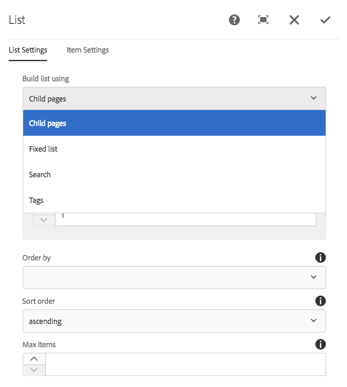

# Voorwaarden verbergen gebruiken {#using-hide-conditions}

De voorwaarden van de huid kunnen worden gebruikt om te bepalen als een componentenmiddel wordt teruggegeven of niet. Een voorbeeld hiervan zou zijn wanneer een sjabloonauteur de Core Component configureert [list, component](https://experienceleague.adobe.com/docs/experience-manager-core-components/using/wcm-components/list.html) in de [sjablooneditor](/help/sites-authoring/templates.md) en besluit de opties uit te schakelen om de lijst op onderliggende pagina&#39;s samen te stellen. Als u deze optie in het dialoogvenster Ontwerp uitschakelt, wordt een eigenschap zo ingesteld dat wanneer de component List wordt gerenderd, de voorwaarde hide wordt geëvalueerd en de optie om onderliggende pagina&#39;s weer te geven niet wordt weergegeven.

## Overzicht {#overview}

Dialoogvensters kunnen complex worden met talrijke opties voor de gebruiker, die slechts een fractie van de opties kan gebruiken die tot zijn beschikking staan. Dit kan leiden tot een overweldigende ervaring voor de gebruikersinterface.

Door huidenvoorwaarden te gebruiken, hebben de beheerders, de ontwikkelaars, en de super gebruikers een manier om middelen te verbergen die op een reeks regels worden gebaseerd. Met deze functie kunnen ze bepalen welke bronnen moeten worden weergegeven wanneer een auteur inhoud bewerkt.

>[!NOTE]
>
>Het verbergen van een middel dat op een uitdrukking wordt gebaseerd vervangt ACL geen toestemmingen. De inhoud blijft bewerkbaar, maar wordt niet weergegeven.

## Implementatie- en gebruiksgegevens {#implementation-and-usage-details}

`com.adobe.granite.ui.components.FilteringResourceWrapper` is verantwoordelijk voor het filteren van de bronnen op basis van het bestaan en de waarde van de `granite:hide` eigenschap, die zich in het te filteren veld bevindt. De uitvoering van `/libs/cq/gui/components/authoring/dialog/dialog.jsp` omvat een geval van `FilteringResourceWrapper.`

De implementatie maakt gebruik van de graniet [ELResolver-API](https://developer.adobe.com/experience-manager/reference-materials/6-5/granite-ui/api/jcr_root/libs/granite/ui/docs/server/el.html) en voegt een `cqDesign` aangepaste variabele via ExpressionCustomizer.

Hier zijn een paar voorbeelden van huidencondities op een ontwerpknoop die onder of onder wordt gevestigd `etc/design` of als een inhoudsbeleid.

```
${cqDesign.myProperty}
${!cqDesign.myProperty}
${cqDesign.myProperty == 'someText'}
${cqDesign.myProperty != 'someText'}
${cqDesign.myProperty == true}
${cqDesign.myProperty == true}
${cqDesign.property1 == 'someText' && cqDesign.property2 || cqDesign.property3 != 1 || header.myHeader}
```

Houd rekening met het volgende wanneer u de expressie hide definieert:

* Om geldig te zijn, moet het bereik waarin de eigenschap wordt gevonden worden uitgedrukt (bijvoorbeeld `cqDesign.myProperty`).
* Waarden zijn alleen-lezen.
* De functies (indien nodig) moeten beperkt blijven tot een bepaalde reeks die door de dienst wordt geleverd.

## Voorbeeld {#example}

Voorbeelden van huidenomstandigheden zijn te vinden in AEM en de [kerncomponenten](https://experienceleague.adobe.com/docs/experience-manager-core-components/using/introduction.html) in het bijzonder. Neem bijvoorbeeld de [lijstkerncomponent](https://experienceleague.adobe.com/docs/experience-manager-core-components/using/wcm-components/list.html).

[De sjablooneditor gebruiken](/help/sites-authoring/templates.md)kan de sjabloonauteur in het ontwerpdialoogvenster definiëren welke opties van de lijstcomponent beschikbaar zijn voor de auteur van de pagina. U kunt bijvoorbeeld instellen of de lijst een statische lijst moet zijn, of een lijst met onderliggende pagina&#39;s, een lijst met gecodeerde pagina&#39;s enzovoort, moet worden in- of uitgeschakeld.

Als een sjabloonauteur ervoor kiest de optie voor onderliggende pagina&#39;s uit te schakelen, wordt een ontwerpeigenschap ingesteld en wordt een voorwaarde voor verbergen aan de hand hiervan geëvalueerd. Hierdoor wordt de optie niet gerenderd voor de auteur van de pagina.

1. Standaard kan de auteur van de pagina de kerncomponent van de lijst gebruiken om een lijst samen te stellen met behulp van onderliggende pagina&#39;s door de optie **Onderliggende pagina&#39;s**.

   

1. In het dialoogvenster Ontwerpen van de kerncomponent van de lijst kan de sjabloonauteur de optie kiezen **Onderliggende niveaus uitschakelen** om te voorkomen dat de optie voor het genereren van een lijst op basis van onderliggende pagina&#39;s wordt weergegeven aan de auteur van de pagina.

   

1. Een beleidsknooppunt onder `/conf/we-retail/settings/wcm/policies/weretail/components/content/list` met een eigenschap `disableChildren` instellen op `true`.
1. De voorwaarde hide wordt gedefinieerd als de waarde van een `granite:hide` eigenschap op het knooppunt van de eigenschap dialog `/conf/we-retail/settings/wcm/policies/weretail/components/content/list`

   

1. De waarde van `disableChildren` uit de ontwerpconfiguratie en de expressie `${cqDesign.disableChildren}` evalueert aan `false`, wat betekent dat de optie niet wordt weergegeven als onderdeel van de component.

   U kunt de expressie hide weergeven als de waarde van het dialoogvenster `granite:hide` eigenschap [in GitHub hier](https://github.com/adobe/aem-core-wcm-components/blob/main/content/src/content/jcr_root/apps/core/wcm/components/list/v1/list/_cq_dialog/.content.xml#L40).

1. De optie **Onderliggende pagina&#39;s** wordt niet meer weergegeven voor de auteur van de pagina wanneer de component List wordt gebruikt.

   
