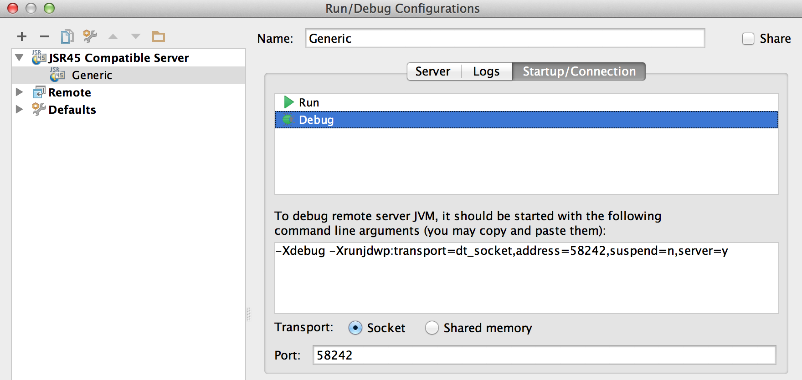

# Hoe te om AEM Projecten te ontwikkelen gebruikend IntelliJ IDEA{#how-to-develop-aem-projects-using-intellij-idea}

## Overzicht {#overview}

Om met AEM ontwikkeling op IntelliJ te beginnen, zijn de volgende stappen vereist.

Elk van hen wordt meer in detail uitgelegd in de rest van dit hoe-te.

* IntelliJ installeren
* Uw AEM instellen op basis van Maven
* JSP-ondersteuning voor IntelliJ in de Maven POM voorbereiden
* Importeer het Maven Project in IntelliJ

>[!NOTE]
>
>Deze handleiding is gebaseerd op de IntelliJ IDEA Ultimate Edition 12.1.4 en AEM 5.6.1.

### IntelliJ IDEA {#install-intellij-idea} installeren

Download IntelliJ IDEA van [de pagina Downloads bij JetBrains](https://www.jetbrains.com/idea/download/index.html).

Volg vervolgens de installatie-instructies op die pagina.

### Stel uw AEM in op basis van Maven {#set-up-your-aem-project-based-on-maven}

Stel vervolgens uw project in met Maven zoals beschreven in [Hoe kan ik AEM projecten bouwen met Apache Maven](/help/sites-developing/ht-projects-maven.md).

Om met AEM projecten in IntelliJ IDEA te beginnen, is de basisopstelling in [Aan de slag in 5 Minuten](https://maven.apache.org/guides/getting-started/maven-in-five-minutes.html) voldoende.

### JSP-ondersteuning voorbereiden voor IntelliJ IDEA {#prepare-jsp-support-for-intellij-idea}

IntelliJ IDEA kan ook ondersteuning bieden bij het werken met JSP, bijvoorbeeld

* tagbibliotheken automatisch invullen
* bewustzijn van objecten die worden gedefinieerd door `<cq:defineObjects />` en `<sling:defineObjects />`

Om dat te werken, volg de instructies op [hoe te met JSPs](/help/sites-developing/ht-projects-maven.md#how-to-work-with-jsps) in [hoe te AEM Projecten bouwen gebruikend Apache Maven](/help/sites-developing/ht-projects-maven.md).

### Het gemaakte project {#import-the-maven-project} importeren

1. Open **Import** dialoog in IntelliJ IDEA door

   * selecteren **Project importeren** op welkomstscherm als u nog geen project hebt geopend
   * selecteren **Bestand -> Project importeren** vanuit hoofdmenu

1. Selecteer in het dialoogvenster Importeren het POM-bestand van uw project.

   

1. Ga verder met de standaardinstellingen zoals weergegeven in het onderstaande dialoogvenster.

   

1. Ga door de volgende dialogen door te klikken **Next** en **Finish**.
1. U bent nu opstelling voor AEM Ontwikkeling gebruikend IntelliJ IDEA

   

### Fouten opsporen in JSP&#39;s met IntelliJ IDEA {#debugging-jsps-with-intellij-idea}

De volgende stappen zijn noodzakelijk voor het zuiveren JSPs met IntelliJ IDEA

* Opstelling een Facet van het Web in het Project
* Installeer de JSR45 steunstop in
* Een foutopsporingsprofiel configureren
* AEM configureren voor foutopsporingsmodus

#### Een webfacet instellen in het project {#set-up-a-web-facet-in-the-project}

IntelliJ IDEA moet begrijpen waar te om JSPs voor het zuiveren te vinden. Aangezien IDEA de `content-package-maven-plugin` montages niet kan interpreteren, moet dit manueel worden gevormd.

1. Naar **Bestand -> Projectstructuur**
1. Selecteer de module **Content**
1. Klik **+** boven de lijst met modules en selecteer **Web**
1. Als Folder van het Middel van het Web, selecteer `content/src/main/content/jcr_root subdirectory` van uw project zoals aangetoond in het hieronder ontsproten scherm.


#### Installeer de JSR45 steunstop {#install-the-jsr-support-plugin}

1. Ga naar **Plugins** ruit in de montages IntelliJ IDEA
1. Navigeer naar **JSR45 Integratie** Insteekmodule en selecteer het controlevakje naast het
1. Klik **Toepassen**
1. Start IntelliJ IDEA opnieuw op het verzoek om


#### Foutopsporingsprofiel {#configure-a-debug-profile} configureren

1. Ga naar **Uitvoeren -> Configuraties bewerken**
1. Druk op **+** en selecteer **JSR45 Remote**
1. Selecteer **Configureren** naast **Toepassingsserver** in het configuratiedialoogvenster en configureer een generieke server
1. Stel de startpagina in op een geschikte URL als u een browser wilt openen wanneer u de foutopsporing start
1. Verwijder alle **Voor lancering** taken als u vlt autosync gebruikt, of vorm aangewezen Gemaakt taken als u niet
1. Pas in het deelvenster **Opstarten/Verbinding** de poort indien nodig aan
1. Kopieer de opdrachtregelargumenten die IntelliJ IDEA voorstelt

 

#### AEM configureren voor foutopsporingsmodus {#configure-aem-for-debug-mode}

De laatste vereiste stap is AEM te beginnen met de JVM-opties die door IntelliJ IDEA worden voorgesteld.

U kunt dit doen door het AEM jar dossier direct te beginnen en deze opties toe te voegen, bijvoorbeeld met de volgende bevellijn:

`java -Xdebug -Xrunjdwp:transport=dt_socket,address=58242,suspend=n,server=y -Xmx1024m -XX:MaxPermSize=256M -jar cq-quickstart-5.6.1.jar`

U kunt deze opties ook toevoegen aan uw beginscript in `crx-quickstart/bin/start`, zoals hieronder wordt getoond.

```shell
# ...

# default JVM options
if [ -z "$CQ_JVM_OPTS" ]; then
 CQ_JVM_OPTS='-server -Xmx1024m -XX:MaxPermSize=256M -Djava.awt.headless=true'
fi

CQ_JVM_OPTS="$CQ_JVM_OPTS -Xdebug -Xrunjdwp:transport=dt_socket,address=58242,suspend=n,server=y"

# ...
```

#### Foutopsporing starten {#start-debugging}

U bent nu allen opstelling voor het zuiveren van uw JSPs in AEM.

1. Selecteer **Uitvoeren -> Foutopsporing -> Uw foutopsporingsprofiel**
1. Onderbrekingspunten instellen in de componentcode
1. Een pagina openen in uw browser


### Foutopsporingsbundels met IntelliJ IDEA {#debugging-bundles-with-intellij-idea}

De code in bundels kan worden gezuiverd gebruikend standaard generische verre zuivert verbinding. U kunt de [Jetbrain-documentatie bij foutopsporing op afstand](https://www.jetbrains.com/idea/webhelp/run-debug-configuration-remote.html) volgen.
