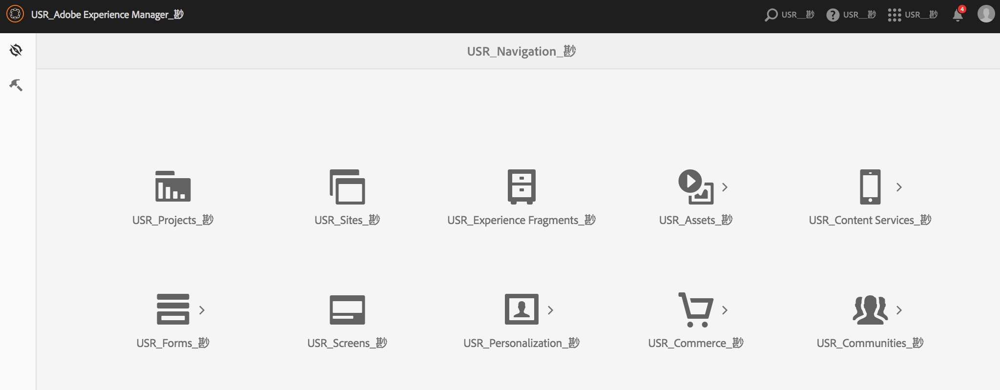
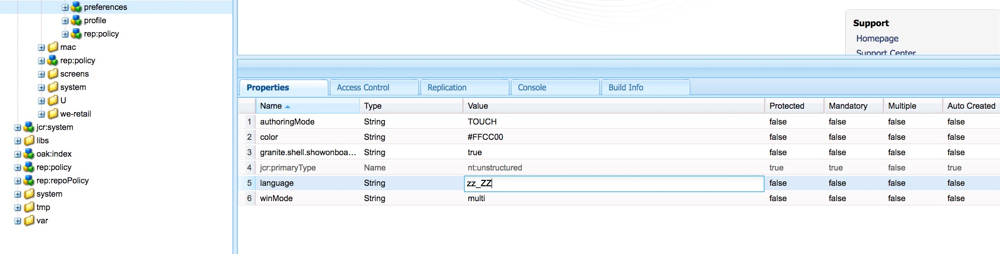

# Internationalisatie van UI-tekenreeksen {#internationalizing-ui-strings}

Met Java- en Javascript-API&#39;s kunt u tekenreeksen internationaliseren in de volgende typen bronnen:

* Java-bronbestanden.
* JSP-scripts.
* Javascript in client-side bibliotheken of in paginabron.
* Waarden van eigenschappen van JCR-knooppunten worden gebruikt in dialoogvensters en componentconfiguratie-eigenschappen.

Zie [Internationaliserende componenten](/help/sites-developing/i18n.md)voor een overzicht van het internationalisatie- en lokalisatieproces.

## Internationalisatie van tekenreeksen in Java en JSP-code {#internationalizing-strings-in-java-and-jsp-code}

Met het `com.day.cq.i18n` Java-pakket kunt u gelokaliseerde tekenreeksen weergeven in uw gebruikersinterface. De `I18n` klasse biedt de `get` methode waarmee gelokaliseerde tekenreeksen worden opgehaald uit het AEM-woordenboek. De enige vereiste parameter van de `get` methode is de letterlijke tekenreeks in de Engelse taal. Engels is de standaardtaal voor UI. In het volgende voorbeeld wordt het woord gelokaliseerd `Search`:

`i18n.get("Search");`

Het identificeren van de tekenreeks in de Engelse taal verschilt van gangbare internationalisatiekaders waar een id een tekenreeks identificeert en wordt gebruikt om bij uitvoering naar de tekenreeks te verwijzen. Het gebruik van de letterlijke Engelse tekenreeks biedt de volgende voordelen:

* Code is gemakkelijk te begrijpen.
* De tekenreeks in de standaardtaal is altijd beschikbaar.

### De taal van de gebruiker bepalen {#determining-the-user-s-language}

Er zijn twee manieren om de taal te bepalen die de gebruiker verkiest:

* Voor geverifieerde gebruikers bepaalt u de taal aan de hand van de voorkeuren in de gebruikersaccount.
* De landinstelling van de aangevraagde pagina.

Het taalbezit van de gebruikersrekening is de aangewezen methode omdat het betrouwbaarder is. Nochtans, moet de gebruiker worden het programma geopend om deze methode te gebruiken.

#### Het I18n Java-object maken {#creating-the-i-n-java-object}

De klasse I18n biedt twee constructors. Hoe u de aangewezen taal van de gebruiker bepaalt de te gebruiken aannemer.

Als u de tekenreeks wilt presenteren in de taal die in de gebruikersaccount is opgegeven, gebruikt u de volgende constructor (na het importeren `com.day.cq.i18n.I18n)`:

```java
I18n i18n = new I18n(slingRequest);
```

De constructor gebruikt de methode `SlingHTTPRequest` om de taalinstelling van de gebruiker op te halen.

Om de paginalandaal te gebruiken om de taal te bepalen, moet u eerst ResourceBundle voor de taal van de gevraagde pagina verkrijgen:

```java
Locale pageLang = currentPage.getLanguage(false);
ResourceBundle resourceBundle = slingRequest.getResourceBundle(pageLang);
I18n i18n = new I18n(resourceBundle);
```

#### Een tekenreeks internationaliseren {#internationalizing-a-string}

Gebruik de `get` methode van het `I18n` object om een tekenreeks te internationaliseren. De enige vereiste parameter van de `get` methode is de tekenreeks die moet worden geïnternationaliseerd. De tekenreeks komt overeen met een tekenreeks in een Vertaalwoordenboek. De methode get zoekt de tekenreeks op in het woordenboek en retourneert de vertaling voor de huidige taal.

Het eerste argument van de `get` methode moet aan de volgende regels voldoen:

* De waarde moet een letterlijke tekenreeks zijn. Een variabele van het type `String` is niet aanvaardbaar.
* De letterlijke tekenreeks moet op één regel worden uitgedrukt.
* De tekenreeks is hoofdlettergevoelig.

```xml
i18n.get("Enter a search keyword");
```

#### Vertaalhints gebruiken {#using-translation-hints}

Geef de [vertaalhint](/help/sites-developing/i18n-translator.md#adding-changing-and-removing-strings) van de geïnternationaliseerde tekenreeks op om onderscheid te maken tussen dubbele tekenreeksen in het woordenboek. Gebruik de tweede, optionele parameter van de `get` methode om de vertaalhint op te geven. De vertaalhint moet exact overeenkomen met de eigenschap Opmerking van het item in het woordenboek.

De woordenlijst bevat bijvoorbeeld `Request` tweemaal de tekenreeks: eenmaal als werkwoord en eenmaal als zelfstandig naamwoord. De volgende code bevat de vertaaltip als een argument in de `get` methode:

```java
i18n.get("Request","A noun, as in a request for a web page");
```

#### Inclusief variabelen in gelokaliseerde zinnen {#including-variables-in-localized-sentences}

Neem variabelen op in de gelokaliseerde tekenreeks om contextuele betekenis in een zin op te nemen. Nadat u zich bijvoorbeeld hebt aangemeld bij een webtoepassing, wordt op de homepage het bericht &quot;Welkom terug Administrator&quot; weergegeven. U hebt 2 berichten in uw Postvak IN.&quot; De paginacontext bepaalt de gebruikersnaam en het aantal berichten.

[In het woordenboek](/help/sites-developing/i18n-translator.md#adding-changing-and-removing-strings)worden de variabelen in tekenreeksen weergegeven als gehaakte indexen. Geef de waarden van de variabelen op als argumenten van de `get` methode. De argumenten worden na de vertaalhint geplaatst, en de indexen beantwoorden aan de orde van de argumenten:

```xml
i18n.get("Welcome back {0}. You have {1} messages.", "user name, number of messages", user.getDisplayName(), numItems);
```

De geïnternationaliseerde tekenreeks en de vertaalhint moeten exact overeenkomen met de tekenreeks en de opmerking in het woordenboek. U kunt de lokalisatietip weglaten door een `null` waarde op te geven als tweede argument.

#### Het gebruiken van Statische krijgt methode {#using-the-static-get-method}

De `I18N` klasse definieert een statische `get` methode die nuttig is wanneer u een klein aantal tekenreeksen moet lokaliseren. Naast de parameters van de `get` methode van een voorwerp, vereist de statische methode het `SlingHttpRequest` voorwerp of het `ResourceBundle` voorwerp dat u gebruikt, volgens hoe u de aangewezen taal van de gebruiker bepaalt:

* Gebruik de taalvoorkeur van de gebruiker: Verstrek SlingHttpRequest als eerste parameter.

   `I18n.get(slingHttpRequest, "Welcome back {}. You have {} messages.", "user name, number of messages", user.getDisplayName(), numItems);`
* De paginataal gebruiken: Verstrek ResourceBundle als eerste parameter.

   `I18n.get(resourceBundle,"Welcome back {}. You have {} messages.", "user name, number of messages", user.getDisplayName(), numItems);`

### Tekenreeksen internationaliseren in JavaScript-code {#internationalizing-strings-in-javascript-code}

Met de Javascript-API kunt u tekenreeksen lokaliseren op de client. Net als bij [Java- en JSP](#internationalizing-strings-in-java-and-jsp-code) -code kunt u met de Javascript API tekenreeksen identificeren die u kunt lokaliseren, lokalisatietips opgeven en variabelen opnemen in de gelokaliseerde tekenreeksen.

De `granite.utils` clientbibliotheekmap [](/help/sites-developing/clientlibs.md) biedt de Javascript API. Als u de API wilt gebruiken, neemt u deze clientbibliotheekmap op de pagina op. Localisatiefuncties gebruiken de `Granite.I18n` naamruimte.

Voordat u gelokaliseerde tekenreeksen voorstelt, moet u de landinstelling instellen met de `Granite.I18n.setLocale` functie. De functie vereist de taalcode van de landinstelling als argument:

```
Granite.I18n.setLocale("fr");
```

Als u een gelokaliseerde tekenreeks wilt presenteren, gebruikt u de `Granite.I18n.get` functie:

```
Granite.I18n.get("string to localize");
```

In het volgende voorbeeld wordt de tekenreeks &quot;Welcome back&quot; geïnternationaliseerd:

```
Granite.I18n.setLocale("fr");
Granite.I18n.get("string to localize", [variables], "localization hint");
```

De functieparameters verschillen van de Java I18n.get-methode:

* De eerste parameter is de letterlijke tekenreeks die moet worden gelokaliseerd.
* De tweede parameter is een array van waarden die in de letterlijke tekenreeks moeten worden geïnjecteerd.
* De derde parameter is de lokalisatiehint.

In het volgende voorbeeld wordt Javascript gebruikt om de welkomstbeheerder te lokaliseren. U hebt 2 berichten in uw Postvak IN.&quot; zin:

```
Granite.I18n.setLocale("fr");
Granite.I18n.get("Welcome back {0}. You have {1} new messages in your inbox.", [username, numMsg], "user name, number of messages");
```

### Internationalisatie tekenreeksen van JCR-knooppunten {#internationalizing-strings-from-jcr-nodes}

UI-tekenreeksen zijn vaak gebaseerd op eigenschappen van JCR-knooppunten. De `jcr:title` eigenschap van een pagina wordt bijvoorbeeld doorgaans gebruikt als de inhoud van het `h1` element in de paginacode. De `I18n` klasse biedt de `getVar` methode voor het lokaliseren van deze tekenreeksen.

In het volgende voorbeeld haalt het JSP-script de `jcr:title` eigenschap op van de gegevensopslagruimte en wordt de gelokaliseerde tekenreeks op de pagina weergegeven:

```java
<% title = properties.get("jcr:title", String.class);%>
<h1><%=i18n.getVar(title) %></h1>
```

#### Vertaaltips opgeven voor JCR-knooppunten {#specifying-translation-hints-for-jcr-nodes}

Net als [vertaalhints in de Java API](#using-translation-hints)kunt u vertaalhints opgeven om dubbele tekenreeksen in het woordenboek te onderscheiden. Geef de vertaaltip op als een eigenschap van het knooppunt dat de geïnternationaliseerde eigenschap bevat. De naam van de eigenschap hint bestaat uit de naam van de geïnternationaliseerde eigenschapnaam met het `_commentI18n` achtervoegsel:

`${prop}_commentI18n`

Een `cq:page` knooppunt bevat bijvoorbeeld de eigenschap jcr:title die wordt gelokaliseerd. De hint wordt opgegeven als de waarde van de eigenschap met de naam jcr:title_commentI18n.

### Bedekking voor internationalisatie testen {#testing-internationalization-coverage}

Test of u alle tekenreeksen in uw gebruikersinterface hebt geïnternationaliseerd. Als u wilt zien welke tekenreeksen worden bestreken, stelt u de gebruikerstaal in op zz_ZZ en opent u de gebruikersinterface in de webbrowser. De geïnternationaliseerde tekenreeksen worden weergegeven met een sectie in de volgende indeling:

`USR_*Default-String*_尠`

In de volgende afbeelding ziet u de stub-vertaling voor de AEM-startpagina:



Om de taal voor de gebruiker te plaatsen, vorm het taalbezit van de voorkeurenknoop voor de gebruikersrekening.

Het voorkeurenknooppunt van een gebruiker heeft een pad als volgt:

`/home/users/<letter>/<hash>/preferences`



