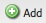
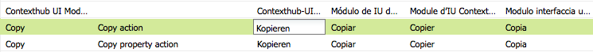

# Woordenboeken beheren met Vertaler{#using-translator-to-manage-dictionaries}

AEM biedt een console voor het beheer van de verschillende vertalingen van teksten die worden gebruikt in de gebruikersinterface van componenten. Deze console is beschikbaar op

`https://<hostname>:<port-number>/libs/cq/i18n/translator.html`

Gebruik het gereedschap Vertaler voor het beheren van Engelse tekenreeksen en de bijbehorende vertalingen. De woordenboeken worden gemaakt in de opslagplaats, bijvoorbeeld /apps/mijnproject/i18n.

Het gereedschap Vertaler en de woordenboeken die u beheert, zijn bedoeld voor het weergeven van de gebruikersinterface van de component in verschillende talen. Als u pagina of door de gebruiker gegenereerde inhoud wilt vertalen, raadpleegt u [Inhoud vertalen voor meertalige sites](/help/sites-administering/translation.md) en [Vertaling van door de gebruiker gegenereerde inhoud](/help/communities/translate-ugc.md).

>[!CAUTION]
>
>Bewerk alleen woordenboeken die zijn gemaakt voor uw project en die zich onder `/apps`.
>
>AEM systeemwoordenboeken zijn ook beschikbaar in dit hulpmiddel. Wijzig de AEM systeemwoordenboeken niet omdat dit problemen kan veroorzaken met de interface van de AEM. Ook, kunnen de veranderingen bij verbetering worden verloren. AEM systeemwoordenboeken bevinden zich onder `/libs`.

>[!NOTE]
>
>Hoewel het Vertaalprogramma een klassieke interface UI heeft, wordt het gebruikt voor vertaling van uitdrukkingen ongeacht de interface waar die uitdrukkingen worden gevonden.

De vertaler geeft een overzicht van de teksten die in AEM met de verschillende taalvertalingen naast elkaar worden gebruikt:


U kunt de Engelse en vertaalde teksten zoeken, filteren en bewerken. U kunt woordenboeken ook exporteren naar de XLIFF-indeling om ze te vertalen en de vertalingen vervolgens weer importeren in de woordenboeken.

Het is ook mogelijk om de i18n-woordenboeken vanuit deze console toe te voegen aan een vertaalproject. U kunt een project maken of toevoegen aan een bestaand project.

1. Klikken **Woordenboek omzetten**.

   

1. Selecteer de optie Maken of Toevoegen, afhankelijk van uw behoefte. Er wordt een dialoogvenster geopend.

   

1. Vul de velden naar wens in en klik op OK. 

1. U kunt nu op **OK** of raadpleeg het doelwoordenboek.

   >[!NOTE]
   >
   >Voor meer informatie over vertaalprojecten leest u [Vertaalprojecten beheren](/help/sites-administering/tc-manage.md).

## Woordenboek maken {#creating-a-dictionary}

Maak een woordenboek voor het beheer van uw gelokaliseerde UI-tekenreeksen. Nadat u een woordenboek hebt gemaakt, kunt u het gereedschap Vertaling gebruiken om het te beheren.

1. Met CRXDE Lite voegt u het hoofdknooppunt toe ( `sling:Folder`) voor uw nieuwe woordenboek als structuur om de taaldefinities te houden:

   ` /apps/<projectName>/i18n`

   Bijvoorbeeld: `/apps/myProject/i18n`

1. Voeg de vereiste taalstructuur toe onder deze hoofdmap. Bijvoorbeeld:

   ```shell
   /apps/myProject/i18n [sling:Folder]
       - de.json [nt:file] [mix:language]
           + jcr:language = de
       - fr.json [nt:file] [mix:language]
           + jcr:language = fr
   ```

   >[!NOTE]
   >
   >Dit is de structuur van de [Sling i18n-module](https://sling.apache.org/site/internationalization-support.html).

1. Laad de vertaler en het woordenboekpad opnieuw (bijvoorbeeld `/apps/myProject/i18n`) is beschikbaar in de vervolgkeuzelijst op de werkbalk. Selecteer deze optie om tekenreeksen en de bijbehorende vertalingen toe te voegen.

   >[!NOTE]
   >
   >De vertaler slaat alleen vertalingen op voor talen die daadwerkelijk onder het pad aanwezig zijn (bijvoorbeeld `/apps/myProject/i18n`).
   >
   >Zorg ervoor dat deze overeenkomen met de talen die worden weergegeven in het raster.

## Woordenboektekenreeksen beheren {#managing-dictionary-strings}

Gebruik het gereedschap Vertalen om de tekenreeksen in uw woordenboeken te beheren. U kunt Engelse tekenreeksen toevoegen, wijzigen en verwijderen en ook vertaalde tekenreeksen opgeven.

>[!CAUTION]
>
>Bewerk alleen woordenboeken die zijn gemaakt voor uw project en die zich onder `/apps`.
>
>Wijzig de AEM systeemwoordenboeken niet omdat dit problemen kan veroorzaken met de interface van de AEM. Ook, kunnen de veranderingen bij verbetering worden verloren. AEM systeemwoordenboeken bevinden zich onder `/libs`.

### Tekenreeksen toevoegen, wijzigen en verwijderen {#adding-changing-and-removing-strings}

Voeg Engelse tekenreeksen toe aan een woordenboek dat door uw component is geïnternationaliseerd. Voeg alleen tekenreeksen toe die zijn geïnternationaliseerd, zodat u geen bronnen verspilt door tekenreeksen te vertalen die niet worden gebruikt.

De tekenreeksen die u aan een woordenboek toevoegt, moeten exact overeenkomen met de tekenreeks die in de code is opgegeven. Als de standaard Engelse tekenreeks die in de code wordt gebruikt, niet overeenkomt met de Engelse tekenreeks in een woordenboek, wordt de vertaalde tekenreeks niet weergegeven in de gebruikersinterface wanneer dat nodig is. Tekenreeksen zijn hoofdlettergevoelig.

**Vertaaltips opgeven**

Gebruik de eigenschap Commenet van de woordenboektekenreeks om de vertaler informatie te geven om de betekenis van de tekenreeks te verduidelijken. Doorgaans helpt de interface gebruikers de betekenis van dubbelzinnige woorden te bepalen. De vertaler ziet de tekenreeks echter niet binnen de context van de gebruikersinterface. De vertaalhint verwijdert de dubbelzinnigheid. Een opmerking helpt de vertaler bijvoorbeeld te begrijpen dat het Engelse woord Request wordt gebruikt als zelfstandig naamwoord in plaats van als werkwoord.

Vertaalhints maken ook onderscheid tussen tekenreeksen die identiek zijn en verschillende betekenissen hebben. Het woord Zoeken kan bijvoorbeeld een zelfstandig naamwoord of werkwoord zijn, waarvoor twee items in het woordenboek met twee verschillende vertaaltips moeten worden gezocht. De code die om het koord verzoekt omvat ook de vertaalwenk zodat het correcte koord in UI wordt gebruikt.

**Inclusief geïndexeerde variabelen**

Neem variabelen op in de gelokaliseerde tekenreeks om contextuele betekenis in een zin op te nemen. Nadat u zich bijvoorbeeld hebt aangemeld bij een webtoepassing, wordt op de homepage het bericht &quot;Welkom terug Administrator&quot; weergegeven. U hebt 2 berichten in uw Postvak IN.&quot; De paginacontext bepaalt de gebruikersnaam en het aantal berichten.

Om variabelen in het gelokaliseerde koord te omvatten, plaats gehaakte indexen bij de plaats van de variabelen in het eerste argument van de methode get. Gebruik de lokalisatiehint om de waarden te beschrijven. De vertaler moet de betekenis van de variabelen begrijpen omdat de verschillende talen verschillende zinsstructuren gebruiken.

Let op: [de code die om het vertaalde koord verzoekt](/help/sites-developing/i18n-dev.md#including-variables-in-localized-sentences) bevat waarden voor de geïndexeerde variabelen volgens de context.

De volgende tekenreeks wordt bijvoorbeeld weergegeven wanneer een gebruiker zich aanmeldt bij een website en wordt opgenomen in het woordenboek:

`Welcome back {0}. You have {1} messages.`

In de volgende opmerking worden de variabelen beschreven:

`{0} = the user name, {1} = the number of items in the user's inbox`

**Tekenreeksen wijzigen**

Engelse tekenreeksen wijzigen of verwijderen wanneer deze worden gewijzigd of verwijderd in de code. Wanneer u een tekenreeks wijzigt, blijft de oorspronkelijke tekenreeks behouden en wordt een nieuwe tekenreeks gemaakt die de wijziging weerspiegelt. Voordat u een tekenreeks verwijdert, moet u ervoor zorgen dat deze door geen enkele code wordt gebruikt.

Gebruik de volgende procedure om een tekenreeks toe te voegen.

1. Selecteer in de vervolgkeuzelijst Woordenboeken het woordenboek waaraan u een tekenreeks toevoegt. In het vervolgkeuzemenu worden woordenboeken weergegeven door hun pad in de betreffende map.
1. Klik boven de tabel Tekenreeksen en vertalingen op Toevoegen.

   

1. Typ de Engelse tekenreeks in het vak Tekenreeks van het dialoogvenster Tekenreeks toevoegen. Typ indien nodig een vertaaltip voor de vertaler in het vak Opmerking.
1. Klik op OK.
1. Klik op Opslaan.

   

Gebruik de volgende procedure om een tekenreeks in een woordenboek te wijzigen.

1. Selecteer in het vervolgkeuzemenu Woordenboeken het woordenboek dat de tekenreeks bevat die u wilt wijzigen.
1. Dubbelklik op de tekenreeks die u wilt wijzigen.
1. Selecteer Tekenreeks of Opmerking wijzigen in het dialoogvenster Tekenreeks bewerken (er wordt een kopie gemaakt).

   

1. Wijzig de tekenreeks of de opmerking en klik op OK.
1. Klik op Opslaan.

   

Gebruik de volgende procedure om een tekenreeks uit een woordenboek te verwijderen.

1. Selecteer in het vervolgkeuzemenu Woordenboeken het woordenboek waaruit u een tekenreeks verwijdert.
1. Klik verwijderen.

   

1. Klik op Opslaan.

   

### Zoeken naar tekenreeksen {#searching-for-strings}

De zoekbalk onder aan het gereedschap Vertaler bevat opties voor tekenreeksselectie:

* **Filteren op tekst:** Een patroon dat overeenkomt met de Engelse tekenreeks, opmerking of vertalingen. Alleen items die overeenkomen met het patroon of een deel ervan, worden weergegeven in de tabel.
* **Wijzigingen: Willekeurig, Gewijzigd, Nieuw, Verwijderd:** Items weergeven die zijn gewijzigd en niet zijn opgeslagen.

   * Willekeurig: items tonen die zijn gewijzigd, toegevoegd of verwijderd.
   * Gewijzigd: items tonen die zijn gewijzigd.
   * Nieuw: items tonen die zijn toegevoegd.
   * Verwijderd: items tonen die moeten worden verwijderd.
   * Meerdere selecties: items weergeven die alle geselecteerde eigenschappen hebben.

* **Heeft opmerking**: Toon punten die commentaren voor vertalers hebben.
* **Ontbrekende vertalingen:** Toon punten waar minstens één taal geen vertaling heeft.


1. Selecteer de filteropties op de zoekbalk.
1. Klik op Filter om met de opties te filteren.
1. Klik op Wissen om de filters te verwijderen en alle items in het woordenboek weer te geven.

### Vertaalde tekenreeksen bewerken {#editing-translated-strings}

Nadat u de Engelse tekenreeks aan een woordenboek hebt toegevoegd, kunt u vertalingen van de tekenreeks toevoegen. U kunt [het woordenboek exporteren](/help/sites-developing/i18n-translator.md#exporting-a-dictionary) om de vertaling door een derde te laten vertalen.

1. Selecteren [uw projectspecifiek woordenboek](#creating-a-dictionary) zoals het het pad in de opslagplaats met de vertalingen aangeeft. Selecteer bijvoorbeeld **Woordenboeken** als:

   `/apps/myProject/i18n`

   >[!CAUTION]
   >
   >Bewerk alleen woordenboeken die zijn gemaakt voor uw project en die zich onder `/apps`.
   >
   >AEM systeemwoordenboeken zijn ook beschikbaar in dit hulpmiddel. Wijzig de AEM systeemwoordenboeken niet omdat dit problemen kan veroorzaken met de interface van de AEM. Ook, kunnen de veranderingen bij verbetering worden verloren. AEM systeemwoordenboeken bevinden zich onder `/libs`.

1. Als u de vertaalde teksten voor een van de tekenreeksen wilt bewerken, kunt u:

   * Dubbelklik op de gewenste taal voor de vereiste tekenreeks om die ene tekst te bewerken:

   

   * Dubbelklik op de knop **String** of **Opmerking** velden voor de vereiste tekenreeks om de **Tekenreeks bewerken** , bewerkt u de gewenste vertaling(en) en klikt u vervolgens op **OK** om het dialoogvenster te sluiten:

   

1. Klikken **Opslaan** in de werkbalk om uw wijzigingen vast te leggen.

   >[!NOTE]
   >
   >Klikken op **Opnieuw instellen en vernieuwen** (in plaats van **Opslaan**) worden eventuele wijzigingen in eerdere teksten ongedaan gemaakt.

## Vertalers van derden gebruiken {#using-third-party-translators}

Ter ondersteuning van het gebruik van vertaalservices van derden kunt u met het gereedschap Vertaling woordenboeken exporteren en importeren.

### Woordenboek exporteren {#exporting-a-dictionary}

Exporteer een woordenboek naar een XLIFF-bestand, zodat een service van derden de woordenboektekenreeksen kan vertalen.

* Exporteer een woordenboek en neem het Engels en de vertaalde termen voor een taal op.
* Exporteer enkele of alle Engelse tekenreeksen.

Wanneer u een XLIFF-bestand exporteert en een taal opneemt, moet de knooppuntstructuur van het woordenboek in de opslagplaats die taal bevatten. Als de taal niet is opgenomen, treden fouten op. Als u bijvoorbeeld het Franse XLIFF-bestand wilt exporteren, moet de woordenboekmap de map `mix:language` onderliggende node benoemd `fr`. (Zie [Woordenboek maken](/help/sites-developing/i18n-translator.md#creating-a-dictionary).)

Gebruik de volgende procedure om een XLIFF-bestand voor een bepaalde taal te exporteren.

1. Het gereedschap Vertalen openen `http://<host>:<port>/libs/cq/i18n/translator.html`
1. Gebruik het vervolgkeuzemenu Woordenboeken om het woordenboek te selecteren dat u wilt exporteren.
1. Klik op Exporteren > Volledig exporteren *XX* Xliff-opties, waarbij *XX* de tweeletterige taalcode zoals DE of FR.

   Het XLIFF-bestand wordt geopend in een nieuw tabblad of venster.

1. Met de opdrachten van de webbrowser slaat u de pagina op als een bestand op uw bestandssysteem, bijvoorbeeld Bestand > Pagina opslaan als.

Gebruik de volgende procedure om alle of sommige van alleen de Engelse tekenreeksen te exporteren.

1. Open het gereedschap Vertalen. `http://<host>:<port>/libs/cq/i18n/translator.html`
1. Gebruik het vervolgkeuzemenu Woordenboeken om het woordenboek te selecteren dat u wilt exporteren.
1. Als u een subset van de tekenreeksen exporteert, selecteert u de items in het woordenboek die u wilt exporteren. Als u geen items selecteert, worden alle items geëxporteerd.
1. Klik op Exporteren > Selectie exporteren als XLIFF (alleen tekenreeksen).
1. Kopieer de tekst in het dialoogvenster dat verschijnt en plak deze in een tekstbestand.

### Woordenboek importeren {#importing-a-dictionary}

Importeer een XLIFF-bestand in een woordenboek om het woordenboek te vullen. Als het woordenboek een vertaling voor een Engelse tekenreeks bevat en het XLIFF-bestand een andere vertaling voor dezelfde tekenreeks bevat, wordt de woordenboekvertaling vervangen.

1. Het gereedschap Vertalen openen `http://<host>:<port>/libs/cq/i18n/translator.html`
1. Klik op Importeren > XLIFF-vertalingen.
1. Selecteer het te importeren bestand en klik op OK.

## Ondersteunde talen beheren {#managing-supported-lanuages}

Voeg of verwijder talen toe die het hulpmiddel van de Vertaling steunt en die aan gebruikers van uw Web-pagina&#39;s worden verstrekt.

### Talen wijzigen die in de tabel met woordenboeken worden vermeld {#changing-languages-listed-in-the-dictionary-table}

Het gereedschap Vertaler bevat de volgende talen in de woordenlijst:

* de - Duits
* fr - Frans
* it - Italiaans
* es - Spaans
* ja - Japans
* pt-br - Braziliaans Portugees
* zh-cn - Vereenvoudigd Chinees
* zh-tw - Traditioneel Chinees (beperkte ondersteuning)
* ko-kr - Koreaans

Gebruik de volgende procedure om talen toe te voegen of te verwijderen.

1. Maak een knooppunt met CRXDE Lite:

   `/etc/languages`

1. Voor deze knoop, creeer een bezit:

   * **Naam**: `languages`
   * **Type**: `Multi-String`
   * **Waarde**: de lijst met talen die u wilt weergeven. Bijvoorbeeld:

      * fr
      * es

   >[!NOTE]
   >
   >De taalcodes moeten in kleine letters worden geschreven.

1. Klikken **Alles opslaan** in CRXDE Lite en laad de vertaler opnieuw. Het raster wordt bijgewerkt om de gedefinieerde talen weer te geven.

   >[!NOTE]
   >
   >De vertaler slaat alleen vertalingen op voor daadwerkelijk gebruikte talen [aanwezig in het woordenboek](#creating-a-dictionary) (dus onder het woordenboekpad, bijvoorbeeld `/apps/myProject/i18n`).
   >
   >Zorg ervoor dat deze overeenkomen met de talen die worden weergegeven in het raster.

### Talen beschikbaar maken voor auteurs {#making-languages-available-to-authors}

Nadat u een woordenboek hebt gedefinieerd voor een taal die nieuw is voor uw AEM-exemplaar, moet u deze beschikbaar stellen voor selectie door de auteurs (bijvoorbeeld voor gebruik in **Voorkeuren**):

1. De lijst met beschikbare talen in **Voorkeuren** van de **Beveiliging** console:

   1. Maak een bedekking in de toepassingscode voor:

      ```
              /libs/cq/security/widgets/source/widgets/security/Preferences.js
       and update as required.
      ```

1. De taal beschikbaar stellen in **Voorkeuren** van de **Websites** -console die u nodig hebt om de volgende wijzigingen in uw toepassing aan te brengen:

   1. Maak een bedekking voor de structuur onder:

      `/libs/cq/security/content/tools/userProperties`

   1. Werk de taallijst onder in de overlay bij:

      `items/common/items /lang/options`

1. Sla alles op en laad de juiste console opnieuw.

### Taalnamen en standaardlanden wijzigen {#changing-language-names-and-default-countries}

Verschillende landen gebruiken dezelfde taal, bijvoorbeeld de Verenigde Staten, het Verenigd Koninkrijk en Australië, allemaal Engels. Dit wordt aangegeven met een code die zowel de taal als het land aangeeft, zoals `en_US`, `en_GB` en `en_AU`.

De standaardlanden worden gebruikt wanneer het tonen van vlaggen (bijvoorbeeld, in de dialoog van het taalexemplaar), zij worden gebruikt om het land voor een taalcode op te lossen.

>[!NOTE]
>
>Voor lokalisaties die door de bovenstaande vertaler worden beheerd, werkt alleen de exacte taal. Als het taalvoorkeurskeuzemenu wordt gebruikt `en_uk`moet er een `en_uk` in de opslagplaats.

De standaarddefinities wijzigen:

1. Een taallijst wordt opgeslagen onder:

   `/libs/wcm/core/resources/languages`

   Bedek dit door het te kopiëren naar:

   `/apps/wcm/core/resources/languages`

   Vervolgens wijzigt of verlengt u de lijst daar. De eigenschap `defaultCountry` op een taalknooppunt (bijvoorbeeld `ja`) moet de volledige code bevatten, zoals `ja_jp`, die `jp` als het standaardland voor de taal `ja`.

1. Werk de **WCM-taalbeheer voor CQ**.

   * **Taallijst**:

     Het pad naar de taallijst in de opslagplaats. Stel deze in op de locatie die wordt gebruikt voor bedekking:

     ```
            /apps/wcm/core/resources/languages
     ```

   U kunt dit doen gebruikend de Console van het Web OSGi:

   ```shell
   https://<hostname>:<port-number>/system/console/configMgr/com.day.cq.wcm.core.impl.LanguageManagerImpl
   ```

## Woordenboeken publiceren {#publishing-dictionaries}

Neem uw woordenboeken op in het releasebeheerproces van uw AEM toepassingen. Neem bijvoorbeeld het woordenboek op in het inhoudspakket van uw toepassing voor implementatie op de publicatieinstantie. Deze strategie biedt de volgende voordelen:

* Er zijn woordenboeken beschikbaar voor componenten in de publicatieomgeving.
* Wijzigingen in de UI-tekenreeksen van componenten worden samen met de bijgewerkte vertalingen geïmplementeerd.

Ook het testen van woordenboektekenreeksen moet worden uitgevoerd als onderdeel van de normale ontwikkelingscyclus van software.

>[!NOTE]
>
>Gebruik geen normale publicatiefunctionaliteit, of replicatie, voor woordenboeken. In plaats daarvan moeten woordenboeken op dezelfde manier worden behandeld als code en configuratie. Dit omvat het gebruiken van broncontrole om veranderingen te volgen, en het gebruiken van inhoudspakketten om veranderingen op auteur toe te passen en te publiceren.

>[!NOTE]
>
>Als u Dispatcher gebruikt, moet u [ongeldige pagina&#39;s in cache](https://helpx.adobe.com/experience-manager/dispatcher/using/page-invalidate.html) om nieuwe dicationaire tekenreeksen op te nemen in gerenderde componenttekenreeksen.
