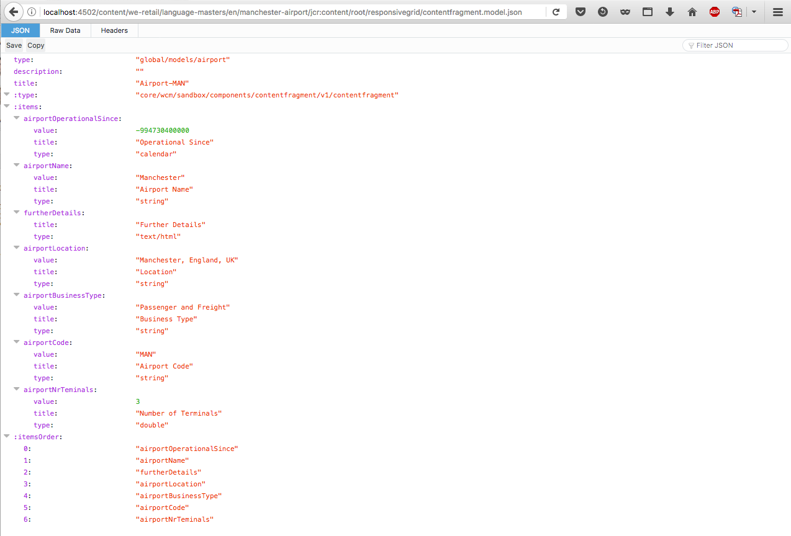

# JSON-exportfunctie voor services voor inhoud{#json-exporter-for-content-services}

AEM Content Services zijn ontworpen om de beschrijving en levering van inhoud in of vanuit AEM te veralgemenen, waarbij de aandacht niet op webpagina&#39;s wordt gevestigd.

Zij verstrekken de levering van inhoud aan kanalen die niet traditionele AEM Web-pagina&#39;s zijn, gebruikend gestandaardiseerde methodes die door om het even welke cliënt kunnen worden gebruikt. Deze kanalen kunnen zijn:

* [Toepassingen voor één pagina](spa-walkthrough.md)
* Systeemeigen mobiele toepassingen
* andere kanalen en aanraakpunten buiten AEM

Met inhoudsfragmenten die gestructureerde inhoud gebruiken, kunt u de inhoudsdiensten verlenen door de exporteur te gebruiken JSON om de inhoud van om het even welke AEM pagina in het formaat van het JSON gegevensmodel te leveren. Deze methode kan vervolgens door uw eigen toepassingen worden gebruikt.

>[!NOTE]
>
>De hier beschreven functionaliteit is beschikbaar voor alle Core Components aangezien [release 1.1.0 van de Core Components](https://experienceleague.adobe.com/docs/experience-manager-core-components/using/introduction.html).

## JSON-exportfunctie met kerncomponenten van inhoudsfragment {#json-exporter-with-content-fragment-core-components}

Met de AEM JSON-exportfunctie kunt u de inhoud van elke AEM pagina leveren in de indeling van het JSON-gegevensmodel. Deze methode kan vervolgens door uw eigen toepassingen worden gebruikt.

Binnen AEM wordt de levering bereikt met de kiezer `model` en `.json` extensie.

`.model.json`

1. Bijvoorbeeld een URL zoals:

   ```shell
   http://localhost:4502/content/we-retail/language-masters/en.model.json
   ```

1. Levert inhoud zoals:

   

U kunt de inhoud van een gestructureerd inhoudsfragment ook leveren door dit specifiek te activeren.

Het volledige pad naar het fragment gebruiken (als `jcr:content`), bijvoorbeeld met een achtervoegsel zoals

`.../jcr:content/root/responsivegrid/contentfragment.model.json`

De pagina kan één inhoudsfragment of meerdere componenten van verschillende typen bevatten. U kunt mechanismen zoals lijstcomponenten ook gebruiken om automatisch naar relevante inhoud te zoeken.

* Bijvoorbeeld een URL zoals:

  ```shell
  http://localhost:4502/content/we-retail/language-masters/en/manchester-airport/jcr:content/root/responsivegrid/contentfragment.model.json
  ```

* Levert inhoud zoals:

  

  >[!NOTE]
  >
  >U kunt [uw eigen componenten aanpassen](/help/sites-developing/json-exporter-components.md) om deze gegevens te openen en te gebruiken.

  >[!NOTE]
  >
  >Hoewel geen standaardimplementatie, [meerdere kiezers worden ondersteund,](json-exporter-components.md#multiple-selectors) maar `model` moet de eerste zijn.

### Aanvullende informatie {#further-information}

Zie ook:

* Elementen HTTP-API

   * [Elementen HTTP-API](/help/assets/mac-api-assets.md)

* Modellen voor verkopen:

   * [Sling Models - Associerend een modelklasse met een middeltype sinds 130](https://sling.apache.org/documentation/bundles/models.html#associating-a-model-class-with-a-resource-type-since-130)

* AEM met JSON:

   * [Pagina-informatie ophalen in JSON-indeling](/help/sites-developing/pageinfo.md)

## Verwante documentatie {#related-documentation}

Zie voor meer informatie:

* De [Het onderwerp Inhoudsfragmenten in de gebruikershandleiding voor middelen](/help/assets/content-fragments/content-fragments.md)

* [Modellen van inhoudsfragmenten](/help/assets/content-fragments/content-fragments-models.md)
* [Ontwerpen met inhoudsfragmenten](/help/sites-authoring/content-fragments.md)
* [JSON-export inschakelen voor een component](/help/sites-developing/json-exporter-components.md)

* [Kernonderdelen](https://experienceleague.adobe.com/docs/experience-manager-core-components/using/introduction.html) en de [Component Inhoudsfragment](https://experienceleague.adobe.com/docs/experience-manager-core-components/using/wcm-components/content-fragment-component.html)
