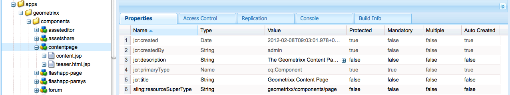

# Paginasjablonen - statisch{#page-templates-static}

Een malplaatje wordt gebruikt om een Pagina tot stand te brengen en bepaalt welke componenten binnen het geselecteerde werkingsgebied kunnen worden gebruikt. Een sjabloon is een hiërarchie van knooppunten die dezelfde structuur heeft als de pagina die moet worden gemaakt, maar zonder daadwerkelijke inhoud.

Elke Malplaatje stelt u met een selectie van componenten beschikbaar voor gebruik voor.

* De malplaatjes worden opgebouwd van [&#x200B; Componenten &#x200B;](/help/sites-developing/components.md);
* Componenten gebruiken widgets en staan toegang tot deze widgets toe. Deze worden gebruikt om de inhoud te renderen.

>[!NOTE]
>
>[&#x200B; Bewerkbare malplaatjes &#x200B;](/help/sites-developing/page-templates-editable.md) zijn ook beschikbaar en zijn het geadviseerde type van malplaatjes voor de meeste flexibiliteit en de nieuwste eigenschappen.

## Eigenschappen en onderliggende knooppunten van een sjabloon {#properties-and-child-nodes-of-a-template}

Een sjabloon is een knooppunt van het type cq:Template en heeft de volgende eigenschappen en onderliggende knooppunten:

<table>
 <tbody>
  <tr>
   <td><strong>Naam   </strong></td>
   <td><strong>Type   </strong></td>
   <td><strong>Beschrijving   </strong></td>
  </tr>
  <tr>
   <td>.   </td>
   <td> cq:sjabloon</td>
   <td>Huidige sjabloon. Een malplaatje is van knooptype cq:Malplaatje.  </td>
  </tr>
  <tr>
   <td> allowedChildren </td>
   <td> String[]</td>
   <td>Weg van een malplaatje dat wordt toegestaan om een kind van dit malplaatje te zijn.  </td>
  </tr>
  <tr>
   <td> allowedParents</td>
   <td> String[]</td>
   <td>Weg van een malplaatje dat wordt toegestaan om een ouder van dit malplaatje te zijn.  </td>
  </tr>
  <tr>
   <td> allowedPaths</td>
   <td> String[]</td>
   <td>Weg van een pagina die op dit malplaatje mag worden gebaseerd.  </td>
  </tr>
  <tr>
   <td> jcr:gemaakt</td>
   <td> Datum</td>
   <td>Datum waarop de sjabloon is gemaakt.  </td>
  </tr>
  <tr>
   <td> jcr:beschrijving</td>
   <td> String</td>
   <td>Beschrijving van de sjabloon.  </td>
  </tr>
  <tr>
   <td> jcr:titel</td>
   <td> String</td>
   <td>Titel van het malplaatje.  </td>
  </tr>
  <tr>
   <td> rangschikking</td>
   <td> Lang</td>
   <td>Rank van de sjabloon. Gebruikt om het malplaatje in het Gebruikersinterface te tonen.  </td>
  </tr>
  <tr>
   <td> jcr:inhoud</td>
   <td> cq:PageContent</td>
   <td>Knoop die de inhoud van het malplaatje bevatten.  </td>
  </tr>
  <tr>
   <td> thumbnail.png</td>
   <td> nt:bestand</td>
   <td>Miniatuur van de sjabloon.  </td>
  </tr>
  <tr>
   <td> icon.png</td>
   <td> nt:bestand</td>
   <td>Pictogram van de sjabloon.  </td>
  </tr>
 </tbody>
</table>

Een sjabloon is de basis van een pagina.

Om een pagina tot stand te brengen, moet het malplaatje (knoop-boom `/apps/<myapp>/template/<mytemplate>`) aan de overeenkomstige positie in plaats-boom worden gekopieerd: dit is wat gebeurt als een pagina gebruikend het **Websites** lusje wordt gecreeerd.

Deze kopieeractie geeft de pagina ook zijn aanvankelijke inhoud (gewoonlijk Top-Level Inhoud slechts) en het bezit die:resourceType, de weg aan de paginacomponent plaatsen die wordt gebruikt om de pagina (alles in de kindknoop jcr:content) terug te geven.

## Hoe sjablonen zijn gestructureerd {#how-templates-are-structured}

Er zijn twee aspecten die in overweging moeten worden genomen:

* de structuur van de template zelf
* de structuur van de inhoud die wordt geproduceerd wanneer een sjabloon wordt gebruikt

### De structuur van een sjabloon {#the-structure-of-a-template}

Een Malplaatje wordt gecreeerd onder een knoop van type **cq:Malplaatje**.

Er kunnen verschillende eigenschappen worden ingesteld, met name:

* **jcr:titel** - titel voor het malplaatje; verschijnt in de dialoog wanneer het creëren van een pagina.
* **jcr:beschrijving** - beschrijving voor het malplaatje; verschijnt in de dialoog wanneer het creëren van een pagina.

Dit knooppunt bevat een knooppunt jcr:content (cq:PageContent) dat wordt gebruikt als basis voor het inhoudsknooppunt van de resulterende pagina&#39;s. Deze node verwijst met sling:resourceType naar de component die moet worden gebruikt voor het weergeven van de daadwerkelijke inhoud van een nieuwe pagina.

Deze component wordt gebruikt om de structuur en het ontwerp van de inhoud te bepalen wanneer een nieuwe pagina wordt gecreeerd.

### De inhoud die door een sjabloon wordt geproduceerd {#the-content-produced-by-a-template}

Sjablonen worden gebruikt om pagina&#39;s van het type `cq:Page` te maken (zoals eerder is vermeld, is een pagina een speciaal type component). Elke AEM heeft een gestructureerd knooppunt `jcr:content` . Dit:

* is van het type cq:PageContent
* is een gestructureerd knooppunttype dat een bepaalde content-definition bezit
* heeft een eigenschap `sling:resourceType` om te verwijzen naar de component met de slingscripts die worden gebruikt voor het renderen van de inhoud

### Standaardsjablonen {#default-templates}

AEM wordt geleverd met verschillende standaardsjablonen die beschikbaar zijn in het vak. Soms wilt u de sjablonen ongewijzigd gebruiken. In dat geval moet u ervoor zorgen dat de sjabloon beschikbaar is voor uw website.

AEM wordt bijvoorbeeld geleverd met verschillende sjablonen, waaronder een inhoudspagina en een homepage.

| **Titel** | **Component** | **Plaats** | **Doel** |
|---|---|---|---|
| Startpagina | homepage | geometrixx | De sjabloon voor de startpagina van Geometrixx. |
| Inhoud pagina | contentpagina | geometrixx | De sjabloon voor de inhoudspagina van Geometrixx. |

#### Standaardsjablonen weergeven {#displaying-default-templates}

Ga als volgt te werk om een lijst met alle sjablonen in de repository weer te geven:

1. In CRXDE Lite, open het **menu van Hulpmiddelen** en klik **Vraag**.

1. Op het tabblad Query
1. Als **Type**, uitgezochte **XPath**.

1. Op het **inputgebied van de Vraag** &lbrace;, ga volgende koord in:
//element(&#42; , cq:Template)

1. Klik **uitvoeren**. De lijst wordt weergegeven in het vak Resultaat.

Gewoonlijk gebruikt u een bestaande sjabloon en ontwikkelt u een nieuwe sjabloon voor eigen gebruik. Zie [&#x200B; het Ontwikkelen van de Malplaatjes van de Pagina &#x200B;](#developing-page-templates) voor meer informatie.

Om een bestaand malplaatje voor uw website toe te laten en u het in **wilt worden getoond leidt de dialoog van de Pagina** wanneer het creëren van een paginerecht onder **Websites** van de **&#x200B;**&#x200B;console Websites, plaats het allowedPaths bezit van de malplaatjeknoop aan: **/content (/.&#42;)?**

## Hoe sjabloonontwerpen worden toegepast {#how-template-designs-are-applied}

Wanneer de stijlen in UI gebruikend [&#x200B; Wijze van het Ontwerp &#x200B;](/help/sites-authoring/default-components-designmode.md) worden bepaald, wordt het ontwerp voortgeduurd bij de nauwkeurige weg van de inhoudsknoop waarvoor de stijl wordt bepaald.

>[!CAUTION]
>
>De Adobe adviseert slechts het toepassen van ontwerpen door [&#x200B; Wijze van het Ontwerp &#x200B;](/help/sites-authoring/default-components-designmode.md).
>
>Het wijzigen van ontwerpen in CRXDE Lite is bijvoorbeeld geen goede praktijk en de toepassing van dergelijke ontwerpen kan afwijken van het verwachte gedrag.

Als de ontwerpen slechts gebruikend de Wijze van het Ontwerp worden toegepast, dan zijn de volgende secties, [&#x200B; Resolutie van de Weg van het Ontwerp &#x200B;](/help/sites-developing/page-templates-static.md#design-path-resolution), [&#x200B; Beslissingsboom &#x200B;](/help/sites-developing/page-templates-static.md#decision-tree), en het [&#x200B; Voorbeeld &#x200B;](/help/sites-developing/page-templates-static.md#example) niet van toepassing.

### Resolutie ontwerppad {#design-path-resolution}

Wanneer het teruggeven van inhoud die op een statisch malplaatje wordt gebaseerd, AEM probeert om het meest relevante ontwerp en de stijlen op de inhoud toe te passen die op een traversal van de inhoudshiërarchie wordt gebaseerd.

AEM bepaalt de meest relevante stijl voor een inhoudsknoop in de volgende orde:

* Als er een ontwerp is voor het volledige en nauwkeurige pad van het inhoudsknooppunt (zoals wanneer het ontwerp is gedefinieerd in de ontwerpmodus), gebruikt u dat ontwerp.
* Als er een ontwerp is voor het inhoudsknooppunt van het bovenliggende element, gebruikt u dat ontwerp.
* Als er een ontwerp voor om het even welke knoop op de weg van de inhoudsknoop is, dan gebruik dat ontwerp.

In de laatste twee gevallen, als er meer dan één toepasselijk ontwerp is, gebruik het één dichtst bij de inhoudsknoop.

### Beslissingsboom {#decision-tree}

Dit is een grafische vertegenwoordiging van de [&#x200B; logica van de Resolutie van de Weg van het Ontwerp &#x200B;](/help/sites-developing/page-templates-static.md#design-path-resolution).

### Voorbeeld {#example}

U kunt een eenvoudige inhoudsstructuur als volgt gebruiken, waarbij een ontwerp van toepassing kan zijn op elk van de knooppunten:

`/root/branch/leaf`

In de volgende tabel wordt beschreven hoe AEM een ontwerp kiest.

<table>
 <tbody>
  <tr>
   <td><strong>Ontwerp zoeken voor  </strong></td>
   <td><strong>Ontwerpen bestaan voor  </strong></td>
   <td><strong>Element gekozen  </strong></td>
   <td><strong>Opmerking</strong></td>
  </tr>
  <tr>
   <td><code class="code">leaf
      </code></td>
   <td>
<code>root</code>
 
<code>branch</code>
 
<code>leaf</code>
 </td>
   <td><code>leaf</code></td>
   <td>De nauwkeurigste gelijke wordt altijd genomen.  </td>
  </tr>
  <tr>
   <td><code>leaf</code></td>
   <td>
<code>root</code>
 
<code>branch</code>
 </td>
   <td><code>branch</code></td>
   <td>Ga terug naar de dichtstbijzijnde match onderaan in de boomstructuur.</td>
  </tr>
  <tr>
   <td><code>leaf</code></td>
   <td><code>root</code></td>
   <td><code>root</code></td>
   <td>Als al anders ontbreekt, neem wat blijft.  </td>
  </tr>
  <tr>
   <td><code>branch</code></td>
   <td><code>branch</code></td>
   <td><code>branch</code></td>
   <td> </td>
  </tr>
  <tr>
   <td><code>branch</code></td>
   <td>
<code>branch</code>
 
<code class="code">leaf
       </code>
 </td>
   <td><code>branch</code></td>
   <td> </td>
  </tr>
  <tr>
   <td><code>branch</code></td>
   <td>
<code>root</code>
 
<code class="code">branch
       </code>
 </td>
   <td><code>branch</code></td>
   <td> </td>
  </tr>
  <tr>
   <td><code>branch</code></td>
   <td>
<code>root</code>
 
<code class="code">leaf
       </code>
 </td>
   <td><code>root</code></td>
   <td>
Als er geen exacte overeenkomst is, neemt u de onderste in de boom.
 
De veronderstelling is dat dit altijd van toepassing zal zijn, maar verder omhoog kan de boom te specifiek zijn.  
 </td>
  </tr>
 </tbody>
</table>

## Paginasjablonen ontwikkelen {#developing-page-templates}

AEM paginasjablonen zijn gewoon modellen die worden gebruikt om pagina&#39;s te maken. Zij kunnen zo weinig, of zo veel, aanvankelijke inhoud bevatten zoals nodig, hun rol om de correcte aanvankelijke knoopstructuren tot stand te brengen, met de vereiste eigenschappen (hoofdzakelijk sling:resourceType) die worden geplaatst om het uitgeven en het teruggeven toe te staan.

### Een sjabloon maken (op basis van een bestaande sjabloon) {#creating-a-new-template-based-on-an-existing-template}

Een nieuwe sjabloon kan volledig vanaf het begin worden gemaakt, maar vaak wordt een bestaande sjabloon gekopieerd en bijgewerkt om tijd en moeite te besparen. U kunt bijvoorbeeld de sjablonen in Geometrixx gebruiken om aan de slag te gaan.

Een sjabloon maken op basis van een bestaande sjabloon:

1. Kopieer een bestaande sjabloon (bij voorkeur met een definitie die zo dicht mogelijk bij wat u wilt bereiken) naar een nieuw knooppunt.

   De malplaatjes worden opgeslagen in **/apps/&lt;website-name>/templates/&lt;template-name>**.

   >[!NOTE]
   >
   >De lijst met beschikbare sjablonen is afhankelijk van de locatie van de nieuwe pagina en de plaatsingsbeperkingen die in elke sjabloon zijn opgegeven. Zie [&#x200B; Beschikbaarheid van het Malplaatje &#x200B;](#templateavailibility).

1. Verander **jcr:titel** van de nieuwe malplaatjeknoop om op zijn nieuwe rol te wijzen. U kunt **jcr ook bijwerken:beschrijving** indien aangewezen. Zorg ervoor dat u de sjabloonbeschikbaarheid van de pagina naar wens wijzigt.

   >[!NOTE]
   >
   >Als u uw malplaatje in **wilt worden getoond creeer de dialoog van de Pagina** wanneer het creëren van een paginerecht onder **Websites** van de **Websites** console, plaats het `allowedPaths` bezit van de malplaatjeknoop aan: `/content(/.*)?`

   

1. Kopieer de component waarop het malplaatje (dit wordt vermeld door **sling:resourceType** bezit van **jcr:content** knoop binnen het malplaatje) wordt gebaseerd om een instantie tot stand te brengen.

   Componenten worden opgeslagen in **/apps/&lt;website-name>/components/&lt;component-name>**.

1. Werk **jcr bij:titel** en **jcr:beschrijving** van de nieuwe component.
1. Vervang de miniatuur.png als u een nieuwe miniatuurafbeelding wilt weergeven in de lijst met sjabloonselecties (grootte 128 x 98 px).
1. Werk **schuin bij:resourceType** van jcr van het malplaatje **:content** knoop om de nieuwe component van verwijzingen te voorzien.
1. Breng aanvullende wijzigingen aan in de functionaliteit of het ontwerp van de sjabloon of de onderliggende component ervan, of in beide.

   >[!NOTE]
   >
   >De veranderingen die aan **worden aangebracht/apps/&lt;website>/templates/&lt;template-name>** knoop beïnvloeden de malplaatjeinstantie (zoals in de selectielijst).
   >
   >
   >De veranderingen die aan de **worden aangebracht/apps/&lt;website>/components/&lt;component-name>** knoop beïnvloeden de inhoudspagina die wordt gecreeerd wanneer het malplaatje wordt gebruikt.

   U kunt nu een pagina binnen uw website maken met de nieuwe sjabloon.

>[!NOTE]
>
>In de clientbibliotheek van de editor wordt ervan uitgegaan dat de naamruimte `cq.shared` aanwezig is in inhoudspagina&#39;s. Als deze ontbreekt, resulteert de JavaScript-fout `Uncaught TypeError: Cannot read property 'shared' of undefined` .
>
>Alle pagina&#39;s met voorbeeldinhoud bevatten `cq.shared` , dus alle inhoud die hierop is gebaseerd, bevat automatisch `cq.shared` . Als u echter besluit uw eigen inhoudspagina&#39;s helemaal zelf te maken zonder deze te baseren op voorbeeldinhoud, moet u de naamruimte `cq.shared` wel invoegen.
>
>Zie [&#x200B; Gebruikend Cliënt-Kant Bibliotheken &#x200B;](/help/sites-developing/clientlibs.md) voor verdere informatie.

## Een bestaande sjabloon beschikbaar maken {#making-an-existing-template-available}

In dit voorbeeld wordt getoond hoe u een sjabloon kunt gebruiken voor bepaalde inhoudspaden. De malplaatjes die aan de paginaauteur beschikbaar zijn wanneer het creëren van pagina&#39;s worden bepaald door de logica die in [&#x200B; de Beschikbaarheid van het Malplaatje &#x200B;](/help/sites-developing/templates.md#template-availability) wordt bepaald.

1. Navigeer in CRXDE Lite naar de sjabloon die u voor de pagina wilt gebruiken, bijvoorbeeld de sjabloon Nieuwsbrief.
1. Verander het `allowedPaths` bezit en andere eigenschappen die voor [&#x200B; worden gebruikt malplaatjebeschikbaarheid &#x200B;](/help/sites-developing/templates.md#template-availability). Bijvoorbeeld `allowedPaths`: `/content/geometrixx-outdoors/[^/]+(/.*)?` betekent dat deze sjabloon is toegestaan in een pad onder `/content/geometrixx-outdoors` .

   
