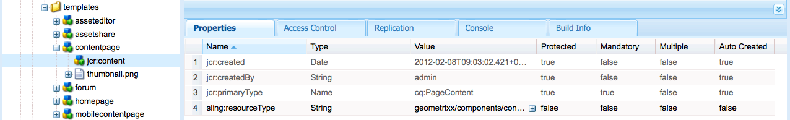

# Paginasjablonen - statisch{#page-templates-static}

Een malplaatje wordt gebruikt om een Pagina tot stand te brengen en bepaalt welke componenten binnen het geselecteerde werkingsgebied kunnen worden gebruikt. Een sjabloon is een hiërarchie van knooppunten die dezelfde structuur heeft als de pagina die moet worden gemaakt, maar zonder daadwerkelijke inhoud.

Elke sjabloon bevat een selectie van componenten die beschikbaar zijn voor gebruik.

* Sjablonen worden samengesteld uit [componenten](/help/sites-developing/components.md);
* Componenten gebruiken widgets en staan toegang tot deze widgets toe. Deze worden gebruikt om de inhoud te renderen.

>[!NOTE]
>
>[Bewerkbare sjablonen](/help/sites-developing/page-templates-editable.md) zijn ook beschikbaar en zijn het aanbevolen type sjablonen voor de meeste flexibiliteit en de nieuwste functies.

## Eigenschappen en onderliggende knooppunten van een sjabloon {#properties-and-child-nodes-of-a-template}

Een sjabloon is een knooppunt van het type cq:Template en heeft de volgende eigenschappen en onderliggende knooppunten:

<table>
 <tbody>
  <tr>
   <td><strong>Naam   </strong></td>
   <td><strong>Type   </strong></td>
   <td><strong>Beschrijving   </strong></td>
  </tr>
  <tr>
   <td>.   </td>
   <td> cq:sjabloon</td>
   <td>Huidige sjabloon. Een sjabloon is van het knooppunttype cq:Template.  </td>
  </tr>
  <tr>
   <td> allowedChildren </td>
   <td> Tekenreeks[]</td>
   <td>Pad van een sjabloon dat een onderliggend element van deze sjabloon mag zijn.  </td>
  </tr>
  <tr>
   <td> allowedParents</td>
   <td> Tekenreeks[]</td>
   <td>Pad van een sjabloon dat bovenliggend element van deze sjabloon mag zijn.  </td>
  </tr>
  <tr>
   <td> allowedPaths</td>
   <td> Tekenreeks[]</td>
   <td>Pad van een pagina die mag worden gebaseerd op deze sjabloon.  </td>
  </tr>
  <tr>
   <td> jcr:gemaakt</td>
   <td> Date</td>
   <td>Datum waarop de sjabloon is gemaakt.  </td>
  </tr>
  <tr>
   <td>  jcr:beschrijving</td>
   <td> Tekenreeks</td>
   <td>Beschrijving van de sjabloon.  </td>
  </tr>
  <tr>
   <td> jcr:titel</td>
   <td> Tekenreeks</td>
   <td>Titel van de sjabloon.  </td>
  </tr>
  <tr>
   <td> rangschikking</td>
   <td> Lang</td>
   <td>Rank van de sjabloon. Wordt gebruikt om de sjabloon weer te geven in de gebruikersinterface.  </td>
  </tr>
  <tr>
   <td> jcr:inhoud</td>
   <td> cq:PageContent</td>
   <td>Knooppunt met de inhoud van de sjabloon.  </td>
  </tr>
  <tr>
   <td> miniatuur.png</td>
   <td>  nt:bestand</td>
   <td>Miniatuur van de sjabloon.  </td>
  </tr>
  <tr>
   <td> icon.png</td>
   <td>  nt:bestand</td>
   <td>Pictogram van de sjabloon.  </td>
  </tr>
 </tbody>
</table>

Een sjabloon is de basis van een pagina.

Als u een pagina wilt maken, moet de sjabloon naar de corresponderende positie in de sitestructuur worden gekopieerd (knooppunt-boomstructuur `/apps/<myapp>/template/<mytemplate>`): Dit gebeurt als een pagina wordt gemaakt met het tabblad **Websites** .

Deze kopieeractie geeft de pagina ook zijn aanvankelijke inhoud (gewoonlijk Top-Level Inhoud slechts) en het bezit die:resourceType, de weg aan de paginacomponent plaatsen die wordt gebruikt om de pagina (alles in de kindknoop jcr:content) terug te geven.

## Hoe sjablonen zijn gestructureerd {#how-templates-are-structured}

Er zijn twee aspecten die in overweging moeten worden genomen:

* de structuur van de template zelf
* de structuur van de inhoud die wordt geproduceerd wanneer een sjabloon wordt gebruikt

### De structuur van een sjabloon {#the-structure-of-a-template}

Een malplaatje wordt gecreeerd onder een knoop van type **cq:Malplaatje**.

Er kunnen verschillende eigenschappen worden ingesteld, met name:

* **jcr:title** - titel voor de sjabloon; wordt weergegeven in het dialoogvenster wanneer u een pagina maakt.
* **jcr:description** - description for the template; wordt weergegeven in het dialoogvenster wanneer u een pagina maakt.

Dit knooppunt bevat een knooppunt jcr:content (cq:PageContent) dat wordt gebruikt als basis voor het inhoudsknooppunt van de resulterende pagina&#39;s; deze verwijzingen, gebruikend sling:resourceType, de component die voor het teruggeven van de daadwerkelijke inhoud van een nieuwe pagina moet worden gebruikt.

Deze component wordt gebruikt om de structuur en het ontwerp van de inhoud te bepalen wanneer een nieuwe pagina wordt gecreeerd.

### De inhoud die door een sjabloon wordt geproduceerd {#the-content-produced-by-a-template}

Sjablonen worden gebruikt om pagina&#39;s van het type te maken `cq:Page` (zoals eerder vermeld is een pagina een speciaal type component). Elke AEM-pagina heeft een gestructureerd knooppunt `jcr:content`. Dit:

* is van het type cq:PageContent
* is een gestructureerd knooppunttype dat een bepaalde content-definition bezit
* heeft een eigenschap `sling:resourceType` om te verwijzen naar de component met de sling-scripts die worden gebruikt voor het renderen van de inhoud

### Standaardsjablonen {#default-templates}

AEM wordt geleverd met een aantal standaardsjablonen die in het vak beschikbaar zijn. In sommige gevallen wilt u de sjablonen wellicht ongewijzigd gebruiken. In dat geval moet u ervoor zorgen dat de sjabloon beschikbaar is voor uw website.

AEM wordt bijvoorbeeld geleverd met verschillende sjablonen, waaronder een inhoudspagina en een homepage.

| **Titel** | **Component** | **Locatie** | **Doel** |
|---|---|---|---|
| Startpagina | homepage | geometrixx | De sjabloon voor de startpagina Geometrixx. |
| Inhoudspagina |  contentpagina | geometrixx | De sjabloon voor de inhoudspagina Geometrixx. |

#### Standaardsjablonen weergeven {#displaying-default-templates}

Ga als volgt te werk om een lijst met alle sjablonen in de repository weer te geven:

1. Open in CRXDE Lite het menu **Hulpmiddelen** en klik **Vraag**.

1. Op het tabblad Query
1. Als **Type**, uitgezochte **XPath**.

1. Voer in het veld **Query** -invoer de volgende tekenreeks in:
//element(*, cq:Sjabloon)

1. Klik op **Uitvoeren**. De lijst wordt weergegeven in het vak Resultaat.

In de meeste gevallen neemt u een bestaande sjabloon en ontwikkelt u een nieuwe sjabloon voor eigen gebruik. Zie [Paginasjablonen](#developing-page-templates) ontwikkelen voor meer informatie.

Als u een bestaande sjabloon voor uw website wilt inschakelen en u wilt dat deze wordt weergegeven in het dialoogvenster Pagina **** maken wanneer u een pagina maakt die recht onder **Websites** van de **Websites** -console staat, stelt u de eigenschap allowedPaths van het sjabloonknooppunt in op: **/content(/.*)?**

## Hoe sjabloonontwerpen worden toegepast {#how-template-designs-are-applied}

Wanneer stijlen in de UI gebruikend de Wijze [van het](/help/sites-authoring/default-components-designmode.md)Ontwerp worden bepaald, wordt het ontwerp voortgeduurd bij de nauwkeurige weg van de inhoudsknoop waarvoor de stijl wordt bepaald.

>[!CAUTION]
>
>Adobe raadt u aan alleen ontwerpen toe te passen in de [ontwerpmodus](/help/sites-authoring/default-components-designmode.md).
>
>Het aanpassen van ontwerpen in bijvoorbeeld CRX DE is geen goede praktijk en de toepassing van dergelijke ontwerpen kan van verwacht gedrag variëren.

Als ontwerpen alleen worden toegepast in de ontwerpmodus, zijn de volgende secties, [Ontwerppadresolutie](/help/sites-developing/page-templates-static.md#design-path-resolution), [beslissingsstructuur](/help/sites-developing/page-templates-static.md#decision-tree)en het [voorbeeld](/help/sites-developing/page-templates-static.md#example) niet van toepassing.

### Resolutie ontwerppad {#design-path-resolution}

Bij het renderen van inhoud op basis van een statische sjabloon probeert AEM het meest relevante ontwerp en de meest relevante stijlen toe te passen op de inhoud op basis van een doorloop in de inhoudshiërarchie.

AEM bepaalt de meest relevante stijl voor een inhoudsknoop in de volgende orde:

* Als er een ontwerp is voor het volledige en nauwkeurige pad van het inhoudsknooppunt (zoals wanneer het ontwerp is gedefinieerd in de ontwerpmodus), gebruikt u dat ontwerp.
* Als er een ontwerp is voor het inhoudsknooppunt van het bovenliggende element, gebruikt u dat ontwerp.
* Als er een ontwerp voor om het even welke knoop op de weg van de inhoudsknoop is, dan gebruik dat ontwerp.

In de laatste twee gevallen, als er meer dan één toepasselijk ontwerp is, gebruik het één dichtst bij de inhoudsknoop.

### Beslissingsboom {#decision-tree}

Dit is een grafische weergave van de logica [Ontwerppadresolutie](/help/sites-developing/page-templates-static.md#design-path-resolution) .

### Voorbeeld {#example}

U kunt een eenvoudige inhoudsstructuur als volgt gebruiken, waarbij een ontwerp van toepassing kan zijn op elk van de knooppunten:

`/root/branch/leaf`

In de volgende tabel wordt beschreven hoe AEM een ontwerp kiest.

<table>
 <tbody>
  <tr>
   <td><strong>Ontwerp zoeken voor  </strong></td>
   <td><strong>Ontwerpen bestaan voor  </strong></td>
   <td><strong>Element gekozen  </strong></td>
   <td><strong>Opmerking</strong></td>
  </tr>
  <tr>
   <td><code class="code">leaf
      </code></td>
   <td>
<code>root</code>
 
<code>branch</code>
 
<code>leaf</code>
 </td>
   <td><code>leaf</code></td>
   <td>De meest nauwkeurige gelijke wordt altijd genomen.  </td>
  </tr>
  <tr>
   <td><code>leaf</code></td>
   <td>
<code>root</code>
 
<code>branch</code>
 </td>
   <td><code>branch</code></td>
   <td>Ga terug naar de dichtstbijzijnde match onder in de boom.</td>
  </tr>
  <tr>
   <td><code>leaf</code></td>
   <td><code>root</code></td>
   <td><code>root</code></td>
   <td>Als al het andere faalt, neem wat blijft.  </td>
  </tr>
  <tr>
   <td><code>branch</code></td>
   <td><code>branch</code></td>
   <td><code>branch</code></td>
   <td> </td>
  </tr>
  <tr>
   <td><code>branch</code></td>
   <td>
<code>branch</code>
 
<code class="code">leaf
       </code>
 </td>
   <td><code>branch</code></td>
   <td> </td>
  </tr>
  <tr>
   <td><code>branch</code></td>
   <td>
<code>root</code>
 
<code class="code">branch
       </code>
 </td>
   <td><code>branch</code></td>
   <td> </td>
  </tr>
  <tr>
   <td><code>branch</code></td>
   <td>
<code>root</code>
 
<code class="code">leaf
       </code>
 </td>
   <td><code>root</code></td>
   <td>
Als er geen exacte overeenkomst is, neemt u de onderste in de boom.
 
Men gaat ervan uit dat dit altijd van toepassing zal zijn, maar verder naar boven kan de boom te specifiek zijn.  
 </td>
  </tr>
 </tbody>
</table>

## Paginasjablonen ontwikkelen {#developing-page-templates}

AEM-paginasjablonen zijn gewoon modellen waarmee nieuwe pagina&#39;s worden gemaakt. Zij kunnen zo weinig, of zo veel, aanvankelijke inhoud bevatten zoals nodig, hun rol om de correcte aanvankelijke knoopstructuren tot stand te brengen, met de vereiste eigenschappen (hoofdzakelijk sling:resourceType) die worden geplaatst om het uitgeven en het teruggeven toe te staan.

### Een nieuwe sjabloon maken (op basis van een bestaande sjabloon) {#creating-a-new-template-based-on-an-existing-template}

Een nieuwe sjabloon kan natuurlijk helemaal vanaf het begin worden gemaakt, maar vaak wordt een bestaande sjabloon gekopieerd en bijgewerkt om tijd en moeite te besparen. U kunt bijvoorbeeld de sjablonen in Geometrixx gebruiken om aan de slag te gaan.

Een nieuwe sjabloon maken op basis van een bestaande sjabloon:

1. Kopieer een bestaande sjabloon (bij voorkeur met een definitie die zo dicht mogelijk bij wat u wilt bereiken) naar een nieuw knooppunt.

   Sjablonen worden meestal opgeslagen in **/apps/&lt;naam website>/templates/&lt;naam sjabloon>**.

   >[!NOTE]
   >
   >De lijst met beschikbare sjablonen is afhankelijk van de locatie van de nieuwe pagina en de plaatsingsbeperkingen die in elke sjabloon zijn opgegeven. Zie [Beschikbaarheid](#templateavailibility)sjabloon.

1. Wijzig de **jcr:title** van het nieuwe sjabloonknooppunt om de nieuwe rol ervan weer te geven. U kunt het **jcr:description** desgewenst ook bijwerken. Zorg ervoor dat u de sjabloonbeschikbaarheid van de pagina naar wens wijzigt.

   >[!NOTE]
   >
   >Als u wilt dat uw sjabloon wordt weergegeven in het dialoogvenster Pagina **** maken wanneer u een pagina maakt die recht onder **Websites** van de **Websites** -console staat, stelt u de `allowedPaths` eigenschap van het sjabloonknooppunt in op: `/content(/.*)?`

   

1. Kopieer de component waarop het malplaatje wordt gebaseerd (dit wordt vermeld door het **sling:resourceType** bezit van de **jcr:content** knoop binnen het malplaatje) om een nieuwe instantie tot stand te brengen.

   Componenten worden meestal opgeslagen in **/apps/&lt;website-name>/components/&lt;component-name>**.

1. Werk de **jcr:title** en **jcr:description** van de nieuwe component bij.
1. Vervang de miniatuur.png als u een nieuwe miniatuurafbeelding wilt weergeven in de lijst met sjabloonselecties (grootte 128 x 98 px).
1. Werk de **sling:resourceType** van de **jcr:content** knoop van het malplaatje bij om naar de nieuwe component te verwijzen.
1. Breng verdere wijzigingen aan in de functionaliteit of het ontwerp van de sjabloon en/of de onderliggende component.

   >[!NOTE]
   >
   >Wijzigingen die worden aangebracht in het knooppunt **/apps/&lt;website>/templates/&lt;template-naam>** hebben invloed op de sjablooninstantie (zoals in de selectielijst).
   Wijzigingen die worden aangebracht in het knooppunt **/apps/&lt;website>/components/&lt;component-name>** hebben invloed op de inhoudspagina die wordt gemaakt wanneer de sjabloon wordt gebruikt.

   U kunt nu een pagina binnen uw website maken met de nieuwe sjabloon.

>[!NOTE]
In de clientbibliotheek van de editor wordt ervan uitgegaan dat de `cq.shared` naamruimte aanwezig is op de inhoudspagina&#39;s. Als deze ontbreekt, `Uncaught TypeError: Cannot read property 'shared' of undefined` treedt de JavaScript-fout op.
Alle pagina&#39;s met voorbeeldinhoud bevatten `cq.shared`dus alle inhoud die hierop is gebaseerd, bevat automatisch `cq.shared`. Als u echter besluit uw eigen inhoudspagina&#39;s helemaal zelf te maken zonder deze te baseren op voorbeeldinhoud, moet u de `cq.shared` naamruimte ook opnemen.
Zie [Client-Side Libraries](/help/sites-developing/clientlibs.md) gebruiken voor meer informatie.

## Een bestaande sjabloon beschikbaar maken {#making-an-existing-template-available}

In dit voorbeeld wordt getoond hoe u een sjabloon kunt gebruiken voor bepaalde inhoudspaden. De sjablonen die beschikbaar zijn voor de auteur van de pagina wanneer u nieuwe pagina&#39;s maakt, worden bepaald door de logica die is gedefinieerd in [Sjabloonbeschikbaarheid](/help/sites-developing/templates.md#template-availability).

1. In CRXDE Lite, navigeer aan het malplaatje u voor uw pagina, bijvoorbeeld, het malplaatje van de Nieuwsbrief wilt gebruiken.
1. Wijzig de `allowedPaths` eigenschap en andere eigenschappen die voor [sjabloonbeschikbaarheid](/help/sites-developing/templates.md#template-availability)worden gebruikt. Bijvoorbeeld: `allowedPaths`: `/content/geometrixx-outdoors/[^/]+(/.*)?` betekent dat deze sjabloon is toegestaan in een pad onder `/content/geometrixx-outdoors`.

   
