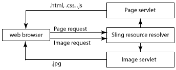

# Responsief ontwerp voor webpagina&#39;s{#responsive-design-for-web-pages}

{{ue-over-mobile}}

>[!NOTE]
>
>Verschillende voorbeelden zijn gebaseerd op de inhoud van het Geometrixx-voorbeeld, die niet meer wordt verzonden met AEM (Adobe Experience Manager) en die is vervangen door We.Retail. Zie het document [ Wij.Retail Implementatie van de Verwijzing ](/help/sites-developing/we-retail.md#we-retail-geometrixx) voor hoe te om Geometrixx te downloaden en te installeren.

Ontwerp uw webpagina&#39;s zodanig dat ze zich aanpassen aan de clientviewport waarin ze worden weergegeven. Met responsief ontwerp kunnen dezelfde pagina&#39;s effectief op meerdere apparaten in beide richtingen worden weergegeven. In de volgende afbeelding ziet u enkele manieren waarop een pagina kan reageren op wijzigingen in de viewportgrootte:

* Lay-out: gebruik lay-outs met één kolom voor kleinere viewports en lay-outs met meerdere kolommen voor grotere viewports.
* Tekengrootte: gebruik grotere tekstgrootte (indien van toepassing, zoals koppen) in grotere viewports.
* Inhoud: neem alleen de belangrijkste inhoud op wanneer u deze weergeeft op kleinere apparaten.
* Navigatie: er zijn apparaatspecifieke gereedschappen voor toegang tot andere pagina&#39;s.
* Afbeeldingen: afbeeldingsuitvoeringen leveren die geschikt zijn voor de viewport van de client. afhankelijk van de afmetingen van het venster.


Ontwikkel Adobe Experience Manager (AEM) toepassingen die HTML5 pagina&#39;s produceren die zich aan veelvoudige venstergrootte en richtlijn aanpassen. De volgende bereiken van viewport-breedten komen bijvoorbeeld overeen met verschillende apparaattypen en -oriëntaties

* Maximale breedte van 480 pixels (telefoon, staand)
* Maximale breedte van 767 pixels (telefoon, liggend)
* Breedte tussen 768 pixels en 979 pixels (tablet, staand)
* Breedte tussen 980 pixels en 1199 pixels (tablet, liggend)
* Breedte van 1200 pixels of groter (bureaublad)

Zie de volgende onderwerpen voor informatie over het uitvoeren van ontvankelijk ontwerpgedrag:

* [Mediaquery&#39;s](/help/sites-developing/responsive.md#using-media-queries)
* [Vloeiende rasters](/help/sites-developing/responsive.md#developing-a-fluid-grid)
* [Adaptieve afbeeldingen](/help/sites-developing/responsive.md#using-adaptive-images)

Tijdens het ontwerpen kunt u met **[!UICONTROL Sidekick]** uw pagina&#39;s voor verschillende schermgrootten voorvertonen.

## Voordat u ontwikkelt {#before-you-develop}

Voordat u de AEM ontwikkelt die uw webpagina&#39;s ondersteunt, moet u een aantal ontwerpbeslissingen nemen. U moet bijvoorbeeld over de volgende informatie beschikken:

* De apparaten waarop u zich richt.
* De grootte van de doelviewport.
* De paginalay-outs voor elk van de beoogde viewportgrootte.

### Toepassingsstructuur {#application-structure}

De typische AEM toepassingsstructuur ondersteunt alle responsieve ontwerpimplementaties:

* De componenten van de pagina verblijven onder /apps/*application_name*/components
* De malplaatjes verblijven onder /apps/*application_name*/templates
* Ontwerpen bevinden zich onder /etc/designs

## Mediaquery&#39;s gebruiken {#using-media-queries}

Met mediaquery&#39;s kunt u CSS-stijlen selectief gebruiken voor het weergeven van pagina&#39;s. AEM ontwikkelingshulpmiddelen en eigenschappen laten u toe om media vragen in uw toepassingen effectief en efficiënt uit te voeren.

De W3C groep verstrekt de ](https://www.w3.org/TR/mediaqueries-3/) aanbeveling van de Vragen van Media 0} {die deze CSS3 eigenschap en de syntaxis beschrijft.[

### Het CSS-bestand maken {#creating-the-css-file}

Definieer in uw CSS-bestand mediaquery&#39;s op basis van de eigenschappen van de apparaten waarvoor u een mediaquery maakt. De volgende implementatiestrategie is effectief voor het beheren van stijlen voor elke mediaquery:

* Gebruik een ClientLibraryFolder om CSS te bepalen die wordt samengesteld wanneer de pagina wordt teruggegeven.
* Definieer elke mediaquery en de bijbehorende stijlen in afzonderlijke CSS-bestanden. Het is handig bestandsnamen te gebruiken die de apparaatfuncties van de mediaquery vertegenwoordigen.
* Definieer stijlen die op alle apparaten in een afzonderlijk CSS-bestand van toepassing zijn.
* In het css.txt- dossier van ClientLibraryFolder, orde de lijst CSS dossiers zoals vereist in het geassembleerde CSS dossier.

In het Media-voorbeeld `We.Retail` wordt deze strategie gebruikt om stijlen in het site-ontwerp te definiëren. Het CSS-bestand dat door `We.Retail` wordt gebruikt, staat op `*/apps/weretail/clientlibs/clientlib-site/less/grid.less` .

In de volgende tabel worden de bestanden in de onderliggende css-map weergegeven.

<table>
 <tbody>
  <tr>
   <th>Bestandsnaam</th>
   <th>Beschrijving</th>
   <th>Mediaquery</th>
  </tr>
  <tr>
   <td>style.css</td>
   <td>Algemene stijlen.</td>
   <td>NVT</td>
  </tr>
  <tr>
   <td>bootstrap.css</td>
   <td>Algemene stijlen, gedefinieerd door de Bootstrap Twitter.</td>
   <td>NVT</td>
  </tr>
  <tr>
   <td>responsive-1200px.css</td>
   <td>Stijlen voor alle media die 1200 pixels breed of breder zijn.</td>
   <td><p>@media (min-width: 1200 px) <br /> ...<br /></p> </td>
  </tr>
  <tr>
   <td>responsive-980px-1199px.css</td>
   <td>Stijlen voor media die tussen 980 pixels en 1199 pixels breed zijn.</td>
   <td><p>@media (min-width: 980 px) en (max-width: 1199 px) <br /> ...<br /></p> </td>
  </tr>
  <tr>
   <td>responsive-768px-979px.css</td>
   <td>Stijlen voor media die tussen 768 pixels en 979 pixels breed zijn. </td>
   <td><p>@media (min-width: 768 px) en (max-width: 979 px) <br /> ...<br /> }</p> </td>
  </tr>
  <tr>
   <td>responsive-767px-max.css</td>
   <td>Stijlen voor alle media die minder dan 768 pixels breed zijn.</td>
   <td><p>@media (max-width: 767 px) <br /> ...<br /> }</p> </td>
  </tr>
  <tr>
   <td>responsive-480px.css</td>
   <td>Stijlen voor alle media die minder dan 481 pixels breed zijn.</td>
   <td>@media (max-width: 480 px) <br /> ...<br /> }</td>
  </tr>
 </tbody>
</table>

In het bestand css.txt in de map `/etc/designs/weretail/clientlibs` worden de CSS-bestanden weergegeven die in de map met de clientbibliotheek staan. De volgorde van de bestanden implementeert stijlprioriteit. Stijlen zijn specifieker naarmate de apparaatgrootte afneemt.

`#base=css`

```
style.css
 bootstrap.css
```

```
responsive-1200px.css
 responsive-980px-1199px.css
 responsive-768px-979px.css
 responsive-767px-max.css
 responsive-480px.css
```

**Uiteinde**: De beschrijvende dossiernamen laten u gemakkelijk de gerichte viewport grootte identificeren.

### Mediaquery&#39;s gebruiken met AEM pagina&#39;s {#using-media-queries-with-aem-pages}

Neem de clientbibliotheekmap op in het JSP-script van uw paginacomponent. Op deze manier kunt u het CSS-bestand genereren dat de mediaquery&#39;s en verwijzingen naar het bestand bevat.

```xml
<ui:includeClientLib categories="apps.weretail.all"/>
```

>[!NOTE]
>
>In de clientbibliotheekmap van `apps.weretail.all` wordt de clientlibs-bibliotheek ingesloten.

Met het JSP-script wordt de volgende HTML-code gegenereerd die verwijst naar de stijlpagina&#39;s:

```xml
<link rel="stylesheet" href="/etc/designs/weretail/clientlibs-all.css" type="text/css">
<link href="/etc/designs/weretail.css" rel="stylesheet" type="text/css">
```

## Voorvertonen voor specifieke apparaten {#previewing-for-specific-devices}

Bekijk voorvertoningen van uw pagina&#39;s in verschillende viewportgrootten zodat u het gedrag van uw responsieve ontwerp kunt testen. In de modus **[!UICONTROL Preview]** bevat **[!UICONTROL Sidekick]** een vervolgkeuzemenu **[!UICONTROL Devices]** waarmee u een apparaat kunt selecteren. Wanneer u een apparaat selecteert, wordt de pagina aangepast aan het formaat van de viewport.


Als u de voorvertoning van het apparaat wilt inschakelen in **[!UICONTROL Sidekick]** , moet u de pagina en de service **[!UICONTROL MobileEmulatorProvider]** configureren. Een andere paginaconfiguratie bestuurt de lijst met apparaten die in de **[!UICONTROL Devices]** lijst verschijnt.

### De lijst met apparaten toevoegen {#adding-the-devices-list}

De lijst **[!UICONTROL Devices]** wordt weergegeven in **[!UICONTROL Sidekick]** wanneer uw pagina het JSP-script bevat dat de lijst **[!UICONTROL Devices]** rendert. Als u de lijst **[!UICONTROL Devices]** aan **[!UICONTROL Sidekick]** wilt toevoegen, neemt u het script `/libs/wcm/mobile/components/simulator/simulator.jsp` op in de sectie `head` van de pagina.

Neem de volgende code op in het JSP dat de sectie `head` definieert:

`<cq:include script="/libs/wcm/mobile/components/simulator/simulator.jsp"/>`

Als u een voorbeeld wilt zien, opent u het `/apps/weretail/components/page/head.jsp` -bestand in CRXDE Lite.

### Paginacomponenten registreren voor simulatie {#registering-page-components-for-simulation}

Als u wilt dat de apparaatsimulator ondersteuning biedt voor uw pagina&#39;s, registreert u uw paginacomponenten bij de factory-service MobileEmulatorProvider en definieert u de eigenschap `mobile.resourceTypes` .

Wanneer het werken met AEM, zijn er verscheidene methodes om de configuratiemontages voor dergelijke diensten te beheren; zie [ Vormend OSGi ](/help/sites-deploying/configuring-osgi.md) voor volledige details.

Als u bijvoorbeeld een knooppunt ` [sling:OsgiConfig](/help/sites-deploying/configuring-osgi.md#adding-a-new-configuration-to-the-repository)` wilt maken in uw toepassing:

* Bovenliggende map: `/apps/application_name/config`
* Naam: `com.day.cq.wcm.mobile.core.impl.MobileEmulatorProvider-*alias*`

  Het achtervoegsel - `*alias*` wordt vereist omdat de dienst MobileEmulatorProvider een fabrieksdienst is. Gebruik een alias die uniek is voor deze fabriek.

* `jcr:primaryType`: `sling:OsgiConfig`

Voeg de volgende knooppunteigenschap toe:

* Naam: `mobile.resourceTypes`
* Type: `String[]`
* Waarde: de paden naar de paginacomponenten die uw webpagina&#39;s weergeven. De geometrixx-media-app gebruikt bijvoorbeeld de volgende waarden:

  ```
  geometrixx-media/components/page
   geometrixx-unlimited/components/pages/page
   geometrixx-unlimited/components/pages/coverpage
   geometrixx-unlimited/components/pages/issue
  ```

### De apparaatgroepen opgeven {#specifying-the-device-groups}

Als u de apparaatgroepen wilt opgeven die in de lijst met apparaten worden weergegeven, voegt u een eigenschap `cq:deviceGroups` toe aan het knooppunt `jcr:content` van de hoofdpagina van uw site. De waarde van de eigenschap is een array van paden naar de knooppunten van de apparaatgroep.

Apparaatgroepknooppunten bevinden zich in de map `/etc/mobile/groups` .

De hoofdpagina van de site Geometrixx Media is bijvoorbeeld `/content/geometrixx-media` . Het knooppunt `/content/geometrixx-media/jcr:content` bevat de volgende eigenschap:

* Naam: `cq:deviceGroups`
* Type: `String[]`
* Waarde: `/etc/mobile/groups/responsive`

Gebruik de console van Hulpmiddelen om [ apparatengroepen ](/help/sites-developing/groupfilters.md) tot stand te brengen en uit te geven.

>[!NOTE]
>
>Voor apparaatgroepen die u gebruikt voor responsief ontwerp, bewerkt u de apparaatgroep en selecteert u Emulator uitschakelen op het tabblad Algemeen. Met deze optie voorkomt u dat de carrousel van de emulator wordt weergegeven. Dit is niet relevant voor responsieve ontwerpen.
>

## Aangepaste afbeeldingen gebruiken {#using-adaptive-images}

U kunt mediaquery&#39;s gebruiken om een afbeeldingsbron te selecteren die u op de pagina wilt weergeven. Nochtans, wordt elk middel dat een media vraag gebruikt om zijn gebruik te conditionaliseren gedownload aan de cliënt. De mediaquery bepaalt alleen of de gedownloade bron wordt weergegeven.

Voor grote bronnen, zoals afbeeldingen, is het downloaden van alle bronnen geen efficiënt gebruik van de gegevenspijpleiding van de client. Als u bronnen selectief wilt downloaden, gebruikt u JavaScript om de aanvraag voor de bron te starten nadat de mediaquery&#39;s de selectie hebben uitgevoerd.

De volgende strategie laadt één enkel middel dat gebruikend media vragen wordt gekozen:

1. Voeg een element DIV voor elke versie van het middel toe. Neem de URI van de bron op als de waarde van een kenmerkwaarde. De browser interpreteert het kenmerk niet als een bron.
1. Voeg een mediaquery toe aan elk DIV-element dat geschikt is voor de bron.
1. Wanneer het document wordt geladen of de grootte van het venster wordt gewijzigd, test de JavaScript-code de mediaquery van elk DIV-element.
1. Gebaseerd op de resultaten van de vragen, bepaal welke middel om te omvatten.
1. Voeg een HTML-element in het DOM in dat naar de bron verwijst.

### Mediaquery&#39;s evalueren met JavaScript {#evaluating-media-queries-using-javascript}

Implementaties van de [ interface MediaQueryList ](https://drafts.csswg.org/cssom-view/#the-mediaquerylist-interface) die W3C bepaalt laten u toe om media vragen te evalueren gebruikend JavaScript. U kunt logica toepassen op de resultaten van mediaquery&#39;s en scripts uitvoeren die zijn bedoeld voor het huidige venster:

* Browsers die de interface MediaQueryList implementeren, ondersteunen de functie `window.matchMedia()` . Deze functie test mediaquery&#39;s op basis van een bepaalde tekenreeks. De functie retourneert een `MediaQueryList` -object dat toegang biedt tot de queryresultaten.

* Voor browsers die de interface niet uitvoeren, kunt u a `matchMedia()` poly gebruiken vullen, zoals [ matchMedia.js ](https://github.com/paulirish/matchMedia.js), een vrij beschikbare bibliotheek van JavaScript.

#### Media-specifieke bronnen selecteren {#selecting-media-specific-resources}

Het W3C [ beeldelement ](https://html.spec.whatwg.org/multipage/embedded-content.html#the-picture-element) gebruikt media vragen om de bron te bepalen voor beeldelementen te gebruiken. Het afbeeldingselement gebruikt elementkenmerken om mediaquery&#39;s te koppelen aan afbeeldingspaden.

De vrij beschikbare bibliotheek 0} picturefill.js ](https://github.com/scottjehl/picturefill) verstrekt gelijkaardige functionaliteit zoals het voorgestelde `picture` element, en gebruikt een gelijkaardige strategie. [ De bibliotheek picturefill.js roept `window.matchMedia` aan om de mediaquery&#39;s te evalueren die voor een set `div` -elementen zijn gedefinieerd. Elk `div` -element geeft ook een afbeeldingsbron op. De bron wordt gebruikt wanneer de mediaquery van het element `div` `true` retourneert.

De `picturefill.js` -bibliotheek vereist HTML-code die vergelijkbaar is met het volgende voorbeeld:

```xml
<div data-picture>
    <div data-src='path to default image'></div>
    <div data-src='path to small image'    data-media="(media query for phone)"></div>
    <div data-src='path to medium image'   data-media="(media query for tablet)"></div>
    <div data-src='path to large image'     data-media="(media query for monitor)"></div>
</div>
```

Wanneer de pagina wordt gerenderd, voegt picturefull.js een `img` -element in als het laatste onderliggende element van het `<div data-picture>` -element:

```xml
<div data-picture>
    <div data-src='path to default image'></div>
    <div data-src='path to small image'    data-media="(media query for phone)"></div>
    <div data-src='path to medium image'   data-media="(media query for tablet)"></div>
    <div data-src='path to large image'     data-media="(media query for monitor)"></div>
    
</div>
```

In een AEM pagina is de waarde van het kenmerk `data-src` het pad naar een bron in de opslagplaats.

### Adaptieve afbeeldingen implementeren in AEM {#implementing-adaptive-images-in-aem}

Als u adaptieve afbeeldingen wilt implementeren in uw AEM, moet u de vereiste JavaScript-bibliotheken toevoegen en de vereiste HTML-opmaakcode op uw pagina&#39;s opnemen.

**Bibliotheken**

Verkrijg de volgende bibliotheken van JavaScript en neem hen in een omslag van de cliëntbibliotheek op:

* [ matchMedia.js ](https://github.com/paulirish/matchMedia.js) (voor browsers die niet de interface MediaQueryList uitvoeren)
* [ picturefill.js ](https://github.com/scottjehl/picturefill)
* jquery.js (beschikbaar via de `/etc/clientlibs/granite/jquery` map voor de clientbibliotheek (categorie = jquery)
* [ jquery.debouncedresize.js ](https://github.com/louisremi/jquery-smartresize) (een jquery gebeurtenis die eens voorkomt nadat het venster resized)

**Uiteinde:** u kunt veelvoudige omslagen van de cliëntbibliotheek automatisch aaneenschakelen door [ het inbedden ](/help/sites-developing/clientlibs.md#embedding-code-from-other-libraries).

**HTML**

Maak een component die de vereiste div-elementen genereert die de code picturefill.js verwacht. In een AEM pagina, is de waarde van het gegeven-src attribuut de weg aan een middel in de bewaarplaats. Een paginacomponent kan bijvoorbeeld de mediaquery&#39;s en de bijbehorende paden voor afbeeldingsuitvoeringen in DAM hard coderen. U kunt ook een aangepaste component Image maken waarmee auteurs afbeeldingsuitvoeringen kunnen selecteren of renderopties bij uitvoering kunnen opgeven.

In het volgende voorbeeld wordt HTML geselecteerd uit twee DAM-uitvoeringen van dezelfde afbeelding.

```xml
<div data-picture>
    <div data-src='/content/dam/geometrixx-media/articles/meridien.png'></div>
    <div data-src='/content/dam/geometrixx-media/articles/meridien.png/jcr:content/renditions/cq5dam.thumbnail.319.319.png'    data-media="(min-width: 769px)"></div>
    <div data-src='/content/dam/geometrixx-media/articles/meridien.png/jcr:content/renditions/cq5dam.thumbnail.140.100.png'   data-media="(min-width: 481px)"></div>
</div>
```

>[!NOTE]
>
>De stichtingscomponent Adaptive Image implementeert adaptieve afbeeldingen:
>
>* Map clientbibliotheek: `/libs/foundation/components/adaptiveimage/clientlibs`
>* Script dat de HTML genereert: `/libs/foundation/components/adaptiveimage/adaptiveimage.jsp`
>
>In het volgende gedeelte vindt u meer informatie over deze component.
>

### Renderen van afbeeldingen in AEM {#understanding-image-rendering-in-aem}

Als u de rendering van afbeeldingen wilt aanpassen, dient u de standaardimplementatie AEM statische rendering van afbeeldingen te begrijpen. AEM biedt de component Image en een server voor het renderen van afbeeldingen die samenwerken om afbeeldingen voor webpagina&#39;s te renderen. De volgende volgorde van gebeurtenissen vindt plaats wanneer de component Image is opgenomen in het alineasysteem van de pagina:

1. Authoring: ontwerpers bewerken de component Image om het afbeeldingsbestand op te geven dat in een HTML-pagina moet worden opgenomen. Het bestandspad wordt opgeslagen als een eigenschapwaarde van het knooppunt Image component.
1. Paginaverzoek: de JSP van de paginacomponent genereert de HTML-code. JSP van de component van het Beeld produceert en voegt een img element aan de pagina toe.
1. Afbeeldingsverzoek: de webbrowser laadt de pagina en vraagt de afbeelding op basis van het kenmerk src van het img-element.
1. Afbeeldingsrendering: de afbeelding wordt door het serlet voor het renderen van afbeeldingen geretourneerd naar de webbrowser.



De JSP van de component Image genereert bijvoorbeeld het volgende HTML-element:

``

Wanneer de browser de pagina laadt, wordt de afbeelding opgevraagd met de waarde van het kenmerk src als URL. Bij Sling wordt de URL ontleed:

* Bron: `/content/mywebsite/en/_jcr_content/par/image_0`
* Bestandsnaamextensie: `.jpg`
* Kiezer: `img`
* Achtervoegsel: `1358372073597.jpg`

Het knooppunt `image_0` heeft een `jcr:resourceType` waarde `foundation/components/image` met `sling:resourceSuperType` waarde `foundation/components/parbase` . De parbase component bevat het script img.GET.java dat overeenkomt met de kiezer en de bestandsextensie van de aanvraag-URL. CQ gebruikt dit script (servlet) om de afbeelding te renderen.

Als u de broncode van het script wilt zien, opent u de lus `/libs/foundation/components/parbase/img.GET.java` met CRXDE Lite
bestand.

## Afbeeldingen schalen voor de huidige viewport-grootte {#scaling-images-for-the-current-viewport-size}

Afbeeldingen tijdens runtime schalen op basis van de kenmerken van de viewport van de client om afbeeldingen te maken die voldoen aan de principes van responsief ontwerp. Gebruik hetzelfde ontwerppatroon als het renderen van statische afbeeldingen met behulp van een servlet en een ontwerpcomponent.

De component moet de volgende taken uitvoeren:

* Sla het pad en de gewenste afmetingen van de afbeeldingsbron op als eigenschapswaarden.
* Genereer `div` -elementen die mediaselectors en serviceaanroepen bevatten voor het renderen van de afbeelding.

>[!NOTE]
>
>De webclient gebruikt de bibliotheken van matchMedia en Picturefill JavaScript (of vergelijkbare bibliotheken) om de mediaselectors te evalueren.
>

servlet die het beeldverzoek verwerkt moet de volgende taken uitvoeren:

* Haal het pad en de afmetingen van de afbeelding op uit de eigenschappen van de component.
* Schaal de afbeelding op basis van de eigenschappen en retourneer de afbeelding.

**Beschikbare oplossingen**

AEM installeert de volgende implementaties die u kunt gebruiken of uitbreiden.

* De Aanpassings de stichtingscomponent van het Beeld die media vragen produceert, en HTTP- verzoeken aan de AanpassingsServlet van de Component van het Beeld die de beelden schrapt.
* Met het Geometrixx Commons-pakket worden de voorbeeldservlets van de Image Reference Modification Servlet geïnstalleerd waarmee de afbeeldingsresolutie wordt gewijzigd.

### De component Adaptieve afbeelding {#understanding-the-adaptive-image-component}

De adaptieve component van het Beeld produceert vraag aan de Adaptive Servlet van de Component van het Beeld om een beeld terug te geven dat volgens het apparatenscherm wordt gerangschikt. De component bevat de volgende bronnen:

* JSP: Voegt div elementen toe die media vragen met vraag aan Adaptive Image Component Servlet associëren.
* Clientbibliotheken: de clientlibs-map is een `cq:ClientLibraryFolder` die de matchMedia polyfill JavaScript-bibliotheek en een aangepaste Picturefill-JavaScript-bibliotheek samenstelt.
* Dialoogvenster Bewerken: het knooppunt `cq:editConfig` overschrijft de component van de CQ-basisafbeelding, zodat het doel voor neerzetten een component adaptief beeld maakt in plaats van een component van een basisafbeelding.

#### De DIV-elementen toevoegen {#adding-the-div-elements}

Het script adaptive-image.jsp bevat de volgende code waarmee div-elementen en mediaquery&#39;s worden gegenereerd:

```
<div data-picture data-alt='<%= alt %>'>
    <div data-src='<%= path + ".img.320.low." + extension + suffix %>'       data-media="(min-width: 1px)"></div>                                        <%-- Small mobile --%>
    <div data-src='<%= path + ".img.320.medium." + extension + suffix %>'    data-media="(min-width: 320px)"></div>  <%-- Portrait mobile --%>
    <div data-src='<%= path + ".img.480.medium." + extension + suffix %>'    data-media="(min-width: 321px)"></div>  <%-- Landscape mobile --%>
    <div data-src='<%= path + ".img.476.high." + extension + suffix %>'      data-media="(min-width: 481px)"></div>   <%-- Portrait iPad --%>
    <div data-src='<%= path + ".img.620.high." + extension + suffix %>'      data-media="(min-width: 769px)"></div>  <%-- Landscape iPad --%>
    <div data-src='<%= path + ".img.full.high." + extension + suffix %>'     data-media="(min-width: 1025px)"></div> <%-- Desktop --%>

    <%-- Fallback content for non-JS browsers. Same img src as the initial, unqualified source element. --%>
    <noscript>
        ' alt='<%= alt %>'>
    </noscript>
</div>
```

De variabele `path` bevat het pad van de huidige bron (het componentknooppunt adaptive-image). De code genereert een reeks `div` -elementen met de volgende structuur:

`<div data-scr = "*path-to-parent-node*.adaptive-image.adapt.*width*.*quality*.jpg" data-media="*media query*"></div>`

De waarde van het kenmerk `data-scr` is een URL die Sling oplost naar de Adaptive Image Component Server die de afbeelding rendert. Het data-media attribuut bevat de media vraag die tegen de cliënteigenschappen wordt geëvalueerd.

De volgende HTML-code is een voorbeeld van de `div` -elementen die door de JSP worden gegenereerd:

```xml
<div data-src='/content/geometrixx-media/en/events/the-lineup-you-ve-been-waiting-for/jcr:content/article-content-par/adaptive_image.adapt.320.low.jpg'></div>
    <div data-src='/content/geometrixx-media/en/events/the-lineup-you-ve-been-waiting-for/jcr:content/article-content-par/adaptive_image.adapt.320.medium.jpg'    data-media="(min-width: 320px)"></div>
    <div data-src='/content/geometrixx-media/en/events/the-lineup-you-ve-been-waiting-for/jcr:content/article-content-par/adaptive_image.adapt.480.medium.jpg'    data-media="(min-width: 321px)"></div>
    <div data-src='/content/geometrixx-media/en/events/the-lineup-you-ve-been-waiting-for/jcr:content/article-content-par/adaptive_image.adapt.476.high.jpg'     data-media="(min-width: 481px)"></div>
    <div data-src='/content/geometrixx-media/en/events/the-lineup-you-ve-been-waiting-for/jcr:content/article-content-par/adaptive_image.adapt.620.high.jpg'     data-media="(min-width: 769px)"></div>
    <div data-src='/content/geometrixx-media/en/events/the-lineup-you-ve-been-waiting-for/jcr:content/article-content-par/adaptive_image.adapt.full.high.jpg'     data-media="(min-width: 1025px)"></div>
```

#### Selectors voor afbeeldingsgrootte wijzigen {#changing-the-image-size-selectors}

Als u de component Adaptive Image aanpast en de breedteselectors wijzigt, moet u ook de Adaptive Image Component Servlet configureren om de breedten te ondersteunen.

### De Adaptive Image Component Server {#understanding-the-adaptive-image-component-servlet}

De adaptieve server van de Component van het Beeld resizes een beeld van JPEG volgens een gespecificeerde breedte, en plaatst de kwaliteit van de JPEG.

#### De interface van de Adaptive Image Component Server {#the-interface-of-the-adaptive-image-component-servlet}

De server voor adaptieve afbeeldingscomponenten is gebonden aan het standaard-Sling-servlet en ondersteunt de bestandsextensies .jpg, .jpeg, .gif en .png. De servletkiezer is img.

>[!CAUTION]
>
>GIF-bestanden met animatie worden niet ondersteund in AEM voor adaptieve uitvoeringen.

Daarom lost het Sling URLs van het HTTP- verzoek van het volgende formaat aan dit servlet op:

`*path-to-node*.img.*extension*`

Bijvoorbeeld HTTP-aanvragen doorsturen met de URL `http://localhost:4502/content/geometrixx/adaptiveImage.img.jpg` naar Adaptive Image Component Server.

Twee extra kiezers geven de gewenste afbeeldingsbreedte en -kwaliteit op. In het volgende voorbeeld wordt een afbeelding met een breedte van 480 pixels en een gemiddelde kwaliteit opgevraagd:

`http://localhost:4502/content/geometrixx/adaptiveImage.adapt.480.MEDIUM.jpg`

**Gesteunde beeldeigenschappen**

De servlet accepteert een eindig aantal afbeeldingsbreedten en -kwaliteiten. De volgende breedten worden standaard ondersteund (in pixels):

* volledig
* 320
* 480
* 476
* 620

De volledige waarde geeft aan dat er geen schaling is.

De volgende waarden voor de kwaliteit van de JPEG worden ondersteund:

* LAAG
* MEDIUM
* HOOG

De numerieke waarden zijn respectievelijk 0,4, 0,82 en 1,0.

**Veranderend de standaard gesteunde breedten**

Gebruik de Console van het Web ([ http://localhost:4502/system/console/configMgr ](http://localhost:4502/system/console/configMgr)) of een helling:Knoop OsgiConfig om de gesteunde breedten van de Servlet van de Component van het Beeld van Adobe CQ te vormen Adaptive.

Voor informatie over hoe te om AEM diensten te vormen, zie [ Vormend OSGi ](/help/sites-deploying/configuring-osgi.md).

<table>
 <tbody>
  <tr>
   <th> </th>
   <th>Webconsole</th>
   <th>sling:OsgiConfig</th>
  </tr>
  <tr>
   <th>Service- of knooppuntnaam</th>
   <td>De servicenaam op het tabblad Configuratie is Adobe CQ Adaptive Image Component Servlet</td>
   <td>com.day.cq.wcm.foundation.impl. AdaptiveImageComponentServlet</td>
  </tr>
  <tr>
   <th>Eigenschap</th>
   <td><p>Ondersteunde breedten</p>
    <ul>
     <li>Als u een ondersteunde breedte wilt toevoegen, klikt u op een +-knop en voert u een positief geheel getal in.</li>
     <li>Als u een ondersteunde breedte wilt verwijderen, klikt u op de knop Bijbehorend -.</li>
     <li>Als u een ondersteunde breedte wilt wijzigen, bewerkt u de veldwaarde.</li>
    </ul> </td>
   <td><p>adapt.supported.widths</p>
    <ul>
     <li>De eigenschap is een multivalueerde tekenreekswaarde.</li>
    </ul> </td>
  </tr>
 </tbody>
</table>

#### Implementatiedetails {#implementation-details}

De `com.day.cq.wcm.foundation.impl.AdaptiveImageComponentServlet` klasse breidt de [ AbstractImageServlet ](https://developer.adobe.com/experience-manager/reference-materials/6-5/javadoc/com/day/cq/wcm/commons/AbstractImageServlet.html) klasse uit. De broncode AdaptiveImageComponentServlet bevindt zich in de map `/libs/foundation/src/impl/src/com/day/cq/wcm/foundation/impl` .

De klasse gebruikt de SCR annotaties van Felix om het middeltype en de dossieruitbreiding te vormen die servlet met, en de naam van de eerste selecteur wordt geassocieerd.

```java
@Component(metatype = true, label = "Adobe CQ Adaptive Image Component Servlet",
        description = "Render adaptive images in a variety of qualities")
@Service
@Properties(value = {
    @Property(name = "sling.servlet.resourceTypes", value = "foundation/components/adaptiveimage", propertyPrivate = true),
    @Property(name = "sling.servlet.selectors", value = "img", propertyPrivate = true),
    @Property(name = "sling.servlet.extensions", value ={
            "jpg",
            "jpeg",
            "png",
            "gif"
    }, propertyPrivate = true)
})
```

servlet gebruikt de SCR annotatie van het Bezit om de standaard gesteunde beeldkwaliteit en afmetingen te plaatsen.

```java
@Property(value = {
            "320", // iPhone portrait
            "480", // iPhone landscape
            "476", // iPad portrait
            "620" // iPad landscape
    },
            label = "Supported Widths",
            description = "List of widths this component is permitted to generate.")
```

De klasse `AbstractImageServlet` biedt de methode `doGet` die de HTTP-aanvraag verwerkt. Deze methode bepaalt het middel dat met het verzoek wordt geassocieerd, wint middeleigenschappen van de bewaarplaats terug, en keert hen in een [ ImageContext ](https://developer.adobe.com/experience-manager/reference-materials/6-5/javadoc/com/day/cq/wcm/commons/AbstractImageServlet.ImageContext.html) voorwerp terug.

>[!NOTE]
>
>De {](https://developer.adobe.com/experience-manager/reference-materials/6-5/javadoc/com/day/cq/commons/DownloadResource.html) klasse 0} com.day.cq.commons.DownloadResource verstrekt `getFileReference method`, die de waarde van het 3} bezit van het middel terugwint.[`fileReference`

De klasse `AdaptiveImageComponentServlet` overschrijft de methode `createLayer` . De methode verkrijgt de weg van de beeldbron en de gevraagde beeldbreedte van het `ImageContext` voorwerp. Vervolgens worden de methoden van de klasse `info.geometrixx.commons.impl.AdaptiveImageHelper` aangeroepen, die de werkelijke schaling van de afbeelding uitvoert.

De klasse AdaptiveImageComponentServlet overschrijft ook de methode writeLayer. Met deze methode past u de kwaliteit van de JPEG toe op de afbeelding.

### Servlet van de Wijziging van de Verwijzing van het beeld (Gemeenschappelijke Geometrixx) {#image-reference-modification-servlet-geometrixx-common}

Met de voorbeeldserver voor het wijzigen van afbeeldingsreferenties worden groottekenmerken voor het img-element gegenereerd om een afbeelding op de webpagina te schalen.

#### De servlet aanroepen {#calling-the-servlet}

De servlet is gebonden aan `cq:page` bronnen en ondersteunt de bestandsextensie .jpg. De servlet-kiezer is `image` . Daarom lost het Sling URLs van het HTTP- verzoek van het volgende formaat aan dit servlet op:

`path-to-page-node.image.jpg`

Bijvoorbeeld, door:sturen HTTP- verzoeken met URL `http://localhost:4502/content/geometrixx/en.image.jpg` aan de Servlet van de Wijziging van de Verwijzing van het Beeld.

Drie extra kiezers geven de gewenste afbeeldingsbreedte, -hoogte en (optioneel) -kwaliteit op. In het volgende voorbeeld wordt een afbeelding met een breedte van 770 pixels, een hoogte van 360 pixels en een gemiddelde kwaliteit opgevraagd.

`http://localhost:4502/content/geometrixx/en.image.770.360.MEDIUM.jpg`

**Gesteunde beeldeigenschappen**

De servlet accepteert een eindig aantal afbeeldingsafmetingen en kwaliteitswaarden.

De volgende waarden worden standaard ondersteund (breedte):

* 256x192
* 370x150
* 480x200
* 127x127
* 770x360
* 620x290
* 480x225
* 320x150
* 375x175
* 303x142
* 1170x400
* 940x340
* 770x300
* 480x190

De volgende waarden voor de afbeeldingskwaliteit worden ondersteund:

* laag
* medium
* hoog

Wanneer het werken met AEM, zijn er verscheidene methodes om de configuratiemontages voor dergelijke diensten te beheren; zie [ Vormend OSGi ](/help/sites-deploying/configuring-osgi.md) voor volledige details.

#### De afbeeldingsbron opgeven {#specifying-the-image-resource}

Het afbeeldingspad, de afmetingen en de kwaliteitswaarden moeten worden opgeslagen als eigenschappen van een knooppunt in de opslagplaats:

* De knooppuntnaam is `image` .
* Het bovenliggende knooppunt is het `jcr:content` -knooppunt van een `cq:page` -bron.

* Het afbeeldingspad wordt opgeslagen als de waarde van een eigenschap met de naam `fileReference` .

Wanneer het ontwerpen van een pagina, gebruik **Sidekick** om het beeld te specificeren en de `image` knoop aan de paginaeigenschappen toe te voegen:

1. In **Sidekick**, klik het **** lusje van de Pagina, en klik dan **Eigenschappen van de Pagina**.
1. Klik het **lusje van het Beeld** en specificeer het beeld.
1. Klik **OK**.

#### Implementatiedetails {#implementation-details-1}

De info.geometrixx.commons.impl.servlets.ImageReferenceModificationServlet klasse breidt [ AbstractImageServlet ](https://developer.adobe.com/experience-manager/reference-materials/6-5/javadoc/com/day/cq/wcm/commons/AbstractImageServlet.html) uit. Als u het pakket cq-geometrixx-commons-pkg hebt geïnstalleerd, bevindt de broncode ImageReferenceModificationServlet zich in de map `/apps/geometrixx-commons/src/core/src/main/java/info/geometrixx/commons/impl/servlets` .

De klasse gebruikt de SCR annotaties van Felix om het middeltype en de dossieruitbreiding te vormen die servlet met, en de naam van de eerste selecteur wordt geassocieerd.

```java
@Component(metatype = true, label = "Adobe CQ Image Reference Modification Servlet",
        description = "Render the image associated with a page in a variety of dimensions and qualities")
@Service
@Properties(value = {
    @Property(name = "sling.servlet.resourceTypes", value = NameConstants.NT_PAGE, propertyPrivate = true),
    @Property(name = "sling.servlet.selectors", value = "image", propertyPrivate = true),
    @Property(name = "sling.servlet.extensions", value = "jpg", propertyPrivate = true)
})
```

servlet gebruikt de SCR annotatie van het Bezit om de standaard gesteunde beeldkwaliteit en afmetingen te plaatsen.

```java
@Property(label = "Image Quality",
            description = "Quality must be a double between 0.0 and 1.0", value = "0.82")
@Property(value = {
                "256x192", // Category page article list images
                "370x150", // "Most popular" desktop & iPad & carousel min-width: 1px
                "480x200", // "Most popular" phone
                "127x127", // article summary phone square images
                "770x360", // article summary, desktop
                "620x290", // article summary, tablet
                "480x225", // article summary, phone (landscape)
                "320x150", // article summary, phone (portrait) and fallback
                "375x175", // 2-column article summary, desktop
                "303x142", // 2-column article summary, tablet
                "1170x400", // carousel, full
                "940x340",  // carousel min-width: 980px
                "770x300",  // carousel min-width: 768px
                "480x190"   // carousel min-width: 480px
            },
            label = "Supported Resolutions",
            description = "List of resolutions this component is permitted to generate.")
```

De klasse `AbstractImageServlet` biedt de methode `doGet` die de HTTP-aanvraag verwerkt. Deze methode bepaalt het middel dat met de vraag wordt geassocieerd, wint middeleigenschappen van de bewaarplaats terug, en bewaart hen in een [ ImageContext ](https://developer.adobe.com/experience-manager/reference-materials/6-5/javadoc/com/day/cq/wcm/commons/AbstractImageServlet.ImageContext.html) voorwerp.

De klasse `ImageReferenceModificationServlet` overschrijft de methode `createLayer` en implementeert de logica die de afbeeldingsbron bepaalt die moet worden gerenderd. De methode haalt een onderliggende node op van de node `jcr:content` van de pagina met de naam `image` . Een [ voorwerp van het Beeld ](https://developer.adobe.com/experience-manager/reference-materials/6-5/javadoc/com/day/cq/wcm/foundation/Image.html) wordt gecreeerd van deze `image` knoop, en de `getFileReference` methode keert de weg aan het beelddossier van het `fileReference` bezit van de beeldknoop terug.

>[!NOTE]
>De {](https://developer.adobe.com/experience-manager/reference-materials/6-5/javadoc/com/day/cq/commons/DownloadResource.html) klasse 0} com.day.cq.commons.DownloadResource verstrekt getFileReferenceMethod.[
>

## Een dynamisch raster ontwikkelen {#developing-a-fluid-grid}

AEM stelt u in staat op efficiënte en effectieve wijze dynamische rasters te implementeren. Deze pagina verklaart hoe u uw dynamisch net of een bestaande netimplementatie (zoals [ Bootstrap ](https://github.com/topics/twitter-bootstrap?l=css)) in uw AEM toepassing kunt integreren.

Als u niet vertrouwd met dynamische netten bent, zie de [ Inleiding aan de Dynamische sectie van Rasters ](/help/sites-developing/responsive.md#developing-a-fluid-grid) bij de bodem van deze pagina. Deze inleiding geeft een overzicht van dynamische rasters en richtlijnen voor het ontwerpen ervan.

### Het raster definiëren met een component Pagina {#defining-the-grid-using-a-page-component}

Gebruik paginacomponenten om de HTML-elementen te genereren die de inhoudsblokken van de pagina definiëren. De ClientLibraryFolder waarnaar de pagina verwijst, bevat de CSS die de lay-out van de inhoudsblokken bepaalt:

* Component Pagina: voegt div-elementen toe die rijen inhoudsblokken vertegenwoordigen. De div elementen die inhoudsblokken vertegenwoordigen omvatten een component parsys waar de auteurs inhoud toevoegen.
* Map met clientbibliotheken: bevat het CSS-bestand met mediaquery&#39;s en stijlen voor de div-elementen.

De voorbeeldgeometrixx-media-toepassing bevat bijvoorbeeld de media-home-component. Deze paginacomponent voegt twee scripts in, die twee `div` elementen van klasse `row-fluid` genereren:

* De eerste rij bevat een `div` -element van klasse `span12` (de inhoud omvat 12 kolommen). Het element `div` bevat de component parsys.

* De tweede rij bevat twee `div` -elementen, een van de klasse `span8` en de andere van de klasse `span4` . Elk `div` -element bevat de component parsys.

```xml
<div class="page-content">
    <div class="row-fluid">
        <div class="span12">
            <cq:include path="grid-12-par" resourceType="foundation/components/parsys" />
        </div>
    </div>
    <div class="row-fluid">
        <div class="span8">
            <cq:include path="grid-8-par" resourceType="foundation/components/parsys" />
        </div>
        <div class="span4">
            <cq:include path="grid-4-par" resourceType="foundation/components/parsys" />
        </div>
    </div>
</div>
```

>[!NOTE]
>
>Wanneer een component meerdere `cq:include` -elementen bevat die naar de component parsys verwijzen, moet elk `path` -kenmerk een andere waarde hebben.
>

#### Het raster van de component Pagina schalen {#scaling-the-page-component-grid}

Het ontwerp dat aan de geometrixx-media paginacomponent (`/etc/designs/geometrixx-media`) wordt geassocieerd bevat `clientlibs` ClientLibraryFolder. Deze ClientLibraryFolder definieert CSS-stijlen voor `row-fluid` -klassen, `span*` -klassen en `span*` -klassen die onderliggende klassen van `row-fluid` -klassen zijn. Met mediaquery&#39;s kunnen stijlen opnieuw worden gedefinieerd voor verschillende viewportgrootten.

In het volgende voorbeeld is CSS een subset van deze stijlen. Deze subset richt zich op `span12` -, `span8` - en `span4` -klassen en mediaquery&#39;s voor twee viewportgrootten. Let op de volgende kenmerken van de CSS:

* Met de `.span` -stijlen definieert u elementbreedten met absolute getallen.
* De `.row-fluid .span*` -stijlen definiëren elementbreedten als percentages van het bovenliggende element. Percentages worden berekend op basis van de absolute breedten.
* De vragen van media voor grotere viewports wijzen grotere absolute breedten toe.

>[!NOTE]
>
>De steekproef van Geometrixx Media integreert het ](https://getbootstrap.com/2.0.2/) kader van JavaScript van de Bootstrap [ {in zijn dynamische netimplementatie. Het framework Bootstrap biedt het bestand bootstrap.css.

```xml
/* default styles (no media queries) */
 .span12 { width: 940px }
 .span8 { width: 620px }
 .span4 { width: 300px }
 .row-fluid .span12 { width: 100% }
 .row-fluid .span8 { width: 65.95744680851064% }
 .row-fluid .span4 { width: 31.914893617021278% }

@media (min-width: 768px) and (max-width: 979px) {
 .span12 { width: 724px; }
 .span8 {     width: 476px; }
 .span4 {     width: 228px; }
 .row-fluid .span12 {     width: 100%;}
 .row-fluid .span8 {     width: 65.74585635359117%; }
 .row-fluid .span4 {     width: 31.491712707182323%; }
}

@media (min-width: 1200px) {
 .span12 { width: 1170px }
 .span8 { width: 770px }
 .span4 { width: 370px }
 .row-fluid .span12 { width: 100% }
 .row-fluid .span8 { width: 65.81196581196582% }
 .row-fluid .span4 { width: 31.623931623931625% }
}
```

#### Inhoud in het raster van de component Pagina verplaatsen {#repositioning-content-in-the-page-component-grid}

Op de pagina&#39;s van de voorbeeldtoepassing worden rijen met inhoudsblokken horizontaal verdeeld in brede viewports. In kleinere viewports, worden de zelfde blokken verticaal verdeeld. In het volgende voorbeeld-CSS worden de stijlen getoond die dit gedrag implementeren voor de HTML-code die door de pagina-component Media-home wordt gegenereerd:

* De standaard-CSS voor de media-welkomstpagina wijst de `float:left` -stijl toe voor `span*` -klassen die zich binnen `row-fluid` -klassen bevinden.

* Mediaquery&#39;s voor kleinere viewports wijzen de stijl `float:none` toe voor dezelfde klassen.

```xml
/* default styles (no media queries) */
    .row-fluid [class*="span"] {
        width: 100%;
        float: left;
}

@media (max-width: 767px) {
    [class*="span"], .row-fluid [class*="span"] {
        float: none;
        width: 100%;
    }
}
```

#### De paginacomponenten moduleren {#tip-modularize-your-page-components}

Modulariseer uw componenten zodat kunt u efficiënt gebruik van de code maken. Uw site gebruikt waarschijnlijk verschillende typen pagina&#39;s, zoals een welkomstpagina, een artikelpagina of een productpagina. Elk type pagina bevat verschillende typen inhoud en gebruikt waarschijnlijk verschillende lay-outs. Wanneer bepaalde elementen van elke lay-out echter op meerdere pagina&#39;s voorkomen, kunt u de code die dat deel van de lay-out implementeert, opnieuw gebruiken.

**overlays van de paginacomponent van het Gebruik**

Maak een hoofdpaginacomponent met scripts voor het genereren van de verschillende delen van een pagina, zoals `head` - en `body` -secties, en `header` -, `content` - en `footer` -secties in de hoofdtekst.

Maak andere paginacomponenten die de hoofdpaginacomponent als `cq:resourceSuperType` gebruiken. Deze componenten omvatten manuscripten die de manuscripten van de belangrijkste pagina zonodig met voeten treden.

De toepassing goemetrixx-media bevat bijvoorbeeld de paginacomponent (de `sling:resourceSuperType` is de stichtingspagina-component). Verschillende onderliggende componenten (zoals artikel, categorie en media-home) gebruiken deze paginacomponent als `sling:resourceSuperType` . Elke onderliggende component bevat een content.jsp-bestand dat het content.jsp-bestand van de paginacomponent overschrijft.

**opnieuw gebruiken manuscripten**

Creeer veelvoudige manuscripten JSP die rij en kolomcombinaties produceren die voor veelvoudige paginacomponenten gemeenschappelijk zijn. Het `content.jsp` -script van het artikel en de media-home-componenten verwijzen bijvoorbeeld allebei naar het `8x4col.jsp` -script.

**organiseer CSS stijlen door gerichte viewport grootte**

CSS-stijlen en mediaquery&#39;s voor verschillende viewportgrootten opnemen in afzonderlijke bestanden. Gebruik clientbibliotheekmappen om deze samen te voegen.

### Componenten invoegen in het paginaraster {#inserting-components-into-the-page-grid}

Wanneer componenten één blok van inhoud produceren, over het algemeen controleert het net dat de paginacomponent vestigt de plaatsing van de inhoud.

Als auteur kan het inhoudsblok worden gerenderd in verschillende formaten en relatieve posities. De inhoudstekst zou geen relatieve richtingen moeten gebruiken om naar andere inhoudsblokken te verwijzen.

Indien nodig moet de component alle CSS- of JavaScript-bibliotheken leveren die vereist zijn voor de HTML-code die wordt gegenereerd. Gebruik een clientbibliotheekmap in de component, zodat de CSS- en JS-bestanden worden gegenereerd. Om de dossiers bloot te stellen, [ creeer een gebiedsdeel of bed de bibliotheek ](/help/sites-developing/clientlibs.md#creating-client-library-folders) in een andere omslag van de cliëntbibliotheek onder de /etc omslag in.

**subgrids**

Als de component meerdere blokken inhoud bevat, voegt u de inhoudsblokken in een rij toe om een subraster op de pagina te maken:

* Gebruik dezelfde klassenamen als de omvattende paginacomponent, zodat u div-elementen kunt uitdrukken als rijen en inhoudsblokken.
* Als u het gedrag wilt negeren dat de CSS van het paginaontwerp implementeert, gebruikt u een tweede klassenaam voor het element row div en geeft u de bijbehorende CSS op in een clientbibliotheekmap.

De component `/apps/geometrixx-media/components/2-col-article-summary` genereert bijvoorbeeld twee kolommen met inhoud. De HTML die wordt gegenereerd, heeft de volgende structuur:

```xml
<div class="row-fluid mutli-col-article-summary">
    <div class="span6">
        <article>
            <div class="article-summary-image">...</div>
            <div class="social-header">...</div>
            <div class="article-summary-description">...</div>
            <div class="social">...</div>
        </article>
    </div>
</div>
```

De `.row-fluid .span6` -kiezers van de CSS van de pagina zijn van toepassing op de `div` -elementen van dezelfde klasse en structuur in deze HTML. De component bevat echter ook de clientbibliotheekmap /apps/geometrixx-media/components/2-col-article-summary/clientlibs:

* In het CSS-bestand worden dezelfde mediaquery&#39;s gebruikt als de paginacomponent om wijzigingen in de lay-out op dezelfde afzonderlijke paginabreedten vast te stellen.
* Kiezers gebruiken de `multi-col-article-summary` klasse van het element row `div` om het gedrag van de klasse `row-fluid` van de pagina te overschrijven.

De volgende stijlen zijn bijvoorbeeld opgenomen in het bestand `/apps/geometrixx-media/components/2-col-article-summary/clientlibs/css/responsive-480px.css` :

```xml
@media (max-width: 480px) {
    .mutli-col-article-summary .article-summary-image {
        float: left;
        width: 127px;
    }
    .mutli-col-article-summary .article-summary-description {
        width: auto;
        margin-left: 127px;
    }
    .mutli-col-article-summary .article-summary-description h4 {
        padding-left: 10px;
    }
    .mutli-col-article-summary .article-summary-text {
        margin-left: 127px;
        min-height: 122px;
        top: 0;
    }
}
```

## Inleiding tot vloeistofrasters {#introduction-to-fluid-grids}

Met dynamische rasters kunt u paginalay-outs aanpassen aan de afmetingen van de viewport van de client. Rasters bestaan uit logische kolommen en rijen die de blokken inhoud op de pagina plaatsen.

* Kolommen bepalen de horizontale posities en breedten van inhoudsblokken.
* Rijen bepalen de relatieve verticale posities van inhoudsblokken.

Met behulp van HTML5-technologie kunt u het raster implementeren en bewerken om de paginalay-outs aan te passen aan verschillende viewportgrootten:

* HTML `div` -elementen bevatten inhoudsblokken die zich uitstrekken over enkele kolommen.
* Een of meer van deze div-elementen bestaan uit een rij wanneer ze een gemeenschappelijk bovenliggend div-element delen.

### discrete breedten gebruiken {#using-discrete-widths}

Gebruik voor elk bereik van viewportbreedten waarop u zich richt een statische paginabreedte en inhoudsblokken met constante breedte. Als u de grootte van een browservenster handmatig wijzigt, worden wijzigingen in de inhoudsgrootte aangebracht op verschillende vensterbreedten (ook wel onderbrekingspunten genoemd). Paginaontwerpen worden daarom nauwkeuriger toegepast, zodat de gebruiker er optimaal mee kan werken.

#### Het raster schalen {#scaling-the-grid}

Gebruik rasters om inhoudsblokken te schalen en deze aan te passen aan verschillende viewportgrootten. Inhoudsblokken beslaan een specifiek aantal kolommen. Naarmate de kolombreedten groter of kleiner worden om in verschillende viewportgrootten te passen, neemt de breedte van de inhoudsblokken dienovereenkomstig toe of af. Schalen kan zowel grote als middelgrote viewports steunen die genoeg breed zijn om de zij-aan-zijplaatsing van inhoudsblokken aan te passen.


#### Inhoud in het raster verplaatsen {#repositioning-content-in-the-grid}

De grootte van inhoudsblokken kan worden beperkt door een minimumbreedte, waarvoorbij schalen niet meer effectief is. Voor kleinere viewports, kan het net worden gebruikt om blokken van inhoud verticaal te verdelen eerder dan horizontaal.


### Het raster ontwerpen {#designing-the-grid}

Bepaal de kolommen en rijen die u de blokken inhoud op uw pagina&#39;s moet plaatsen. De paginalay-outs bepalen het aantal kolommen en rijen dat het raster omspannen.

**Aantal kolommen**

Neem voldoende kolommen op om de inhoudsblokken horizontaal voor alle viewportgrootten in al uw lay-outs te plaatsen. Gebruik meer kolommen dan u momenteel nodig hebt, zodat u toekomstige paginaontwerpen kunt aanpassen.

**inhoud van de Rij**

Gebruik rijen om de verticale plaatsing van inhoudsblokken te bepalen. Bepaal de inhoudsblokken die dezelfde rij delen:

* Inhoudsblokken die zich horizontaal naast elkaar in een van de lay-outs bevinden, bevinden zich in dezelfde rij.
* De blokken van de inhoud die naast elkaar horizontaal (bredere viewports) en verticaal (kleinere viewports) worden gevestigd zijn in de zelfde rij.

### Rasterimplementaties {#grid-implementations}

Maak CSS-klassen en -stijlen, zodat u de lay-out van de inhoudsblokken op een pagina kunt bepalen. Paginaontwerpen zijn vaak gebaseerd op de relatieve grootte en positie van inhoudsblokken in de viewport. De viewport bepaalt de daadwerkelijke grootte van de inhoudsblokken. In uw CSS moet rekening worden gehouden met de relatieve en absolute grootten. U kunt een dynamisch raster implementeren met drie typen CSS-klassen:

* Een klasse voor een `div` -element dat een container is voor alle rijen. Deze klasse stelt de absolute breedte van het raster in.
* Een klasse voor `div` -elementen die een rij vertegenwoordigen. Deze klasse bepaalt de horizontale of verticale plaatsing van de inhoudsblokken die de klasse bevat.
* Klassen voor `div` -elementen die blokken inhoud van verschillende breedten vertegenwoordigen. Breedten worden uitgedrukt als een percentage van het bovenliggende element (de rij).

De gerichte viewport breedten (en hun bijbehorende media vragen) wijzen discrete breedten af die voor een paginalay-out worden gebruikt.

#### Breedten van inhoudsblokken {#widths-of-content-blocks}

Over het algemeen zijn de `width` -stijlen van inhoudsblokklassen gebaseerd op de volgende kenmerken van uw pagina en raster:

* De absolute paginabreedte die u voor elke beoogde viewportgrootte gebruikt. Bekende waarden.
* De absolute breedte van de rasterkolommen voor elke paginabreedte. U bepaalt deze waarden.
* De relatieve breedte van elke kolom als een percentage van de totale paginabreedte. U berekent deze waarden.

CSS omvat een reeks media vragen die de volgende structuur gebruiken:

```xml
@media(query_for_targeted_viewport){

  .class_for_container{ width:absolute_page_width }
  .class_for_row { width:100%}

  /* several selectors for content blocks   */
  .class_for_content_block1 { width:absolute_block_width1 }
  .class_for_content_block2 { width:absolute_block_width2 }
  ...

  /* several selectors for content blocks inside rows */
  .class_for_row .class_for_content_block1 { width:relative_block_width1 }
  .class_for_row .class_for_content_block2 { width:relative_block_width2 }
  ...
}
```

Gebruik het volgende algoritme als uitgangspunt voor het ontwikkelen van de elementklassen en CSS stijlen voor uw pagina&#39;s.

1. Definieer een klassenaam voor het div-element dat alle rijen bevat, bijvoorbeeld `content.`
1. Definieer een CSS-klasse voor div-elementen die rijen vertegenwoordigen, zoals `row-fluid` .
1. Definieer klassenamen voor elementen van inhoudsblokken. Een klasse is vereist voor alle mogelijke breedten, in termen van kolombereiken. Gebruik bijvoorbeeld de klasse `span3` voor `div` -elementen die drie kolommen beslaan, gebruik `span4` -klassen voor reeksen van vier kolommen. Definieer zoveel klassen als er kolommen in het raster staan.

1. Voor elke viewport grootte die u richt, voeg de overeenkomstige media vraag aan uw CSS dossier toe. Voeg de volgende items toe aan elke mediaquery:

   * Een kiezer voor de klasse `content` , bijvoorbeeld `.content{}` .
   * Selectors voor elke span-klasse, bijvoorbeeld `.span3{ }` .
   * Een kiezer voor de klasse `row-fluid` , bijvoorbeeld `.row-fluid{ }`
   * Kiezers voor bereikklassen die zich binnen de rijdynamische klassen bevinden, bijvoorbeeld `.row-fluid span3 { }` .

1. Breedtestijlen toevoegen voor elke kiezer:

   1. Stel de breedte van `content` kiezers in op de absolute grootte van de pagina, bijvoorbeeld `width:480px` .
   1. Stel de breedte van alle kiezers in de rijvloeistof in op 100%.
   1. Stel de breedte van alle bereikkiezers in op de absolute breedte van het inhoudsblok. Een triviaal raster gebruikt gelijkmatig verdeelde kolommen van dezelfde breedte: `(absolute width of page)/(number of columns)`.
   1. Stel de breedte van de kiezers van `.row-fluid .span` in als een percentage van de totale breedte. Bereken deze breedte met de formule `(absolute span width)/(absolute page width)*100` .

#### Inhoudsblokken in rijen plaatsen {#positioning-content-blocks-in-rows}

Gebruik de floatstijl van de klasse `.row-fluid` , zodat u kunt bepalen of de inhoudsblokken in een rij horizontaal of verticaal worden gerangschikt.

* De stijl `float:left` of `float:right` zorgt voor de horizontale distributie van onderliggende elementen (inhoudsblokken).

* De stijl `float:none` veroorzaakt verticale distributie van kindelementen.

Voeg de stijl toe aan de `.row-fluid` kiezer in elke mediaquery. Stel de waarde in op basis van de pagina-indeling die u gebruikt voor de mediaquery. Het volgende diagram illustreert bijvoorbeeld een rij die inhoud horizontaal verdeelt voor brede viewports, en verticaal voor smalle viewports.


In de volgende CSS kan dit gedrag worden geïmplementeerd:

```xml
@media (min-width: 768px) and (max-width: 979px) {
   .row-fluid {
       width:100%;
       float:left
   }
}

@media (max-width:480px){
    .row-fluid {
       width:100%;
       float:none
   }
}
```

#### Klassen toewijzen aan inhoudsblokken {#assigning-classes-to-content-blocks}

Voor de paginalay-out van elke viewport grootte u richt, bepaal het aantal kolommen dat elk inhoudsblok overspant. Bepaal vervolgens welke klasse moet worden gebruikt voor de div-elementen van die inhoudsblokken.

Wanneer u de div-klassen hebt ingesteld, kunt u het raster implementeren met de AEM toepassing.
