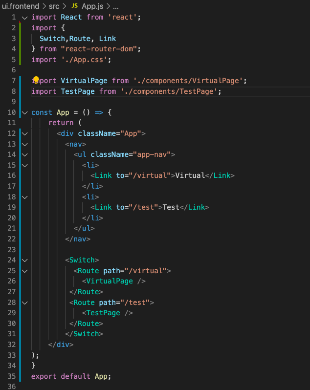

# Een externe SPA bewerken in Adobe Experience Manager {#editing-external-spa-within-aem}

Wanneer het beslissen welk niveau van integratie u tussen uw externe SPA en Adobe Experience Manager (AEM) zou willen hebben, moet u vaak het KUUROORD binnen AEM uitgeven en kunnen bekijken.

{{ue-over-spa}}

## Overzicht {#overview}

Dit document beschrijft de geadviseerde stappen om een standalone SPA aan een instantie van AEM te uploaden, editable secties van inhoud toe te voegen, en creatie toe te laten.

## Vereisten {#prerequisites}

De voorwaarden zijn eenvoudig.

* Zorg ervoor dat een instantie van AEM lokaal wordt uitgevoerd.
* Creeer een project van basisAEM SPA gebruikend [ het Archetype van het Project van AEM ](https://experienceleague.adobe.com/docs/experience-manager-core-components/using/developing/archetype/overview.html?lang=nl-NL&#available-properties).
   * Dit vormt de basis van het AEM-project dat zal worden bijgewerkt om de externe SPA op te nemen.
   * De steekproeven in dit document gebruiken het uitgangspunt van [ het project van KND SPA ](https://experienceleague.adobe.com/docs/experience-manager-learn/sites/spa-editor/spa-editor-framework-feature-video-use.html?lang=nl-NL#spa-editor).
* Heb het werkende, externe KUUROORD van de Reactie die u bij hand wenst te integreren.

## SPA uploaden naar AEM-project {#upload-spa-to-aem-project}

Eerst, moet u externe SPA aan uw project van AEM uploaden.

1. Vervang `src` in de `/ui.frontend` projectmap door de map `src` van de React-toepassing.
1. Neem eventuele extra afhankelijkheden op in het bestand `/ui.frontend/package.json` van de app `package.json` .
   * Zorg ervoor dat de gebiedsdelen van SDK van het KUUROORD van [ geadviseerde versies ](spa-getting-started-react.md#dependencies) zijn.
1. Neem aanpassingen op in de map `/public` .
1. Neem alle inlinescripts of stijlen op die in het `/public/index.html` -bestand zijn toegevoegd.

## Vorm Verre SPA {#configure-remote-spa}

Nu het externe KUUROORD deel van uw project van AEM uitmaakt, moet het binnen AEM worden gevormd.

### Inclusief Adobe SPA SDK-pakketten {#include-spa-sdk-packages}

Om uit de eigenschappen van AEM SPA voordeel te halen, zijn er gebiedsdelen op de volgende drie pakketten.

* [`@adobe/aem-react-editable-components`](https://github.com/adobe/aem-react-editable-components)
* [`@adobe/aem-spa-component-mapping`](https://www.npmjs.com/package/@adobe/aem-spa-component-mapping)
* [`@adobe/aem-spa-page-model-manager`](https://www.npmjs.com/package/@adobe/aem-spa-model-manager)

`@adobe/aem-spa-page-model-manager` verstrekt API voor het initialiseren van een ModelManager en het terugwinnen van het model van de instantie van AEM. Dit model kan vervolgens worden gebruikt om AEM-componenten te renderen met API&#39;s van `@adobe/aem-react-editable-components` en `@adobe/aem-spa-component-mapping` .

#### Installatie {#installation}

Voer de volgende npm-opdracht uit om de vereiste pakketten te installeren.

```shell
npm install --save @adobe/aem-spa-component-mapping @adobe/aem-spa-page-model-manager @adobe/aem-react-editable-components
```

### ModelManager-initialisatie {#model-manager-initialization}

Voordat de app wordt gerenderd, moet [`ModelManager`](spa-blueprint.md#pagemodelmanager) worden geïnitialiseerd om het maken van de AEM `ModelStore` af te handelen.

Dit moet worden gedaan binnen het `src/index.js` dossier van uw toepassing of waar de wortel van de toepassing wordt teruggegeven.

Hiervoor gebruikt u de `initializationAsync` -API van `ModelManager` .

De volgende schermafbeelding laat zien hoe u initialisatie van de `ModelManager` in een eenvoudige React-toepassing kunt inschakelen. De enige beperking is dat `initializationAsync` moet worden aangeroepen vóór `ReactDOM.render()` .


In dit voorbeeld wordt `ModelManager` geïnitialiseerd en wordt een lege `ModelStore` gemaakt.

De instructie `initializationAsync` kan optioneel een `options` -object als parameter accepteren:

* `path` - Bij initialisatie wordt het model op het gedefinieerde pad opgehaald en opgeslagen in de `ModelStore` . Hiermee kunt u, indien nodig, de `rootModel` bij initialisatie ophalen.
* `modelClient` - Hiermee kunt u een aangepaste client opgeven die het model ophaalt.
* `model` - Een `model` -object dat wordt doorgegeven als een parameter die doorgaans wordt gevuld bij gebruik van SSR.

### AEM Authorable Leaf Components {#authorable-leaf-components}

1. Maak/identificeer een AEM-component waarvoor een authorable React-component wordt gemaakt. In dit voorbeeld gebruikt het WKND-project de tekstcomponent.

   

1. Creeer een eenvoudige React tekstcomponent in SPA. In dit voorbeeld is een nieuw bestand `Text.js` gemaakt met de volgende inhoud.

   

1. Maak een configuratieobject om de kenmerken op te geven die nodig zijn voor het inschakelen van AEM-bewerkingen.

   

   * `resourceType` is verplicht om de component React toe te wijzen aan de AEM-component en het bewerken in te schakelen wanneer deze wordt geopend in de AEM Editor.

1. Gebruik de wrapper functie `withMappable` .

   

   Deze omsluitende functie wijst de component React toe aan de AEM `resourceType` die in config wordt gespecificeerd en laat het uitgeven mogelijkheden toe wanneer geopend in de Redacteur van AEM. Voor standalone componenten, haalt het ook de modelinhoud voor de specifieke knoop.

   >[!NOTE]
   >
   >In dit voorbeeld zijn er verschillende versies van de component: React-componenten met omloop en los van de omloop van AEM. De omgelopen versie moet worden gebruikt wanneer expliciet de component wordt gebruikt. Wanneer de component deel van een pagina uitmaakt, kunt u de standaardcomponent blijven gebruiken zoals momenteel gedaan in de redacteur van het KUUROORD.

1. Inhoud in de component renderen.

   De JCR-eigenschappen van de tekstcomponent worden als volgt weergegeven in AEM.

   

   Deze waarden worden als eigenschappen doorgegeven aan de nieuwe `AEMText` React-component en kunnen worden gebruikt om de inhoud te renderen.

   ```javascript
   import React from 'react';
   import { withMappable } from '@adobe/aem-react-editable-components';
   
   export const TextEditConfig = {
       // Empty component placeholder label
       emptyLabel:'Text', 
       isEmpty:function(props) {
          return !props || !props.text || props.text.trim().length < 1;
       },
       // resourcetype of the AEM counterpart component
       resourceType:'wknd-spa-react/components/text'
   };
   
   const Text = ({ text }) => (<div>{text}</div>);
   
   export default Text;
   
   export const AEMText = withMappable(Text, TextEditConfig);
   ```

   Zo wordt de component weergegeven wanneer de AEM-configuraties zijn voltooid.

   ```javascript
   const Text = ({ cqPath, richText, text }) => {
      const richTextContent = () => (
         <div className="aem_text" id={cqPath.substr(cqPath.lastIndexOf('/') + 1)} data-rte-editelement dangerouslySetInnerHTML={{__html: text}}/>
      );
      return richText ? richTextContent() : (<div className="aem_text">{text}</div>);
   };
   ```

   >[!NOTE]
   >
   >In dit voorbeeld zijn verdere aanpassingen aangebracht aan de gerenderde component, zodat deze overeenkomen met de bestaande tekstcomponent. Dit houdt echter geen verband met authoring in AEM.

#### Authorable Components toevoegen aan de pagina {#add-authorable-component-to-page}

Wanneer de authorable React componenten worden gecreeerd, kunnen zij door de toepassing worden gebruikt.

Neem een voorbeeldpagina waar de tekst van het project WKND SPA moet worden toegevoegd. In dit voorbeeld wilt u de tekst &quot;Hello World!&quot; weergeven op `/content/wknd-spa-react/us/en/home.html` .

1. Bepaal het pad van het knooppunt dat moet worden weergegeven.

   * `pagePath`: De pagina die het knooppunt bevat, in het voorbeeld `/content/wknd-spa-react/us/en/home`
   * `itemPath`: pad naar het knooppunt op de pagina, in het voorbeeld `root/responsivegrid/text`
      * Dit bestaat uit de namen van de bevattende items op de pagina.

   

1. Component toevoegen op de gewenste positie op de pagina.

    toe

   De component `AEMText` kan op de gewenste positie op de pagina worden toegevoegd met `pagePath` - en `itemPath` -waarden ingesteld als eigenschappen. `pagePath` is een verplichte eigenschap.

#### Bewerken van tekstinhoud op AEM controleren {#verify-text-edit}

Test nu de component op de actieve AEM-instantie.

1. Voer de volgende Maven-opdracht uit vanuit de `aem-guides-wknd-spa` -map om het project te bouwen en te implementeren in AEM.

```shell
mvn clean install -PautoInstallSinglePackage
```

1. Navigeer in uw AEM-instantie naar `http://<host>:<port>/editor.html/content/wknd-spa-react/us/en/home.html` .


De `AEMText` -component kan nu worden geschreven op AEM.

### AEM Authorable Pages {#aem-authorable-pages}

1. Identificeer een pagina die voor creatie in het KUUROORD moet worden toegevoegd. In dit voorbeeld wordt `/content/wknd-spa-react/us/en/home.html` gebruikt.
1. Maak een bestand (bijvoorbeeld `Page.js` ) voor de authorable Page Component. Hier kunt u de pagina-component opnieuw gebruiken, die beschikbaar is in `@adobe/cq-react-editable-components` .
1. Herhaal stap vier in de sectie [ AEM authorable bladcomponenten ](#authorable-leaf-components). Gebruik de wrapperfunctie `withMappable` op de component.
1. Zoals eerder is gedaan, past u `MapTo` toe op de AEM-brontypen voor alle onderliggende componenten in de pagina.

   ```javascript
   import { Page, MapTo, withMappable } from '@adobe/aem-react-editable-components';
   import Text, { TextEditConfig } from './Text';
   
   export default withMappable(Page);
   
   MapTo('wknd-spa-react/components/text')(Text, TextEditConfig);
   ```

   >[!NOTE]
   >
   >In dit voorbeeld wordt de tekstcomponent React zonder omloop gebruikt in plaats van de eerder gemaakte omloop `AEMText` . Wanneer de component deel uitmaakt van een pagina/container en niet zelfstandig is, zorgt de container ervoor dat de component recursief in kaart wordt gebracht en dat ontwerpmogelijkheden worden ingeschakeld en dat de extra omloop niet nodig is voor elk onderliggend element.

1. Om een authorable pagina in het KUUROORD toe te voegen, volg de zelfde stappen in de sectie [ Voeg Authorable Componenten aan de Pagina ](#add-authorable-component-to-page) toe. Hier kunnen we echter wel de eigenschap `itemPath` overslaan.

#### Pagina-inhoud verifiëren op AEM {#verify-page-content}

Om te verifiëren dat de pagina kan worden uitgegeven, volg de zelfde stappen in de sectie [ verifiëren het Uitgeven van de Inhoud van de Tekst op AEM ](#verify-text-edit).


De pagina kan nu worden bewerkt in AEM met een lay-outcontainer en onderliggende tekstcomponent.

### Virtuele bladonderdelen {#virtual-leaf-components}

In de vorige voorbeelden, hebben wij componenten aan SPA met bestaande inhoud van AEM toegevoegd. Er zijn echter gevallen waarin inhoud nog niet in AEM is gemaakt, maar later door de auteur van de inhoud moet worden toegevoegd. Om dit aan te passen, kan de front-end ontwikkelaar componenten in de aangewezen plaatsen binnen het KUUROORD toevoegen. Deze componenten zullen placeholders tonen wanneer geopend in de redacteur in AEM. Nadat de inhoud door de auteur van de inhoud in deze plaatsaanduidingen is toegevoegd, worden knooppunten gemaakt in de JCR-structuur en wordt de inhoud voortgezet. De gemaakte component staat dezelfde set bewerkingen toe als de zelfstandige bladcomponenten.

In dit voorbeeld wordt de eerder gemaakte component `AEMText` opnieuw gebruikt. Wij willen dat nieuwe tekst onder de bestaande tekstcomponent op de WKND homepage wordt toegevoegd. De toevoeging van componenten is hetzelfde als voor normale bladcomponenten. De `itemPath` kan echter worden bijgewerkt naar het pad waar de nieuwe component moet worden toegevoegd.

Aangezien de nieuwe component onder de bestaande tekst bij `root/responsivegrid/text` moet worden toegevoegd, is het nieuwe pad `root/responsivegrid/{itemName}` .

```html
<AEMText
 pagePath='/content/wknd-spa-react/us/en/home'
 itemPath='root/responsivegrid/text_20' />
```

De component `TestPage` ziet er als volgt uit nadat de virtuele component is toegevoegd.


>[!NOTE]
>
>Zorg ervoor dat de `AEMText` -component in de configuratie de `resourceType` -set heeft om deze functie in te schakelen.

U kunt de veranderingen in AEM na de stappen in de sectie [ nu opstellen verifieert het Uitgeven van de Inhoud van de Tekst op AEM ](#verify-text-edit). Er wordt een tijdelijke aanduiding weergegeven voor het knooppunt `text_20` dat momenteel niet bestaat.


Wanneer de auteur van de inhoud deze component bijwerkt, wordt een nieuw knooppunt `text_20` gemaakt op `root/responsivegrid/text_20` in `/content/wknd-spa-react/us/en/home` .


#### Eisen en beperkingen {#limitations}

Er zijn verschillende vereisten om virtuele bladcomponenten en enkele beperkingen toe te voegen.

* De eigenschap `pagePath` is verplicht voor het maken van een virtuele component.
* Het paginaknooppunt op het pad in `pagePath` moet bestaan in het AEM-project.
* De naam van het knooppunt dat moet worden gemaakt, moet worden opgegeven in de map `itemPath` .
* De component kan op elk niveau worden gemaakt.
   * Als we in het vorige voorbeeld een `itemPath='text_20'` opgeven, wordt het nieuwe knooppunt direct onder de pagina gemaakt, namelijk `/content/wknd-spa-react/us/en/home/jcr:content/text_20`
* Het pad naar het knooppunt waar een nieuw knooppunt wordt gemaakt, moet geldig zijn wanneer dit via `itemPath` wordt opgegeven.
   * In dit voorbeeld moet `root/responsivegrid` bestaan, zodat het nieuwe knooppunt `text_20` daar kan worden gemaakt.
* Alleen het maken van bladcomponenten wordt ondersteund. Virtuele container en pagina worden in toekomstige versies ondersteund.

### Virtuele containers {#virtual-containers}

De mogelijkheid om containers toe te voegen, zelfs als de bijbehorende container nog niet in AEM is gemaakt, wordt ondersteund. Het concept en de benadering zijn gelijkaardig aan [ virtuele bladcomponenten.](#virtual-leaf-components)

De front-end ontwikkelaar kan de containercomponenten in aangewezen plaatsen binnen SPA toevoegen en deze componenten zullen placeholders tonen wanneer geopend in de redacteur in AEM. De auteur kan vervolgens componenten en de inhoud ervan toevoegen aan de container, waarmee de vereiste knooppunten in de JCR-structuur worden gemaakt.

Als er bijvoorbeeld al een container bestaat bij `/root/responsivegrid` en de ontwikkelaar een nieuwe onderliggende container wil toevoegen:


`newContainer` bestaat nog niet in de AEM.

Wanneer u de pagina met deze component bewerkt in AEM, wordt een lege plaatsaanduiding voor een container weergegeven waarin de auteur inhoud kan toevoegen.


Nadat de auteur een onderliggende component aan de container heeft toegevoegd, wordt het nieuwe containerknooppunt gemaakt met de corresponderende naam in de JCR-structuur.


Meer componenten en inhoud kunnen nu aan de container worden toegevoegd zoals de auteur vereist en de wijzigingen zullen worden voortgezet.

#### Eisen en beperkingen {#container-limitations}

Er zijn verschillende vereisten om virtuele containers en enkele beperkingen toe te voegen.

* Het beleid om te bepalen welke componenten kunnen worden toegevoegd zal van de oudercontainer worden geërft.
* Het directe bovenliggende element van de container die moet worden gemaakt, moet al bestaan in AEM.
   * Als de container `root/responsivegrid` al in de AEM-container bestaat, kan een nieuwe container worden gemaakt door het pad `root/responsivegrid/newContainer` op te geven.
   * `root/responsivegrid/newContainer/secondNewContainer` is echter niet mogelijk.
* Er kan slechts één nieuw componentniveau per keer worden gemaakt.

## Aanvullende aanpassingen {#additional-customizations}

Als u de vorige voorbeelden volgt, is uw externe SPA nu editable binnen AEM. Nochtans zijn er extra aspecten van uw externe SPA die u kunt verder aanpassen.

### Hoofdknooppunt-id {#root-node-id}

Standaard gaan we ervan uit dat de React-toepassing wordt gerenderd in een `div` element-id `spa-root` . Indien nodig, kan dit worden aangepast.

Stel bijvoorbeeld dat er een SPA is waarin de toepassing wordt gerenderd in een `div` element-id `root` . Dit moet worden weerspiegeld in drie bestanden.

1. In de `index.js` van de React-toepassing (of waar `ReactDOM.render()` wordt aangeroepen)

   

1. In de `index.html` van de React-toepassing

   

1. Ga in de hoofdtekst van de paginacomponent van de AEM-app als volgt te werk:

   1. Maak een `body.html` voor de paginacomponent.

   

   1. Voeg het nieuwe basiselement toe aan het nieuwe `body.html` -bestand.

   

### Het uitgeven van React SPA met het Verpletteren {#editing-react-spa-with-routing}

Als de externe toepassing van het KUUROORD Reageren veelvoudige pagina&#39;s heeft, [ kan het gebruiken verpletterend om de pagina/component te bepalen om ](spa-routing.md) terug te geven. Het basisgebruiksgeval moet momenteel - actieve URL met de weg aanpassen die voor een route wordt verstrekt. Om het uitgeven op dergelijke verpletterende toegelaten toepassingen toe te laten, moet de weg worden aangepast tegen moet worden getransformeerd om AEM-specifieke info aan te passen.

In het volgende voorbeeld hebben we een eenvoudige React-toepassing met twee pagina&#39;s. De pagina die moet worden teruggegeven wordt bepaald door de weg aan de router tegen actieve URL wordt verstrekt aan te passen. Als we bijvoorbeeld op `mydomain.com/test` staan, wordt `TestPage` weergegeven.



Om het uitgeven binnen AEM voor dit voorbeeldSPA toe te laten, worden de volgende stappen vereist.

1. Identificeer het niveau dat als wortel op AEM zou dienst doen.

   * Voor ons voorbeeld, beschouwen wij `wknd-spa-react/us/en` als de wortel van SPA. Dit betekent dat alles vóór dat pad alleen AEM-pagina&#39;s/inhoud is.

1. Maak een pagina op het vereiste niveau.

   * In dit voorbeeld is de pagina die moet worden bewerkt `mydomain.com/test` . `test` bevindt zich in het hoofdpad van de app. Dit moet ook worden behouden bij het maken van de pagina in AEM. Daarom kunt u een pagina op het wortelniveau tot stand brengen dat in de vorige stap wordt bepaald.
   * De nieuwe pagina die u maakt, moet dezelfde naam hebben als de pagina die u wilt bewerken. In dit voorbeeld voor `mydomain.com/test` moet de nieuwe gemaakte pagina `/path/to/aem/root/test` zijn.

1. Voeg helpers binnen het verpletteren van het KUUROORD toe.

   * De nieuw gemaakte pagina geeft de verwachte inhoud in AEM nog niet weer. Dit komt omdat de router een weg van `/test` verwacht terwijl de actieve weg van AEM `/wknd-spa-react/us/en/test` is. Om het AEM-specifieke gedeelte van URL aan te passen, moeten wij sommige helpers aan de kant van het KUUROORD toevoegen.

   

   * Hiervoor kunt u de `toAEMPath` helper gebruiken die door `@adobe/cq-spa-page-model-manager` wordt geleverd. Het transformeert de weg die voor het verpletteren wordt verstrekt om AEM-specifieke gedeelten te omvatten wanneer de toepassing op een instantie van AEM open is. Er worden drie parameters geaccepteerd:
      * De weg die voor het verpletteren wordt vereist
      * De oorsprong-URL van de instantie AEM waar de SPA wordt bewerkt
      * De projectwortel op AEM zoals die in eerste stap wordt bepaald

   * Deze waarden kunnen worden ingesteld als omgevingsvariabelen voor meer flexibiliteit.

1. Verifieer het uitgeven van de pagina in AEM.

   * Implementeer het project op AEM en navigeer naar de nieuwe pagina `test` . De pagina-inhoud wordt nu gerenderd en AEM-componenten kunnen worden bewerkt.

## Kaderbeperkingen {#framework-limitations}

De component RemotePage verwacht dat de implementatie activa-manifest zoals [ webpack-manifest-stop op GitHub ](https://github.com/shellscape/webpack-manifest-plugin) verstrekt. De component RemotePage is echter alleen getest om te werken met het React-framework (en Next.js via de component Remote-page-next) en biedt daarom geen ondersteuning voor het extern laden van toepassingen vanuit andere frameworks, zoals Angular.

## Aanvullende bronnen {#additional-resources}

Het volgende referentiemateriaal kan nuttig zijn om SPAs in de context van AEM te begrijpen.

* [ The AEM Project Archetype ](https://experienceleague.adobe.com/docs/experience-manager-core-components/using/developing/archetype/overview.html?lang=nl-NL)
* [ het project van het KND SPA ](https://experienceleague.adobe.com/docs/experience-manager-learn/sites/spa-editor/spa-editor-framework-feature-video-use.html?lang=nl-NL)
* [Begonnen het worden met SPAs in AEM Gebruikend Reageren](spa-getting-started-react.md)
* [SPA Reference Materials (API-referenties)](spa-reference-materials.md)
* [SPA Blueprint en PageModelManager](spa-blueprint.md#pagemodelmanager)
* [SPA Model Routing](spa-routing.md)
