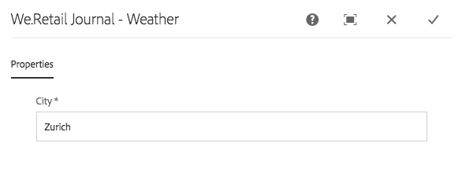

# Een component React implementeren voor SPA{#implementing-a-react-component-for-spa}

Toepassingen op één pagina (SPA) kunnen aantrekkelijke ervaringen bieden voor websitegebruikers. Ontwikkelaars willen sites kunnen maken met behulp van SPA frameworks en auteurs willen inhoud naadloos bewerken binnen Adobe Experience Manager (AEM) voor een site die is gebouwd met behulp van SPA frameworks.

De SPA ontwerpfunctie biedt een uitgebreide oplossing voor het ondersteunen van SPA binnen AEM. Dit artikel biedt een voorbeeld van hoe u een eenvoudige, bestaande React-component kunt aanpassen aan het werk met de AEM SPA Editor.

>[!NOTE]
>
>De SPA Redacteur is de geadviseerde oplossing voor projecten die SPA op kader-gebaseerde cliënt-zijteruggeven (bijvoorbeeld, Reageren of Angular) vereisen.

## Inleiding {#introduction}

Dankzij het eenvoudige en lichte contract dat AEM tussen de SPA en de SPA Editor vereist en tot stand brengt, is het eenvoudig om een bestaande JavaScript-toepassing te gebruiken en aan te passen voor gebruik met een SPA in AEM.

Dit artikel illustreert het voorbeeld van de weercomponent op de Wij.Retail steekproef van het Dagboek SPA.

U moet bekend zijn met de [structuur van een SPA aanvraag voor AEM](/help/sites-developing/spa-getting-started-react.md) voordat u dit artikel leest.

>[!CAUTION]
>In dit document worden de [We.Retail Journal-app](https://github.com/adobe/aem-sample-we-retail-journal) uitsluitend voor demonstratiedoeleinden. Gebruik het niet voor enig projectwerk.
>
>Voor elk AEM project moet het [Projectarchetype AEM](https://experienceleague.adobe.com/docs/experience-manager-core-components/using/developing/archetype/overview.html), die SPA projecten steunt die React of Angular gebruiken en SPA SDK gebruikt.

## De component Weer {#the-weather-component}

De weercomponent staat linksboven in de app Web.Retail Journal. Het toont het huidige weer van een bepaalde plaats, trekkend dynamisch weergegevens.

### De widget Weer gebruiken {#using-the-weather-widget}


Wanneer u inhoud van de SPA ontwerpt in de SPA Editor, wordt de weercomponent net als elke andere AEM weergegeven, compleet met een werkbalk en is deze bewerkbaar.


De plaats kan in een dialoog enkel als om het even welke andere AEM component worden bijgewerkt.



De wijziging blijft bestaan en de component wordt automatisch bijgewerkt met nieuwe weergegevens.


### Implementatie van weercomponent {#weather-component-implementation}

De weercomponent is gebaseerd op een openbaar beschikbare component React, genaamd [Geopend weefsel reageren](https://www.npmjs.com/package/react-open-weather). Het is aangepast om als component binnen de Wij.Retail SPA toepassing van de steekproef van het Dagboek te werken.

Hieronder vindt u fragmenten uit de NPM-documentatie van het gebruik van de component React Open Weather.

 

De code van de aangepaste weercomponent bekijken ( `Weather.js`) in de toepassing We.Retail Journal:

* **Regel 16**: De widget Open Weer reageren wordt naar wens geladen.
* **Regel 46**: De `MapTo` Deze React-component wordt aan een overeenkomende AEM gekoppeld, zodat deze kan worden bewerkt in de SPA Editor.

* **Lijnen 22-29**: De `EditConfig` wordt gedefinieerd, wordt gecontroleerd of de stad is gevuld en wordt de waarde gedefinieerd als deze leeg is.

* **Lijnen 31-44**: De component Weather breidt de `Component` en bevat de vereiste gegevens zoals gedefinieerd in de NPM-gebruiksdocumentatie voor de React Open Weather-component en geeft de component weer.

```javascript
/*~~~~~~~~~~~~~~~~~~~~~~~~~~~~~~~~~~~~~~~~~~~~~~~~~~~~~~~~~~~~~~~~~~~~~~~~~~~~~~
 ~ Copyright 2018 Adobe Systems Incorporated
 ~
 ~ Licensed under the Apache License, Version 2.0 (the "License");
 ~ you may not use this file except in compliance with the License.
 ~ You may obtain a copy of the License at
 ~
 ~     https://www.apache.org/licenses/LICENSE-2.0
 ~
 ~ Unless required by applicable law or agreed to in writing, software
 ~ distributed under the License is distributed on an "AS IS" BASIS,
 ~ WITHOUT WARRANTIES OR CONDITIONS OF ANY KIND, either express or implied.
 ~ See the License for the specific language governing permissions and
 ~ limitations under the License.
 ~~~~~~~~~~~~~~~~~~~~~~~~~~~~~~~~~~~~~~~~~~~~~~~~~~~~~~~~~~~~~~~~~~~~~~~~~~~~~*/
import React, {Component} from 'react';
import ReactWeather from 'react-open-weather';
import {MapTo} from '@adobe/aem-react-editable-components';

require('./Weather.css');

const WeatherEditConfig = {

    emptyLabel: 'Weather',

    isEmpty: function() {
        return !this.props || !this.props.cq_model || !this.props.cq_model.city || this.props.cq_model.city.trim().length < 1;
    }
};

class Weather extends Component {

    render() {
        let apiKey = "12345678901234567890";
        let city;

        if (this.props.cq_model) {
            city = this.props.cq_model.city;
            return <ReactWeather key={'react-weather' + Date.now()} forecast="today" apikey={apiKey} type="city" city={city} />
        }

        return null;
    }
}

MapTo('we-retail-journal/global/components/weather')(Weather, WeatherEditConfig);
```

Hoewel een achterste-eindcomponent reeds moet bestaan, kan de voorste-eindontwikkelaar de React Open component van het Weer in het SPA van het Dagboek gebruiken Wij.Retail met weinig codering.

## Volgende stap {#next-step}

Zie het artikel voor meer informatie over SPA ontwikkelen voor AEM [SPA ontwikkelen voor AEM](/help/sites-developing/spa-architecture.md).
