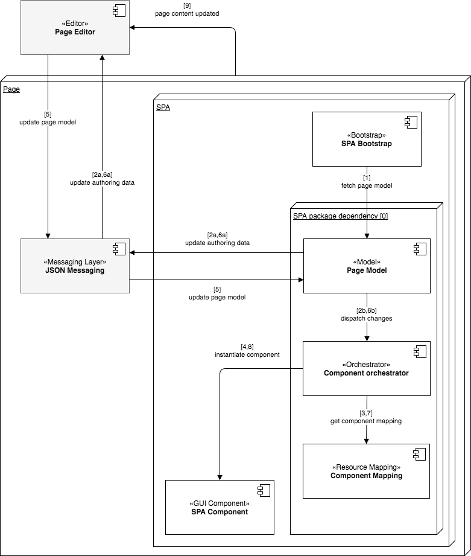

# Overzicht van SPA-editor{#spa-editor-overview}

Toepassingen van één pagina (SPAs) kunnen dwingende ervaringen voor websitegebruikers aanbieden. De ontwikkelaars willen plaatsen kunnen bouwen gebruikend het kader van het KUUROORD en de auteurs willen inhoud binnen AEM voor een plaats foutloos uitgeven die gebruikend dergelijke kaders wordt gebouwd.

De redacteur van het KUUROORD biedt een uitvoerige oplossing voor het steunen van SPAs binnen AEM aan. Deze pagina geeft een overzicht van hoe de steun van het KUUROORD in AEM gestructureerd is, hoe de Redacteur van het KUUROORD werkt, en hoe het kader van het KUUROORD en AEM in synch houden.

>[!NOTE]
>
>De redacteur van het KUUROORD is de geadviseerde oplossing voor projecten die het kader van het KUUROORD gebaseerde cliënt-kant teruggeven (b.v. Reageren of Hoekig) vereisen.

## Inleiding {#introduction}

De plaatsen die gebruikend gemeenschappelijke kaders van het KUUROORD zoals Reageren en Hoekig worden gebouwd laden hun inhoud via dynamische JSON en verstrekken niet de structuur van HTML die noodzakelijk voor de Redacteur van de Pagina AEM is om bewerkingscontroles te kunnen plaatsen.

Om het uitgeven van SPAs binnen AEM toe te laten, is een afbeelding tussen de output JSON van het KUUROORD en het inhoudsmodel in de bewaarplaats AEM nodig om veranderingen in de inhoud te bewaren.

De steun van het KUUROORD in AEM introduceert een dunne laag JS die met de code van het KUUROORD JS wanneer geladen in de Redacteur van de Pagina interactie heeft waarmee de gebeurtenissen kunnen worden verzonden en de plaats voor uitgeeft controles kunnen worden geactiveerd om in-context het uitgeven toe te staan. Deze eigenschap bouwt op het concept van het Eindpunt van de Diensten van de Inhoud API voort aangezien de inhoud van het KUUROORD via de Diensten van de Inhoud moet worden geladen.

Voor verdere details over SPAs in AEM, zie de volgende documenten:

* [KUUROORD Blauwdruk](/help/sites-developing/spa-blueprint.md) voor de technische vereisten van een KUUROORD
* [Begonnen het worden met SPAs in AEM](/help/sites-developing/spa-getting-started-react.md) voor een snelle tour van een eenvoudige SPA

## Ontwerp {#design}

De paginacomponent voor een SPA verstrekt niet de elementen van HTML van zijn kindcomponenten via het JSP of HTML- dossier. Deze verrichting wordt gedelegeerd aan het kader van het KUUROORD. De representatie van onderliggende componenten of modellen wordt opgehaald als een JSON-gegevensstructuur van het JCR. De componenten van het KUUROORD worden dan toegevoegd aan de pagina volgens die structuur. Dit gedrag onderscheidt de aanvankelijke lichaamcompositie van de paginacomponent van niet-SPA tegenhangers.

### Paginamodel beheren {#page-model-management}

De resolutie en het beheer van het paginamodel worden gedelegeerd aan een opgegeven `PageModel` bibliotheek. Het KUUROORD moet de bibliotheek van het Model van de Pagina gebruiken om worden geïnitialiseerd en door de Redacteur van het KUUROORD worden authored. De bibliotheek Paginamodel die indirect via de `cq-react-editable-components` npm wordt geleverd aan de component AEM Page. Het paginamodel is een tolk tussen AEM en SPA en moet daarom altijd aanwezig zijn. Wanneer de pagina is gemaakt, `cq.authoring.pagemodel.messaging` moet een extra bibliotheek worden toegevoegd om de communicatie met de paginaeditor mogelijk te maken.

Als de de paginacomponent van het KUUROORD van de component van de paginaconnecorrectie erft, zijn er twee opties om de categorie van de `cq.authoring.pagemodel.messaging` cliëntbibliotheek beschikbaar te maken:

* Als de sjabloon bewerkbaar is, voegt u deze toe aan het paginabeleid.
* U kunt ook de categorieën toevoegen met behulp van de `customfooterlibs.html`.

Voor elk middel in het uitgevoerde model zal SPA een daadwerkelijke component in kaart brengen die het teruggeven zal doen. Het model, dat als JSON wordt vertegenwoordigd, wordt dan teruggegeven gebruikend de componentenafbeeldingen binnen een container.

>[!CAUTION]
>
>De opname van de `cq.authoring.pagemodel.messaging` categorie moet worden beperkt tot de context van de redacteur van de SPA.

### Gegevenstype communicatie {#communication-data-type}

Wanneer de `cq.authoring.pagemodel.messaging` categorie aan de pagina wordt toegevoegd, wordt een bericht naar de Pagina-editor verzonden om het gegevenstype JSON-communicatiegegevens vast te stellen. Wanneer het communicatie gegevenstype aan JSON wordt geplaatst, zullen de GET verzoeken met de het Verdelen Model eindpunten van een component communiceren. Nadat een update in de pagina-editor plaatsvindt, wordt de JSON-representatie van de bijgewerkte component verzonden naar de bibliotheek Paginamodel. De bibliotheek van het Model van de Pagina informeert dan het KUUROORD van updates.

## Workflow {#workflow}

U kunt de stroom van de interactie tussen SPA en AEM begrijpen door van de Redacteur van het KUUROORD als bemiddelaar tussen twee te denken.

* De communicatie tussen de paginaredacteur en SPA wordt gemaakt gebruikend JSON in plaats van HTML.
* De paginaredacteur verstrekt de recentste versie van het paginamodel aan het KUUROORD via iframe en overseinen API.
* De manager van het paginamodel brengt de redacteur op de hoogte het klaar voor uitgave is en gaat het paginamodel als structuur JSON over.
* De editor wijzigt de DOM-structuur van de pagina die wordt gemaakt niet of opent deze zelfs niet, maar biedt het nieuwste paginamodel.

### Basis de Werkstroom van de Redacteur van het KUUROORD {#basic-spa-editor-workflow}

Rekening houdend met de belangrijkste elementen van de Redacteur van het KUUROORD, verschijnt het werkschema op hoog niveau van het uitgeven van een KUUROORD binnen AEM aan de auteur als volgt.

1. De redacteur van het KUUROORD laadt.
1. SPA wordt geladen in een afzonderlijk kader.
1. SPA vraagt JSON-inhoud aan en rendert componenten client-side.
1. De Redacteur van het KUUROORD ontdekt teruggegeven componenten en produceert overlays.
1. De auteur klikt op bedekking en toont de bewerkingswerkbalk van de component.
1. De Redacteur van het KUUROORD persisteert uitgeeft met een POST- verzoek aan de server.
1. De redacteur van het KUUROORD verzoekt bijgewerkte JSON aan de Redacteur van het KUUROORD, die naar het KUUROORD met een DOM Gebeurtenis wordt verzonden.
1. SPA geeft de betrokken component opnieuw terug, die zijn DOM bijwerkt.

>[!NOTE]
>
>Houd rekening met:
>
>* De SPA is altijd verantwoordelijk voor zijn vertoning.
>* De redacteur van het KUUROORD wordt geïsoleerd van het KUUROORD zelf.
>* In productie (publiceer), wordt de redacteur van het KUUROORD nooit geladen.
>

### Workflow voor paginabewerking op client-server {#client-server-page-editing-workflow}

Dit is een meer gedetailleerd overzicht van de cliënt-server interactie wanneer het uitgeven van een KUUROORD.

1. Het KUUROORD initialiseert zich en verzoekt het paginamodel van de Verschuivende ModelExporter.
1. De verkoper ModelExporter verzoekt om de middelen die de pagina van de bewaarplaats samenstellen.
1. De repository retourneert de bronnen.
1. De verkoper van het ModelExporter keert het model van de pagina terug.
1. Het KUUROORD concretiseert zijn componenten die op het paginamodel worden gebaseerd.
1. **6a** De inhoud informeert de editor dat deze gereed is voor ontwerpen.

   **6b** De paginaredacteur verzoekt de componentenauteursconfiguraties.

   **6c** De pagina-editor ontvangt de componentconfiguraties.
1. Wanneer de auteur een component bewerkt, wordt in de pagina-editor een wijzigingsverzoek naar de standaard POST-servlet gepost.
1. De bron wordt bijgewerkt in de opslagplaats.
1. De bijgewerkte bron wordt geleverd aan de POST-servlet.
1. De standaard POST servlet deelt de paginaredacteur mee dat het middel is bijgewerkt.
1. De paginaeditor vraagt om het nieuwe paginamodel.
1. De bronnen waaruit de pagina bestaat, worden opgevraagd bij de opslagplaats.
1. De bronnen waaruit de pagina bestaat, worden door de gegevensopslagruimte aan de Verkoopmodel Exporter verschaft.
1. Het bijgewerkte paginamodel wordt geretourneerd aan de editor.
1. De paginaredacteur werkt de verwijzing van het paginamodel van SPA bij.
1. Het KUUROORD werkt zijn componenten bij die op de nieuwe verwijzing van het paginamodel worden gebaseerd.
1. De componentconfiguraties van de paginaeditors worden bijgewerkt.

   **17a** het KUUROORD signaleert de paginaredacteur dat de inhoud klaar is.

   **17b** De paginaredacteur verstrekt het KUUROORD van componentenconfiguraties.

   **17c** SPA verstrekt bijgewerkte componentenconfiguraties.

### Ontwerpworkflow {#authoring-workflow}

Dit is een gedetailleerder overzicht dat is toegespitst op de ontwerpervaring.

1. Het KUUROORD haalt het paginamodel.
1. **2a** Het paginamodel voorziet de redacteur van de gegevens die voor creatie worden vereist.

   **2b** Wanneer een melding verschijnt, werkt de componentbeheerder de inhoudsstructuur van de pagina bij.
1. De componentenbeheerder vraagt de afbeelding tussen een AEM middeltype en een component van het KUUROORD.
1. De componentenorganisator concretiseert dynamisch de component van het KUUROORD die op het paginamodel en componentenafbeelding wordt gebaseerd.
1. De paginaeditor werkt het paginamodel bij.
1. **6a** Het paginamodel biedt bijgewerkte ontwerpgegevens aan de pagina-editor.

   **6b** Het paginamodel verzendt wijzigingen naar de componentorchestrator.
1. De componentorchestrator haalt de componenttoewijzing op.
1. De componentbeheerder werkt de inhoud van de pagina bij.
1. Wanneer SPA voltooit het bijwerken van de inhoud van de pagina, laadt de paginaredacteur het auteursmilieu.

## Vereisten en beperkingen {#requirements-limitations}

Om de auteur toe te laten om de paginaredacteur te gebruiken om de inhoud van een KUUROORD uit te geven, moet uw toepassing van het KUUROORD worden uitgevoerd om met de Redacteur SDK van AEM SPA in wisselwerking te staan. Gelieve te zien het [Begonnen Worden met SPAs in AEM](/help/sites-developing/spa-getting-started-react.md) document voor minimum dat u moet weten om van u het lopen te krijgen.

### Ondersteunde kaders {#supported-frameworks}

De redacteur SDK van het KUUUROORD steunt de volgende minimale versies:

* Reageren 16.3
* Hoek 6.x

Eerdere versies van deze frameworks werken mogelijk met de AEM SPA Editor SDK, maar worden niet ondersteund.

### Aanvullende kaders {#additional-frameworks}

De extra kaders van het KUUROORD kunnen worden uitgevoerd om met de Redacteur SDK van AEM te werken SPA. Gelieve te zien het document van de Blauwdruk [van het](/help/sites-developing/spa-blueprint.md) KUUROORD voor de vereisten die een kader moet vervullen om een kader-specifieke laag tot stand te brengen die uit modules, componenten, en de diensten wordt samengesteld om met de Redacteur van het KUUROORD AEM te werken.

### Meerdere kiezers gebruiken {#multiple-selectors}

De extra douanekiezers kunnen als deel van een SPA worden bepaald en worden gebruikt die voor AEM SPA SDK wordt ontwikkeld. Voor deze ondersteuning is echter vereist dat de `model` kiezer de eerste kiezer is en dat de extensie `.json` voldoet aan de [eisen van de JSON Exporter.](json-exporter-components.md#multiple-selectors)

### Vereisten voor teksteditor {#text-editor-requirements}

Als u op zijn plaats redacteur van een tekstcomponent wilt gebruiken die in KUUROORD wordt gecreeerd is er extra vereiste configuratie.

1. Stel een willekeurig kenmerk in op het containerelement dat de tekst-HTML bevat. In het geval van de WKND de steekproefinhoud van het Dagboek, is het een `
` element en de selecteur die is gebruikt is `data-rte-editelement`.
1. Stel de configuratie in `editElementQuery` op de overeenkomende AEM-tekstcomponent `cq:InplaceEditingConfig` die naar die kiezer wijst, bijvoorbeeld `data-rte-editelement`. Hierdoor weet de editor welk HTML-element de HTML-tekst omsluit.

Voor een voorbeeld van hoe dit wordt gedaan, zie de de steekproefinhoud van het [Dagboek van WKND.](https://github.com/adobe/aem-sample-we-retail-journal/pull/16/files)

Voor extra informatie over het `editElementQuery` bezit en de configuratie van de rijke tekstredacteur, zie de Rich Redacteur van de Tekst [vormen.](/help/sites-administering/rich-text-editor.md)

### Beperkingen {#limitations}

De redacteur SDK van AEM SPA werd geïntroduceerd met AEM 6.4 de dienstpak 2. Adobe biedt volledige ondersteuning voor dit programma en het wordt als een nieuwe functie nog steeds uitgebreid. De volgende eigenschappen AEM worden nog niet gesteund door de Redacteur van het KUUROORD:

* Doelmodus
* ContextHub
* Inline-afbeeldingen bewerken
* Configs bewerken (bijv. listeners)
* Stijlsysteem
* Ongedaan maken/Opnieuw
* Pagina diff en Tijd verdraaien
* Functies voor het herschrijven van HTML aan de serverzijde, zoals Koppelingencontrole, CDN-herschrijfservice, URL-verkorting, enz.
* Modus Ontwikkelaar
* AEM Launches
