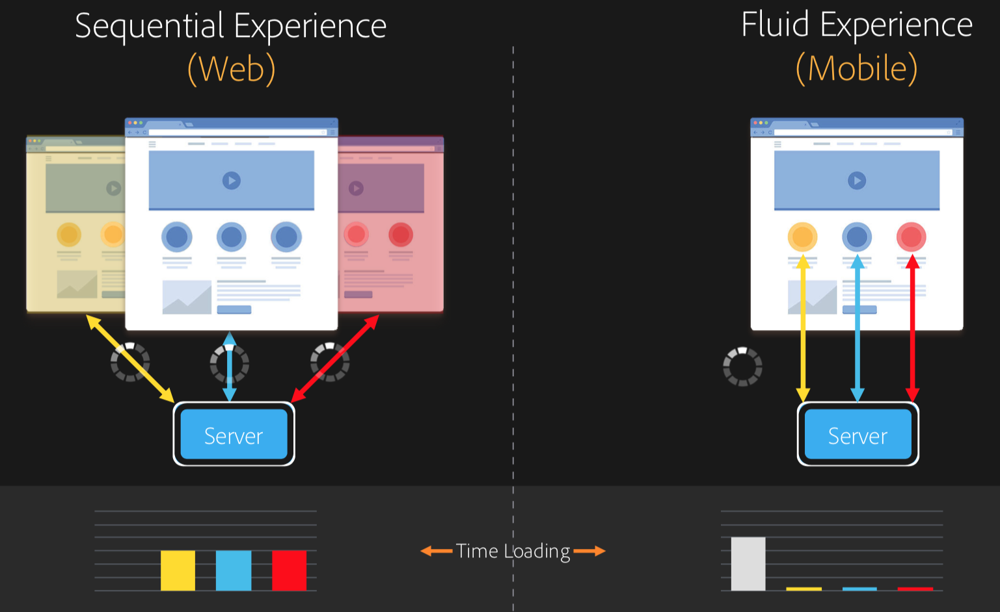

# Introductie van het KUUROORD en Analyse{#spa-introduction-and-walkthrough}

Toepassingen van één pagina (SPAs) kunnen dwingende ervaringen voor websitegebruikers aanbieden. De ontwikkelaars willen plaatsen kunnen bouwen gebruikend het kader van het KUUROORD en de auteurs willen inhoud binnen AEM voor een plaats foutloos uitgeven die gebruikend dergelijke kaders wordt gebouwd.

De redacteur van het KUUROORD biedt een uitvoerige oplossing voor het steunen van SPAs binnen AEM aan. Dit artikel loopt door het gebruiken van een basistoepassing van het KUUROORD voor creatie en toont hoe het op de onderliggende Redacteur van AEM SPA betrekking heeft.

>[!NOTE]
>
>De redacteur van het KUUROORD is de geadviseerde oplossing voor projecten die het kader van het KUUROORD gebaseerde cliënt-kant teruggeven (b.v. Reageren of Hoekig) vereisen.

## Inleiding {#introduction}

### Artikel {#article-objective}

Dit artikel introduceert de basisconcepten SPAs alvorens de lezer door een analyse van de redacteur van het KUUROORD door een eenvoudige toepassing van het KUUROORD te gebruiken om basisinhoud het uitgeven aan te tonen. Het duikt dan neer in de bouw van de pagina en hoe de toepassing van het KUUROORD op en met de Redacteur van AEM SPA betrekking heeft.

Het doel van deze inleiding en analyse moet aan een ontwikkelaar aantonen AEM waarom SPAs relevant zijn, hoe zij over het algemeen werken, hoe een KUUROORD door de Redacteur van AEM SPA wordt behandeld, en hoe het van een standaardAEM toepassing verschillend is.

De analyse is gebaseerd op standaard functionaliteit AEM en de steekproefWij.Retail app van het Dagboek. Aan de volgende eisen moet worden voldaan:

* [AEM versie 6.4 met servicepack 2 of hoger
   ](/help/release-notes/sp-release-notes.md)
* [Installeer de steekproefWij.Retail app van het Dagboek beschikbaar op GitHub hier.](https://github.com/Adobe-Marketing-Cloud/aem-sample-we-retail-journal)

>[!CAUTION]
>
>Dit document gebruikt de app [](https://github.com/Adobe-Marketing-Cloud/aem-sample-we-retail-journal) We.Retail Journal alleen voor demonstratiedoeleinden. Het mag niet worden gebruikt voor projectwerkzaamheden.
>
>Om het even welk project AEM zou hefboomwerking het Archetype [van het Project van](https://docs.adobe.com/content/help/en/experience-manager-core-components/using/developing/archetype/overview.html)AEM, dat de projecten van het KUUROORD gebruikend React of Hoekig steunt en hefboomwerkingen SDK van het KUUROORD.

### Wat is een SPA? {#what-is-a-spa}

Een enig-paginatoepassing (SPA) verschilt van een conventionele pagina in die zin dat het cliënt-kant wordt teruggegeven en hoofdzakelijk Javascript-gedreven is, die op Ajax vraag baseert om gegevens te laden en dynamisch de pagina bij te werken. De meeste of alle inhoud wordt één keer opgehaald in één pagina die wordt geladen met extra bronnen die asynchroon worden geladen, afhankelijk van gebruikersinteractie met de pagina.

Hierdoor is het minder nodig pagina&#39;s te vernieuwen en wordt de gebruiker een ervaring geboden die naadloos, snel is en meer lijkt op een native app-ervaring.

De redacteur van AEM SPA staat front-end ontwikkelaars toe om SPAs tot stand te brengen die in een plaats kan worden geïntegreerd AEM, die de inhoudsauteurs toestaat om de inhoud van het KUUROORD zo gemakkelijk zoals om het even welke andere inhoud uit te geven AEM.

### Waarom een SPA? {#why-a-spa}

Door sneller, dynamisch, en meer als een inheemse toepassing te zijn, wordt een SPA een zeer aantrekkelijke ervaring niet alleen voor de bezoeker van de webpagina, maar ook voor marketers en ontwikkelaars toe te schrijven aan de aard van hoe SPAs werkt.


**Bezoekers**

* Bezoekers willen native ervaringen als ze met inhoud werken.
* Er zijn duidelijke gegevens dat hoe sneller een pagina, hoe waarschijnlijker een conversie zal plaatsvinden.

**Marketers**

* Marketers willen rijke, native ervaringen bieden om bezoekers te dwingen om zich volledig met inhoud bezig te houden.
* Personalisatie kan deze ervaringen nog aantrekkelijker maken.

**Ontwikkelaars**

* Ontwikkelaars willen een duidelijke scheiding tussen inhoud en presentatie.
* Schone scheiding maakt het systeem uitbreidbaarder en maakt een onafhankelijke ontwikkeling aan de voorzijde mogelijk.

### Hoe werkt een SPA? {#how-does-a-spa-work}

Het primaire idee achter een KUUROORD is dat de vraag en de afhankelijkheid van een server worden verminderd om vertragingen te minimaliseren die door servervraag worden veroorzaakt zodat SPA de ontvankelijkheid van een inheemse toepassing benadert.

In een traditionele, opeenvolgende webpagina worden alleen de gegevens geladen die nodig zijn voor de directe pagina. Dit betekent dat wanneer de bezoeker naar een andere pagina gaat, de server om de extra bronnen wordt gevraagd. Aanvullende aanroepen kunnen nodig zijn omdat de bezoeker werkt met elementen op de pagina. Deze veelvoudige vraag kan een gevoel van vertraging of vertraging geven aangezien de pagina met de verzoeken van de bezoeker moet inhalen.



Voor een vloeiender ervaring, die nadert wat een bezoeker van mobiele, inheemse apps verwacht, laadt een SPA alle noodzakelijke gegevens voor de bezoeker op de eerste lading. Hoewel dit een beetje langer kan duren, elimineert het dan de behoefte aan extra servervraag.

Door het pagina-element op de client weer te geven, reageert het pagina-element sneller en zijn de interactie met de pagina door de bezoeker direct. Eventuele aanvullende gegevens worden asynchroon aangeroepen om de snelheid van de pagina te maximaliseren.

>[!NOTE]
>
>Voor technische details op hoe SPAs in AEM werkt, zie het artikel [Begonnen wordt met SPAs in AEM](/help/sites-developing/spa-getting-started-react.md).
>
>Voor een dichtere blik bij het ontwerp, de architectuur, en het technische werkschema van de Redacteur van het KUUROORD, zie het Overzicht [van de artikelredacteur](/help/sites-developing/spa-overview.md)van het KUUROORD.

## Ervaring voor het bewerken van inhoud met SPA {#content-editing-experience-with-spa}

Wanneer een KUUROORD aan hefboomwerking de Redacteur van AEM SPA wordt gebouwd, merkt de inhoudauteur geen verschil wanneer het uitgeven en het creëren van inhoud op. Er is algemene AEM-functionaliteit beschikbaar en er zijn geen wijzigingen in de workflow van de auteur vereist.

>[!NOTE]
>
>De analyse is gebaseerd op standaard functionaliteit AEM en de steekproefWij.Retail app van het Dagboek. Aan de volgende eisen moet worden voldaan:
>
>* [AEM versie 6.4 met servicepack 2](/help/release-notes/sp-release-notes.md)
>* [Installeer de steekproefWij.Retail app van het Dagboek beschikbaar op GitHub hier.](https://github.com/Adobe-Marketing-Cloud/aem-sample-we-retail-journal)
>


1. Bewerk de app We.Retail Journal in AEM.

   `https://localhost:4502/editor.html/content/we-retail-journal/react.html`

   

1. Selecteer een koptekstcomponent. Een werkbalk ziet er net zo uit als een andere component. Selecteer **Bewerken**.

   

1. Bewerk de inhoud als normaal in AEM en houd er rekening mee dat de wijzigingen zich blijven voordoen.

   

   >[!NOTE]
   >Zie het Overzicht [van de Redacteur van het](spa-overview.md#requirements-limitations) KUUROORD voor verdere informatie over op zijn plaats tekstredacteur en SPAs.

1. Met de middelenbrowser kunt u een nieuwe afbeelding naar een afbeeldingscomponent slepen en neerzetten.

   

1. De wijziging wordt doorgevoerd.

   

Aanvullende ontwerpgereedschappen, zoals slepen en neerzetten van aanvullende componenten op de pagina, het opnieuw rangschikken van componenten en het wijzigen van de layout, worden ondersteund zoals in elke niet-SPA-toepassing.

>[!NOTE]
>
>De redacteur van het KUUROORD wijzigt DOM van de toepassing niet. De SPA zelf is verantwoordelijk voor het DOM.
>
>Om te zien hoe dit werkt, ga op de volgende sectie van dit artikel [KUUROPASSEN en de Redacteur](/help/sites-developing/spa-walkthrough.md#spa-apps-and-the-aem-spa-editor)AEM SPA verder.

## SPA Apps en de Redacteur AEM SPA {#spa-apps-and-the-aem-spa-editor}

Ervarend hoe een KUUROORD zich voor het eind gedraagt en dan het inspecteren van de pagina van het KUUROORD helpt om beter te begrijpen hoe een SAP app met de Redacteur van het KUUROORD in AEM werkt.

### Een SPA-toepassing gebruiken {#using-an-spa-application}

1. Laad de toepassing van het Dagboek Wij.Retail of op de publicatieserver of gebruikend de optie **Mening zoals Gepubliceerd** van het menu van de Informatie **van de** Pagina in de paginaredacteur.

   `/content/we-retail-journal/react.html`

   

   Neem nota van de paginastructuur met inbegrip van navigatie aan kindpagina&#39;s, weer widget, en artikelen.

1. Navigeer naar een onderliggende pagina met behulp van het menu en controleer of de pagina direct wordt geladen zonder dat een pagina moet worden vernieuwd.

   

1. Open de ingebouwde ontwikkelaarsgereedschappen van uw browser en controleer de netwerkactiviteit terwijl u door de onderliggende pagina&#39;s navigeert.

   

   Er is erg weinig verkeer wanneer u van pagina naar pagina gaat in de app. De pagina wordt niet opnieuw geladen en alleen de nieuwe afbeeldingen worden aangevraagd.

   Het KUUROORD beheert de inhoud en het verpletteren volledig op de cliëntkant.

Dus als de pagina niet opnieuw wordt geladen wanneer u door de onderliggende pagina&#39;s navigeert, hoe wordt deze geladen?

De volgende sectie, die een Toepassing [van het KUUROORD](/help/sites-developing/spa-walkthrough.md#loading-an-spa-application)laadt, graaft dieper in de mechanica van het laden van het KUUROORD en hoe de inhoud synchroon en asynchroon kan worden geladen.

### Een SPA-toepassing laden {#loading-an-spa-application}

1. Als niet reeds geladen, laad de toepassing van het Dagboek Wij.Retail of op de publicatieserver of gebruikend de optie **Mening zoals Gepubliceerd** van het menu van de Informatie **van de** Pagina in de paginaredacteur.

   `/content/we-retail-journal/react.html`

   

1. Gebruik het ingebouwde gereedschap van uw browser om de bron van de pagina weer te geven.
1. De inhoud van de bron is uiterst beperkt.

   ```
   <!DOCTYPE HTML>
   <html lang="en-CH">
       <head>
       <meta charset="UTF-8">
       <title>We.Retail Journal</title>
   
       <meta name="template" content="we-retail-react-template"/>
   
   <link rel="stylesheet" href="/etc.clientlibs/we-retail-journal/react/clientlibs/we-retail-journal-react.css" type="text/css">
   
   <link rel="stylesheet" href="/libs/wcm/foundation/components/page/responsive.css" type="text/css">
   
   </head>
       <body class="page basicpage">
   
   <div id="page"></div>
   
   <script type="text/javascript" src="/etc.clientlibs/we-retail-journal/react/clientlibs/we-retail-journal-react.js"></script>
   
       </body>
   </html>
   ```

   De pagina heeft geen inhoud in de hoofdtekst. Het bestaat hoofdzakelijk uit stijlbladen en een vraag aan een manuscript van de Reactie, `we-retail-journal-react.js`.

   Dit React-script is het belangrijkste stuurprogramma voor deze toepassing en is verantwoordelijk voor het renderen van alle inhoud.

1. Gebruik de ingebouwde gereedschappen van uw browser om de pagina te inspecteren. Zie de inhoud van de DOM volledig geladen.

   

1. Ga naar het tabblad Netwerk in de Inspecteur en laad de pagina opnieuw.

   Afbeeldingsverzoeken negeren. De primaire bronnen die voor de pagina worden geladen, zijn de pagina zelf, CSS, het React JavaScript, de afhankelijkheden en JSON-gegevens voor de pagina.

   

1. Laad de aanwijzer `react.model.json` in een nieuw tabblad.

   `/content/we-retail-journal/react.model.json`

   

   De redacteur van AEM SPA hefboomwerkingen [AEM Inhoud](/help/assets/content-fragments.md) om de volledige inhoud van de pagina als model te leveren JSON.

   Door specifieke interfaces uit te voeren, verstrekken de Modellen van het Sling de informatie noodzakelijk aan SPA. De levering van de JSON-gegevens wordt naar beneden gedelegeerd aan elke component (van pagina, alinea, component, enz.).

   Elke component kiest wat het blootstelt en hoe het (server-kant met HTML of cliënt-kant met React) wordt teruggegeven. Natuurlijk richt dit artikel zich op client-side rendering met React.

1. Het model kan pagina&#39;s ook groeperen zodat ze synchroon worden geladen, waardoor het aantal pagina&#39;s dat opnieuw moet worden geladen, afneemt.

   In het voorbeeld van We.Retail Journal worden de pagina&#39;s `home`, `blog`en `aboutus` pagina&#39;s synchroon geladen, aangezien bezoekers vaak al deze pagina&#39;s bezoeken. De `weather` pagina wordt echter asynchroon geladen, omdat bezoekers de pagina waarschijnlijk minder zullen bezoeken.

   Dit gedrag is niet verplicht en is volledig definieerbaar.

   

1. Als u dit verschil in gedrag wilt weergeven, laadt u de pagina opnieuw en wist u de netwerkactiviteit van de inspecteur. Navigeer naar de blog en over de webpagina&#39;s in het paginamenu en controleer of er geen netwerkactiviteiten zijn gerapporteerd.

   Navigeer naar de weerpagina en controleer of deze asynchroon `weather.model.json` wordt aangeroepen.

   

### Interactie met de Redacteur van het KUUROORD {#interaction-with-the-spa-editor}

Met behulp van de voorbeeldtoepassing We.Retail Journal is het duidelijk hoe de app zich gedraagt en wordt geladen wanneer deze wordt gepubliceerd, waarbij gebruik wordt gemaakt van contentservices voor het leveren van JSON-inhoud en het asynchroon laden van bronnen.

Bovendien, voor de inhoudauteur, is de inhoudsverwezenlijking die een redacteur van het KUUROORD gebruikt naadloos binnen AEM.

In de volgende sectie zullen wij het contract onderzoeken dat de Redacteur van het KUUROORD toestaat om componenten binnen het KUUROORD met componenten te relateren AEM en deze naadloze het uitgeven ervaring te bereiken.

1. Laad de toepassing van het Dagboek Wij.Retail in de redacteur en schakelaar aan de wijze van de **Voorproef** .

   `https://localhost:4502/editor.html/content/we-retail-journal/react.html`

1. Controleer de inhoud van de pagina met de ingebouwde ontwikkelaarsgereedschappen van uw browser. Selecteer met het selectiegereedschap een bewerkbare component op de pagina en bekijk de details van het element.

   De component heeft een nieuw gegevenskenmerk `data-cq-data-path`.

   

   Bijvoorbeeld

   `data-cq-data-path="root/responsivegrid/paragraph_1`

   Met deze paden kunnen het contextconfiguratieobject van elke component worden opgehaald en gekoppeld.

   Dit is het enige prijsverhogingsattribuut dat voor de redacteur wordt vereist om dit als editable component binnen het KUUROORD te erkennen. Gebaseerd op dit attribuut, zal de Redacteur van het KUUROORD bepalen welke editable configuratie met de component wordt geassocieerd, zodat het correcte kader, de toolbar, enz. is geladen.

   Bepaalde specifieke klassenamen worden ook toegevoegd voor het markeren van plaatsaanduidingen en voor het slepen en neerzetten van elementen.

   >[!NOTE]
   >
   >Dit is een gedragswijziging van gerenderde pagina&#39;s aan serverzijde in AEM, waar een `cq` element is ingevoegd voor elke bewerkbare component.
   >
   >
   >Deze benadering in KUUROORD verwijdert de behoefte om douaneelementen te injecteren, die slechts een extra gegevensattribuut verlaten, makend de prijsverhoging voor de frontend ontwikkelaar eenvoudiger.

## Volgende stappen {#next-steps}

Nu u het uitgeven van het KUUROORD ervaring in AEM begrijpt en hoe een KUUROORD op de Redacteur van het KUUROORD betrekking heeft, neem een diepere duik in het begrip hoe een KUUROORD wordt gebouwd.

* [Het krijgen begonnen met SPAs in AEM](/help/sites-developing/spa-getting-started-react.md) toont hoe een basisSPA wordt gebouwd om met de Redacteur van het KUUROORD in AEM te werken
* [Het Overzicht](/help/sites-developing/spa-overview.md) van de Redacteur van het KUUROORD gaat in meer diepte in het communicatie model tussen AEM en SPA.
* [Het ontwikkelen van SPAs voor AEM](/help/sites-developing/spa-architecture.md) beschrijft hoe te om front-end ontwikkelaars in dienst te nemen om een KUUROORD voor AEM te ontwikkelen evenals hoe SPAs met de architectuur van AEM interactie heeft.
