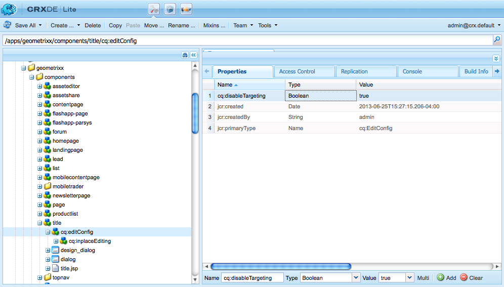
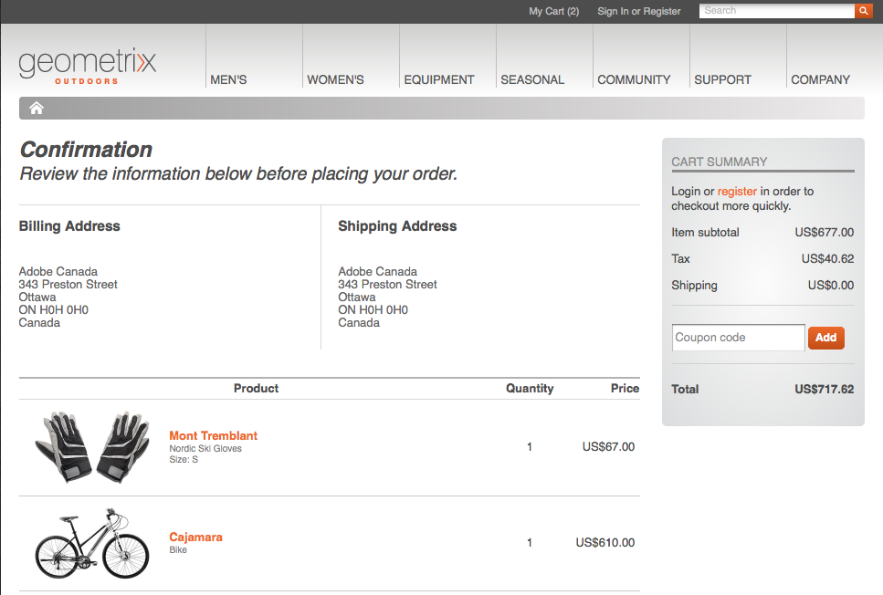

# Ontwikkelen voor gerichte inhoud{#developing-for-targeted-content}

Deze sectie beschrijft onderwerpen over het ontwikkelen van componenten voor gebruik met inhoud het richten.

* Zie [Integratie met Adobe Target](/help/sites-administering/target.md)voor meer informatie over verbinding maken met Adobe Target.
* Zie Gerichte inhoud [ontwerpen met doelmodus](/help/sites-authoring/content-targeting-touch.md)voor informatie over het ontwerpen van doelinhoud.

>[!NOTE]
>
>Wanneer u een component in auteur AEM richt, maakt de component een reeks server-zijvraag aan Adobe Target om de campagne te registreren, opstellingsaanbiedingen, en de segmenten van Adobe Target terug te winnen (indien gevormd). Er worden geen serveraanroepen vanuit AEM uitgevoerd die naar Adobe Target publiceren.

## Gericht op Adobe Target op uw pagina&#39;s inschakelen {#enabling-targeting-with-adobe-target-on-your-pages}

Als u doelcomponenten wilt gebruiken op uw pagina&#39;s die met Adobe Target werken, neemt u specifieke code aan de clientzijde op in het element &lt;head>.

### De kopsectie {#the-head-section}

Voeg beide volgende codeblokken toe aan de sectie &lt;head> van de pagina:

```xml
<!--/* Include Context Hub */-->
<sly data-sly-resource="${'contexthub' @ resourceType='granite/contexthub/components/contexthub'}"/>
```

```xml
<cq:include script="/libs/cq/cloudserviceconfigs/components/servicelibs/servicelibs.jsp"/>
```

Met deze code voegt u de vereiste analytische JavaScript-objecten toe en worden de cloudservicebibliotheken geladen die aan de website zijn gekoppeld. Voor de Target-service worden de bibliotheken geladen via `/libs/cq/analytics/components/testandtarget/headlibs.jsp`

De set bibliotheken die wordt geladen, is afhankelijk van het type doelclientbibliotheek (mbox.js of at.js) dat wordt gebruikt in de Target-configuratie:

**Voor standaard mbox.js**

```
<script type="text/javascript" src="/libs/cq/foundation/testandtarget/parameters.js"></script>
 <script type="text/javascript" src="/libs/cq/foundation/testandtarget/mbox.js"></script>
 <script type="text/javascript" src="/libs/cq/foundation/personalization/integrations/commons.js"></script>
 <script type="text/javascript" src="/libs/cq/foundation/testandtarget/util.js"></script>
 <script type="text/javascript" src="/libs/cq/foundation/testandtarget/init.js"></script>
```

**Voor aangepaste mbox.js**

```
<script type="text/javascript" src="/etc/cloudservices/testandtarget/<CLIENT-CODE>/_jcr_content/public/mbox.js"></script>
        <script type="text/javascript" src="/libs/cq/foundation/testandtarget/parameters.js"></script>
 <script type="text/javascript" src="/libs/cq/foundation/personalization/integrations/commons.js"></script>
 <script type="text/javascript" src="/libs/cq/foundation/testandtarget/util.js"></script>
 <script type="text/javascript" src="/libs/cq/foundation/testandtarget/init.js"></script>
```

**Voor om.js**

```
<script type="text/javascript" src="/libs/cq/foundation/testandtarget/parameters.js"></script>
 <script type="text/javascript" src="/libs/cq/foundation/testandtarget/atjs-integration.js"></script>
 <script type="text/javascript" src="/libs/cq/foundation/testandtarget/atjs.js"></script>
```

>[!NOTE]
>
>Alleen de versie van `at.js` die bij het product wordt geleverd, wordt ondersteund. De versie van `at.js` het product dat bij het product wordt geleverd, kunt u verkrijgen door het `at.js` bestand op de volgende locatie te raadplegen:
>
>**/libs/cq/testandtarget/clientlibs/testandtarget/atjs/source/at.js**.

**Voor aangepaste at.js**

```
<script type="text/javascript" src="/etc/cloudservices/testandtarget/<CLIENT-CODE>/_jcr_content/public/at.js"></script>
    <script type="text/javascript" src="/libs/cq/foundation/testandtarget/parameters.js"></script>
 <script type="text/javascript" src="/libs/cq/foundation/testandtarget/atjs-integration.js"></script>
```

De Target-functionaliteit aan de clientzijde wordt beheerd door het `CQ_Analytics.TestTarget` object. Daarom zal de pagina wat init code zoals in het volgende voorbeeld bevatten:

```
<script type="text/javascript">
            if ( !window.CQ_Analytics ) {
                window.CQ_Analytics = {};
            }
            if ( !CQ_Analytics.TestTarget ) {
                CQ_Analytics.TestTarget = {};
            }
            CQ_Analytics.TestTarget.clientCode = 'my_client_code';
        </script>
      ...

    <div class="cloudservice testandtarget">
  <script type="text/javascript">
  CQ_Analytics.TestTarget.maxProfileParams = 11;

  if (CQ_Analytics.CCM) {
   if (CQ_Analytics.CCM.areStoresInitialized) {
    CQ_Analytics.TestTarget.registerMboxUpdateCalls();
   } else {
    CQ_Analytics.CCM.addListener("storesinitialize", function (e) {
     CQ_Analytics.TestTarget.registerMboxUpdateCalls();
    });
   }
  } else {
   // client context not there, still register calls
   CQ_Analytics.TestTarget.registerMboxUpdateCalls();
  }
  </script>
 </div>
```

JSP voegt de vereiste analytische voorwerpen javascript en verwijzingen naar cliënt-kant JavaScript bibliotheken toe. Het bestand testandtarget.js bevat de functies mbox.js. De HTML die het script genereert, is vergelijkbaar met het volgende voorbeeld:

```xml
<script type="text/javascript">
        if ( !window.CQ_Analytics ) {
            window.CQ_Analytics = {};
        }
        if ( !CQ_Analytics.TestTarget ) {
            CQ_Analytics.TestTarget = {};
        }
        CQ_Analytics.TestTarget.clientCode = 'MyClientCode';
</script>
<link rel="stylesheet" href="/etc/clientlibs/foundation/testandtarget/testandtarget.css" type="text/css">
<script type="text/javascript" src="/etc/clientlibs/foundation/testandtarget/testandtarget.js"></script>
<script type="text/javascript" src="/etc/clientlibs/foundation/testandtarget/init.js"></script>
```

#### De hoofdsectie (start) {#the-body-section-start}

Voeg onmiddellijk na de tag &lt;body> de volgende code toe om de kenmerken van de clientcontext aan de pagina toe te voegen:

```xml
<cq:include path="clientcontext" resourceType="cq/personalization/components/clientcontext"/>
```

#### De hoofdsectie (einde) {#the-body-section-end}

Voeg de volgende code toe vlak voor de eindtag &lt;/body>:

```xml
<cq:include path="cloudservices" resourceType="cq/cloudserviceconfigs/components/servicecomponents"/>
```

Het JSP-script van deze component genereert aanroepen naar de Target javascript API en implementeert andere vereiste configuraties. De HTML die het script genereert, is vergelijkbaar met het volgende voorbeeld:

```xml
<div class="servicecomponents cloudservices">
  <div class="cloudservice testandtarget">
    <script type="text/javascript">
      CQ_Analytics.TestTarget.maxProfileParams = 11;
      CQ_Analytics.CCM.addListener("storesinitialize", function(e) {
        CQ_Analytics.TestTarget.registerMboxUpdateCalls();
      });
    </script>
    <div id="cq-analytics-texthint" style="background:white; padding:0 10px; display:none;">
      <h3 class="cq-texthint-placeholder">Component clientcontext is missing or misplaced.</h3>
    </div>
    <script type="text/javascript">
      $CQ(function(){
      if( CQ_Analytics &&
          CQ_Analytics.ClientContextMgr &&
          !CQ_Analytics.ClientContextMgr.isConfigLoaded )
        {
          $CQ("#cq-analytics-texthint").show();
        }
      });
    </script>
  </div>
</div>
```

### Een aangepast Target-bibliotheekbestand gebruiken {#using-a-custom-target-library-file}

>[!NOTE]
>
>Als u geen DTM of een ander doelmarketingsysteem gebruikt, kunt u aangepaste doelbibliotheekbestanden gebruiken.

>[!NOTE]
>
>De vakken zijn standaard verborgen. De klasse mboxDefault bepaalt dit gedrag. Verborgen vakken zorgen ervoor dat bezoekers de standaardinhoud niet zien voordat deze wordt omgewisseld. het verbergen van vakken heeft echter invloed op waargenomen prestaties .

Het standaard mbox.js- dossier dat wordt gebruikt om dozen tot stand te brengen wordt gevestigd in /etc/clientlibs/foundation/testandtarget/mbox/source/mbox.js. Als u een bestand mbox.js van de klant wilt gebruiken, voegt u het bestand toe aan de Target-cloudconfiguratie. Als u het bestand wilt toevoegen, moet het bestand mbox.js beschikbaar zijn op het bestandssysteem.

Bijvoorbeeld, als u de dienst [van identiteitskaart van de](https://docs.adobe.com/content/help/en/id-service/using/home.html) Marketing Cloud wilt gebruiken moet u mbox.js downloaden zodat het de correcte waarde voor de `imsOrgID` variabele bevat, die op uw huurder gebaseerd is. Deze variabele is vereist voor integratie met de service Marketing Cloud ID. Zie [Adobe Analytics voor meer informatie als de rapportbron voor Adobe Target](https://docs.adobe.com/content/help/en/target/using/integrate/a4t/a4t.html) en [Voordat u gaat implementeren](https://docs.adobe.com/content/help/en/target/using/integrate/a4t/before-implement.html).

>[!NOTE]
>
>Als een aangepaste mbox is gedefinieerd in een Target-configuratie, moet iedereen leestoegang hebben tot **/etc/cloudservices** op publicatieservers. Zonder deze toegang leidt het laden van mbox.js-bestanden op de publicatiewebsite tot een fout van 404.

1. Ga naar de pagina CQ- **gereedschappen** en selecteer **Cloud Servicen**. ([https://localhost:4502/libs/cq/core/content/tools/cloudservices.html](https://localhost:4502/libs/cq/core/content/tools/cloudservices.html))
1. Selecteer Adobe Target in de boomstructuur en dubbelklik in de lijst met configuraties op de Target-configuratie.
1. Klik op Bewerken op de configuratiepagina.
1. Voor het bezit van Custom mbox.js, doorbladert de klik en selecteert het dossier.
1. Als u de wijzigingen wilt toepassen, voert u het wachtwoord voor uw Adobe Target-account in, klikt u op Opnieuw verbinden met Target en klikt u op OK als de verbinding is gelukt. Klik vervolgens op OK in het dialoogvenster Component bewerken.

Uw Target-configuratie bevat een aangepast bestand mbox.js. De vereiste code in [de kopsectie](/help/sites-developing/target.md#p-the-head-section-p) van uw pagina voegt het bestand toe aan het clientbibliotheekframework in plaats van een verwijzing naar de testandtarget.js-bibliotheek.

## De Target-opdracht voor componenten uitschakelen {#disabling-the-target-command-for-components}

De meeste componenten kunnen in gerichte componenten worden omgezet gebruikend het bevel van Target op het contextmenu.


Als u de Target-opdracht uit het contextmenu wilt verwijderen, voegt u de volgende eigenschap toe aan het knooppunt cq:editConfig van de component:

* Naam: cq:disableTargeting
* Type: Boolean
* Waarde: Waar

Als u bijvoorbeeld het aanwijzen van doelen voor de titelcomponenten van de pagina&#39;s van de Geometrixx Demo-site wilt uitschakelen, voegt u de eigenschap toe aan het knooppunt /apps/geometrixx/components/title/cq:editConfig.



## Bevestigingsgegevens voor bestelling naar Adobe Target verzenden {#sending-order-confirmation-information-to-adobe-target}

>[!NOTE]
>
>Als u DTM niet gebruikt, stuurt u een bevestiging van de bestelling naar Adobe Target.

Als u de prestaties van uw website wilt volgen, stuurt u aankoopgegevens van de bevestigingspagina van uw bestelling naar Adobe Target. (Zie [Een OrderConfirmPage Mbox](https://docs.adobe.com/content/help/en/dtm/implementing/target/configure-target/mboxes/order-confirmation-mbox.html) maken in de documentatie van Adobe Target.) Adobe Target herkent mbox-gegevens als orderbevestigingsgegevens wanneer uw MBox-naam is `orderConfirmPage` en gebruikt de volgende specifieke parameternamen:

* productPurchasedId: Een lijst met id&#39;s die de aangeschafte producten identificeren.
* orderId: De id van de bestelling.
* orderTotal: Het totale bedrag van de aankoop.

De code op de weergegeven HTML-pagina die de mbox maakt, is vergelijkbaar met het volgende voorbeeld:

```xml
<script type="text/javascript">
     mboxCreate('orderConfirmPage',
     'productPurchasedId=product1 product2 product3',
     'orderId=order1234',
     'orderTotal=24.54');
</script>
```

De waarden van elke parameter zijn verschillend voor elke orde. Daarom hebt u een component nodig die de code genereert op basis van de eigenschappen van de aankoop. Met het CQ [eCommerce Integration Framework](/help/sites-administering/ecommerce.md) kunt u integreren met uw productcatalogus en een winkelwagentje en afhandelingspagina implementeren.

Het Geometrixx-monster Buiten geeft de volgende bevestigingspagina weer wanneer een bezoeker producten koopt:



De volgende code voor het JSP manuscript van een component heeft toegang tot de eigenschappen van het het winkelwagentje en drukt dan de code voor het creëren van mbox.

```java
<%--

  confirmationmbox component.

--%><%
%><%@include file="/libs/foundation/global.jsp"%><%
%><%@page session="false"
          import="com.adobe.cq.commerce.api.CommerceService,
                  com.adobe.cq.commerce.api.CommerceSession,
                  com.adobe.cq.commerce.common.PriceFilter,
                  com.adobe.cq.commerce.api.Product,
                  java.util.List, java.util.Iterator"%><%

/* obtain the CommerceSession object */
CommerceService commerceservice = resource.adaptTo(CommerceService.class);
CommerceSession session = commerceservice.login(slingRequest, slingResponse);

/* obtain the cart items */
List<CommerceSession.CartEntry> entries = session.getCartEntries();
Iterator<CommerceSession.CartEntry> cartiterator = entries.iterator();

/* iterate the items and get the product IDs */
String productIDs = new String();
while(cartiterator.hasNext()){
 CommerceSession.CartEntry entry = cartiterator.next();
 productIDs = productIDs + entry.getProduct().getSKU();
    if (cartiterator.hasNext()) productIDs = productIDs + ", ";
}

/* get the cart price and orderID */
String total = session.getCartPrice(new PriceFilter("CART", "PRE_TAX"));
String orderID = session.getOrderId();

%><div class="mboxDefault"></div>
<script type="text/javascript">
     mboxCreate('orderConfirmPage',
     'productPurchasedId=<%= productIDs %>',
     'orderId=<%= orderID %>',
     'orderTotal=<%= total %>');
</script>
```

Wanneer de component is opgenomen in de uitcheckpagina in het vorige voorbeeld, bevat de paginabron het volgende script waarmee het selectievakje wordt gemaakt:

```
<div class="mboxDefault"></div>
<script type="text/javascript">

     mboxCreate('orderConfirmPage',
     'productPurchasedId=47638-S, 46587',
     'orderId=d03cb015-c30f-4bae-ab12-1d62b4d105ca',
     'orderTotal=US$677.00');

</script>
```

## De Target-component begrijpen {#understanding-the-target-component}

Met de Target-component kunnen auteurs dynamische vakken maken op basis van CQ-inhoudscomponenten. (Zie [Inhoud voorbereiden](/help/sites-authoring/content-targeting-touch.md).) De Target-component bevindt zich op /libs/cq/personalization/components/target.

Het target.jsp manuscript toegang tot de paginaeigenschappen om de het richten motor te bepalen voor de component te gebruiken, en voert dan het aangewezen manuscript uit:

* Adobe Target: /libs/cq/personalization/components/target/engine_tnt.jsp
* [Adobe Target met AT.JS](/help/sites-administering/target.md): /libs/cq/personalization/components/target/engine_atjs.jsp
* [Adobe Campaign](/help/sites-authoring/target-adobe-campaign.md): /libs/cq/personalization/components/target/engine_cq_campaign.jsp
* Client-side regels/ContextHub: /libs/cq/personalization/components/target/engine_cq.jsp

### Maken van dozen {#the-creation-of-mboxes}

>[!NOTE]
>
>De vakken zijn standaard verborgen. De klasse mboxDefault bepaalt dit gedrag. Verborgen vakken zorgen ervoor dat bezoekers de standaardinhoud niet zien voordat deze wordt omgewisseld. het verbergen van vakken heeft echter invloed op waargenomen prestaties .

Als Adobe Target de doelinhoud aanstuurt, maakt het script engine_tnt.jsp vakken die de inhoud van de beoogde ervaring bevatten:

* Voegt een `div` element toe met de klasse van `mboxDefault`, zoals vereist door de Adobe Target API.

* Hiermee voegt u de inhoud van de box (de inhoud van de beoogde ervaring) toe aan het `div` element.

Na het `mboxDefault` div-element wordt de javascript waarmee de mbox wordt gemaakt, ingevoegd:

* De naam, de id en de locatie van de box zijn gebaseerd op het opslagpad van de component.
* Het manuscript verkrijgt de parameternamen en waarden van de Context van de Cliënt.
* De aanroepen worden gemaakt aan de functies die mbox.js en andere cliëntbibliotheken bepalen om dozen tot stand te brengen.

#### Clientbibliotheken voor doelinhoud {#client-libraries-for-content-targeting}

Hier volgen de beschikbare clientlib-categorieën:

* testandtarget.mbox
* testandtarget.init
* testandtarget.util
* testandtarget.atjs
* testandtarget.atjs-integration
