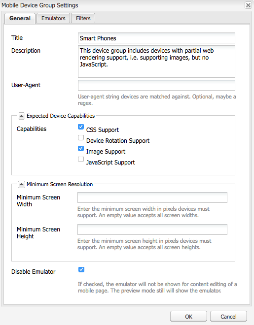

# Adaptieve sjabloonrendering{#adaptive-template-rendering}

De adaptieve sjabloonrendering biedt een manier om een pagina met variaties te beheren. Oorspronkelijk nuttig om diverse HTML output voor mobiele apparaten (bijvoorbeeld, eigenschaptelefoon tegen slimme telefoon) te leveren, is deze eigenschap nuttig wanneer de ervaringen aan diverse apparaten moeten worden geleverd die verschillende prijsverhoging of HTML output vereisen.

## Overzicht {#overview}

De malplaatjes worden gebouwd rond een ontvankelijk net, en de pagina&#39;s die op deze malplaatjes worden gecreeerd volledig ontvankelijk zijn, die automatisch aan viewport van het cliëntapparaat aanpassen. Met behulp van de werkbalk Emulator in de pagina-editor kunnen auteurs lay-outs richten op specifieke apparaten.

Het is ook mogelijk om sjablonen in te stellen ter ondersteuning van adaptieve rendering. Wanneer apparaatgroepen correct zijn geconfigureerd, wordt de pagina weergegeven met een andere kiezer in de URL wanneer een apparaat wordt geselecteerd in de emulatormodus. Met behulp van een kiezer kan een specifieke pagina-rendering rechtstreeks via de URL worden opgeroepen.

Onthoud dat u apparaatgroepen instelt:

* Elk apparaat moet in minstens één apparatengroep zijn.
* Een apparaat kan zich in meerdere apparaatgroepen bevinden.
* Omdat apparaten zich in meerdere apparaatgroepen kunnen bevinden, kunnen kiezers worden gecombineerd.
* De combinatie van kiezers wordt van boven naar beneden geëvalueerd, aangezien ze in de opslagplaats blijven bestaan.

>[!NOTE]
>
>De apparaatgroep **Responsieve apparaten hebben nooit een kiezer omdat apparaten die worden herkend als ondersteunend responsief ontwerp, verondersteld worden geen adaptieve lay-out te hoeven hebben

## Configuratie {#configuration}

Aangepaste renderingkiezers kunnen worden geconfigureerd voor bestaande apparaatgroepen of voor [groepen die u zelf hebt gemaakt.](/help/sites-developing/mobile.md#device-groups)

In dit voorbeeld gaat u de bestaande apparaatgroep configureren **Slimme telefoons** om een aangepaste renderingkiezer als onderdeel van de **Experience Page** template in We.Retail.

1. Bewerk de apparaatgroep waarvoor een adaptieve kiezer nodig is in `http://localhost:4502/miscadmin#/etc/mobile/groups`

   De optie instellen **Emulator uitschakelen** en opslaan.

   

1. De kiezer is beschikbaar voor de **BlackBerry®** en **IPHONE 4** voorzien de apparatengroep **Slimme telefoon** wordt in de volgende stappen toegevoegd aan de sjabloon- en paginastructuren.

   

1. Met behulp van CRXDE Lite kunt u de apparaatgroep gebruiken op uw sjabloon door deze toe te voegen aan de eigenschap tekenreeks met meerdere waarden `cq:deviceGroups` over de structuur van de sjabloon.

   `/conf/<your-site>/settings/wcm/templates/<your-template>/structure/jcr:content`

   Als u bijvoorbeeld de apparaatgroep Slimme telefoon wilt toevoegen:

   `/conf/we-retail/settings/wcm/templates/experience-page/structure/jcr:content`

   

1. Met CRXDE Lite kunt u de apparaatgroep op uw site gebruiken door deze toe te voegen aan de eigenschap voor een tekenreeks met meerdere waarden `cq:deviceGroups` op de structuur van uw site.

   `/content/<your-site>/jcr:content`

   Als u bijvoorbeeld de opdracht **Slimme telefoon** apparaatgroep:

   `/content/we-retail/jcr:content`

   

Nu wanneer u de opdracht [emulator](/help/sites-authoring/responsive-layout.md#layout-definitions-device-emulation-and-breakpoints) in de pagina-editor (bijvoorbeeld wanneer [de lay-out wijzigen](/help/sites-authoring/responsive-layout.md)) en u kiest een apparaat van de geconfigureerde apparaatgroep, wordt de pagina weergegeven met een kiezer als onderdeel van de URL.

In dit voorbeeld wordt bij het bewerken van een pagina gebaseerd op de **Experience Page** sjabloon, en iPhone 4 kiezen in de emulator, wordt de pagina weergegeven inclusief de kiezer als `arctic-surfing-in-lofoten.smart.html` in plaats van `arctic-surfing-in-lofoten.html`

De pagina kan ook rechtstreeks worden aangeroepen met deze kiezer.

