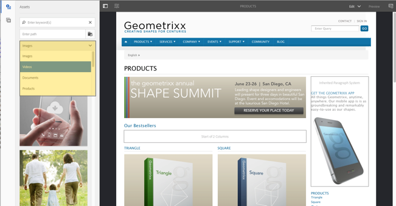

# Structuur van de gebruikersinterface voor Adobe Experience Manager Touch{#structure-of-the-aem-touch-enabled-ui}

De UI met aanraakbediening voor Adobe Experience Manager (AEM) heeft verschillende onderliggende principes en bestaat uit verschillende belangrijke elementen:

## Consoles {#consoles}

### Basislay-out en -formaat {#basic-layout-and-resizing}

De UI-caters voor zowel mobiele als desktopapparaten, maar in plaats van twee stijlen te maken, heeft de Adobe besloten één stijl te gebruiken die voor alle schermen en apparaten werkt.

Alle modules gebruiken de zelfde basislay-out, in AEM dit kan worden gezien als:

De lay-out voldoet aan een responsieve ontwerpstijl en past zich aan de grootte van het apparaat/venster aan dat u gebruikt.

Als de resolutie bijvoorbeeld lager is dan 1024 px (zoals op een mobiel apparaat), wordt het beeldscherm dienovereenkomstig aangepast:

### Koptekstbalk {#header-bar}

De kopbalbar toont globale elementen met inbegrip van:

* het logo en het specifieke product/de specifieke oplossing die u momenteel gebruikt; voor AEM vormt dit ook een koppeling naar de globale navigatie
* Zoeken
* pictogram voor het openen van de Help-bronnen
* pictogram voor toegang tot andere oplossingen
* een indicator van (en toegang tot) om het even welke alarm of Inbox punten die op u wachten
* het gebruikerspictogram, samen met een koppeling naar uw profielbeheer

### Werkbalk {#toolbar}

Dit is contextueel voor uw locatie en de gereedschappen voor oppervlakken die relevant zijn voor het beheren van de weergave of elementen op de onderstaande pagina. De werkbalk is productspecifiek, maar de elementen hebben een zekere gemeen.

Op de werkbalk ziet u de acties die momenteel beschikbaar zijn.

Ook afhankelijk van of een bron is geselecteerd:

### Linkerspoor {#left-rail}

De linkerspoorstaaf kan worden geopend/verborgen zoals vereist om te tonen:

* **Chronologie**
* **Verwijzingen**
* **Filter**

Het gebrek is **slechts Inhoud** (spoorstaaf verborgen).

## Pagina&#39;s ontwerpen {#page-authoring}

Bij het ontwerpen van pagina&#39;s ziet u de volgende structurele gebieden.

### Inhoudskader {#content-frame}

De pagina-inhoud wordt weergegeven in het inhoudskader. Het inhoudskader is onafhankelijk van de editor om ervoor te zorgen dat er geen conflicten zijn die te wijten zijn aan CSS of JavaScript.

Het inhoudskader bevindt zich in de rechtersectie van het venster, onder de werkbalk.

### Editor frame {#editor-frame}

In het bewerkingsframe worden de bewerkingsfuncties gerealiseerd.

Het redacteurskader is een container (abstract) voor alle *pagina auteurselementen*. Het leeft bovenop het inhoudskader, en omvat:

* de bovenste werkbalk
* zijpaneel
* alle overlays
* een ander pagina-ontwerpelement, bijvoorbeeld de componentwerkbalk

### Zijpaneel {#side-panel}

Dit bevat twee standaardtabbladen waarmee u elementen en componenten kunt selecteren. U kunt ze hier naartoe slepen en op de pagina neerzetten.

Het zijpaneel is standaard verborgen. Als deze optie is geselecteerd, wordt deze links weergegeven of schuift deze over om het hele venster te bedekken (als het vensterformaat kleiner is dan een breedte van 1024 px, bijvoorbeeld op een mobiel apparaat).

### Zijpaneel - Assets {#side-panel-assets}

Op het tabblad Assets kunt u een selectie maken uit het assortiment elementen. U kunt ook filteren op een bepaalde term of een groep selecteren.

### Zijpaneel - Elementgroepen {#side-panel-asset-groups}

Op het tabblad Middelen vindt u een vervolgkeuzelijst waarmee u de specifieke groepen elementen kunt selecteren.

### Zijpaneel - Componenten {#side-panel-components}

Op het tabblad Componenten kunt u een keuze maken uit het bereik van componenten. U kunt ook filteren op een bepaalde term of een groep selecteren.

### Bedekkingen {#overlays}

Deze bedekking het inhoudskader en door de [ lagen ](#layer) gebruikt om de mechanica van te realiseren hoe u (doorzichtig) met de componenten en hun inhoud kunt in wisselwerking staan.

De overlays bevinden zich in het editorframe (met alle andere pagina-ontwerpelementen), hoewel ze de juiste componenten in het inhoudsframe bedekken.

### Laag {#layer}

Een laag is een onafhankelijke bundel van functionaliteit die kan worden geactiveerd aan:

* Een andere weergave van de pagina opgeven
* waarmee u een pagina kunt bewerken en/of bewerken

De lagen bieden geavanceerde functionaliteit voor de gehele pagina, in tegenstelling tot specifieke handelingen voor een afzonderlijke component.

AEM wordt geleverd met verschillende lagen die al zijn geïmplementeerd voor het ontwerpen van pagina&#39;s, zoals bewerken, voorvertonen en notities aanbrengen.

>[!NOTE]
>
>Lagen zijn een krachtig concept dat invloed heeft op de weergave van en interactie met de pagina-inhoud. Wanneer u uw eigen lagen ontwikkelt, moet u ervoor zorgen dat de laag wordt opgeschoond wanneer deze wordt afgesloten.

### Laagschakelaar {#layer-switcher}

Met de laagschakeloptie kunt u de laag kiezen die u wilt gebruiken. Als u deze optie sluit, wordt de laag weergegeven die momenteel wordt gebruikt.

De laagschakelaar is beschikbaar als drop-down van de toolbar (bij de bovenkant van het venster, binnen het redacteurskader).

### Werkbalk Component {#component-toolbar}

Elke instantie van een component toont zijn toolbar wanneer geklikt (of eens of met een langzaam tweemaal klikken). De werkbalk bevat de specifieke handelingen (bijvoorbeeld kopiëren, plakken, open editor) die beschikbaar zijn voor de componentinstantie (Bewerkbaar) op de pagina.

Afhankelijk van de beschikbare ruimte, worden de componententoolbars geplaatst bij de bovenkant, of bodem, juiste hoek van de aangewezen component.

## Aanvullende informatie {#further-information}

Voor meer details over de concepten rond aanraking-toegelaten UI, lees [ Concepten van AEM aanraking-Toegelaten UI ](/help/sites-developing/touch-ui-concepts.md).

Voor meer technische informatie, zie [ JS documentatiereeks ](https://helpx.adobe.com/experience-manager/6-5/sites/developing/using/reference-materials/jsdoc/ui-touch/editor-core/index.html) voor de aanraking-toegelaten paginaredacteur.
