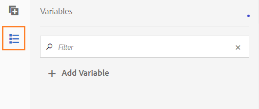

# Variabelen in AEM-workflows{#variables-in-aem-workflows}

Een variabele in een workflowmodel is een manier om een waarde op te slaan op basis van het gegevenstype. U kunt dan de naam van de variabele in om het even welke werkschemastap gebruiken om de waarde terug te winnen die in de variabele wordt opgeslagen. U kunt veranderlijke namen ook gebruiken om uitdrukkingen te bepalen voor het nemen van verpletterende besluiten.

In AEM-workflowmodellen kunt u:

* [Maak een variabele](/help/sites-developing/using-variables-in-aem-workflows.md#create-a-variable) van een gegevenstype op basis van het gegevenstype dat u in de variabele wilt opslaan.
* [Stel een waarde voor de variabele](/help/sites-developing/using-variables-in-aem-workflows.md#set-a-variable) in met de workflowstap Variabele instellen.
* [Gebruik de variabele](/help/sites-developing/using-variables-in-aem-workflows.md#use-a-variable) in OF Splitst en gaat naar AEM werkschemastappen om een uitdrukking te bepalen voor het nemen van verpletterende besluiten. U kunt ook variabelen gebruiken in alle workflowstappen van AEM Forms.

In de volgende video ziet u hoe u variabelen kunt maken, instellen en gebruiken in AEM-workflowmodellen:

>[!VIDEO](https://helpx.adobe.com/content/dam/help/en/experience-manager/6-5/forms/using/usevariables_example.mp4)

Variabelen zijn een uitbreiding van de [interface MetaDataMap](https://helpx.adobe.com/experience-manager/6-5/sites/developing/using/reference-materials/javadoc/com/adobe/granite/workflow/metadata/MetaDataMap.html) . Met [MetaDataMap](https://helpx.adobe.com/experience-manager/6-5/sites/developing/using/reference-materials/javadoc/com/adobe/granite/workflow/metadata/MetaDataMap.html) in ECMAScript hebt u toegang tot metagegevens die zijn opgeslagen met variabelen.

## Een variabele maken {#create-a-variable}

U maakt variabelen aan de hand van de sectie Variabelen die beschikbaar is in de assistent van het workflowmodel. AEM-workflowvariabelen ondersteunen de volgende gegevenstypen:

* **Primitieve gegevenstypen**: Long, Double, Boolean, Date en String
* **Complexe gegevenstypen**: [XML](https://docs.oracle.com/javase/8/docs/api/org/w3c/dom/Document.html) en [JSON](https://static.javadoc.io/com.google.code.gson/gson/2.3/com/google/gson/JsonObject.html)

>[!NOTE]
>
>Workflows ondersteunen alleen de ISO8601-indeling voor variabelen van het type Date.

Zie [Variabelen in AEM Forms-workflows](/help/forms/using/variable-in-aem-workflows.md)voor aanvullende complexe gegevenstypen die beschikbaar zijn in AEM Forms-workflows.  Het gegevenstype ArrayList van het gebruik om veranderlijke inzamelingen tot stand te brengen. U kunt een variabele ArrayList maken voor alle primitieve en complexe gegevenstypen. Maak bijvoorbeeld een variabele ArrayList en selecteer String als subtype om meerdere tekenreekswaarden op te slaan met de variabele.

Voer de volgende stappen uit om een variabele te maken:

1. Navigeer in een AEM-instantie naar Gereedschappen > Workflow > Modellen.
1. Tik op **[!UICONTROL Maken]** en geef de titel en een optionele naam voor het workflowmodel op. Selecteer het model en tik op **[!UICONTROL Bewerken]**.
1. Tik op het Variabelepictogram dat beschikbaar is in de assistent van het workflowmodel en tik op Variabele **** toevoegen.

   

1. Geef in het dialoogvenster Variabele toevoegen de naam op en selecteer het type variabele.
1. Selecteer het gegevenstype in de vervolgkeuzelijst **[!UICONTROL Type]** en geef de volgende waarden op:

   * Primitieve gegevenstype - Geef een optionele standaardwaarde voor de variabele op.
   * JSON of XML - Geef een optioneel JSON- of XML-schemapad op. Het systeem valideert het schemapad terwijl het in kaart brengen van en het opslaan van eigenschappen beschikbaar in dit schema aan een andere variabele.
   * Formuliergegevensmodel - Geef een formuliergegevensmodelpad op.
   * ArrayList - Geef een subtype op voor de verzameling.

1. Geef een optionele beschrijving voor de variabele op en tik  om de wijzigingen op te slaan. De variabele wordt weergegeven in de lijst die beschikbaar is in het linkerdeelvenster.

Houd rekening met de volgende werkwijzen wanneer u variabelen maakt:

* Maak zoveel variabelen als een workflow nodig heeft. Om databasemiddelen te besparen, moet u echter het minimale aantal vereiste variabelen gebruiken en moet u variabelen waar mogelijk opnieuw gebruiken.
* Variabelen zijn hoofdlettergevoelig. Zorg ervoor dat u in uw werkstroom naar variabelen verwijst met hetzelfde hoofdlettergebruik.
* Gebruik geen speciale tekens in de naam van een variabele

## Een variabele instellen {#set-a-variable}

Met de stap Variabele instellen kunt u de waarde van een variabele instellen en de volgorde definiëren waarin de waarden worden ingesteld. De variabele wordt ingesteld in de volgorde waarin de variabele-toewijzingen worden vermeld in de stap met de variabele-set.

Wijzigingen in waarden van variabelen zijn alleen van invloed op de instantie van het proces waarin de wijziging plaatsvindt. Wanneer bijvoorbeeld een workflow wordt gestart en variabele gegevens worden gewijzigd, hebben de wijzigingen alleen invloed op dat exemplaar van de workflow. De wijzigingen zijn niet van invloed op andere versies van de workflow die eerder zijn gestart of daarna worden gestart.

Afhankelijk van het gegevenstype van de variabele kunt u de volgende opties gebruiken om de waarde van een variabele in te stellen:

* **Letterlijk:** Gebruik deze optie als u precies weet welke waarde u moet opgeven.
* **Uitdrukking:** Gebruik de optie wanneer de te gebruiken waarde wordt berekend op basis van een expressie. De expressie wordt gemaakt in de beschikbare expressie-editor.
* **JSON-puntnotatie:** Gebruik de optie om een waarde van een JSON of FDM typevariabele terug te winnen.
* **XPATH:** Gebruik de optie om een waarde van een variabele van het type van XML terug te winnen.
* **Ten opzichte van lading:** Gebruik de optie wanneer de waarde die u wilt opslaan in een variabele, beschikbaar is op een pad dat relatief is ten opzichte van de laadbewerking.
* **Absoluut pad:** Gebruik de optie wanneer de waarde die u wilt opslaan in de variabele beschikbaar is in een absoluut pad.

U kunt ook specifieke elementen van een variabele van het type JSON of XML bijwerken met JSON-puntnotatie of XPATH-notatie.

### Toewijzing tussen variabelen toevoegen {#add-mapping-between-variables}

Voer de volgende stappen uit om toewijzingen tussen variabelen toe te voegen:

1. Tik op de pagina voor workflowbewerking op het pictogram Stappen dat beschikbaar is in de assistent van het workflowmodel.
1. Sleep de stap Variabele **** instellen naar de werkstroomeditor en zet deze neer. Tik vervolgens op de stap en selecteer  (Configureren).
1. Selecteer **[!UICONTROL Toewijzing]** > Toewijzing **[!UICONTROL toevoegen in het dialoogvenster Variabele instellen]**.
1. Selecteer in de sectie **Variabele** toewijzen de variabele voor het opslaan van gegevens, selecteer de toewijzingsmodus en geef een waarde op die u in de variabele wilt opslaan. De toewijzingsmodi variëren op basis van het type variabele.
1. Wijs meer variabelen toe om een betekenisvolle expressie te maken. Tap  to save the changes.

### Voorbeeld 1: Vraag een variabele van XML om waarde voor een koordvariabele te plaatsen {#example-query-an-xml-variable-to-set-value-for-a-string-variable}

Selecteer een variabele van het type van XML om een dossier van XML op te slaan. Vraag de variabele van XML om de waarde voor een koordvariabele voor het bezit te plaatsen beschikbaar in het dossier van XML. Gebruik XPATH **opgeven voor het veld XML-variabele** om de eigenschap te definiëren die in de tekenreeksvariabele moet worden opgeslagen.

In dit voorbeeld selecteert u een **XML-formuliergegevens** om het bestand **cc-app.xml** op te slaan. Vraag de **formdata** variabele om de waarde voor de **e-mailadres** koordvariabele te plaatsen om de waarde voor het **emailAddress** bezit op te slaan beschikbaar in het **cc-app.xml** dossier.

>[!VIDEO](https://helpx.adobe.com/content/dam/help/en/experience-manager/6-5/forms/using/set_variable_example1.mp4 "Waarde van een variabele instellen")

### Voorbeeld 2: Een expressie gebruiken om waarde op te slaan op basis van andere variabelen {#example2}

Gebruik een expressie om de som van de variabelen te berekenen en sla het resultaat op in een variabele.

In dit voorbeeld gebruikt u de expressie-editor om een expressie te definiëren die de som van de **elementkosten** en **balansvariabelen** moet berekenen en het resultaat moet opslaan in een **totalvalue** -variabele.

>[!VIDEO](https://helpx.adobe.com/content/dam/help/en/experience-manager/6-5/forms/using/variables_expression.mp4)

## Expressieeditor gebruiken {#use-expression-editor}

U gebruikt ook expressies om de waarde van een variabele in de runtime te berekenen. Variabelen bieden een expressie-editor om expressies te definiëren.

Met de expressie-editor kunt u:

* Stel de waarde van variabelen in met behulp van andere workflowvariabelen, getallen of wiskundige expressies.
* Werkstroomvariabelen, tekenreeksen, getallen of expressies gebruiken in een wiskundige expressie
* Voeg voorwaarden toe om waarden van variabelen in te stellen.
* Operatoren toevoegen tussen voorwaarden.


De editor is gebaseerd op de regel voor aangepaste formulieren. De volgende wijzigingen zijn aangebracht. Regeleditor in variabelen:

* Biedt geen ondersteuning voor functies.
* Biedt geen interface voor het weergeven van een overzicht van regels
* Heeft geen code-editor.
* Hiermee wordt het in- en uitschakelen van de waarde van een object niet ondersteund.
* Hiermee wordt het instellen van de eigenschap van een object niet ondersteund.
* Het aanroepen van een webservice wordt niet ondersteund.

Zie de regeleditor voor [aangepaste formulieren](/help/forms/using/rule-editor.md)voor meer informatie.

## Een variabele gebruiken {#use-a-variable}

U kunt variabelen gebruiken om input en output terug te winnen of het resultaat van een stap te bewaren. De werkstroomeditor bevat twee typen workflowstappen:

* Workflowstappen met ondersteuning voor variabelen
* Workflowstappen zonder ondersteuning voor variabelen

### Workflowstappen met ondersteuning voor variabelen {#workflow-steps-with-support-for-variables}

De stap Ga naar OF Splitsen en alle workflowstappen van AEM Forms ondersteunen variabelen.

#### OF stap Splitsen {#or-split-step}

Met de indeling OR wordt een splitsing in de workflow gemaakt, waarna slechts één vertakking actief is. Met deze stap kunt u voorwaardelijke verwerkingspaden in uw workflow introduceren. U voegt workflowstappen naar wens toe aan elke vertakking.

U kunt het verpletteren van uitdrukking voor een tak bepalen gebruikend een regeldefinitie, manuscript ECMA, of een extern manuscript.

U kunt variabelen gebruiken om de verpletterende uitdrukking te bepalen gebruikend de uitdrukkingsredacteur. Voor meer informatie bij het gebruiken van het verpletteren van uitdrukkingen voor OF de Gesplitste stap, zie [OF stap](/help/sites-developing/workflows-step-ref.md#or-split)Splitsen.

In dit voorbeeld, alvorens de verpletterende uitdrukking te bepalen, gebruik [voorbeeld 2](/help/sites-developing/using-variables-in-aem-workflows.md#example2) om de waarde voor de **totalvalue** variabele te plaatsen. Vertakking 1 is actief als de waarde van de **totalvalue** variabele groter is dan 50000. Op dezelfde manier kunt u een regel bepalen om Tak 2 actief te maken als de waarde van de **totalvalue** variabele minder dan 50000 is.

>[!VIDEO](https://helpx.adobe.com/content/dam/help/en/experience-manager/6-5/forms/using/variables_orsplit_example.mp4)

Op dezelfde manier selecteer een externe manuscriptweg of specificeer het manuscript ECMA voor het verpletteren van uitdrukkingen om de actieve tak te evalueren. Tik **[!UICONTROL Naam vertakking]** wijzigen om een alternatieve naam voor de vertakking op te geven.

Zie [Een workflowmodel](/help/forms/using/aem-forms-workflow.md#create-a-workflow-model)maken voor meer voorbeelden.

#### Ga naar stap {#go-to-step}

De **Goto Stap** staat u toe om de volgende stap in het uit te voeren werkschemamodel te specificeren, afhankelijk van het resultaat van een verpletterende uitdrukking.

Gelijkaardig aan OF de Gesplitste stap, kunt u het verpletteren van uitdrukking voor stap bepalen gebruikend een regeldefinitie, manuscript ECMA, of een extern manuscript.

U kunt variabelen gebruiken om de verpletterende uitdrukking te bepalen gebruikend de uitdrukkingsredacteur. Voor meer informatie bij het gebruiken van het verpletteren van uitdrukkingen voor de stap van het Goto, zie [Ga naar Stap](/help/sites-developing/workflows-step-ref.md#goto-step).


In dit voorbeeld geeft de stap Ga naar de toepassing Creditcard controleren op als de volgende stap als de waarde voor de variabele **Handeling** gelijk is aan **Meer informatie** nodig.

Voor meer voorbeelden bij het gebruiken van regeldefinitie in de stap Ga, zie het [Simuleren van a voor lijn](/help/sites-developing/workflows-step-ref.md#simulateforloop).

#### Stappen voor FormsWorkflow, centraal {#forms-workflow-centric-workflow-steps}

Alle workflowstappen van AEM Forms ondersteunen variabelen. Voor meer informatie, zie [Forms-centric werkschema op OSGi](/help/forms/using/aem-forms-workflow-step-reference.md).

### Workflowstappen zonder ondersteuning voor variabelen {#workflow-steps-without-support-for-variables}

U kunt de [interface MetaDataMap](https://helpx.adobe.com/experience-manager/6-5/sites/developing/using/reference-materials/javadoc/com/adobe/granite/workflow/metadata/MetaDataMap.html) gebruiken om toegang te krijgen tot variabelen in workflowstappen die geen variabelen ondersteunen.

#### De waarde van de variabele ophalen {#retrieve-the-variable-value}

Gebruik de volgende API&#39;s in het ECMA-script om waarden voor bestaande variabelen op te halen op basis van het gegevenstype:

| Gegevenstype variabele | API |
|---|---|
| Primitief (lang, dubbel, Boolean, datum en tekenreeks) | workItem.getWorkflowData().getMetaDataMap().get(variableName, type) |
| XML | Packages.org.w3c.dom.Document xmlObject = workItem.getWorkflowData().getMetaDataMap().get(variableName, Packages.org.w3c.dom.Document.class); |
| JSON | Packages.com.google.get.JsonObject jsonObject = workItem.getWorkflowData().getMetaDataMap().get(variableName, Packages.com.google.gson.JsonObject.class); |

Zie [Variabelen in AEM Forms-workflows voor informatie over API&#39;s voor aanvullende complexe gegevenstypen die beschikbaar zijn in AEM Forms-workflows](/help/forms/using/variable-in-aem-workflows.md).

**Voorbeeld**

Hiermee wordt de waarde van het gegevenstype String opgehaald met de volgende API:

```
workItem.getWorkflowData().getMetaDataMap().get(accname, Packages.java.lang.String)
```

#### De waarde van de variabele bijwerken {#update-the-variable-value}

Gebruik de volgende API in het ECMA-script om de waarde van een variabele bij te werken:

```
workItem.getWorkflowData().getMetaDataMap().put(variableName, value)
```

**Voorbeeld**

```
workItem.getWorkflowData().getMetaDataMap().put(salary, 50000)
```

werkt de waarde voor de **salarisvariabele** aan 50000 bij.

### Variabelen instellen om workflows aan te roepen {#apiinvokeworkflow}

U kunt een API gebruiken om variabelen in te stellen en door te geven om workflowinstanties aan te roepen.

[workflowSession.startWorkflow](https://helpx.adobe.com/experience-manager/6-5/sites/developing/using/reference-materials/javadoc/com/adobe/granite/workflow/WorkflowSession.html#startWorkflow-com.adobe.granite.workflow.model.WorkflowModel-com.adobe.granite.workflow.exec.WorkflowData-java.util.Map-) gebruikt als argumenten model, wfData en metaData. Gebruik MetaDataMap om de waarde voor de variabele in te stellen.

In deze API wordt de variabele **variableName** ingesteld op **value** met metaData.put(variableName, value);

```java
import com.adobe.granite.workflow.model.WorkflowModel;
import com.adobe.granite.workflow.metadata.MetaDataMap;
import com.adobe.aemfd.docmanager.Document;

/*Assume that you already have a workflowSession and modelId along with the payloadType and payload*/
WorkflowData wfData = workflowSession.newWorkflowData(payloadType, payload);
MetaDataMap metaData = wfData.getMetaDataMap();
metaData.put(variableName, value); //Create a variable "variableName" in your workflow model
WorkflowModel model = workflowSession.getModel(modelId);
workflowSession.startWorkflow(model, wfData, metaData);
```

## Een variabele bewerken {#edit-a-variable}

1. Tik op de pagina voor de bewerkingsworkflow op het pictogram Variabelen in de assistent van het workflowmodel. In het gedeelte Variabelen in het linkerdeelvenster worden alle bestaande variabelen weergegeven.
1. Tik op het pictogram  (Bewerken) naast de naam van de variabele die u wilt bewerken.
1. Bewerk de variabelegegevens en tik  om de wijzigingen op te slaan. U kunt de velden **[!UICONTROL Naam]** en **[!UICONTROL Type]** niet bewerken voor een variabele.

## Een variabele verwijderen {#delete-a-variable}

Voordat u de variabele verwijdert, verwijdert u alle referenties van de variabele uit de workflow. Zorg ervoor dat de variabele niet in de workflow wordt gebruikt.

Voer de volgende stappen uit om een variabele te verwijderen:

1. Tik op de pagina voor de bewerkingsworkflow op het pictogram Variabelen in de assistent van het workflowmodel. In het gedeelte Variabelen in het linkerdeelvenster worden alle bestaande variabelen weergegeven.
1. Tik op het pictogram Verwijderen naast de naam van de variabele die u wilt verwijderen.
1. Tik  om de variabele te bevestigen en te verwijderen.

