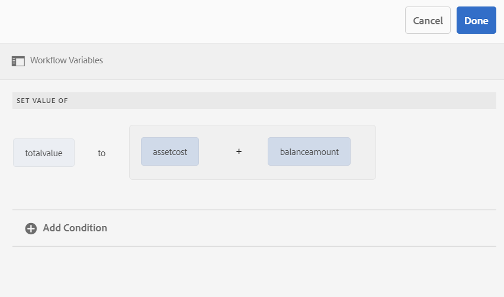

# Variabelen in AEM werkstromen{#variables-in-aem-workflows}

Een variabele in een workflowmodel is een manier om een waarde op te slaan op basis van het gegevenstype. U kunt dan de naam van de variabele in om het even welke werkschemastap gebruiken om de waarde terug te winnen die in de variabele wordt opgeslagen. U kunt veranderlijke namen ook gebruiken om uitdrukkingen te bepalen voor het nemen van verpletterende besluiten.

In AEM workflowmodellen kunt u:

* [Een variabele maken](/help/sites-developing/using-variables-in-aem-workflows.md#create-a-variable) van een gegevenstype dat op het informatietype wordt gebaseerd dat u in het wilt opslaan.
* [Een waarde voor de variabele instellen](/help/sites-developing/using-variables-in-aem-workflows.md#set-a-variable) met de workflowstap Variabele instellen.
* [De variabele gebruiken](/help/sites-developing/using-variables-in-aem-workflows.md#use-a-variable) in OF Splitsen en gaan de werkschemastappen AEM zodat kunt u een uitdrukking voor het nemen van verpletterende besluiten bepalen. U kunt ook variabelen gebruiken in alle AEM Forms Workflowstappen.

In de volgende video ziet u hoe u variabelen kunt maken, instellen en gebruiken in AEM workflowmodellen:

<!-- FUTURE ERROR: YouTube and mp4 videos are not supported -->

>[!VIDEO](https://helpx.adobe.com/content/dam/help/en/experience-manager/6-5/forms/using/usevariables_example.mp4)

Variabelen zijn een uitbreiding van de [MetaDataMap](https://developer.adobe.com/experience-manager/reference-materials/6-5/javadoc/com/adobe/granite/workflow/metadata/MetaDataMap.html) interface. U kunt [MetaDataMap](https://developer.adobe.com/experience-manager/reference-materials/6-5/javadoc/com/adobe/granite/workflow/metadata/MetaDataMap.html) in ECMAScript gebruiken voor toegang tot metagegevens die zijn opgeslagen met variabelen.

## Een variabele maken {#create-a-variable}

U maakt variabelen aan de hand van de sectie Variabelen die beschikbaar is in de assistent van het workflowmodel. AEM werkstroomvariabelen ondersteunen de volgende gegevenstypen:

* **Primitieve gegevenstypen**: Long, Double, Boolean, Date en String
* **Complexe gegevenstypen**: [XML](https://docs.oracle.com/javase/8/docs/api/org/w3c/dom/Document.html) en [JSON](https://www.javadoc.io/doc/com.google.code.gson/gson/2.3/com/google/gson/JsonObject.html)

>[!NOTE]
>
>Workflows ondersteunen alleen de ISO8601-indeling voor variabelen van het type Date.

Voor extra complexe gegevenstypen die beschikbaar zijn in AEM Forms-workflows raadpleegt u [Variabelen in AEM Forms-workflows](/help/forms/using/variable-in-aem-workflows.md). Gebruik het gegevenstype ArrayList om variabele verzamelingen te maken. U kunt een variabele ArrayList maken voor alle primitieve en complexe gegevenstypen. Maak bijvoorbeeld een variabele ArrayList en selecteer String als subtype om meerdere tekenreekswaarden op te slaan met de variabele.

Als u een variabele wilt maken,

1. Navigeer in een AEM naar Extra > Workflow > Modellen.
1. Selecteren **[!UICONTROL Create]** en geeft u de titel en een optionele naam voor het workflowmodel op. Selecteer het model en selecteer **[!UICONTROL Edit]**.
1. Selecteer het pictogram Variabelen dat beschikbaar is in de assistent van het workflowmodel en selecteer **[!UICONTROL Add Variable]**.

   

1. Geef in het dialoogvenster Variabele toevoegen de naam op en selecteer het type variabele.
1. Selecteer het gegevenstype in het menu **[!UICONTROL Type]** vervolgkeuzelijst en geef de volgende waarden op:

   * Primitieve gegevenstype - Geef een optionele standaardwaarde voor de variabele op.
   * JSON of XML - Geef een optioneel JSON- of XML-schemapad op. Het systeem valideert het schemapad terwijl het in kaart brengen van en het opslaan van eigenschappen beschikbaar in dit schema aan een andere variabele.
   * Formuliergegevensmodel - Geef een formuliergegevensmodelpad op.
   * ArrayList - Geef een subtype op voor de verzameling.

1. Geef een optionele beschrijving voor de variabele op en selecteer  om de wijzigingen op te slaan De variabele wordt weergegeven in de lijst die beschikbaar is in het linkerdeelvenster.

Houd rekening met de volgende werkwijzen wanneer u variabelen maakt:

* Maak zoveel variabelen als een workflow nodig heeft. Om databasemiddelen te besparen, moet u echter het minimale aantal vereiste variabelen gebruiken en moet u variabelen waar mogelijk opnieuw gebruiken.
* Variabelen zijn hoofdlettergevoelig. Zorg ervoor dat u in uw werkstroom naar variabelen verwijst met hetzelfde hoofdlettergebruik.
* Gebruik geen speciale tekens in de naam van een variabele

## Een variabele instellen {#set-a-variable}

Met de stap Variabele instellen kunt u de waarde van een variabele instellen en de volgorde definiëren waarin de waarden worden ingesteld. De variabele wordt geplaatst in de orde dat de veranderlijke toewijzingen in de vastgestelde veranderlijke stap vermeld zijn.

Wijzigingen in waarden van variabelen zijn alleen van invloed op de instantie van het proces waarin de wijziging plaatsvindt. Wanneer bijvoorbeeld een werkstroom wordt gestart en variabele gegevens worden gewijzigd, hebben de wijzigingen alleen invloed op dat exemplaar van de werkstroom. De wijzigingen zijn niet van invloed op andere versies van de workflow die eerder zijn gestart of later zijn gestart.

Afhankelijk van het gegevenstype van de variabele kunt u de volgende opties gebruiken om de waarde van een variabele in te stellen:

* **Letterlijk:** Gebruik deze optie als u precies weet welke waarde u moet opgeven.
* **Uitdrukking:** Gebruik de optie wanneer de te gebruiken waarde wordt berekend op basis van een expressie. De expressie wordt gemaakt in de beschikbare expressie-editor.
* **JSON-puntnotatie:** Gebruik de optie om een waarde van een JSON of FDM typevariabele terug te winnen.
* **XPATH:** Gebruik de optie om een waarde van een variabele van het type van XML terug te winnen.
* **Ten opzichte van lading:** Gebruik de optie wanneer de waarde die u wilt opslaan in een variabele, beschikbaar is op een pad dat relatief is ten opzichte van de laadbewerking.
* **Absoluut pad:** Gebruik de optie wanneer de waarde die u wilt opslaan in de variabele beschikbaar is in een absoluut pad.

U kunt ook specifieke elementen van een variabele van het type JSON of XML bijwerken met JSON-puntnotatie of XPATH-notatie.

### Toewijzing tussen variabelen toevoegen {#add-mapping-between-variables}

Ga als volgt te werk om toewijzingen tussen variabelen toe te voegen:

1. Selecteer op de pagina voor workflowbewerking het pictogram Stappen dat beschikbaar is in de assistent van het workflowmodel.
1. Sleep de **Variabele instellen** stap naar de werkstroomeditor, selecteer de stap en selecteer  (Configureren).
1. Selecteer in het dialoogvenster Variabele instellen de optie **[!UICONTROL Mapping]** > **[!UICONTROL Add Mapping]**.
1. In de **Kaartvariabele** selecteert u de variabele die u wilt opslaan, selecteert u de toewijzingsmodus en geeft u een waarde op die u in de variabele wilt opslaan. De toewijzingsmodi variëren op basis van het type variabele.
1. Wijs meer variabelen toe zodat u een zinvolle uitdrukking kunt maken. Selecteren  om de wijzigingen op te slaan

### Voorbeeld 1: Vraag een XML-variabele naar een waarde voor een tekenreeksvariabele {#example-query-an-xml-variable-to-set-value-for-a-string-variable}

Selecteer een variabele van het type van XML die u een dossier van XML wilt opslaan. Vraag de variabele van XML om de waarde voor een koordvariabele voor het bezit te plaatsen beschikbaar in het dossier van XML. Gebruiken **XPATH opgeven voor de XML-variabele** veld om de eigenschap te definiëren die in de tekenreeksvariabele moet worden opgeslagen.

Selecteer in dit voorbeeld een **formatiegegevens** XML-variabele om de **cc-app.xml** bestand. Vraag de **formatiegegevens** variabele zodat u de waarde voor de **e-mailadres** tekenreeksvariabele die de waarde voor de **emailAddress** eigenschap beschikbaar in de **cc-app.xml** bestand.

>[!VIDEO](https://helpx.adobe.com/content/dam/help/en/experience-manager/6-5/forms/using/set_variable_example1.mp4 "Waarde van een variabele instellen")

### Voorbeeld 2: een expressie gebruiken om waarde op te slaan op basis van andere variabelen {#example2}

Gebruik een expressie om de som van de variabelen te berekenen en sla het resultaat op in een variabele.

In dit voorbeeld gebruikt u de expressie-editor om een expressie te definiëren die de som van **assetkosten** en **saldi** variabelen en sla het resultaat op in **totalvalue** variabele.

<!-- FUTURE ERROR: YouTube and mp4 videos are not supported -->

>[!VIDEO](https://helpx.adobe.com/content/dam/help/en/experience-manager/6-5/forms/using/variables_expression.mp4)

## Expressieeditor gebruiken {#use-expression-editor}

U gebruikt ook expressies om de waarde van een variabele in de runtime te berekenen. Variabelen bieden een expressie-editor om expressies te definiëren.

Met de expressie-editor kunt u:

* Stel de waarde van variabelen in met behulp van andere workflowvariabelen, getallen of wiskundige expressies.
* Werkstroomvariabelen, tekenreeksen, getallen of expressies gebruiken in een wiskundige expressie
* Voeg voorwaarden toe, zodat u waarden van variabelen kunt instellen.
* Operatoren toevoegen tussen voorwaarden.



De editor is gebaseerd op de regel voor aangepaste formulieren. De volgende wijzigingen zijn aangebracht. Regeleditor in variabelen:

* Biedt geen ondersteuning voor functies.
* Biedt geen interface voor het weergeven van een overzicht van regels
* Heeft geen code-editor.
* Hiermee wordt het in- en uitschakelen van de waarde van een object niet ondersteund.
* Hiermee wordt eigenschap instellen van een object niet ondersteund.
* Biedt geen ondersteuning voor het oproepen van een webservice.

Zie voor meer informatie [regel-editor voor aangepaste formulieren](/help/forms/using/rule-editor.md).

## Een variabele gebruiken {#use-a-variable}

U kunt variabelen gebruiken om input en output terug te winnen of het resultaat van een stap te bewaren. De werkstroomeditor bevat twee typen workflowstappen:

* Workflowstappen met ondersteuning voor variabelen
* Workflowstappen zonder ondersteuning voor variabelen

### Workflowstappen met ondersteuning voor variabelen {#workflow-steps-with-support-for-variables}

De stap Ga naar OF Splitsen en alle AEM Forms Workflowstappen ondersteunen variabelen.

#### OF stap Splitsen {#or-split-step}

Met de indeling OR wordt een splitsing in de workflow gemaakt, waarna slechts één vertakking actief is. Met deze stap kunt u voorwaardelijke verwerkingspaden in uw workflow introduceren. U voegt workflowstappen naar wens toe aan elke vertakking.

U kunt het verpletteren van uitdrukking voor een tak bepalen gebruikend een regeldefinitie, manuscript ECMA, of een extern manuscript.

U kunt variabelen gebruiken om de verpletterende uitdrukking te bepalen gebruikend de uitdrukkingsredacteur. Voor meer informatie bij het gebruiken van het verpletteren van uitdrukkingen voor OF de Gesplitste stap, zie [OF stap Splitsen](/help/sites-developing/workflows-step-ref.md#or-split).

In dit voorbeeld, alvorens de verpletterende uitdrukking te bepalen, gebruik [voorbeeld 2](/help/sites-developing/using-variables-in-aem-workflows.md#example2) om de waarde voor de **totalvalue** variabele. Tak 1 is actief als de waarde van **totalvalue** variabele is groter dan 50000. Op dezelfde manier kunt u een regel bepalen om Tak 2 actief te maken als de waarde van **totalvalue** variabele is minder dan 50000.

<!-- FUTURE ERROR: YouTube and mp4 videos are not supported -->

>[!VIDEO](https://helpx.adobe.com/content/dam/help/en/experience-manager/6-5/forms/using/variables_orsplit_example.mp4)

Op dezelfde manier selecteer een externe manuscriptweg of specificeer het manuscript ECMA voor het verpletteren van uitdrukkingen om de actieve tak te evalueren. Selecteren **[!UICONTROL Rename Branch]** een alternatieve naam voor de vertakking opgeven.

Zie voor meer voorbeelden [Een workflowmodel maken](/help/forms/using/aem-forms-workflow.md#create-a-workflow-model).

#### Ga naar stap {#go-to-step}

De **Ga naar stap** laat u de volgende stap specificeren om in het werkschemamodel te lopen, afhankelijk van het resultaat van een verpletterende uitdrukking.

Gelijkaardig aan OF de Gesplitste stap, kunt u het verpletteren van uitdrukking voor stap bepalen gebruikend een regeldefinitie, manuscript ECMA, of een extern manuscript.

U kunt variabelen gebruiken om de verpletterende uitdrukking te bepalen gebruikend de uitdrukkingsredacteur. Voor meer informatie bij het gebruiken van het verpletteren van uitdrukkingen voor de stap Ga, zie [Ga naar stap](/help/sites-developing/workflows-step-ref.md#goto-step).


In dit voorbeeld wordt in de stap Ga naar de toepassing Creditcard controleren opgegeven als de volgende stap als de waarde voor de **genomen maatregelen** variable is gelijk aan **Meer informatie nodig**.

Voor meer voorbeelden bij het gebruiken van regeldefinitie in de stap Ga naar, zie [Een lus For simuleren](/help/sites-developing/workflows-step-ref.md#simulateforloop).

#### Forms-workflowgerichte stappen {#forms-workflow-centric-workflow-steps}

Alle AEM Forms Workflowstappen ondersteunen variabelen. Zie voor meer informatie [Forms-centric workflow op OSGi](/help/forms/using/aem-forms-workflow-step-reference.md).

### Workflowstappen zonder ondersteuning voor variabelen {#workflow-steps-without-support-for-variables}

U kunt [MetaDataMap](https://developer.adobe.com/experience-manager/reference-materials/6-5/javadoc/com/adobe/granite/workflow/metadata/MetaDataMap.html) interface voor toegang tot variabelen in workflowstappen die geen variabelen ondersteunen.

#### De waarde van de variabele ophalen {#retrieve-the-variable-value}

Gebruik de volgende API&#39;s in het ECMA-script om waarden voor bestaande variabelen op te halen op basis van het gegevenstype.

| Gegevenstype variabele | API |
|---|---|
| Primitief (lang, dubbel, Boolean, datum en tekenreeks) | workItem.getWorkflowData().getMetaDataMap().get(variableName, type) |
| XML | Packages.org.w3c.dom.Document xmlObject = workItem.getWorkflowData().getMetaDataMap().get(variableName, Packages.org.w3c.dom.Document.class); |
| JSON | Packages.com.google.get.JsonObject jsonObject = workItem.getWorkflowData().getMetaDataMap().get(variableName, Packages.com.google.gson.JsonObject.class); |

Zie voor informatie over API&#39;s voor extra complexe gegevenstypen die beschikbaar zijn in AEM Forms-workflows [Variabelen in AEM Forms-workflows](/help/forms/using/variable-in-aem-workflows.md).

**Voorbeeld**

Hiermee wordt de waarde van het gegevenstype String opgehaald met de volgende API:

```
workItem.getWorkflowData().getMetaDataMap().get(accname, Packages.java.lang.String)
```

#### De waarde van de variabele bijwerken {#update-the-variable-value}

Gebruik de volgende API in het ECMA-script om de waarde van een variabele bij te werken.

```
workItem.getWorkflowData().getMetaDataMap().put(variableName, value)
```

**Voorbeeld**

```
workItem.getWorkflowData().getMetaDataMap().put(salary, 50000)
```

Hiermee werkt u de waarde voor de **salaris** variabel tot 50000.

### Variabelen instellen om workflows aan te roepen {#apiinvokeworkflow}

U kunt een API gebruiken om variabelen in te stellen en deze door te geven om workflowinstanties aan te roepen.

[workflowSession.startWorkflow](https://developer.adobe.com/experience-manager/reference-materials/6-5/javadoc/com/adobe/granite/workflow/WorkflowSession.html#startWorkflow-com.adobe.granite.workflow.model.WorkflowModel-com.adobe.granite.workflow.exec.WorkflowData-java.util.Map-) gebruikt model, wfData, en metaData als argumenten. Gebruik MetaDataMap om de waarde voor de variabele in te stellen.

In deze API **variableName** variable is ingesteld op **value** met metaData.put(variableName, value);

```java
import com.adobe.granite.workflow.model.WorkflowModel;
import com.adobe.granite.workflow.metadata.MetaDataMap;
import com.adobe.aemfd.docmanager.Document;

/*Assume that you already have a workflowSession and modelId along with the payloadType and payload*/
WorkflowData wfData = workflowSession.newWorkflowData(payloadType, payload);
MetaDataMap metaData = wfData.getMetaDataMap();
metaData.put(variableName, value); //Create a variable "variableName" in your workflow model
WorkflowModel model = workflowSession.getModel(modelId);
workflowSession.startWorkflow(model, wfData, metaData);
```

## Een variabele bewerken {#edit-a-variable}

1. Selecteer op de pagina voor de bewerkingsworkflow het pictogram Variabelen in de assistent van het workflowmodel. In het gedeelte Variabelen in het linkerdeelvenster worden alle bestaande variabelen weergegeven.
1. Selecteer de  (Bewerken) naast de naam van de variabele die u wilt bewerken.
1. Bewerk de variabelegegevens en selecteer  om de wijzigingen op te slaan U kunt de **[!UICONTROL Name]** en **[!UICONTROL Type]** velden voor een variabele.

## Een variabele verwijderen {#delete-a-variable}

Voordat u de variabele verwijdert, verwijdert u alle referenties van de variabele uit de workflow. Zorg ervoor dat de variabele niet in de workflow wordt gebruikt.

Om een variabele te schrappen,

1. Selecteer op de pagina voor de bewerkingsworkflow het pictogram Variabelen in de assistent van het workflowmodel. In het gedeelte Variabelen in het linkerdeelvenster worden alle bestaande variabelen weergegeven.
1. Selecteer het pictogram Verwijderen naast de naam van de variabele die u wilt verwijderen.
1. Selecteren  om de variabele te bevestigen en te schrappen.
