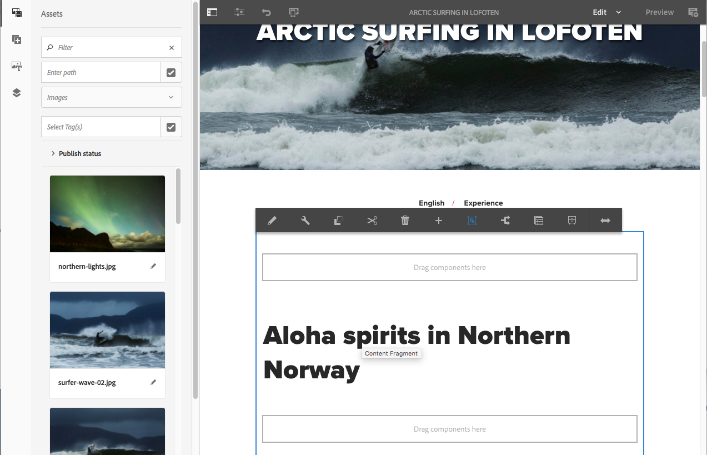

# Inhoudsfragmenten in We.Retail uitproberen{#trying-out-content-fragments-in-we-retail}

Met Inhoudsfragmenten kunt u kanaalneutrale inhoud maken, samen met (mogelijk kanaalspecifieke) variaties. **Wij.Detailhandel** (zoals beschikbaar in een out-of-the-box-instantie van Adobe Experience Manager) biedt het fragment **Arctic Surfing in Lofoten** als basissteekproef. Hieruit blijkt dat:

* Adobe Experience Manager (AEM)-inhoudsfragmenten zijn [gemaakt en beheerd als pagina-onafhankelijke elementen](/help/assets/content-fragments/content-fragments.md). U kunt hiermee kanaalneutrale inhoud maken, samen met (mogelijk kanaalspecifieke) variaties.

   * Zie [Waar kunt u de elementen van inhoudsfragmenten vinden in We.Retail](#where-to-find-content-fragments-in-we-retail)

* U kunt vervolgens [gebruiken deze fragmenten en de variaties ervan tijdens het ontwerpen](/help/sites-authoring/content-fragments.md) uw inhoudspagina&#39;s.

   * Zie [Waar de Fragmenten van de Inhoud in Wij.Retail worden gebruikt](#where-content-fragments-are-used-in-we-retail)

Voor de volledige documentatie over het maken, beheren, gebruiken en ontwikkelen van inhoudsfragmenten:

* Zie [Aanvullende informatie](#further-information)

>[!NOTE]
>
>**Inhoudsfragmenten** en **[Ervaar fragmenten](/help/sites-authoring/experience-fragments.md)** Er zijn verschillende functies binnen AEM:
>
>* **Inhoudsfragmenten** Dit zijn redactionele inhoud, voornamelijk tekst, en verwante afbeeldingen. Het zijn pure inhoud, zonder ontwerp en lay-out.
>* **Ervaar fragmenten** volledig opgemaakt zijn, een fragment van een webpagina.
>
>De Fragmenten van de ervaring kunnen inhoud in de vorm van Inhoudsfragmenten bevatten, maar niet andersom.

## Waar kan ik inhoudsfragmenten vinden in We.Retail {#where-to-find-content-fragments-in-we-retail}

Er zijn verscheidene fragmenten van de steekproefinhoud in Wij.Retail; navigeer via **Activa**, **Bestanden**, **Wij.Detailhandel**, **Engels**, **Ervaringen**.

Hieronder vallen **Arctic Surfing in Lofoten**, een fragment samen met gerelateerde visuele elementen:

* Navigeren door **Activa**, **Bestanden**, **Wij.Detailhandel**, **Engels**, **Ervaringen**, **Arctic Surfing in Lofoten**:

   * [http://localhost:4502/assets.html/content/dam/we-retail/en/experiences/arctic-surfing-in-lofoten](http://localhost:4502/assets.html/content/dam/we-retail/en/experiences/arctic-surfing-in-lofoten)

U kunt de **Arctic Surfing in Lofoten** fragment:

* [http://localhost:4502/editor.html/content/dam/we-retail/en/experiences/arctic-surfing-in-lofoten/arctic-surfing-in-lofoten](http://localhost:4502/editor.html/content/dam/we-retail/en/experiences/arctic-surfing-in-lofoten/arctic-surfing-in-lofoten)

Hier kunt u [bewerken en beheren](/help/assets/content-fragments/content-fragments.md) het fragment met de tabbladen (linkerdeelvenster):

<!--  ASSET does not exist-->

* **[Variaties](/help/assets/content-fragments/content-fragments-variations.md)** inclusief [Markering](/help/assets/content-fragments/content-fragments-markdown.md)
* **[Gekoppelde inhoud](/help/assets/content-fragments/content-fragments-assoc-content.md)**
* **[Metagegevens](/help/assets/content-fragments/content-fragments-metadata.md)**

## Waar de Fragmenten van de Inhoud in Wij.Retail worden gebruikt {#where-content-fragments-are-used-in-we-retail}

Ter illustratie [pagina&#39;s ontwerpen met een inhoudsfragment](/help/sites-authoring/content-fragments.md) er zijn verschillende voorbeeldpagina &#39; s onder andere :

* [http://localhost:4502/sites.html/content/we-retail/language-masters/en/experience](http://localhost:4502/sites.html/content/we-retail/language-masters/en/experience)

Bijvoorbeeld de **Arctic Surfing in Lofoten** naar het inhoudsfragment wordt verwezen in de pagina Sites:

* Navigeren via **Sites**, **Wij.Detailhandel**, **Taalmeesters**, **Engels**, **Ervaring**. Vervolgens openen **Arctic Surfing in Lofoten** voor bewerking:

   * [http://localhost:4502/editor.html/content/we-retail/language-masters/en/experience/arctic-surfing-in-lofoten.html](http://localhost:4502/editor.html/content/we-retail/language-masters/en/experience/arctic-surfing-in-lofoten.html)

## Aanvullende informatie {#further-information}

Zie voor meer informatie:

* [Werken met inhoudsfragmenten](/help/assets/content-fragments/content-fragments.md)

   * Leer hoe u elementen van inhoudsfragmenten maakt, bewerkt en beheert.

* [Pagina&#39;s ontwerpen met inhoudsfragmenten](/help/sites-authoring/content-fragments.md)

   * Gebruik het inhoudsfragment wanneer u een pagina ontwerpt.

* [AEM ontwikkelen - Componenten voor inhoudsfragmenten](/help/sites-developing/components-content-fragments.md)

   * Een overzicht van de componenten voor Content Fragments.

* [Inhoudsfragmenten ontwikkelen en uitbreiden](/help/sites-developing/customizing-content-fragments.md)

   * Informatie die u helpt bij het ontwikkelen en uitbreiden van inhoudsfragmenten.
