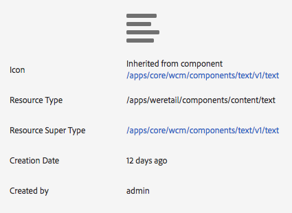

# Core Components uitproberen in We.Retail{#trying-out-core-components-in-we-retail}

De kerncomponenten zijn moderne, flexibele componenten die eenvoudig uitbreidbaar zijn en eenvoudige integratie in uw projecten mogelijk maken. De kerncomponenten zijn gebouwd rond verscheidene belangrijke ontwerpprincipes zoals HTML, bruikbaarheid out-of-the-box, configureerbaarheid, versioning, en rekbaarheid. We.Retail is gebaseerd op kerncomponenten.

## Uitproberen {#trying-it-out}

1. Het begin Adobe Experience Manager (AEM) met de wij.Retail steekproefinhoud en opent de [&#x200B; Console van Componenten &#x200B;](/help/sites-authoring/default-components-console.md).

   **Globale Navigatie > Hulpmiddelen > Componenten**

1. Wanneer u de rail opent in de componentenconsole, kunt u filteren voor een bepaalde componentgroep. De kerncomponenten vindt u in

   * `.core-wcm`: De standaard kerncomponenten
   * `.core-wcm-form`: De kerncomponenten voor het verzenden van formulieren

   Kies `.core-wcm` .

   

1. Alle kerncomponenten worden genoemd **v1**, die erop wijzen dat dit de eerste versie van deze kerncomponent is. Regelmatige versies worden uitgebracht, die versiecompatibel zijn met AEM en eenvoudig upgraden mogelijk maken, zodat u kunt profiteren van de nieuwste functies.
1. Klik **Tekst (v1)**.

   Zie dat het **Type van Middel** van de component `/apps/core/wcm/components/text/v1/text` is. De componenten van de kern worden gevonden onder `/apps/core/wcm/components` en zijn versioned per component.

   

1. Klik het **Documentatie** lusje om de ontwikkelaardocumentatie voor de component te zien.

   

1. Ga terug naar de componentconsole. Filter voor de groep **We.Retail** en selecteer de **3&rbrace; component van de Tekst &lbrace;.**
1. Zie dat het **Type van Middel** aan een component zoals verwacht onder `/apps/weretail` maar het **Type van Super van het Middel** wijst terug naar de kerncomponent `/apps/core/wcm/components/text/v1/text`.

   

1. Klik het **Levende lusje van het Gebruik** om te zien op welke pagina&#39;s deze component wordt gebruikt. Klik eerste **Dank u** pagina om de pagina uit te geven.

   

1. Selecteer op de pagina Hartelijk dank de tekstcomponent en klik in het bewerkingsmenu van de component op het pictogram Overerving annuleren.

   [&#x200B; Wij.Retail heeft een geglobaliseerde plaatsstructuur &#x200B;](/help/sites-developing/we-retail-globalized-site-structure.md) waar de inhoud van taalmeesters aan [&#x200B; levende exemplaren door een mechanisme genoemd erfenis &#x200B;](/help/sites-administering/msm.md) wordt geduwd. Daarom moet overerving worden geannuleerd, zodat een gebruiker tekst handmatig kan bewerken.

   

1. Bevestig de annulering door **ja** te klikken.

   

1. Nadat de overerving is geannuleerd en u de tekstcomponenten selecteert, zijn er veel meer opties beschikbaar. Klik **uitgeven**.

   

1. U kunt nu zien welke bewerkingsopties beschikbaar zijn voor de tekstcomponent.

   

1. Van het **menu van de Informatie van de Pagina**, uitgezocht **geef Malplaatje** uit.
1. In de Redacteur van het Malplaatje van de pagina, klik het **pictogram van het Beleid** van de component van de Tekst in de **Container van de Lay-out** van de pagina.

   

1. Met de kerncomponenten kan een sjabloonauteur configureren welke eigenschappen beschikbaar zijn voor de auteurs van de pagina. Dit zijn onder andere functies zoals toegestane bronnen voor plakken, opmaakopties en beschikbare alineastijlen.

   Dergelijke ontwerpdialoogvensters zijn beschikbaar voor veel kerncomponenten en werken samen met de sjablooneditor. Zodra toegelaten, zijn zij beschikbaar aan de auteur door de componentenredacteurs.

   

## Aanvullende informatie {#further-information}

Voor verdere informatie over de kerncomponenten, zie de auteursdocument [&#x200B; Componenten van de Kern &#x200B;](https://experienceleague.adobe.com/docs/experience-manager-core-components/using/introduction.html?lang=nl-NL) voor een overzicht van de mogelijkheden van de kerncomponenten en het ontwikkelaarsdocument [&#x200B; het Ontwikkelen van de Componenten van de Kern &#x200B;](https://experienceleague.adobe.com/docs/experience-manager-core-components/using/developing/overview.html?lang=nl-NL) voor een technisch overzicht.

Ook kunt u wensen om [&#x200B; editable malplaatjes &#x200B;](/help/sites-developing/we-retail-editable-templates.md) verder te onderzoeken. Verwijs naar het auteursdocument [&#x200B; Creërend de Malplaatjes van de Pagina &#x200B;](/help/sites-authoring/templates.md) of de Malplaatjes van het ontwikkelaarsdocument van de Pagina [&#x200B; - editable &#x200B;](/help/sites-developing/page-templates-editable.md) voor volledige details op editable malplaatjes.
