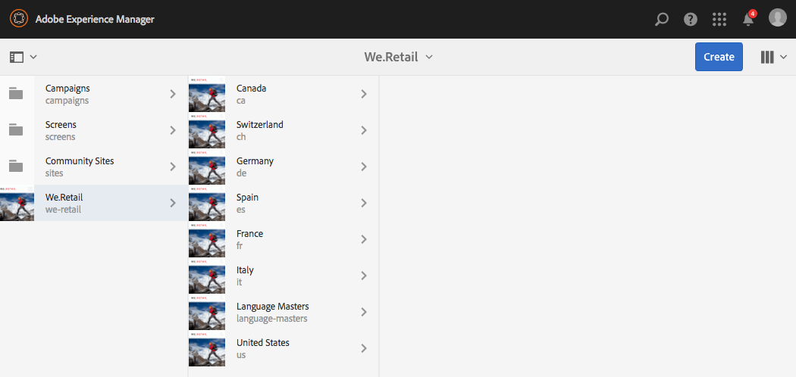

# De geglobaliseerde sitestructuur in &#39;We&#39; uitproberen.Handelsversie{#trying-out-the-globalized-site-structure-in-we-retail}

We.Retail is gebouwd met een geglobaliseerde sitestructuur die een taalmaster biedt die live kan worden gekopieerd naar landspecifieke websites. Alles is ingesteld op &#39;out-of-the-box&#39;, zodat u kunt experimenteren met deze structuur en de ingebouwde vertaalmogelijkheden.

## Uitproberen {#trying-it-out}

1. Open de plaatsenconsole van **Globale Navigatie > Plaatsen**.
1. Schakelaar aan kolommening (als niet reeds actief) en selecteer Wij.Retail. Neem nota van de structuur van het voorbeeldland met Zwitserland, de Verenigde Staten, Frankrijk, etc., langs de Meester van de Taal.

   

1. Selecteer Zwitserland en bekijk de taalwortels voor de talen van dat land. Er is nog geen inhoud onder deze wortels.

   

1. Ga naar de lijstweergave en controleer of de taalkopieën voor de landen allemaal live kopieën zijn.

   

1. Ga terug naar de kolomweergave, klik op het stramien Taal en bekijk de hoofdwortels van de taal met inhoud. Alleen Engels heeft inhoud.

   Wij.Retail wordt niet geleverd met vertaalde inhoud, maar de structuur en configuratie zijn aanwezig om u de vertaalservices te laten demonstreren.

   

1. Met de Engelse geselecteerde Meester van de Taal, open het **spoor van Verwijzingen in de plaatsenconsole en selecteer** Exemplaren van de Taal **.**

   

1. Tik checkbox naast het **etiket van de Kopieën van de Taal 0&rbrace; &lbrace;om alle taalexemplaren te selecteren.** In de **de taalexemplaren van de Update** sectie van het spoor, selecteer de optie om **een nieuw vertaalproject** tot stand te brengen. Verstrek een naam voor het project en klik **Update**.

   

1. Voor elke taalvertaling wordt een project gemaakt. Bekijk hen onder **Navigatie > Projecten**.

   

1. Klik op Duits om de details van het vertaalproject te bekijken. De status is in **Ontwerp**. Om de vertaling met de vertaaldienst van Microsoft® te beginnen, klik het hoofdstuk naast de **rubriek van de Baan van de Vertaling** en selecteer **Begin**.

   

1. Het vertaalproject begint. Klik op de ovaal onder aan de kaart met het label Vertaaltaak om de details weer te geven. De pagina&#39;s met de staat **Klaar voor overzicht** zijn reeds vertaald door de vertaaldienst.

   

1. Het selecteren van één van de pagina&#39;s in de lijst en dan **Voorproef in Plaatsen** in de toolbar opent de vertaalde pagina in de paginaredacteur.

   

>[!NOTE]
>
>Deze procedure heeft de ingebouwde integratie met Microsoft®-computervertaling aangetoond. Gebruikend het [&#x200B; AEM Kader van de Integratie van de Vertaling &#x200B;](/help/sites-administering/translation.md), kunt u met vele standaardvertaaldiensten integreren om de vertaling van AEM te ordenen.

## Meer informatie {#further-information}

Voor meer informatie, zie het auteursdocument [&#x200B; Vertaal Inhoud voor Meertalige Plaatsen &#x200B;](/help/sites-administering/translation.md) voor volledige technische details.
