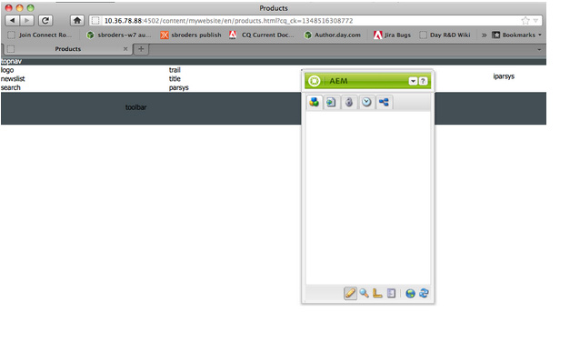
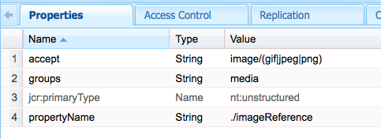
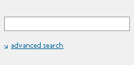

# Een volledig functionele website (JSP) maken{#create-a-fully-featured-website-jsp}

>[!NOTE]
>
>In dit artikel wordt beschreven hoe u een website maakt met JSP en op basis van de klassieke gebruikersinterface. Adobe raadt aan de nieuwste Adobe Experience Manager (AEM)-technologieën voor uw websites te gebruiken, zoals in het artikel gedetailleerd wordt beschreven [Aan de slag met het ontwikkelen van AEM Sites](/help/sites-developing/getting-started.md).

Met deze zelfstudie kunt u een volledig uitgeruste website met AEM maken. De website is gebaseerd op een algemene website en is vooral gericht op webontwikkelaars. Alle ontwikkelingen vinden plaats in een auteursomgeving.

In deze zelfstudie wordt beschreven hoe u:

1. AEM installeren.
1. Access CRXDE Lite (de ontwikkelomgeving).
1. Stel de projectstructuur in CRXDE Lite in.
1. Maak de sjabloon, component en scripts die worden gebruikt als basis voor het maken van inhoudspagina&#39;s.
1. Maak de basispagina voor uw website en stel vervolgens de inhoudspagina&#39;s in.
1. Maak de volgende componenten voor gebruik op uw pagina&#39;s:

   * Bovenste navigatie
   * Onderliggende items weergeven
   * Logo
   * Afbeelding
   * Text-Image
   * Zoeken

1. Verschillende basiscomponenten opnemen.

Nadat u alle stappen hebt uitgevoerd, moeten de pagina&#39;s er als volgt uitzien:


**Het uiteindelijke resultaat downloaden**

Download website-1.0.zip om de zelfstudie te volgen en niet de oefeningen uit te voeren. Dit bestand is een AEM inhoudspakket dat de resultaten van deze zelfstudie bevat. Gebruiken [Pakketbeheer](/help/sites-administering/package-manager.md) om het pakket te installeren naar de auteur.

**OPMERKING:** Wanneer u dit pakket installeert, worden alle bronnen in de ontwerpinstantie die u met deze zelfstudie hebt gemaakt, overschreven.

Inhoud website-pakket

[Bestand ophalen](assets/website-1_0.zip)

## Adobe Experience Manager installeren {#installing-adobe-experience-manager}

Volg de instructies voor het instellen van een AEM voor het ontwikkelen van uw website [implementatieomgeving met auteur- en publicatieinstanties](/help/sites-deploying/deploy.md#author-and-publish-installs)of voert een [algemene installatie](/help/sites-deploying/deploy.md#default-local-install). De algemene installatie omvat het downloaden van het AEM QuickStart JAR-bestand, het plaatsen van het bestand license.properties in dezelfde map als het JAR-bestand en het dubbelklikken op het JAR-bestand.

Nadat u AEM hebt geïnstalleerd, toegang tot de ontwikkelomgeving van de CRXDE Lite door de verbinding van de CRXDE Lite op de Welkome pagina te klikken:


>[!NOTE]
>
>De URL van CRXDE Lite voor een AEM ontwerpinstantie die lokaal is geïnstalleerd met de standaardpoort is [https://localhost:4502/crx/de/](https://localhost:4502/crx/de/).

### De projectstructuur instellen in CRXDE Lite {#setting-up-the-project-structure-in-crxde-lite}

Gebruik CRXDE Lite om de structuur van de mywebsite-toepassing in de opslagplaats te maken:

1. Klik in de boomstructuur links van CRXDE Lite met de rechtermuisknop op de knop **`/apps`** map en klik op **Maken** > **Maken** **Map**. In de **Map maken** dialoogvenster, type `mywebsite` als mapnaam en klik op **OK**.
1. Klik met de rechtermuisknop op de knop **`/apps/mywebsite`** map en klik op **Maken** > **Map maken**. In de **Map maken** dialoogvenster, type `components` als mapnaam en klik op **OK**.
1. Klik met de rechtermuisknop op de knop **`/apps/mywebsite`** map en klik op **Maken** > **Map maken**. In de **Map maken** dialoogvenster, type `templates` als mapnaam en klik op **OK**.

   De structuur in de boom moet er nu ongeveer als volgt uitzien:

   

1. Klikken **Alles opslaan**.

### Het ontwerp instellen {#setting-up-the-design}

In deze sectie maakt u het ontwerp voor uw toepassing met het gereedschap Designer. Het ontwerp biedt CSS- en afbeeldingsbronnen voor uw website.

>[!NOTE]
>
>Klik op de volgende koppeling om mywebsite.zip te downloaden. Het archief bevat de bestanden static.css en image voor uw ontwerp.

Voorbeeld van bestand static.css en afbeeldingen

[Bestand ophalen](assets/mywebsite.zip)

1. Klik op de AEM welkomstpagina op **Gereedschappen**. ([https://localhost:4502/libs/cq/core/content/welcome.html](https://localhost:4502/libs/cq/core/content/welcome.html))

   

1. Selecteer in de mappenstructuur de optie **Ontwerpen** en klik vervolgens op **Nieuw** > **Nieuwe pagina**. Type `mywebsite` als de titel en klik op **Maken**.

1. Als het mijnwebsite-item niet in de tabel wordt weergegeven, vernieuwt u de structuur of de tabel.

1. [WebDAV gebruiken](/help/sites-administering/webdav-access.md) toegang tot de URL op https://localhost:4502, kopieer het voorbeeld `static.css` en `images` van het gedownloade bestand mywebsite.zip naar de `/etc/designs/mywebsite` map.

   

### Sjabloon, component en script voor de inhoudspagina maken {#creating-the-contentpage-template-component-and-script}

In deze sectie maakt u het volgende:

* De sjabloon voor de inhoudspagina die wordt gebruikt om inhoudspagina&#39;s te maken in de voorbeeldwebsite.
* De component contentPage die wordt gebruikt om pagina&#39;s met inhoud te renderen.
* The contentPage script.

#### De sjabloon voor de inhoudspagina maken {#creating-the-contentpage-template}

Maak een sjabloon die u als basis voor de webpagina&#39;s van uw site wilt gebruiken.

Een sjabloon definieert de standaardinhoud van een nieuwe pagina. Complexe websites kunnen verschillende sjablonen gebruiken om de verschillende typen pagina&#39;s op de site te maken. In deze exercitie, zijn alle pagina&#39;s gebaseerd op één eenvoudig malplaatje.

1. Klik met de rechtermuisknop in de mappenstructuur van CRXDE Lite `/apps/mywebsite/templates` en klik op **Maken** > **Sjabloon maken**.

1. Typ in het dialoogvenster Sjabloon maken de volgende waarden en klik vervolgens op **Volgende**:

   * **Label**: contentPage
   * **Titel**: Sjabloon voor pagina met inhoud op mijn website
   * **Beschrijving**: Dit is mijn sjabloon voor pagina met website-inhoud
   * **Type bron:** mywebsite/componenten/contentPage

   Gebruik de standaardwaarde voor het Rangschikken bezit.

   

   Het middeltype identificeert de component die de pagina teruggeeft. In dit geval worden alle pagina&#39;s die met de sjabloon voor de inhoudspagina zijn gemaakt, gerenderd door de `mywebsite/components/contentpage` component.

1. Als u de paden wilt opgeven van de pagina&#39;s die deze sjabloon kunnen gebruiken, klikt u op de plusknop en typt u `/content(/.*)?` in het tekstvak dat wordt weergegeven. Klik vervolgens op **Volgende**.

   

   De waarde van de eigenschap allowed path is a *reguliere expressie.* Pagina&#39;s die een pad hebben dat overeenkomt met de expressie, kunnen de sjabloon gebruiken. In dit geval komt de reguliere expressie overeen met het pad van het **/content** en alle subpagina&#39;s.

   Wanneer een auteur een pagina onder /content maakt, wordt **contentpagina** De sjabloon wordt weergegeven in een lijst met beschikbare sjablonen.

1. Klikken **Volgende** in de **Toegestane bovenliggende elementen** en **Toegestane kinderen** deelvensters en klikken **OK**. Klik in CRXDE Lite op **Alles opslaan**.

   

#### De component ContentPage maken {#creating-the-contentpage-component}

Maak de *component* Hiermee definieert u de inhoud en geeft u de pagina&#39;s weer die de sjabloon voor de inhoudspagina gebruiken. De plaats van de component moet met de waarde van het bezit van het Type van Middel van het contentpage malplaatje beantwoorden.

1. In CRXDE Lite klikt u met de rechtermuisknop `/apps/mywebsite/components` en klik op **Maken** > **Component**.
1. In de **Component maken** typt u de volgende eigenschapswaarden:

   * **Label**: contentPage
   * **Titel**: Inhoud pagina-component Mijn website
   * **Beschrijving**: Dit is de inhoud van mijn website, component Pagina

   

   De locatie van de nieuwe component is `/apps/mywebsite/components/contentpage`. Dit pad komt overeen met het middeltype van de sjabloon voor de inhoudspagina (min het eerste **`/apps/`** deel van het pad).

   Deze correspondentie verbindt het malplaatje met de component en is kritiek aan het correcte functioneren van de website.

1. Klikken **Volgende** totdat het deelvenster Toegestane onderliggende items van het dialoogvenster wordt weergegeven en klikt u vervolgens op **OK**. Klik in CRXDE Lite op **Alles opslaan**.

   De structuur ziet er nu als volgt uit:

   

#### Het script voor de component ContentPage ontwikkelen {#developing-the-contentpage-component-script}

Voeg code toe aan het script contentPage.jsp om de pagina-inhoud te definiëren.

1. Open het bestand in CRXDE Lite `contentpage.jsp` in `/apps/mywebsite/components/contentpage`. Het bestand bevat standaard de volgende code:

   ```java
   <%--
   
     My Website Content Page Component component.
   
     This is My Website Content Page Component.
   
   --%><%
   %><%@include file="/libs/foundation/global.jsp"%><%
   %><%@page session="false" %><%
   %><%
       /* TODO add you code here */
   %>
   ```

1. Kopieer de volgende code en plak deze in contentPage.jsp na de standaardcode:

   ```java
   <%@ page language="java" contentType="text/html; charset=ISO-8859-1"
       pageEncoding="ISO-8859-1"%>
   <!DOCTYPE html PUBLIC "-//W3C//DTD HTML 4.01 Transitional//EN"
   "https://www.w3.org/TR/html4/loose.dtd">
   <html>
   <head>
   <meta http-equiv="Content-Type" content="text/html; charset=ISO-8859-1">
   <title>My title</title>
   </head>
   <body>
   <div>My body</div>
   </body>
   </html>
   ```

1. Klikken **Alles opslaan** om uw wijzigingen op te slaan.

### Websitepagina&#39;s en inhoudspagina&#39;s maken {#creating-your-website-page-and-content-pages}

In deze sectie maakt u de volgende pagina&#39;s die allemaal de sjabloon voor de inhoudspagina gebruiken: Mijn website, Engels, Producten, Services en Klanten.

1. Op de AEM Welkomstpagina ([https://localhost:4502/libs/cq/core/content/welcome.html](https://localhost:4502/libs/cq/core/content/welcome.html)), klikt u op Websites.

   

1. Selecteer in de mappenstructuur de optie **Websites** en klik vervolgens op **Nieuw** > **Nieuwe pagina**.
1. In de **Pagina maken** voert u het volgende in:

   * Titel: `My Website`
   * Naam: `mywebsite`
   * Selecteer de `My Website Content Page Template`

   

1. Klikken **Maken**. Selecteer in de mappenstructuur de optie **/Websites/Mijn website** pagina en klik op **Nieuw** > **Nieuwe pagina**.
1. Voer in het dialoogvenster Pagina maken de volgende eigenschapswaarden in en klik op Maken:

   * Titel: Engels
   * Naam: en
   * Sjabloon voor de pagina Mijn website-inhoud selecteren

1. Selecteer in de mappenstructuur de optie **/Websites/Mijn website/Engels** pagina en klik op **Nieuw**> **Nieuwe pagina**.
1. In de **Pagina maken** voert u de volgende eigenschapwaarden in en klikt u op **Maken**:

   * Titel: Producten
   * Sjabloon voor de pagina Mijn website-inhoud selecteren

1. Selecteer in de mappenstructuur de optie **/Websites/Mijn website/Engels** pagina en klik op **Nieuw** > **Nieuwe pagina**.
1. In de **Pagina maken** voert u de volgende eigenschapwaarden in en klikt u op **Maken**:

   * Titel: Services
   * Sjabloon voor de pagina Mijn website-inhoud selecteren

1. Selecteer in de mappenstructuur de optie **/Websites/Mijn website/Engels** pagina en klik op **Nieuw** > **Nieuwe pagina**.
1. In de **Pagina maken** voert u de volgende eigenschapwaarden in en klikt u op **Maken**:

   * Titel: Klanten
   * Sjabloon voor de pagina Mijn website-inhoud selecteren

   Uw structuur ziet er als volgt uit:

   

1. Als u uw pagina&#39;s wilt koppelen aan het mywebsite-ontwerp, selecteert u in CRXDE Lite de optie `/content/mywebsite/en/jcr:content` knooppunt. Typ op het tabblad Eigenschappen de volgende waarden voor een nieuwe eigenschap en klik vervolgens op Toevoegen:

   * Naam: cq:designPath
   * Type: String
   * Waarde: /etc/designs/mywebsite

   

1. Open in een nieuw webbrowsertabblad of -venster [https://localhost:4502/content/mywebsite/en/products.html](https://localhost:4502/content/mywebsite/en/products.html) om de pagina Producten te bekijken:

   

### Het script voor de inhoudspagina verbeteren {#enhancing-the-contentpage-script}

In deze sectie wordt beschreven hoe u het script voor de inhoudspagina kunt verbeteren met behulp van de scripts van de AEM basis en door uw eigen scripts te schrijven.

Wanneer u klaar bent, **Producten** De pagina moet er als volgt uitzien:



#### Het gebruiken van de Manuscripten van de Pagina van de Stichting {#using-the-foundation-page-scripts}

In deze oefening, vormt u uw component van de pagina-inhoud zodat zijn supertype de AEM component van de Pagina is. Omdat componenten de eigenschappen van hun supertype erven, erft uw pagina-inhoud de scripts en eigenschappen van de component Pagina.

In uw JSP-code van de component kunt u bijvoorbeeld naar de scripts verwijzen die de supertype-component biedt, alsof deze in de component zijn opgenomen.

1. Voeg in CRXDE Lite een eigenschap toe aan de `/apps/mywebsite/components/contentpage` knooppunt.

   1. Selecteer de `/apps/mywebsite/components/contentpage` knooppunt.
   1. Typ onder aan het tabblad Eigenschappen de volgende eigenschapswaarden en klik op Toevoegen:

      * **Naam:** sling:resourceSuperType
      * **Type:** String
      * **Waarde:** basis/componenten/pagina

   1. Klik op Alles opslaan.

1. Open de `contentpage.jsp` bestand onder `/apps/mywebsite/components/contentpage` en vervang de bestaande code door de volgende code:

   ```xml
   <%@include file="/libs/foundation/global.jsp"%><%
   %><%@page session="false" contentType="text/html; charset=utf-8" %><%
   %><!DOCTYPE HTML PUBLIC "-//W3C//DTD HTML 4.01//EN" "https://www.w3.org/TR/html4/strict.dtd">
   <html>
   <cq:include script="head.jsp"/>
   <cq:include script="body.jsp"/>
   </html>
   ```

1. Sla uw wijzigingen op.
1. Laad de pagina Producten in uw browser opnieuw. Het ziet er als volgt uit:

   

   Open de paginabron om de JavaScript- en HTML-elementen te zien die door de scripts head.jsp en body.jsp zijn gegenereerd. Het volgende scriptfragment opent Sidekick wanneer u de pagina opent:

   ```java
   CQ.WCM.launchSidekick("/content/mywebsite/en/products",
               {propsDialog: "/libs/foundation/components/page/dialog",
                  locked: false locked: false
                });
   ```

#### Uw eigen scripts gebruiken {#using-your-own-scripts}

In deze sectie maakt u verschillende scripts die elk een deel van de hoofdtekst van de pagina genereren. Vervolgens maakt u het bestand body.jsp in de component pageContent om het body.jsp van de component AEM Page te overschrijven. In uw body.jsp- dossier, omvat u uw manuscripten die de verschillende delen van de paginakleurtekst produceren.

**Tip:** Wanneer een component een bestand bevat dat dezelfde naam en relatieve locatie heeft als een bestand in het supertype van de component, wordt het aangeroepen *bedekken*.

1. Maak het bestand in CRXDE Lite `left.jsp` krachtens `/apps/mywebsite/components/contentpage`:

   1. Klik met de rechtermuisknop op het knooppunt `/apps/mywebsite/components/contentpage`Selecteer vervolgens **Maken **dan **Bestand maken**.

   1. Typ in het venster `left.jsp` als de **Naam** en klik op **OK**.

1. Het bestand bewerken `left.jsp` om de bestaande inhoud te verwijderen en door de volgende code te vervangen:

   ```java
   <%@include file="/libs/foundation/global.jsp"%><%
   %><div class="left">
   <div>logo</div>
   <div>newslist</div>
   <div>search</div>
   </div>
   ```

1. Sla de wijzigingen op.
1. Maak het bestand in CRXDE Lite `center.jsp` krachtens `/apps/mywebsite/components/contentpage`:

   1. Klik met de rechtermuisknop op het knooppunt `/apps/mywebsite/components/contentpage`, selecteert u **Maken** vervolgens **Bestand maken**.

   1. Typ in het dialoogvenster `center.jsp` als **Naam** en klik op **OK**.

1. Het bestand bewerken `center.jsp` om de bestaande inhoud te verwijderen en deze te vervangen door de volgende code:

   ```java
   <%@include file="/libs/foundation/global.jsp"%><%
   %><div class="center">
   <div>trail</div>
   <div>title</div>
   <div>parsys</div>
   </div>
   ```

1. Sla de wijzigingen op.
1. Maak het bestand in CRXDE Lite `right.jsp` krachtens `/apps/mywebsite/components/contentpage`:

   1. Klik met de rechtermuisknop op het knooppunt `/apps/mywebsite/components/contentpage`, selecteert u **Maken** vervolgens **Bestand maken**.

   1. Typ in het dialoogvenster `right.jsp` als **Naam** en klik op **OK**.

1. Het bestand bewerken `right.jsp` om de bestaande inhoud te verwijderen en door de volgende code te vervangen:

   ```java
   <%@include file="/libs/foundation/global.jsp"%><%
   %><div class="right">
   <div>iparsys</div>
   </div>
   ```

1. Sla de wijzigingen op.
1. Maak het bestand in CRXDE Lite `body.jsp` krachtens `/apps/mywebsite/components/contentpage`:
1. Het bestand bewerken `body.jsp` om de bestaande inhoud te verwijderen en door de volgende code te vervangen:

   ```java
   <%@include file="/libs/foundation/global.jsp"%><%
   %><body>
   <div id="CQ">
   <div class="topnav">topnav</div>
   <div class="content">
   <cq:include script="left.jsp" />
   <cq:include script="center.jsp" />
   <cq:include script="right.jsp" />
   </div>
   <div class="footer">
   <div class="toolbar">toolbar</div>
   </div>
   </div>
   </body>
   ```

1. Sla de wijzigingen op.
1. Laad de pagina Producten in uw browser opnieuw. Het ziet er als volgt uit:

   

### De bovenste navigatiecomponent maken {#creating-the-top-navigation-component}

In deze sectie maakt u een component die koppelingen naar alle pagina&#39;s op hoofdniveau van de website weergeeft om de navigatie te vereenvoudigen. Deze componentinhoud wordt boven aan alle pagina&#39;s weergegeven die zijn gemaakt met de sjabloon voor de inhoudspagina.

In de eerste versie van de bovenste navigatiecomponent (boven) zijn de navigatie-items alleen tekstkoppelingen. In de tweede versie implementeert u bovenaan met koppelingen voor afbeeldingsnavigatie.

Wanneer u klaar bent, zou uw hoogste navigatie als volgt moeten kijken:


#### De bovenste navigatiecomponent maken {#creating-the-top-navigation-component-1}

1. In CRXDE Lite klikt u met de rechtermuisknop `/apps/mywebsite/components`, selecteert u **Maken** vervolgens **Component maken**.
1. In de **Component maken** voert u het volgende in:

   * **Label**: `topnav`

   * **Titel**: `My Top Navigation Component`

   * **Beschrijving**: `This is My Top Navigation Component`

1. Klikken **Volgende** totdat u naar het laatste venster komt waar u klikt **OK**. Sla uw wijzigingen op.

#### Het bovenste navigatiescript maken met tekstkoppelingen {#creating-the-top-navigation-script-with-textual-links}

Voeg het renderscript toe aan bovenliggend item om tekstkoppelingen naar onderliggende pagina&#39;s te genereren:

1. Open het bestand in CRXDE Lite `topnav.jsp` krachtens `/apps/mywebsite/components/topnav`.
1. Vervang de desbetreffende code door de volgende code te kopiëren en te plakken:

   ```xml
   <%@include file="/libs/foundation/global.jsp"%><%
   %><%@ page import="java.util.Iterator,
           com.day.text.Text,
           com.day.cq.wcm.api.PageFilter, com.day.cq.wcm.api.Page" %><%
       /* get starting point of navigation */
       Page navRootPage = currentPage.getAbsoluteParent(2);
       if (navRootPage == null && currentPage != null) {
       navRootPage = currentPage;
       }
       if (navRootPage != null) {
           Iterator<Page> children = navRootPage.listChildren(new PageFilter(request));
           while (children.hasNext()) {
               Page child = children.next();
               %><a href="<%= child.getPath() %>.html"><%=child.getTitle() %></a><%
           }
       }
   %>
   ```

#### Inclusief bovenste navigatie in de component ContentPage {#including-top-navigation-in-the-contentpage-component}

Het onderwerp opnemen in de component ContentPage:

1. Open in CRXDE Lite de `body.jsp` krachtens `/apps/mywebsite/components/contentpage`en vervangen:

   ```xml
   <div class="topnav">topnav</div>
   ```

   met:

   ```xml
   <cq:include path="topnav" resourceType="mywebsite/components/topnav" />
   ```

1. Sla de wijzigingen op.
1. Laad de pagina Producten in uw browser opnieuw. De bovenste navigatie ziet er als volgt uit:

   

#### Pagina&#39;s verbeteren met ondertitels {#enhancing-pages-with-subtitles}

De component Pagina definieert eigenschappen waarmee u ondertitels voor pagina&#39;s kunt opgeven. Voeg ondertitels toe die informatie over de pagina-inhoud bevatten.

1. Open in uw browser de **Producten** pagina.
1. Op de Sidekick **Pagina** tabblad, klikt u op **Pagina-eigenschappen**.
1. Vouw op het tabblad Standaard van het dialoogvenster de optie **Meer titels en beschrijvingen,** en voor de **Ondertitel** eigenschap, type **wat wij doen**. Klikken **OK**.
1. Herhaal de vorige stappen om de ondertitel toe te voegen **over onze services** aan de **Services** pagina.
1. Herhaal de vorige stappen om de ondertitel toe te voegen **het vertrouwen dat we verdienen** aan de **Klanten** pagina.

   **Tip:** Selecteer in CRXDE Lite het knooppunt /content/mywebsite/nl/products/jcr:content om te controleren of de eigenschap subtitle is toegevoegd.

#### Bovenste navigatie verbeteren door afbeeldingskoppelingen te gebruiken {#enhance-top-navigation-by-using-image-links}

Verbeter het teruggevende manuscript van de hoogste component om beeldverbindingen in plaats van hypertext voor de navigatiecontroles te gebruiken. De afbeelding bevat de titel en de ondertitel van het doel van de koppeling.

Deze oefening laat zien [Verwerking van verkoopaanvraag](/help/sites-developing/the-basics.md#sling-request-processing). Het script topnav.jsp wordt gewijzigd om een script aan te roepen waarmee dynamisch afbeeldingen worden gegenereerd die voor de paginanavigatiekoppelingen kunnen worden gebruikt. Bij deze exercitie wordt met Sling de URL van afbeeldingsbronbestanden geparseerd om te bepalen welk script moet worden gebruikt om de afbeeldingen te renderen.

De bron voor de afbeeldingskoppeling naar de pagina Producten kan bijvoorbeeld https://localhost:4502/content/mywebsite/en/products.navimage.png zijn. Sling ontleedt dit URL om het middeltype en het manuscript te bepalen om het middel terug te geven:

1. Sling bepaalt het pad van de bron die moet worden gebruikt `/content/mwebysite/en/products.png.`
1. De verkoop stemt met dit pad overeen met `/content/mywebsite/en/products` knooppunt.
1. De schuifregelaar bepaalt de `sling:resourceType` van dit knooppunt `mywebsite/components/contentpage`.

1. Bij Sling wordt het script in deze component gevonden dat het beste overeenkomt met de URL-kiezer ( `navimage`) en bestandsextensie ( `png`).

In deze oefening, past het Sling deze URLs aan het manuscript /apps/mywebsite/components/contentpage/navimage.png.java aan dat u creeert.

1. Open in CRXDE Lite de `topnav.jsp` krachtens `/apps/mywebsite/components/topnav.`De inhoud van het ankerelement zoeken (regel 14):

   ```xml
   <%=child.getTitle() %>
   ```

1. Vervang de ankerinhoud door de volgende code:

   ```xml
   " src="<%= child.getPath() %>.navimage.png">
   ```

1. Sla de wijzigingen op.
1. Klik met de rechtermuisknop op de knop `/apps/mywebsite/components/contentpage` knoop en klik **Maken** > **Bestand maken**.
1. In de **Bestand maken** venster, als **Naam**, type `navimage.png.java`.

   De .java-bestandsnaamextensie geeft aan Sling aan dat de Apache Sling Scripting Java™-ondersteuning moet worden gebruikt om het script te compileren en een servlet te maken.

1. De volgende code kopiëren naar `navimage.png.java.`De code breidt de klasse AbstractImageServer uit:

   * [AbstractImageServlet](https://developer.adobe.com/experience-manager/reference-materials/6-5/javadoc/com/day/cq/wcm/commons/AbstractImageServlet.html) Maakt een ImageContext-object dat de eigenschappen van de huidige bron opslaat.
   * De bovenliggende pagina van de bron wordt geëxtraheerd uit het ImageContext-object. De paginatitel en -ondertitel worden vervolgens opgehaald.
   * [ImageHelper](https://developer.adobe.com/experience-manager/reference-materials/6-5/javadoc/com/day/cq/commons/ImageHelper.html) wordt gebruikt om de afbeelding te genereren op basis van het bestand navimage_bg.jpg van het siteontwerp, de paginatitel en de subtitel van de pagina.

   ```java
   package apps.mywebsite.components.contentpage;
   
   import java.awt.Color;
   import java.awt.Paint;
   import java.awt.geom.Rectangle2D;
   
   import java.io.IOException;
   import javax.jcr.RepositoryException;
   
   import com.day.cq.wcm.api.Page;
   import com.day.cq.wcm.api.PageManager;
   import com.day.cq.wcm.api.components.Component;
   import com.day.cq.wcm.api.designer.Designer;
   
   import com.day.cq.commons.SlingRepositoryException;
   import com.day.cq.wcm.commons.WCMUtils;
   import com.day.cq.wcm.commons.AbstractImageServlet;
   import com.day.cq.commons.ImageHelper;
   
   import com.day.image.Font;
   import com.day.image.Layer;
   
   import org.apache.sling.api.SlingHttpServletRequest;
   import org.apache.sling.api.SlingHttpServletResponse;
   import org.apache.sling.api.resource.Resource;
   import org.apache.sling.api.servlets.SlingSafeMethodsServlet;
   
   /**
     * Renders the navigation image
     */
   public class navimage_png extends AbstractImageServlet {
   
         protected Layer createLayer(ImageContext ctx)
                throws RepositoryException, IOException {
            PageManager pageManager = ctx.resolver.adaptTo(PageManager.class);
            Page currentPage = pageManager.getContainingPage(ctx.resource);
   
            /* constants for image appearance */
            int scale = 6;
            int paddingX = 24;
            int paddingY = 24;
            Color bgColor = new Color(0x004a565c, true);
   
            /* obtain the page title */
            String title = currentPage.getTitle();
            if (title == null) {
                title = currentPage.getName();
            }
   
            /* format the title text */
            title = title.toUpperCase();
            Paint titleColor = Color.WHITE;
            Font titleFont = new Font("Myriad Pro", 10 * scale, Font.BOLD);
            int titleBase = 10 * scale;
   
            /* obtain and format the page subtitle */
            String subtitle = currentPage.getProperties().get("subtitle", "");
            Paint subtitleColor = new Color(0xffa9afb1, true);
            Font subTitleFont = new Font("Tahoma", 7);
            int subTitleBase = 20;
   
            /* create a layer that contains the background image from the mywebsite design */
            Designer dg = ctx.resolver.adaptTo(Designer.class);
            String imgPath = new String(dg.getDesignPath(currentPage)+"/images/navimage_bg.jpg");
            Layer bg = ImageHelper.createLayer(ctx.resolver.resolve(imgPath));
   
            /* draw the title text (4 times bigger) */
            Rectangle2D titleExtent = titleFont.getTextExtent(0, 0, 0, 0, title, Font.ALIGN_LEFT, 0, 0);
            Rectangle2D subtitleExtent = subTitleFont.getTextExtent(0, 0, 0, 0, subtitle, Font.ALIGN_LEFT, 0, 0);
   
            /* ensure subtitleExtent is wide enough */
            if ( subtitle.length() > 0 ) {
                int titleWidth = (int)titleExtent.getWidth() / scale;
                if ( subtitleExtent.getWidth() > titleWidth && subtitleExtent.getWidth() + 2 * paddingX >
    bg.getWidth() ) {
                    int charWidth = (int)subtitleExtent.getWidth() / subtitle.length();
                    int maxWidth = (bg.getWidth() > titleWidth + 2  * paddingX ? bg.getWidth() - 2 * paddingX : titleWidth);
                    int len = (maxWidth - ( 2 * charWidth) ) / charWidth;
                    subtitle = subtitle.substring(0, len) + "...";
                    subtitleExtent = subTitleFont.getTextExtent(0, 0, 0, 0, subtitle, Font.ALIGN_LEFT, 0, 0);
                }
            }
            int width = Math.max((int) titleExtent.getWidth(), (int) subtitleExtent.getWidth());
           /* create the text layer */
            Layer text = new Layer(width, (int) titleExtent.getHeight() + 40, new Color(0x01ffffff, true));
            text.setPaint(titleColor);
            text.drawText(0, titleBase, 0, 0, title, titleFont, Font.ALIGN_LEFT | Font.ALIGN_BASE, 0, 0);
            text.resize(text.getWidth() / scale, text.getHeight() / scale);
            text.setX(0);
            text.setY(0);
   
            if (subtitle.length() > 0) {
                /* draw the subtitle normal sized */
                text.setPaint(subtitleColor);
                text.drawText(0, subTitleBase, 0, 0, subtitle, subTitleFont, Font.ALIGN_LEFT | Font.ALIGN_BASE, 0, 0);
            }
   
            /* merge the image and text layers */
            text.setY(paddingY);
            text.setX(paddingX);
            text.setBackgroundColor(bgColor);
   
            int bgWidth = bg.getWidth();
            if ( text.getWidth() + 2 * paddingX > bgWidth ) {
                bgWidth = text.getWidth() + 2 * paddingX;
                bg.resize(bgWidth, bg.getHeight());
            }
            bg.merge(text);
   
            return bg;
        }
    }
   ```

1. Sla de wijzigingen op.
1. Laad de pagina Producten in uw browser opnieuw. De bovenste navigatie ziet er nu als volgt uit:

   

### De component List Children maken {#creating-the-list-children-component}

Maak de component listchildren die een lijst met paginakoppelingen genereert die de titel, beschrijving en datum van pagina&#39;s bevatten (bijvoorbeeld productpagina&#39;s). De koppelingen zijn gericht op de onderliggende pagina&#39;s van de huidige pagina of van een basispagina die is opgegeven in het dialoogvenster van de component.


#### Productpagina&#39;s maken {#creating-product-pages}

Maak twee pagina&#39;s onder de pagina Producten. Voor elke pagina die twee specifieke producten beschrijft, plaatst u een titel, een beschrijving, en een datum.

1. Selecteer in de mapstructuur van de pagina Websites het item Websites/Mijn website/Engels/Producten en klik op Nieuw > Nieuwe pagina.
1. Voer in het dialoogvenster de volgende eigenschapswaarden in en klik op Maken:

   * Titel: Product 1.
   * Naam: product1.
   * Sjabloon voor pagina met inhoud van mijn website selecteren

1. Maak een andere pagina onder Producten met de volgende eigenschapswaarden:

   * Titel: Product 2
   * Naam: product2
   * Sjabloon voor pagina met inhoud van mijn website selecteren

1. Stel in CRXDE Lite een beschrijving en een datum in voor de pagina Product 1:

   1. Selecteer de `/content/mywebsite/en/products/product1/jcr:content` knooppunt.
   1. In de **Eigenschappen** voert u de volgende waarden in:

      * Naam: `jcr:description`
      * Type: `String`
      * Waarde: `This is a description of the Product 1!.`

   1. Klikken **Toevoegen**.
   1. In de **Eigenschappen** kunt u een andere eigenschap maken met de volgende waarden:

      * Naam: datum
      * Type: String
      * Waarde: 14-02-2008
      * Klik toevoegen.

   1. Klik op Alles opslaan.

1. Stel in CRXDE Lite een beschrijving en een datum in voor de pagina Product 2:

   1. Selecteer het knooppunt /content/mywebsite/nl/products/product2/jcr:content.
   1. In de **Eigenschappen** voert u de volgende waarden in:

      * Naam: jcr:description
      * Type: String
      * Waarde: dit is een beschrijving van Product 2!.

   1. Klikken **Toevoegen**.
   1. Vervang in dezelfde tekstvakken de vorige waarden door de volgende waarden:

      * Naam: datum
      * Type: String
      * Waarde: 11-05-2012
      * Klik toevoegen.

   1. Klik op Alles opslaan.

#### De component List Children maken {#creating-the-list-children-component-1}

De component listchildren maken:

1. In CRXDE Lite klikt u met de rechtermuisknop `/apps/mywebsite/components`, selecteert u **Maken** vervolgens **Component maken**.
1. Voer in het dialoogvenster de volgende eigenschapswaarden in en klik op Volgende:

   * Label: listchildren.
   * Titel: component Mijn onderliggende objecten.
   * Beschrijving: Dit is de component Mijn onderliggende objecten van het type Listener.

1. Ga door met klikken op Volgende totdat het deelvenster Toegestane onderliggende items wordt weergegeven en klik op OK.

#### Het script List Children maken {#creating-the-list-children-script}

Ontwikkel het manuscript voor de component listchildren.

1. Open het bestand in CRXDE Lite `listchildren.jsp` krachtens `/apps/mywebsite/components/listchildren`.
1. Vervang de standaardcode door de volgende code:

   ```xml
   <%@include file="/libs/foundation/global.jsp"%><%
   %><%@ page import="java.util.Iterator,
            com.day.cq.wcm.api.PageFilter"%><%
        /* Create a Page object using the path of the current page */
         String listroot = properties.get("listroot", currentPage.getPath());
        Page rootPage = pageManager.getPage(listroot);
        /* iterate through the child pages and gather properties */
        if (rootPage != null) {
            Iterator<Page> children = rootPage.listChildren(new PageFilter(request));
            while (children.hasNext()) {
                Page child = children.next();
                String title = child.getTitle() == null ? child.getName() : child.getTitle();
                String date = child.getProperties().get("date","");
                %><div class="item">
                <a href="<%= child.getPath() %>.html"><b><%= title %></b></a>
                <span><%= date %></code><br>
                <%= child.getProperties().get("jcr:description","") %><br>
                </div><%
            }
        }
    %>
   ```

1. Sla de wijzigingen op.

#### Het maken van het dialoogvenster Onderliggende items weergeven {#creating-the-list-children-dialog}

Creeer de dialoog die wordt gebruikt om de eigenschappen van de component listchildren te vormen.

1. Maak het dialoogknooppunt onder de component listchildren:

   1. Klik in CRXDE Lite met de rechtermuisknop op de knop `/apps/mywebsite/components/listchildren`knoop en klik **Maken** > **Dialoogvenster maken**.

   1. Voer in het dialoogvenster de volgende eigenschapswaarden in en klik op OK

      * **Label**: `dialog`

      * **Titel**: `Edit Component` en klik op **OK**.

   

   Met de volgende eigenschappen:

   

1. Selecteer de `/apps/mywebsite/components/listchildren/dialog/items/items/tab1` knooppunt.
1. Wijzig op het tabblad Eigenschappen de waarde van het dialoogvenster **titel** eigenschap aan `List Children`

   

1. Selecteer het knooppunt tab1 en klik op Maken > Knooppunt maken, voer de volgende eigenschapswaarden in en klik op OK:

   * Naam: items
   * Type: cq:WidgetCollection

   

1. Maak een knooppunt onder het knooppunt Items met de volgende eigenschapswaarden:

   * Naam: listroot
   * Type: cq:Widget

   

1. Voeg eigenschappen voor de listrootknoop toe om het als tekstgebied te vormen. Elke rij in de volgende tabel vertegenwoordigt een eigenschap. Klik op Alles opslaan als u klaar bent.

   | Naam | Type | Waarde |
   |---|---|---|
   | fieldLabel | String | Pad van hoofdmap van lijst |
   | name | String | ./listroot |
   | xtype | String | textfield |

   

#### Onderliggende items weergeven in de component ContentPage {#including-list-children-in-the-contentpage-component}

Ga als volgt te werk om de component listchildren in uw component contentPage op te nemen:

1. Open het bestand in CRXDE Lite `left.jsp` krachtens `/apps/mywebsite/components/contentpage` en zoek de volgende code (regel 4):

   ```xml
   <div>newslist</div>
   ```

1. Vervang die code door de volgende code:

   ```xml
   <cq:include path="newslist" resourceType="mywebsite/components/listchildren" />
   ```

1. Sla de wijzigingen op.

#### Onderliggende items weergeven op een pagina {#viewing-list-children-in-a-page}

Als u de volledige werking van deze component wilt zien, kunt u de pagina Producten weergeven:

* als de bovenliggende pagina (&quot;Pad van hoofdmap van lijst&quot;) niet is gedefinieerd.
* als de bovenliggende pagina (&quot;Pad van hoofdmap van lijst&quot;) is gedefinieerd.

1. Laad de pagina Producten in uw browser opnieuw. De component listchildren ziet er als volgt uit:

   

1. 

1. Als pad van hoofdmap van lijst voert u in: `/content/mywebsite/en`. Klik op OK. De component listchildren op de pagina ziet er nu als volgt uit:

   

### De component Logo maken {#creating-the-logo-component}

Maak een component die het bedrijfslogo weergeeft en die een koppeling naar de startpagina van de site bevat. De component bevat een dialoogvenster voor de ontwerpmodus, zodat de eigenschapswaarden worden opgeslagen in het siteontwerp (/etc/designs/mywebsite):

* De eigenschapswaarden zijn van toepassing op alle instanties van de component die worden toegevoegd aan pagina&#39;s die het ontwerp gebruiken.
* De eigenschappen kunnen worden gevormd gebruikend om het even welke instantie van de component die op een pagina is die het ontwerp gebruikt.

Het dialoogvenster voor de ontwerpmodus bevat eigenschappen voor het instellen van de afbeelding en het koppelingspad. De logocomponent wordt linksboven op alle pagina&#39;s in de website geplaatst.

Als u klaar bent, ziet het er als volgt uit:


>[!NOTE]
>
>Adobe Experience Manager biedt een logo met meer functies ( `/libs/foundation/components/logo`).

#### Het knooppunt Logo Component {#creating-the-logo-component-node}

Voer de volgende stappen uit om het logo-onderdeel te maken:

1. Klik in CRXDE Lite met de rechtermuisknop op /apps/mywebsite/components en selecteer **Maken** vervolgens **Component maken**.
1. Voer in het dialoogvenster Component maken de volgende eigenschapswaarden in en klik op Volgende:

   * Label: `logo`.
   * Titel: `My Logo Component`.
   * Omschrijving: `This is My Logo Component`.

1. Klik op Volgende totdat u het laatste deelvenster van het dialoogvenster bereikt en klik vervolgens op **OK**.

#### Logoscript maken {#creating-the-logo-script}

In deze sectie wordt beschreven hoe u het script maakt om de logoafbeelding weer te geven met een koppeling naar de startpagina.

1. Open het bestand in CRXDE Lite `logo.jsp` krachtens `/apps/mywebsite/components/logo`.
1. De volgende code maakt de koppeling naar de homepage van de site en voegt een verwijzing naar de logoafbeelding toe. De code kopiëren naar `logo.jsp`:

   ```xml
   <%@include file="/libs/foundation/global.jsp"%><%
   %><%@ page import="com.day.text.Text,
                      com.day.cq.wcm.foundation.Image,
                      com.day.cq.commons.Doctype" %><%
       /* obtain the path for home */
       long absParent = currentStyle.get("absParent", 2L);
       String home = Text.getAbsoluteParent(currentPage.getPath(), (int) absParent);
       /* obtain the image */
       Resource res = currentStyle.getDefiningResource("imageReference");
       if (res == null) {
           res = currentStyle.getDefiningResource("image");
       }
       /* if no image use text link, otherwise draw the image */
       %>
   <a href="<%= home %>.html"><%
       if (res == null) {
           %>Home<%
       } else {
           Image img = new Image(res);
           img.setItemName(Image.NN_FILE, "image");
           img.setItemName(Image.PN_REFERENCE, "imageReference");
           img.setSelector("img");
           img.setDoctype(Doctype.fromRequest(request));
           img.setAlt("Home");
           img.draw(out);
       }
       %></a>
   ```

1. Sla de wijzigingen op.

#### Het dialoogvenster Logoontwerp maken {#creating-the-logo-design-dialog}

Maak het dialoogvenster voor het configureren van de logocomponent in de ontwerpmodus. Dialoogvensterknooppunten in ontwerpmodus moeten een naam hebben `design_dialog`.

1. Maak het dialoogvenster onder de logocomponent:

   1. Klik met de rechtermuisknop op de knop `/apps/mywebsite/components/logo` knoop en klik **Maken** > **Dialoogvenster maken**.

   1. Typ de volgende eigenschapswaarden en klik op OK:

      * **Label:** `design_dialog`

      * **Titel:** `Logo (Design)`

1. Klik met de rechtermuisknop op het knooppunt tab1 in de vertakking design_dialog en klik op Verwijderen. Klik op Alles opslaan.
1. Onder de `design_dialog/items/items`knooppunt, een knooppunt maken met de naam `img` van het type `cq:Widget`. Voeg de volgende eigenschappen toe en klik vervolgens op Alles opslaan:

   | Naam | Type | Waarde |
   |---|---|---|
   | fileNameParameter | String | ./imageName |
   | fileReferenceParameter | String | ./imageReference |
   | name | String | ./image |
   | titel | String | Afbeelding |
   | xtype | String | html5smartImage |

   

#### Het renderscript voor het logo maken {#creating-the-logo-render-script}

Maak het script waarmee de logoafbeelding wordt opgehaald en naar de pagina wordt geschreven.

1. Klik met de rechtermuisknop op het knooppunt voor de logocomponent en klik op Maken > Bestand maken om het scriptbestand img.GET.java te maken.
1. Open het bestand, kopieer de volgende code naar het bestand en klik op Alles opslaan:

```java
package apps.mywebsite.components.logo;

import java.io.IOException;
import java.io.InputStream;

import javax.jcr.RepositoryException;
import javax.jcr.Property;
import javax.servlet.http.HttpServletResponse;

import com.day.cq.wcm.foundation.Image;
import com.day.cq.wcm.commons.RequestHelper;
import com.day.cq.wcm.commons.WCMUtils;
import com.day.cq.wcm.commons.AbstractImageServlet;
import com.day.cq.commons.SlingRepositoryException;
import com.day.image.Layer;
import org.apache.commons.io.IOUtils;
import org.apache.sling.api.SlingHttpServletRequest;
import org.apache.sling.api.SlingHttpServletResponse;
import org.apache.sling.api.resource.Resource;
import org.apache.sling.api.resource.ValueMap;
import org.apache.sling.api.servlets.SlingSafeMethodsServlet;

/**
 * Renders an image
 */
public class img_GET extends AbstractImageServlet {

    protected Layer createLayer(ImageContext c)
            throws RepositoryException, IOException {
        /* do not create the layer yet. handle everything later */
        return null;
    }

    protected void writeLayer(SlingHttpServletRequest req,
                              SlingHttpServletResponse resp,
                              ImageContext c, Layer layer)
            throws IOException, RepositoryException {

        Image image = new Image(c.resource);
        image.setItemName(Image.NN_FILE, "image");
        image.setItemName(Image.PN_REFERENCE, "imageReference");
        if (!image.hasContent()) {
            resp.sendError(HttpServletResponse.SC_NOT_FOUND);
            return;
        }
        /* get pure layer */
        layer = image.getLayer(false, false, false);

        /* do not re-encode layer, just spool */
        Property data = image.getData();
        InputStream in = data.getStream();
        resp.setContentLength((int) data.getLength());
        String contentType = image.getMimeType();
        if (contentType.equals("application/octet-stream")) {
            contentType=c.requestImageType;
        }
        resp.setContentType(contentType);
        IOUtils.copy(in, resp.getOutputStream());
        in.close();

        resp.flushBuffer();
    }
}
```

#### De component Logo toevoegen aan de component ContentPage {#adding-the-logo-component-to-the-contentpage-component}

1. Open in CRXDE Lite de `left.jsp` krachtens `/apps/mywebsite/components/contentpage file` en zoek de volgende coderegel:

   ```xml
   <div>logo</div>
   ```

1. Vervang die code door de volgende coderegel:

   ```xml
   <cq:include path="logo" resourceType="mywebsite/components/logo" />
   ```

1. Sla de wijzigingen op.
1. Laad de pagina Producten in uw browser opnieuw. Het logo ziet er als volgt uit, hoewel momenteel alleen de onderliggende koppeling zichtbaar is:

   

#### De afbeelding van het logo op een pagina instellen {#setting-the-logo-image-in-a-page}

In deze sectie wordt beschreven hoe u een afbeelding instelt als uw logo in het dialoogvenster Ontwerpmodus.

1. Open de pagina Producten in uw browser en klik op de knop Ontwerpen onder aan de Sidekick om de ontwerpmodus te activeren.

   

1. Klik in het ontwerp van de logobalk op Bewerken om het dialoogvenster te gebruiken voor het bewerken van de instellingen voor de logocomponent.
1. Klik in het dialoogvenster in het deelvenster Afbeelding, blader naar de afbeelding logo.png die u uit het bestand mywebsite.zip hebt geëxtraheerd en klik op OK.

   

1. Klik op het driehoekje op de titelbalk van de Sidekick om terug te keren naar de modus Bewerken.

   

1. In CRXDE Lite, ga naar de volgende knoop om de opgeslagen bezitswaarden te zien:

   `/etc/designs/mywebsite/jcr:content/contentpage/logo`

### Met inbegrip van de component Breadcrumb {#including-the-breadcrumb-component}

In deze sectie neemt u de component breadcrumb (trail) op. Dit is een van de basiscomponenten.

1. Blader in CRXDE Lite naar `/apps/mywebsite/components/contentpage`, opent u het bestand `center.jsp`en vervangen:

   ```java
   <div>trail</div>
   ```

   met:

   ```xml
   <cq:include path="trail" resourceType="foundation/components/breadcrumb" />
   ```

1. Sla de wijzigingen op.
1. Laad in uw browser de **Producten 1** pagina. De trailcomponent ziet er als volgt uit:

   

### De component Titel opnemen {#including-the-title-component}

In deze sectie neemt u de component title op. Dit is een van de basiscomponenten.

1. Blader in CRXDE Lite naar `/apps/mywebsite/components/contentpage`, opent u het bestand `center.jsp`en vervangen:

   ```xml
   <div>title</div>
   ```

   met:

   ```xml
   <cq:include path="title" resourceType="foundation/components/title" />
   ```

1. Sla de wijzigingen op.
1. Laad de pagina Producten in uw browser opnieuw. De component title ziet er als volgt uit:

   

   **Opmerking**: U kunt een andere Titel en het Type/de Grootte op uitgeven wijze plaatsen.

### Inclusief de component Alineasysteem {#including-the-paragraph-system-component}

Het alineasysteem (parsys) is een belangrijk onderdeel van een website omdat het een lijst met alinea&#39;s beheert. Auteurs kunnen hiermee alineacomponenten aan de pagina toevoegen en beschikken over een goede structuur.

Voeg de component parsys (één van de stichtingscomponenten) aan uw component van de inhoudspagina toe.

1. Blader in CRXDE Lite naar `/apps/mywebsite/components/contentpage`, opent u het bestand `center.jsp`en zoek de volgende coderegel:

   ```xml
   <div>parsys</div>
   ```

1. Vervang die coderegel door de volgende code en sla de wijzigingen op:

   ```xml
   <cq:include path="par" resourceType="foundation/components/parsys" />
   ```

1. Vernieuw in uw browser de pagina Producten. Het heeft nu de parsys component, die als volgt wordt gezien:

   

### De afbeeldingscomponent maken {#creating-the-image-component}

Maak een component die een afbeelding in het alineasysteem weergeeft. Om tijd te besparen, wordt de afbeeldingscomponent gemaakt als een kopie van de logocomponent met enkele eigenschapswijzigingen.

>[!NOTE]
>
>Adobe Experience Manager biedt een meer volledige afbeeldingscomponent ( `/libs/foundation/components/image`).

#### De afbeeldingscomponent maken {#creating-the-image-component-1}

1. Klik met de rechtermuisknop op de knop `/apps/mywebsite/components/logo` en klik op Kopiëren.
1. Klik met de rechtermuisknop op de knop `/apps/mywebsite/components` en klik op Plakken.
1. Klik met de rechtermuisknop op de knop `Copy of logo` knoop, klikt anders noemen, schrapt de bestaande tekst en type `image`.

1. Selecteer de `image` componentknooppunt en wijzig de volgende eigenschapswaarden:

   * `jcr:title:` Mijn afbeeldingscomponent.
   * `jcr:description`: Dit is de component Mijn afbeelding.

1. Een eigenschap toevoegen aan de `image` knooppunt met de volgende eigenschapswaarden:

   * Naam: componentGroup
   * Type: String
   * Waarde: MyWebsite

1. Onder de `image` knooppunt, naam wijzigen `design_dialog` knooppunt naar `dialog`.

1. Naam wijzigen `logo.jsp` tot `image.jsp.`

1. Open img.GET.java en wijzig het pakket in `apps.mywebsite.components.image`.


#### Afbeeldingsscript maken {#creating-the-image-script}

In deze sectie wordt beschreven hoe u het afbeeldingsscript maakt.

1. Openen `/apps/mywebsite/components/image/` `image.jsp`
1. Vervang de bestaande code door de volgende code en sla de wijzigingen vervolgens op:

   ```xml
   <%@include file="/libs/foundation/global.jsp"%><%
   %><%@ page import="com.day.cq.commons.Doctype,
                       com.day.cq.wcm.foundation.Image,
                       com.day.cq.wcm.api.components.DropTarget,
                       com.day.cq.wcm.api.components.EditConfig,
                       com.day.cq.wcm.commons.WCMUtils" %><%
    /* global.jsp provides access to the current resource through the resource object */
           Image img = new Image(resource);
           img.setItemName(Image.NN_FILE, "image");
           img.setItemName(Image.PN_REFERENCE, "imageReference");
           img.setSelector("img");
           img.setDoctype(Doctype.fromRequest(request));
           img.setAlt("Home");
           img.draw(out); %>
   ```

1. Sla de wijzigingen op.

#### Afbeelding-cq:bewerkingsconfiguratie-knooppunt maken {#creating-the-image-cq-editconfig-node}

De `cq:editConfig` het knooptype laat u toe om bepaald gedrag van componenten te vormen wanneer het uitgeven van hun eigenschappen.

In deze sectie gebruikt u een knooppunt cq:editConfig om u in staat te stellen elementen van de Inhoudszoeker naar de afbeeldingscomponent te slepen.

1. Maak in CRXDE Lite onder het knooppunt /apps/mywebsite/components/image als volgt een knooppunt:

   * Naam: cq:editConfig.
   * Type: cq:EditConfig.

1. Onder de knoop cq:editConfig, creeer als volgt een knoop:

   * Naam: cq:dropTargets.
   * Type: cq:DropTargetConfig.

1. Onder het knooppunt cq:dropTargets maakt u als volgt een knooppunt:

   * Naam: afbeelding.
   * Type: nt:ongestructureerd.

1. In CRXDE stelt u de eigenschappen als volgt in:

| Naam | Type | Waarde |
|---|---|---|
| accepteren | String | image/(gif) | jpeg | png) |
| groepen | String | media |
| propertyName | String | ./imageReference |



#### Het pictogram toevoegen {#adding-the-icon}

In deze sectie voegt u het pictogram toe dat naast de afbeeldingscomponent wordt weergegeven wanneer deze in de Sidekick wordt weergegeven:

1. Klik in CRXDE Lite met de rechtermuisknop op het bestand `/libs/foundation/components/image/icon.png` en selecteert u **Kopiëren.**
1. Klik met de rechtermuisknop op het knooppunt `/apps/mywebsite/components/image` en klik op **Plakken** en klik vervolgens op **Alles opslaan**.

#### De afbeeldingscomponent gebruiken {#using-the-image-component}

In deze sectie bekijkt u de **Producten** en voeg de afbeeldingscomponent toe aan het alineasysteem.

1. Laad in uw browser de **Producten** pagina.
1. Klik in de Sidekick op de knop **ontwerpmodus** pictogram.
1. Klik op de knop Bewerken om het ontwerpdialoogvenster van par te bewerken.
1. In het dialoogvenster wordt een lijst met **Toegestane componenten** wordt weergegeven; navigeert naar **MyWebsite**, selecteert u de **Mijn afbeeldingscomponent** en klik op **OK.**
1. Terug naar **bewerken.**
1. Dubbelklik op het parsys-frame (ingeschakeld) **Componenten of elementen hierheen slepen**). De **Nieuwe component invoegen** en **Sidekick** kiezers zien er als volgt uit:

   

### Inclusief de werkbalkcomponent {#including-the-toolbar-component}

In deze sectie neemt u de werkbalkcomponent op. Dit is een van de basiscomponenten.

U hebt verschillende opties in de bewerkingsmodus en de ontwerpmodus.

1. Ga in CRXDE Lite naar `/apps/mywebsite/components/contentpage`, opent u de `body.jsp` en zoek de volgende code:

   ```java
   <div class="toolbar">toolbar</div>
   ```

1. Vervang die code door de volgende code en sla de wijzigingen op.

   ```java
   <cq:include path="toolbar" resourceType="foundation/components/toolbar"/>
   ```

1. Selecteer Websites/Mijn website/Engels in de mappenstructuur van de pagina AEM Websites en klik vervolgens op Nieuw > Nieuwe pagina. Geef de volgende eigenschapswaarden op en klik op Maken:

   * Titel: Werkbalk
   * Sjabloon voor pagina met inhoud van mijn website selecteren

1. Klik in de lijst met pagina&#39;s met de rechtermuisknop op de werkbalkpagina en klik op Eigenschappen. Selecteer Verbergen in navigatie en klik op OK.

   Met de optie Verbergen in navigatie voorkomt u dat de pagina wordt weergegeven in navigatiecomponenten, zoals boven- en listchildren.

1. Maak onder Werkbalk de volgende pagina&#39;s:

   * Contactpersonen
   * Feedback
   * Aanmelden
   * Zoeken

1. Laad de pagina Producten in uw browser opnieuw. Het ziet er als volgt uit:

   

### De zoekcomponent maken {#creating-the-search-component}

In deze sectie maakt u de component om te zoeken naar inhoud op de website. Deze zoekcomponent kan in het alineasysteem van elke pagina worden geplaatst (bijvoorbeeld op een gespecialiseerde pagina met zoekresultaten).

Wanneer u klaar bent, ziet uw zoekinvoervak er als volgt uit op het tabblad **Engels** pagina:



#### De zoekcomponent maken {#creating-the-search-component-1}

1. In CRXDE Lite klikt u met de rechtermuisknop `/apps/mywebsite/components`, selecteert u **Maken** vervolgens **Component maken**.
1. Gebruik het dialoogvenster om de component te configureren:

   1. Geef in één eerste deelvenster de volgende eigenschapswaarden op:

      * Label: zoeken
      * Titel: Mijn zoekcomponent
      * Beschrijving: Dit is mijn zoekcomponent
      * Groep: MijnWebsite

   1. Klik op Volgende. Klik nogmaals op Volgende.
   1. Klik in het deelvenster Toegestane bovenliggende elementen op de knop + en typ `*/parsys`.
   1. Klik op Volgende en vervolgens op OK.

1. Klik op Alles opslaan.
1. Kopieer de volgende knooppunten en plak deze naar apps/mywebsite/components/search node:

   * `/libs/foundation/components/search/dialog`
   * &quot; `/libs/foundation/components/search/i18n`

   * `/libs/foundation/components/search/icon.png`

1. Klik op Alles opslaan.

#### Zoekscript maken {#creating-the-search-script}

In deze sectie wordt beschreven hoe u het zoekscript maakt:

1. Open de `/apps/mywebsite/components/search/search.jsp` bestand.
1. De volgende code kopiëren naar `search.jsp`:

   ```java
   <%@ page import="com.day.cq.wcm.foundation.Search,com.day.cq.tagging.TagManager" %>
   <%@include file="/libs/foundation/global.jsp" %><%
   %><cq:setContentBundle/><%
       Search search = new Search(slingRequest);
   
       String searchIn = (String) properties.get("searchIn");
       String requestSearchPath = request.getParameter("path");
       if (searchIn != null) {
           /* only allow the "path" request parameter to be used if it
            is within the searchIn path configured */
           if (requestSearchPath != null && requestSearchPath.startsWith(searchIn)) {
               search.setSearchIn(requestSearchPath);
           } else {
               search.setSearchIn(searchIn);
           }
       } else if (requestSearchPath != null) {
           search.setSearchIn(requestSearchPath);
       }
   
       pageContext.setAttribute("search", search);
       TagManager tm = resourceResolver.adaptTo(TagManager.class);
   %><c:set var="trends" value="${search.trends}"/><%
   %><center>
     <form action="${currentPage.path}.html">
       <input size="41" maxlength="2048" name="q" value="${fn:escapeXml(search.query)}"/>
       <input value="<fmt:message key="searchButtonText"/>" type="submit" />
     </form>
   </center>
   <br/>
   <c:set var="result" value="${search.result}"/>
   <c:choose>
     <c:when test="${empty result && empty search.query}">
     </c:when>
     <c:when test="${empty result.hits}">
       <c:if test="${result.spellcheck != null}">
         <p><fmt:message key="spellcheckText"/> <a href="<c:url value="${currentPage.path}.html"><c:param name="q" value="${result.spellcheck}"/></c:url>"><b><c:out value="${result.spellcheck}"/></b></a></p>
       </c:if>
       <fmt:message key="noResultsText">
         <fmt:param value="${fn:escapeXml(search.query)}"/>
       </fmt:message>
     </c:when>
     <c:otherwise>
       <p class="searchmeta">Results ${result.startIndex + 1} - ${result.startIndex + fn:length(result.hits)} of ${result.totalMatches} for <b>${fn:escapeXml(search.query)}</b>. (${result.executionTime} seconds)</p>
      <br/>
   
     <div class="searchresults">
       <div class="results">
         <c:forEach var="hit" items="${result.hits}" varStatus="status">
           <div class="hit">
           <a href="${hit.URL}">${hit.title}</a>
           <div class="excerpt">${hit.excerpt}</div>
          <div class="hiturl"> ${hit.URL}<c:if test="${!empty hit.properties['cq:lastModified']}"> - <c:catch><fmt:formatDate value="${hit.properties['cq:lastModified'].time}" dateStyle="medium"/></c:catch></c:if> - <a href="${hit.similarURL}"><fmt:message key="similarPagesText"/></a>
           </div></div>
         </c:forEach>
       </div>
         <br/>
   
        <div class="searchRight">
             <c:if test="${fn:length(trends.queries) > 0}">
                 <p><fmt:message key="searchTrendsText"/></p>
                 <div class="searchTrends">
                     <c:forEach var="query" items="${trends.queries}">
                         <a href="<c:url value="${currentPage.path}.html"><c:param name="q" value="${query.query}"/></c:url>"><span style="font-size:${query.size}px"><c:out value="${query.query}"/></code></a>
                     </c:forEach>
                 </div>
             </c:if>
             <c:if test="${result.facets.languages.containsHit}">
                 <p>Languages</p>
                 <c:forEach var="bucket" items="${result.facets.languages.buckets}">
                     <c:set var="bucketValue" value="${bucket.value}"/>
                     <c:set var="label" value='<%= new java.util.Locale((String) pageContext.getAttribute("bucketValue")).getDisplayLanguage(request.getLocale()) %>'/>
                     <c:choose>
                         <c:when test="${param.language != null}">${label} (${bucket.count}) - <a href="<cq:requestURL><cq:removeParam name="language"/></cq:requestURL>">remove filter</a></c:when>
                         <c:otherwise><a title="filter results" href="<cq:requestURL><cq:addParam name="language" value="${bucket.value}"/></cq:requestURL>">${label} (${bucket.count})</a></c:otherwise>
                     </c:choose><br/>
                 </c:forEach>
             </c:if>
             <c:if test="${result.facets.tags.containsHit}">
                 <p>Tags</p>
                 <c:forEach var="bucket" items="${result.facets.tags.buckets}">
                     <c:set var="bucketValue" value="${bucket.value}"/>
                     <c:set var="tag" value="<%= tm.resolve((String) pageContext.getAttribute("bucketValue")) %>"/>
                     <c:if test="${tag != null}">
                         <c:set var="label" value="${tag.title}"/>
                         <c:choose>
                             <c:when test="<%= request.getParameter("tag") != null && java.util.Arrays.asList(request.getParameterValues("tag")).contains(pageContext.getAttribute("bucketValue")) %>">${label} (${bucket.count}) - <a href="<cq:requestURL><cq:removeParam name="tag" value="${bucket.value}"/></cq:requestURL>">remove filter</a></c:when>
                             <c:otherwise><a title="filter results" href="<cq:requestURL><cq:addParam name="tag" value="${bucket.value}"/></cq:requestURL>">${label} (${bucket.count})</a></c:otherwise>
                         </c:choose><br/>
                     </c:if>
                 </c:forEach>
             </c:if>
             <c:if test="${result.facets.mimeTypes.containsHit}">
                 <jsp:useBean id="fileTypes" class="com.day.cq.wcm.foundation.FileTypes"/>
                 <p>File types</p>
                 <c:forEach var="bucket" items="${result.facets.mimeTypes.buckets}">
                     <c:set var="bucketValue" value="${bucket.value}"/>
                     <c:set var="label" value="${fileTypes[bucket.value]}"/>
                     <c:choose>
                         <c:when test="<%= request.getParameter("mimeType") != null && java.util.Arrays.asList(request.getParameterValues("mimeType")).contains(pageContext.getAttribute("bucketValue")) %>">${label} (${bucket.count}) - <a href="<cq:requestURL><cq:removeParam name="mimeType" value="${bucket.value}"/></cq:requestURL>">remove filter</a></c:when>
                         <c:otherwise><a title="filter results" href="<cq:requestURL><cq:addParam name="mimeType" value="${bucket.value}"/></cq:requestURL>">${label} (${bucket.count})</a></c:otherwise>
                     </c:choose><br/>
                 </c:forEach>
             </c:if>
             <c:if test="${result.facets.lastModified.containsHit}">
                 <p>Last Modified</p>
                 <c:forEach var="bucket" items="${result.facets.lastModified.buckets}">
                     <c:choose>
                         <c:when test="${param.from == bucket.from && param.to == bucket.to}">${bucket.value} (${bucket.count}) - <a href="<cq:requestURL><cq:removeParam name="from"/><cq:removeParam name="to"/></cq:requestURL>">remove filter</a></c:when>
                         <c:otherwise><a title="filter results" href="<cq:requestURL><cq:removeParam name="from"/><cq:removeParam name="to"/><c:if test="${bucket.from != null}"><cq:addParam name="from" value="${bucket.from}"/></c:if><c:if test="${bucket.to != null}"><cq:addParam name="to" value="${bucket.to}"/></c:if></cq:requestURL>">${bucket.value} (${bucket.count})</a></c:otherwise>
                     </c:choose><br/>
                 </c:forEach>
             </c:if>
   
         <c:if test="${fn:length(search.relatedQueries) > 0}">
   
          <br/><br/><div class="related">
           <fmt:message key="relatedSearchesText"/>
           <c:forEach var="rq" items="${search.relatedQueries}">
               <a href="${currentPage.path}.html?q=${rq}"><c:out value="${rq}"/></a>
           </c:forEach></div>
         </c:if>
         </div>
   
         <c:if test="${fn:length(result.resultPages) > 1}">
           <div class="pagination">
               <fmt:message key="resultPagesText"/>
           <c:if test="${result.previousPage != null}">
             <a href="${result.previousPage.URL}"><fmt:message key="previousText"/></a>
           </c:if>
           <c:forEach var="page" items="${result.resultPages}">
             <c:choose>
               <c:when test="${page.currentPage}">${page.index + 1}</c:when>
               <c:otherwise>
                 <a href="${page.URL}">${page.index + 1}</a>
               </c:otherwise>
             </c:choose>
           </c:forEach>
           <c:if test="${result.nextPage != null}">
             <a href="${result.nextPage.URL}"><fmt:message key="nextText"/></a>
           </c:if>
           </div>
         </c:if>
         </div>
   
     </c:otherwise>
   </c:choose>
   ```

1. Sla de wijzigingen op.

#### Een zoekvak opnemen in de component ContentPage {#including-a-search-box-in-the-contentpage-component}

Ga als volgt te werk om een invoervak voor zoekopdrachten op te nemen in de linkersectie van uw inhoudspagina:

1. Open het bestand in CRXDE Lite `left.jsp` krachtens `/apps/mywebsite/components/contentpage` en zoek de volgende code (regel 2):

   ```xml
   %><div class="left">
   ```

1. De volgende code invoegen **voor** die regel:

   ```java
   %><%@ page import="com.day.text.Text"%><%
   %><% String docroot = currentDesign.getPath();
   String home = Text.getAbsoluteParent(currentPage.getPath(), 2);%><%
   ```

1. Zoek de volgende coderegel:

   ```xml
   <div>search</div>
   ```

1. Vervang die code door de volgende code en sla de wijzigingen op.

   ```java
   <div class="form_1">
        <form class="geo" action="<%= home %>/toolbar/search.html" id="form" >
             <p>
                  <input class="geo" type="text" name="q"><br>
                  <a href="<%= home %>/toolbar/search.html" class="link_1">advanced search</a>
             </p>
        </form>
   </div>
   ```

1. Laad de pagina Producten in uw browser opnieuw. De zoekcomponent ziet er als volgt uit:

   

#### De zoekcomponent opnemen in de zoekpagina {#including-the-search-component-in-the-search-page}

In deze sectie voegt u uw zoekcomponent toe aan het alineasysteem.

1. Open de zoekpagina in uw browser.
1. Klik in de Sidekick op het pictogram van de ontwerpmodus.
1. Klik op Bewerken in het ontwerpblok van het par-blok (onder de titel Zoeken).
1. Blader in het dialoogvenster omlaag naar de  **Mijn websites** groep, selecteren **Mijn zoekcomponent** en klik op **OK**.
1. Klik in de Sidekick op het driehoekje om terug te keren naar de bewerkingsmodus.
1. Sleep de Mijn Component van het Onderzoek van de Sidekick in het parsys kader. Het ziet er als volgt uit:

   

1. Navigeer naar de pagina Producten. Zoek naar klanten in de invoerdoos en druk binnengaan. U wordt omgeleid naar de zoekpagina. Overschakelen naar voorvertoningsmodus: de uitvoer heeft een indeling die vergelijkbaar is met de volgende:

   

### Met inbegrip van de component Iparsys {#including-the-iparsys-component}

In deze sectie, omvat u de component van het Systeem van de Paragraaf van de Overerving (iparsys), die één van de stichtingscomponenten is. Met deze component kunt u een structuur van alinea&#39;s op een bovenliggende pagina maken en onderliggende pagina&#39;s de alinea&#39;s laten overnemen.

Voor deze component kunt u verschillende parameters instellen in zowel de bewerkingsmodus als de ontwerpmodus.

1. Ga in CRXDE Lite naar `/apps/mywebsite/components/contentpage`, opent u het bestand `right.jsp`en vervangen:

   ```java
   <div>iparsys</div>
   ```

   met:

   ```java
   <cq:include path="rightpar" resourceType="foundation/components/iparsys" />
   ```

1. Sla de wijzigingen op.
1. Laad de pagina** Products** opnieuw in uw browser. De hele pagina ziet er als volgt uit:

   
